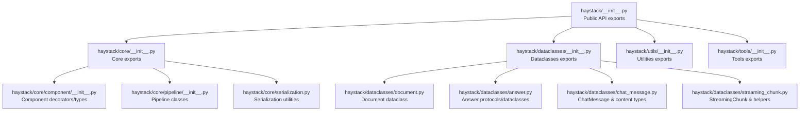
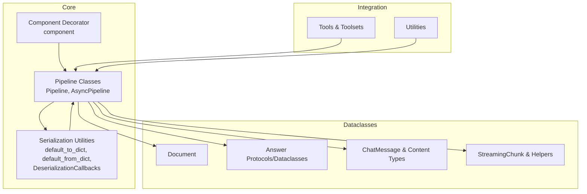
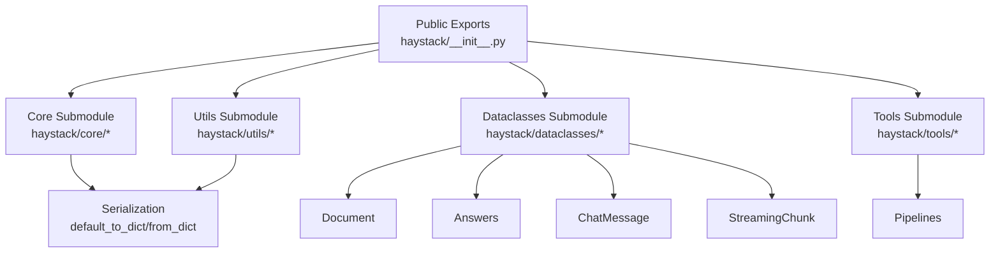

# API Reference

<cite>
**Referenced Files in This Document**
- [haystack/__init__.py](file://haystack/__init__.py)
- [haystack/core/__init__.py](file://haystack/core/__init__.py)
- [haystack/dataclasses/__init__.py](file://haystack/dataclasses/__init__.py)
- [haystack/utils/__init__.py](file://haystack/utils/__init__.py)
- [haystack/tools/__init__.py](file://haystack/tools/__init__.py)
- [haystack/core/component/__init__.py](file://haystack/core/component/__init__.py)
- [haystack/core/pipeline/__init__.py](file://haystack/core/pipeline/__init__.py)
- [haystack/core/serialization.py](file://haystack/core/serialization.py)
- [haystack/dataclasses/document.py](file://haystack/dataclasses/document.py)
- [haystack/dataclasses/answer.py](file://haystack/dataclasses/answer.py)
- [haystack/dataclasses/chat_message.py](file://haystack/dataclasses/chat_message.py)
- [haystack/dataclasses/streaming_chunk.py](file://haystack/dataclasses/streaming_chunk.py)
</cite>

## Table of Contents
1. [Introduction](#introduction)
2. [Project Structure](#project-structure)
3. [Core Components](#core-components)
4. [Architecture Overview](#architecture-overview)
5. [Detailed Component Analysis](#detailed-component-analysis)
6. [Dependency Analysis](#dependency-analysis)
7. [Performance Considerations](#performance-considerations)
8. [Troubleshooting Guide](#troubleshooting-guide)
9. [Conclusion](#conclusion)
10. [Appendices](#appendices)

## Introduction
This API Reference documents the Haystack framework’s public surface across core components, pipeline management, data classes, and utilities. It focuses on:
- Public classes, methods, functions, and data structures
- Parameter specifications, return values, exceptions, and usage patterns
- Serialization and deserialization APIs for component configuration
- Experimental APIs and stability guarantees
- Migration guidance for deprecated APIs
- Cross-references and search-friendly organization

## Project Structure
Haystack exposes a concise public API via top-level imports and organized subpackages. The primary entry point aggregates commonly used types and functions, while submodules group functionality by domain (core, dataclasses, tools, utils).

**Diagram sources**
- [haystack/__init__.py](file://haystack/__init__.py#L27-L41)
- [haystack/core/__init__.py](file://haystack/core/__init__.py#L5-L7)
- [haystack/dataclasses/__init__.py](file://haystack/dataclasses/__init__.py#L10-L37)
- [haystack/utils/__init__.py](file://haystack/utils/__init__.py#L10-L23)
- [haystack/tools/__init__.py](file://haystack/tools/__init__.py#L9-L16)
- [haystack/core/component/__init__.py](file://haystack/core/component/__init__.py#L5-L8)
- [haystack/core/pipeline/__init__.py](file://haystack/core/pipeline/__init__.py#L5-L8)
- [haystack/core/serialization.py](file://haystack/core/serialization.py#L177-L226)
- [haystack/dataclasses/document.py](file://haystack/dataclasses/document.py#L48-L71)
- [haystack/dataclasses/answer.py](file://haystack/dataclasses/answer.py#L28-L97)
- [haystack/dataclasses/chat_message.py](file://haystack/dataclasses/chat_message.py#L272-L391)
- [haystack/dataclasses/streaming_chunk.py](file://haystack/dataclasses/streaming_chunk.py#L107-L138)

**Section sources**
- [haystack/__init__.py](file://haystack/__init__.py#L27-L41)
- [haystack/core/__init__.py](file://haystack/core/__init__.py#L5-L7)
- [haystack/dataclasses/__init__.py](file://haystack/dataclasses/__init__.py#L10-L37)
- [haystack/utils/__init__.py](file://haystack/utils/__init__.py#L10-L23)
- [haystack/tools/__init__.py](file://haystack/tools/__init__.py#L9-L16)

## Core Components
This section documents the foundational building blocks exposed at the top-level API.

- Public exports include:
  - Pipelines: Pipeline, AsyncPipeline
  - Component system: component decorator, Component base, InputSocket, OutputSocket
  - Serialization: default_to_dict, default_from_dict, DeserializationCallbacks
  - Dataclasses: Answer, Document, ExtractedAnswer, GeneratedAnswer
  - Errors: ComponentError, DeserializationError
  - Super components: SuperComponent, super_component

Key usage patterns:
- Define components with the component decorator and connect them into pipelines
- Serialize and deserialize components and pipelines using default_to_dict/default_from_dict
- Work with standardized dataclasses for answers and documents

Example references:
- Pipeline creation and execution patterns are demonstrated in the pipelines documentation and examples
- Component definition and connection are covered in the components documentation

**Section sources**
- [haystack/__init__.py](file://haystack/__init__.py#L12-L41)
- [haystack/core/component/__init__.py](file://haystack/core/component/__init__.py#L5-L8)
- [haystack/core/pipeline/__init__.py](file://haystack/core/pipeline/__init__.py#L5-L8)
- [haystack/core/serialization.py](file://haystack/core/serialization.py#L41-L87)
- [haystack/dataclasses/__init__.py](file://haystack/dataclasses/__init__.py#L10-L37)

## Architecture Overview
The Haystack architecture centers around a component-based pipeline system with robust serialization/deserialization capabilities and a rich set of dataclasses for interoperability.

**Diagram sources**
- [haystack/core/component/__init__.py](file://haystack/core/component/__init__.py#L5-L8)
- [haystack/core/pipeline/__init__.py](file://haystack/core/pipeline/__init__.py#L5-L8)
- [haystack/core/serialization.py](file://haystack/core/serialization.py#L177-L226)
- [haystack/dataclasses/document.py](file://haystack/dataclasses/document.py#L48-L71)
- [haystack/dataclasses/answer.py](file://haystack/dataclasses/answer.py#L28-L97)
- [haystack/dataclasses/chat_message.py](file://haystack/dataclasses/chat_message.py#L272-L391)
- [haystack/dataclasses/streaming_chunk.py](file://haystack/dataclasses/streaming_chunk.py#L107-L138)
- [haystack/tools/__init__.py](file://haystack/tools/__init__.py#L9-L16)
- [haystack/utils/__init__.py](file://haystack/utils/__init__.py#L10-L23)

## Detailed Component Analysis

### Dataclasses: Document
- Purpose: Base data structure for documents with text, binary blobs, metadata, scores, and embeddings
- Key fields:
  - id: str
  - content: str | None
  - blob: ByteStream | None
  - meta: dict[str, Any]
  - score: float | None
  - embedding: list[float] | None
  - sparse_embedding: SparseEmbedding | None
- Methods:
  - to_dict(flatten: bool = True) -> dict[str, Any]
  - from_dict(data: dict[str, Any]) -> Document
  - content_type property (legacy compatibility)
- Notes:
  - Automatic conversion of legacy embedding types
  - Backward-compatible flattening/unflattening of metadata
  - In-place mutation warnings enabled

Usage patterns:
- Construct Documents with minimal fields; id is auto-generated if omitted
- Serialize to dict for persistence or transport; deserialize to restore objects
- Combine with pipelines for retrieval, embedding, and ranking tasks

**Section sources**
- [haystack/dataclasses/document.py](file://haystack/dataclasses/document.py#L48-L71)
- [haystack/dataclasses/document.py](file://haystack/dataclasses/document.py#L122-L143)
- [haystack/dataclasses/document.py](file://haystack/dataclasses/document.py#L146-L178)
- [haystack/dataclasses/document.py](file://haystack/dataclasses/document.py#L180-L190)

### Dataclasses: Answer Protocols and Dataclasses
- Answer (Protocol):
  - data: Any
  - query: str
  - meta: dict[str, Any]
  - to_dict() -> dict[str, Any]
  - from_dict(cls, data: dict[str, Any]) -> Answer
- ExtractedAnswer:
  - query: str
  - score: float
  - data: str | None
  - document: Document | None
  - context: str | None
  - document_offset: Span | None
  - context_offset: Span | None
  - meta: dict[str, Any]
  - Nested Span with start/end
  - to_dict(), from_dict()
- GeneratedAnswer:
  - data: str
  - query: str
  - documents: list[Document]
  - meta: dict[str, Any]
  - to_dict(), from_dict()

Usage patterns:
- Use ExtractedAnswer for extractive QA results with offsets
- Use GeneratedAnswer for generative answers with source documents
- Both support serialization/deserialization with nested Document and ChatMessage handling

**Section sources**
- [haystack/dataclasses/answer.py](file://haystack/dataclasses/answer.py#L13-L26)
- [haystack/dataclasses/answer.py](file://haystack/dataclasses/answer.py#L28-L97)
- [haystack/dataclasses/answer.py](file://haystack/dataclasses/answer.py#L98-L139)

### Dataclasses: ChatMessage and Content Types
- Roles: ChatRole (USER, SYSTEM, ASSISTANT, TOOL)
- Content types:
  - TextContent
  - ImageContent
  - FileContent
  - ReasoningContent
  - ToolCall
  - ToolCallResult
- ChatMessage:
  - Properties: role, meta, name, texts, text, tool_calls, tool_call, tool_call_results, tool_call_result, images, image, files, file, reasonings, reasoning
  - Class methods:
    - from_user(text|content_parts, meta, name)
    - from_system(text, meta, name)
    - from_assistant(text, meta, name, tool_calls, reasoning)
    - from_tool(tool_result, origin, error, meta)
  - Methods:
    - to_dict(), from_dict()
    - to_openai_dict_format(require_tool_call_ids)
    - is_from(role)

Migration note:
- Legacy init parameters (role, content, meta, name) are removed; use class methods to construct messages
- Accessing the content attribute raises an error; use text or specific content properties

**Section sources**
- [haystack/dataclasses/chat_message.py](file://haystack/dataclasses/chat_message.py#L22-L50)
- [haystack/dataclasses/chat_message.py](file://haystack/dataclasses/chat_message.py#L52-L75)
- [haystack/dataclasses/chat_message.py](file://haystack/dataclasses/chat_message.py#L77-L114)
- [haystack/dataclasses/chat_message.py](file://haystack/dataclasses/chat_message.py#L119-L168)
- [haystack/dataclasses/chat_message.py](file://haystack/dataclasses/chat_message.py#L170-L203)
- [haystack/dataclasses/chat_message.py](file://haystack/dataclasses/chat_message.py#L272-L391)
- [haystack/dataclasses/chat_message.py](file://haystack/dataclasses/chat_message.py#L452-L564)
- [haystack/dataclasses/chat_message.py](file://haystack/dataclasses/chat_message.py#L565-L657)
- [haystack/dataclasses/chat_message.py](file://haystack/dataclasses/chat_message.py#L658-L800)

### Dataclasses: StreamingChunk and Streaming Helpers
- StreamingChunk:
  - Fields: content, meta, component_info, index, tool_calls, tool_call_result, start, finish_reason, reasoning
  - Validation ensures only one of content/tool_calls/tool_call_result/reasoning is set; index required if any of the latter three are set
  - Methods: to_dict(), from_dict()
- ComponentInfo:
  - Fields: type, name
  - Methods: from_component(), to_dict(), from_dict()
- ToolCallDelta:
  - Fields: index, tool_name, arguments, id, extra
  - Methods: to_dict(), from_dict()
- select_streaming_callback():
  - Selects sync or async callback based on requirements and compatibility
  - Enforces callback signature compatibility

Usage patterns:
- Use StreamingChunk to represent incremental output from streaming generators
- Use ComponentInfo to track which component emitted a chunk
- Use select_streaming_callback to choose appropriate sync/async callbacks

**Section sources**
- [haystack/dataclasses/streaming_chunk.py](file://haystack/dataclasses/streaming_chunk.py#L107-L138)
- [haystack/dataclasses/streaming_chunk.py](file://haystack/dataclasses/streaming_chunk.py#L105-L103)
- [haystack/dataclasses/streaming_chunk.py](file://haystack/dataclasses/streaming_chunk.py#L19-L56)
- [haystack/dataclasses/streaming_chunk.py](file://haystack/dataclasses/streaming_chunk.py#L214-L244)

### Serialization and Deserialization APIs
- default_to_dict(obj, **init_parameters) -> dict[str, Any]
  - Serializes an object with type and init_parameters
  - Automatically serializes nested objects with to_dict()
- default_from_dict(cls, data: dict[str, Any]) -> T
  - Deserializes a dictionary to an object
  - Detects and deserializes Secret and ComponentDevice automatically
  - Supports fully qualified class names for nested objects
- component_to_dict(obj, name: str) -> dict[str, Any]
  - Converts a component instance to dict; validates allowed types
- component_from_dict(cls, data: dict[str, Any], name: str, callbacks: DeserializationCallbacks | None = None)
  - Creates a component instance from dict with optional pre-init callbacks
- DeserializationCallbacks:
  - component_pre_init: callback invoked before component initialization during deserialization
- import_class_by_name(fully_qualified_name: str) -> type[object]

Usage patterns:
- Implement to_dict/from_dict in custom components for full control
- Use default_to_dict/default_from_dict for standard serialization
- Leverage callbacks for dynamic parameter adjustments during deserialization

**Section sources**
- [haystack/core/serialization.py](file://haystack/core/serialization.py#L177-L226)
- [haystack/core/serialization.py](file://haystack/core/serialization.py#L250-L312)
- [haystack/core/serialization.py](file://haystack/core/serialization.py#L41-L87)
- [haystack/core/serialization.py](file://haystack/core/serialization.py#L139-L175)
- [haystack/core/serialization.py](file://haystack/core/serialization.py#L314-L336)

### Pipeline Management
- Pipeline:
  - Build and execute directed acyclic graphs of components
  - Connect inputs/outputs using InputSocket/OutputSocket
- AsyncPipeline:
  - Asynchronous counterpart for non-blocking execution
- Component decorator:
  - Register component classes with automatic schema inference

Usage patterns:
- Define components with @component and declare inputs/outputs
- Assemble pipelines declaratively and execute with run()
- Use AsyncPipeline for concurrent workloads

**Section sources**
- [haystack/core/pipeline/__init__.py](file://haystack/core/pipeline/__init__.py#L5-L8)
- [haystack/core/component/__init__.py](file://haystack/core/component/__init__.py#L5-L8)

### Tools and Toolsets
- Tool:
  - Base tool abstraction with validation and serialization
- Toolset and SearchableToolset:
  - Collections of tools with search capabilities
- ComponentTool and PipelineTool:
  - Bridges between Haystack components and tools
- Functions:
  - create_tool_from_function(), tool()
  - serialize_tools_or_toolset(), deserialize_tools_or_toolset_inplace()
  - flatten_tools_or_toolsets(), warm_up_tools()
  - ToolsType union type for flexible tool lists

Usage patterns:
- Wrap functions or components into tools for agent workflows
- Manage toolsets and search them for dynamic dispatch
- Serialize/deserialize tool configurations for persistence

**Section sources**
- [haystack/tools/__init__.py](file://haystack/tools/__init__.py#L9-L16)
- [haystack/tools/__init__.py](file://haystack/tools/__init__.py#L26-L40)

### Utilities
- Authentication and secrets:
  - Secret, deserialize_secrets_inplace()
- Azure integration:
  - default_azure_ad_token_provider()
- Type serialization:
  - serialize_type(), deserialize_type()
- Callable serialization:
  - serialize_callable(), deserialize_callable()
- Device management:
  - ComponentDevice, Device, DeviceMap, DeviceType
- Filters:
  - document_matches_filter(), raise_on_invalid_filter_syntax()
- Requests utilities:
  - request_with_retry(), async_request_with_retry()
- Jinja2 extensions:
  - Jinja2TimeExtension
- Misc:
  - expit(), expand_page_range()
- Jupyter detection:
  - is_in_jupyter()

Usage patterns:
- Use Secret for secure configuration values
- Manage device placement with ComponentDevice
- Apply filters to document metadata
- Retry network requests with built-in utilities

**Section sources**
- [haystack/utils/__init__.py](file://haystack/utils/__init__.py#L10-L23)

## Dependency Analysis
The public API is intentionally thin, aggregating core functionality from submodules. This promotes discoverability and reduces import overhead.

**Diagram sources**
- [haystack/__init__.py](file://haystack/__init__.py#L27-L41)
- [haystack/core/serialization.py](file://haystack/core/serialization.py#L177-L226)
- [haystack/dataclasses/document.py](file://haystack/dataclasses/document.py#L48-L71)
- [haystack/dataclasses/answer.py](file://haystack/dataclasses/answer.py#L28-L97)
- [haystack/dataclasses/chat_message.py](file://haystack/dataclasses/chat_message.py#L272-L391)
- [haystack/dataclasses/streaming_chunk.py](file://haystack/dataclasses/streaming_chunk.py#L107-L138)
- [haystack/tools/__init__.py](file://haystack/tools/__init__.py#L9-L16)
- [haystack/utils/__init__.py](file://haystack/utils/__init__.py#L10-L23)

**Section sources**
- [haystack/__init__.py](file://haystack/__init__.py#L27-L41)

## Performance Considerations
- Prefer default_to_dict/default_from_dict for efficient serialization of standard objects
- Avoid large payloads in tracing by relying on internal placeholders for images/files in trace serialization
- Use AsyncPipeline for concurrency-bound workloads
- Minimize unnecessary conversions between legacy and modern data types

## Troubleshooting Guide
Common issues and resolutions:
- Serialization errors:
  - Ensure only basic types are used in serialized data
  - Provide explicit init_parameters for custom components
- Deserialization errors:
  - Verify type field matches the target class
  - Ensure Secret and ComponentDevice are properly serialized
- ChatMessage errors:
  - Use class methods to construct messages; do not pass legacy init parameters
  - Access text or specific content properties instead of content attribute
- StreamingChunk validation:
  - Only one of content/tool_calls/tool_call_result/reasoning may be set
  - Index must be provided if any of the latter three are set

**Section sources**
- [haystack/core/serialization.py](file://haystack/core/serialization.py#L90-L125)
- [haystack/core/serialization.py](file://haystack/core/serialization.py#L284-L312)
- [haystack/dataclasses/chat_message.py](file://haystack/dataclasses/chat_message.py#L292-L319)
- [haystack/dataclasses/streaming_chunk.py](file://haystack/dataclasses/streaming_chunk.py#L139-L151)

## Conclusion
This API Reference outlines Haystack’s public interface, focusing on core components, pipelines, dataclasses, and utilities. It emphasizes serialization/deserialization, migration guidance, and practical usage patterns. For deeper integration examples and tutorials, consult the official documentation and examples.

## Appendices

### API Index by Module
- Core
  - component decorator, Component, InputSocket, OutputSocket
  - Pipeline, AsyncPipeline
  - default_to_dict, default_from_dict, DeserializationCallbacks
- Dataclasses
  - Document, Answer protocols/dataclasses, ChatMessage, StreamingChunk
- Tools
  - Tool, Toolset, SearchableToolset, ComponentTool, PipelineTool
  - create_tool_from_function, tool, serialize_tools_or_toolset, deserialize_tools_or_toolset_inplace
- Utilities
  - Secret, deserialize_secrets_inplace, default_azure_ad_token_provider
  - serialize_type, deserialize_type, serialize_callable, deserialize_callable
  - ComponentDevice, Device, DeviceMap, DeviceType
  - document_matches_filter, raise_on_invalid_filter_syntax
  - request_with_retry, async_request_with_retry
  - Jinja2TimeExtension
  - expit, expand_page_range
  - is_in_jupyter

**Section sources**
- [haystack/__init__.py](file://haystack/__init__.py#L27-L41)
- [haystack/dataclasses/__init__.py](file://haystack/dataclasses/__init__.py#L10-L37)
- [haystack/tools/__init__.py](file://haystack/tools/__init__.py#L26-L40)
- [haystack/utils/__init__.py](file://haystack/utils/__init__.py#L10-L23)