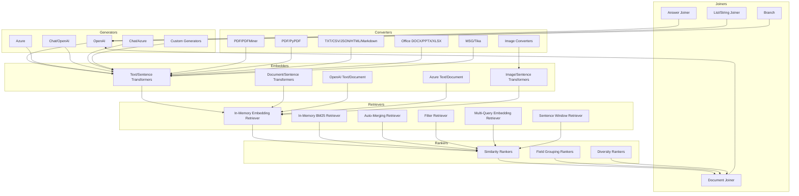
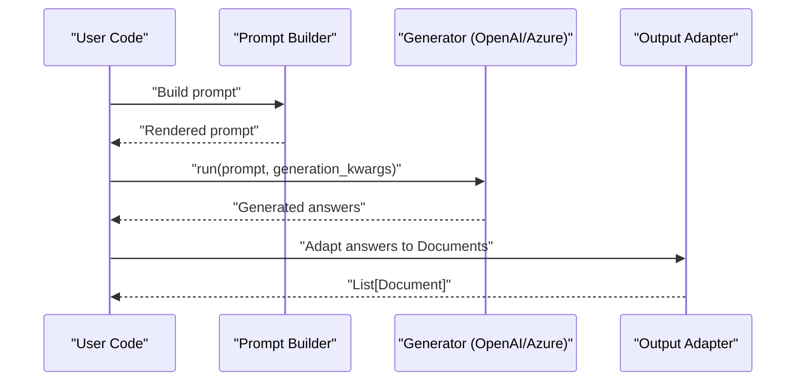
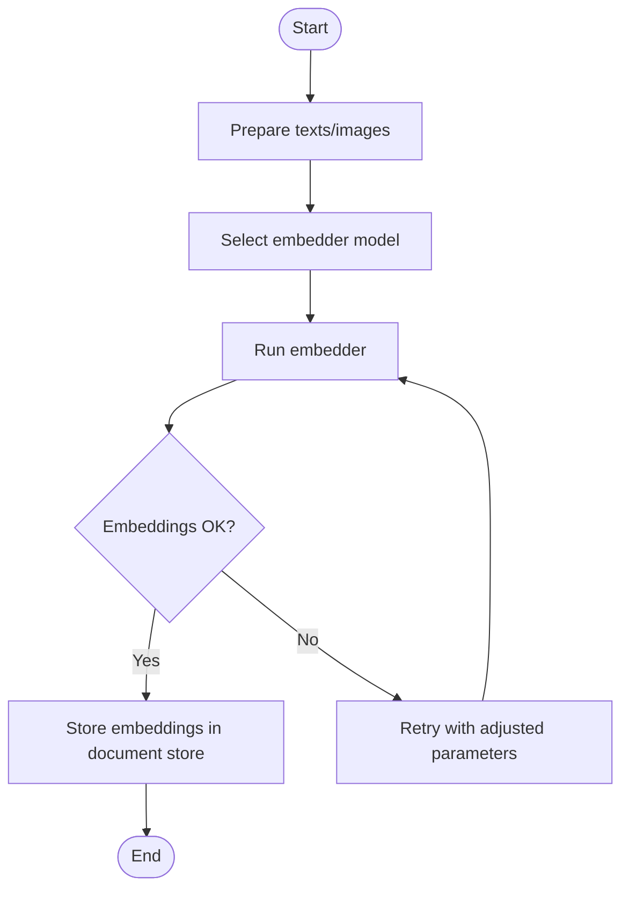
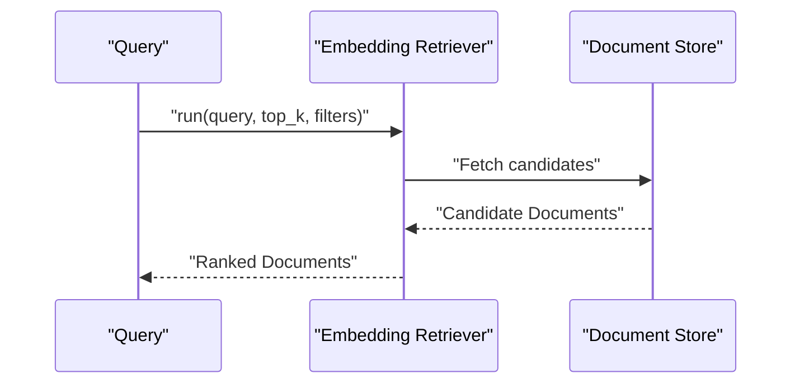
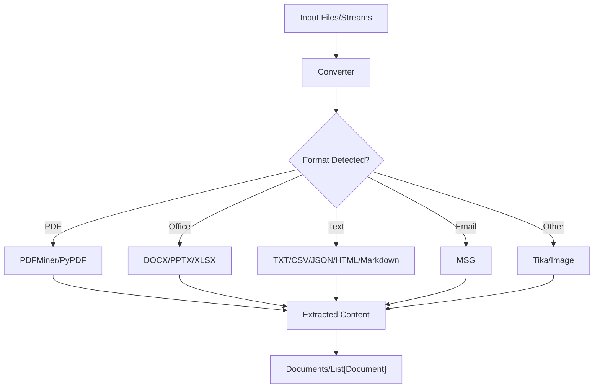
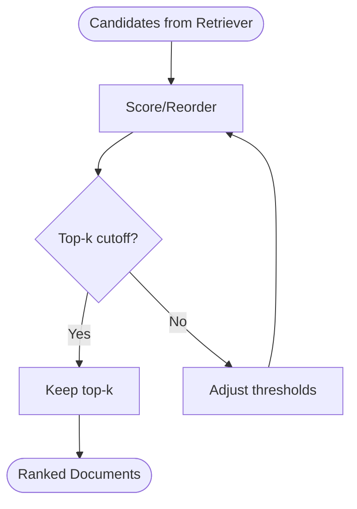
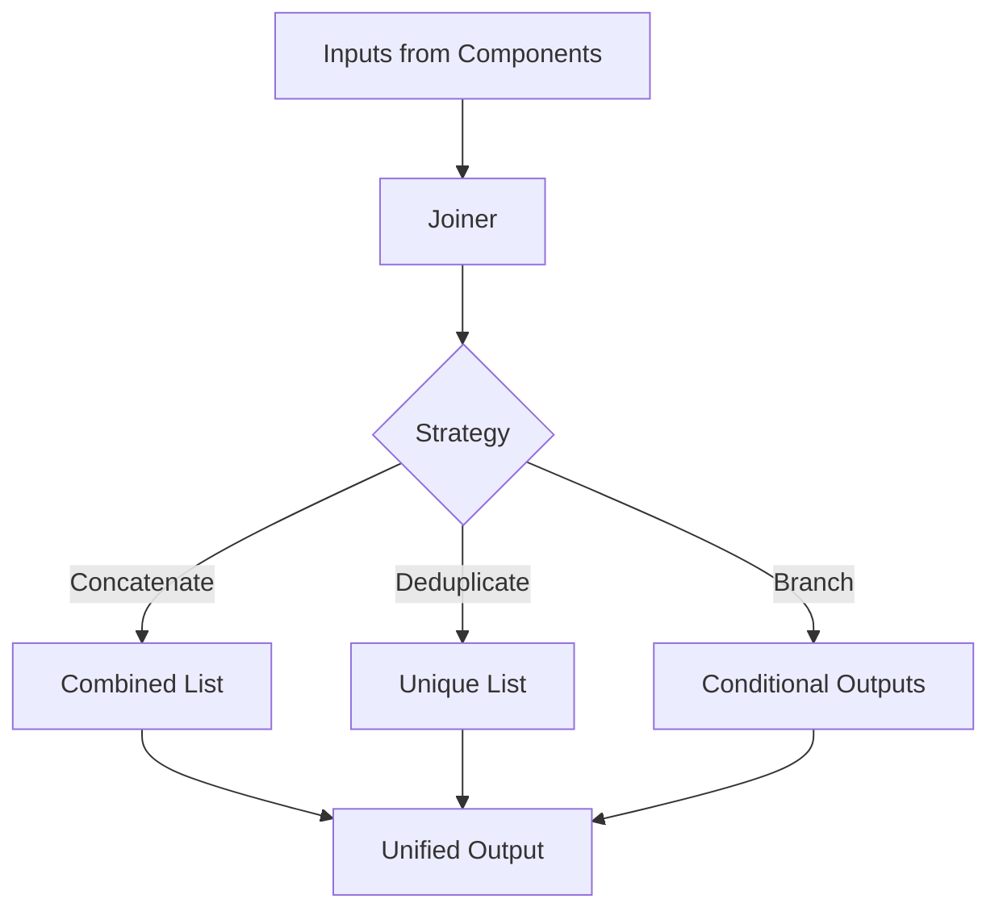
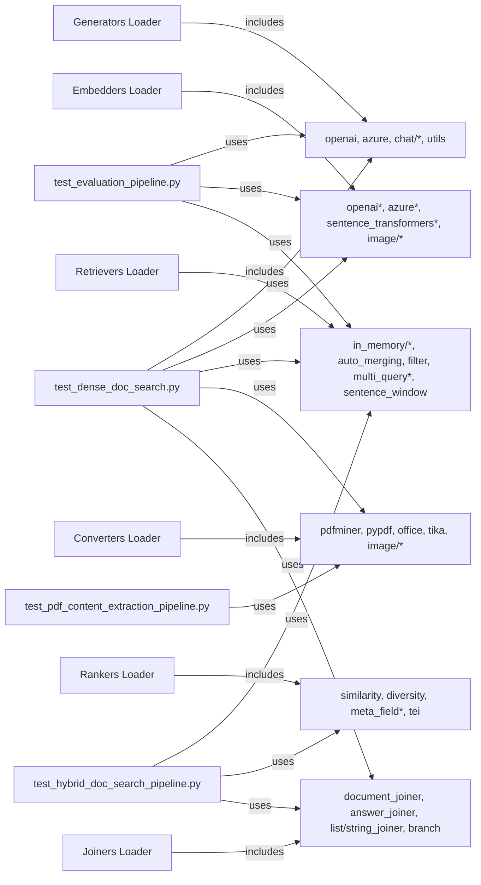

# Component APIs

<cite>
**Referenced Files in This Document**
- [haystack/__init__.py](file://haystack/__init__.py)
- [haystack/core/component/__init__.py](file://haystack/core/component/__init__.py)
- [pydoc/generators_api.yml](file://pydoc/generators_api.yml)
- [pydoc/embedders_api.yml](file://pydoc/embedders_api.yml)
- [pydoc/retrievers_api.yml](file://pydoc/retrievers_api.yml)
- [pydoc/converters_api.yml](file://pydoc/converters_api.yml)
- [pydoc/rankers_api.yml](file://pydoc/rankers_api.yml)
- [pydoc/joiners_api.yml](file://pydoc/joiners_api.yml)
- [pydoc/data_classes_api.yml](file://pydoc/data_classes_api.yml)
- [e2e/pipelines/test_dense_doc_search.py](file://e2e/pipelines/test_dense_doc_search.py)
- [e2e/pipelines/test_evaluation_pipeline.py](file://e2e/pipelines/test_evaluation_pipeline.py)
- [e2e/pipelines/test_hybrid_doc_search_pipeline.py](file://e2e/pipelines/test_hybrid_doc_search_pipeline.py)
- [e2e/pipelines/test_pdf_content_extraction_pipeline.py](file://e2e/pipelines/test_pdf_content_extraction_pipeline.py)
- [releasenotes/notes/add-dalle-image-generator-495aa11823e11a60.yaml](file://releasenotes/notes/add-dalle-image-generator-495aa11823e11a60.yaml)
</cite>

## Table of Contents
1. [Introduction](#introduction)
2. [Project Structure](#project-structure)
3. [Core Components](#core-components)
4. [Architecture Overview](#architecture-overview)
5. [Detailed Component Analysis](#detailed-component-analysis)
6. [Dependency Analysis](#dependency-analysis)
7. [Performance Considerations](#performance-considerations)
8. [Troubleshooting Guide](#troubleshooting-guide)
9. [Conclusion](#conclusion)
10. [Appendices](#appendices)

## Introduction
This document provides comprehensive API documentation for Haystack component categories. It covers generator APIs for text generation and chat completion (including OpenAI, Azure, and custom implementations), embedder APIs for text and image embeddings, retriever APIs for semantic and keyword search with vector store backends, converter APIs for file format processing and content extraction, ranker APIs for document scoring and similarity computation, and joiner APIs for result combination and data aggregation. For each category, we outline parameters, method signatures, return values, usage examples, and integration patterns. The content is grounded in the repository’s component loader configurations and end-to-end pipeline examples.

## Project Structure
Haystack organizes components by functional categories under a central registry. The documentation tooling defines loaders per category to generate API reference pages. The core component framework exposes decorators and types used across all components.

```mermaid
graph TB
subgraph "Documentation Tooling"
G["pydoc/generators_api.yml"]
E["pydoc/embedders_api.yml"]
R["pydoc/retrievers_api.yml"]
C["pydoc/converters_api.yml"]
K["pydoc/rankers_api.yml"]
J["pydoc/joiners_api.yml"]
D["pydoc/data_classes_api.yml"]
end
subgraph "Core"
CC["haystack/core/component/__init__.py"]
HI["haystack/__init__.py"]
end
subgraph "E2E Pipelines"
P1["test_dense_doc_search.py"]
P2["test_evaluation_pipeline.py"]
P3["test_hybrid_doc_search_pipeline.py"]
P4["test_pdf_content_extraction_pipeline.py"]
end
G --> |"loads"| CC
E --> |"loads"| CC
R --> |"loads"| CC
C --> |"loads"| CC
K --> |"loads"| CC
J --> |"loads"| CC
D --> |"documents"| CC
P1 --> |"uses"| CC
P2 --> |"uses"| CC
P3 --> |"uses"| CC
P4 --> |"uses"| CC
HI --> |"exposes"| CC
```

**Diagram sources**
- [pydoc/generators_api.yml](file://pydoc/generators_api.yml#L1-L29)
- [pydoc/embedders_api.yml](file://pydoc/embedders_api.yml#L1-L17)
- [pydoc/retrievers_api.yml](file://pydoc/retrievers_api.yml#L1-L16)
- [pydoc/converters_api.yml](file://pydoc/converters_api.yml#L1-L15)
- [pydoc/rankers_api.yml](file://pydoc/rankers_api.yml#L1-L14)
- [pydoc/joiners_api.yml](file://pydoc/joiners_api.yml#L1-L13)
- [pydoc/data_classes_api.yml](file://pydoc/data_classes_api.yml#L1-L14)
- [haystack/core/component/__init__.py](file://haystack/core/component/__init__.py#L1-L9)
- [haystack/__init__.py](file://haystack/__init__.py#L1-L42)
- [e2e/pipelines/test_dense_doc_search.py](file://e2e/pipelines/test_dense_doc_search.py#L1-L20)
- [e2e/pipelines/test_evaluation_pipeline.py](file://e2e/pipelines/test_evaluation_pipeline.py#L1-L25)
- [e2e/pipelines/test_hybrid_doc_search_pipeline.py](file://e2e/pipelines/test_hybrid_doc_search_pipeline.py#L1-L10)
- [e2e/pipelines/test_pdf_content_extraction_pipeline.py](file://e2e/pipelines/test_pdf_content_extraction_pipeline.py#L1-L15)

**Section sources**
- [pydoc/generators_api.yml](file://pydoc/generators_api.yml#L1-L29)
- [pydoc/embedders_api.yml](file://pydoc/embedders_api.yml#L1-L17)
- [pydoc/retrievers_api.yml](file://pydoc/retrievers_api.yml#L1-L16)
- [pydoc/converters_api.yml](file://pydoc/converters_api.yml#L1-L15)
- [pydoc/rankers_api.yml](file://pydoc/rankers_api.yml#L1-L14)
- [pydoc/joiners_api.yml](file://pydoc/joiners_api.yml#L1-L13)
- [pydoc/data_classes_api.yml](file://pydoc/data_classes_api.yml#L1-L14)
- [haystack/core/component/__init__.py](file://haystack/core/component/__init__.py#L1-L9)
- [haystack/__init__.py](file://haystack/__init__.py#L1-L42)

## Core Components
The core component framework provides the decorator and socket types used by all components. The top-level package re-exports essential types for user convenience.

- Decorator: component
  - Purpose: Marks a class as a Haystack component and registers its input/output interfaces.
  - Typical usage: Apply to a class implementing a component interface.
  - Section sources
    - [haystack/core/component/__init__.py](file://haystack/core/component/__init__.py#L5-L8)
    - [haystack/__init__.py](file://haystack/__init__.py#L12-L18)

- Input/Output Sockets
  - Purpose: Define typed input and output interfaces for components.
  - Typical usage: Declare inputs and outputs in a component class.
  - Section sources
    - [haystack/core/component/__init__.py](file://haystack/core/component/__init__.py#L6)

- Data Classes
  - Purpose: Carry structured data across the pipeline (e.g., Document, Answer, ChatMessage).
  - Typical usage: Inputs to generators, outputs from retrievers/embedders.
  - Section sources
    - [pydoc/data_classes_api.yml](file://pydoc/data_classes_api.yml#L1-L14)

## Architecture Overview
The Haystack pipeline composes components to form end-to-end workflows. Components are grouped by responsibility (generators, embedders, retrievers, converters, rankers, joiners). The documentation tooling enumerates modules per category to produce API references.

**Diagram sources**
- [pydoc/generators_api.yml](file://pydoc/generators_api.yml#L1-L29)
- [pydoc/embedders_api.yml](file://pydoc/embedders_api.yml#L1-L17)
- [pydoc/retrievers_api.yml](file://pydoc/retrievers_api.yml#L1-L16)
- [pydoc/converters_api.yml](file://pydoc/converters_api.yml#L1-L15)
- [pydoc/rankers_api.yml](file://pydoc/rankers_api.yml#L1-L14)
- [pydoc/joiners_api.yml](file://pydoc/joiners_api.yml#L1-L13)

## Detailed Component Analysis

### Generators API
Generators produce text or structured outputs from prompts. Supported providers include OpenAI, Azure, Hugging Face (local and API), and custom implementations. Chat variants support conversational histories.

Key capabilities:
- Text generation from prompts
- Chat completions with history
- Image generation via DALL‑E
- Custom generator implementations

Provider-specific modules:
- OpenAI: openai, chat/openai
- Azure: azure, chat/azure
- Hugging Face: hugging_face_api, hugging_face_local, chat/hugging_face_local, chat/hugging_face_api
- Utilities and fallbacks: utils, chat/fallback
- Image generation: openai_dalle

Typical parameters:
- Model identifiers
- Generation kwargs (e.g., temperature, max tokens, number of generations)
- Streaming options
- Provider-specific credentials and endpoints

Method signature pattern:
- run(prompt, generation_kwargs, streaming_callback, ...) -> dict-like result carrying generated answers

Return values:
- Generator outputs typically include generated text(s) and metadata (provider-specific)

Usage examples and integration patterns:
- End-to-end pipelines demonstrate generator usage with prompt builders, embedders, and adapters.
- Example references:
  - [test_dense_doc_search.py](file://e2e/pipelines/test_dense_doc_search.py#L36-L64)
  - [test_evaluation_pipeline.py](file://e2e/pipelines/test_evaluation_pipeline.py#L20)
  - [add-dalle-image-generator-495aa11823e11a60.yaml](file://releasenotes/notes/add-dalle-image-generator-495aa11823e11a60.yaml#L6-L12)

**Diagram sources**
- [e2e/pipelines/test_dense_doc_search.py](file://e2e/pipelines/test_dense_doc_search.py#L36-L64)
- [pydoc/generators_api.yml](file://pydoc/generators_api.yml#L1-L29)

**Section sources**
- [pydoc/generators_api.yml](file://pydoc/generators_api.yml#L1-L29)
- [e2e/pipelines/test_dense_doc_search.py](file://e2e/pipelines/test_dense_doc_search.py#L36-L64)
- [e2e/pipelines/test_evaluation_pipeline.py](file://e2e/pipelines/test_evaluation_pipeline.py#L20)
- [releasenotes/notes/add-dalle-image-generator-495aa11823e11a60.yaml](file://releasenotes/notes/add-dalle-image-generator-495aa11823e11a60.yaml#L1-L12)

### Embedders API
Embedders convert text or images into dense or sparse vectors suitable for retrieval and ranking.

Supported modules:
- Text/Sentence Transformers: sentence_transformers_text_embedder, sentence_transformers_sparse_text_embedder
- Document/Sentence Transformers: sentence_transformers_document_embedder, sentence_transformers_sparse_document_embedder
- Image/Sentence Transformers: image/sentence_transformers_doc_image_embedder
- OpenAI: openai_text_embedder, openai_document_embedder
- Azure: azure_text_embedder, azure_document_embedder
- Hugging Face: hugging_face_api_text_embedder, hugging_face_api_document_embedder

Typical parameters:
- Model identifiers
- Batch sizes
- Simultaneous requests limits
- Dimensions and normalization preferences
- Sparse vs dense embeddings

Method signature pattern:
- run(texts or images, meta) -> dict-like result with embeddings and optional metadata

Return values:
- Embeddings tensor/array and associated metadata

Usage examples and integration patterns:
- Embedders are used alongside converters and writers in end-to-end pipelines.
- Example references:
  - [test_dense_doc_search.py](file://e2e/pipelines/test_dense_doc_search.py#L61-L64)
  - [test_hybrid_doc_search_pipeline.py](file://e2e/pipelines/test_hybrid_doc_search_pipeline.py#L6-L7)

**Diagram sources**
- [pydoc/embedders_api.yml](file://pydoc/embedders_api.yml#L1-L17)
- [e2e/pipelines/test_dense_doc_search.py](file://e2e/pipelines/test_dense_doc_search.py#L61-L64)

**Section sources**
- [pydoc/embedders_api.yml](file://pydoc/embedders_api.yml#L1-L17)
- [e2e/pipelines/test_dense_doc_search.py](file://e2e/pipelines/test_dense_doc_search.py#L61-L64)
- [e2e/pipelines/test_hybrid_doc_search_pipeline.py](file://e2e/pipelines/test_hybrid_doc_search_pipeline.py#L6-L7)

### Retrievers API
Retrievers fetch candidate documents from a document store based on semantic similarity or keyword matching.

Supported modules:
- In-memory: embedding_retriever, bm25_retriever
- Advanced: auto_merging_retriever, filter_retriever, multi_query_embedding_retriever, multi_query_text_retriever, sentence_window_retriever

Typical parameters:
- Top-k candidates
- Filters for metadata
- Scale factors for scores
- Query weights for hybrid approaches

Method signature pattern:
- run(query, filters, top_k, scale_score) -> dict-like result with retrieved documents

Return values:
- Ordered list of Documents with scores

Usage examples and integration patterns:
- Retrievers integrate with embedders and rankers in hybrid and dense pipelines.
- Example references:
  - [test_dense_doc_search.py](file://e2e/pipelines/test_dense_doc_search.py#L11)
  - [test_hybrid_doc_search_pipeline.py](file://e2e/pipelines/test_hybrid_doc_search_pipeline.py#L8-L9)

**Diagram sources**
- [pydoc/retrievers_api.yml](file://pydoc/retrievers_api.yml#L1-L16)
- [e2e/pipelines/test_dense_doc_search.py](file://e2e/pipelines/test_dense_doc_search.py#L11)

**Section sources**
- [pydoc/retrievers_api.yml](file://pydoc/retrievers_api.yml#L1-L16)
- [e2e/pipelines/test_dense_doc_search.py](file://e2e/pipelines/test_dense_doc_search.py#L11)
- [e2e/pipelines/test_hybrid_doc_search_pipeline.py](file://e2e/pipelines/test_hybrid_doc_search_pipeline.py#L8-L9)

### Converters API
Converters transform files and streams into structured content (e.g., Documents) for downstream processing.

Supported modules:
- PDF: pdfminer, pypdf
- Office: docx, pptx, xlsx
- Plain text: txt, csv, json, html, markdown
- Email: msg
- Tika integration
- Image conversions: document_to_image, file_to_document, file_to_image, pdf_to_image

Typical parameters:
- File paths or streams
- Encoding options
- Page ranges
- Metadata extraction flags

Method signature pattern:
- run(sources, meta, remove_numeric_tables, ...) -> dict-like result with extracted content

Return values:
- List of Documents or image content

Usage examples and integration patterns:
- Converters feed into embedders and writers; pipelines combine multiple converters.
- Example references:
  - [test_pdf_content_extraction_pipeline.py](file://e2e/pipelines/test_pdf_content_extraction_pipeline.py#L9-L12)
  - [test_dense_doc_search.py](file://e2e/pipelines/test_dense_doc_search.py#L7-L8)

**Diagram sources**
- [pydoc/converters_api.yml](file://pydoc/converters_api.yml#L1-L15)
- [e2e/pipelines/test_pdf_content_extraction_pipeline.py](file://e2e/pipelines/test_pdf_content_extraction_pipeline.py#L9-L12)

**Section sources**
- [pydoc/converters_api.yml](file://pydoc/converters_api.yml#L1-L15)
- [e2e/pipelines/test_pdf_content_extraction_pipeline.py](file://e2e/pipelines/test_pdf_content_extraction_pipeline.py#L9-L12)
- [e2e/pipelines/test_dense_doc_search.py](file://e2e/pipelines/test_dense_doc_search.py#L7-L8)

### Rankers API
Rankers reorder and score documents returned by retrievers to improve relevance.

Supported modules:
- Similarity-based: sentence_transformers_similarity, transformers_similarity
- Diversity: sentence_transformers_diversity
- Field grouping: meta_field_grouping_ranker
- Lost-in-the-middle: lost_in_the_middle
- TEI: hugging_face_tei

Typical parameters:
- Top-k to return
- Relative scores vs absolute scores
- Grouping by metadata fields
- Diversity penalties

Method signature pattern:
- run(query, documents, top_k, reverse) -> dict-like result with ranked documents

Return values:
- Ranked Documents ordered by relevance

Usage examples and integration patterns:
- Rankers commonly follow retrievers in hybrid pipelines.
- Example references:
  - [test_hybrid_doc_search_pipeline.py](file://e2e/pipelines/test_hybrid_doc_search_pipeline.py#L8)

**Diagram sources**
- [pydoc/rankers_api.yml](file://pydoc/rankers_api.yml#L1-L14)
- [e2e/pipelines/test_hybrid_doc_search_pipeline.py](file://e2e/pipelines/test_hybrid_doc_search_pipeline.py#L8)

**Section sources**
- [pydoc/rankers_api.yml](file://pydoc/rankers_api.yml#L1-L14)
- [e2e/pipelines/test_hybrid_doc_search_pipeline.py](file://e2e/pipelines/test_hybrid_doc_search_pipeline.py#L8)

### Joiners API
Joiners combine lists of results from multiple components into unified outputs.

Supported modules:
- document_joiner
- answer_joiner
- list_joiner
- string_joiner
- branch

Typical parameters:
- Aggregation strategies
- Deduplication options
- Branch routing conditions

Method signature pattern:
- run(lists, sources, condition) -> unified output (e.g., list of Documents or Answers)

Return values:
- Combined results aggregated according to strategy

Usage examples and integration patterns:
- Joiners aggregate outputs from multiple retrievers or generators.
- Example references:
  - [test_dense_doc_search.py](file://e2e/pipelines/test_dense_doc_search.py#L9)
  - [test_hybrid_doc_search_pipeline.py](file://e2e/pipelines/test_hybrid_doc_search_pipeline.py#L7)

**Diagram sources**
- [pydoc/joiners_api.yml](file://pydoc/joiners_api.yml#L1-L13)
- [e2e/pipelines/test_dense_doc_search.py](file://e2e/pipelines/test_dense_doc_search.py#L9)
- [e2e/pipelines/test_hybrid_doc_search_pipeline.py](file://e2e/pipelines/test_hybrid_doc_search_pipeline.py#L7)

**Section sources**
- [pydoc/joiners_api.yml](file://pydoc/joiners_api.yml#L1-L13)
- [e2e/pipelines/test_dense_doc_search.py](file://e2e/pipelines/test_dense_doc_search.py#L9)
- [e2e/pipelines/test_hybrid_doc_search_pipeline.py](file://e2e/pipelines/test_hybrid_doc_search_pipeline.py#L7)

## Dependency Analysis
The loader configurations enumerate modules per category. These loaders are consumed by the documentation renderer to generate API pages. End-to-end pipelines demonstrate cross-category dependencies.

**Diagram sources**
- [pydoc/generators_api.yml](file://pydoc/generators_api.yml#L1-L29)
- [pydoc/embedders_api.yml](file://pydoc/embedders_api.yml#L1-L17)
- [pydoc/retrievers_api.yml](file://pydoc/retrievers_api.yml#L1-L16)
- [pydoc/converters_api.yml](file://pydoc/converters_api.yml#L1-L15)
- [pydoc/rankers_api.yml](file://pydoc/rankers_api.yml#L1-L14)
- [pydoc/joiners_api.yml](file://pydoc/joiners_api.yml#L1-L13)
- [e2e/pipelines/test_dense_doc_search.py](file://e2e/pipelines/test_dense_doc_search.py#L1-L15)
- [e2e/pipelines/test_evaluation_pipeline.py](file://e2e/pipelines/test_evaluation_pipeline.py#L1-L25)
- [e2e/pipelines/test_hybrid_doc_search_pipeline.py](file://e2e/pipelines/test_hybrid_doc_search_pipeline.py#L1-L10)
- [e2e/pipelines/test_pdf_content_extraction_pipeline.py](file://e2e/pipelines/test_pdf_content_extraction_pipeline.py#L1-L15)

**Section sources**
- [pydoc/generators_api.yml](file://pydoc/generators_api.yml#L1-L29)
- [pydoc/embedders_api.yml](file://pydoc/embedders_api.yml#L1-L17)
- [pydoc/retrievers_api.yml](file://pydoc/retrievers_api.yml#L1-L16)
- [pydoc/converters_api.yml](file://pydoc/converters_api.yml#L1-L15)
- [pydoc/rankers_api.yml](file://pydoc/rankers_api.yml#L1-L14)
- [pydoc/joiners_api.yml](file://pydoc/joiners_api.yml#L1-L13)
- [e2e/pipelines/test_dense_doc_search.py](file://e2e/pipelines/test_dense_doc_search.py#L1-L15)
- [e2e/pipelines/test_evaluation_pipeline.py](file://e2e/pipelines/test_evaluation_pipeline.py#L1-L25)
- [e2e/pipelines/test_hybrid_doc_search_pipeline.py](file://e2e/pipelines/test_hybrid_doc_search_pipeline.py#L1-L10)
- [e2e/pipelines/test_pdf_content_extraction_pipeline.py](file://e2e/pipelines/test_pdf_content_extraction_pipeline.py#L1-L15)

## Performance Considerations
- Batch processing: Prefer batched embedders and retrievers to reduce overhead.
- Model selection: Choose smaller models for rapid prototyping; scale to larger models for production quality.
- Caching: Warm up embedders and generators to avoid cold-start latency.
- Hybrid strategies: Combine BM25 and embedding retrievers to balance recall and precision.
- Streaming: Enable streaming for long-running generations to improve perceived latency.
- Memory: Use sentence-window retrievers to limit context size during reranking.

## Troubleshooting Guide
- Authentication failures: Verify provider keys and endpoint configurations for OpenAI, Azure, and third-party APIs.
- Dimension mismatches: Ensure embedder output dimensions match the document store backend expectations.
- Empty results: Increase top_k or adjust filters; confirm that converters are extracting content correctly.
- Slow performance: Reduce batch sizes, enable caching, and profile component latencies.
- Serialization errors: Confirm component serialization/deserialization compatibility when saving/loading pipelines.

## Conclusion
This guide summarized the Haystack component APIs across generators, embedders, retrievers, converters, rankers, and joiners. The loader configurations and end-to-end pipelines illustrate practical integration patterns. Use the referenced examples to bootstrap your own pipelines and adapt components to your specific needs.

## Appendices
- Provider quick references:
  - Generators: OpenAI, Azure, Hugging Face (API/local), DALL‑E image generation
  - Embedders: Sentence Transformers, OpenAI, Azure, Hugging Face, Image
  - Retrievers: In-memory embedding/BM25, Auto-merging, Filter, Multi-query, Sentence window
  - Converters: PDF (pdfminer/PyPDF), Office, Text formats, MSG, Tika, Image conversions
  - Rankers: Similarity, Diversity, Meta-field grouping, TEI
  - Joiners: Document, Answer, List/String, Branch