# Converter APIs

<cite>
**Referenced Files in This Document**
- [__init__.py](file://haystack/components/converters/__init__.py)
- [docx.py](file://haystack/components/converters/docx.py)
- [pdfminer.py](file://haystack/components/converters/pdfminer.py)
- [pypdf.py](file://haystack/components/converters/pypdf.py)
- [csv.py](file://haystack/components/converters/csv.py)
- [html.py](file://haystack/components/converters/html.py)
- [markdown.py](file://haystack/components/converters/markdown.py)
- [txt.py](file://haystack/components/converters/txt.py)
- [json.py](file://haystack/components/converters/json.py)
- [xlsx.py](file://haystack/components/converters/xlsx.py)
- [pptx.py](file://haystack/components/converters/pptx.py)
- [msg.py](file://haystack/components/converters/msg.py)
- [multi_file_converter.py](file://haystack/components/converters/multi_file_converter.py)
- [converters_api.yml](file://pydoc/converters_api.yml)
</cite>

## Table of Contents
1. [Introduction](#introduction)
2. [Project Structure](#project-structure)
3. [Core Components](#core-components)
4. [Architecture Overview](#architecture-overview)
5. [Detailed Component Analysis](#detailed-component-analysis)
6. [Dependency Analysis](#dependency-analysis)
7. [Performance Considerations](#performance-considerations)
8. [Troubleshooting Guide](#troubleshooting-guide)
9. [Conclusion](#conclusion)
10. [Appendices](#appendices)

## Introduction
This document provides detailed API documentation for Haystack Converter components that transform files into Documents. It covers file format processing APIs for PDF, DOCX, XLSX, CSV, HTML, Markdown, TXT, JSON, PPTX, MSG, and multi-modal scenarios. It explains content extraction methods, metadata preservation, and multi-file conversion patterns. It also includes method signatures for file-to-document conversion, image processing, and specialized converters such as Azure OCR and Tika integration, along with examples, handling of complex layouts, and preservation of document structure. Finally, it documents converter chaining patterns and custom converter development guidelines.

## Project Structure
The converters are organized under the converters package. The package exposes a lazy importer that dynamically imports specific converter modules. The pydoc configuration defines the modules included in the converters API reference.

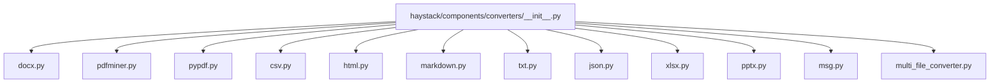

**Diagram sources**
- [__init__.py](file://haystack/components/converters/__init__.py#L10-L28)
- [docx.py](file://haystack/components/converters/docx.py#L119-L194)
- [pdfminer.py](file://haystack/components/converters/pdfminer.py#L26-L158)
- [pypdf.py](file://haystack/components/converters/pypdf.py#L50-L173)
- [csv.py](file://haystack/components/converters/csv.py#L20-L80)
- [html.py](file://haystack/components/converters/html.py#L20-L74)
- [markdown.py](file://haystack/components/converters/markdown.py#L24-L60)
- [txt.py](file://haystack/components/converters/txt.py#L16-L53)
- [json.py](file://haystack/components/converters/json.py#L21-L98)
- [xlsx.py](file://haystack/components/converters/xlsx.py#L25-L91)
- [pptx.py](file://haystack/components/converters/pptx.py#L23-L107)
- [msg.py](file://haystack/components/converters/msg.py#L22-L133)
- [multi_file_converter.py](file://haystack/components/converters/multi_file_converter.py#L37-L124)

**Section sources**
- [__init__.py](file://haystack/components/converters/__init__.py#L10-L50)
- [converters_api.yml](file://pydoc/converters_api.yml#L1-L15)

## Core Components
This section summarizes the primary converter components and their responsibilities.

- DOCXToDocument: Converts DOCX files to Documents, supporting table extraction (CSV or Markdown) and link formatting (Markdown, plain, none).
- PyPDFToDocument: Converts PDF files to Documents using PyPDF, with plain and layout extraction modes.
- PDFMinerToDocument: Converts PDF files to Documents using PDFMiner, with configurable layout analysis parameters and CID character detection.
- CSVToDocument: Converts CSV files to Documents, supporting file mode and row mode with content column selection.
- HTMLToDocument: Converts HTML files to Documents using Trafilatura, with customizable extraction parameters.
- MarkdownToDocument: Converts Markdown files to Documents using markdown-it with optional table normalization.
- TextFileToDocument: Converts generic text files to Documents with configurable encoding.
- JSONConverter: Converts JSON files to Documents with jq filtering and content/meta extraction.
- XLSXToDocument: Converts Excel files to Documents, supporting CSV or Markdown table formats and hyperlink handling.
- PPTXToDocument: Converts PowerPoint files to Documents, with hyperlink formatting options.
- MSGToDocument: Converts Outlook MSG files to Documents and extracts attachments.
- MultiFileConverter: Super component orchestrating multiple file types through routing and joining.

**Section sources**
- [docx.py](file://haystack/components/converters/docx.py#L119-L194)
- [pypdf.py](file://haystack/components/converters/pypdf.py#L50-L173)
- [pdfminer.py](file://haystack/components/converters/pdfminer.py#L26-L158)
- [csv.py](file://haystack/components/converters/csv.py#L20-L80)
- [html.py](file://haystack/components/converters/html.py#L20-L74)
- [markdown.py](file://haystack/components/converters/markdown.py#L24-L60)
- [txt.py](file://haystack/components/converters/txt.py#L16-L53)
- [json.py](file://haystack/components/converters/json.py#L21-L98)
- [xlsx.py](file://haystack/components/converters/xlsx.py#L25-L91)
- [pptx.py](file://haystack/components/converters/pptx.py#L23-L107)
- [msg.py](file://haystack/components/converters/msg.py#L22-L133)
- [multi_file_converter.py](file://haystack/components/converters/multi_file_converter.py#L37-L124)

## Architecture Overview
The converters share a common pattern: they accept a list of sources (paths, Paths, or ByteStreams), normalize metadata, extract content, and produce Documents. Some converters (e.g., MultiFileConverter) orchestrate multiple converters behind a routing and joining pipeline.

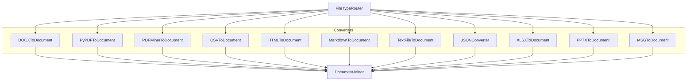

**Diagram sources**
- [multi_file_converter.py](file://haystack/components/converters/multi_file_converter.py#L73-L124)

## Detailed Component Analysis

### DOCXToDocument
- Purpose: Convert DOCX files to Documents with table and link formatting options.
- Key parameters:
  - table_format: "csv" or "markdown"
  - link_format: "markdown", "plain", or "none"
  - store_full_path: whether to keep full path in metadata
- Method signature: run(sources: list[str | Path | ByteStream], meta: dict | list[dict] | None = None) -> dict[str, list[Document]]
- Metadata: Merges ByteStream meta, provided meta, and DOCX core properties into a nested "docx" field.
- Notes: Preserves page breaks using form feed delimiters; supports hyperlink formatting in paragraphs.

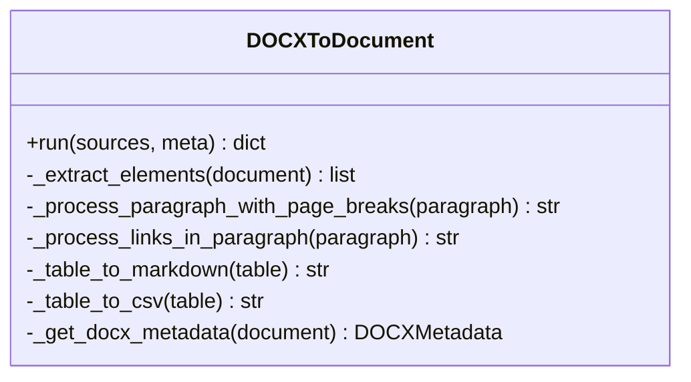

**Diagram sources**
- [docx.py](file://haystack/components/converters/docx.py#L119-L194)
- [docx.py](file://haystack/components/converters/docx.py#L245-L404)

**Section sources**
- [docx.py](file://haystack/components/converters/docx.py#L119-L194)
- [docx.py](file://haystack/components/converters/docx.py#L245-L404)

### PyPDFToDocument
- Purpose: Convert PDF files to Documents using PyPDF.
- Key parameters:
  - extraction_mode: "plain" or "layout"
  - plain_mode_orientations, plain_mode_space_width
  - layout_mode_space_vertically, layout_mode_scale_weight, layout_mode_strip_rotated, layout_mode_font_height_weight
  - store_full_path
- Method signature: run(sources: list[str | Path | ByteStream], meta: dict | list[dict] | None = None) -> dict[str, list[Document]]
- Metadata: Merges ByteStream meta and provided meta; optionally shortens file_path.

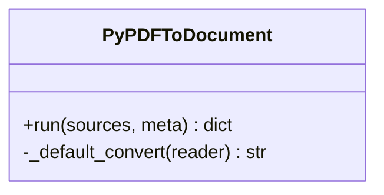

**Diagram sources**
- [pypdf.py](file://haystack/components/converters/pypdf.py#L50-L173)

**Section sources**
- [pypdf.py](file://haystack/components/converters/pypdf.py#L50-L173)

### PDFMinerToDocument
- Purpose: Convert PDF files to Documents using PDFMiner with configurable layout analysis.
- Key parameters:
  - line_overlap, char_margin, line_margin, word_margin, boxes_flow, detect_vertical, all_texts
  - store_full_path
- Method signature: run(sources: list[str | Path | ByteStream], meta: dict | list[dict] | None = None) -> dict[str, list[Document]]
- Utilities: detect_undecoded_cid_characters(text) -> dict

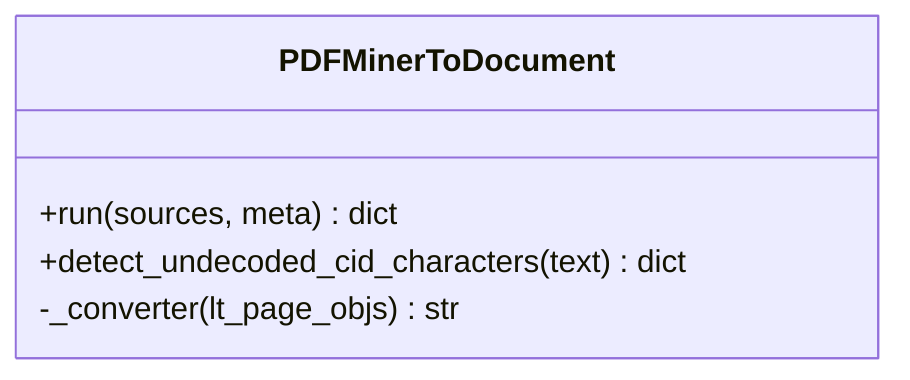

**Diagram sources**
- [pdfminer.py](file://haystack/components/converters/pdfminer.py#L26-L158)

**Section sources**
- [pdfminer.py](file://haystack/components/converters/pdfminer.py#L26-L158)

### CSVToDocument
- Purpose: Convert CSV files to Documents with file or row mode.
- Key parameters:
  - encoding, store_full_path
  - conversion_mode: "file" or "row"
  - delimiter, quotechar
  - content_column (required in row mode)
- Method signature: run(sources: list[str | Path | ByteStream], content_column: str | None = None, meta: dict | list[dict] | None = None) -> dict[str, list[Document]]

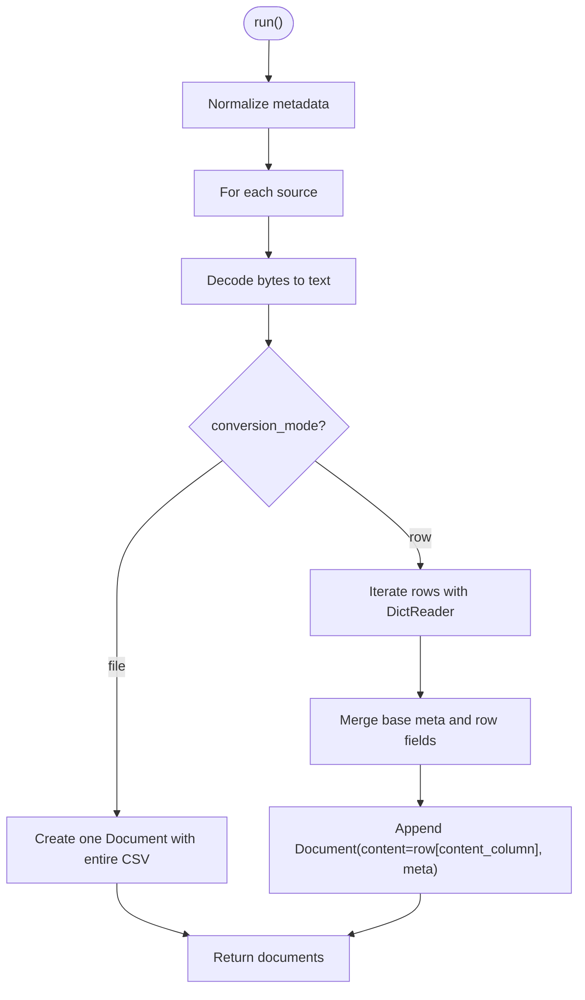

**Diagram sources**
- [csv.py](file://haystack/components/converters/csv.py#L80-L184)

**Section sources**
- [csv.py](file://haystack/components/converters/csv.py#L20-L80)
- [csv.py](file://haystack/components/converters/csv.py#L80-L184)

### HTMLToDocument
- Purpose: Convert HTML files to Documents using Trafilatura.
- Key parameters:
  - extraction_kwargs: forwarded to Trafilatura extract()
  - store_full_path
- Method signature: run(sources: list[str | Path | ByteStream], meta: dict | list[dict] | None = None, extraction_kwargs: dict | None = None) -> dict[str, list[Document]]

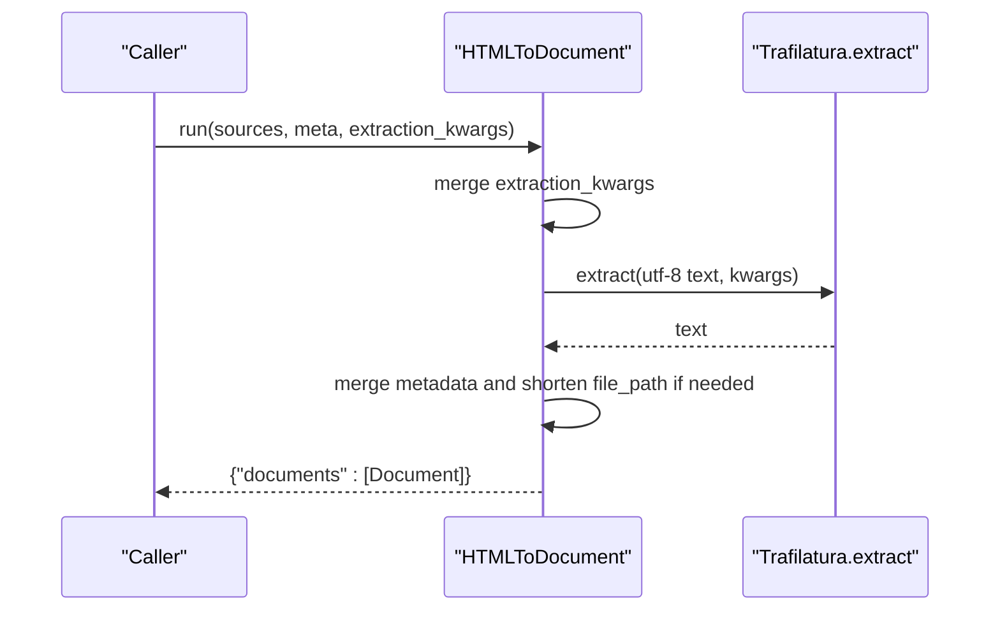

**Diagram sources**
- [html.py](file://haystack/components/converters/html.py#L74-L133)

**Section sources**
- [html.py](file://haystack/components/converters/html.py#L20-L74)
- [html.py](file://haystack/components/converters/html.py#L74-L133)

### MarkdownToDocument
- Purpose: Convert Markdown files to plain text Documents using markdown-it.
- Key parameters:
  - table_to_single_line: enable table flattening
  - progress_bar: show progress
  - store_full_path
- Method signature: run(sources: list[str | Path | ByteStream], meta: dict | list[dict] | None = None) -> dict[str, list[Document]]

**Section sources**
- [markdown.py](file://haystack/components/converters/markdown.py#L24-L60)
- [markdown.py](file://haystack/components/converters/markdown.py#L60-L117)

### TextFileToDocument
- Purpose: Convert generic text files to Documents with encoding handling.
- Key parameters:
  - encoding (overrides ByteStream meta if present)
  - store_full_path
- Method signature: run(sources: list[str | Path | ByteStream], meta: dict | list[dict] | None = None) -> dict[str, list[Document]]

**Section sources**
- [txt.py](file://haystack/components/converters/txt.py#L16-L53)
- [txt.py](file://haystack/components/converters/txt.py#L53-L98)

### JSONConverter
- Purpose: Convert JSON files to Documents with jq filtering and content/meta extraction.
- Key parameters:
  - jq_schema: jq filter string
  - content_key: key to use as Document.content
  - extra_meta_fields: set of keys or "*" to include in meta
  - store_full_path
- Method signature: run(sources: list[str | Path | ByteStream], meta: dict | list[dict] | None = None) -> dict[str, list[Document]]

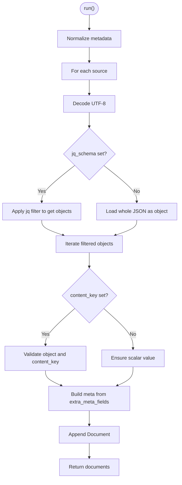

**Diagram sources**
- [json.py](file://haystack/components/converters/json.py#L249-L287)

**Section sources**
- [json.py](file://haystack/components/converters/json.py#L21-L98)
- [json.py](file://haystack/components/converters/json.py#L249-L287)

### XLSXToDocument
- Purpose: Convert Excel files to Documents, preserving tables as CSV or Markdown and optionally formatting hyperlinks.
- Key parameters:
  - table_format: "csv" or "markdown"
  - sheet_name: specific sheet(s) or all
  - read_excel_kwargs, table_format_kwargs
  - link_format: "markdown", "plain", or "none"
  - store_full_path
- Method signature: run(sources: list[str | Path | ByteStream], meta: dict | list[dict] | None = None) -> dict[str, list[Document]]

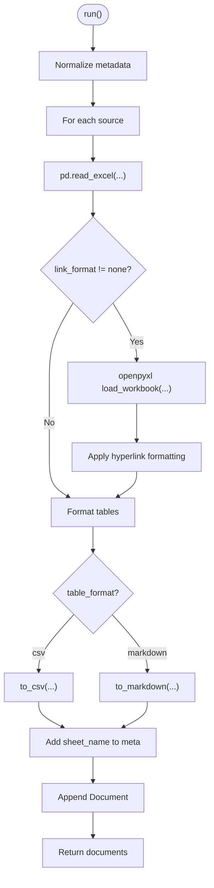

**Diagram sources**
- [xlsx.py](file://haystack/components/converters/xlsx.py#L91-L143)
- [xlsx.py](file://haystack/components/converters/xlsx.py#L157-L232)

**Section sources**
- [xlsx.py](file://haystack/components/converters/xlsx.py#L25-L91)
- [xlsx.py](file://haystack/components/converters/xlsx.py#L91-L143)
- [xlsx.py](file://haystack/components/converters/xlsx.py#L157-L232)

### PPTXToDocument
- Purpose: Convert PowerPoint presentations to Documents, with hyperlink formatting options.
- Key parameters:
  - store_full_path
  - link_format: "markdown", "plain", or "none"
- Method signature: run(sources: list[str | Path | ByteStream], meta: dict | list[dict] | None = None) -> dict[str, list[Document]]

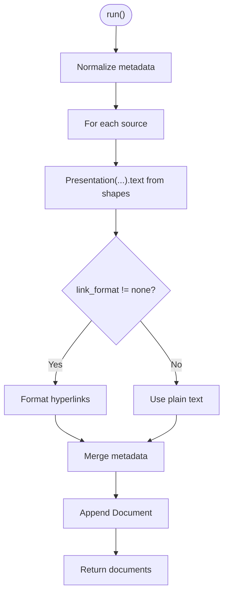

**Diagram sources**
- [pptx.py](file://haystack/components/converters/pptx.py#L107-L149)

**Section sources**
- [pptx.py](file://haystack/components/converters/pptx.py#L23-L107)
- [pptx.py](file://haystack/components/converters/pptx.py#L107-L149)

### MSGToDocument
- Purpose: Convert Outlook MSG files to Documents and extract attachments as ByteStream objects.
- Key parameters:
  - store_full_path
- Method signature: run(sources: list[str | Path | ByteStream], meta: dict | list[dict] | None = None) -> dict[str, list[Document] | list[ByteStream]]

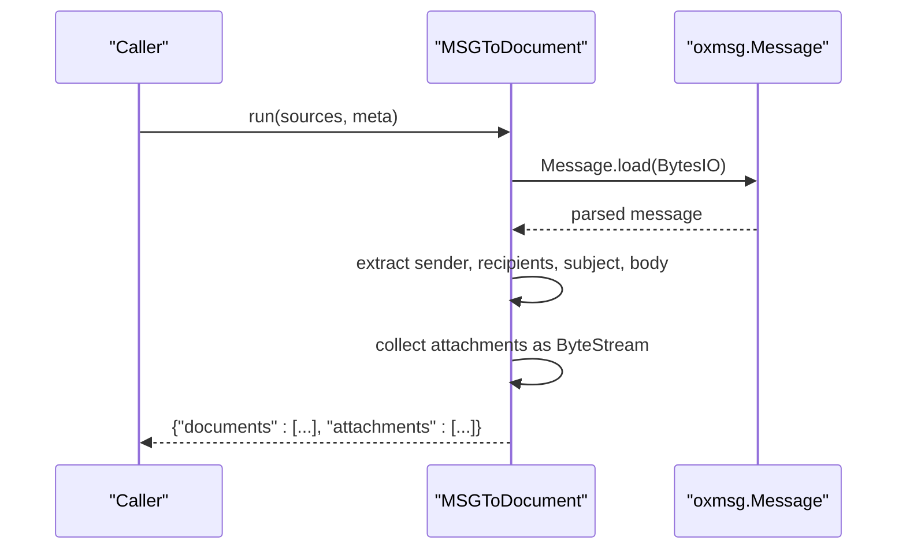

**Diagram sources**
- [msg.py](file://haystack/components/converters/msg.py#L133-L192)

**Section sources**
- [msg.py](file://haystack/components/converters/msg.py#L22-L133)
- [msg.py](file://haystack/components/converters/msg.py#L133-L192)

### MultiFileConverter
- Purpose: Super component that routes heterogeneous sources to appropriate converters and joins outputs.
- Key parameters:
  - encoding: default encoding for text-like conversions
  - json_content_key: default content key for JSON conversion
- Orchestrates:
  - FileTypeRouter with MIME types for CSV, DOCX, HTML, JSON, MD, TEXT, PDF, PPTX, XLSX
  - Individual converters: DOCXToDocument, HTMLToDocument, JSONConverter, TextFileToDocument, PyPDFToDocument, PPTXToDocument, XLSXToDocument, CSVToDocument
  - DocumentJoiner to unify outputs

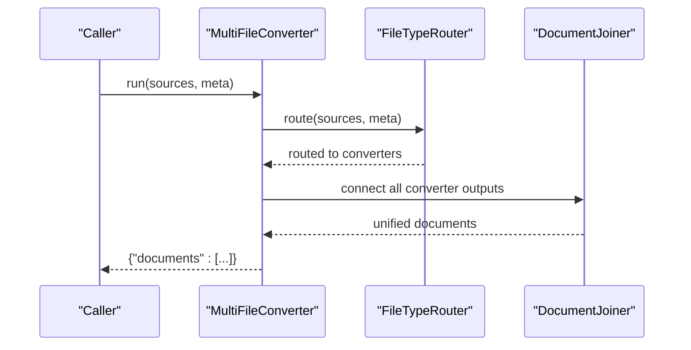

**Diagram sources**
- [multi_file_converter.py](file://haystack/components/converters/multi_file_converter.py#L37-L124)

**Section sources**
- [multi_file_converter.py](file://haystack/components/converters/multi_file_converter.py#L24-L124)

## Dependency Analysis
- Shared utilities: All converters rely on get_bytestream_from_source and normalize_metadata for robust input handling and metadata merging.
- External libraries:
  - DOCXToDocument: python-docx
  - PDFMinerToDocument: pdfminer.six
  - PyPDFToDocument: pypdf
  - HTMLToDocument: trafilatura
  - MarkdownToDocument: markdown-it + mdit_plain
  - JSONConverter: jq
  - XLSXToDocument: pandas + openpyxl + tabulate
  - PPTXToDocument: python-pptx
  - MSGToDocument: python-oxmsg

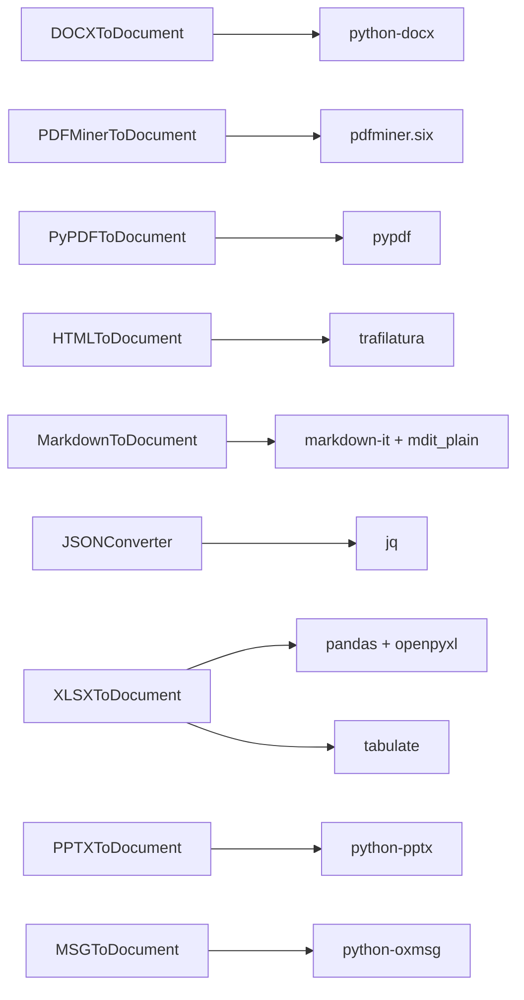

**Diagram sources**
- [docx.py](file://haystack/components/converters/docx.py#L21-L28)
- [pdfminer.py](file://haystack/components/converters/pdfminer.py#L17-L20)
- [pypdf.py](file://haystack/components/converters/pypdf.py#L16-L18)
- [html.py](file://haystack/components/converters/html.py#L16-L18)
- [markdown.py](file://haystack/components/converters/markdown.py#L16-L19)
- [json.py](file://haystack/components/converters/json.py#L17-L19)
- [xlsx.py](file://haystack/components/converters/xlsx.py#L17-L23)
- [pptx.py](file://haystack/components/converters/pptx.py#L15-L17)
- [msg.py](file://haystack/components/converters/msg.py#L15-L17)

**Section sources**
- [docx.py](file://haystack/components/converters/docx.py#L14-L28)
- [pdfminer.py](file://haystack/components/converters/pdfminer.py#L12-L20)
- [pypdf.py](file://haystack/components/converters/pypdf.py#L11-L18)
- [html.py](file://haystack/components/converters/html.py#L9-L18)
- [markdown.py](file://haystack/components/converters/markdown.py#L11-L19)
- [json.py](file://haystack/components/converters/json.py#L10-L19)
- [xlsx.py](file://haystack/components/converters/xlsx.py#L10-L23)
- [pptx.py](file://haystack/components/converters/pptx.py#L10-L17)
- [msg.py](file://haystack/components/converters/msg.py#L10-L17)

## Performance Considerations
- CSV row mode can be memory-intensive for large files; a warning is emitted for files exceeding a threshold.
- PDFMiner and PyPDF extraction parameters influence accuracy and speed; tune layout parameters and extraction modes accordingly.
- XLSX conversion with Markdown tables requires tabulate; ensure dependencies are installed for optimal performance.
- HTML extraction via Trafilatura can be CPU-intensive for large documents; consider limiting included elements via extraction_kwargs.
- MultiFileConverter pipelines add overhead from routing and joining; batch sources appropriately.

[No sources needed since this section provides general guidance]

## Troubleshooting Guide
- Empty or missing content:
  - PDFMinerToDocument and PyPDFToDocument log warnings when no text is extracted; verify font encoding and layout parameters.
  - CSV row mode requires content_column; ensure the column exists in the header.
- Encoding issues:
  - TextFileToDocument and CSVToDocument honor ByteStream meta encoding; ensure ByteStream meta is set correctly.
- Unsupported formats:
  - MultiFileConverter routes by MIME type; ensure file extensions are recognized or provide ByteStream with proper mime_type.
- Encrypted MSG files:
  - MSGToDocument raises an error for encrypted messages; decrypt or handle separately.

**Section sources**
- [pdfminer.py](file://haystack/components/converters/pdfminer.py#L196-L201)
- [pypdf.py](file://haystack/components/converters/pypdf.py#L209-L214)
- [csv.py](file://haystack/components/converters/csv.py#L143-L146)
- [msg.py](file://haystack/components/converters/msg.py#L90-L92)

## Conclusion
Haystack’s Converter components provide a comprehensive toolkit for transforming diverse file formats into Documents while preserving metadata and enabling complex layouts. The shared API pattern, robust metadata handling, and pipeline-friendly design facilitate reliable preprocessing in retrieval pipelines. MultiFileConverter simplifies heterogeneous file ingestion, while specialized converters offer fine-grained control over extraction quality and output formats.

[No sources needed since this section summarizes without analyzing specific files]

## Appendices

### API Reference Index
- DOCXToDocument: [docx.py](file://haystack/components/converters/docx.py#L119-L194)
- PyPDFToDocument: [pypdf.py](file://haystack/components/converters/pypdf.py#L50-L173)
- PDFMinerToDocument: [pdfminer.py](file://haystack/components/converters/pdfminer.py#L26-L158)
- CSVToDocument: [csv.py](file://haystack/components/converters/csv.py#L20-L80)
- HTMLToDocument: [html.py](file://haystack/components/converters/html.py#L20-L74)
- MarkdownToDocument: [markdown.py](file://haystack/components/converters/markdown.py#L24-L60)
- TextFileToDocument: [txt.py](file://haystack/components/converters/txt.py#L16-L53)
- JSONConverter: [json.py](file://haystack/components/converters/json.py#L21-L98)
- XLSXToDocument: [xlsx.py](file://haystack/components/converters/xlsx.py#L25-L91)
- PPTXToDocument: [pptx.py](file://haystack/components/converters/pptx.py#L23-L107)
- MSGToDocument: [msg.py](file://haystack/components/converters/msg.py#L22-L133)
- MultiFileConverter: [multi_file_converter.py](file://haystack/components/converters/multi_file_converter.py#L37-L124)

### Specialized Converters
- Azure OCR Document Converter: [azure.py](file://haystack/components/converters/azure.py#L29-L120)
- Tika Document Converter: [tika.py](file://haystack/components/converters/tika.py#L52-L180)

**Section sources**
- [__init__.py](file://haystack/components/converters/__init__.py#L10-L28)
- [converters_api.yml](file://pydoc/converters_api.yml#L1-L15)