# File Format Converters

<cite>
**Referenced Files in This Document**
- [__init__.py](file://haystack/components/converters/__init__.py)
- [pdfminer.py](file://haystack/components/converters/pdfminer.py)
- [pypdf.py](file://haystack/components/converters/pypdf.py)
- [docx.py](file://haystack/components/converters/docx.py)
- [xlsx.py](file://haystack/components/converters/xlsx.py)
- [csv.py](file://haystack/components/converters/csv.py)
- [html.py](file://haystack/components/converters/html.py)
- [markdown.py](file://haystack/components/converters/markdown.py)
- [json.py](file://haystack/components/converters/json.py)
- [msg.py](file://haystack/components/converters/msg.py)
- [txt.py](file://haystack/components/converters/txt.py)
- [pptx.py](file://haystack/components/converters/pptx.py)
</cite>

## Table of Contents
1. [Introduction](#introduction)
2. [Project Structure](#project-structure)
3. [Core Components](#core-components)
4. [Architecture Overview](#architecture-overview)
5. [Detailed Component Analysis](#detailed-component-analysis)
6. [Dependency Analysis](#dependency-analysis)
7. [Performance Considerations](#performance-considerations)
8. [Troubleshooting Guide](#troubleshooting-guide)
9. [Conclusion](#conclusion)

## Introduction
This document provides comprehensive API documentation for the file format converter components included in the project. It covers conversion methods for PDF, DOCX, XLSX, CSV, HTML, Markdown, JSON, MSG, TXT, and PPTX formats. For each converter, it details input parameters, output document structures, and metadata preservation mechanisms. It also includes examples for handling complex layouts, preserving formatting, extracting tables from spreadsheets, and managing embedded content. Error handling for corrupted files, encoding issues, and unsupported formats is documented, along with guidelines for batch processing and performance optimization.

## Project Structure
The converters are organized under a dedicated package. The package initializer exposes all supported converters and uses lazy imports to defer loading third-party libraries until needed.

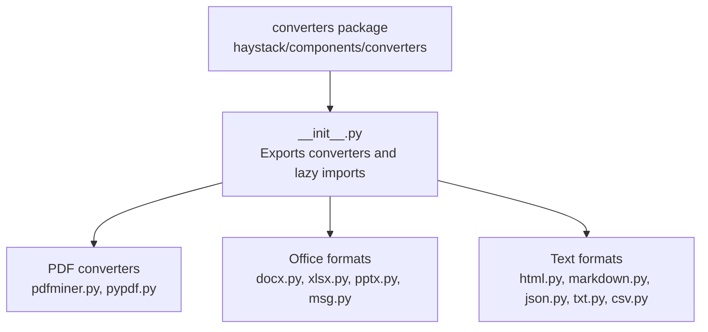

**Diagram sources**
- [__init__.py](file://haystack/components/converters/__init__.py#L10-L28)

**Section sources**
- [__init__.py](file://haystack/components/converters/__init__.py#L1-L51)

## Core Components
This section summarizes the converter components and their primary responsibilities.

- PDFMinerToDocument: Extracts text from PDFs using pdfminer and preserves metadata.
- PyPDFToDocument: Extracts text from PDFs using pypdf with configurable extraction modes.
- DOCXToDocument: Converts DOCX to text, supports table extraction to CSV or Markdown, and link formatting.
- XLSXToDocument: Reads Excel sheets and converts tables to CSV or Markdown, optionally preserving hyperlinks.
- CSVToDocument: Converts CSV files to Documents, supports file mode and row mode with strict validation.
- HTMLToDocument: Extracts article-like text from HTML using Trafilatura.
- MarkdownToDocument: Renders Markdown to plain text, with optional table normalization.
- JSONConverter: Extracts content from JSON using jq filters or content keys, with optional metadata extraction.
- MSGToDocument: Parses Outlook MSG emails, extracts metadata and body, and emits attachments as ByteStream objects.
- TextFileToDocument: Reads text files with encoding handling and metadata preservation.
- PPTXToDocument: Extracts text from PowerPoint slides, with optional hyperlink formatting.

**Section sources**
- [pdfminer.py](file://haystack/components/converters/pdfminer.py#L26-L223)
- [pypdf.py](file://haystack/components/converters/pypdf.py#L50-L223)
- [docx.py](file://haystack/components/converters/docx.py#L119-L404)
- [xlsx.py](file://haystack/components/converters/xlsx.py#L25-L233)
- [csv.py](file://haystack/components/converters/csv.py#L20-L230)
- [html.py](file://haystack/components/converters/html.py#L20-L134)
- [markdown.py](file://haystack/components/converters/markdown.py#L24-L117)
- [json.py](file://haystack/components/converters/json.py#L21-L288)
- [msg.py](file://haystack/components/converters/msg.py#L22-L193)
- [txt.py](file://haystack/components/converters/txt.py#L16-L98)
- [pptx.py](file://haystack/components/converters/pptx.py#L23-L150)

## Architecture Overview
All converters follow a consistent pattern:
- Accept a list of sources (paths, Path objects, or ByteStream).
- Normalize metadata and merge it with per-file metadata.
- Attempt conversion; log warnings and skip problematic sources.
- Produce a dictionary with a "documents" key and, in some cases, "attachments".

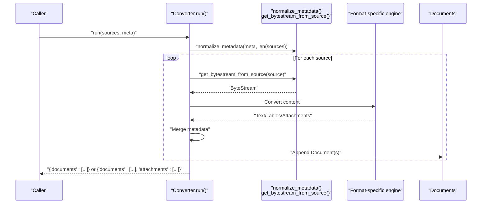

**Diagram sources**
- [pdfminer.py](file://haystack/components/converters/pdfminer.py#L158-L223)
- [pypdf.py](file://haystack/components/converters/pypdf.py#L173-L223)
- [docx.py](file://haystack/components/converters/docx.py#L193-L243)
- [xlsx.py](file://haystack/components/converters/xlsx.py#L91-L143)
- [csv.py](file://haystack/components/converters/csv.py#L80-L184)
- [html.py](file://haystack/components/converters/html.py#L74-L133)
- [markdown.py](file://haystack/components/converters/markdown.py#L60-L116)
- [json.py](file://haystack/components/converters/json.py#L249-L287)
- [msg.py](file://haystack/components/converters/msg.py#L133-L192)
- [txt.py](file://haystack/components/converters/txt.py#L53-L97)
- [pptx.py](file://haystack/components/converters/pptx.py#L107-L149)

## Detailed Component Analysis

### PDFMinerToDocument
- Purpose: Convert PDFs to Documents using pdfminer.
- Input parameters:
  - line_overlap, char_margin, line_margin, word_margin, boxes_flow, detect_vertical, all_texts.
  - store_full_path: Controls whether to store full path or basename in metadata.
- Output: Documents with content as extracted text; metadata merged from ByteStream and user-provided meta.
- Metadata preservation: Merges ByteStream meta with user meta; optionally normalizes file_path.
- Error handling: Logs warnings and skips unreadable sources; detects undecoded CID characters and logs a warning if present.
- Notes: Uses page delimiters to separate pages.

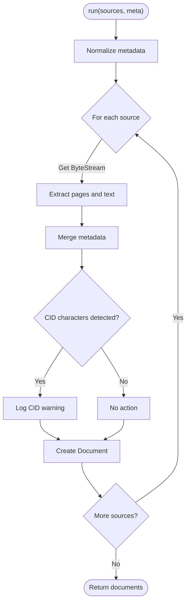

**Diagram sources**
- [pdfminer.py](file://haystack/components/converters/pdfminer.py#L158-L223)

**Section sources**
- [pdfminer.py](file://haystack/components/converters/pdfminer.py#L26-L223)

### PyPDFToDocument
- Purpose: Convert PDFs using pypdf with configurable extraction modes.
- Input parameters:
  - extraction_mode: "plain" or "layout".
  - plain_mode_orientations, plain_mode_space_width.
  - layout_mode_space_vertically, layout_mode_scale_weight, layout_mode_strip_rotated, layout_mode_font_height_weight.
  - store_full_path.
- Output: Documents with content as extracted text; metadata merged.
- Error handling: Logs warnings and skips unreadable sources; warns if rotated text is encountered in layout mode.

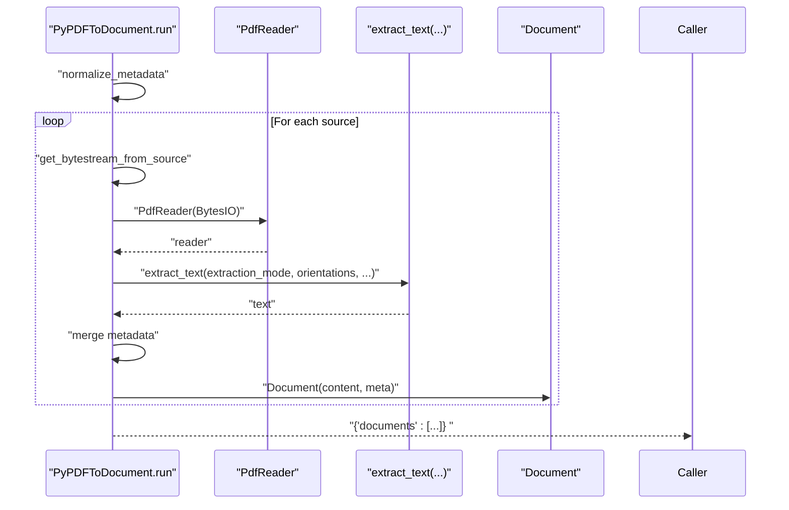

**Diagram sources**
- [pypdf.py](file://haystack/components/converters/pypdf.py#L173-L223)

**Section sources**
- [pypdf.py](file://haystack/components/converters/pypdf.py#L50-L223)

### DOCXToDocument
- Purpose: Convert DOCX to text, with table extraction to CSV or Markdown and link formatting options.
- Input parameters:
  - table_format: "csv" or "markdown".
  - link_format: "markdown", "plain", or "none".
  - store_full_path.
- Output: Documents with content as processed text; metadata includes a nested "docx" section with core properties.
- Metadata preservation: Merges ByteStream meta, user meta, and a structured DOCX metadata object.
- Error handling: Logs warnings and skips unreadable sources; handles page breaks and hyperlinks.

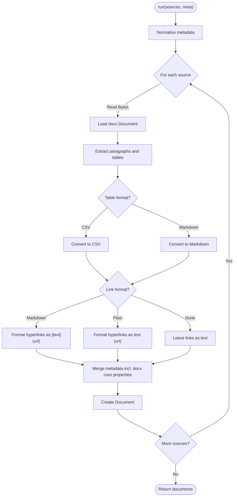

**Diagram sources**
- [docx.py](file://haystack/components/converters/docx.py#L193-L243)
- [docx.py](file://haystack/components/converters/docx.py#L245-L373)
- [docx.py](file://haystack/components/converters/docx.py#L375-L404)

**Section sources**
- [docx.py](file://haystack/components/converters/docx.py#L119-L404)

### XLSXToDocument
- Purpose: Convert Excel sheets to Documents, with CSV or Markdown table formats and optional hyperlink formatting.
- Input parameters:
  - table_format: "csv" or "markdown".
  - sheet_name: specific sheet name/index or list; None means all sheets.
  - read_excel_kwargs: forwarded to pandas.read_excel.
  - table_format_kwargs: forwarded to to_csv/to_markdown.
  - link_format: "markdown", "plain", or "none".
  - store_full_path.
- Output: One Document per table; metadata includes "xlsx" with sheet_name.
- Metadata preservation: Merges ByteStream meta, user meta, and per-table metadata.
- Error handling: Logs warnings and skips unreadable sources; reads hyperlinks via openpyxl when needed.

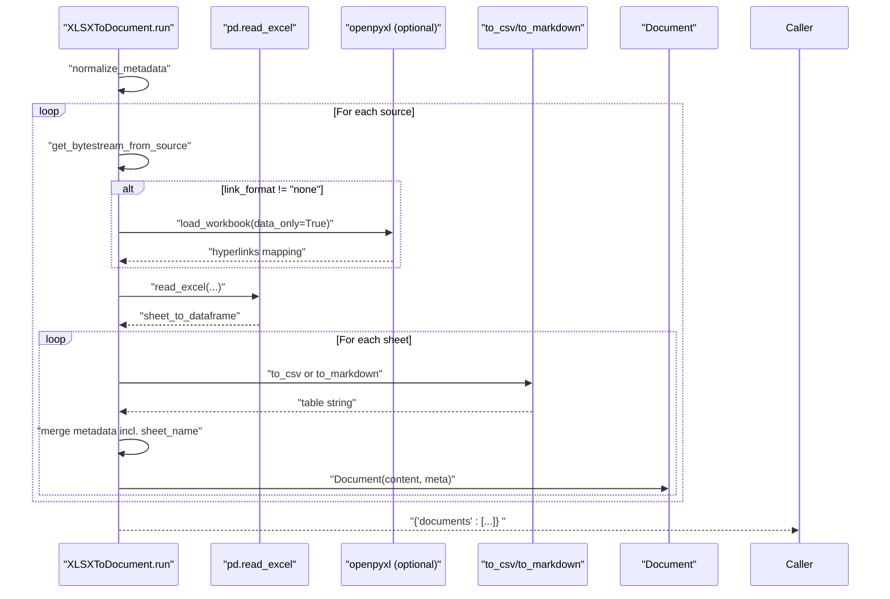

**Diagram sources**
- [xlsx.py](file://haystack/components/converters/xlsx.py#L91-L143)
- [xlsx.py](file://haystack/components/converters/xlsx.py#L157-L233)

**Section sources**
- [xlsx.py](file://haystack/components/converters/xlsx.py#L25-L233)

### CSVToDocument
- Purpose: Convert CSV files to Documents with two modes:
  - "file": one Document per file with raw CSV content.
  - "row": one Document per row using a specified content_column.
- Input parameters:
  - encoding: default file encoding; overridden by ByteStream meta if present.
  - store_full_path.
  - conversion_mode: "file" or "row".
  - delimiter and quotechar: used in row mode.
- Output: Documents with content as CSV text (file mode) or selected row content (row mode); metadata enriched with row_number and other columns (prefixed to avoid collisions).
- Error handling: Logs warnings and skips unreadable sources; strict validation in row mode (missing content_column raises an error).

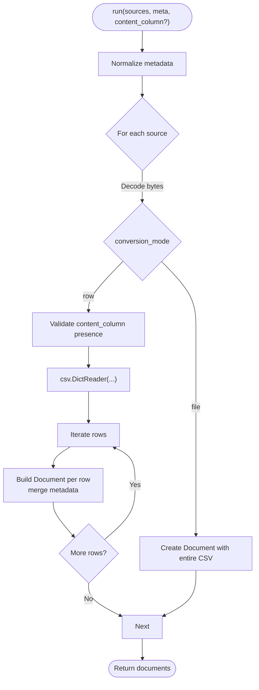

**Diagram sources**
- [csv.py](file://haystack/components/converters/csv.py#L80-L184)

**Section sources**
- [csv.py](file://haystack/components/converters/csv.py#L20-L230)

### HTMLToDocument
- Purpose: Extract article-like text from HTML using Trafilatura.
- Input parameters:
  - extraction_kwargs: forwarded to Trafilatura extract.
  - store_full_path.
- Output: Documents with content as extracted text; metadata merged.
- Error handling: Logs warnings and skips unreadable sources.

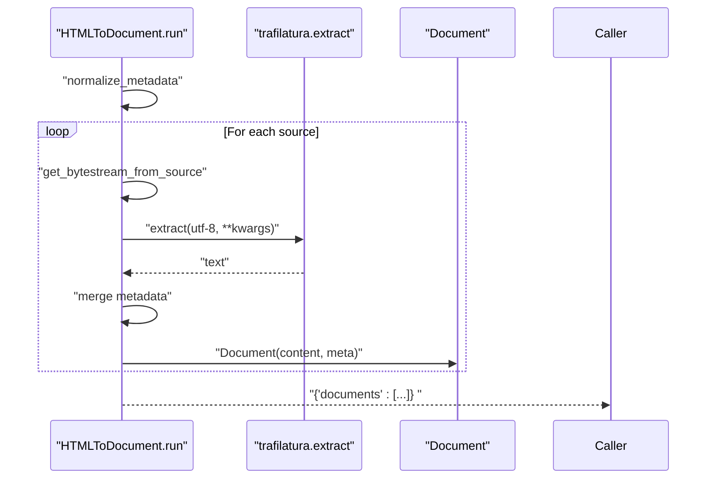

**Diagram sources**
- [html.py](file://haystack/components/converters/html.py#L74-L133)

**Section sources**
- [html.py](file://haystack/components/converters/html.py#L20-L134)

### MarkdownToDocument
- Purpose: Render Markdown to plain text; optional single-line table rendering.
- Input parameters:
  - table_to_single_line: if True, collapses tables to a single line.
  - progress_bar: toggles progress display.
  - store_full_path.
- Output: Documents with content as plain text; metadata merged.
- Error handling: Logs warnings and skips unreadable sources.

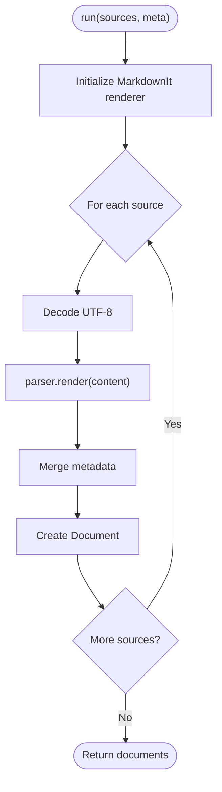

**Diagram sources**
- [markdown.py](file://haystack/components/converters/markdown.py#L60-L116)

**Section sources**
- [markdown.py](file://haystack/components/converters/markdown.py#L24-L117)

### JSONConverter
- Purpose: Extract content from JSON using jq filters or a content_key; optionally extract extra metadata fields.
- Input parameters:
  - jq_schema: jq filter string; optional.
  - content_key: key to use as Document.content; optional.
  - extra_meta_fields: set of keys or "*" to include in metadata.
  - store_full_path.
- Output: One Document per extracted object/scalar; metadata enriched with selected fields.
- Error handling: Logs warnings and skips invalid objects; raises errors if initialization constraints are not met.

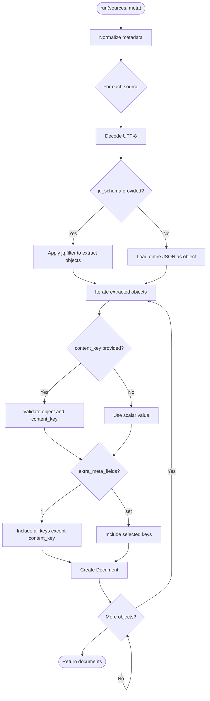

**Diagram sources**
- [json.py](file://haystack/components/converters/json.py#L249-L287)
- [json.py](file://haystack/components/converters/json.py#L179-L247)

**Section sources**
- [json.py](file://haystack/components/converters/json.py#L21-L288)

### MSGToDocument
- Purpose: Parse Outlook MSG emails, extract metadata/body, and emit attachments as ByteStream objects.
- Input parameters:
  - store_full_path.
- Output: Documents with content as formatted email text; attachments emitted separately as ByteStream objects with parent metadata.
- Error handling: Logs warnings and skips unreadable sources; raises an error for encrypted MSG files.

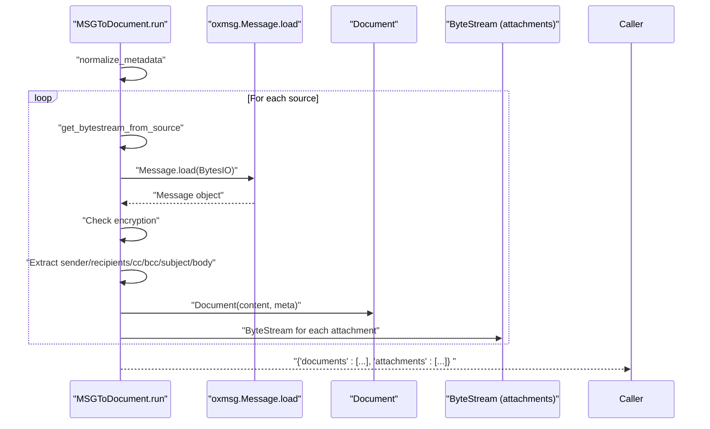

**Diagram sources**
- [msg.py](file://haystack/components/converters/msg.py#L133-L192)
- [msg.py](file://haystack/components/converters/msg.py#L81-L131)

**Section sources**
- [msg.py](file://haystack/components/converters/msg.py#L22-L193)

### TextFileToDocument
- Purpose: Read text files with encoding handling and metadata preservation.
- Input parameters:
  - encoding: default encoding; overridden by ByteStream meta if present.
  - store_full_path.
- Output: Documents with content as decoded text; metadata merged.
- Error handling: Logs warnings and skips unreadable sources.

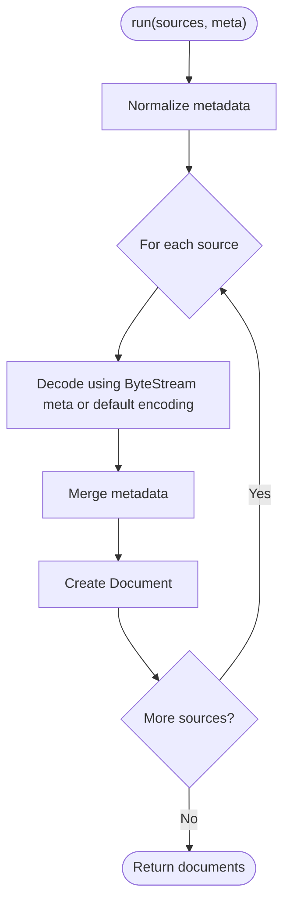

**Diagram sources**
- [txt.py](file://haystack/components/converters/txt.py#L53-L97)

**Section sources**
- [txt.py](file://haystack/components/converters/txt.py#L16-L98)

### PPTXToDocument
- Purpose: Extract text from PowerPoint slides, with optional hyperlink formatting.
- Input parameters:
  - store_full_path.
  - link_format: "markdown", "plain", or "none".
- Output: Documents with content as text from all slides; metadata merged.
- Error handling: Logs warnings and skips unreadable sources.

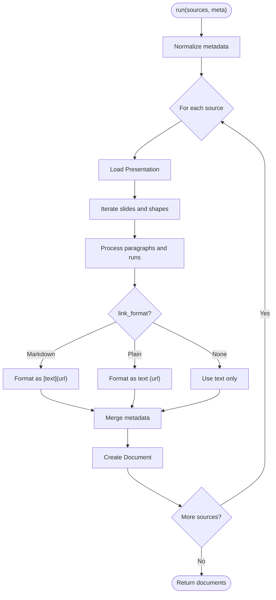

**Diagram sources**
- [pptx.py](file://haystack/components/converters/pptx.py#L107-L149)
- [pptx.py](file://haystack/components/converters/pptx.py#L68-L105)

**Section sources**
- [pptx.py](file://haystack/components/converters/pptx.py#L23-L150)

## Dependency Analysis
The converters share common utilities for metadata normalization and ByteStream handling. They rely on lazy imports for third-party libraries to reduce startup overhead.

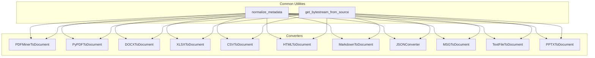

**Diagram sources**
- [pdfminer.py](file://haystack/components/converters/pdfminer.py#L13-L14)
- [pypdf.py](file://haystack/components/converters/pypdf.py#L12-L13)
- [docx.py](file://haystack/components/converters/docx.py#L15-L16)
- [xlsx.py](file://haystack/components/converters/xlsx.py#L11-L13)
- [csv.py](file://haystack/components/converters/csv.py#L12-L13)
- [html.py](file://haystack/components/converters/html.py#L10-L12)
- [markdown.py](file://haystack/components/converters/markdown.py#L13-L14)
- [json.py](file://haystack/components/converters/json.py#L11-L13)
- [msg.py](file://haystack/components/converters/msg.py#L11-L13)
- [txt.py](file://haystack/components/converters/txt.py#L10-L12)
- [pptx.py](file://haystack/components/converters/pptx.py#L12-L13)

**Section sources**
- [__init__.py](file://haystack/components/converters/__init__.py#L10-L28)

## Performance Considerations
- Batch processing: Pass multiple sources to the run method to leverage internal loops and avoid repeated initialization overhead.
- Encoding handling: Prefer specifying encoding in ByteStream meta to avoid repeated detection attempts.
- Large CSVs (row mode): Row mode can be memory-intensive; consider smaller files or streaming approaches if memory is constrained.
- Progress bars: Some converters (Markdown) support progress bars; disable for headless environments.
- Layout analysis: PDF layout modes may be slower and can degrade with rotated text; use plain mode for speed when layout fidelity is not required.
- Lazy imports: Third-party libraries are imported lazily; ensure dependencies are installed to avoid runtime delays.

## Troubleshooting Guide
- Corrupted files: All converters log warnings and skip unreadable sources. Verify file integrity and permissions.
- Encoding issues: For text-based formats, ensure ByteStream meta includes correct encoding. Converters fall back to defaults if not provided.
- Unsupported formats: Initialize parameters validate inputs (e.g., link_format, table_format). Ensure values are among supported options.
- PDF extraction anomalies:
  - CID characters: PDFMinerToDocument detects undecoded CID characters and logs a warning; consider font issues in the source PDF.
  - Rotated text: PyPDFToDocument warns and degrades layout quality when rotated text is encountered.
- MSG encryption: MSGToDocument raises an error for encrypted files; decrypt or use an alternate source.
- jq filters: JSONConverter requires either jq_schema or content_key; ensure at least one is provided.

**Section sources**
- [pdfminer.py](file://haystack/components/converters/pdfminer.py#L182-L218)
- [pypdf.py](file://haystack/components/converters/pypdf.py#L194-L207)
- [xlsx.py](file://haystack/components/converters/xlsx.py#L78-L82)
- [pptx.py](file://haystack/components/converters/pptx.py#L52-L56)
- [csv.py](file://haystack/components/converters/csv.py#L143-L172)
- [json.py](file://haystack/components/converters/json.py#L148-L150)
- [msg.py](file://haystack/components/converters/msg.py#L89-L91)

## Conclusion
The converter components provide a robust, extensible foundation for transforming diverse file formats into Documents suitable for downstream processing. They consistently handle metadata, gracefully manage errors, and offer flexible configuration for specialized use cases. For optimal results, align converter selection with content characteristics (e.g., layout-sensitive PDFs with layout mode, structured spreadsheets with table extraction), and tune parameters to balance accuracy and performance.