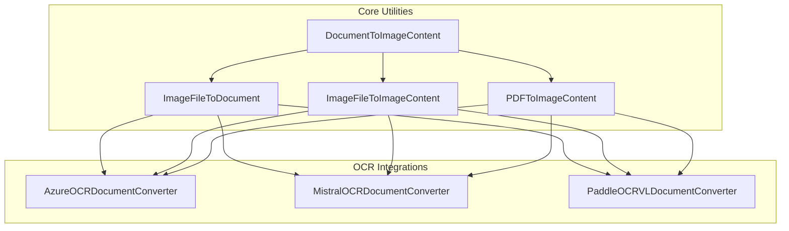
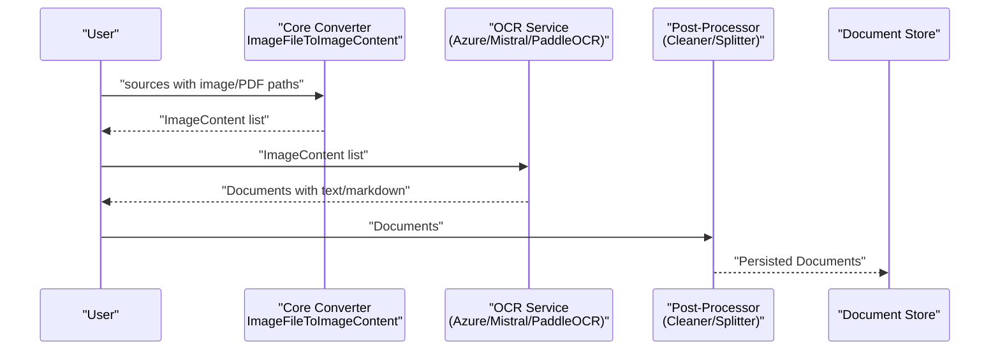
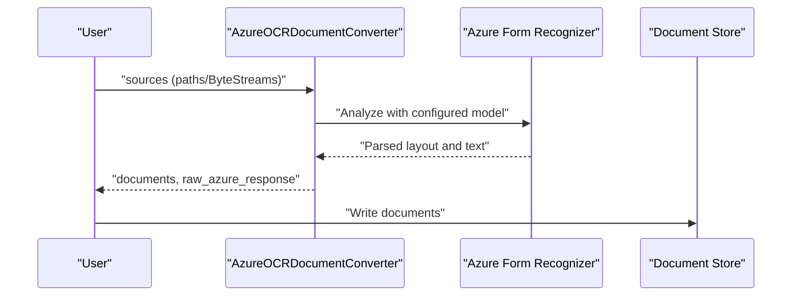
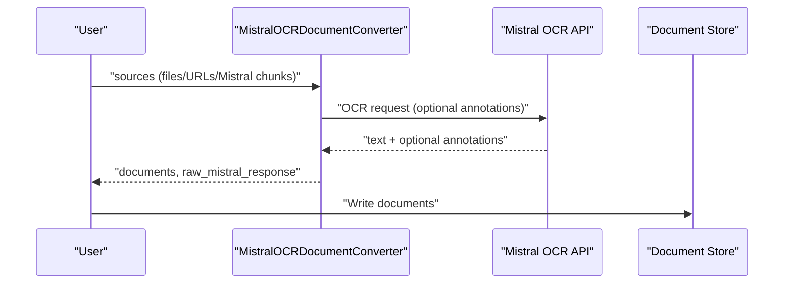
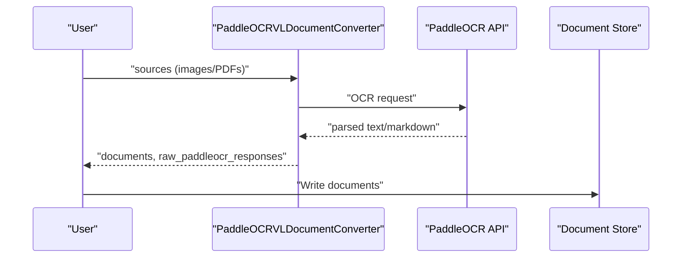
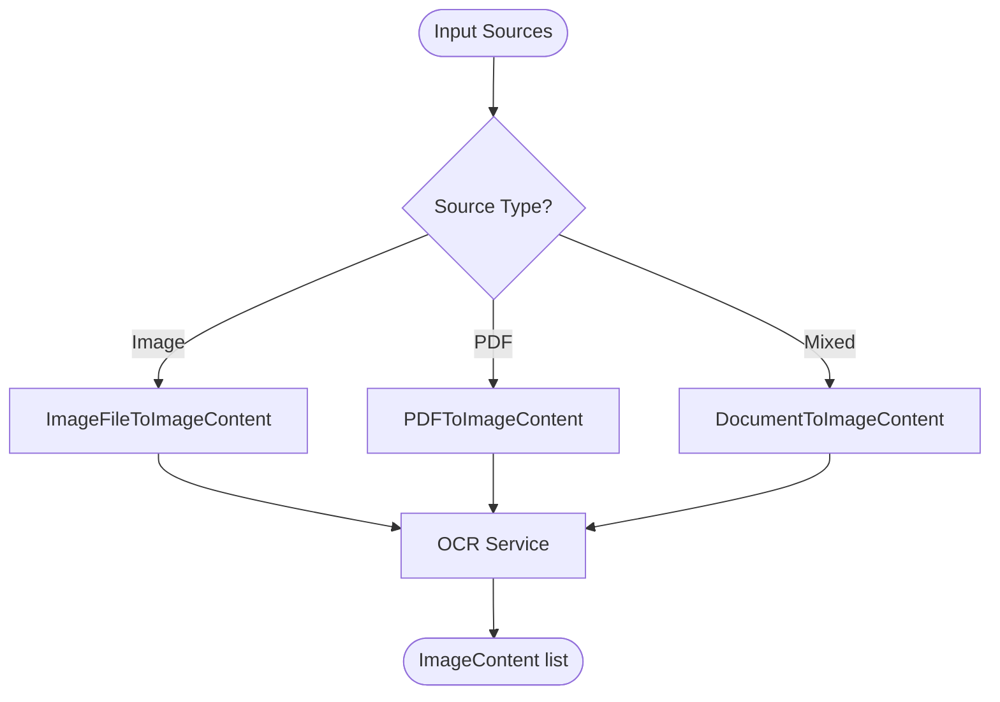
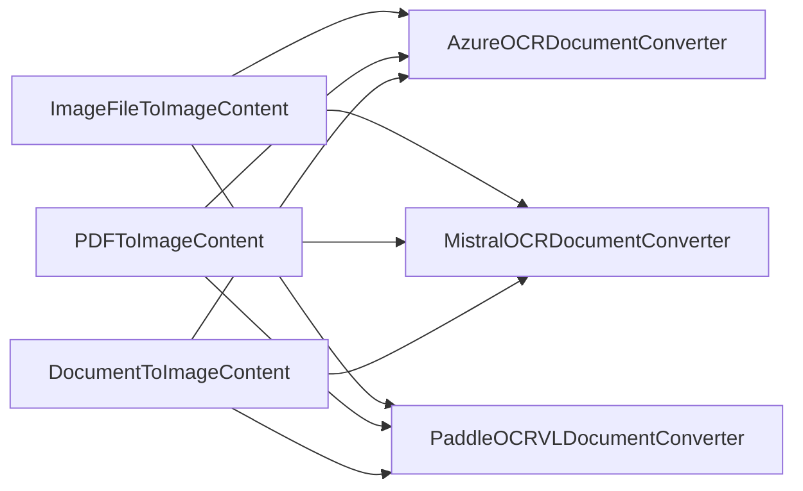

# Image Content Converters

<cite>
**Referenced Files in This Document**
- [image_converters_api.md](file://docs-website/reference/haystack-api/image_converters_api.md)
- [azureocrdocumentconverter.mdx](file://docs-website/docs/pipeline-components/converters/azureocrdocumentconverter.mdx)
- [mistralocrdocumentconverter.mdx](file://docs-website/docs/pipeline-components/converters/mistralocrdocumentconverter.mdx)
- [paddleocrvldocumentconverter.mdx](file://docs-website/docs/pipeline-components/converters/paddleocrvldocumentconverter.mdx)
- [azure.py](file://haystack/components/converters/azure.py)
- [test_azure_ocr_doc_converter.py](file://test/components/converters/test_azure_ocr_doc_converter.py)
</cite>

## Table of Contents
1. [Introduction](#introduction)
2. [Project Structure](#project-structure)
3. [Core Components](#core-components)
4. [Architecture Overview](#architecture-overview)
5. [Detailed Component Analysis](#detailed-component-analysis)
6. [Dependency Analysis](#dependency-analysis)
7. [Performance Considerations](#performance-considerations)
8. [Troubleshooting Guide](#troubleshooting-guide)
9. [Conclusion](#conclusion)
10. [Appendices](#appendices)

## Introduction
This document provides comprehensive API documentation for image content conversion components in the Haystack ecosystem. It focuses on OCR processing APIs for document image analysis, text extraction, and layout understanding. It covers three major integrations:
- Azure Cognitive Services Document Intelligence (OCR)
- Mistral OCR API
- PaddleOCR-VL API

Additionally, it documents the image content conversion utilities that transform images and PDFs into standardized ImageContent objects suitable for multimodal pipelines.

## Project Structure
The image content conversion and OCR components are organized under:
- Core image conversion utilities: documented in the Haystack API reference
- OCR converters: documented in the pipeline components documentation
- Implementation details: available in the core converters module and tests

**Diagram sources**
- [image_converters_api.md](file://docs-website/reference/haystack-api/image_converters_api.md#L9-L354)
- [azureocrdocumentconverter.mdx](file://docs-website/docs/pipeline-components/converters/azureocrdocumentconverter.mdx#L1-L93)
- [mistralocrdocumentconverter.mdx](file://docs-website/docs/pipeline-components/converters/mistralocrdocumentconverter.mdx#L1-L190)
- [paddleocrvldocumentconverter.mdx](file://docs-website/docs/pipeline-components/converters/paddleocrvldocumentconverter.mdx#L1-L98)

**Section sources**
- [image_converters_api.md](file://docs-website/reference/haystack-api/image_converters_api.md#L9-L354)

## Core Components
This section summarizes the core image content conversion utilities that prepare images and PDFs for OCR and downstream processing.

- DocumentToImageContent
  - Purpose: Converts documents sourced from PDF and image files into ImageContents.
  - Key parameters: file_path_meta_field, root_path, detail, size.
  - Behavior: Extracts images from supported file formats and converts them into ImageContent objects with base64-encoded image data and metadata.
  - Typical usage: Preprocessing stage before OCR or multimodal embedding.

- ImageFileToDocument
  - Purpose: Wraps image file references into Document objects with metadata for downstream components.
  - Key parameters: store_full_path.
  - Behavior: Produces Documents with None content and metadata such as file path.

- ImageFileToImageContent
  - Purpose: Converts image files to ImageContent objects.
  - Key parameters: detail, size.
  - Behavior: Encodes images to base64 and attaches metadata.

- PDFToImageContent
  - Purpose: Converts PDF files to ImageContent objects.
  - Key parameters: detail, size, page_range.
  - Behavior: Supports page selection via numeric indices or ranges.

These components are designed to normalize heterogeneous image and PDF inputs into a consistent ImageContent format for downstream OCR and embedding pipelines.

**Section sources**
- [image_converters_api.md](file://docs-website/reference/haystack-api/image_converters_api.md#L9-L354)

## Architecture Overview
The OCR processing pipeline typically follows this flow:
- Prepare image content using core converters
- Apply OCR via external services (Azure, Mistral, PaddleOCR-VL)
- Post-process extracted text (cleaning, splitting, writing to a document store)

**Diagram sources**
- [image_converters_api.md](file://docs-website/reference/haystack-api/image_converters_api.md#L182-L354)
- [azureocrdocumentconverter.mdx](file://docs-website/docs/pipeline-components/converters/azureocrdocumentconverter.mdx#L25-L93)
- [mistralocrdocumentconverter.mdx](file://docs-website/docs/pipeline-components/converters/mistralocrdocumentconverter.mdx#L25-L190)
- [paddleocrvldocumentconverter.mdx](file://docs-website/docs/pipeline-components/converters/paddleocrvldocumentconverter.mdx#L25-L98)

## Detailed Component Analysis

### AzureOCRDocumentConverter
AzureOCRDocumentConverter leverages Azure’s Document Intelligence service to extract text and structure from documents. It supports multiple input formats and returns structured Documents.

Key capabilities:
- Input formats: PDF (searchable and image-only), JPEG, PNG, BMP, TIFF, DOCX, XLSX, PPTX, HTML
- Authentication: endpoint and API key (via environment variable or constructor)
- Model selection: configurable model ID (default is prebuilt-read)
- Output: Documents with text content and raw OCR responses

Usage patterns:
- Standalone usage with local files or pipelines integrating with preprocessors and writers
- Optional metadata attachment and table-aware outputs

**Diagram sources**
- [azureocrdocumentconverter.mdx](file://docs-website/docs/pipeline-components/converters/azureocrdocumentconverter.mdx#L25-L93)
- [azure.py](file://haystack/components/converters/azure.py#L29-L200)

**Section sources**
- [azureocrdocumentconverter.mdx](file://docs-website/docs/pipeline-components/converters/azureocrdocumentconverter.mdx#L1-L93)
- [azure.py](file://haystack/components/converters/azure.py#L29-L200)

### MistralOCRDocumentConverter
MistralOCRDocumentConverter extracts text from documents using Mistral’s OCR API and supports optional structured annotations for both image regions and full documents.

Key capabilities:
- Input formats: local files, URLs, Mistral file IDs
- Authentication: API key via environment variable or constructor
- Structured annotations: bounding box annotations for regions and document-level annotations
- Output: Documents with markdown content and inline image tags; metadata enriched with annotation results

Usage patterns:
- Basic OCR extraction
- Mixed sources (local files, URLs, Mistral chunks)
- Structured annotations using Pydantic schemas

**Diagram sources**
- [mistralocrdocumentconverter.mdx](file://docs-website/docs/pipeline-components/converters/mistralocrdocumentconverter.mdx#L25-L190)

**Section sources**
- [mistralocrdocumentconverter.mdx](file://docs-website/docs/pipeline-components/converters/mistralocrdocumentconverter.mdx#L1-L190)

### PaddleOCRVLDocumentConverter
PaddleOCRVLDocumentConverter extracts text using PaddleOCR’s large model document parsing API (PaddleOCR-VL). It supports images and PDFs and returns Documents in markdown format.

Key capabilities:
- Input formats: image or PDF file paths or ByteStream objects
- Authentication: API URL and access token (via environment variable or constructor)
- Output: Documents with markdown content and inline image tags

Usage patterns:
- Standalone usage and integration into indexing pipelines with cleaners and splitters

**Diagram sources**
- [paddleocrvldocumentconverter.mdx](file://docs-website/docs/pipeline-components/converters/paddleocrvldocumentconverter.mdx#L25-L98)

**Section sources**
- [paddleocrvldocumentconverter.mdx](file://docs-website/docs/pipeline-components/converters/paddleocrvldocumentconverter.mdx#L1-L98)

### Core Image Conversion Utilities
These components handle image and PDF normalization into ImageContent objects, enabling consistent downstream OCR processing.

- DocumentToImageContent
  - Purpose: Convert documents to ImageContent
  - Parameters: file_path_meta_field, root_path, detail, size
  - Returns: image_contents

- ImageFileToDocument
  - Purpose: Wrap image sources into Documents with metadata
  - Parameters: store_full_path
  - Returns: documents

- ImageFileToImageContent
  - Purpose: Convert image sources to ImageContent
  - Parameters: detail, size
  - Returns: image_contents

- PDFToImageContent
  - Purpose: Convert PDF sources to ImageContent
  - Parameters: detail, size, page_range
  - Returns: image_contents

**Diagram sources**
- [image_converters_api.md](file://docs-website/reference/haystack-api/image_converters_api.md#L9-L354)

**Section sources**
- [image_converters_api.md](file://docs-website/reference/haystack-api/image_converters_api.md#L9-L354)

## Dependency Analysis
- Internal dependencies
  - Core converters depend on standard libraries and image/PDF processing utilities
  - Tests validate behavior against Azure OCR converter implementation
- External dependencies
  - AzureOCRDocumentConverter depends on the Azure Form Recognizer SDK
  - MistralOCRDocumentConverter depends on the Mistral integration package
  - PaddleOCRVLDocumentConverter depends on the PaddleOCR integration package

**Diagram sources**
- [image_converters_api.md](file://docs-website/reference/haystack-api/image_converters_api.md#L9-L354)
- [azureocrdocumentconverter.mdx](file://docs-website/docs/pipeline-components/converters/azureocrdocumentconverter.mdx#L1-L93)
- [mistralocrdocumentconverter.mdx](file://docs-website/docs/pipeline-components/converters/mistralocrdocumentconverter.mdx#L1-L190)
- [paddleocrvldocumentconverter.mdx](file://docs-website/docs/pipeline-components/converters/paddleocrvldocumentconverter.mdx#L1-L98)

**Section sources**
- [test_azure_ocr_doc_converter.py](file://test/components/converters/test_azure_ocr_doc_converter.py#L100-L200)

## Performance Considerations
- Image sizing and detail
  - Use size to resize images while preserving aspect ratio, reducing bandwidth and processing time
  - detail controls the level of visual detail (OpenAI-specific) and can influence downstream costs and latency
- Page selection for PDFs
  - page_range allows processing only required pages, minimizing OCR workload
- Batch processing
  - All converters accept lists of sources; batching improves throughput
- Preprocessing
  - Clean and split Documents after OCR to optimize downstream retrieval and embeddings
- External service tuning
  - Configure model IDs and request parameters per provider documentation
  - Monitor rate limits and quotas for cloud OCR services

[No sources needed since this section provides general guidance]

## Troubleshooting Guide
Common issues and resolutions:
- Authentication failures
  - Verify endpoint and API key for Azure; ensure environment variables are set correctly
  - Confirm API key and access token for Mistral and PaddleOCR
- Unsupported formats
  - Ensure input formats align with provider capabilities (see provider docs)
- Missing metadata
  - For DocumentToImageContent, confirm file_path_meta_field and page_number for PDFs
- Large PDFs or low-quality images
  - Reduce size, adjust detail, or preprocess images to improve OCR accuracy
- Provider-specific errors
  - Inspect raw responses for detailed error messages and adjust parameters accordingly

**Section sources**
- [azureocrdocumentconverter.mdx](file://docs-website/docs/pipeline-components/converters/azureocrdocumentconverter.mdx#L25-L93)
- [mistralocrdocumentconverter.mdx](file://docs-website/docs/pipeline-components/converters/mistralocrdocumentconverter.mdx#L25-L190)
- [paddleocrvldocumentconverter.mdx](file://docs-website/docs/pipeline-components/converters/paddleocrvldocumentconverter.mdx#L25-L98)

## Conclusion
The image content conversion and OCR components provide a flexible, extensible foundation for document image analysis. By normalizing inputs into ImageContent and leveraging provider-specific OCR services, you can build robust pipelines for scanned documents, handwritten text, multi-language content, and degraded images. Proper tuning of preprocessing, batching, and provider configurations is essential for performance and accuracy.

[No sources needed since this section summarizes without analyzing specific files]

## Appendices

### API Reference Index
- Core image conversion utilities
  - DocumentToImageContent: [API reference](file://docs-website/reference/haystack-api/image_converters_api.md#L9-L108)
  - ImageFileToDocument: [API reference](file://docs-website/reference/haystack-api/image_converters_api.md#L109-L181)
  - ImageFileToImageContent: [API reference](file://docs-website/reference/haystack-api/image_converters_api.md#L182-L261)
  - PDFToImageContent: [API reference](file://docs-website/reference/haystack-api/image_converters_api.md#L262-L354)

- OCR integrations
  - AzureOCRDocumentConverter: [Usage guide](file://docs-website/docs/pipeline-components/converters/azureocrdocumentconverter.mdx#L25-L93)
  - MistralOCRDocumentConverter: [Usage guide](file://docs-website/docs/pipeline-components/converters/mistralocrdocumentconverter.mdx#L25-L190)
  - PaddleOCRVLDocumentConverter: [Usage guide](file://docs-website/docs/pipeline-components/converters/paddleocrvldocumentconverter.mdx#L25-L98)

**Section sources**
- [image_converters_api.md](file://docs-website/reference/haystack-api/image_converters_api.md#L9-L354)
- [azureocrdocumentconverter.mdx](file://docs-website/docs/pipeline-components/converters/azureocrdocumentconverter.mdx#L1-L93)
- [mistralocrdocumentconverter.mdx](file://docs-website/docs/pipeline-components/converters/mistralocrdocumentconverter.mdx#L1-L190)
- [paddleocrvldocumentconverter.mdx](file://docs-website/docs/pipeline-components/converters/paddleocrvldocumentconverter.mdx#L1-L98)