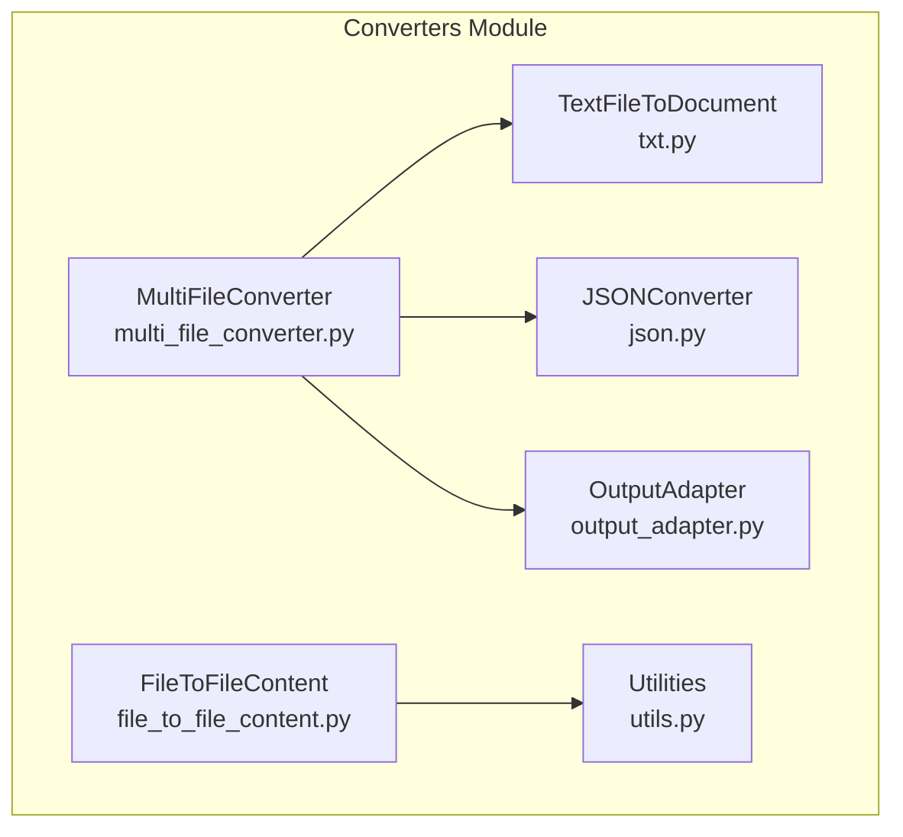
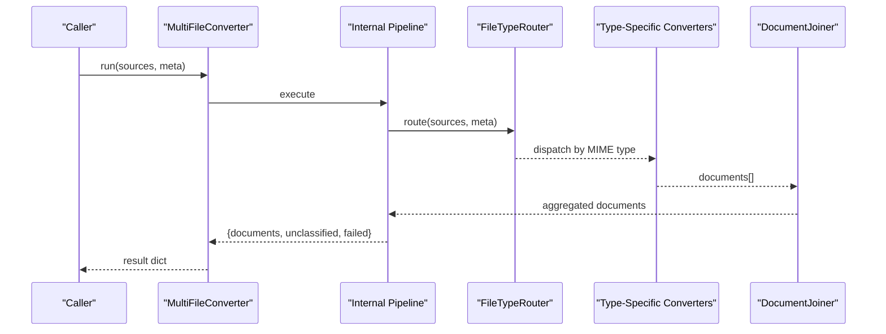
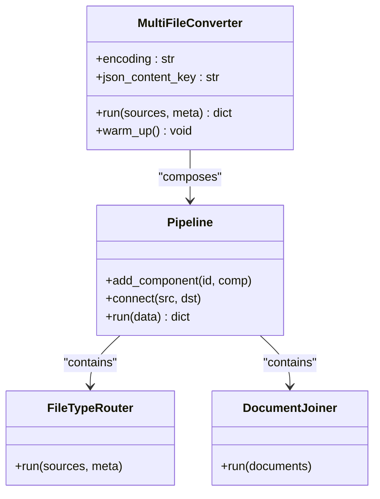
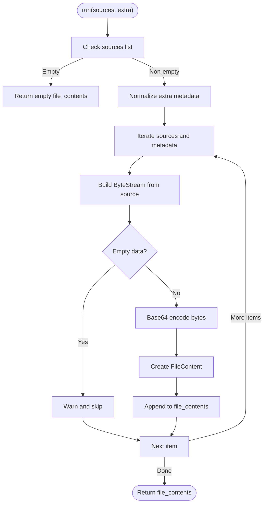
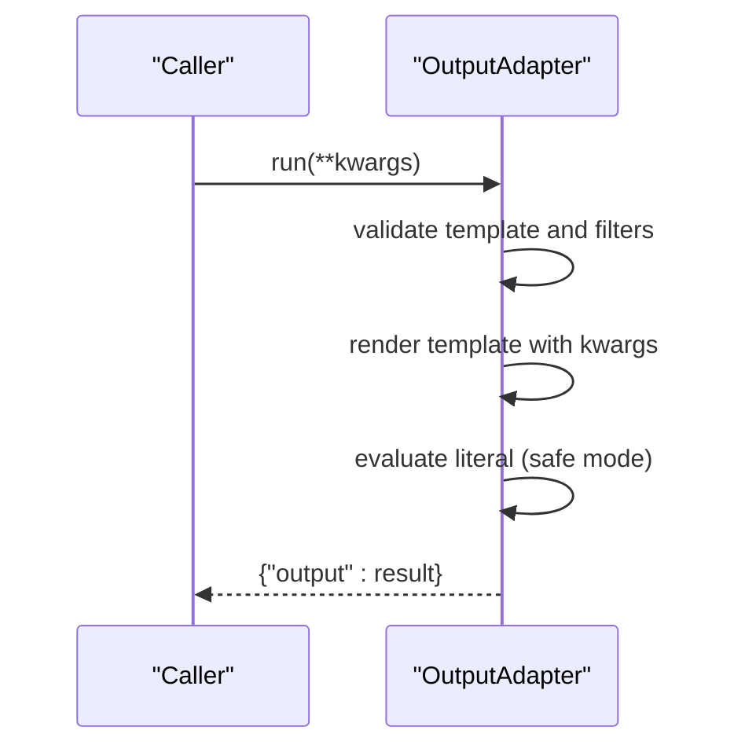
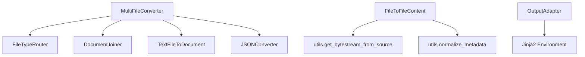

# Multi-File Converters

<cite>
**Referenced Files in This Document**
- [multi_file_converter.py](file://haystack/components/converters/multi_file_converter.py)
- [file_to_file_content.py](file://haystack/components/converters/file_to_file_content.py)
- [output_adapter.py](file://haystack/components/converters/output_adapter.py)
- [__init__.py](file://haystack/components/converters/__init__.py)
- [utils.py](file://haystack/components/converters/utils.py)
- [txt.py](file://haystack/components/converters/txt.py)
- [json.py](file://haystack/components/converters/json.py)
- [test_multi_file_converter.py](file://test/components/converters/test_multi_file_converter.py)
</cite>

## Table of Contents
1. [Introduction](#introduction)
2. [Project Structure](#project-structure)
3. [Core Components](#core-components)
4. [Architecture Overview](#architecture-overview)
5. [Detailed Component Analysis](#detailed-component-analysis)
6. [Dependency Analysis](#dependency-analysis)
7. [Performance Considerations](#performance-considerations)
8. [Troubleshooting Guide](#troubleshooting-guide)
9. [Conclusion](#conclusion)
10. [Appendices](#appendices)

## Introduction
This document provides comprehensive API documentation for multi-file conversion components in the Haystack converters package. It focuses on:
- Batch processing APIs for handling multiple files simultaneously
- File collection mechanisms and output aggregation patterns
- The MultiFileConverter for processing heterogeneous file collections
- The FileToFileContent converter for raw content extraction
- The OutputAdapter for result transformation
- Practical examples for processing directories, handling mixed file types, and implementing custom file filtering
- Memory management strategies for large file sets and robust error handling for partial failures

## Project Structure
The converters module organizes file conversion capabilities into focused components. The primary files relevant to multi-file conversion are:
- MultiFileConverter: orchestrates routing and conversion of multiple file types via an internal pipeline
- FileToFileContent: extracts raw file content into FileContent objects
- OutputAdapter: transforms component outputs using Jinja templates
- Utilities: shared helpers for ByteStream creation and metadata normalization
- Supporting converters: TextFileToDocument, JSONConverter, and others used by MultiFileConverter

**Diagram sources**
- [multi_file_converter.py](file://haystack/components/converters/multi_file_converter.py#L37-L124)
- [file_to_file_content.py](file://haystack/components/converters/file_to_file_content.py#L19-L94)
- [output_adapter.py](file://haystack/components/converters/output_adapter.py#L26-L180)
- [utils.py](file://haystack/components/converters/utils.py#L11-L52)
- [txt.py](file://haystack/components/converters/txt.py#L16-L98)
- [json.py](file://haystack/components/converters/json.py#L21-L288)

**Section sources**
- [__init__.py](file://haystack/components/converters/__init__.py#L10-L28)

## Core Components
This section introduces the three core components documented here and their roles in multi-file conversion workflows.

- MultiFileConverter
  - Purpose: Orchestrates batch conversion of multiple file types by routing each source to the appropriate converter and aggregating results into a unified list of Documents.
  - Key capabilities:
    - Accepts a list of sources supporting strings, Path objects, and ByteStream instances
    - Routes by MIME type and connects to specialized converters
    - Aggregates outputs via DocumentJoiner
    - Emits documents, unclassified sources, and failed conversions
  - Typical usage: Pass a list of file paths or ByteStream objects to run() and receive a dictionary with aggregated documents and auxiliary lists.

- FileToFileContent
  - Purpose: Converts files into FileContent objects suitable for multimodal pipelines.
  - Key capabilities:
    - Reads files or ByteStream sources and produces base64-encoded FileContent items
    - Supports per-source extra metadata
    - Skips unreadable or empty sources with warnings
  - Typical usage: Provide a list of sources and optionally extra metadata; returns a list of FileContent objects.

- OutputAdapter
  - Purpose: Transforms component outputs using Jinja templates to produce structured or typed results.
  - Key capabilities:
    - Validates template syntax at initialization
    - Supports safe (sandboxed) and unsafe (native) environments
    - Serializes/deserializes custom filters and output types
  - Typical usage: Define a template and output_type; call run() with variables defined by the template.

**Section sources**
- [multi_file_converter.py](file://haystack/components/converters/multi_file_converter.py#L37-L134)
- [file_to_file_content.py](file://haystack/components/converters/file_to_file_content.py#L19-L94)
- [output_adapter.py](file://haystack/components/converters/output_adapter.py#L26-L180)

## Architecture Overview
The MultiFileConverter composes a pipeline that routes each source to the appropriate converter based on MIME type, then joins the resulting documents. FileToFileContent operates independently to extract raw content, while OutputAdapter transforms outputs after conversion.

**Diagram sources**
- [multi_file_converter.py](file://haystack/components/converters/multi_file_converter.py#L84-L123)

## Detailed Component Analysis

### MultiFileConverter
- Responsibilities
  - Initialize and configure a Pipeline with FileTypeRouter and specialized converters
  - Connect router outputs to respective converters and joiner
  - Expose run() with input/output mapping for batch processing
- Inputs
  - sources: list of str, Path, or ByteStream
  - meta: optional dict or list of dicts for metadata propagation
- Outputs
  - documents: list of Document
  - unclassified: list of ByteStream for unsupported/unrecognized sources
  - failed: list of sources that failed to convert
- Behavior highlights
  - Uses ConverterMimeType enum to register supported MIME types
  - Adds additional MIME type to extension mappings for Windows compatibility
  - Connects each converter branch to DocumentJoiner
  - Exposes input/output mappings for seamless integration in pipelines

**Diagram sources**
- [multi_file_converter.py](file://haystack/components/converters/multi_file_converter.py#L37-L124)

**Section sources**
- [multi_file_converter.py](file://haystack/components/converters/multi_file_converter.py#L37-L134)
- [test_multi_file_converter.py](file://test/components/converters/test_multi_file_converter.py#L21-L146)

### FileToFileContent
- Responsibilities
  - Convert file sources to FileContent objects
  - Normalize and propagate extra metadata per source
  - Skip unreadable or empty sources with warnings
- Inputs
  - sources: list of str, Path, or ByteStream
  - extra: optional dict or list of dicts for per-source metadata
- Outputs
  - file_contents: list of FileContent
- Behavior highlights
  - Uses get_bytestream_from_source() to handle various input types
  - Base64 encodes raw bytes for transport
  - Applies normalize_metadata() to ensure consistent metadata length

**Diagram sources**
- [file_to_file_content.py](file://haystack/components/converters/file_to_file_content.py#L44-L94)
- [utils.py](file://haystack/components/converters/utils.py#L11-L52)

**Section sources**
- [file_to_file_content.py](file://haystack/components/converters/file_to_file_content.py#L19-L94)
- [utils.py](file://haystack/components/converters/utils.py#L11-L52)

### OutputAdapter
- Responsibilities
  - Adapt component outputs using Jinja templates
  - Support safe (sandboxed) and unsafe (native) environments
  - Serialize/deserialize custom filters and output types
- Inputs
  - template: Jinja template string
  - output_type: target type for the adapted output
  - custom_filters: optional dict of custom Jinja filters
  - unsafe: enable unsafe template execution
- Outputs
  - output: rendered and evaluated result matching output_type
- Behavior highlights
  - Validates template syntax at initialization
  - Extracts template variables and assigns them as component inputs
  - Handles undefined variables and evaluation errors

**Diagram sources**
- [output_adapter.py](file://haystack/components/converters/output_adapter.py#L107-L142)

**Section sources**
- [output_adapter.py](file://haystack/components/converters/output_adapter.py#L26-L180)

## Dependency Analysis
- MultiFileConverter depends on:
  - FileTypeRouter for MIME-type-based routing
  - Specialized converters (TextFileToDocument, JSONConverter, etc.) for content extraction
  - DocumentJoiner for output aggregation
  - Internal pipeline orchestration
- FileToFileContent depends on:
  - get_bytestream_from_source() for unified input handling
  - normalize_metadata() for consistent metadata propagation
- OutputAdapter depends on:
  - Jinja2 environment (sandboxed or native)
  - Serialization utilities for filters and types

**Diagram sources**
- [multi_file_converter.py](file://haystack/components/converters/multi_file_converter.py#L84-L123)
- [file_to_file_content.py](file://haystack/components/converters/file_to_file_content.py#L69-L91)
- [utils.py](file://haystack/components/converters/utils.py#L11-L52)
- [output_adapter.py](file://haystack/components/converters/output_adapter.py#L82-L104)

**Section sources**
- [multi_file_converter.py](file://haystack/components/converters/multi_file_converter.py#L10-L22)
- [file_to_file_content.py](file://haystack/components/converters/file_to_file_content.py#L9-L11)
- [utils.py](file://haystack/components/converters/utils.py#L5-L11)
- [output_adapter.py](file://haystack/components/converters/output_adapter.py#L10-L17)

## Performance Considerations
- Batch processing
  - MultiFileConverter processes multiple sources concurrently through its internal pipeline, reducing overhead compared to sequential conversions.
- Memory management
  - FileToFileContent base64-encodes raw bytes; for very large files, consider streaming or chunked processing to avoid excessive memory usage.
  - MultiFileConverter aggregates all converted documents; for large batches, consider pagination or incremental processing to limit peak memory.
- I/O efficiency
  - Reuse warmed-up components (e.g., call warm_up()) to avoid repeated initialization costs.
- Metadata handling
  - normalize_metadata() ensures consistent metadata lengths; avoid passing overly large metadata objects per source to prevent serialization overhead.

[No sources needed since this section provides general guidance]

## Troubleshooting Guide
- Partial failures
  - MultiFileConverter emits a failed list for sources that could not be converted; inspect this list to identify problematic files.
  - FileToFileContent warns and skips unreadable or empty sources; verify file permissions and content validity.
- Unsupported or unknown MIME types
  - MultiFileConverter reports unclassified sources; ensure MIME types are properly detected or provide explicit metadata.
- Template rendering errors
  - OutputAdapter raises exceptions for invalid templates or undefined variables; validate templates and ensure all required inputs are provided.
- Serialization issues
  - OutputAdapter supports serialization of custom filters; ensure filters are serializable and compatible with the chosen environment.

**Section sources**
- [test_multi_file_converter.py](file://test/components/converters/test_multi_file_converter.py#L104-L111)
- [file_to_file_content.py](file://haystack/components/converters/file_to_file_content.py#L77-L85)
- [output_adapter.py](file://haystack/components/converters/output_adapter.py#L120-L142)

## Conclusion
The multi-file conversion stack in Haystack enables robust, batch-oriented processing of heterogeneous file collections. MultiFileConverter orchestrates routing and aggregation, FileToFileContent extracts raw content for multimodal use, and OutputAdapter provides flexible output transformation. Together, they support scalable workflows for directories, mixed file types, and custom filtering strategies, with built-in mechanisms for partial failure handling and metadata propagation.

[No sources needed since this section summarizes without analyzing specific files]

## Appendices

### API Reference Summary

- MultiFileConverter
  - Inputs: sources (list[str | Path | ByteStream]), meta (dict | list[dict] | None)
  - Outputs: documents (list[Document]), unclassified (list[ByteStream]), failed (list[Any])
  - Typical usage: Initialize, warm_up(), run(sources, meta), integrate into pipelines

- FileToFileContent
  - Inputs: sources (list[str | Path | ByteStream]), extra (dict | list[dict] | None)
  - Outputs: file_contents (list[FileContent])
  - Typical usage: Run with sources and optional per-source metadata

- OutputAdapter
  - Inputs: template (str), output_type (TypeAlias), custom_filters (dict[str, Callable] | None), unsafe (bool)
  - Outputs: output (Any)
  - Typical usage: Initialize with template and output_type, run with template variables

**Section sources**
- [multi_file_converter.py](file://haystack/components/converters/multi_file_converter.py#L62-L124)
- [file_to_file_content.py](file://haystack/components/converters/file_to_file_content.py#L44-L94)
- [output_adapter.py](file://haystack/components/converters/output_adapter.py#L44-L105)

### Examples Index
- Processing directories with mixed file types
  - Use MultiFileConverter with a list of file paths covering CSV, DOCX, HTML, JSON, MD, PDF, PPTX, TXT, XLSX
  - Inspect documents, unclassified, and failed outputs
  - Reference: [test_multi_file_converter.py](file://test/components/converters/test_multi_file_converter.py#L113-L132)
- Handling raw content for multimodal pipelines
  - Use FileToFileContent to convert files into FileContent objects
  - Reference: [file_to_file_content.py](file://haystack/components/converters/file_to_file_content.py#L19-L94)
- Transforming outputs with templates
  - Use OutputAdapter to adapt component outputs to desired types or structures
  - Reference: [output_adapter.py](file://haystack/components/converters/output_adapter.py#L26-L180)
- Custom file filtering and metadata
  - Leverage normalize_metadata() and per-converter meta handling for filtering and enrichment
  - References: [utils.py](file://haystack/components/converters/utils.py#L32-L52), [txt.py](file://haystack/components/converters/txt.py#L54-L98), [json.py](file://haystack/components/converters/json.py#L250-L288)

**Section sources**
- [test_multi_file_converter.py](file://test/components/converters/test_multi_file_converter.py#L113-L132)
- [file_to_file_content.py](file://haystack/components/converters/file_to_file_content.py#L19-L94)
- [output_adapter.py](file://haystack/components/converters/output_adapter.py#L26-L180)
- [utils.py](file://haystack/components/converters/utils.py#L32-L52)
- [txt.py](file://haystack/components/converters/txt.py#L54-L98)
- [json.py](file://haystack/components/converters/json.py#L250-L288)