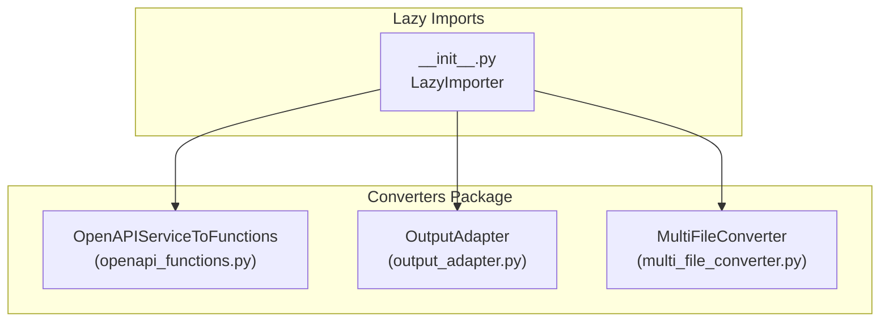
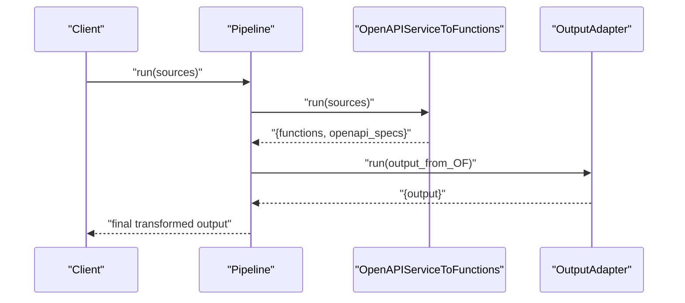
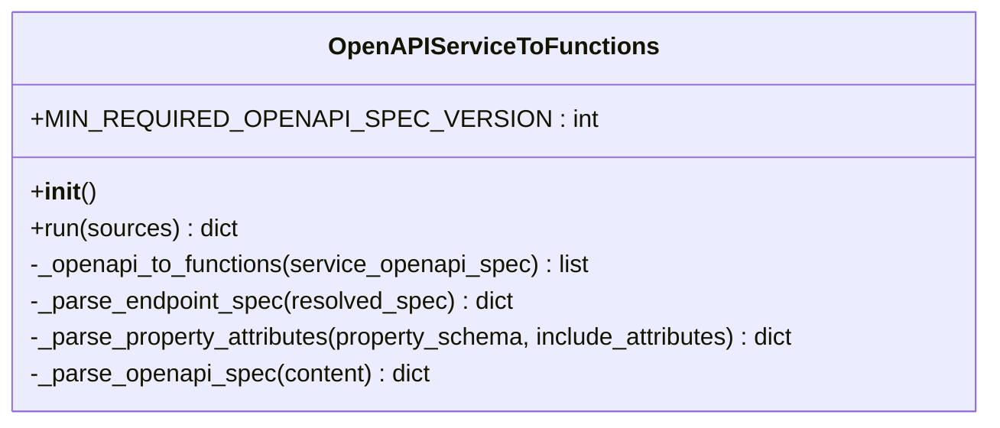
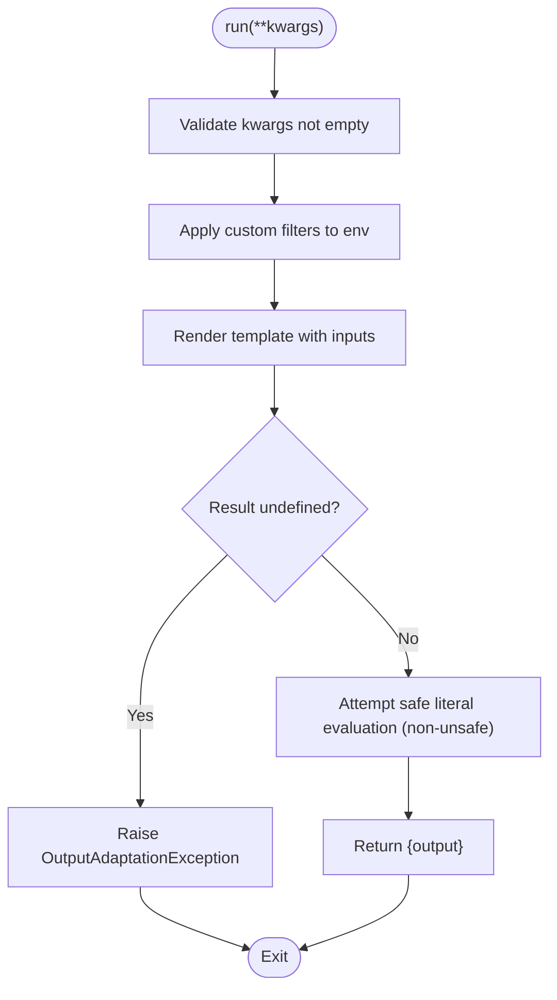
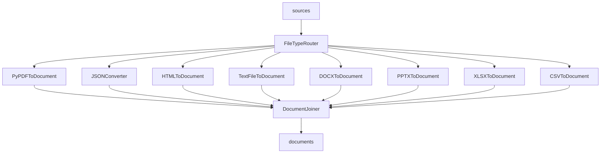
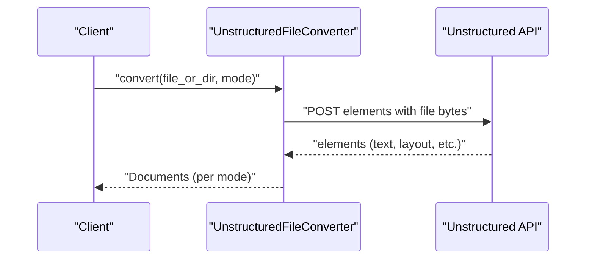
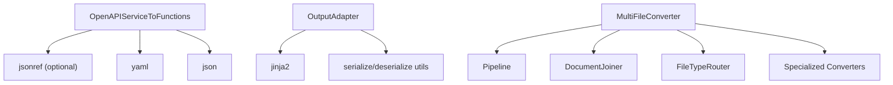

# Specialized Converters

<cite>
**Referenced Files in This Document**
- [openapi_functions.py](file://haystack/components/converters/openapi_functions.py)
- [__init__.py](file://haystack/components/converters/__init__.py)
- [multi_file_converter.py](file://haystack/components/converters/multi_file_converter.py)
- [output_adapter.py](file://haystack/components/converters/output_adapter.py)
- [unstructuredfileconverter.mdx](file://docs-website/docs/pipeline-components/converters/unstructuredfileconverter.mdx)
- [unstructured.md](file://docs-website/reference/integrations-api/unstructured.md)
- [openapiservicetofunctions.mdx](file://docs-website/versioned_docs/version-2.18/pipeline-components/converters/openapiservicetofunctions.mdx)
</cite>

## Table of Contents
1. [Introduction](#introduction)
2. [Project Structure](#project-structure)
3. [Core Components](#core-components)
4. [Architecture Overview](#architecture-overview)
5. [Detailed Component Analysis](#detailed-component-analysis)
6. [Dependency Analysis](#dependency-analysis)
7. [Performance Considerations](#performance-considerations)
8. [Troubleshooting Guide](#troubleshooting-guide)
9. [Conclusion](#conclusion)

## Introduction
This document provides detailed API documentation for specialized converter components in the Haystack ecosystem. It focuses on:
- OpenAPI service function extraction via OpenAPIServiceToFunctions
- Utility conversion functions and adapters
- Multi-format file conversion orchestration
- Integration patterns with external services (notably Unstructured)

It also covers specialized processing for complex document structures, API-driven content transformation, and custom conversion workflows, with examples and guidance for handling semi-structured data and building robust pipelines.

## Project Structure
The specialized converters reside under the converters package and are lazily imported to optimize startup time. The primary components documented here are:
- OpenAPIServiceToFunctions: Converts OpenAPI specifications into OpenAI function-call-compatible definitions
- OutputAdapter: Adapts component outputs using Jinja templates
- MultiFileConverter: Routes and converts multiple file types through a composed pipeline

**Diagram sources**
- [__init__.py](file://haystack/components/converters/__init__.py#L10-L50)
- [openapi_functions.py](file://haystack/components/converters/openapi_functions.py#L22-L54)
- [output_adapter.py](file://haystack/components/converters/output_adapter.py#L26-L104)
- [multi_file_converter.py](file://haystack/components/converters/multi_file_converter.py#L37-L124)

**Section sources**
- [__init__.py](file://haystack/components/converters/__init__.py#L10-L50)

## Core Components
- OpenAPIServiceToFunctions: Extracts function definitions from OpenAPI 3+ specifications and formats them for OpenAI function calling. It supports JSON and YAML inputs, resolves JSON references, and aggregates functions across multiple sources.
- OutputAdapter: Renders component outputs using Jinja templates with strict or native environments, enabling flexible transformations and custom filters.
- MultiFileConverter: A composite converter that routes files by MIME type to appropriate specialized converters and joins the resulting documents.

**Section sources**
- [openapi_functions.py](file://haystack/components/converters/openapi_functions.py#L22-L115)
- [output_adapter.py](file://haystack/components/converters/output_adapter.py#L26-L142)
- [multi_file_converter.py](file://haystack/components/converters/multi_file_converter.py#L37-L124)

## Architecture Overview
The specialized converters integrate with Haystack’s component model and pipeline orchestration. OpenAPIServiceToFunctions is a standalone component that produces function definitions and raw specs. OutputAdapter adapts outputs from other components into desired shapes. MultiFileConverter composes multiple converters behind a single interface.

**Diagram sources**
- [openapi_functions.py](file://haystack/components/converters/openapi_functions.py#L55-L115)
- [output_adapter.py](file://haystack/components/converters/output_adapter.py#L107-L142)

## Detailed Component Analysis

### OpenAPIServiceToFunctions
Purpose:
- Transform OpenAPI 3+ specifications into OpenAI function-call-compatible definitions
- Support JSON/YAML inputs, resolve JSON references, and aggregate results across multiple sources

Key behaviors:
- Validates minimum OpenAPI version and presence of required fields
- Iterates over paths and endpoint specs to build function definitions
- Builds parameter schemas from requestBody and parameters, preserving nested objects and arrays
- Returns both function definitions and original specs (with references resolved)

API surface:
- Constructor: initializes and checks optional dependency
- run(sources): processes a list of file paths, ByteStream, or YAML/JSON content
- Internal helpers: _openapi_to_functions, _parse_endpoint_spec, _parse_property_attributes, _parse_openapi_spec

**Diagram sources**
- [openapi_functions.py](file://haystack/components/converters/openapi_functions.py#L22-L258)

Usage examples (conceptual):
- Convert a single OpenAPI YAML file to function definitions and save the function list for agent use
- Aggregate multiple OpenAPI specs and produce a unified function catalog for downstream tools

Integration notes:
- Requires optional dependency for JSON reference resolution
- Emits warnings for invalid sources or specs; raises explicit exceptions for unsupported formats or versions

**Section sources**
- [openapi_functions.py](file://haystack/components/converters/openapi_functions.py#L22-L115)
- [openapi_functions.py](file://haystack/components/converters/openapi_functions.py#L117-L151)
- [openapi_functions.py](file://haystack/components/converters/openapi_functions.py#L153-L191)
- [openapi_functions.py](file://haystack/components/converters/openapi_functions.py#L193-L230)
- [openapi_functions.py](file://haystack/components/converters/openapi_functions.py#L232-L258)

### OutputAdapter
Purpose:
- Adapt component outputs using Jinja templates
- Supports safe sandboxed environment or unsafe native environment for advanced templating

Key behaviors:
- Validates template syntax at initialization
- Extracts template variables and assigns custom filters
- Renders templates with provided inputs; attempts safe evaluation for non-string outputs
- Raises a dedicated exception type for adaptation failures

API surface:
- Constructor: accepts template string, output type, custom filters, and unsafe flag
- run(**kwargs): renders template and returns adapted output
- Serialization: to_dict/from_dict for persistence

**Diagram sources**
- [output_adapter.py](file://haystack/components/converters/output_adapter.py#L107-L142)

Usage examples (conceptual):
- Transform a list of Documents into a plain string by selecting the first document’s content
- Build structured outputs from heterogeneous inputs using custom filters

Security note:
- Unsafe mode enables arbitrary code execution; use only with trusted templates

**Section sources**
- [output_adapter.py](file://haystack/components/converters/output_adapter.py#L26-L104)
- [output_adapter.py](file://haystack/components/converters/output_adapter.py#L107-L142)
- [output_adapter.py](file://haystack/components/converters/output_adapter.py#L144-L179)

### MultiFileConverter
Purpose:
- Route and convert multiple file types through a composed pipeline
- Join converted documents into a single list

Key behaviors:
- Uses a router to classify files by MIME type
- Connects each MIME type to a specialized converter (e.g., PyPDFToDocument, JSONConverter, HTMLToDocument)
- Joins outputs from all converters into a unified document stream
- Exposes mapping for classified/unclassified/failed routing outcomes

API surface:
- Constructor: configures encoding, JSON content key, and builds the internal pipeline
- run(sources, meta): executes the pipeline and returns documents plus routing diagnostics

**Diagram sources**
- [multi_file_converter.py](file://haystack/components/converters/multi_file_converter.py#L72-L123)

Usage examples (conceptual):
- Convert a batch of mixed files (PDF, JSON, HTML, text) into a single document collection
- Pass metadata to propagate context across conversions

**Section sources**
- [multi_file_converter.py](file://haystack/components/converters/multi_file_converter.py#L37-L124)

### Unstructured Integration Overview
While the UnstructuredFileConverter is documented in the documentation website, the actual converter implementation resides in an external integration package. The documentation describes:
- Supported modes: one document per file, one per page, one per element
- Two API tiers: Free Unstructured API and Unstructured Serverless API
- Installation requirement for the integration package

**Diagram sources**
- [unstructuredfileconverter.mdx](file://docs-website/docs/pipeline-components/converters/unstructuredfileconverter.mdx#L24-L34)
- [unstructured.md](file://docs-website/reference/integrations-api/unstructured.md)

**Section sources**
- [unstructuredfileconverter.mdx](file://docs-website/docs/pipeline-components/converters/unstructuredfileconverter.mdx#L21-L50)
- [unstructured.md](file://docs-website/reference/integrations-api/unstructured.md)

## Dependency Analysis
- OpenAPIServiceToFunctions depends on:
  - Optional JSON reference resolution library for spec normalization
  - Standard libraries for parsing JSON/YAML and logging
- OutputAdapter depends on:
  - Jinja2 for templating (sandboxed or native)
  - Utilities for serializing/deserializing types and callables
- MultiFileConverter composes multiple converters and a joiner, routing inputs by MIME type

**Diagram sources**
- [openapi_functions.py](file://haystack/components/converters/openapi_functions.py#L18-L19)
- [output_adapter.py](file://haystack/components/converters/output_adapter.py#L15-L17)
- [multi_file_converter.py](file://haystack/components/converters/multi_file_converter.py#L84-L123)

**Section sources**
- [openapi_functions.py](file://haystack/components/converters/openapi_functions.py#L18-L19)
- [output_adapter.py](file://haystack/components/converters/output_adapter.py#L15-L17)
- [multi_file_converter.py](file://haystack/components/converters/multi_file_converter.py#L84-L123)

## Performance Considerations
- OpenAPIServiceToFunctions:
  - Parsing and resolving references can be CPU-intensive for large specs; cache results when reusing the same spec
  - Batch multiple sources to reduce repeated parsing overhead
- OutputAdapter:
  - Prefer sandboxed environment for safety; avoid unsafe mode unless necessary
  - Keep templates concise and avoid heavy computations inside templates
- MultiFileConverter:
  - Reuse the built pipeline to avoid rebuilding routing and converter connections
  - Limit unnecessary conversions by filtering sources early
- Unstructured integration:
  - Network latency and rate limits apply; consider batching and retries
  - Choose appropriate mode (one-doc-per-file vs per-element) to balance memory and processing costs

[No sources needed since this section provides general guidance]

## Troubleshooting Guide
Common issues and resolutions:
- OpenAPIServiceToFunctions
  - Invalid or unsupported OpenAPI version: ensure spec version meets minimum requirement
  - Missing operationId or parameters: function extraction requires unique operation identifiers and parameter schemas
  - Unsupported source type: only str, Path, and ByteStream are accepted
  - No functions extracted: verify paths and endpoint specs contain required fields
- OutputAdapter
  - Undefined variables in template: ensure all template variables are provided in run()
  - Template syntax errors: fix Jinja syntax or enable unsafe mode cautiously
  - Literal evaluation failures: avoid returning non-literal structures unless using unsafe mode
- MultiFileConverter
  - Routing failures: verify MIME types and file extensions; ensure additional mappings are configured
  - Joined documents missing: confirm all branches connect to the joiner

**Section sources**
- [openapi_functions.py](file://haystack/components/converters/openapi_functions.py#L68-L72)
- [openapi_functions.py](file://haystack/components/converters/openapi_functions.py#L133-L143)
- [openapi_functions.py](file://haystack/components/converters/openapi_functions.py#L154-L191)
- [output_adapter.py](file://haystack/components/converters/output_adapter.py#L119-L142)
- [multi_file_converter.py](file://haystack/components/converters/multi_file_converter.py#L103-L123)

## Conclusion
These specialized converters enable robust, API-driven content transformation and complex document processing:
- OpenAPIServiceToFunctions streamlines function extraction from OpenAPI specs for agent workflows
- OutputAdapter offers flexible output shaping via templates
- MultiFileConverter orchestrates heterogeneous file conversions efficiently
- Unstructured integration extends capabilities to diverse document formats

Adopt the recommended patterns, monitor performance, and leverage the troubleshooting tips to build reliable pipelines for semi-structured and structured data processing.