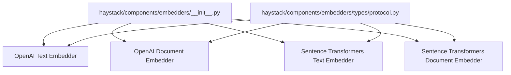
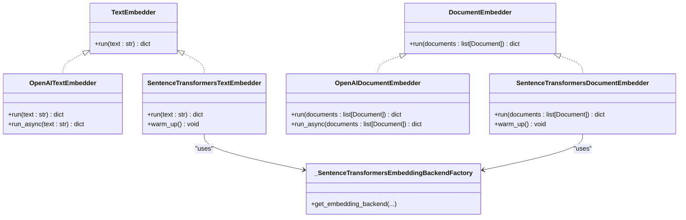
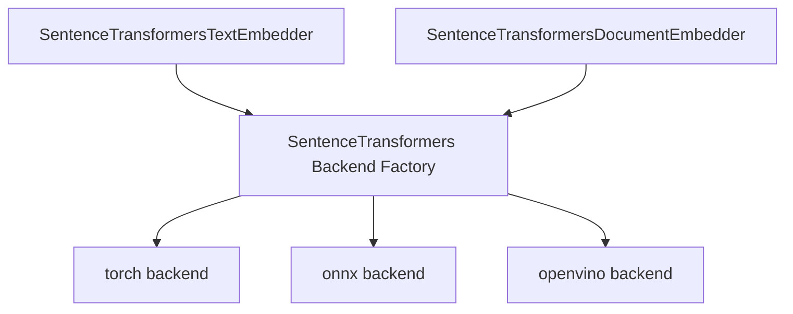

# Embedder APIs

<cite>
**Referenced Files in This Document**
- [haystack/components/embedders/__init__.py](file://haystack/components/embedders/__init__.py)
- [haystack/components/embedders/types/protocol.py](file://haystack/components/embedders/types/protocol.py)
- [haystack/components/embedders/openai_text_embedder.py](file://haystack/components/embedders/openai_text_embedder.py)
- [haystack/components/embedders/openai_document_embedder.py](file://haystack/components/embedders/openai_document_embedder.py)
- [haystack/components/embedders/sentence_transformers_text_embedder.py](file://haystack/components/embedders/sentence_transformers_text_embedder.py)
- [haystack/components/embedders/sentence_transformers_document_embedder.py](file://haystack/components/embedders/sentence_transformers_document_embedder.py)
- [haystack/dataclasses/document.py](file://haystack/dataclasses/document.py)
- [haystack/dataclasses/image_content.py](file://haystack/dataclasses/image_content.py)
- [haystack/components/embedders/backends/sentence_transformers_backend.py](file://haystack/components/embedders/backends/sentence_transformers_backend.py)
- [pydoc/embedders_api.yml](file://pydoc/embedders_api.yml)
</cite>

## Table of Contents
1. [Introduction](#introduction)
2. [Project Structure](#project-structure)
3. [Core Components](#core-components)
4. [Architecture Overview](#architecture-overview)
5. [Detailed Component Analysis](#detailed-component-analysis)
6. [Dependency Analysis](#dependency-analysis)
7. [Performance Considerations](#performance-considerations)
8. [Troubleshooting Guide](#troubleshooting-guide)
9. [Conclusion](#conclusion)
10. [Appendices](#appendices)

## Introduction
This document provides comprehensive API documentation for Haystack Embedder components. It covers text and document embedding APIs across multiple providers, including OpenAI, Azure OpenAI, Hugging Face via Sentence Transformers, and Sentence Transformers directly. It also documents sparse embedding support and patterns for building custom embedders. The guide details embedding dimensions, normalization options, batch processing capabilities, device management, method signatures, parameter specifications, output formats, and integration tips for vector databases.

## Project Structure
The embedders are organized under a dedicated module with lazy imports and provider-specific implementations. The public surface is exposed via a central initializer that maps provider names to concrete classes. A protocol defines the expected interface for text and document embedders, enabling consistent behavior across providers.

**Diagram sources**
- [haystack/components/embedders/__init__.py](file://haystack/components/embedders/__init__.py#L10-L21)
- [haystack/components/embedders/types/protocol.py](file://haystack/components/embedders/types/protocol.py#L10-L51)

**Section sources**
- [haystack/components/embedders/__init__.py](file://haystack/components/embedders/__init__.py#L10-L21)
- [pydoc/embedders_api.yml](file://pydoc/embedders_api.yml#L1-L17)

## Core Components
This section summarizes the primary embedder interfaces and their responsibilities.

- TextEmbedder protocol: Defines a single-method contract for generating embeddings from raw text.
- DocumentEmbedder protocol: Defines a single-method contract for generating embeddings for lists of Documents.
- Provider-specific embedders:
  - OpenAI text and document embedders
  - Sentence Transformers text and document embedders
- Backend abstraction for Sentence Transformers to support multiple execution backends and device management.

Key output formats:
- Text embedders return a dictionary with an embedding key holding a list of floats.
- Document embedders return a dictionary with a documents key holding a list of Documents, each enriched with an embedding field.

**Section sources**
- [haystack/components/embedders/types/protocol.py](file://haystack/components/embedders/types/protocol.py#L10-L51)
- [haystack/dataclasses/document.py](file://haystack/dataclasses/document.py#L69-L70)

## Architecture Overview
The embedder ecosystem follows a component-based architecture with provider-specific implementations and a shared protocol. Sentence Transformers embedders delegate to a backend factory to manage model loading, device assignment, and inference.

**Diagram sources**
- [haystack/components/embedders/types/protocol.py](file://haystack/components/embedders/types/protocol.py#L10-L51)
- [haystack/components/embedders/openai_text_embedder.py](file://haystack/components/embedders/openai_text_embedder.py#L16-L211)
- [haystack/components/embedders/openai_document_embedder.py](file://haystack/components/embedders/openai_document_embedder.py#L21-L352)
- [haystack/components/embedders/sentence_transformers_text_embedder.py](file://haystack/components/embedders/sentence_transformers_text_embedder.py#L16-L242)
- [haystack/components/embedders/sentence_transformers_document_embedder.py](file://haystack/components/embedders/sentence_transformers_document_embedder.py#L17-L270)
- [haystack/components/embedders/backends/sentence_transformers_backend.py](file://haystack/components/embedders/backends/sentence_transformers_backend.py)

## Detailed Component Analysis

### OpenAI Text Embedder
- Purpose: Embed a single text string using OpenAI’s embeddings API.
- Method signature:
  - run(text: str) -> dict[str, Any] with keys "embedding" (list[float]) and optional "meta" (dict[str, Any]).
  - run_async(text: str) -> dict[str, Any] for asynchronous execution.
- Parameters:
  - api_key: Secret
  - model: str (default model name)
  - dimensions: int | None (requires specific models)
  - api_base_url: str | None
  - organization: str | None
  - prefix: str
  - suffix: str
  - timeout: float | None
  - max_retries: int | None
  - http_client_kwargs: dict[str, Any] | None
- Output format:
  - embedding: list[float]
  - meta: dict containing model name and usage metrics
- Notes:
  - Supports async execution.
  - Adds prefix and suffix to input text before embedding.
  - Uses an HTTP client configured via environment variables or explicit parameters.

**Section sources**
- [haystack/components/embedders/openai_text_embedder.py](file://haystack/components/embedders/openai_text_embedder.py#L40-L90)
- [haystack/components/embedders/openai_text_embedder.py](file://haystack/components/embedders/openai_text_embedder.py#L175-L191)
- [haystack/components/embedders/openai_text_embedder.py](file://haystack/components/embedders/openai_text_embedder.py#L192-L211)

### OpenAI Document Embedder
- Purpose: Embed a batch of Documents using OpenAI’s embeddings API.
- Method signature:
  - run(documents: list[Document]) -> dict[str, Any] with keys "documents" (list[Document]) and optional "meta".
  - run_async(documents: list[Document]) -> dict[str, Any] for asynchronous execution.
- Parameters:
  - api_key, model, dimensions, api_base_url, organization, prefix, suffix, batch_size, progress_bar, embedding_separator, timeout, max_retries, http_client_kwargs, raise_on_failure
- Behavior:
  - Concatenates selected metadata fields and content with separator and optional prefix/suffix.
  - Batches requests and aggregates usage metrics.
  - On failure, logs and optionally raises depending on raise_on_failure.
- Output format:
  - documents: list[Document] with embedding fields populated.
  - meta: aggregated usage metrics.

**Section sources**
- [haystack/components/embedders/openai_document_embedder.py](file://haystack/components/embedders/openai_document_embedder.py#L43-L125)
- [haystack/components/embedders/openai_document_embedder.py](file://haystack/components/embedders/openai_document_embedder.py#L287-L318)
- [haystack/components/embedders/openai_document_embedder.py](file://haystack/components/embedders/openai_document_embedder.py#L319-L352)

### Sentence Transformers Text Embedder
- Purpose: Embed a single text string using locally loaded Sentence Transformers models.
- Method signature:
  - run(text: str) -> dict[str, Any] with key "embedding" (list[float]).
- Parameters:
  - model: str (local path or HF model ID)
  - device: ComponentDevice | None
  - token: Secret | None
  - prefix: str
  - suffix: str
  - batch_size: int
  - progress_bar: bool
  - normalize_embeddings: bool
  - trust_remote_code: bool
  - local_files_only: bool
  - truncate_dim: int | None
  - model_kwargs, tokenizer_kwargs, config_kwargs
  - precision: Literal["float32", "int8", "uint8", "binary", "ubinary"]
  - encode_kwargs: dict[str, Any] | None
  - backend: Literal["torch", "onnx", "openvino"]
  - revision: str | None
- Lifecycle:
  - warm_up(): Initializes the backend and tokenizer configuration.
- Output format:
  - embedding: list[float] (optionally normalized and/or quantized per precision)

**Section sources**
- [haystack/components/embedders/sentence_transformers_text_embedder.py](file://haystack/components/embedders/sentence_transformers_text_embedder.py#L37-L115)
- [haystack/components/embedders/sentence_transformers_text_embedder.py](file://haystack/components/embedders/sentence_transformers_text_embedder.py#L189-L209)
- [haystack/components/embedders/sentence_transformers_text_embedder.py](file://haystack/components/embedders/sentence_transformers_text_embedder.py#L210-L242)

### Sentence Transformers Document Embedder
- Purpose: Embed a batch of Documents using locally loaded Sentence Transformers models.
- Method signature:
  - run(documents: list[Document]) -> dict[str, Any] with key "documents" (list[Document]).
- Parameters:
  - Same as text embedder, plus:
    - meta_fields_to_embed: list[str] | None
    - embedding_separator: str
- Behavior:
  - Concatenates selected metadata fields and content with separator and optional prefix/suffix.
  - Delegates embedding to the backend with configurable batch size, normalization, and precision.
- Output format:
  - documents: list[Document] with embedding fields populated.

**Section sources**
- [haystack/components/embedders/sentence_transformers_document_embedder.py](file://haystack/components/embedders/sentence_transformers_document_embedder.py#L42-L126)
- [haystack/components/embedders/sentence_transformers_document_embedder.py](file://haystack/components/embedders/sentence_transformers_document_embedder.py#L204-L224)
- [haystack/components/embedders/sentence_transformers_document_embedder.py](file://haystack/components/embedders/sentence_transformers_document_embedder.py#L225-L270)

### Sparse Embedding Support
- Sparse embeddings are represented by a dedicated dataclass and can be attached to Documents.
- Sentence Transformers sparse embedders are available in the embedders package and leverage the same Document dataclass fields for sparse_embedding.

**Section sources**
- [haystack/dataclasses/document.py](file://haystack/dataclasses/document.py#L69-L70)

### Image Content and Image Embedding
- ImageContent supports constructing image representations from files, URLs, and base64 data with optional detail hints and validation.
- Image embedding is supported via a dedicated image embedder component that integrates with Sentence Transformers.

**Section sources**
- [haystack/dataclasses/image_content.py](file://haystack/dataclasses/image_content.py#L153-L188)
- [haystack/dataclasses/image_content.py](file://haystack/dataclasses/image_content.py#L190-L247)

## Dependency Analysis
Provider-specific embedders depend on external libraries and internal backend abstractions. The Sentence Transformers embedders rely on a backend factory to manage model loading and inference across different backends and devices.

**Diagram sources**
- [haystack/components/embedders/sentence_transformers_text_embedder.py](file://haystack/components/embedders/sentence_transformers_text_embedder.py#L189-L209)
- [haystack/components/embedders/sentence_transformers_document_embedder.py](file://haystack/components/embedders/sentence_transformers_document_embedder.py#L204-L224)
- [haystack/components/embedders/backends/sentence_transformers_backend.py](file://haystack/components/embedders/backends/sentence_transformers_backend.py)

**Section sources**
- [haystack/components/embedders/sentence_transformers_text_embedder.py](file://haystack/components/embedders/sentence_transformers_text_embedder.py#L189-L209)
- [haystack/components/embedders/sentence_transformers_document_embedder.py](file://haystack/components/embedders/sentence_transformers_document_embedder.py#L204-L224)

## Performance Considerations
- Batch processing:
  - OpenAI embedders support batching via batch_size and progress reporting.
  - Sentence Transformers embedders support batching and progress bars.
- Device management:
  - Sentence Transformers embedders accept a device parameter and can leverage GPU/CPU efficiently.
- Normalization and quantization:
  - Sentence Transformers support L2 normalization and multiple precision modes for reduced storage and faster computation.
- Truncation:
  - Truncation can reduce embedding dimensionality; use carefully, especially without Matryoshka training.
- Asynchronous execution:
  - OpenAI embedders expose async run methods for improved throughput in async pipelines.

[No sources needed since this section provides general guidance]

## Troubleshooting Guide
- Type mismatches:
  - Passing a list to a text embedder or a string to a document embedder raises a TypeError. Ensure correct input types.
- Model dimensions:
  - The dimensions parameter is only supported by specific OpenAI models; verify model compatibility.
- Remote code and private models:
  - When using private Hugging Face models, ensure tokens are configured and trust_remote_code is set appropriately.
- Progress and timeouts:
  - Configure timeouts and retries for OpenAI clients; adjust batch sizes to balance throughput and memory usage.
- Failure handling:
  - OpenAI document embedder can raise on failure or continue processing depending on raise_on_failure setting.

**Section sources**
- [haystack/components/embedders/openai_text_embedder.py](file://haystack/components/embedders/openai_text_embedder.py#L158-L166)
- [haystack/components/embedders/openai_document_embedder.py](file://haystack/components/embedders/openai_document_embedder.py#L300-L304)
- [haystack/components/embedders/sentence_transformers_text_embedder.py](file://haystack/components/embedders/sentence_transformers_text_embedder.py#L222-L226)
- [haystack/components/embedders/sentence_transformers_document_embedder.py](file://haystack/components/embedders/sentence_transformers_document_embedder.py#L237-L241)

## Conclusion
Haystack’s embedder ecosystem offers a consistent protocol-driven interface across providers, robust batching and device management for local models, and flexible configuration for normalization, quantization, and precision. OpenAI embedders integrate seamlessly with cloud APIs, while Sentence Transformers enable efficient local inference with multiple backend options. Sparse embeddings and image content support round out the capabilities for modern retrieval and multimodal applications.

[No sources needed since this section summarizes without analyzing specific files]

## Appendices

### API Reference Index
- OpenAI Text Embedder: [run](file://haystack/components/embedders/openai_text_embedder.py#L175-L191), [run_async](file://haystack/components/embedders/openai_text_embedder.py#L192-L211)
- OpenAI Document Embedder: [run](file://haystack/components/embedders/openai_document_embedder.py#L287-L318), [run_async](file://haystack/components/embedders/openai_document_embedder.py#L319-L352)
- Sentence Transformers Text Embedder: [run](file://haystack/components/embedders/sentence_transformers_text_embedder.py#L210-L242), [warm_up](file://haystack/components/embedders/sentence_transformers_text_embedder.py#L189-L209)
- Sentence Transformers Document Embedder: [run](file://haystack/components/embedders/sentence_transformers_document_embedder.py#L225-L270), [warm_up](file://haystack/components/embedders/sentence_transformers_document_embedder.py#L204-L224)
- Protocols: [TextEmbedder](file://haystack/components/embedders/types/protocol.py#L10-L29), [DocumentEmbedder](file://haystack/components/embedders/types/protocol.py#L32-L51)

### Integration Tips for Vector Databases
- Normalize embeddings when required by the vector database metric (e.g., dot product vs cosine).
- Use appropriate precision and truncate_dim to match storage and performance targets.
- For hybrid retrieval, combine dense embeddings with sparse embeddings where supported by the vector store.

[No sources needed since this section provides general guidance]