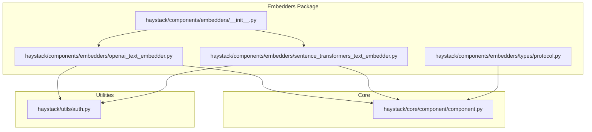
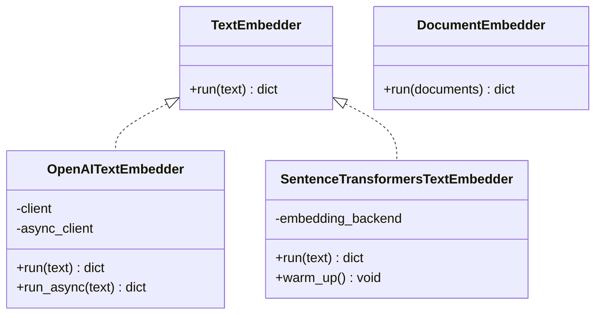
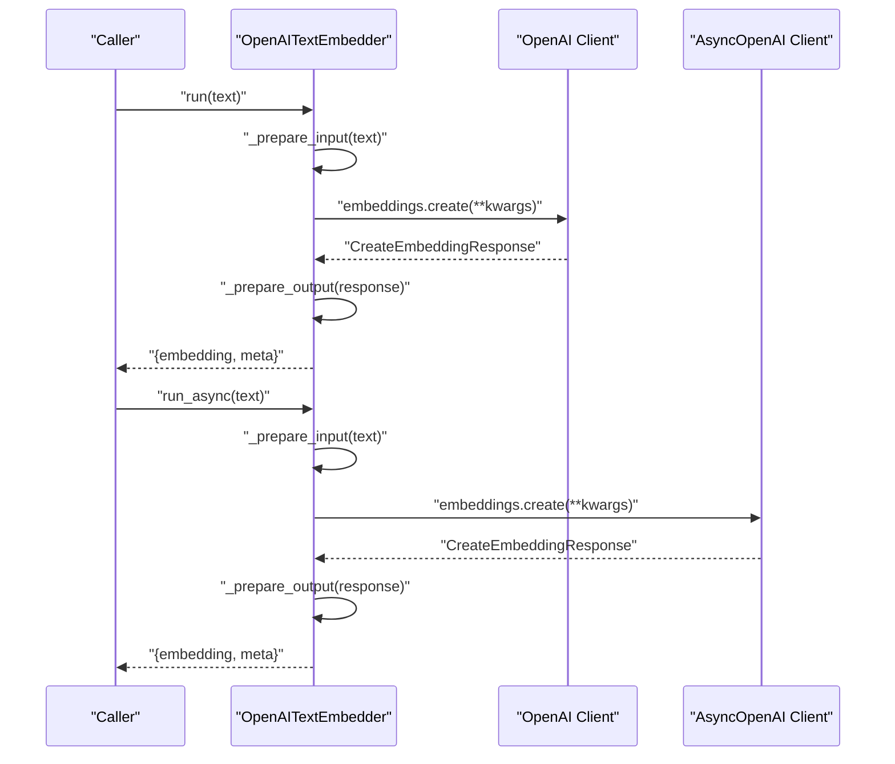
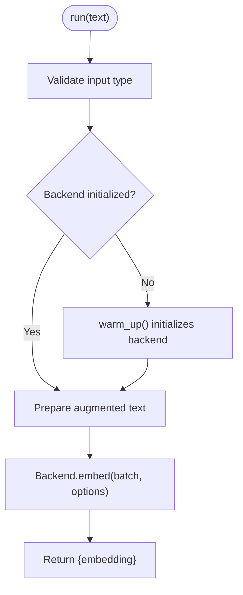
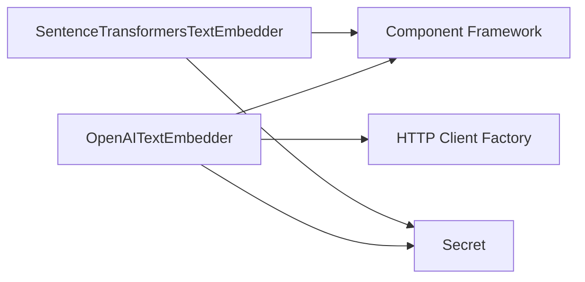

# Embedder Backend APIs

<cite>
**Referenced Files in This Document**
- [__init__.py](file://haystack/components/embedders/__init__.py)
- [protocol.py](file://haystack/components/embedders/types/protocol.py)
- [component.py](file://haystack/core/component/component.py)
- [auth.py](file://haystack/utils/auth.py)
- [openai_text_embedder.py](file://haystack/components/embedders/openai_text_embedder.py)
- [sentence_transformers_text_embedder.py](file://haystack/components/embedders/sentence_transformers_text_embedder.py)
</cite>

## Table of Contents
1. [Introduction](#introduction)
2. [Project Structure](#project-structure)
3. [Core Components](#core-components)
4. [Architecture Overview](#architecture-overview)
5. [Detailed Component Analysis](#detailed-component-analysis)
6. [Dependency Analysis](#dependency-analysis)
7. [Performance Considerations](#performance-considerations)
8. [Troubleshooting Guide](#troubleshooting-guide)
9. [Conclusion](#conclusion)
10. [Appendices](#appendices)

## Introduction
This document describes the embedder backend APIs in Haystack, focusing on the abstraction layer that separates high-level embedder components from provider-specific implementations. It explains how backends are selected, configured, and integrated with providers such as OpenAI and Sentence Transformers. It also covers authentication, rate limiting, error handling, and performance monitoring, and provides guidance for developing custom backends.

## Project Structure
Embedders are organized under a dedicated package with lazy imports to optimize startup. The embedder package exposes provider-specific components (for example, OpenAI and Sentence Transformers) and defines a small set of protocols that describe the expected interface for text and document embedding.

**Diagram sources**
- [__init__.py](file://haystack/components/embedders/__init__.py#L10-L44)
- [protocol.py](file://haystack/components/embedders/types/protocol.py#L10-L51)
- [component.py](file://haystack/core/component/component.py#L572-L641)
- [auth.py](file://haystack/utils/auth.py#L34-L130)
- [openai_text_embedder.py](file://haystack/components/embedders/openai_text_embedder.py#L16-L118)
- [sentence_transformers_text_embedder.py](file://haystack/components/embedders/sentence_transformers_text_embedder.py#L16-L135)

**Section sources**
- [__init__.py](file://haystack/components/embedders/__init__.py#L10-L44)
- [protocol.py](file://haystack/components/embedders/types/protocol.py#L10-L51)

## Core Components
Haystack’s embedder components implement a simple, consistent interface defined by protocols:
- TextEmbedder: produces a single embedding for a string input.
- DocumentEmbedder: attaches embeddings to a list of Documents.

These protocols guide the design of backend implementations and ensure compatibility across providers.

Key characteristics:
- Inputs and outputs are described declaratively via the component decorator and sockets.
- Components expose run and optional run_async methods for synchronous and asynchronous execution.
- Serialization and deserialization helpers are used to persist component state.

**Section sources**
- [protocol.py](file://haystack/components/embedders/types/protocol.py#L10-L51)
- [component.py](file://haystack/core/component/component.py#L572-L641)

## Architecture Overview
The embedder architecture separates concerns between:
- High-level embedder components: expose a uniform API and manage configuration, serialization, and lifecycle.
- Backends: encapsulate provider-specific logic (for example, HTTP clients, model loading, batching).
- Protocols: define the minimal interface that backends must satisfy.

**Diagram sources**
- [protocol.py](file://haystack/components/embedders/types/protocol.py#L10-L51)
- [openai_text_embedder.py](file://haystack/components/embedders/openai_text_embedder.py#L16-L211)
- [sentence_transformers_text_embedder.py](file://haystack/components/embedders/sentence_transformers_text_embedder.py#L16-L242)

## Detailed Component Analysis

### OpenAI Text Embedder
The OpenAITextEmbedder integrates with OpenAI’s embeddings API. It supports:
- Authentication via Secret-backed API keys.
- Environment-driven defaults for timeouts and retries.
- Optional dimensions for supported models.
- Synchronous and asynchronous embedding calls.
- Telemetry data export.

Configuration highlights:
- api_key: Secret-based credential resolution.
- model: Model identifier.
- dimensions: Optional dimensionality for supported models.
- api_base_url, organization: Provider endpoint and organizational context.
- prefix/suffix: String injection around input text.
- timeout, max_retries: Client behavior tuning.
- http_client_kwargs: Fine-grained HTTP client configuration.

Runtime behavior:
- Validates input type and prepares the payload with model, input text, and encoding format.
- Executes a synchronous or asynchronous embedding request.
- Normalizes the response into a standardized output dictionary with embedding and metadata.

**Diagram sources**
- [openai_text_embedder.py](file://haystack/components/embedders/openai_text_embedder.py#L175-L210)

**Section sources**
- [openai_text_embedder.py](file://haystack/components/embedders/openai_text_embedder.py#L40-L118)
- [openai_text_embedder.py](file://haystack/components/embedders/openai_text_embedder.py#L125-L156)
- [openai_text_embedder.py](file://haystack/components/embedders/openai_text_embedder.py#L158-L174)
- [openai_text_embedder.py](file://haystack/components/embedders/openai_text_embedder.py#L175-L210)

### Sentence Transformers Text Embedder
The SentenceTransformersTextEmbedder delegates embedding computation to a backend abstraction that encapsulates model loading and inference. It supports:
- Local or remote model selection via Hugging Face identifiers.
- Device targeting and precision controls.
- Backend acceleration backends (for example, torch, onnx, openvino).
- Warm-up lifecycle to initialize the backend.
- Truncation and normalization options.

Configuration highlights:
- model: Model identifier or path.
- device: Target device abstraction.
- token: Optional HF token for private models.
- prefix/suffix: Text augmentation.
- batch_size, progress_bar, normalize_embeddings.
- precision: Float or quantized embeddings.
- backend: Acceleration backend selection.
- model_kwargs, tokenizer_kwargs, config_kwargs, encode_kwargs: Fine-tuning of model and encoding behavior.

Runtime behavior:
- Validates input type and constructs the augmented text.
- Ensures the backend is initialized via warm_up.
- Delegates embedding to the backend and returns a standardized output.

**Diagram sources**
- [sentence_transformers_text_embedder.py](file://haystack/components/embedders/sentence_transformers_text_embedder.py#L210-L241)

**Section sources**
- [sentence_transformers_text_embedder.py](file://haystack/components/embedders/sentence_transformers_text_embedder.py#L37-L135)
- [sentence_transformers_text_embedder.py](file://haystack/components/embedders/sentence_transformers_text_embedder.py#L142-L187)
- [sentence_transformers_text_embedder.py](file://haystack/components/embedders/sentence_transformers_text_embedder.py#L189-L209)
- [sentence_transformers_text_embedder.py](file://haystack/components/embedders/sentence_transformers_text_embedder.py#L210-L241)

### Backend Abstraction Layer
Backends isolate provider-specific logic behind a unified interface. For Sentence Transformers, the backend is created via a factory and initialized during warm_up. The backend encapsulates:
- Model loading and configuration.
- Encoding options and runtime parameters.
- Precision and acceleration backends.

This separation enables:
- Pluggable backends per provider.
- Consistent component interfaces.
- Simplified testing and mocking.

[No sources needed since this section synthesizes abstractions without quoting specific files]

## Dependency Analysis
Embedder components rely on core infrastructure and utilities:
- Component framework: registration, sockets, and lifecycle.
- Authentication utilities: Secret-based credentials for providers.
- HTTP client utilities: shared HTTP client initialization for external APIs.

**Diagram sources**
- [component.py](file://haystack/core/component/component.py#L572-L641)
- [auth.py](file://haystack/utils/auth.py#L34-L130)
- [openai_text_embedder.py](file://haystack/components/embedders/openai_text_embedder.py#L11-L13)
- [sentence_transformers_text_embedder.py](file://haystack/components/embedders/sentence_transformers_text_embedder.py#L7-L13)

**Section sources**
- [component.py](file://haystack/core/component/component.py#L572-L641)
- [auth.py](file://haystack/utils/auth.py#L34-L130)

## Performance Considerations
- Batch processing: Sentence Transformers supports configurable batch sizes to improve throughput.
- Device selection: Explicitly target GPU/CPU or mapped devices to leverage hardware acceleration.
- Precision: Quantized embeddings reduce memory footprint and speed up computation at potential accuracy cost.
- Asynchronous execution: OpenAI embedders support async calls to overlap I/O with computation.
- Progress reporting: Enable progress bars during warm-up and embedding for long-running jobs.
- Caching and reuse: Reuse initialized backends across runs to avoid repeated model loads.

[No sources needed since this section provides general guidance]

## Troubleshooting Guide
Common issues and strategies:
- Authentication failures: Ensure Secret resolves to a valid token. For environment-based secrets, confirm environment variables are set and accessible.
- Rate limiting and retries: Configure max_retries and timeouts appropriately. For OpenAI, tune retry behavior and consider exponential backoff at the caller level if needed.
- Input validation: Both OpenAI and Sentence Transformers validate input types; ensure you pass a single string for text embedders and lists of Documents for document embedders.
- Backend initialization: For Sentence Transformers, call warm_up before run to ensure the model is loaded and configured.
- Telemetry and observability: Use telemetry data exported by components to monitor model usage and costs.

**Section sources**
- [auth.py](file://haystack/utils/auth.py#L197-L207)
- [openai_text_embedder.py](file://haystack/components/embedders/openai_text_embedder.py#L101-L104)
- [sentence_transformers_text_embedder.py](file://haystack/components/embedders/sentence_transformers_text_embedder.py#L189-L209)

## Conclusion
Haystack’s embedder backend APIs provide a clean separation between high-level components and provider-specific implementations. Through protocols, a robust component framework, and secure authentication utilities, developers can integrate multiple embedding providers while maintaining consistent behavior and performance. Extending the system with custom backends involves implementing the expected interface and wiring them into the component’s lifecycle.

[No sources needed since this section summarizes without analyzing specific files]

## Appendices

### Component Registration and Discovery
- Components are registered through a decorator that validates the component contract and records the class in a registry. This enables serialization, deserialization, and discovery across the system.

**Section sources**
- [component.py](file://haystack/core/component/component.py#L572-L641)

### Provider Authentication Patterns
- Secret-based credentials: Use environment variables or tokens, with strictness controls for missing values.
- OpenAI: API key via Secret; optional organization and base URL overrides.
- Hugging Face: Optional token for private models; supports revision pinning and local-only loading.

**Section sources**
- [auth.py](file://haystack/utils/auth.py#L57-L74)
- [auth.py](file://haystack/utils/auth.py#L171-L213)
- [openai_text_embedder.py](file://haystack/components/embedders/openai_text_embedder.py#L40-L99)
- [sentence_transformers_text_embedder.py](file://haystack/components/embedders/sentence_transformers_text_embedder.py#L37-L57)

### Backend Selection Mechanisms
- OpenAI: Direct client instantiation with model and optional dimensions.
- Sentence Transformers: Factory-based backend selection supporting multiple backends (for example, torch, onnx, openvino) and precision controls.

**Section sources**
- [openai_text_embedder.py](file://haystack/components/embedders/openai_text_embedder.py#L106-L117)
- [sentence_transformers_text_embedder.py](file://haystack/components/embedders/sentence_transformers_text_embedder.py#L193-L206)

### Configuration Management
- Defaults: Many parameters support environment-driven defaults (for example, timeouts and retries).
- Serialization: Components serialize init parameters and Secrets for persistence.
- Model-specific kwargs: Hugging Face-related kwargs are serialized/deserialized safely.

**Section sources**
- [openai_text_embedder.py](file://haystack/components/embedders/openai_text_embedder.py#L101-L104)
- [openai_text_embedder.py](file://haystack/components/embedders/openai_text_embedder.py#L125-L156)
- [sentence_transformers_text_embedder.py](file://haystack/components/embedders/sentence_transformers_text_embedder.py#L142-L187)

### Examples for Custom Backend Development
- Implement a backend class that satisfies the expected interface for the chosen protocol.
- Integrate HTTP client utilities for network calls or model loading utilities for local models.
- Expose a warm_up method to initialize resources and a run method to produce embeddings.
- Provide serialization hooks to persist configuration and Secrets.

[No sources needed since this section provides general guidance]