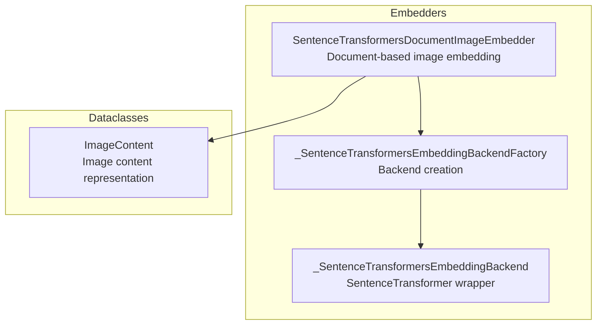
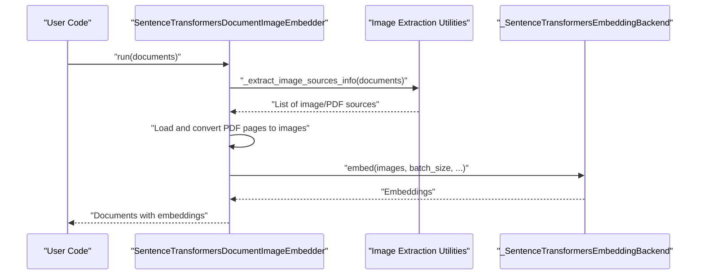
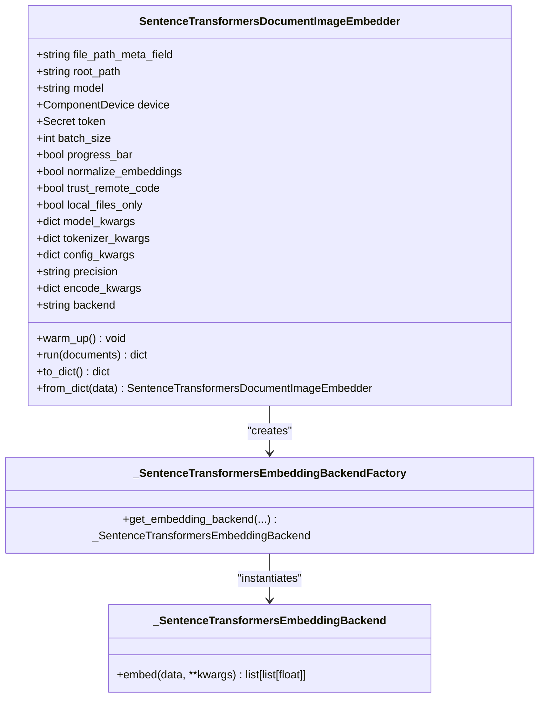
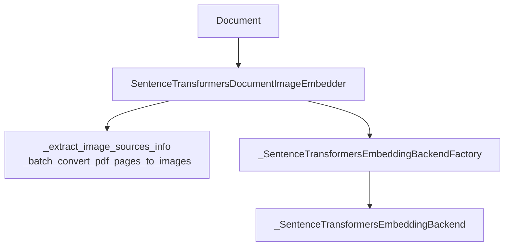

# Image Embedder APIs

<cite>
**Referenced Files in This Document**
- [sentence_transformers_doc_image_embedder.py](file://haystack/components/embedders/image/sentence_transformers_doc_image_embedder.py)
- [sentence_transformers_backend.py](file://haystack/components/embedders/backends/sentence_transformers_backend.py)
- [image_content.py](file://haystack/dataclasses/image_content.py)
- [image/__init__.py](file://haystack/components/embedders/image/__init__.py)
- [test_sentence_transformers_doc_image_embedder.py](file://test/components/embedders/image/test_sentence_transformers_doc_image_embedder.py)
- [amazonbedrockdocumentimageembedder.mdx](file://docs-website/docs/pipeline-components/embedders/amazonbedrockdocumentimageembedder.mdx)
</cite>

## Table of Contents
1. [Introduction](#introduction)
2. [Project Structure](#project-structure)
3. [Core Components](#core-components)
4. [Architecture Overview](#architecture-overview)
5. [Detailed Component Analysis](#detailed-component-analysis)
6. [Dependency Analysis](#dependency-analysis)
7. [Performance Considerations](#performance-considerations)
8. [Troubleshooting Guide](#troubleshooting-guide)
9. [Conclusion](#conclusion)
10. [Appendices](#appendices)

## Introduction
This document provides detailed API documentation for image embedding components in Haystack with a focus on multimodal document and image content processing. It covers the ImageEmbedder interface and specialized implementations, including method signatures, parameter specifications for image preprocessing, resolution handling, batch processing, and output formats. It also includes examples for multimodal embedding scenarios, integration with vision-language models, and performance considerations for large image batches and provider-specific optimizations.

## Project Structure
The image embedding capabilities are primarily implemented under the embedders and dataclasses modules. The key areas include:
- Image embedder implementations for document-based multimodal embedding
- Backend abstraction for Sentence Transformers-based embeddings
- Data structures for image content representation and conversion

**Diagram sources**
- [sentence_transformers_doc_image_embedder.py](file://haystack/components/embedders/image/sentence_transformers_doc_image_embedder.py#L27-L290)
- [sentence_transformers_backend.py](file://haystack/components/embedders/backends/sentence_transformers_backend.py#L18-L117)
- [image_content.py](file://haystack/dataclasses/image_content.py#L60-L247)

**Section sources**
- [sentence_transformers_doc_image_embedder.py](file://haystack/components/embedders/image/sentence_transformers_doc_image_embedder.py#L1-L290)
- [sentence_transformers_backend.py](file://haystack/components/embedders/backends/sentence_transformers_backend.py#L1-L117)
- [image_content.py](file://haystack/dataclasses/image_content.py#L1-L247)

## Core Components
This section introduces the primary image embedding components and their roles:
- SentenceTransformersDocumentImageEmbedder: Computes embeddings for Documents that reference images or PDFs. It supports batch processing, normalization, precision control, and backend selection (torch, ONNX, OpenVINO).
- _SentenceTransformersEmbeddingBackendFactory and _SentenceTransformersEmbeddingBackend: Provide a cached factory and a thin wrapper around SentenceTransformer for efficient embedding computation.
- ImageContent: Represents image content with base64 encoding, MIME type, optional detail level, and metadata. Includes helpers to construct from file paths and URLs with optional resizing.

Key responsibilities:
- Document-based multimodal embedding: Extracts images from Documents using metadata fields and converts PDF pages to images when needed.
- Backend abstraction: Encapsulates model loading and embedding computation with configurable device, precision, and backend.
- Image content handling: Validates and prepares image content for embedding, including optional resizing and detail specification.

**Section sources**
- [sentence_transformers_doc_image_embedder.py](file://haystack/components/embedders/image/sentence_transformers_doc_image_embedder.py#L27-L290)
- [sentence_transformers_backend.py](file://haystack/components/embedders/backends/sentence_transformers_backend.py#L18-L117)
- [image_content.py](file://haystack/dataclasses/image_content.py#L60-L247)

## Architecture Overview
The image embedding pipeline integrates document metadata, image conversion utilities, and the Sentence Transformers backend to produce embeddings for multimodal content.

**Diagram sources**
- [sentence_transformers_doc_image_embedder.py](file://haystack/components/embedders/image/sentence_transformers_doc_image_embedder.py#L219-L290)
- [sentence_transformers_backend.py](file://haystack/components/embedders/backends/sentence_transformers_backend.py#L113-L117)

## Detailed Component Analysis

### SentenceTransformersDocumentImageEmbedder
This component computes embeddings for Documents that reference images or PDFs. It supports:
- Batch processing with configurable batch size
- Normalization of embeddings
- Precision control (float32 and quantized variants)
- Backend selection (torch, ONNX, OpenVINO)
- Device selection and model loading with optional Hugging Face token and remote code trust

Method signature overview:
- run(documents: list[Document]) -> dict[str, list[Document]]

Behavior highlights:
- Validates input type and initializes the embedding backend on first use.
- Extracts image sources from Document metadata, supporting both image files and PDFs with page numbers.
- Converts PDF pages to images and raises an error if conversion fails for any document.
- Embeds images using the configured backend and attaches embeddings to Documents with metadata indicating the embedding source.

Parameter specifications:
- file_path_meta_field: Metadata key pointing to the image or PDF file path.
- root_path: Root directory used to resolve relative paths.
- model: Sentence Transformers model identifier or path.
- device: Target device for model loading.
- token: Hugging Face token for private models.
- batch_size: Number of images to embed per batch.
- progress_bar: Whether to show a progress bar during embedding.
- normalize_embeddings: Whether to normalize embeddings to unit vectors.
- trust_remote_code: Allow custom model architectures.
- local_files_only: Load only local files.
- model_kwargs, tokenizer_kwargs, config_kwargs: Keyword arguments passed to model/tokenizer/config constructors.
- precision: Embedding precision (float32, int8, uint8, binary, ubinary).
- encode_kwargs: Additional keyword arguments passed to the encoder.
- backend: Backend choice (torch, onnx, openvino).

Output format:
- Returns a dictionary with a "documents" key containing Documents with embeddings appended and metadata indicating the embedding source.

Integration notes:
- Works with multimodal models that embed images and text into the same vector space.
- Supports PDFs by converting specific pages to images prior to embedding.

Example usage references:
- See the component’s usage example in the source file comments for typical initialization and run patterns.

**Section sources**
- [sentence_transformers_doc_image_embedder.py](file://haystack/components/embedders/image/sentence_transformers_doc_image_embedder.py#L27-L290)
- [test_sentence_transformers_doc_image_embedder.py](file://test/components/embedders/image/test_sentence_transformers_doc_image_embedder.py#L191-L346)

#### Class Diagram

**Diagram sources**
- [sentence_transformers_doc_image_embedder.py](file://haystack/components/embedders/image/sentence_transformers_doc_image_embedder.py#L59-L152)
- [sentence_transformers_backend.py](file://haystack/components/embedders/backends/sentence_transformers_backend.py#L18-L117)

### ImageContent
ImageContent encapsulates image data and metadata for multimodal workflows:
- base64_image: Base64-encoded image data.
- mime_type: MIME type of the image; auto-detected if not provided.
- detail: Optional detail level (supported by some providers).
- meta: Arbitrary metadata associated with the image.
- validation: Toggle for validation steps (base64 validity, MIME type detection, type check).

Helper methods:
- from_file_path(file_path, size=None, detail=None, meta=None): Build ImageContent from a file path with optional resizing.
- from_url(url, retry_attempts=2, timeout=10, size=None, detail=None, meta=None): Download and convert an image from a URL with optional resizing.
- show(): Display the image (requires Pillow).
- to_dict()/from_dict(): Serialization helpers.

Resolution handling:
- Resizing is supported via the size parameter in from_file_path and from_url, which maintains aspect ratio and reduces memory footprint.

**Section sources**
- [image_content.py](file://haystack/dataclasses/image_content.py#L60-L247)

### Provider-Specific Embedder Example: Amazon Bedrock Document Image Embedder
Haystack Integrations includes a provider-specific embedder for Amazon Bedrock that supports image embeddings:
- Model selection and configuration
- Optional image size scaling
- Single embedding type constraint

Usage example references:
- See the documentation page for initialization, pipeline usage, and configuration details.

**Section sources**
- [amazonbedrockdocumentimageembedder.mdx](file://docs-website/docs/pipeline-components/embedders/amazonbedrockdocumentimageembedder.mdx#L60-L111)

## Dependency Analysis
The image embedding pipeline exhibits clear separation of concerns:
- SentenceTransformersDocumentImageEmbedder depends on:
  - Image extraction utilities for resolving image sources from Document metadata
  - _SentenceTransformersEmbeddingBackendFactory for model instantiation and caching
  - _SentenceTransformersEmbeddingBackend for embedding computation
- ImageContent provides a standardized representation for image data and metadata.

**Diagram sources**
- [sentence_transformers_doc_image_embedder.py](file://haystack/components/embedders/image/sentence_transformers_doc_image_embedder.py#L238-L277)
- [sentence_transformers_backend.py](file://haystack/components/embedders/backends/sentence_transformers_backend.py#L18-L117)

**Section sources**
- [sentence_transformers_doc_image_embedder.py](file://haystack/components/embedders/image/sentence_transformers_doc_image_embedder.py#L219-L290)
- [sentence_transformers_backend.py](file://haystack/components/embedders/backends/sentence_transformers_backend.py#L18-L117)

## Performance Considerations
- Batch processing: Tune batch_size to balance throughput and memory usage. Larger batches increase throughput but require more memory.
- Backend selection: Use ONNX or OpenVINO backends for acceleration and reduced latency when supported by the model.
- Precision: Quantized embeddings (int8, uint8, binary, ubinary) reduce storage and improve speed at potential accuracy cost.
- Device allocation: Prefer GPU devices for faster inference when available; ensure proper driver and runtime support.
- Image preprocessing: Resize images to reasonable dimensions to reduce memory and computation overhead, especially for provider-constrained workflows.
- PDF handling: Converting PDF pages to images is necessary for some models; batching and caching conversions can mitigate overhead.
- Warm-up: Call warm_up once during initialization to avoid repeated model loading and to pre-allocate resources.

Provider-specific optimizations:
- For Amazon Bedrock, configure image_size to align with provider constraints and optimize throughput.
- For Hugging Face-hosted models, leverage trust_remote_code and model_kwargs cautiously to enable advanced features when compatible.

[No sources needed since this section provides general guidance]

## Troubleshooting Guide
Common issues and resolutions:
- Wrong input type: The component expects a list of Documents; passing a string or other types raises a TypeError.
- Conversion failures: If PDF page conversion fails for any document, a RuntimeError is raised with affected document IDs.
- Missing MIME type: When constructing ImageContent from base64 or URL, ensure a valid image MIME type is provided or allow automatic detection.
- Backend mismatch: Ensure the selected backend (torch, onnx, openvino) is compatible with the chosen model and installed dependencies.

Validation and error handling:
- Input validation ensures base64 correctness and MIME type checks for ImageContent.
- Backend factory caches instances keyed by initialization parameters to avoid redundant loads.
- Tests cover error conditions such as wrong input types and conversion failures.

**Section sources**
- [sentence_transformers_doc_image_embedder.py](file://haystack/components/embedders/image/sentence_transformers_doc_image_embedder.py#L230-L234)
- [sentence_transformers_doc_image_embedder.py](file://haystack/components/embedders/image/sentence_transformers_doc_image_embedder.py#L265-L267)
- [image_content.py](file://haystack/dataclasses/image_content.py#L85-L107)
- [test_sentence_transformers_doc_image_embedder.py](file://test/components/embedders/image/test_sentence_transformers_doc_image_embedder.py#L223-L237)
- [test_sentence_transformers_doc_image_embedder.py](file://test/components/embedders/image/test_sentence_transformers_doc_image_embedder.py#L292-L312)

## Conclusion
The image embedding APIs in Haystack provide a robust foundation for multimodal document processing. The SentenceTransformersDocumentImageEmbedder integrates seamlessly with Document metadata, supports flexible preprocessing and backend choices, and delivers embeddings suitable for downstream retrieval and search tasks. Provider-specific embedders further extend capabilities for cloud-based solutions. By tuning batch sizes, precision, and backends, and by leveraging preprocessing and caching strategies, users can achieve efficient and scalable image embedding workflows.

[No sources needed since this section summarizes without analyzing specific files]

## Appendices

### API Reference: SentenceTransformersDocumentImageEmbedder
- Constructor parameters:
  - file_path_meta_field: Metadata key for image/PDF paths
  - root_path: Root path for resolving relative file paths
  - model: Sentence Transformers model identifier or path
  - device: Target device
  - token: Hugging Face token for private models
  - batch_size: Batch size for embedding
  - progress_bar: Show progress bar
  - normalize_embeddings: Normalize embeddings
  - trust_remote_code: Trust remote code
  - local_files_only: Use only local files
  - model_kwargs, tokenizer_kwargs, config_kwargs: Model/tokenizer/config kwargs
  - precision: Embedding precision
  - encode_kwargs: Encoder kwargs
  - backend: Backend selection
- Methods:
  - warm_up(): Initialize the embedding backend
  - run(documents): Embed a list of Documents
  - to_dict()/from_dict(): Serialization

**Section sources**
- [sentence_transformers_doc_image_embedder.py](file://haystack/components/embedders/image/sentence_transformers_doc_image_embedder.py#L59-L152)
- [sentence_transformers_doc_image_embedder.py](file://haystack/components/embedders/image/sentence_transformers_doc_image_embedder.py#L184-L197)
- [sentence_transformers_doc_image_embedder.py](file://haystack/components/embedders/image/sentence_transformers_doc_image_embedder.py#L219-L290)

### API Reference: ImageContent
- Fields:
  - base64_image: Base64-encoded image
  - mime_type: Image MIME type
  - detail: Optional detail level
  - meta: Metadata dictionary
  - validation: Validation toggle
- Methods:
  - from_file_path(file_path, size=None, detail=None, meta=None)
  - from_url(url, retry_attempts=2, timeout=10, size=None, detail=None, meta=None)
  - show(), to_dict(), from_dict()

**Section sources**
- [image_content.py](file://haystack/dataclasses/image_content.py#L60-L247)

### Integration Examples
- Document-based multimodal embedding with SentenceTransformersDocumentImageEmbedder:
  - Initialize the embedder with a compatible model
  - Prepare Documents with metadata pointing to images or PDFs
  - Run the embedder to obtain Documents with embeddings attached
- Provider-specific embedding with Amazon Bedrock:
  - Configure model and image size
  - Use the provider embedder in a pipeline for indexing or retrieval

**Section sources**
- [sentence_transformers_doc_image_embedder.py](file://haystack/components/embedders/image/sentence_transformers_doc_image_embedder.py#L34-L56)
- [amazonbedrockdocumentimageembedder.mdx](file://docs-website/docs/pipeline-components/embedders/amazonbedrockdocumentimageembedder.mdx#L60-L111)