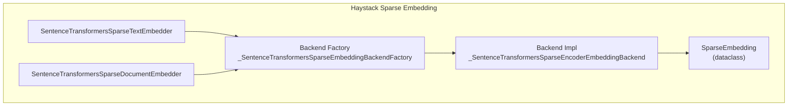
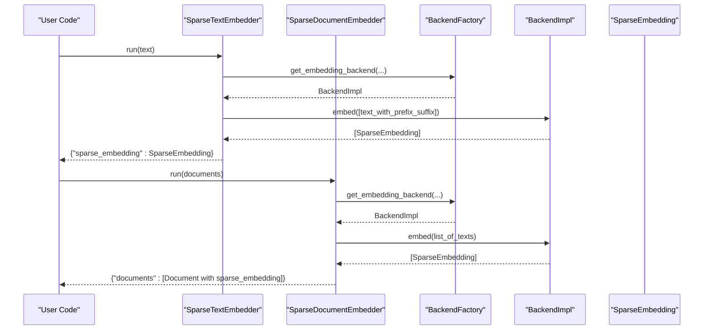
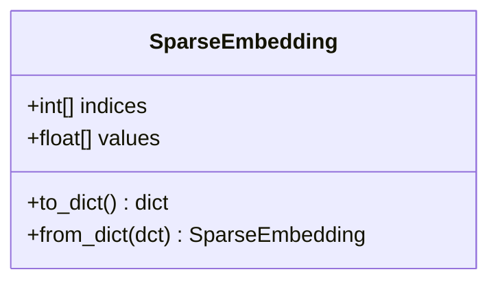
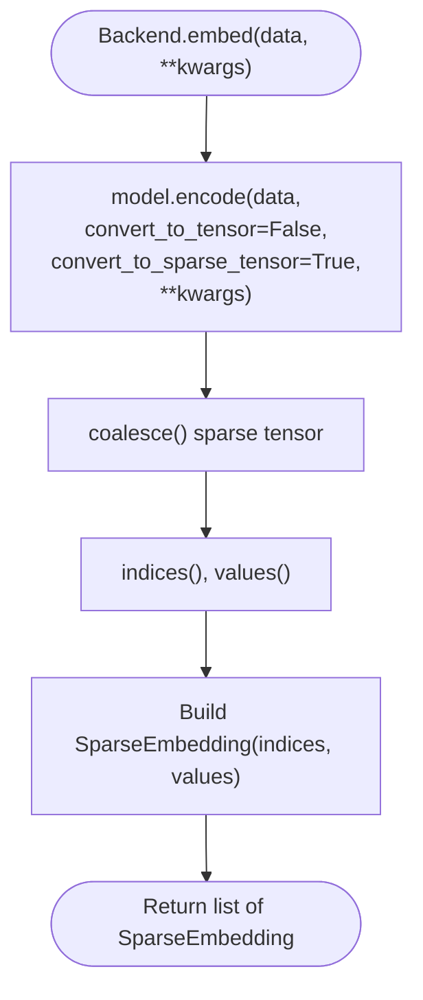
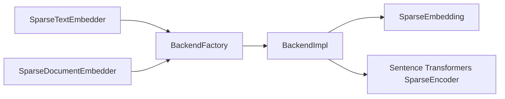

# Sparse Embedder APIs

<cite>
**Referenced Files in This Document**
- [sparse_embedding.py](file://haystack/dataclasses/sparse_embedding.py)
- [sentence_transformers_sparse_text_embedder.py](file://haystack/components/embedders/sentence_transformers_sparse_text_embedder.py)
- [sentence_transformers_sparse_document_embedder.py](file://haystack/components/embedders/sentence_transformers_sparse_document_embedder.py)
- [sentence_transformers_sparse_backend.py](file://haystack/components/embedders/backends/sentence_transformers_sparse_backend.py)
- [protocol.py](file://haystack/components/embedders/types/protocol.py)
- [__init__.py](file://haystack/components/embedders/__init__.py)
- [sentencetransformerssparsedocumentembedder.mdx](file://docs-website/docs/pipeline-components/embedders/sentencetransformerssparsedocumentembedder.mdx)
- [test_sentence_transformers_sparse_text_embedder.py](file://test/components/embedders/test_sentence_transformers_sparse_text_embedder.py)
- [test_sentence_transformers_sparse_document_embedder.py](file://test/components/embedders/test_sentence_transformers_sparse_document_embedder.py)
- [test_sparse_embedding.py](file://test/dataclasses/test_sparse_embedding.py)
</cite>

## Table of Contents
1. [Introduction](#introduction)
2. [Project Structure](#project-structure)
3. [Core Components](#core-components)
4. [Architecture Overview](#architecture-overview)
5. [Detailed Component Analysis](#detailed-component-analysis)
6. [Dependency Analysis](#dependency-analysis)
7. [Performance Considerations](#performance-considerations)
8. [Troubleshooting Guide](#troubleshooting-guide)
9. [Conclusion](#conclusion)
10. [Appendices](#appendices)

## Introduction
This document provides comprehensive API documentation for sparse embedding components in Haystack, focusing on the Sentence Transformers sparse embedders and their integration with sparse vector databases. It explains the sparse vector representation, method signatures, parameter specifications for sparse encoding, and practical usage patterns for keyword extraction and BM25-style retrieval. It also compares sparse embeddings with dense embeddings, outlines output formats, and highlights performance characteristics and best practices.

## Project Structure
The sparse embedding functionality is implemented as Haystack components and dataclasses:
- Data model for sparse vectors
- Sparse embedder components for text and documents
- Backend abstraction for Sentence Transformers sparse encoders
- Optional protocol definitions for embedder interfaces
- Tests validating behavior and usage patterns
- Documentation examples for end-to-end pipelines

**Diagram sources**
- [sparse_embedding.py](file://haystack/dataclasses/sparse_embedding.py#L11-L53)
- [sentence_transformers_sparse_text_embedder.py](file://haystack/components/embedders/sentence_transformers_sparse_text_embedder.py#L17-L198)
- [sentence_transformers_sparse_document_embedder.py](file://haystack/components/embedders/sentence_transformers_sparse_document_embedder.py#L17-L237)
- [sentence_transformers_sparse_backend.py](file://haystack/components/embedders/backends/sentence_transformers_sparse_backend.py#L16-L123)

**Section sources**
- [sparse_embedding.py](file://haystack/dataclasses/sparse_embedding.py#L11-L53)
- [sentence_transformers_sparse_text_embedder.py](file://haystack/components/embedders/sentence_transformers_sparse_text_embedder.py#L17-L198)
- [sentence_transformers_sparse_document_embedder.py](file://haystack/components/embedders/sentence_transformers_sparse_document_embedder.py#L17-L237)
- [sentence_transformers_sparse_backend.py](file://haystack/components/embedders/backends/sentence_transformers_sparse_backend.py#L16-L123)
- [protocol.py](file://haystack/components/embedders/types/protocol.py#L10-L52)
- [__init__.py](file://haystack/components/embedders/__init__.py#L10-L45)

## Core Components
- SparseEmbedding: A compact, index-value pair representation of sparse vectors with validation and serialization helpers.
- SentenceTransformersSparseTextEmbedder: Embeds a single text string into a sparse vector.
- SentenceTransformersSparseDocumentEmbedder: Embeds a list of Documents into sparse vectors and attaches them to each document.
- Backend: Sentence Transformers SparseEncoder-backed encoder that produces SparseEmbedding objects.

Key capabilities:
- Sparse vector output with indices and values
- Model selection via Hugging Face identifiers or local paths
- Optional metadata embedding for documents
- Backend acceleration support (torch, onnx, openvino)
- Serialization/deserialization of component configurations

**Section sources**
- [sparse_embedding.py](file://haystack/dataclasses/sparse_embedding.py#L11-L53)
- [sentence_transformers_sparse_text_embedder.py](file://haystack/components/embedders/sentence_transformers_sparse_text_embedder.py#L17-L198)
- [sentence_transformers_sparse_document_embedder.py](file://haystack/components/embedders/sentence_transformers_sparse_document_embedder.py#L17-L237)
- [sentence_transformers_sparse_backend.py](file://haystack/components/embedders/backends/sentence_transformers_sparse_backend.py#L72-L123)

## Architecture Overview
High-level flow:
- Text or Documents enter the embedder components
- Components initialize or reuse a backend instance
- Backend encodes inputs into sparse tensors and converts them to SparseEmbedding
- Outputs are returned as per component contract

**Diagram sources**
- [sentence_transformers_sparse_text_embedder.py](file://haystack/components/embedders/sentence_transformers_sparse_text_embedder.py#L151-L198)
- [sentence_transformers_sparse_document_embedder.py](file://haystack/components/embedders/sentence_transformers_sparse_document_embedder.py#L177-L237)
- [sentence_transformers_sparse_backend.py](file://haystack/components/embedders/backends/sentence_transformers_sparse_backend.py#L24-L123)

## Detailed Component Analysis

### SparseEmbedding Data Model
SparseEmbedding encapsulates sparse vectors as index-value pairs with:
- indices: list of integer positions of non-zero elements
- values: list of corresponding float values
- Validation ensures equal lengths of indices and values
- Serialization helpers for dictionary conversion

**Diagram sources**
- [sparse_embedding.py](file://haystack/dataclasses/sparse_embedding.py#L11-L53)

**Section sources**
- [sparse_embedding.py](file://haystack/dataclasses/sparse_embedding.py#L11-L53)
- [test_sparse_embedding.py](file://test/dataclasses/test_sparse_embedding.py#L12-L48)

### SentenceTransformersSparseTextEmbedder
Purpose:
- Embed a single string into a sparse vector suitable for sparse retrieval.

Key parameters:
- model: Hugging Face model identifier or local path
- device: Target device for inference
- token: Hugging Face token for private models
- prefix/suffix: Optional text prepended/appended to input
- trust_remote_code/local_files_only: Control model loading behavior
- model_kwargs/tokenizer_kwargs/config_kwargs: Fine-tune model, tokenizer, and config
- backend: Backend choice among torch, onnx, openvino
- revision: Specific model version to use

Methods:
- warm_up(): Lazily initializes the backend
- run(text): Returns a dictionary with a single sparse_embedding key

Output:
- Dictionary with a SparseEmbedding value

Usage notes:
- Accepts only string input; use the document embedder for lists of Documents
- Supports ONNX/OpenVINO backends via model_kwargs

**Section sources**
- [sentence_transformers_sparse_text_embedder.py](file://haystack/components/embedders/sentence_transformers_sparse_text_embedder.py#L38-L88)
- [sentence_transformers_sparse_text_embedder.py](file://haystack/components/embedders/sentence_transformers_sparse_text_embedder.py#L151-L198)
- [test_sentence_transformers_sparse_text_embedder.py](file://test/components/embedders/test_sentence_transformers_sparse_text_embedder.py#L212-L340)

### SentenceTransformersSparseDocumentEmbedder
Purpose:
- Embed a list of Documents into sparse vectors and attach them to each document.

Key parameters:
- model, device, token, trust_remote_code, local_files_only, model_kwargs, tokenizer_kwargs, config_kwargs, backend, revision: Same as text embedder
- prefix/suffix: Applied to each document’s text
- batch_size: Batch size for embedding
- progress_bar: Toggle progress display
- meta_fields_to_embed: Metadata fields to include alongside content
- embedding_separator: Separator used to join metadata and content

Methods:
- warm_up(): Lazily initializes the backend
- run(documents): Returns a dictionary with a documents key containing Documents annotated with sparse_embedding

Processing logic:
- Builds input texts by concatenating selected metadata fields and content with separator and optional prefix/suffix
- Embeds in batches and assigns SparseEmbedding to each Document

**Section sources**
- [sentence_transformers_sparse_document_embedder.py](file://haystack/components/embedders/sentence_transformers_sparse_document_embedder.py#L43-L106)
- [sentence_transformers_sparse_document_embedder.py](file://haystack/components/embedders/sentence_transformers_sparse_document_embedder.py#L177-L237)
- [test_sentence_transformers_sparse_document_embedder.py](file://test/components/embedders/test_sentence_transformers_sparse_document_embedder.py#L252-L450)

### Backend Abstraction
Backend factory and implementation:
- Factory caches backend instances keyed by initialization parameters
- Backend wraps Sentence Transformers SparseEncoder, invoking encode with convert_to_sparse_tensor enabled
- Converts returned sparse tensors to SparseEmbedding objects

**Diagram sources**
- [sentence_transformers_sparse_backend.py](file://haystack/components/embedders/backends/sentence_transformers_sparse_backend.py#L106-L123)

**Section sources**
- [sentence_transformers_sparse_backend.py](file://haystack/components/embedders/backends/sentence_transformers_sparse_backend.py#L16-L123)

### Integration with Sparse Vector Databases
- Supported by QdrantDocumentStore with use_sparse_embeddings enabled
- Query pipeline connects a sparse text embedder to a sparse retriever
- Indexing pipeline connects a sparse document embedder to a writer

Example pipeline outline:
- Indexing: Documents → SparseDocumentEmbedder → Writer → QdrantDocumentStore
- Query: Text → SparseTextEmbedder → SparseEmbeddingRetriever → Results

**Section sources**
- [sentencetransformerssparsedocumentembedder.mdx](file://docs-website/docs/pipeline-components/embedders/sentencetransformerssparsedocumentembedder.mdx#L155-L184)

## Dependency Analysis
Relationships:
- Both embedder components depend on the backend factory and implementation
- Backend depends on SparseEmbedding and Sentence Transformers SparseEncoder
- Components expose serialization hooks and optional protocols

**Diagram sources**
- [sentence_transformers_sparse_text_embedder.py](file://haystack/components/embedders/sentence_transformers_sparse_text_embedder.py#L17-L12)
- [sentence_transformers_sparse_document_embedder.py](file://haystack/components/embedders/sentence_transformers_sparse_document_embedder.py#L9-L12)
- [sentence_transformers_sparse_backend.py](file://haystack/components/embedders/backends/sentence_transformers_sparse_backend.py#L72-L104)
- [sparse_embedding.py](file://haystack/dataclasses/sparse_embedding.py#L11-L22)

**Section sources**
- [sentence_transformers_sparse_text_embedder.py](file://haystack/components/embedders/sentence_transformers_sparse_text_embedder.py#L17-L12)
- [sentence_transformers_sparse_document_embedder.py](file://haystack/components/embedders/sentence_transformers_sparse_document_embedder.py#L9-L12)
- [sentence_transformers_sparse_backend.py](file://haystack/components/embedders/backends/sentence_transformers_sparse_backend.py#L72-L104)
- [sparse_embedding.py](file://haystack/dataclasses/sparse_embedding.py#L11-L22)

## Performance Considerations
- Backend acceleration: Choose torch, onnx, or openvino depending on deployment needs
- Batch processing: Document embedder supports configurable batch_size and progress bar
- Model size and dtype: Use appropriate model_kwargs and device to balance speed and memory
- Prefix/suffix and metadata concatenation: Keep inputs concise to reduce overhead
- Caching: Backend factory caches instances by initialization parameters

[No sources needed since this section provides general guidance]

## Troubleshooting Guide
Common issues and resolutions:
- Wrong input type:
  - Text embedder expects a string; pass a list of Documents to the document embedder
- Serialization of tokens:
  - Token-based secrets cannot be serialized; use environment variable-based secrets
- Backend initialization:
  - Ensure warm_up() is called or the backend is initialized before run()
- Backend selection:
  - Verify model_kwargs align with chosen backend (ONNX/OpenVINO files)
- Sparse vector shape:
  - Indices and values must have equal length; validated by SparseEmbedding

**Section sources**
- [sentence_transformers_sparse_text_embedder.py](file://haystack/components/embedders/sentence_transformers_sparse_text_embedder.py#L183-L188)
- [sentence_transformers_sparse_document_embedder.py](file://haystack/components/embedders/sentence_transformers_sparse_document_embedder.py#L209-L213)
- [test_sentence_transformers_sparse_text_embedder.py](file://test/components/embedders/test_sentence_transformers_sparse_text_embedder.py#L106-L110)
- [test_sentence_transformers_sparse_text_embedder.py](file://test/components/embedders/test_sentence_transformers_sparse_text_embedder.py#L230-L238)
- [test_sentence_transformers_sparse_document_embedder.py](file://test/components/embedders/test_sentence_transformers_sparse_document_embedder.py#L273-L288)
- [sparse_embedding.py](file://haystack/dataclasses/sparse_embedding.py#L24-L31)

## Conclusion
Haystack’s sparse embedding components enable efficient keyword-focused and semantically robust retrieval by generating compact sparse vectors. The Sentence Transformers sparse embedders integrate seamlessly with sparse-capable document stores, supporting flexible input composition, backend acceleration, and robust serialization. Compared to dense embeddings, sparse embeddings offer strong keyword matching with lower computational overhead while retaining semantic expressiveness, making them ideal for hybrid and keyword-centric retrieval scenarios.

[No sources needed since this section summarizes without analyzing specific files]

## Appendices

### API Reference Tables

- SentenceTransformersSparseTextEmbedder
  - Constructor parameters: model, device, token, prefix, suffix, trust_remote_code, local_files_only, model_kwargs, tokenizer_kwargs, config_kwargs, backend, revision
  - Methods: warm_up(), run(text)
  - Output: {"sparse_embedding": SparseEmbedding}

- SentenceTransformersSparseDocumentEmbedder
  - Constructor parameters: model, device, token, prefix, suffix, batch_size, progress_bar, meta_fields_to_embed, embedding_separator, trust_remote_code, local_files_only, model_kwargs, tokenizer_kwargs, config_kwargs, backend, revision
  - Methods: warm_up(), run(documents)
  - Output: {"documents": [Document with sparse_embedding field]}

- SparseEmbedding
  - Attributes: indices (list[int]), values (list[float])
  - Methods: to_dict(), from_dict()

**Section sources**
- [sentence_transformers_sparse_text_embedder.py](file://haystack/components/embedders/sentence_transformers_sparse_text_embedder.py#L38-L88)
- [sentence_transformers_sparse_text_embedder.py](file://haystack/components/embedders/sentence_transformers_sparse_text_embedder.py#L171-L198)
- [sentence_transformers_sparse_document_embedder.py](file://haystack/components/embedders/sentence_transformers_sparse_document_embedder.py#L43-L106)
- [sentence_transformers_sparse_document_embedder.py](file://haystack/components/embedders/sentence_transformers_sparse_document_embedder.py#L197-L237)
- [sparse_embedding.py](file://haystack/dataclasses/sparse_embedding.py#L21-L53)

### Example Workflows

- Sparse vs Dense Embeddings
  - Sparse: Use SentenceTransformersSparseTextEmbedder/SentenceTransformersSparseDocumentEmbedder with sparse-capable stores
  - Dense: Use corresponding dense embedders and dense-compatible stores
  - Comparison: Sparse excels at precise keyword matching; dense captures broader semantics

- Keyword Extraction and BM25-style Retrieval
  - Use sparse embeddings with sparse retrievers for keyword-focused recall
  - Combine with filters and rerankers for precision

- End-to-End Pipeline
  - Indexing: Documents → SparseDocumentEmbedder → Writer → QdrantDocumentStore (use_sparse_embeddings=True)
  - Query: Text → SparseTextEmbedder → SparseEmbeddingRetriever → Results

**Section sources**
- [sentencetransformerssparsedocumentembedder.mdx](file://docs-website/docs/pipeline-components/embedders/sentencetransformerssparsedocumentembedder.mdx#L155-L184)