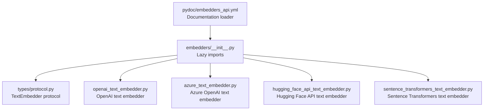
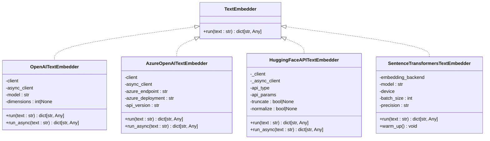
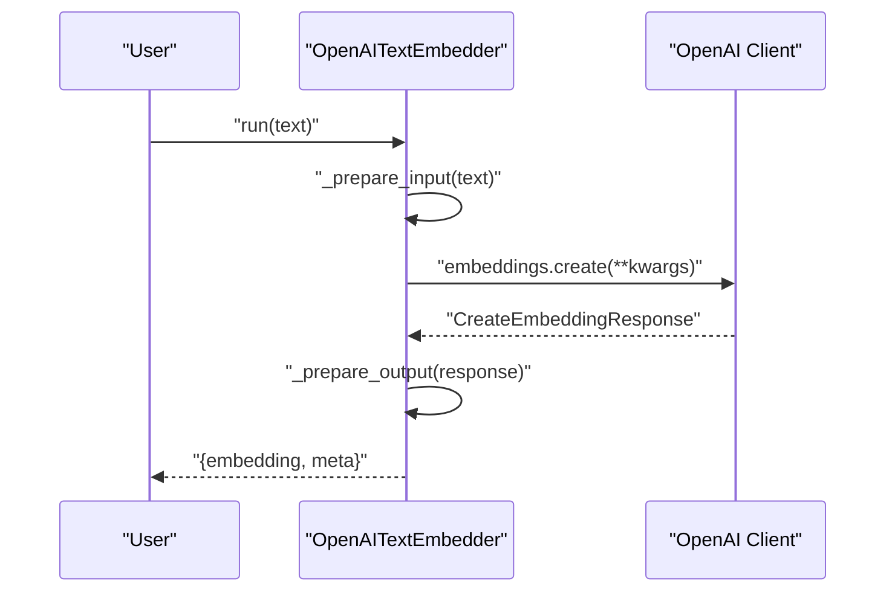
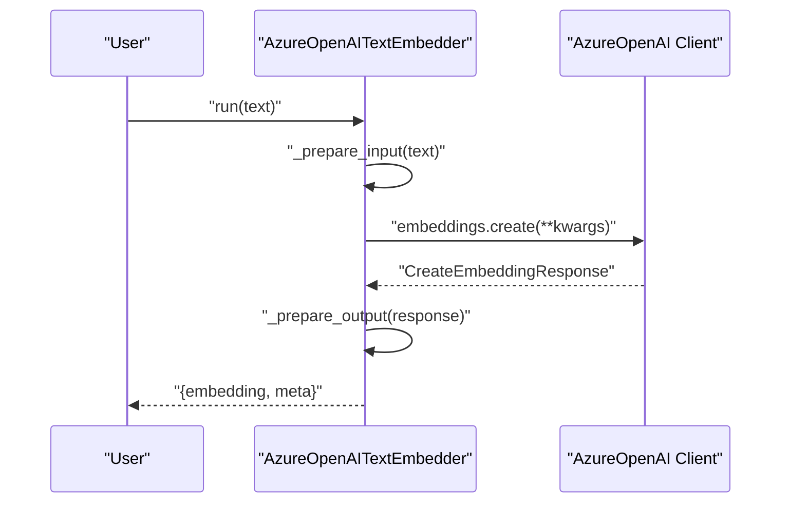
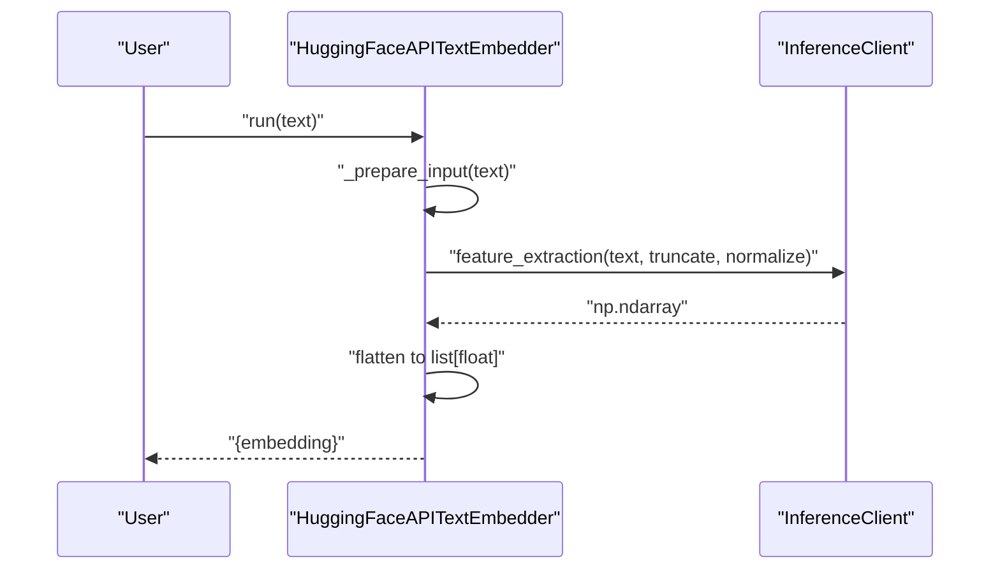
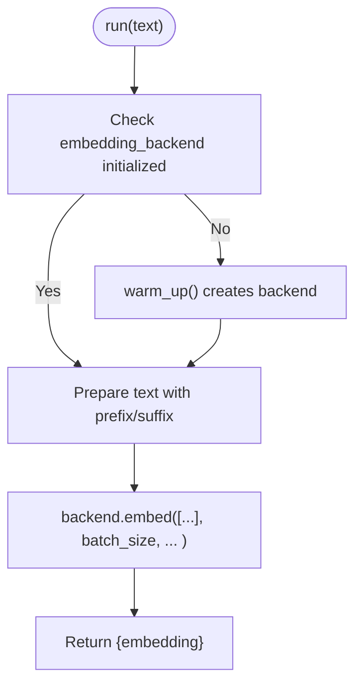
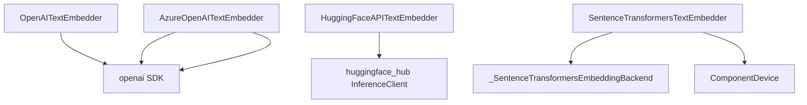

# Text Embedder APIs

<cite>
**Referenced Files in This Document**
- [protocol.py](file://haystack/components/embedders/types/protocol.py)
- [openai_text_embedder.py](file://haystack/components/embedders/openai_text_embedder.py)
- [azure_text_embedder.py](file://haystack/components/embedders/azure_text_embedder.py)
- [hugging_face_api_text_embedder.py](file://haystack/components/embedders/hugging_face_api_text_embedder.py)
- [sentence_transformers_text_embedder.py](file://haystack/components/embedders/sentence_transformers_text_embedder.py)
- [embedders_api.yml](file://pydoc/embedders_api.yml)
</cite>

## Table of Contents
1. [Introduction](#introduction)
2. [Project Structure](#project-structure)
3. [Core Components](#core-components)
4. [Architecture Overview](#architecture-overview)
5. [Detailed Component Analysis](#detailed-component-analysis)
6. [Dependency Analysis](#dependency-analysis)
7. [Performance Considerations](#performance-considerations)
8. [Troubleshooting Guide](#troubleshooting-guide)
9. [Conclusion](#conclusion)
10. [Appendices](#appendices)

## Introduction
This document provides comprehensive API documentation for text embedding components in Haystack. It focuses on the TextEmbedder protocol and its implementations across major providers: OpenAI, Azure OpenAI, Hugging Face, and Sentence Transformers. It explains method signatures for embedding single strings, parameter specifications for model selection, batch processing, and device configuration, and outlines integration patterns with vector databases. It also covers performance optimization techniques, error handling, and provider-specific configuration options.

## Project Structure
The embedders are organized under the embedders package. The public API surface is exposed via lazy imports and documented by a dedicated pydoc configuration.

**Diagram sources**
- [embedders_api.yml](file://pydoc/embedders_api.yml#L1-L17)
- [__init__.py](file://haystack/components/embedders/__init__.py#L1-L45)

**Section sources**
- [__init__.py](file://haystack/components/embedders/__init__.py#L1-L45)
- [embedders_api.yml](file://pydoc/embedders_api.yml#L1-L17)

## Core Components
This section introduces the TextEmbedder protocol and the concrete implementations for text embedding.

- TextEmbedder protocol defines the expected interface for text embedding components.
- Implementations:
  - OpenAI text embedder for OpenAI-hosted models.
  - Azure OpenAI text embedder extending OpenAI behavior for Azure deployments.
  - Hugging Face API text embedder supporting serverless inference, inference endpoints, and self-hosted TEI.
  - Sentence Transformers text embedder for local models with backend acceleration and quantization.

Key method signature pattern:
- run(text: str) -> dict[str, Any]: Returns an embedding and optional metadata.
- run_async(text: str) -> dict[str, Any]: Asynchronous variant where supported.

Output format:
- Single string embedding: a dictionary with an "embedding" key holding a list of floats.
- Some providers also include a "meta" key with model and usage details.

**Section sources**
- [protocol.py](file://haystack/components/embedders/types/protocol.py#L10-L52)
- [openai_text_embedder.py](file://haystack/components/embedders/openai_text_embedder.py#L175-L211)
- [azure_text_embedder.py](file://haystack/components/embedders/azure_text_embedder.py#L177-L193)
- [hugging_face_api_text_embedder.py](file://haystack/components/embedders/hugging_face_api_text_embedder.py#L204-L259)
- [sentence_transformers_text_embedder.py](file://haystack/components/embedders/sentence_transformers_text_embedder.py#L210-L242)

## Architecture Overview
The embedders share a common pattern: they accept configuration parameters, prepare inputs (including optional prefix/suffix), call the underlying provider API or local backend, and return standardized outputs.

**Diagram sources**
- [protocol.py](file://haystack/components/embedders/types/protocol.py#L10-L52)
- [openai_text_embedder.py](file://haystack/components/embedders/openai_text_embedder.py#L16-L118)
- [azure_text_embedder.py](file://haystack/components/embedders/azure_text_embedder.py#L16-L147)
- [hugging_face_api_text_embedder.py](file://haystack/components/embedders/hugging_face_api_text_embedder.py#L19-L148)
- [sentence_transformers_text_embedder.py](file://haystack/components/embedders/sentence_transformers_text_embedder.py#L16-L134)

## Detailed Component Analysis

### TextEmbedder Protocol
Defines the contract for text embedding components:
- run(text: str) -> dict[str, Any]: Must return an embedding and optionally metadata.
- DocumentEmbedder protocol exists for embedding lists of documents.

Usage note:
- Implementations may accept additional optional parameters in their run method.

**Section sources**
- [protocol.py](file://haystack/components/embedders/types/protocol.py#L10-L52)

### OpenAI Text Embedder
Purpose:
- Embeds a single string using OpenAI’s embeddings API.

Key parameters:
- api_key: Secret; defaults to environment variable.
- model: str; default model name.
- dimensions: int | None; supported by newer models.
- api_base_url: str | None; overrides base URL.
- organization: str | None; organization ID.
- prefix: str; prepended to input text.
- suffix: str; appended to input text.
- timeout: float | None; client timeout.
- max_retries: int | None; retry attempts.
- http_client_kwargs: dict[str, Any]; custom httpx client configuration.

Behavior:
- run(text: str): Returns embedding and usage metadata.
- run_async(text: str): Asynchronous variant.

Provider-specific notes:
- Supports dimensions for compatible models.
- Uses a sync and an async OpenAI client.

**Section sources**
- [openai_text_embedder.py](file://haystack/components/embedders/openai_text_embedder.py#L40-L118)
- [openai_text_embedder.py](file://haystack/components/embedders/openai_text_embedder.py#L175-L211)

#### OpenAI Embedding Flow

**Diagram sources**
- [openai_text_embedder.py](file://haystack/components/embedders/openai_text_embedder.py#L158-L190)

### Azure OpenAI Text Embedder
Purpose:
- Embeds a single string using Azure OpenAI-deployed models.

Key parameters:
- azure_endpoint: str; Azure endpoint; required.
- api_version: str; API version; default provided.
- azure_deployment: str; deployment name; maps to model.
- dimensions: int | None; supported by newer models.
- api_key: Secret | None; Azure API key.
- azure_ad_token: Secret | None; Entra ID token.
- organization: str | None; organization ID.
- timeout: float | None; client timeout.
- max_retries: int | None; retry attempts.
- prefix: str; prepended to input text.
- suffix: str; appended to input text.
- default_headers: dict[str, str] | None; default headers.
- azure_ad_token_provider: Callable; dynamic token provider.
- http_client_kwargs: dict[str, Any]; custom httpx client configuration.

Behavior:
- run(text: str): Returns embedding and usage metadata.
- run_async(text: str): Asynchronous variant.

Provider-specific notes:
- Inherits from OpenAITextEmbedder to reuse async capabilities.
- Requires either azure_endpoint parameter or AZURE_OPENAI_ENDPOINT environment variable.
- Supports both API key and Entra ID tokens.

**Section sources**
- [azure_text_embedder.py](file://haystack/components/embedders/azure_text_embedder.py#L38-L147)
- [azure_text_embedder.py](file://haystack/components/embedders/azure_text_embedder.py#L177-L193)

#### Azure OpenAI Embedding Flow

**Diagram sources**
- [azure_text_embedder.py](file://haystack/components/embedders/azure_text_embedder.py#L142-L147)
- [openai_text_embedder.py](file://haystack/components/embedders/openai_text_embedder.py#L158-L190)

### Hugging Face API Text Embedder
Purpose:
- Embeds a single string using Hugging Face APIs:
  - Serverless Inference API
  - Paid Inference Endpoints
  - Self-hosted Text Embeddings Inference (TEI)

Key parameters:
- api_type: HFEmbeddingAPIType | str; selects API type.
- api_params: dict[str, str]; model or url depending on api_type.
- token: Secret | None; Hugging Face token.
- prefix: str; prepended to input text.
- suffix: str; appended to input text.
- truncate: bool | None; truncation for TEI/backends that support it.
- normalize: bool | None; normalization for TEI/backends that support it.

Behavior:
- run(text: str): Returns embedding.
- run_async(text: str): Asynchronous variant.

Provider-specific notes:
- Validates model or URL based on api_type.
- Warns and ignores truncate/normalize for Serverless Inference API.
- Uses InferenceClient and AsyncInferenceClient.

**Section sources**
- [hugging_face_api_text_embedder.py](file://haystack/components/embedders/hugging_face_api_text_embedder.py#L75-L148)
- [hugging_face_api_text_embedder.py](file://haystack/components/embedders/hugging_face_api_text_embedder.py#L204-L259)

#### Hugging Face API Embedding Flow

**Diagram sources**
- [hugging_face_api_text_embedder.py](file://haystack/components/embedders/hugging_face_api_text_embedder.py#L150-L230)

### Sentence Transformers Text Embedder
Purpose:
- Embeds a single string using local Sentence Transformers models with optional backend acceleration and quantization.

Key parameters:
- model: str; model ID or path.
- device: ComponentDevice | None; overrides default device.
- token: Secret | None; Hugging Face token for private models.
- prefix: str; prepended to input text.
- suffix: str; appended to input text.
- batch_size: int; number of texts to embed at once.
- progress_bar: bool; toggles progress bar.
- normalize_embeddings: bool; L2 normalization.
- trust_remote_code: bool; allows custom models/scripts.
- local_files_only: bool; restricts to local files.
- truncate_dim: int | None; truncates embeddings to a given dimension.
- model_kwargs, tokenizer_kwargs, config_kwargs: Additional HF loader kwargs.
- precision: Literal["float32", "int8", "uint8", "binary", "ubinary"]; quantization level.
- encode_kwargs: dict[str, Any]; additional encode parameters.
- backend: Literal["torch", "onnx", "openvino"]; backend choice.
- revision: str | None; model revision.

Behavior:
- run(text: str): Returns embedding; initializes backend lazily.
- warm_up(): Explicitly initializes the embedding backend.

Provider-specific notes:
- Uses an internal embedding backend factory and backend abstraction.
- Supports quantized embeddings for reduced size and improved speed.
- Honors model_max_length from tokenizer kwargs when set.

**Section sources**
- [sentence_transformers_text_embedder.py](file://haystack/components/embedders/sentence_transformers_text_embedder.py#L37-L134)
- [sentence_transformers_text_embedder.py](file://haystack/components/embedders/sentence_transformers_text_embedder.py#L189-L242)

#### Sentence Transformers Embedding Flow

**Diagram sources**
- [sentence_transformers_text_embedder.py](file://haystack/components/embedders/sentence_transformers_text_embedder.py#L189-L241)

## Dependency Analysis
Relationships between components and external libraries:
- OpenAI/Azure OpenAI embedders depend on the OpenAI SDK and HTTP client utilities.
- Hugging Face embedder depends on the huggingface_hub InferenceClient and validation utilities.
- Sentence Transformers embedder depends on the Sentence Transformers backend abstraction and device utilities.

**Diagram sources**
- [openai_text_embedder.py](file://haystack/components/embedders/openai_text_embedder.py#L8-L13)
- [azure_text_embedder.py](file://haystack/components/embedders/azure_text_embedder.py#L8-L13)
- [hugging_face_api_text_embedder.py](file://haystack/components/embedders/hugging_face_api_text_embedder.py#L13-L14)
- [sentence_transformers_text_embedder.py](file://haystack/components/embedders/sentence_transformers_text_embedder.py#L8-L13)

**Section sources**
- [openai_text_embedder.py](file://haystack/components/embedders/openai_text_embedder.py#L8-L13)
- [azure_text_embedder.py](file://haystack/components/embedders/azure_text_embedder.py#L8-L13)
- [hugging_face_api_text_embedder.py](file://haystack/components/embedders/hugging_face_api_text_embedder.py#L13-L14)
- [sentence_transformers_text_embedder.py](file://haystack/components/embedders/sentence_transformers_text_embedder.py#L8-L13)

## Performance Considerations
- Batch processing:
  - Sentence Transformers supports batch_size to process multiple texts efficiently.
- Device configuration:
  - Sentence Transformers allows overriding the device to leverage GPUs or CPU.
- Backend acceleration:
  - Sentence Transformers supports ONNX and OpenVINO backends for acceleration.
- Quantization:
  - Sentence Transformers supports multiple precision levels to reduce memory footprint and improve speed.
- Asynchronous execution:
  - OpenAI and Hugging Face API embedders expose run_async for concurrent workloads.
- Provider-specific:
  - OpenAI supports dimensions for newer models.
  - Hugging Face TEI supports truncate and normalize for on-prem setups.

[No sources needed since this section provides general guidance]

## Troubleshooting Guide
Common issues and resolutions:
- Input type errors:
  - Some embedders validate input types and raise TypeError for non-string inputs.
- Missing credentials:
  - Azure embedder requires either an API key or an Entra ID token.
  - Hugging Face embedder requires a valid token for private models or serverless.
- Invalid URLs or model IDs:
  - Hugging Face embedder validates URLs and model IDs based on api_type.
- Unexpected embedding shapes:
  - Hugging Face embedder flattens outputs and raises ValueError for unexpected shapes.
- Environment variables:
  - OpenAI embedder respects OPENAI_TIMEOUT and OPENAI_MAX_RETRIES environment variables when not explicitly provided.

**Section sources**
- [openai_text_embedder.py](file://haystack/components/embedders/openai_text_embedder.py#L158-L170)
- [azure_text_embedder.py](file://haystack/components/embedders/azure_text_embedder.py#L102-L112)
- [hugging_face_api_text_embedder.py](file://haystack/components/embedders/hugging_face_api_text_embedder.py#L117-L138)
- [hugging_face_api_text_embedder.py](file://haystack/components/embedders/hugging_face_api_text_embedder.py#L222-L228)
- [sentence_transformers_text_embedder.py](file://haystack/components/embedders/sentence_transformers_text_embedder.py#L222-L226)

## Conclusion
Haystack’s text embedding components provide a unified TextEmbedder protocol with robust implementations across OpenAI, Azure OpenAI, Hugging Face, and Sentence Transformers. They support essential features such as input preprocessing (prefix/suffix), asynchronous execution, and provider-specific optimizations. By selecting the appropriate embedder and tuning parameters like batch size, device, and backend, you can achieve efficient and scalable embedding pipelines integrated with vector databases.

[No sources needed since this section summarizes without analyzing specific files]

## Appendices

### API Reference Index
- TextEmbedder protocol: [protocol.py](file://haystack/components/embedders/types/protocol.py#L10-L52)
- OpenAI text embedder: [openai_text_embedder.py](file://haystack/components/embedders/openai_text_embedder.py#L16-L211)
- Azure OpenAI text embedder: [azure_text_embedder.py](file://haystack/components/embedders/azure_text_embedder.py#L16-L193)
- Hugging Face API text embedder: [hugging_face_api_text_embedder.py](file://haystack/components/embedders/hugging_face_api_text_embedder.py#L19-L259)
- Sentence Transformers text embedder: [sentence_transformers_text_embedder.py](file://haystack/components/embedders/sentence_transformers_text_embedder.py#L16-L242)

[No sources needed since this section indexes existing references]