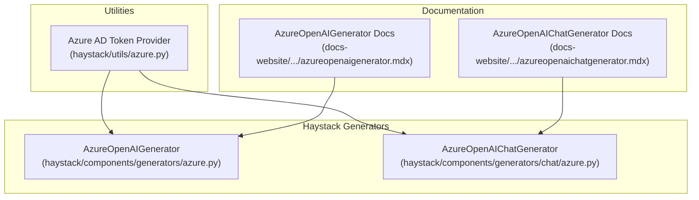
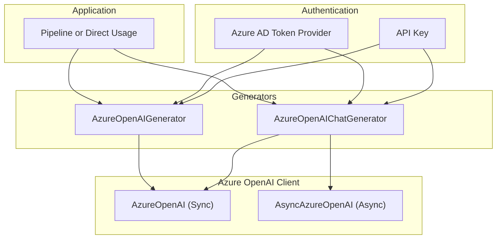
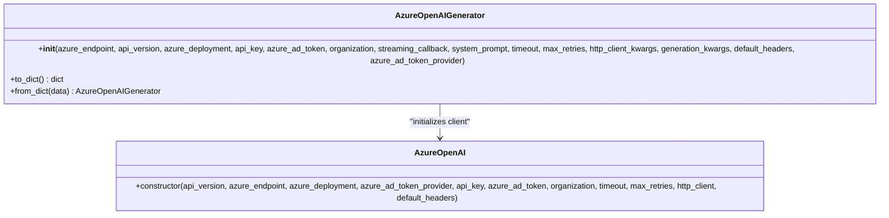
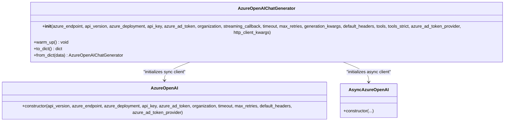
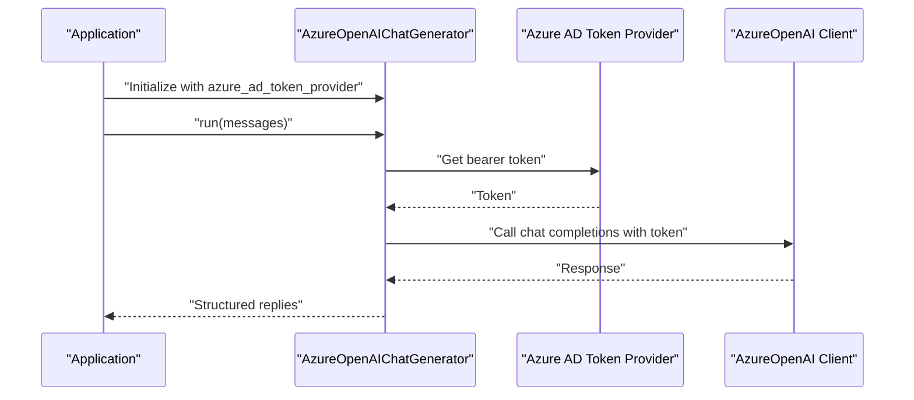
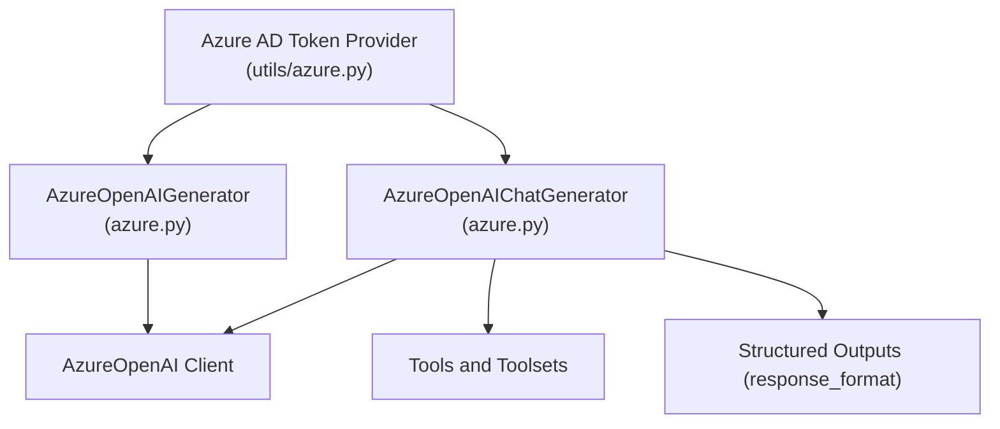

# Azure OpenAI Generators

<cite>
**Referenced Files in This Document**
- [azure.py](file://haystack/components/generators/azure.py)
- [azure.py](file://haystack/components/generators/chat/azure.py)
- [azure.py](file://haystack/utils/azure.py)
- [azureopenaichatgenerator.mdx](file://docs-website/docs/pipeline-components/generators/azureopenaichatgenerator.mdx)
- [azureopenaigenerator.mdx](file://docs-website/docs/pipeline-components/generators/azureopenaigenerator.mdx)
</cite>

## Table of Contents
1. [Introduction](#introduction)
2. [Project Structure](#project-structure)
3. [Core Components](#core-components)
4. [Architecture Overview](#architecture-overview)
5. [Detailed Component Analysis](#detailed-component-analysis)
6. [Dependency Analysis](#dependency-analysis)
7. [Performance Considerations](#performance-considerations)
8. [Troubleshooting Guide](#troubleshooting-guide)
9. [Conclusion](#conclusion)
10. [Appendices](#appendices)

## Introduction
This document provides comprehensive API documentation for the Azure OpenAI generator components in the Haystack library. It covers the AzureOpenAIChatGenerator and AzureOpenAIGenerator classes, focusing on:
- Authentication via Azure AD tokens and API keys
- Endpoint configuration, deployment names, and model versioning
- Parameter specifications, streaming support, and response handling
- Setup instructions for Azure Cognitive Services, authentication methods, and regional endpoint configuration
- Usage examples for different Azure deployments, error handling for authentication failures, and performance optimization techniques

## Project Structure
The Azure OpenAI generator components are implemented under the Haystack components generators module and leverage shared utilities for Azure AD token acquisition. Documentation for the components is provided in the docs-website directory.

**Diagram sources**
- [azure.py](file://haystack/components/generators/azure.py#L17-L216)
- [azure.py](file://haystack/components/generators/chat/azure.py#L27-L281)
- [azure.py](file://haystack/utils/azure.py#L11-L17)
- [azureopenaichatgenerator.mdx](file://docs-website/docs/pipeline-components/generators/azureopenaichatgenerator.mdx#L1-L212)
- [azureopenaigenerator.mdx](file://docs-website/docs/pipeline-components/generators/azureopenaigenerator.mdx#L1-L142)

**Section sources**
- [azure.py](file://haystack/components/generators/azure.py#L1-L216)
- [azure.py](file://haystack/components/generators/chat/azure.py#L1-L281)
- [azure.py](file://haystack/utils/azure.py#L1-L17)
- [azureopenaichatgenerator.mdx](file://docs-website/docs/pipeline-components/generators/azureopenaichatgenerator.mdx#L1-L212)
- [azureopenaigenerator.mdx](file://docs-website/docs/pipeline-components/generators/azureopenaigenerator.mdx#L1-L142)

## Core Components
This section summarizes the two primary Azure OpenAI generator components and their roles.

- AzureOpenAIGenerator
  - Purpose: Text generation using Azure OpenAI models.
  - Key capabilities: Accepts a plain text prompt, supports streaming, and returns a list of replies along with metadata.
  - Default model and API version: The component sets a default model and API version suitable for Azure deployments.

- AzureOpenAIChatGenerator
  - Purpose: Chat-style generation using Azure OpenAI models with ChatMessage inputs and outputs.
  - Key capabilities: Supports structured outputs (Pydantic models and JSON schemas), tools/toolsets, streaming, and multimodal inputs.
  - Default model and API version: Similar to the text generator, with a default model and API version aligned with Azure deployments.

Both components rely on the Azure OpenAI client and accept Azure-specific parameters such as endpoint, deployment, and API version.

**Section sources**
- [azure.py](file://haystack/components/generators/azure.py#L17-L216)
- [azure.py](file://haystack/components/generators/chat/azure.py#L27-L281)

## Architecture Overview
The Azure OpenAI generators integrate with the Azure OpenAI client and support both synchronous and asynchronous clients. They can be configured with Azure AD tokens or API keys and expose a unified interface for text and chat generation.

**Diagram sources**
- [azure.py](file://haystack/components/generators/azure.py#L153-L165)
- [azure.py](file://haystack/components/generators/chat/azure.py#L198-L203)
- [azure.py](file://haystack/utils/azure.py#L11-L17)

## Detailed Component Analysis

### AzureOpenAIGenerator
- Initialization parameters
  - azure_endpoint: Azure OpenAI resource endpoint. Required unless provided via environment variable.
  - api_version: API version to use. Defaults to a recent preview version.
  - azure_deployment: Deployment/model name. Defaults to a specific model name.
  - api_key: Azure OpenAI API key. Can be provided via environment variable.
  - azure_ad_token: Azure AD token. Can be provided via environment variable.
  - organization: Organization ID for OpenAI.
  - streaming_callback: Callback invoked for each streaming token.
  - system_prompt: Optional system prompt to prepend to generation.
  - timeout/max_retries: Client timeouts and retry configuration.
  - http_client_kwargs: HTTP client customization.
  - generation_kwargs: Additional generation parameters forwarded to the OpenAI endpoint.
  - default_headers: Default headers for the client.
  - azure_ad_token_provider: Function returning an Azure AD token invoked on each request.

- Behavior
  - Validates presence of endpoint and authentication credentials.
  - Initializes the Azure OpenAI client with provided parameters and environment-derived defaults.
  - Supports streaming via the provided callback.
  - Returns replies and metadata (including token usage and finish reason).

- Usage notes
  - Suitable for text generation tasks.
  - For chat-style interactions, prefer AzureOpenAIChatGenerator.

**Diagram sources**
- [azure.py](file://haystack/components/generators/azure.py#L57-L165)

**Section sources**
- [azure.py](file://haystack/components/generators/azure.py#L17-L216)
- [azureopenaigenerator.mdx](file://docs-website/docs/pipeline-components/generators/azureopenaigenerator.mdx#L1-L142)

### AzureOpenAIChatGenerator
- Initialization parameters
  - azure_endpoint: Azure OpenAI resource endpoint. Required unless provided via environment variable.
  - api_version: API version to use. Defaults to a recent preview version.
  - azure_deployment: Deployment/model name. Defaults to a specific model name.
  - api_key: Azure OpenAI API key. Can be provided via environment variable.
  - azure_ad_token: Azure AD token. Can be provided via environment variable.
  - organization: Organization ID for OpenAI.
  - streaming_callback: Callback invoked for each streaming token.
  - timeout/max_retries: Client timeouts and retry configuration.
  - generation_kwargs: Additional generation parameters forwarded to the OpenAI endpoint (includes response_format).
  - default_headers: Default headers for the client.
  - tools/tools_strict: Tool definitions and strict schema enforcement.
  - azure_ad_token_provider: Function returning an Azure AD token invoked on each request.
  - http_client_kwargs: HTTP client customization.

- Behavior
  - Validates presence of endpoint and authentication credentials.
  - Initializes both synchronous and asynchronous Azure OpenAI clients.
  - Supports structured outputs via response_format (Pydantic models or JSON schemas).
  - Supports tools and toolsets for function calling.
  - Supports streaming and multimodal inputs (images).
  - Provides a warm_up method to pre-warm tools.

- Usage notes
  - Designed for chat-style interactions with ChatMessage inputs and outputs.
  - Structured outputs are supported with model-specific compatibility notes.
  - Streaming with structured outputs requires a JSON schema instead of a Pydantic model.

**Diagram sources**
- [azure.py](file://haystack/components/generators/chat/azure.py#L74-L203)

**Section sources**
- [azure.py](file://haystack/components/generators/chat/azure.py#L27-L281)
- [azureopenaichatgenerator.mdx](file://docs-website/docs/pipeline-components/generators/azureopenaichatgenerator.mdx#L1-L212)

### Authentication and Token Providers
- Azure AD token provider
  - The utility provides a function that obtains an Azure AD bearer token using DefaultAzureCredential with the appropriate scope for Azure Cognitive Services.
  - This token provider can be passed to the generator constructors to refresh tokens on each request.

- Environment variables
  - AZURE_OPENAI_ENDPOINT: Azure OpenAI resource endpoint.
  - AZURE_OPENAI_API_KEY: Azure OpenAI API key.
  - AZURE_OPENAI_AD_TOKEN: Azure AD token.
  - OPENAI_TIMEOUT and OPENAI_MAX_RETRIES: Client timeout and retry configuration defaults.

- Managed identity
  - When using Azure AD tokens, the DefaultAzureCredential leverages managed identities and other Azure credential mechanisms.

**Diagram sources**
- [azure.py](file://haystack/utils/azure.py#L11-L17)
- [azure.py](file://haystack/components/generators/chat/azure.py#L185-L203)

**Section sources**
- [azure.py](file://haystack/utils/azure.py#L1-L17)
- [azure.py](file://haystack/components/generators/azure.py#L57-L165)
- [azure.py](file://haystack/components/generators/chat/azure.py#L74-L203)

### Streaming Support and Response Handling
- Streaming
  - Both generators support streaming via a callback that receives chunks during generation.
  - For chat generators, streaming works with a single candidate response; set n=1 when streaming.
  - For structured outputs with streaming, use a JSON schema instead of a Pydantic model.

- Response handling
  - AzureOpenAIGenerator returns replies and metadata (including token usage).
  - AzureOpenAIChatGenerator returns ChatMessage replies and metadata, supporting structured outputs and tool calls.

**Section sources**
- [azureopenaigenerator.mdx](file://docs-website/docs/pipeline-components/generators/azureopenaigenerator.mdx#L49-L98)
- [azureopenaichatgenerator.mdx](file://docs-website/docs/pipeline-components/generators/azureopenaichatgenerator.mdx#L100-L125)

### Parameter Specifications
- Common parameters
  - azure_endpoint: Azure OpenAI resource endpoint.
  - api_version: API version to target.
  - azure_deployment: Deployment/model name.
  - organization: Organization ID.
  - timeout/max_retries: Client configuration.
  - default_headers: Default HTTP headers.
  - http_client_kwargs: HTTP client customization.

- Generation parameters (passed via generation_kwargs)
  - max_completion_tokens, temperature, top_p, n, stop, presence_penalty, frequency_penalty, logit_bias, response_format (structured outputs), tools, tools_strict.

- Validation and defaults
  - Endpoint and authentication credentials are validated during initialization.
  - Defaults for model and API version are set for Azure deployments.

**Section sources**
- [azure.py](file://haystack/components/generators/azure.py#L57-L120)
- [azure.py](file://haystack/components/generators/chat/azure.py#L74-L150)
- [azureopenaichatgenerator.mdx](file://docs-website/docs/pipeline-components/generators/azureopenaichatgenerator.mdx#L47-L98)

### Setup Instructions for Azure Cognitive Services
- Obtain credentials
  - API key: From Azure OpenAI resource keys.
  - Azure AD token: Use DefaultAzureCredential or provide a token via environment variable.
  - Endpoint: From Azure OpenAI resource properties.
  - Deployment: Name of the deployed model.

- Regional endpoint configuration
  - Set the azure_endpoint to the regional endpoint of your Azure OpenAI resource.
  - Ensure the selected region supports the target model.

- Environment variables
  - AZURE_OPENAI_ENDPOINT: Azure OpenAI endpoint.
  - AZURE_OPENAI_API_KEY: Azure OpenAI API key.
  - AZURE_OPENAI_AD_TOKEN: Azure AD token.
  - OPENAI_TIMEOUT and OPENAI_MAX_RETRIES: Client defaults.

**Section sources**
- [azureopenaichatgenerator.mdx](file://docs-website/docs/pipeline-components/generators/azureopenaichatgenerator.mdx#L27-L44)
- [azureopenaigenerator.mdx](file://docs-website/docs/pipeline-components/generators/azureopenaigenerator.mdx#L25-L47)

### Usage Examples
- Basic usage
  - Initialize the generator with endpoint, deployment, and authentication.
  - Run with a prompt (text generator) or a list of ChatMessage objects (chat generator).

- Streaming
  - Provide a streaming_callback to receive tokens as they are generated.
  - For chat generator, ensure n=1 when streaming.

- Structured outputs
  - Use response_format in generation_kwargs with a Pydantic model or JSON schema.
  - For chat generator, structured outputs are supported with model-specific compatibility.

- Multimodal inputs
  - For chat generator, include images in ChatMessage content parts.

**Section sources**
- [azureopenaichatgenerator.mdx](file://docs-website/docs/pipeline-components/generators/azureopenaichatgenerator.mdx#L126-L212)
- [azureopenaigenerator.mdx](file://docs-website/docs/pipeline-components/generators/azureopenaigenerator.mdx#L57-L142)

## Dependency Analysis
The Azure OpenAI generators depend on the Azure OpenAI client and share common configuration patterns. The chat generator additionally integrates tools and structured outputs.

**Diagram sources**
- [azure.py](file://haystack/components/generators/azure.py#L153-L165)
- [azure.py](file://haystack/components/generators/chat/azure.py#L185-L203)
- [azure.py](file://haystack/utils/azure.py#L11-L17)

**Section sources**
- [azure.py](file://haystack/components/generators/azure.py#L1-L216)
- [azure.py](file://haystack/components/generators/chat/azure.py#L1-L281)
- [azure.py](file://haystack/utils/azure.py#L1-L17)

## Performance Considerations
- Connection reuse and HTTP client customization
  - Use http_client_kwargs to tune connection pooling, timeouts, and retries for improved throughput and reliability.
- Streaming
  - Enable streaming for reduced latency in long generations; ensure n=1 for chat streaming.
- Structured outputs
  - Prefer JSON schemas for streaming structured outputs; consider model compatibility for Pydantic models.
- Tool warm-up
  - Use the warm_up method for chat generators to pre-warm tools and reduce first-call latency.

[No sources needed since this section provides general guidance]

## Troubleshooting Guide
- Authentication failures
  - Ensure AZURE_OPENAI_ENDPOINT is set and valid.
  - Verify API key or Azure AD token is provided and not expired.
  - Confirm the Azure AD token provider scope aligns with Azure Cognitive Services.

- Missing endpoint or credentials
  - The components validate the presence of endpoint and authentication credentials during initialization and raise explicit errors if missing.

- Structured output issues
  - For chat generator, ensure response_format compatibility with the selected model.
  - For streaming with structured outputs, use a JSON schema instead of a Pydantic model.

**Section sources**
- [azure.py](file://haystack/components/generators/azure.py#L128-L134)
- [azure.py](file://haystack/components/generators/chat/azure.py#L158-L164)
- [azureopenaichatgenerator.mdx](file://docs-website/docs/pipeline-components/generators/azureopenaichatgenerator.mdx#L92-L98)

## Conclusion
The Azure OpenAI generators in Haystack provide robust, production-ready integrations with Azure OpenAI models. They support flexible authentication (API keys and Azure AD), regional endpoints, model versioning, streaming, and advanced features like structured outputs and tools. By following the setup and usage guidelines in this document, you can configure and optimize these components for various deployment scenarios.

[No sources needed since this section summarizes without analyzing specific files]

## Appendices

### API Reference Highlights
- AzureOpenAIGenerator
  - Inputs: prompt (string)
  - Outputs: replies (list of strings), meta (list of dicts)
  - Key parameters: azure_endpoint, api_version, azure_deployment, api_key, azure_ad_token, streaming_callback, generation_kwargs

- AzureOpenAIChatGenerator
  - Inputs: messages (list of ChatMessage)
  - Outputs: replies (list of ChatMessage)
  - Key parameters: azure_endpoint, api_version, azure_deployment, api_key, azure_ad_token, streaming_callback, generation_kwargs (including response_format), tools, tools_strict

**Section sources**
- [azureopenaichatgenerator.mdx](file://docs-website/docs/pipeline-components/generators/azureopenaichatgenerator.mdx#L12-L23)
- [azureopenaigenerator.mdx](file://docs-website/docs/pipeline-components/generators/azureopenaigenerator.mdx#L12-L23)