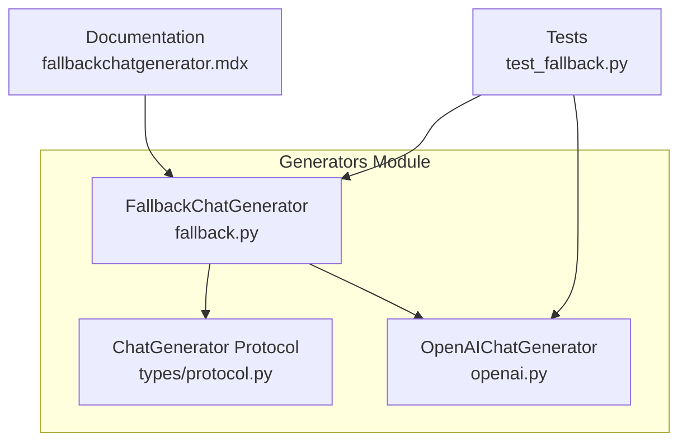
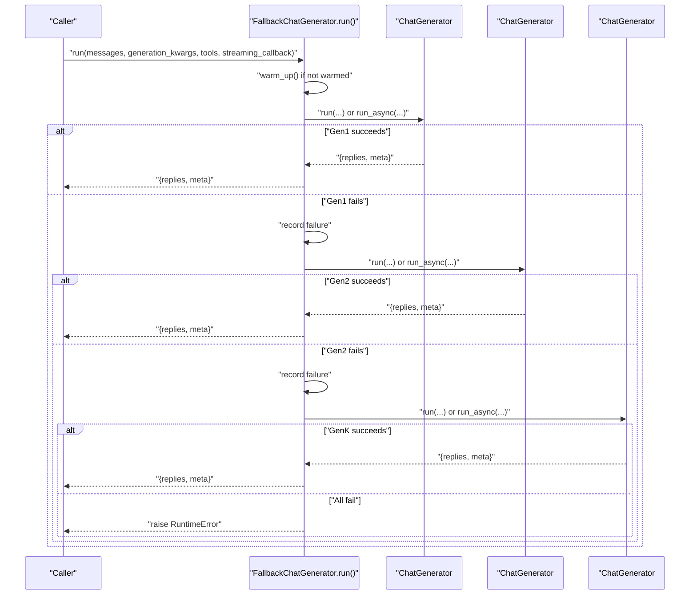
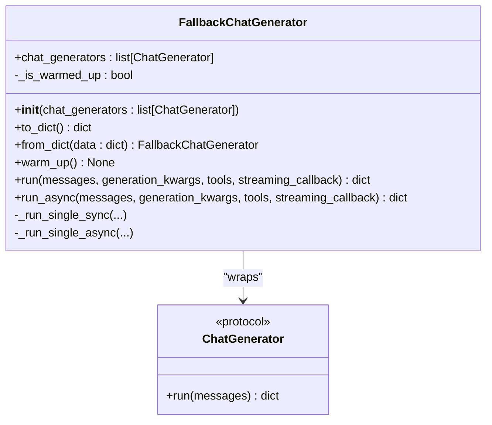
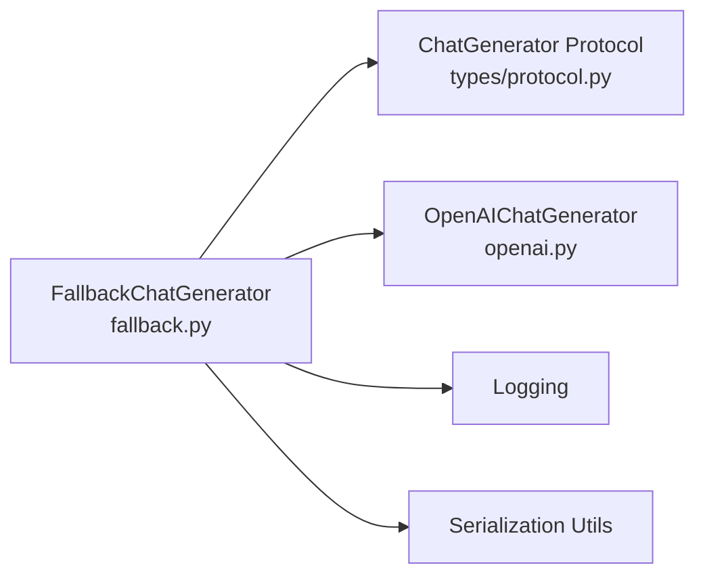

# Fallback Generators

<cite>
**Referenced Files in This Document**
- [fallback.py](file://haystack/components/generators/chat/fallback.py)
- [fallbackchatgenerator.mdx](file://docs-website/docs/pipeline-components/generators/fallbackchatgenerator.mdx)
- [test_fallback.py](file://test/components/generators/chat/test_fallback.py)
- [protocol.py](file://haystack/components/generators/chat/types/protocol.py)
- [openai.py](file://haystack/components/generators/chat/openai.py)
</cite>

## Table of Contents
1. [Introduction](#introduction)
2. [Project Structure](#project-structure)
3. [Core Components](#core-components)
4. [Architecture Overview](#architecture-overview)
5. [Detailed Component Analysis](#detailed-component-analysis)
6. [Dependency Analysis](#dependency-analysis)
7. [Performance Considerations](#performance-considerations)
8. [Troubleshooting Guide](#troubleshooting-guide)
9. [Conclusion](#conclusion)
10. [Appendices](#appendices)

## Introduction
This document provides comprehensive API documentation for the FallbackChatGenerator component, which enables robust LLM integrations by chaining multiple chat generators and automatically switching to backups on failure. It covers configuration of primary and backup generators, automatic switching logic, error handling strategies, retry mechanisms, usage examples, monitoring approaches, and best practices for selecting appropriate fallback strategies.

## Project Structure
The FallbackChatGenerator lives under the chat generators module and integrates with the broader Haystack generator ecosystem. The key files involved are:
- Implementation: fallback.py
- Documentation: fallbackchatgenerator.mdx
- Tests: test_fallback.py
- ChatGenerator protocol: protocol.py
- Example generator: openai.py

**Diagram sources**
- [fallback.py](file://haystack/components/generators/chat/fallback.py#L19-L246)
- [protocol.py](file://haystack/components/generators/chat/types/protocol.py#L10-L32)
- [openai.py](file://haystack/components/generators/chat/openai.py#L53-L200)
- [fallbackchatgenerator.mdx](file://docs-website/docs/pipeline-components/generators/fallbackchatgenerator.mdx#L1-L239)
- [test_fallback.py](file://test/components/generators/chat/test_fallback.py#L1-L425)

**Section sources**
- [fallback.py](file://haystack/components/generators/chat/fallback.py#L1-L246)
- [protocol.py](file://haystack/components/generators/chat/types/protocol.py#L1-L32)
- [openai.py](file://haystack/components/generators/chat/openai.py#L1-L200)
- [fallbackchatgenerator.mdx](file://docs-website/docs/pipeline-components/generators/fallbackchatgenerator.mdx#L1-L239)
- [test_fallback.py](file://test/components/generators/chat/test_fallback.py#L1-L425)

## Core Components
- FallbackChatGenerator: A wrapper that tries multiple ChatGenerator instances sequentially until one succeeds. It forwards all parameters (messages, generation_kwargs, tools, streaming_callback) and returns the first successful result. It records metadata including the successful generator index/class, total attempts, and failed generators.
- ChatGenerator Protocol: Defines the minimal interface that all chat generators must implement, ensuring compatibility with the fallback wrapper.
- Example Chat Generators: OpenAIChatGenerator demonstrates a production-ready generator with timeout support, streaming, and tool-calling capabilities.

Key behaviors:
- Automatic failover on any exception, including timeouts, rate limits, authentication errors, context length errors, and server errors.
- Delegation of timeout enforcement to underlying generators; ensure generators support a timeout parameter and raise timeout exceptions.
- Serialization/deserialization of nested generators for persistence.
- Optional warm-up delegation to underlying generators.

**Section sources**
- [fallback.py](file://haystack/components/generators/chat/fallback.py#L19-L246)
- [protocol.py](file://haystack/components/generators/chat/types/protocol.py#L10-L32)
- [openai.py](file://haystack/components/generators/chat/openai.py#L117-L200)

## Architecture Overview
The FallbackChatGenerator orchestrates a chain of chat generators. It executes them in order, forwarding all inputs and capturing metadata. If a generator fails, it logs the failure and proceeds to the next. If all fail, it raises a runtime error with details.

**Diagram sources**
- [fallback.py](file://haystack/components/generators/chat/fallback.py#L136-L245)

## Detailed Component Analysis

### FallbackChatGenerator Class
The class encapsulates sequential execution and failover logic. It validates constructor input, serializes nested generators, delegates warm-up, and runs generators synchronously or asynchronously.

**Diagram sources**
- [fallback.py](file://haystack/components/generators/chat/fallback.py#L19-L246)
- [protocol.py](file://haystack/components/generators/chat/types/protocol.py#L10-L32)

Implementation highlights:
- Constructor validation ensures a non-empty list of generators.
- Serialization preserves nested generators by delegating to their to/from_dict methods.
- Warm-up is delegated to generators that expose a warm_up method.
- run/run_async iterate generators sequentially, forwarding all inputs and aggregating metadata.
- Exception handling catches any exception and continues to the next generator.
- Final failure raises a RuntimeError with a summary of failures.

Operational metadata returned:
- successful_chat_generator_index: Index of the successful generator.
- successful_chat_generator_class: Class name of the successful generator.
- total_attempts: Number of attempts performed.
- failed_chat_generators: List of generator class names that failed before success.

**Section sources**
- [fallback.py](file://haystack/components/generators/chat/fallback.py#L50-L246)

### ChatGenerator Protocol
Defines the minimal interface that all chat generators must implement. This ensures compatibility with the fallback wrapper and other higher-level components.

Key points:
- run method signature supports messages input and returns a dictionary containing replies and metadata.
- Additional optional parameters may be accepted by specific implementations.

**Section sources**
- [protocol.py](file://haystack/components/generators/chat/types/protocol.py#L10-L32)

### Example: OpenAIChatGenerator
OpenAIChatGenerator demonstrates production-grade features that integrate seamlessly with FallbackChatGenerator:
- Supports timeout parameter and raises timeout exceptions when exceeded.
- Provides streaming callbacks for both sync and async modes.
- Accepts generation_kwargs for model tuning.
- Supports tool-calling and structured outputs.

These capabilities make OpenAIChatGenerator a strong candidate for both primary and backup roles in a fallback chain.

**Section sources**
- [openai.py](file://haystack/components/generators/chat/openai.py#L117-L200)

### Usage Examples and Patterns
- Basic fallback from a primary to a backup model.
- Multi-provider fallback (e.g., OpenAI to Azure OpenAI).
- Streaming with fallback.
- Integration in a Pipeline with a prompt builder.

Monitoring and telemetry:
- Inspect meta fields to track which generator was used, total attempts, and failed generators.

**Section sources**
- [fallbackchatgenerator.mdx](file://docs-website/docs/pipeline-components/generators/fallbackchatgenerator.mdx#L80-L239)

### Test Coverage Highlights
The tests validate:
- Initialization validation and serialization roundtrip.
- Sequential success on first vs. later attempts.
- Failover triggers for various HTTP error codes (429, 401, 400, 500).
- Streaming callback forwarding in both sync and async modes.
- Warm-up delegation to compatible generators.
- Error propagation when all generators fail.

**Section sources**
- [test_fallback.py](file://test/components/generators/chat/test_fallback.py#L100-L425)

## Dependency Analysis
The FallbackChatGenerator depends on:
- ChatGenerator Protocol for type compatibility.
- Underlying generators implementing run/run_async and optional warm_up.
- Serialization utilities for nested components.
- Logging for warning messages on failures.

**Diagram sources**
- [fallback.py](file://haystack/components/generators/chat/fallback.py#L10-L16)
- [protocol.py](file://haystack/components/generators/chat/types/protocol.py#L10-L32)
- [openai.py](file://haystack/components/generators/chat/openai.py#L53-L200)

**Section sources**
- [fallback.py](file://haystack/components/generators/chat/fallback.py#L10-L16)
- [protocol.py](file://haystack/components/generators/chat/types/protocol.py#L10-L32)
- [openai.py](file://haystack/components/generators/chat/openai.py#L53-L200)

## Performance Considerations
- Latency: The effective latency equals the time of the first successful generator. To enforce predictable latency, configure timeouts on underlying generators and ensure they raise timeout exceptions.
- Throughput: Sequential execution means the total time is approximately the sum of individual generator latencies. Consider ordering generators by expected reliability and speed.
- Streaming: Streaming callbacks are forwarded to the successful generator; ensure the chosen generator supports streaming for low-latency responses.
- Warm-up: Call warm_up once per deployment to reduce cold-start overhead across the chain.

[No sources needed since this section provides general guidance]

## Troubleshooting Guide
Common issues and resolutions:
- All generators fail: The component raises a RuntimeError with a summary of failures and the last error. Review generator configurations, credentials, and network settings.
- Unexpected timeouts: Ensure generators support a timeout parameter and raise timeout exceptions. Tune timeout values to match expected SLAs.
- Streaming not working: Confirm the successful generator supports streaming and that a streaming_callback is provided.
- Monitoring gaps: Use meta fields to track success rates, failure patterns, and fallback frequency.

**Section sources**
- [fallback.py](file://haystack/components/generators/chat/fallback.py#L184-L189)
- [fallbackchatgenerator.mdx](file://docs-website/docs/pipeline-components/generators/fallbackchatgenerator.mdx#L35-L75)

## Conclusion
FallbackChatGenerator provides a robust, transparent, and flexible mechanism for building resilient LLM pipelines. By chaining multiple generators and automatically failing over on any failure, it improves availability and user experience. Proper configuration of timeouts, streaming, and monitoring, combined with thoughtful generator selection, yields predictable performance and maintainable systems.

[No sources needed since this section summarizes without analyzing specific files]

## Appendices

### API Reference Summary
- Constructor: chat_generators (non-empty list of ChatGenerator)
- Methods:
  - run(messages, generation_kwargs=None, tools=None, streaming_callback=None)
  - run_async(messages, generation_kwargs=None, tools=None, streaming_callback=None)
  - warm_up()
  - to_dict(), from_dict()
- Metadata fields: successful_chat_generator_index, successful_chat_generator_class, total_attempts, failed_chat_generators

**Section sources**
- [fallback.py](file://haystack/components/generators/chat/fallback.py#L50-L246)

### Best Practices for Selecting Fallback Strategies
- Order by reliability and latency expectations.
- Prefer generators with built-in timeouts and clear error signaling.
- Use streaming-capable generators for low-latency responses.
- Monitor meta fields to continuously optimize generator ordering and detect degradation.

**Section sources**
- [fallback.py](file://haystack/components/generators/chat/fallback.py#L28-L48)
- [fallbackchatgenerator.mdx](file://docs-website/docs/pipeline-components/generators/fallbackchatgenerator.mdx#L35-L75)