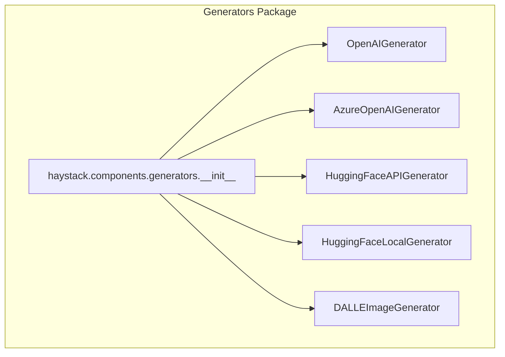
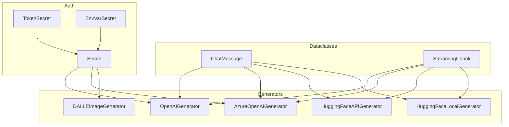
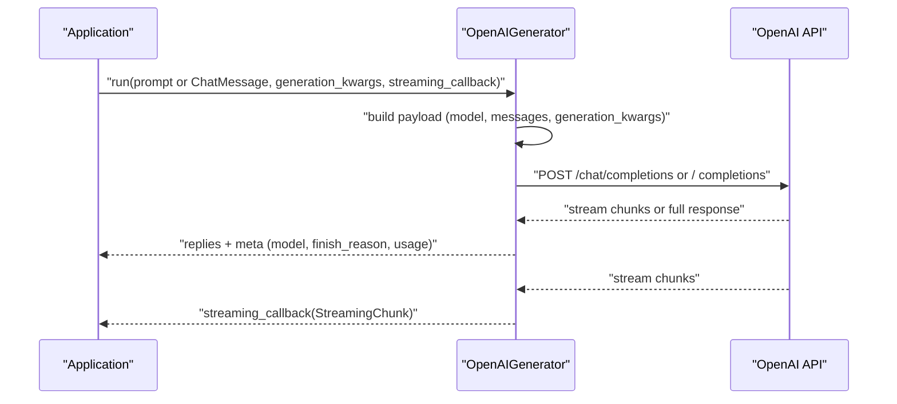
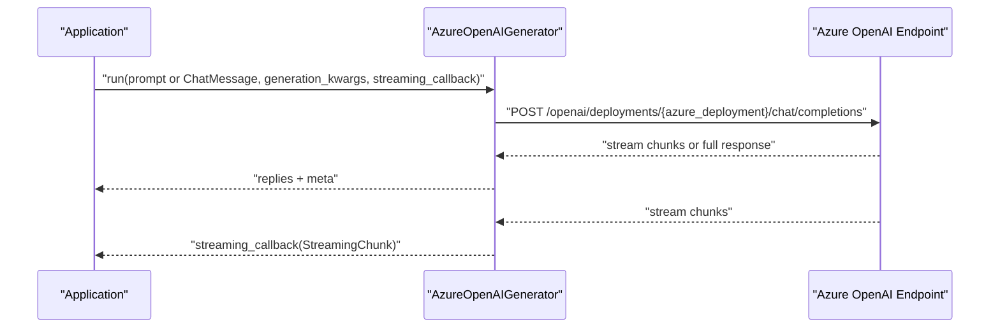
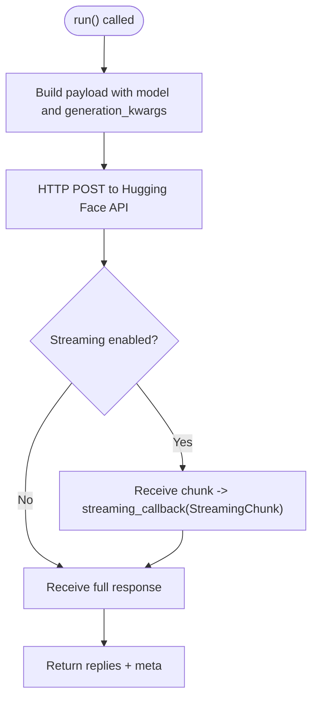
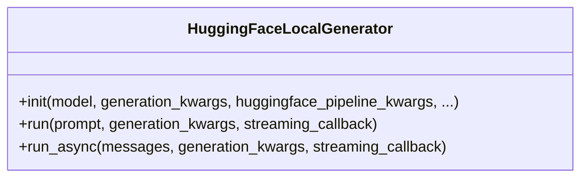
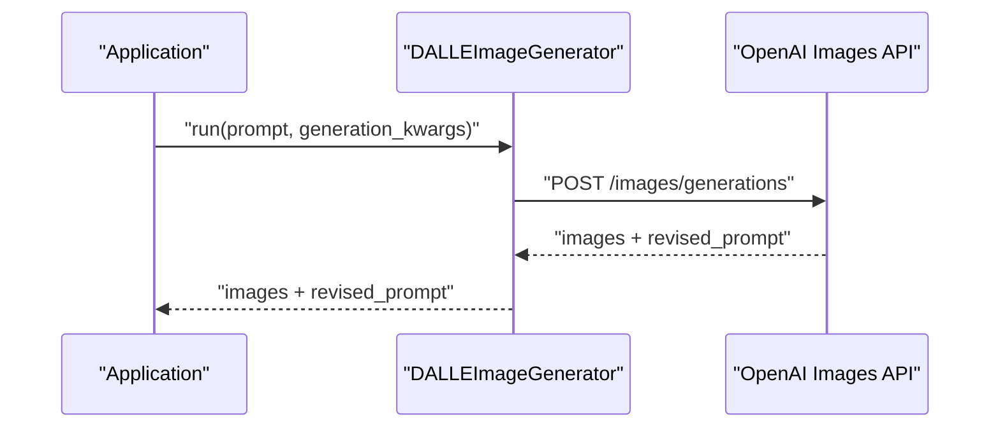
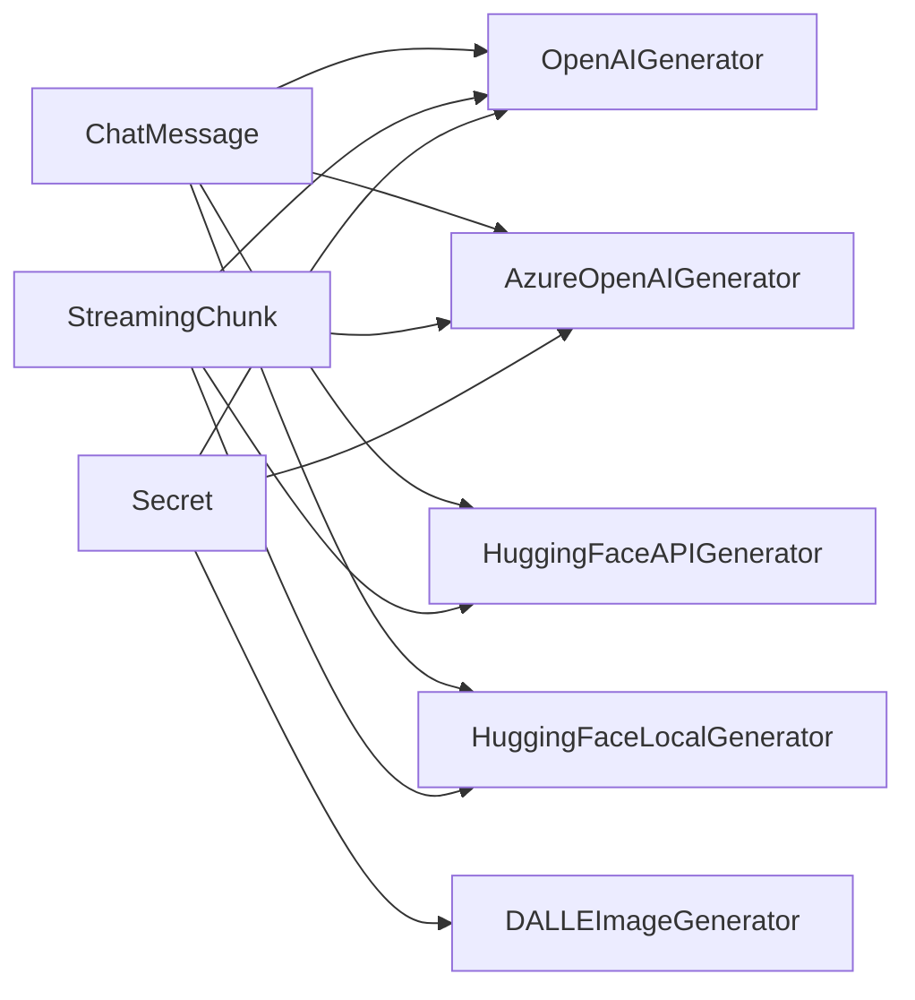

# Generator APIs

<cite>
**Referenced Files in This Document**
- [__init__.py](file://haystack/components/generators/__init__.py)
- [chat_message.py](file://haystack/dataclasses/chat_message.py)
- [streaming_chunk.py](file://haystack/dataclasses/streaming_chunk.py)
- [auth.py](file://haystack/utils/auth.py)
- [openai_dalle.py](file://haystack/components/generators/openai_dalle.py)
- [azureopenaigenerator.mdx](file://docs-website/docs/pipeline-components/generators/azureopenaigenerator.mdx)
- [dalleimagegenerator.mdx](file://docs-website/docs/pipeline-components/generators/dalleimagegenerator.mdx)
- [test_azure.py](file://test/components/generators/test_azure.py)
- [test_openai_dalle.py](file://test/components/generators/test_openai_dalle.py)
- [renamed-model_name-or-model_name_or_path-to-model-184490cbb66c4d7c.yaml](file://releasenotes/notes/renamed-model_name-or-model_name_or_path-to-model-184490cbb66c4d7c.yaml)
- [add-streaming-callback-run-param-to-hf-generators-5ebde8fad75cb49f.yaml](file://releasenotes/notes/add-streaming-callback-run-param-to-hf-generators-5ebde8fad75cb49f.yaml)
- [hugging-face-local-generator-streaming-callback-38a77d37199f9672.yaml](file://releasenotes/notes/hugging-face-local-generator-streaming-callback-38a77d37199f9672.yaml)
- [hflocalgenerator-generation-kwargs-in-run-2bde10d398a3712a.yaml](file://releasenotes/notes/hflocalgenerator-generation-kwargs-in-run-2bde10d398a3712a.yaml)
- [refactor-generator-public-interface-b588e9f23778e0ee.yaml](file://releasenotes/notes/refactor-generator-public-interface-b588e9f23778e0ee.yaml)
- [adding-async-huggingface-local-chat-generator-962512f52282d12d.yaml](file://releasenotes/notes/adding-async-huggingface-local-chat-generator-962512f52282d12d.yaml)
- [dalle-fix-max-retries-703c36ce354a2e45.yaml](file://releasenotes/notes/dalle-fix-max-retries-703c36ce354a2e45.yaml)
</cite>

## Table of Contents
1. [Introduction](#introduction)
2. [Project Structure](#project-structure)
3. [Core Components](#core-components)
4. [Architecture Overview](#architecture-overview)
5. [Detailed Component Analysis](#detailed-component-analysis)
6. [Dependency Analysis](#dependency-analysis)
7. [Performance Considerations](#performance-considerations)
8. [Troubleshooting Guide](#troubleshooting-guide)
9. [Conclusion](#conclusion)
10. [Appendices](#appendices)

## Introduction
This document provides comprehensive API documentation for Haystack Generator components. It covers text generation and chat completion APIs, including OpenAI integration, Azure OpenAI support, Hugging Face API and local models, and the DALL‑E image generation generator. It details method signatures, parameter specifications, input/output formats, and streaming capabilities. Authentication setup, model configuration options, and provider-specific features are explained, along with usage examples, error handling patterns, and performance optimization techniques. The fallback generator system and custom generator development patterns are also documented.

## Project Structure
Haystack exposes generator components via a lazy-import mechanism. The generators package exports the following public classes:
- OpenAI generator
- Azure OpenAI generator
- Hugging Face API generator
- Hugging Face Local generator
- DALL‑E image generator

These are imported lazily to optimize startup time and reduce memory footprint when unused.

**Diagram sources**
- [__init__.py](file://haystack/components/generators/__init__.py#L10-L26)

**Section sources**
- [__init__.py](file://haystack/components/generators/__init__.py#L1-L27)

## Core Components
This section summarizes the primary generator components and their responsibilities:
- OpenAIGenerator: Text generation and chat completion via OpenAI’s API.
- AzureOpenAIGenerator: Azure OpenAI service integration with deployment targeting and optional Azure AD token provider.
- HuggingFaceAPIGenerator: Text generation via Hugging Face Inference API.
- HuggingFaceLocalGenerator: Local text generation using Hugging Face pipelines.
- DALLEImageGenerator: Image generation using OpenAI DALL‑E API.

Key shared concepts:
- Authentication via Secret types (token or environment variables).
- Streaming via a callback mechanism that receives StreamingChunk instances.
- Generation parameters via a dictionary (generation_kwargs) configurable at initialization and/or at runtime.

**Section sources**
- [auth.py](file://haystack/utils/auth.py#L34-L130)
- [streaming_chunk.py](file://haystack/dataclasses/streaming_chunk.py#L107-L194)
- [renamed-model_name-or-model_name_or_path-to-model-184490cbb66c4d7c.yaml](file://releasenotes/notes/renamed-model_name-or-model_name_or_path-to-model-184490cbb66c4d7c.yaml#L1-L3)

## Architecture Overview
The generator ecosystem integrates with dataclasses for structured messaging and streaming, and with authentication utilities for secure API access.

**Diagram sources**
- [chat_message.py](file://haystack/dataclasses/chat_message.py#L273-L541)
- [streaming_chunk.py](file://haystack/dataclasses/streaming_chunk.py#L107-L194)
- [auth.py](file://haystack/utils/auth.py#L34-L213)
- [__init__.py](file://haystack/components/generators/__init__.py#L10-L26)

## Detailed Component Analysis

### OpenAI Integration (OpenAIGenerator)
- Purpose: Text generation and chat completion via OpenAI.
- Authentication: Supports Secret via token or environment variables.
- Model configuration: Parameter renamed to model across all generators.
- Streaming: Optional streaming_callback parameter to receive StreamingChunk instances.
- Generation parameters: generation_kwargs dictionary for runtime overrides.
- Chat message format: Uses ChatMessage with OpenAI-compatible serialization.

Typical usage pattern:
- Initialize with api_key and model.
- Prepare a ChatMessage or plain text prompt.
- Optionally set generation_kwargs and streaming_callback.
- Invoke run() to get replies and metadata.

**Diagram sources**
- [chat_message.py](file://haystack/dataclasses/chat_message.py#L658-L771)
- [streaming_chunk.py](file://haystack/dataclasses/streaming_chunk.py#L107-L194)

**Section sources**
- [renamed-model_name-or-model_name_or_path-to-model-184490cbb66c4d7c.yaml](file://releasenotes/notes/renamed-model_name-or-model_name_or_path-to-model-184490cbb66c4d7c.yaml#L1-L3)
- [add-streaming-callback-run-param-to-hf-generators-5ebde8fad75cb49f.yaml](file://releasenotes/notes/add-streaming-callback-run-param-to-hf-generators-5ebde8fad75cb49f.yaml#L1-L4)

### Azure OpenAI Integration (AzureOpenAIGenerator)
- Purpose: Azure OpenAI service integration.
- Authentication: Supports Secret and optional Azure AD token provider.
- Deployment targeting: azure_deployment parameter.
- Streaming: Supports streaming_callback.
- Generation parameters: generation_kwargs dictionary.
- Initialization parameters validated in tests (e.g., azure_deployment, max_retries).

**Diagram sources**
- [test_azure.py](file://test/components/generators/test_azure.py#L32-L56)

**Section sources**
- [test_azure.py](file://test/components/generators/test_azure.py#L32-L56)
- [azureopenaigenerator.mdx](file://docs-website/docs/pipeline-components/generators/azureopenaigenerator.mdx#L65-L92)

### Hugging Face API Generator (HuggingFaceAPIGenerator)
- Purpose: Text generation via Hugging Face Inference API.
- Streaming: Supports streaming_callback at run level.
- Generation parameters: generation_kwargs dictionary.
- Compatibility: Adjusted for huggingface_hub version compatibility.

**Diagram sources**
- [add-streaming-callback-run-param-to-hf-generators-5ebde8fad75cb49f.yaml](file://releasenotes/notes/add-streaming-callback-run-param-to-hf-generators-5ebde8fad75cb49f.yaml#L1-L4)

**Section sources**
- [add-streaming-callback-run-param-to-hf-generators-5ebde8fad75cb49f.yaml](file://releasenotes/notes/add-streaming-callback-run-param-to-hf-generators-5ebde8fad75cb49f.yaml#L1-L4)

### Hugging Face Local Generator (HuggingFaceLocalGenerator)
- Purpose: Local text generation using Hugging Face pipelines.
- Configuration: huggingface_pipeline_kwargs for pipeline setup; generation_kwargs for generation.
- Streaming: Supports streaming_callback.
- Public interface improvements: generation_kwargs moved to run method for convenience.
- Async support: run_async method added for chat-style local generators.

**Diagram sources**
- [hugging-face-local-generator-streaming-callback-38a77d37199f9672.yaml](file://releasenotes/notes/hugging-face-local-generator-streaming-callback-38a77d37199f9672.yaml#L1-L4)
- [hflocalgenerator-generation-kwargs-in-run-2bde10d398a3712a.yaml](file://releasenotes/notes/hflocalgenerator-generation-kwargs-in-run-2bde10d398a3712a.yaml#L1-L5)
- [adding-async-huggingface-local-chat-generator-962512f52282d12d.yaml](file://releasenotes/notes/adding-async-huggingface-local-chat-generator-962512f52282d12d.yaml#L1-L5)

**Section sources**
- [hugging-face-local-generator-streaming-callback-38a77d37199f9672.yaml](file://releasenotes/notes/hugging-face-local-generator-streaming-callback-38a77d37199f9672.yaml#L1-L4)
- [hflocalgenerator-generation-kwargs-in-run-2bde10d398a3712a.yaml](file://releasenotes/notes/hflocalgenerator-generation-kwargs-in-run-2bde10d398a3712a.yaml#L1-L5)
- [adding-async-huggingface-local-chat-generator-962512f52282d12d.yaml](file://releasenotes/notes/adding-async-huggingface-local-chat-generator-962512f52282d12d.yaml#L1-L5)

### DALL‑E Image Generator (DALLEImageGenerator)
- Purpose: Image generation using OpenAI DALL‑E API.
- Authentication: Requires OPENAI_API_KEY or api_key parameter.
- Model configuration: model defaults to dall‑e‑3; quality, size, response_format configurable.
- Streaming: Not applicable for image generation; returns images and revised prompt.
- Initialization parameters validated; max_retries fix for zero retries.

**Diagram sources**
- [test_openai_dalle.py](file://test/components/generators/test_openai_dalle.py#L155-L161)
- [openai_dalle.py](file://haystack/components/generators/openai_dalle.py#L152-L166)

**Section sources**
- [dalleimagegenerator.mdx](file://docs-website/docs/pipeline-components/generators/dalleimagegenerator.mdx#L30-L63)
- [test_openai_dalle.py](file://test/components/generators/test_openai_dalle.py#L128-L161)
- [dalle-fix-max-retries-703c36ce354a2e45.yaml](file://releasenotes/notes/dalle-fix-max-retries-703c36ce354a2e45.yaml#L1-L5)

## Dependency Analysis
- ChatMessage and StreamingChunk define the canonical message and streaming data structures used across all generators.
- Secret types provide a unified authentication abstraction supporting tokens and environment variables.
- Lazy imports in the generators package minimize load-time dependencies.

**Diagram sources**
- [chat_message.py](file://haystack/dataclasses/chat_message.py#L273-L541)
- [streaming_chunk.py](file://haystack/dataclasses/streaming_chunk.py#L107-L194)
- [auth.py](file://haystack/utils/auth.py#L34-L213)
- [__init__.py](file://haystack/components/generators/__init__.py#L10-L26)

**Section sources**
- [chat_message.py](file://haystack/dataclasses/chat_message.py#L273-L541)
- [streaming_chunk.py](file://haystack/dataclasses/streaming_chunk.py#L107-L194)
- [auth.py](file://haystack/utils/auth.py#L34-L213)
- [__init__.py](file://haystack/components/generators/__init__.py#L10-L26)

## Performance Considerations
- Prefer streaming for long-running generations to improve perceived latency and enable incremental processing.
- Use generation_kwargs judiciously; avoid overly large max_new_tokens or temperature settings that increase latency.
- For local models, leverage GPU acceleration and appropriate model sizes; tune huggingface_pipeline_kwargs for optimal performance.
- Configure timeouts and retry parameters appropriately to balance reliability and responsiveness.
- Use Secret.from_env_var for production deployments to avoid embedding tokens in code.

[No sources needed since this section provides general guidance]

## Troubleshooting Guide
Common issues and resolutions:
- Authentication failures: Ensure Secret is configured correctly and environment variables are set when using EnvVarSecret.
- Streaming callback mismatches: select_streaming_callback enforces sync vs async compatibility; ensure the callback matches the generator’s async mode.
- ChatMessage format errors: Validate roles and content parts; OpenAI-compatible serialization requires specific structures for user/system/assistant/tool messages.
- DALL‑E parameter errors: Verify model, quality, size, and response_format; ensure max_retries is correctly initialized.

**Section sources**
- [auth.py](file://haystack/utils/auth.py#L197-L243)
- [chat_message.py](file://haystack/dataclasses/chat_message.py#L658-L800)
- [test_openai_dalle.py](file://test/components/generators/test_openai_dalle.py#L141-L153)

## Conclusion
Haystack’s generator ecosystem offers a cohesive set of components for text generation, chat completion, and image generation across multiple providers. By leveraging standardized dataclasses for messages and streaming, unified authentication via Secret types, and flexible generation parameters, developers can build robust pipelines. Streaming support, provider-specific features, and careful configuration enable both performance and reliability across diverse deployment scenarios.

[No sources needed since this section summarizes without analyzing specific files]

## Appendices

### API Reference Highlights
- Authentication
  - Secret.from_token for ephemeral tokens.
  - Secret.from_env_var for environment-variable-backed secrets.
- Chat Messages
  - ChatMessage.from_user, from_system, from_assistant, from_tool for constructing provider-compatible messages.
  - to_openai_dict_format for OpenAI compatibility.
- Streaming
  - StreamingChunk carries content, tool_calls, tool_call_result, reasoning, and finish_reason.
  - select_streaming_callback resolves init vs runtime callbacks with async compatibility checks.

**Section sources**
- [auth.py](file://haystack/utils/auth.py#L47-L130)
- [chat_message.py](file://haystack/dataclasses/chat_message.py#L453-L563)
- [streaming_chunk.py](file://haystack/dataclasses/streaming_chunk.py#L107-L194)