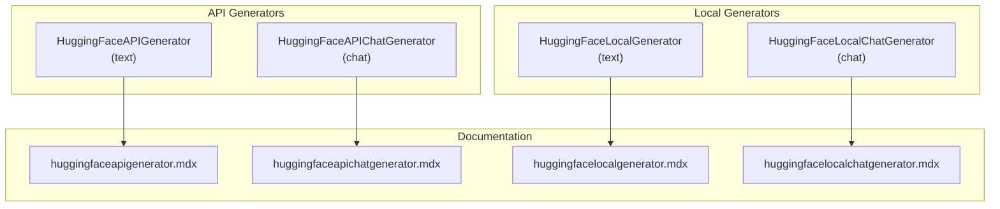
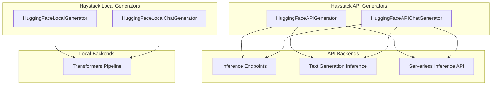
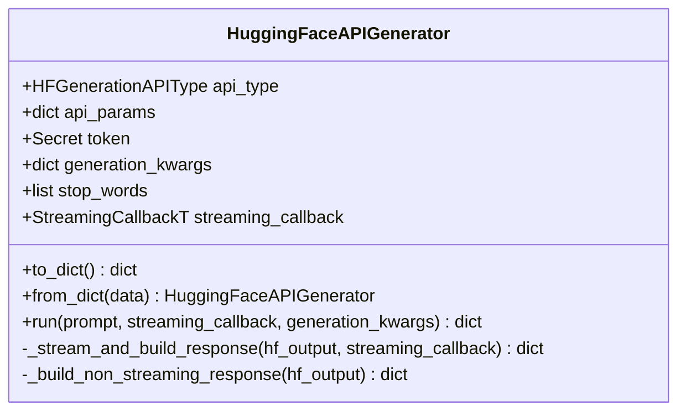
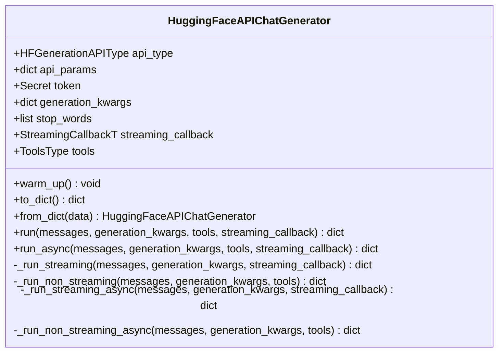
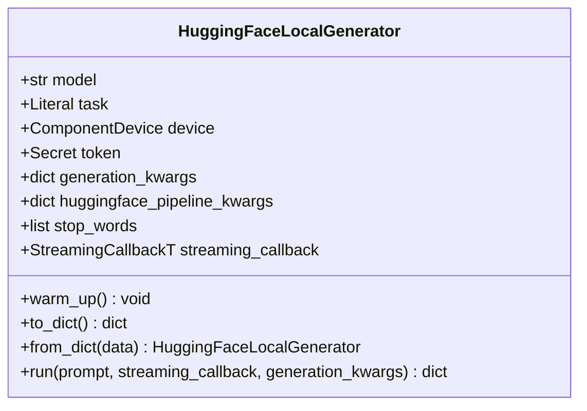
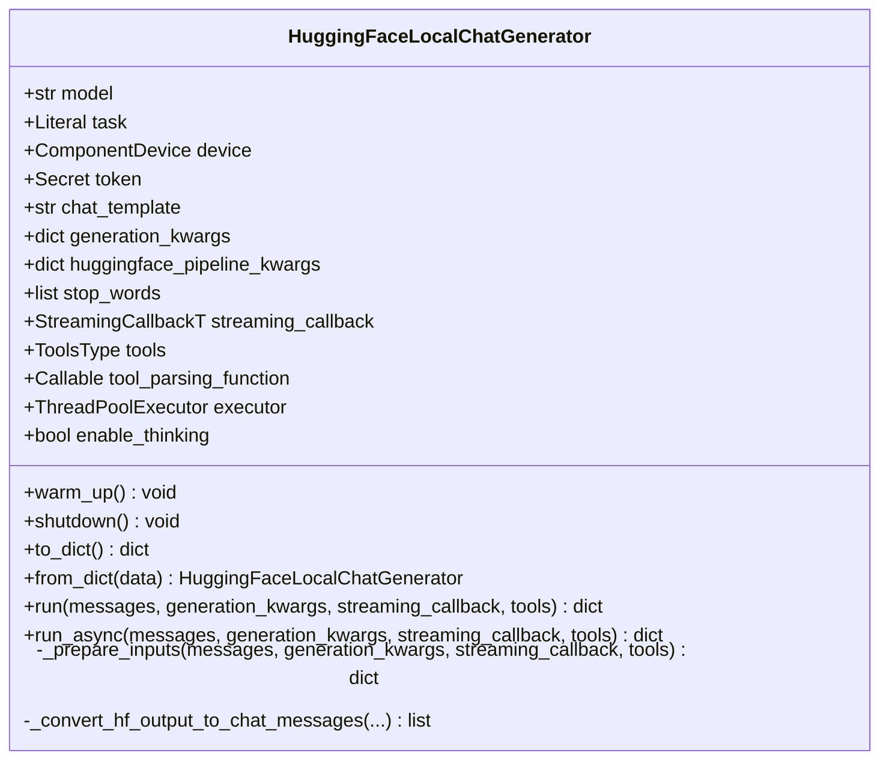
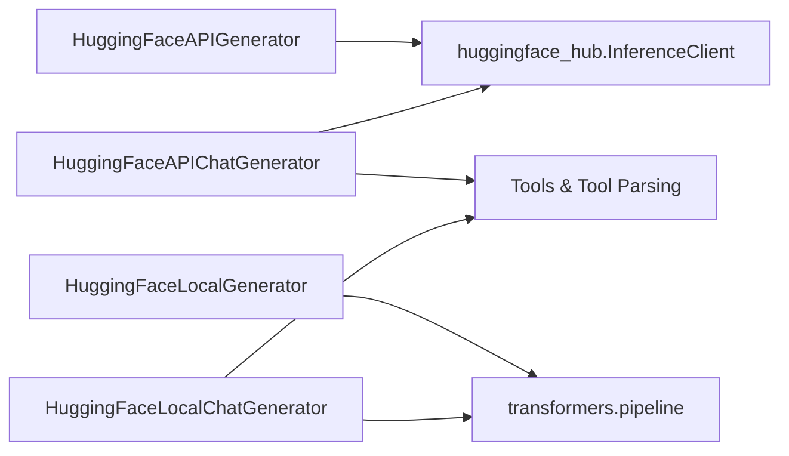

# Hugging Face Generators

<cite>
**Referenced Files in This Document**
- [hugging_face_api.py](file://haystack/components/generators/hugging_face_api.py)
- [hugging_face_api.py (chat)](file://haystack/components/generators/chat/hugging_face_api.py)
- [hugging_face_local.py](file://haystack/components/generators/hugging_face_local.py)
- [hugging_face_local.py (chat)](file://haystack/components/generators/chat/hugging_face_local.py)
- [huggingfaceapigenerator.mdx](file://docs-website/docs/pipeline-components/generators/huggingfaceapigenerator.mdx)
- [huggingfaceapichatgenerator.mdx](file://docs-website/docs/pipeline-components/generators/huggingfaceapichatgenerator.mdx)
- [huggingfacelocalgenerator.mdx](file://docs-website/docs/pipeline-components/generators/huggingfacelocalgenerator.mdx)
- [huggingfacelocalchatgenerator.mdx](file://docs-website/docs/pipeline-components/generators/huggingfacelocalchatgenerator.mdx)
</cite>

## Table of Contents
1. [Introduction](#introduction)
2. [Project Structure](#project-structure)
3. [Core Components](#core-components)
4. [Architecture Overview](#architecture-overview)
5. [Detailed Component Analysis](#detailed-component-analysis)
6. [Dependency Analysis](#dependency-analysis)
7. [Performance Considerations](#performance-considerations)
8. [Troubleshooting Guide](#troubleshooting-guide)
9. [Conclusion](#conclusion)
10. [Appendices](#appendices)

## Introduction
This document provides comprehensive API documentation for Hugging Face generator components in the Haystack ecosystem. It covers both API-based and local model generators, focusing on:
- Authentication via Hugging Face tokens
- Model selection from the Hub
- Parameter configuration for generation
- Streaming capabilities
- Local model loading, device configuration, and inference optimization
- Usage examples for popular models (Llama, Mistral, Falcon)
- Error handling and performance tuning

## Project Structure
The Hugging Face generator components are implemented as Haystack pipeline components. The relevant files are organized by domain (API vs local) and modality (text vs chat).

**Diagram sources**
- [hugging_face_api.py](file://haystack/components/generators/hugging_face_api.py#L36-L303)
- [hugging_face_api.py (chat)](file://haystack/components/generators/chat/hugging_face_api.py#L215-L693)
- [hugging_face_local.py](file://haystack/components/generators/hugging_face_local.py#L24-L266)
- [hugging_face_local.py (chat)](file://haystack/components/generators/chat/hugging_face_local.py#L88-L665)
- [huggingfaceapigenerator.mdx](file://docs-website/docs/pipeline-components/generators/huggingfaceapigenerator.mdx#L1-L191)
- [huggingfaceapichatgenerator.mdx](file://docs-website/docs/pipeline-components/generators/huggingfaceapichatgenerator.mdx#L1-L226)
- [huggingfacelocalgenerator.mdx](file://docs-website/docs/pipeline-components/generators/huggingfacelocalgenerator.mdx#L1-L124)
- [huggingfacelocalchatgenerator.mdx](file://docs-website/docs/pipeline-components/generators/huggingfacelocalchatgenerator.mdx#L1-L93)

**Section sources**
- [hugging_face_api.py](file://haystack/components/generators/hugging_face_api.py#L36-L303)
- [hugging_face_api.py (chat)](file://haystack/components/generators/chat/hugging_face_api.py#L215-L693)
- [hugging_face_local.py](file://haystack/components/generators/hugging_face_local.py#L24-L266)
- [hugging_face_local.py (chat)](file://haystack/components/generators/chat/hugging_face_local.py#L88-L665)
- [huggingfaceapigenerator.mdx](file://docs-website/docs/pipeline-components/generators/huggingfaceapigenerator.mdx#L1-L191)
- [huggingfaceapichatgenerator.mdx](file://docs-website/docs/pipeline-components/generators/huggingfaceapichatgenerator.mdx#L1-L226)
- [huggingfacelocalgenerator.mdx](file://docs-website/docs/pipeline-components/generators/huggingfacelocalgenerator.mdx#L1-L124)
- [huggingfacelocalchatgenerator.mdx](file://docs-website/docs/pipeline-components/generators/huggingfacelocalchatgenerator.mdx#L1-L93)

## Core Components
- HuggingFaceAPIGenerator (text): Invokes Hugging Face APIs for text generation using Inference Endpoints, Self-hosted Text Generation Inference, or the Serverless Inference API. Supports streaming callbacks and stop words.
- HuggingFaceAPIChatGenerator (chat): Invokes Hugging Face APIs for chat completion using the same API backends. Accepts ChatMessage inputs, supports tools/function calling, and streaming.
- HuggingFaceLocalGenerator (text): Runs text-generation models locally via Transformers pipelines. Supports device selection, stop words, and streaming.
- HuggingFaceLocalChatGenerator (chat): Runs chat-capable models locally, applies chat templates, supports tools, stop words, and streaming.

Key shared capabilities:
- Authentication via HF token (environment variables or explicit token)
- Parameter customization via generation_kwargs
- Streaming via streaming_callback
- Serialization/deserialization via to_dict/from_dict

**Section sources**
- [hugging_face_api.py](file://haystack/components/generators/hugging_face_api.py#L96-L180)
- [hugging_face_api.py (chat)](file://haystack/components/generators/chat/hugging_face_api.py#L313-L410)
- [hugging_face_local.py](file://haystack/components/generators/hugging_face_local.py#L47-L123)
- [hugging_face_local.py (chat)](file://haystack/components/generators/chat/hugging_face_local.py#L125-L257)

## Architecture Overview
The components integrate with Hugging Face clients or Transformers pipelines depending on whether the model is served remotely or run locally. They expose a uniform run method and optional streaming callback.

**Diagram sources**
- [hugging_face_api.py](file://haystack/components/generators/hugging_face_api.py#L134-L180)
- [hugging_face_api.py (chat)](file://haystack/components/generators/chat/hugging_face_api.py#L357-L410)
- [hugging_face_local.py](file://haystack/components/generators/hugging_face_local.py#L90-L123)
- [hugging_face_local.py (chat)](file://haystack/components/generators/chat/hugging_face_local.py#L191-L257)

## Detailed Component Analysis

### HuggingFaceAPIGenerator (Text)
- Purpose: Text generation via Hugging Face APIs.
- Authentication: Token via environment variable or explicit token; required for Inference Endpoints and Serverless Inference API.
- Model selection: model ID for Serverless; URL for Inference Endpoints/TGI.
- Parameters: generation_kwargs (e.g., max_new_tokens, temperature), stop_words, streaming_callback.
- Streaming: Implemented via InferenceClient.text_generation with stream flag and a streaming callback.

**Diagram sources**
- [hugging_face_api.py](file://haystack/components/generators/hugging_face_api.py#L36-L303)

Usage highlights:
- Serverless Inference API requires model ID and token.
- Inference Endpoints and TGI require a valid URL; URL validation is enforced.
- Streaming callback receives StreamingChunk objects with metadata.

**Section sources**
- [hugging_face_api.py](file://haystack/components/generators/hugging_face_api.py#L96-L180)
- [hugging_face_api.py](file://haystack/components/generators/hugging_face_api.py#L210-L250)
- [huggingfaceapigenerator.mdx](file://docs-website/docs/pipeline-components/generators/huggingfaceapigenerator.mdx#L1-L191)

### HuggingFaceAPIChatGenerator (Chat)
- Purpose: Chat completion via Hugging Face APIs.
- Authentication: Token via environment variable or explicit token; required for Serverless and Inference Endpoints.
- Model selection: model ID for Serverless; URL for Inference Endpoints/TGI.
- Parameters: generation_kwargs (e.g., max_tokens, temperature), stop_words, streaming_callback, tools.
- Streaming: Implemented via InferenceClient.chat_completion with stream flag and usage reporting.
- Tools: Function/tool calling support with conversion helpers and validation.

**Diagram sources**
- [hugging_face_api.py (chat)](file://haystack/components/generators/chat/hugging_face_api.py#L215-L693)

Usage highlights:
- Accepts ChatMessage inputs; supports multimodal inputs for vision-language models.
- Tools and streaming cannot be used simultaneously.
- Provides usage metadata and finish reasons.

**Section sources**
- [hugging_face_api.py (chat)](file://haystack/components/generators/chat/hugging_face_api.py#L313-L410)
- [hugging_face_api.py (chat)](file://haystack/components/generators/chat/hugging_face_api.py#L452-L501)
- [huggingfaceapichatgenerator.mdx](file://docs-website/docs/pipeline-components/generators/huggingfaceapichatgenerator.mdx#L1-L226)

### HuggingFaceLocalGenerator (Text)
- Purpose: Local text-generation via Transformers pipelines.
- Model selection: model name/path; task inferred or explicitly set.
- Device configuration: ComponentDevice supports automatic selection; device/device_map overridden by huggingface_pipeline_kwargs.
- Parameters: generation_kwargs (e.g., max_new_tokens, temperature), stop_words, streaming_callback.
- Streaming: Uses HFTokenStreamingHandler integrated with Transformers pipeline streamer.

**Diagram sources**
- [hugging_face_local.py](file://haystack/components/generators/hugging_face_local.py#L24-L266)

Usage highlights:
- Supports text-generation and text2text-generation tasks.
- Automatically sets return_full_text=False for text-generation to exclude prompts.
- Stop words supported via StoppingCriteriaList.

**Section sources**
- [hugging_face_local.py](file://haystack/components/generators/hugging_face_local.py#L47-L123)
- [hugging_face_local.py](file://haystack/components/generators/hugging_face_local.py#L138-L156)
- [hugging_face_local.py](file://haystack/components/generators/hugging_face_local.py#L199-L266)
- [huggingfacelocalgenerator.mdx](file://docs-website/docs/pipeline-components/generators/huggingfacelocalgenerator.mdx#L1-L124)

### HuggingFaceLocalChatGenerator (Chat)
- Purpose: Local chat completion via Transformers pipelines with chat templates.
- Model selection: chat-capable model name/path; task validated.
- Device configuration: ComponentDevice resolution and device map via huggingface_pipeline_kwargs.
- Parameters: generation_kwargs (e.g., max_new_tokens), stop_words, chat_template, tools, tool_parsing_function, streaming_callback.
- Streaming: Uses HFTokenStreamingHandler (sync) and AsyncHFTokenStreamingHandler (async).
- Tools: Parses tool calls from model output using a default or custom parser.

**Diagram sources**
- [hugging_face_local.py (chat)](file://haystack/components/generators/chat/hugging_face_local.py#L88-L665)

Usage highlights:
- Applies chat templates and adds generation prompts; supports custom templates.
- Validates tasks and raises errors for unsupported tasks with newer Transformers versions.
- Supports tool parsing and finish reasons including tool_calls.

**Section sources**
- [hugging_face_local.py (chat)](file://haystack/components/generators/chat/hugging_face_local.py#L125-L257)
- [hugging_face_local.py (chat)](file://haystack/components/generators/chat/hugging_face_local.py#L349-L394)
- [hugging_face_local.py (chat)](file://haystack/components/generators/chat/hugging_face_local.py#L464-L523)
- [huggingfacelocalchatgenerator.mdx](file://docs-website/docs/pipeline-components/generators/huggingfacelocalchatgenerator.mdx#L1-L93)

## Dependency Analysis
- External libraries:
  - huggingface_hub (InferenceClient, AsyncInferenceClient)
  - transformers (pipeline, StoppingCriteriaList, tokenizers)
- Internal utilities:
  - HFGenerationAPIType, HFModelType, check_valid_model
  - ComponentDevice, resolve_hf_pipeline_kwargs
  - Streaming handlers (HFTokenStreamingHandler, AsyncHFTokenStreamingHandler)
  - Tool utilities and serialization helpers

**Diagram sources**
- [hugging_face_api.py](file://haystack/components/generators/hugging_face_api.py#L24-L30)
- [hugging_face_api.py (chat)](file://haystack/components/generators/chat/hugging_face_api.py#L39-L51)
- [hugging_face_local.py](file://haystack/components/generators/hugging_face_local.py#L17-L21)
- [hugging_face_local.py (chat)](file://haystack/components/generators/chat/hugging_face_local.py#L34-L47)

**Section sources**
- [hugging_face_api.py](file://haystack/components/generators/hugging_face_api.py#L24-L30)
- [hugging_face_api.py (chat)](file://haystack/components/generators/chat/hugging_face_api.py#L39-L51)
- [hugging_face_local.py](file://haystack/components/generators/hugging_face_local.py#L17-L21)
- [hugging_face_local.py (chat)](file://haystack/components/generators/chat/hugging_face_local.py#L34-L47)

## Performance Considerations
- API Generators
  - Choose appropriate api_type based on latency and cost requirements.
  - For Serverless Inference API, specify provider for better performance.
  - Tune generation_kwargs (e.g., max_new_tokens, temperature) to balance quality and speed.
  - Use streaming_callback for real-time token delivery and reduced perceived latency.
- Local Generators
  - Select a suitable model size for available hardware; larger models require more memory and compute.
  - Configure device via ComponentDevice or huggingface_pipeline_kwargs to leverage GPU acceleration.
  - Use generation_kwargs to cap token counts and temperature for responsiveness.
  - Enable stop_words to prevent unnecessary continuation.
  - For chat, apply chat_template to improve coherence and reduce hallucinations.
- General
  - Warm up components (e.g., warm_up for API chat generator, pipeline creation for local generators) to avoid cold-start delays.
  - Avoid combining tools with streaming in the same call where unsupported.

[No sources needed since this section provides general guidance]

## Troubleshooting Guide
Common issues and resolutions:
- Invalid URL for API endpoints
  - Ensure api_params["url"] is a valid HTTP(S) URL.
  - Verify network connectivity and endpoint availability.
- Missing model ID for Serverless
  - Provide api_params["model"] when using Serverless Inference API.
- Token authentication failures
  - Set HF_API_TOKEN or HF_TOKEN environment variable or pass token explicitly.
  - Confirm token permissions for the target model or endpoint.
- Unsupported tasks
  - For local chat, ensure the model is chat-capable and task is supported.
  - Avoid text2text-generation with newer Transformers versions.
- Streaming conflicts
  - Do not combine tools with streaming in the same call for API chat generator.
  - For local chat, streaming requires single response (num_return_sequences=1).
- Stop words vs stopping_criteria
  - Do not specify both stop_words and stopping_criteria in generation_kwargs simultaneously.

**Section sources**
- [hugging_face_api.py](file://haystack/components/generators/hugging_face_api.py#L150-L163)
- [hugging_face_api.py (chat)](file://haystack/components/generators/chat/hugging_face_api.py#L385-L387)
- [hugging_face_local.py](file://haystack/components/generators/hugging_face_local.py#L110-L114)
- [hugging_face_local.py (chat)](file://haystack/components/generators/chat/hugging_face_local.py#L558-L559)

## Conclusion
The Hugging Face generator components in Haystack provide a unified interface for both API-based and local model inference. By leveraging tokens, flexible parameterization, and streaming, they support a wide range of use cases from simple text generation to advanced chat and tool-enabled interactions. Proper device configuration and generation parameters are key to achieving optimal performance and reliability.

[No sources needed since this section summarizes without analyzing specific files]

## Appendices

### Usage Examples for Popular Models
- Llama
  - API Chat: Use a chat-capable model ID with HuggingFaceAPIChatGenerator and a provider for Serverless Inference API.
  - Local Chat: Use a Llama chat model with HuggingFaceLocalChatGenerator and a chat template.
- Mistral
  - API Chat: Use a Mistral model with HuggingFaceAPIChatGenerator; configure provider for improved performance.
  - Local Chat: Use a Mistral chat model with HuggingFaceLocalChatGenerator.
- Falcon
  - API Chat: Use a Falcon chat model with HuggingFaceAPIChatGenerator.
  - Local Chat: Use a Falcon chat model with HuggingFaceLocalChatGenerator.

[No sources needed since this section provides general guidance]

### API Reference Paths
- HuggingFaceAPIGenerator: [huggingfaceapigenerator.mdx](file://docs-website/docs/pipeline-components/generators/huggingfaceapigenerator.mdx#L1-L191)
- HuggingFaceAPIChatGenerator: [huggingfaceapichatgenerator.mdx](file://docs-website/docs/pipeline-components/generators/huggingfaceapichatgenerator.mdx#L1-L226)
- HuggingFaceLocalGenerator: [huggingfacelocalgenerator.mdx](file://docs-website/docs/pipeline-components/generators/huggingfacelocalgenerator.mdx#L1-L124)
- HuggingFaceLocalChatGenerator: [huggingfacelocalchatgenerator.mdx](file://docs-website/docs/pipeline-components/generators/huggingfacelocalchatgenerator.mdx#L1-L93)