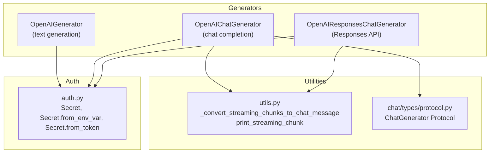
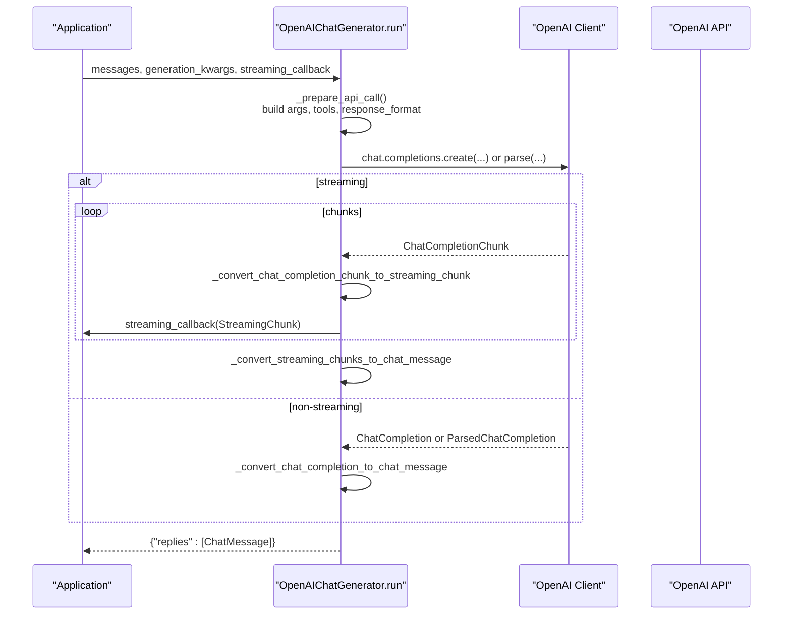
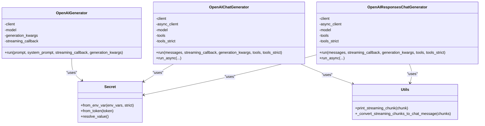

# OpenAI Generators

<cite>
**Referenced Files in This Document**
- [openai.py](file://haystack/components/generators/openai.py)
- [openai.py](file://haystack/components/generators/chat/openai.py)
- [openai_responses.py](file://haystack/components/generators/chat/openai_responses.py)
- [utils.py](file://haystack/components/generators/utils.py)
- [protocol.py](file://haystack/components/generators/chat/types/protocol.py)
- [auth.py](file://haystack/utils/auth.py)
- [test_openai.py](file://test/components/generators/chat/test_openai.py)
</cite>

## Table of Contents
1. [Introduction](#introduction)
2. [Project Structure](#project-structure)
3. [Core Components](#core-components)
4. [Architecture Overview](#architecture-overview)
5. [Detailed Component Analysis](#detailed-component-analysis)
6. [Dependency Analysis](#dependency-analysis)
7. [Performance Considerations](#performance-considerations)
8. [Troubleshooting Guide](#troubleshooting-guide)
9. [Conclusion](#conclusion)
10. [Appendices](#appendices)

## Introduction
This document provides comprehensive API documentation for OpenAI generator components in the Haystack library. It covers both text generation and chat completion APIs, focusing on:
- Authentication via API keys using the Secret abstraction
- Model configuration options (including GPT-3.5, GPT-4, and GPT-5 series)
- Parameter specifications (temperature, max_completion_tokens, top_p, stop, presence_penalty, frequency_penalty, logit_bias, response_format)
- Streaming capabilities and response formatting
- Usage examples for different model types
- Error handling patterns for rate limits and API failures
- Best practices for prompt engineering
- OpenAI Responses API integration and structured outputs functionality

## Project Structure
The OpenAI generator components are organized under the generators module with dedicated chat and non-chat implementations. Utilities and protocols support streaming, conversion, and typing.

**Diagram sources**
- [openai.py](file://haystack/components/generators/openai.py#L31-L271)
- [openai.py](file://haystack/components/generators/chat/openai.py#L53-L725)
- [openai_responses.py](file://haystack/components/generators/chat/openai_responses.py#L46-L904)
- [utils.py](file://haystack/components/generators/utils.py#L78-L172)
- [protocol.py](file://haystack/components/generators/chat/types/protocol.py#L10-L32)
- [auth.py](file://haystack/utils/auth.py#L34-L231)

**Section sources**
- [openai.py](file://haystack/components/generators/openai.py#L31-L271)
- [openai.py](file://haystack/components/generators/chat/openai.py#L53-L725)
- [openai_responses.py](file://haystack/components/generators/chat/openai_responses.py#L46-L904)
- [utils.py](file://haystack/components/generators/utils.py#L78-L172)
- [protocol.py](file://haystack/components/generators/chat/types/protocol.py#L10-L32)
- [auth.py](file://haystack/utils/auth.py#L34-L231)

## Core Components
- OpenAIGenerator: Generates plain text using OpenAI chat models. Accepts a single string prompt and returns a list of text replies plus metadata.
- OpenAIChatGenerator: Performs chat completions using ChatMessage inputs and outputs. Supports streaming, tools, and structured outputs.
- OpenAIResponsesChatGenerator: Integrates with OpenAI’s Responses API, supporting reasoning summaries, structured outputs, and tool calls.

Key shared capabilities:
- Authentication via Secret (environment variable or token-based)
- Model selection and generation parameters
- Streaming via callbacks
- Metadata handling (finish_reason, usage, logprobs)
- Tool invocation support (function calling)
- Structured outputs via response_format or text_format

**Section sources**
- [openai.py](file://haystack/components/generators/openai.py#L31-L271)
- [openai.py](file://haystack/components/generators/chat/openai.py#L53-L725)
- [openai_responses.py](file://haystack/components/generators/chat/openai_responses.py#L46-L904)

## Architecture Overview
The components integrate with the OpenAI client libraries and convert between internal dataclasses and OpenAI API formats. Streaming is handled uniformly through StreamingChunk and ChatMessage abstractions.

**Diagram sources**
- [openai.py](file://haystack/components/generators/chat/openai.py#L300-L453)
- [openai.py](file://haystack/components/generators/chat/openai.py#L455-L515)
- [openai.py](file://haystack/components/generators/chat/openai.py#L517-L550)
- [utils.py](file://haystack/components/generators/utils.py#L78-L158)

## Detailed Component Analysis

### OpenAIGenerator (Text Generation)
Purpose:
- Accepts a plain text prompt and returns text completions using OpenAI chat models.

Key parameters:
- api_key: Secret (env var default)
- model: Defaults to a GPT-5 model
- streaming_callback: Optional callback for streaming tokens
- api_base_url, organization: Endpoint customization
- system_prompt: Optional system-level instruction
- generation_kwargs: Parameters forwarded to OpenAI (e.g., temperature, top_p, max_completion_tokens)
- timeout, max_retries: Client behavior
- http_client_kwargs: HTTP client configuration

Behavior:
- Converts input string to a ChatMessage and optionally prepends a system message
- Calls chat.completions.create with stream flag based on callback
- Streams chunks to callback or converts to ChatMessage list
- Validates finish_reason and attaches metadata

Usage example paths:
- [Example usage](file://haystack/components/generators/openai.py#L48-L62)

**Section sources**
- [openai.py](file://haystack/components/generators/openai.py#L64-L271)

### OpenAIChatGenerator (Chat Completion)
Purpose:
- Processes a list of ChatMessage instances and returns ChatMessage replies.

Supported models:
- Includes GPT-3.5, GPT-4, and GPT-5 variants

Key parameters:
- api_key, model, streaming_callback, api_base_url, organization
- generation_kwargs: Includes response_format for structured outputs
- tools: Tool and Toolset objects; tools_strict controls strict schema adherence
- timeout, max_retries, http_client_kwargs

Behavior:
- Prepares API call arguments, validates streaming constraints, and handles tools
- Chooses chat.completions.create or parse endpoint based on response_format and streaming
- Streams chunks via callbacks or returns non-streaming ChatMessage list
- Converts tool calls and reasoning content to internal dataclasses

Structured outputs:
- response_format accepts Pydantic models or JSON schemas
- Streaming with structured outputs requires JSON schema (not Pydantic model)

Async support:
- run_async mirrors run with async streaming and endpoint selection

Usage example paths:
- [Example usage](file://haystack/components/generators/chat/openai.py#L70-L95)

**Section sources**
- [openai.py](file://haystack/components/generators/chat/openai.py#L117-L453)
- [openai.py](file://haystack/components/generators/chat/openai.py#L455-L515)
- [openai.py](file://haystack/components/generators/chat/openai.py#L517-L725)

### OpenAIResponsesChatGenerator (Responses API)
Purpose:
- Integrates with OpenAI’s Responses API for advanced features like reasoning summaries and structured outputs.

Key parameters:
- api_key, model, streaming_callback, api_base_url, organization
- generation_kwargs: Includes reasoning, text_format, text, previous_response_id, verbosity
- tools: Supports Haystack tools or OpenAI/MCP tool definitions
- tools_strict: Controls strictness for tool calls
- timeout, max_retries, http_client_kwargs

Behavior:
- Converts ChatMessage to Responses API input format
- Supports create and parse endpoints based on text_format presence
- Streams reasoning summaries, function call arguments, and text deltas
- Builds ChatMessage with reasoning content and tool calls

Usage example paths:
- [Example usage](file://haystack/components/generators/chat/openai_responses.py#L63-L75)

**Section sources**
- [openai_responses.py](file://haystack/components/generators/chat/openai_responses.py#L77-L433)
- [openai_responses.py](file://haystack/components/generators/chat/openai_responses.py#L434-L534)

### Streaming and Response Formatting
- StreamingChunk carries content, tool_calls, reasoning, and metadata
- _convert_streaming_chunks_to_chat_message aggregates chunks into a ChatMessage
- print_streaming_chunk provides a ready-to-use callback for console output
- finish_reason and usage are propagated in metadata

**Section sources**
- [utils.py](file://haystack/components/generators/utils.py#L13-L158)
- [openai.py](file://haystack/components/generators/chat/openai.py#L614-L725)
- [openai_responses.py](file://haystack/components/generators/chat/openai_responses.py#L603-L707)

### Authentication Setup
- Secret.from_env_var("OPENAI_API_KEY") is the default
- Secret.from_token for explicit tokens
- Environment variables OPENAI_TIMEOUT and OPENAI_MAX_RETRIES control client behavior

**Section sources**
- [auth.py](file://haystack/utils/auth.py#L34-L231)
- [openai.py](file://haystack/components/generators/openai.py#L66-L143)
- [openai.py](file://haystack/components/generators/chat/openai.py#L119-L225)
- [openai_responses.py](file://haystack/components/generators/chat/openai_responses.py#L80-L191)

### Model Configuration Options
- Supported models include GPT-3.5, GPT-4, and GPT-5 series
- Model selection via model parameter

**Section sources**
- [openai.py](file://haystack/components/generators/chat/openai.py#L97-L115)

### Parameter Specifications
Common generation_kwargs:
- temperature, top_p, max_completion_tokens, n, stop, presence_penalty, frequency_penalty, logit_bias
- response_format (chat), text_format (responses), text (responses)

Notes:
- response_format supports Pydantic models and JSON schemas; streaming requires JSON schema
- reasoning parameters (reasoning_effort, reasoning_summary, verbosity) are normalized internally

**Section sources**
- [openai.py](file://haystack/components/generators/openai.py#L94-L111)
- [openai.py](file://haystack/components/generators/chat/openai.py#L151-L178)
- [openai_responses.py](file://haystack/components/generators/chat/openai_responses.py#L113-L140)

### Usage Examples
- Basic chat completion with OpenAIChatGenerator
- Structured outputs with Pydantic models or JSON schemas
- Tool use with function definitions
- Streaming with print_streaming_chunk callback

Paths to examples:
- [Basic usage example](file://haystack/components/generators/chat/openai.py#L70-L95)
- [Structured outputs example](file://test/components/generators/chat/test_openai.py#L120-L152)
- [Tool usage example](file://test/components/generators/chat/test_openai.py#L172-L186)
- [Streaming example](file://haystack/components/generators/utils.py#L13-L76)

**Section sources**
- [openai.py](file://haystack/components/generators/chat/openai.py#L70-L95)
- [test_openai.py](file://test/components/generators/chat/test_openai.py#L120-L186)
- [utils.py](file://haystack/components/generators/utils.py#L13-L76)

## Dependency Analysis
Relationships among components and utilities:

**Diagram sources**
- [openai.py](file://haystack/components/generators/openai.py#L31-L271)
- [openai.py](file://haystack/components/generators/chat/openai.py#L53-L725)
- [openai_responses.py](file://haystack/components/generators/chat/openai_responses.py#L46-L904)
- [auth.py](file://haystack/utils/auth.py#L34-L231)
- [utils.py](file://haystack/components/generators/utils.py#L78-L158)

**Section sources**
- [openai.py](file://haystack/components/generators/openai.py#L31-L271)
- [openai.py](file://haystack/components/generators/chat/openai.py#L53-L725)
- [openai_responses.py](file://haystack/components/generators/chat/openai_responses.py#L46-L904)
- [auth.py](file://haystack/utils/auth.py#L34-L231)
- [utils.py](file://haystack/components/generators/utils.py#L78-L158)

## Performance Considerations
- Prefer streaming for long-running generations to reduce perceived latency
- Use appropriate timeouts and retry policies via OPENAI_TIMEOUT and OPENAI_MAX_RETRIES
- Limit n to 1 when streaming to avoid ambiguity
- Choose smaller models for constrained environments; use larger models for complex tasks
- Minimize payload size by trimming unnecessary context in messages

[No sources needed since this section provides general guidance]

## Troubleshooting Guide
Common issues and resolutions:
- Rate limits (HTTP 429): Implement retry logic or failover strategies; monitor successful_chat_generator_index in metadata
- Authentication failures (HTTP 401): Verify OPENAI_API_KEY and Secret configuration
- Content filtering or truncation warnings: Adjust max_completion_tokens or refine prompts
- Malformed tool call arguments: Enable tools_strict to enforce schema adherence

Error handling patterns:
- Streaming cancellation: Async streams are safely closed on cancellation
- Finish reasons: length and content_filter are logged as warnings
- Failover scenarios: Use fallback generators to switch providers on failure

**Section sources**
- [openai.py](file://haystack/components/generators/chat/openai.py#L553-L567)
- [openai.py](file://haystack/components/generators/chat/openai.py#L543-L549)
- [test_openai.py](file://test/components/generators/chat/test_openai.py#L333-L347)

## Conclusion
The OpenAI generator components provide robust, production-ready integrations for text generation and chat completion. They support streaming, tools, structured outputs, and flexible authentication. By leveraging the provided utilities and following best practices, developers can build reliable pipelines that scale across diverse use cases.

[No sources needed since this section summarizes without analyzing specific files]

## Appendices

### API Reference Tables

- OpenAIGenerator.run
  - Inputs: prompt (str), system_prompt (str, optional), streaming_callback (callable, optional), generation_kwargs (dict, optional)
  - Outputs: replies (list[str]), meta (list[dict])

- OpenAIChatGenerator.run
  - Inputs: messages (list[ChatMessage]), streaming_callback (callable, optional), generation_kwargs (dict, optional), tools (ToolsType, optional), tools_strict (bool, optional)
  - Outputs: replies (list[ChatMessage])

- OpenAIResponsesChatGenerator.run
  - Inputs: messages (list[ChatMessage]), streaming_callback (callable, optional), generation_kwargs (dict, optional), tools (ToolsType or list[dict], optional), tools_strict (bool, optional)
  - Outputs: replies (list[ChatMessage])

- Authentication
  - Secret.from_env_var("OPENAI_API_KEY") default
  - Secret.from_token for explicit tokens

- Structured Outputs
  - OpenAIChatGenerator: response_format accepts Pydantic models or JSON schemas; streaming requires JSON schema
  - OpenAIResponsesChatGenerator: text_format or text; text_format takes precedence

**Section sources**
- [openai.py](file://haystack/components/generators/openai.py#L187-L271)
- [openai.py](file://haystack/components/generators/chat/openai.py#L300-L453)
- [openai_responses.py](file://haystack/components/generators/chat/openai_responses.py#L289-L433)
- [auth.py](file://haystack/utils/auth.py#L57-L74)