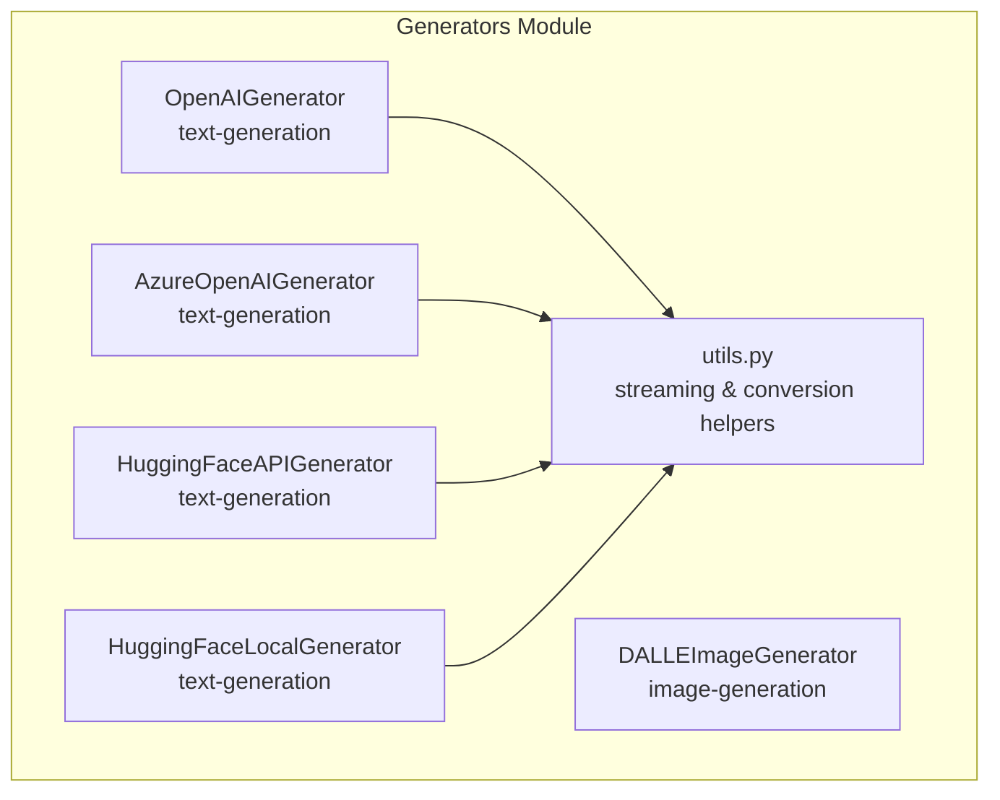
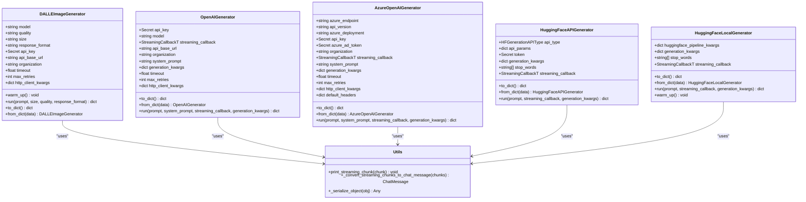
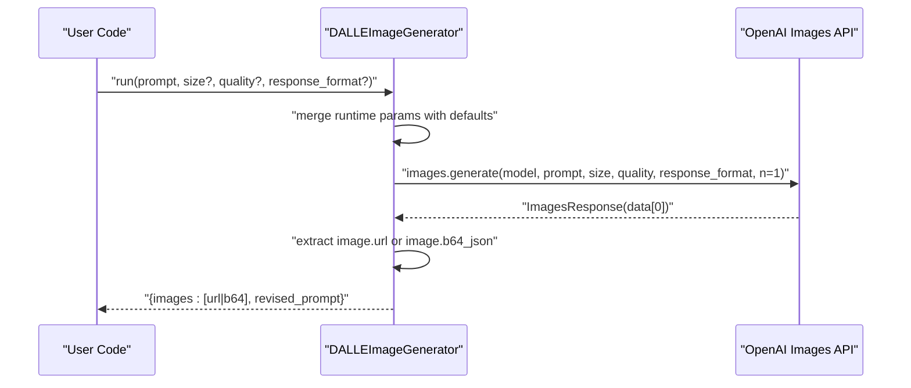
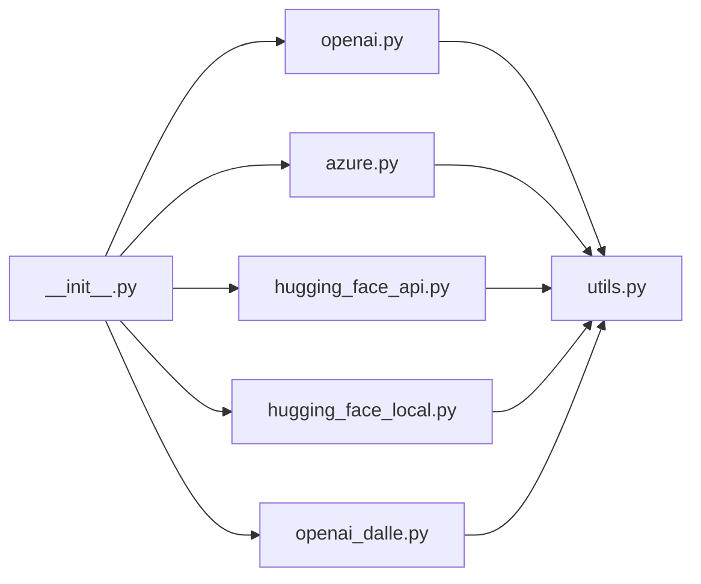

# Specialized Generators

<cite>
**Referenced Files in This Document**
- [openai_dalle.py](file://haystack/components/generators/openai_dalle.py)
- [openai.py](file://haystack/components/generators/openai.py)
- [azure.py](file://haystack/components/generators/azure.py)
- [hugging_face_api.py](file://haystack/components/generators/hugging_face_api.py)
- [hugging_face_local.py](file://haystack/components/generators/hugging_face_local.py)
- [utils.py](file://haystack/components/generators/utils.py)
- [__init__.py](file://haystack/components/generators/__init__.py)
- [test_openai_dalle.py](file://test/components/generators/test_openai_dalle.py)
- [dalleimagegenerator.mdx](file://docs-website/docs/pipeline-components/generators/dalleimagegenerator.mdx)
</cite>

## Table of Contents
1. [Introduction](#introduction)
2. [Project Structure](#project-structure)
3. [Core Components](#core-components)
4. [Architecture Overview](#architecture-overview)
5. [Detailed Component Analysis](#detailed-component-analysis)
6. [Dependency Analysis](#dependency-analysis)
7. [Performance Considerations](#performance-considerations)
8. [Troubleshooting Guide](#troubleshooting-guide)
9. [Conclusion](#conclusion)
10. [Appendices](#appendices)

## Introduction
This document provides comprehensive API documentation for specialized generator components in the Haystack ecosystem beyond text generation. It focuses on:
- DALLEImageGenerator for image generation via OpenAI’s DALL·E API
- Utility generators and helper components for streaming, conversion, and serialization
- Parameter specifications, input validation, output processing, and integration patterns with other Haystack components
- Usage examples, error handling strategies, and best practices for prompt optimization and resource management

## Project Structure
The specialized generators live under the generators module. The module exposes multiple generator implementations for different providers and environments, along with shared utilities for streaming and data conversion.

**Diagram sources**
- [openai.py](file://haystack/components/generators/openai.py#L31-L271)
- [azure.py](file://haystack/components/generators/azure.py#L17-L216)
- [hugging_face_api.py](file://haystack/components/generators/hugging_face_api.py#L36-L303)
- [hugging_face_local.py](file://haystack/components/generators/hugging_face_local.py#L24-L266)
- [openai_dalle.py](file://haystack/components/generators/openai_dalle.py#L16-L167)
- [utils.py](file://haystack/components/generators/utils.py#L13-L172)

**Section sources**
- [__init__.py](file://haystack/components/generators/__init__.py#L10-L26)

## Core Components
This section summarizes the primary specialized generators and their roles.

- DALLEImageGenerator: Generates images from text prompts using OpenAI’s DALL·E models. Supports model selection, quality, size, and response format customization.
- OpenAIGenerator: Text generation using OpenAI chat models with streaming support and flexible generation parameters.
- AzureOpenAIGenerator: Azure-hosted OpenAI text generation with deployment-specific configuration and authentication options.
- HuggingFaceAPIGenerator: Text generation via Hugging Face inference endpoints and self-hosted TGI with streaming and stop-words support.
- HuggingFaceLocalGenerator: Local text generation using Hugging Face transformers pipelines with device and stop-words controls.
- utils.py: Shared utilities for streaming chunk handling, assembling ChatMessage from chunks, and generic serialization helpers.

**Section sources**
- [openai_dalle.py](file://haystack/components/generators/openai_dalle.py#L16-L167)
- [openai.py](file://haystack/components/generators/openai.py#L31-L271)
- [azure.py](file://haystack/components/generators/azure.py#L17-L216)
- [hugging_face_api.py](file://haystack/components/generators/hugging_face_api.py#L36-L303)
- [hugging_face_local.py](file://haystack/components/generators/hugging_face_local.py#L24-L266)
- [utils.py](file://haystack/components/generators/utils.py#L13-L172)

## Architecture Overview
The generators share a common pattern:
- Initialization with provider credentials and HTTP client configuration
- Optional warm-up phase to prepare clients
- run() method invoking provider APIs and returning standardized outputs
- Serialization/deserialization via to_dict/from_dict for persistence and composition

**Diagram sources**
- [openai_dalle.py](file://haystack/components/generators/openai_dalle.py#L16-L167)
- [openai.py](file://haystack/components/generators/openai.py#L31-L271)
- [azure.py](file://haystack/components/generators/azure.py#L17-L216)
- [hugging_face_api.py](file://haystack/components/generators/hugging_face_api.py#L36-L303)
- [hugging_face_local.py](file://haystack/components/generators/hugging_face_local.py#L24-L266)
- [utils.py](file://haystack/components/generators/utils.py#L13-L172)

## Detailed Component Analysis

### DALLEImageGenerator (OpenAI DALL·E)
Purpose: Generate images from text prompts using OpenAI’s DALL·E models.

Key parameters and behavior:
- Model selection: dall-e-2 or dall-e-3
- Quality: standard or hd
- Size: constrained by model (e.g., 256x256, 512x512, 1024x1024 for dall-e-2; 1024x1024, 1792x1024, 1024x1792 for dall-e-3)
- Response format: url or b64_json
- Authentication: Secret via OPENAI_API_KEY by default
- Environment overrides: OPENAI_TIMEOUT and OPENAI_MAX_RETRIES
- HTTP client customization via http_client_kwargs

Processing logic:
- run() validates and merges runtime overrides for size, quality, and response_format with initialization defaults
- Calls OpenAI images.generate with model, prompt, size, quality, response_format, and n=1
- Returns standardized keys: images (list of URLs or base64 strings), revised_prompt

Integration patterns:
- Works standalone or inside a Pipeline with PromptBuilder to structure prompts
- Integrates with Haystack’s Secret mechanism and HTTP client configuration

Usage examples:
- See the dedicated documentation page for examples and API reference links.

Best practices:
- Optimize prompts for DALL·E by specifying style, lighting, perspective, and subject details
- Choose response_format based on downstream processing needs (URLs vs. base64)
- Use size aligned with model capabilities and downstream rendering constraints
- Manage timeouts and retries according to environment and SLAs

**Section sources**
- [openai_dalle.py](file://haystack/components/generators/openai_dalle.py#L16-L167)
- [test_openai_dalle.py](file://test/components/generators/test_openai_dalle.py#L23-L162)
- [dalleimagegenerator.mdx](file://docs-website/docs/pipeline-components/generators/dalleimagegenerator.mdx#L30-L63)

#### DALL·E Image Generation Sequence

**Diagram sources**
- [openai_dalle.py](file://haystack/components/generators/openai_dalle.py#L97-L135)

### OpenAIGenerator (OpenAI Chat)
Purpose: Text generation using OpenAI chat models with streaming support.

Key parameters:
- api_key, model, streaming_callback, api_base_url, organization, system_prompt, generation_kwargs, timeout, max_retries, http_client_kwargs

Processing logic:
- Converts prompt to ChatMessage and optionally prepends system_prompt
- Streams or receives non-streaming completions
- Converts chunks/messages to standardized replies and metadata
- Applies finish reason checks and usage extraction

Integration patterns:
- Works with PromptBuilder and other components
- Supports streaming callbacks for real-time token handling

**Section sources**
- [openai.py](file://haystack/components/generators/openai.py#L31-L271)
- [utils.py](file://haystack/components/generators/utils.py#L78-L158)

### AzureOpenAIGenerator (Azure OpenAI)
Purpose: Text generation using Azure-hosted OpenAI models with deployment-specific configuration.

Key parameters:
- azure_endpoint, api_version, azure_deployment, api_key, azure_ad_token, organization, streaming_callback, system_prompt, timeout, max_retries, http_client_kwargs, default_headers, azure_ad_token_provider

Processing logic:
- Validates endpoint and credentials
- Initializes AzureOpenAI client with deployment and optional token provider
- Delegates run() to OpenAI-compatible generation with streaming support

Integration patterns:
- Suitable for enterprise deployments behind Azure AD or API key auth

**Section sources**
- [azure.py](file://haystack/components/generators/azure.py#L17-L216)

### HuggingFaceAPIGenerator (Hugging Face Inference)
Purpose: Text generation via Hugging Face inference endpoints and self-hosted TGI.

Key parameters:
- api_type (serverless_inference_api, inference_endpoints, text_generation_inference), api_params (model or url), token, generation_kwargs, stop_words, streaming_callback

Processing logic:
- Validates api_type and required parameters (model or url)
- Uses InferenceClient.text_generation with streaming and stop sequences
- Builds standardized replies and metadata

Integration patterns:
- Supports streaming and stop-word injection
- Useful for hosted or self-managed inference backends

**Section sources**
- [hugging_face_api.py](file://haystack/components/generators/hugging_face_api.py#L36-L303)

### HuggingFaceLocalGenerator (Local Transformers)
Purpose: Text generation using local Hugging Face models.

Key parameters:
- model, task, device, token, generation_kwargs, huggingface_pipeline_kwargs, stop_words, streaming_callback

Processing logic:
- Resolves pipeline kwargs and initializes transformers pipeline
- Supports stop words via stopping criteria
- Streams tokens via HFTokenStreamingHandler when streaming_callback is provided
- Returns generated replies with optional stop-word cleanup

Integration patterns:
- Ideal for offline or GPU-accelerated environments
- Device and model kwargs can be tuned for performance

**Section sources**
- [hugging_face_local.py](file://haystack/components/generators/hugging_face_local.py#L24-L266)

### Utilities and Helpers
Shared utilities for streaming and conversion:
- print_streaming_chunk: prints streaming chunks with structured labels for tool calls, tool results, assistant content, and reasoning
- _convert_streaming_chunks_to_chat_message: aggregates chunks into a ChatMessage with tool calls, reasoning, finish reason, and usage
- _serialize_object: recursive serializer for component metadata

Integration patterns:
- Used by OpenAI and Hugging Face generators to normalize streaming outputs into ChatMessage

**Section sources**
- [utils.py](file://haystack/components/generators/utils.py#L13-L172)

## Dependency Analysis
The generators module exhibits low coupling and high cohesion:
- Each generator encapsulates provider-specific concerns
- Shared utilities minimize duplication across providers
- LazyImporter in __init__.py enables selective imports

**Diagram sources**
- [__init__.py](file://haystack/components/generators/__init__.py#L10-L26)
- [openai.py](file://haystack/components/generators/openai.py#L11-L26)
- [azure.py](file://haystack/components/generators/azure.py#L10-L14)
- [hugging_face_api.py](file://haystack/components/generators/hugging_face_api.py#L10-L22)
- [hugging_face_local.py](file://haystack/components/generators/hugging_face_local.py#L7-L11)
- [openai_dalle.py](file://haystack/components/generators/openai_dalle.py#L11-L13)
- [utils.py](file://haystack/components/generators/utils.py#L7-L10)

**Section sources**
- [__init__.py](file://haystack/components/generators/__init__.py#L10-L26)

## Performance Considerations
- Image generation (DALL·E): Tune size and quality to balance latency and cost; choose response_format based on downstream processing (URLs avoid base64 decoding overhead)
- Streaming: Prefer streaming for long-running generations to reduce perceived latency; ensure callbacks are lightweight
- Local generation: Select appropriate device and model size; leverage stop words to avoid unnecessary tokens
- HTTP client: Configure timeouts and retries according to network conditions; use http_client_kwargs for proxies or advanced client settings
- Serialization: Keep metadata minimal to reduce serialization overhead

[No sources needed since this section provides general guidance]

## Troubleshooting Guide
Common issues and resolutions:
- Missing or invalid API keys: Ensure OPENAI_API_KEY or provider-specific credentials are configured; verify environment variables or Secret inputs
- Invalid sizes for selected model: Align size with model capabilities (e.g., dall-e-2 vs. dall-e-3)
- Streaming conflicts: Some generators require n=1 for streaming; adjust generation_kwargs accordingly
- URL validation failures (Hugging Face): Verify endpoint URLs are valid HTTP(S) URLs
- Stop words vs. stopping criteria: Do not set both stop_words and stopping_criteria simultaneously in local generation
- Serialization errors: Use to_dict/from_dict consistently; ensure callbacks are serializable

**Section sources**
- [openai_dalle.py](file://haystack/components/generators/openai_dalle.py#L34-L82)
- [hugging_face_api.py](file://haystack/components/generators/hugging_face_api.py#L137-L163)
- [hugging_face_local.py](file://haystack/components/generators/hugging_face_local.py#L110-L114)
- [test_openai_dalle.py](file://test/components/generators/test_openai_dalle.py#L74-L117)

## Conclusion
The Haystack generators module provides robust, provider-agnostic components for both text and image generation. By leveraging standardized outputs, streaming support, and shared utilities, developers can compose pipelines that integrate seamlessly with other Haystack components. For image generation, DALLEImageGenerator offers a focused interface to OpenAI’s DALL·E with strong parameter control and integration patterns suitable for production workflows.

[No sources needed since this section summarizes without analyzing specific files]

## Appendices

### Parameter Reference Summary

- DALLEImageGenerator
  - model: dall-e-2 or dall-e-3
  - quality: standard or hd
  - size: constrained by model
  - response_format: url or b64_json
  - api_key: Secret
  - api_base_url: optional
  - organization: optional
  - timeout: optional
  - max_retries: optional
  - http_client_kwargs: optional

- OpenAIGenerator
  - api_key: Secret
  - model: string
  - streaming_callback: optional
  - api_base_url: optional
  - organization: optional
  - system_prompt: optional
  - generation_kwargs: dict
  - timeout: optional
  - max_retries: optional
  - http_client_kwargs: optional

- AzureOpenAIGenerator
  - azure_endpoint: required or via environment
  - api_version: optional
  - azure_deployment: required
  - api_key: optional
  - azure_ad_token: optional
  - organization: optional
  - streaming_callback: optional
  - system_prompt: optional
  - timeout: optional
  - max_retries: optional
  - http_client_kwargs: optional
  - default_headers: optional
  - azure_ad_token_provider: optional

- HuggingFaceAPIGenerator
  - api_type: serverless_inference_api, inference_endpoints, text_generation_inference
  - api_params: model or url plus provider-specific params
  - token: Secret
  - generation_kwargs: dict
  - stop_words: optional
  - streaming_callback: optional

- HuggingFaceLocalGenerator
  - model: string or path
  - task: text-generation or text2text-generation
  - device: optional
  - token: Secret
  - generation_kwargs: dict
  - huggingface_pipeline_kwargs: dict
  - stop_words: optional
  - streaming_callback: optional

**Section sources**
- [openai_dalle.py](file://haystack/components/generators/openai_dalle.py#L34-L82)
- [openai.py](file://haystack/components/generators/openai.py#L64-L143)
- [azure.py](file://haystack/components/generators/azure.py#L57-L165)
- [hugging_face_api.py](file://haystack/components/generators/hugging_face_api.py#L96-L180)
- [hugging_face_local.py](file://haystack/components/generators/hugging_face_local.py#L47-L122)

### Example Workflows

- DALL·E in a Pipeline
  - Use PromptBuilder to construct a rich prompt describing style, lighting, and subject
  - Pass the prompt into DALLEImageGenerator
  - Receive images and revised_prompt for downstream processing

- Streaming Text Generation
  - Configure OpenAIGenerator or AzureOpenAIGenerator with a streaming_callback
  - Iterate over chunks to render tokens progressively

- Local Text Generation
  - Initialize HuggingFaceLocalGenerator with a suitable model and device
  - Optionally set stop_words to halt generation early

**Section sources**
- [dalleimagegenerator.mdx](file://docs-website/docs/pipeline-components/generators/dalleimagegenerator.mdx#L52-L63)
- [openai.py](file://haystack/components/generators/openai.py#L187-L271)
- [azure.py](file://haystack/components/generators/azure.py#L167-L216)
- [hugging_face_local.py](file://haystack/components/generators/hugging_face_local.py#L199-L266)