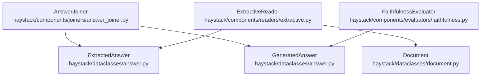
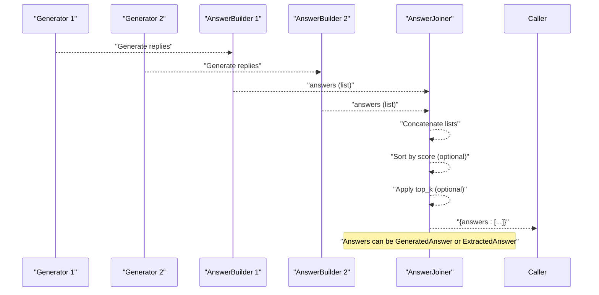
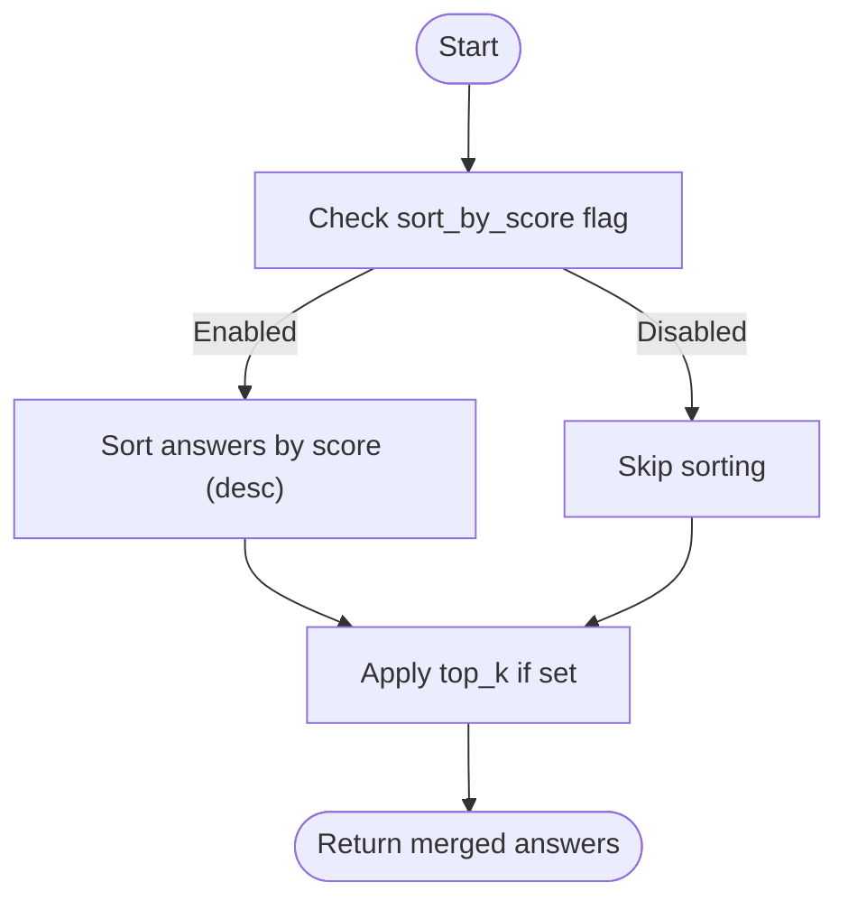
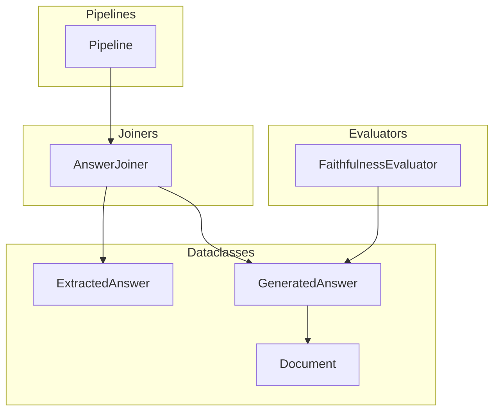

# Answer Joiner API

<cite>
**Referenced Files in This Document**
- [answer_joiner.py](file://haystack/components/joiners/answer_joiner.py)
- [answer.py](file://haystack/dataclasses/answer.py)
- [test_answer_joiner.py](file://test/components/joiners/test_answer_joiner.py)
- [test_pipeline_breakpoints_answer_joiner.py](file://test/core/pipeline/breakpoints/test_pipeline_breakpoints_answer_joiner.py)
- [extractive.py](file://haystack/components/readers/extractive.py)
- [faithfulness.py](file://haystack/components/evaluators/faithfulness.py)
- [document.py](file://haystack/dataclasses/document.py)
</cite>

## Table of Contents
1. [Introduction](#introduction)
2. [Project Structure](#project-structure)
3. [Core Components](#core-components)
4. [Architecture Overview](#architecture-overview)
5. [Detailed Component Analysis](#detailed-component-analysis)
6. [Dependency Analysis](#dependency-analysis)
7. [Performance Considerations](#performance-considerations)
8. [Troubleshooting Guide](#troubleshooting-guide)
9. [Conclusion](#conclusion)
10. [Appendices](#appendices)

## Introduction
This document provides detailed API documentation for the Answer Joiner component. It explains how multiple answer objects are combined, how confidence scores are handled, and how the component participates in pipelines that merge outputs from multiple generators. It focuses on the join() method behavior, input answer object types, merging strategies, conflict handling, and output formatting. It also outlines decision-making for selecting the best answer when multiple responses are provided, including sorting by confidence and limiting results via top_k.

## Project Structure
The Answer Joiner resides in the joiners module and works with answer dataclasses that represent both generated and extracted answers. Tests demonstrate usage in pipelines and confirm behavior across different answer types and configurations.

**Diagram sources**
- [answer_joiner.py](file://haystack/components/joiners/answer_joiner.py#L41-L169)
- [answer.py](file://haystack/dataclasses/answer.py#L30-L139)
- [extractive.py](file://haystack/components/readers/extractive.py#L25-L200)
- [faithfulness.py](file://haystack/components/evaluators/faithfulness.py#L50-L200)
- [document.py](file://haystack/dataclasses/document.py#L46-L190)

**Section sources**
- [answer_joiner.py](file://haystack/components/joiners/answer_joiner.py#L1-L169)
- [answer.py](file://haystack/dataclasses/answer.py#L1-L139)

## Core Components
- AnswerJoiner: Merges multiple lists of Answer objects into a single list. Supports concatenation mode and optional sorting by score and top_k filtering.
- Answer dataclasses:
  - ExtractedAnswer: Represents answers produced by extractive readers; includes a score and optional context/document offsets.
  - GeneratedAnswer: Represents answers produced by generators; includes query, data, and associated documents.

Key capabilities:
- Accepts multiple lists of answers via a variadic input.
- Concatenates lists into a single flat list.
- Optionally sorts by answer score (descending), treating answers without a score as having the lowest priority.
- Limits output to top_k answers when configured.

**Section sources**
- [answer_joiner.py](file://haystack/components/joiners/answer_joiner.py#L41-L169)
- [answer.py](file://haystack/dataclasses/answer.py#L30-L139)

## Architecture Overview
The Answer Joiner integrates into pipelines that produce answers from multiple sources (e.g., multiple generators or readers). It receives answers as separate lists and merges them into one ordered list suitable for downstream consumers.

**Diagram sources**
- [answer_joiner.py](file://haystack/components/joiners/answer_joiner.py#L112-L139)
- [test_pipeline_breakpoints_answer_joiner.py](file://test/core/pipeline/breakpoints/test_pipeline_breakpoints_answer_joiner.py#L27-L84)

## Detailed Component Analysis

### AnswerJoiner API
- Purpose: Merge multiple lists of Answer objects into a single list, with optional sorting and filtering.
- Supported join modes:
  - concatenate: Flattens multiple lists into one.
- Inputs:
  - answers: Variadic list of Answer lists.
  - top_k: Optional override for the instance’s top_k.
- Outputs:
  - answers: Merged list of Answer objects.

Behavior highlights:
- Sorting by score: When enabled, answers are sorted in descending order of score. Answers without a score are treated as having the lowest priority.
- Top-k filtering: Limits the number of returned answers after sorting.
- Answer types: Works with both GeneratedAnswer and ExtractedAnswer.

Usage example references:
- Pipeline usage with multiple generators and AnswerBuilder components is demonstrated in tests.

**Section sources**
- [answer_joiner.py](file://haystack/components/joiners/answer_joiner.py#L41-L169)
- [test_pipeline_breakpoints_answer_joiner.py](file://test/core/pipeline/breakpoints/test_pipeline_breakpoints_answer_joiner.py#L27-L84)

### Answer Types and Confidence Scores
- ExtractedAnswer:
  - Includes a numeric score that reflects confidence or relevance (e.g., from extractive readers).
  - Provides optional context and document offsets for provenance.
- GeneratedAnswer:
  - Contains the generated text and associated documents.
  - May carry auxiliary metadata (e.g., conversation history) that downstream components can interpret.

Confidence aggregation and selection:
- The Answer Joiner relies on the presence of a score attribute for sorting. For ExtractedAnswer, the score is available; for GeneratedAnswer, sorting by score is supported conceptually, though the typical confidence value originates from extractive readers.

**Section sources**
- [answer.py](file://haystack/dataclasses/answer.py#L30-L139)
- [extractive.py](file://haystack/components/readers/extractive.py#L25-L200)

### Merging Strategies and Conflict Handling
- Merging strategy:
  - concatenate: Simply flattens multiple lists into one. There is no deduplication or conflict resolution performed by the Answer Joiner itself.
- Conflicts:
  - No built-in conflict resolution exists. If multiple answers are semantically contradictory, downstream components (e.g., evaluators) should be used to assess quality and select the best answer.
- Quality assessment:
  - FaithfulnessEvaluator can be used to measure how well a generated answer can be inferred from provided contexts. This helps decide the best answer among multiple candidates.

**Section sources**
- [answer_joiner.py](file://haystack/components/joiners/answer_joiner.py#L141-L147)
- [faithfulness.py](file://haystack/components/evaluators/faithfulness.py#L50-L200)

### Decision-Making for Best Answer Selection
- Sorting by score:
  - When sort_by_score is enabled, answers are ordered by score (highest first). This is useful to pick the best candidate when multiple answers are present.
- Limiting results:
  - top_k trims the final list to the requested number of highest-scoring answers.
- External quality metrics:
  - Use evaluators (e.g., FaithfulnessEvaluator) to compute quality scores and choose the best answer based on external criteria.

**Diagram sources**
- [answer_joiner.py](file://haystack/components/joiners/answer_joiner.py#L131-L139)

## Dependency Analysis
- Internal dependencies:
  - Uses Answer dataclasses (ExtractedAnswer, GeneratedAnswer) for input and output.
  - Uses Document for GeneratedAnswer’s associated documents.
- External integration points:
  - Pipelines connect generators/answer builders to AnswerJoiner via named inputs.
  - Evaluators can consume answers produced by AnswerJoiner for quality assessment.

**Diagram sources**
- [answer_joiner.py](file://haystack/components/joiners/answer_joiner.py#L41-L169)
- [answer.py](file://haystack/dataclasses/answer.py#L30-L139)
- [document.py](file://haystack/dataclasses/document.py#L46-L190)
- [faithfulness.py](file://haystack/components/evaluators/faithfulness.py#L50-L200)

**Section sources**
- [answer_joiner.py](file://haystack/components/joiners/answer_joiner.py#L1-L169)
- [answer.py](file://haystack/dataclasses/answer.py#L1-L139)
- [document.py](file://haystack/dataclasses/document.py#L1-L190)
- [faithfulness.py](file://haystack/components/evaluators/faithfulness.py#L1-L200)

## Performance Considerations
- Complexity:
  - Concatenation is linear in the total number of answers across all lists.
  - Sorting adds O(n log n) overhead when enabled.
  - top_k slicing is O(k) after sorting.
- Recommendations:
  - Enable sort_by_score only when answer objects include meaningful scores.
  - Use top_k to reduce downstream processing cost when many answers are produced.

[No sources needed since this section provides general guidance]

## Troubleshooting Guide
Common issues and resolutions:
- Unsupported join mode:
  - Passing an invalid join_mode raises a ValueError. Ensure join_mode is a supported value.
- Empty inputs:
  - Passing empty lists returns an empty answers list.
- Mixed answer types:
  - The component accepts both GeneratedAnswer and ExtractedAnswer. Ensure downstream consumers can handle the mixed types.
- Sorting behavior:
  - Answers without a score are treated as lowest priority. If sorting is unexpected, verify that ExtractedAnswer objects include a score.

**Section sources**
- [answer_joiner.py](file://haystack/components/joiners/answer_joiner.py#L90-L111)
- [test_answer_joiner.py](file://test/components/joiners/test_answer_joiner.py#L63-L103)

## Conclusion
The Answer Joiner provides a straightforward mechanism to merge answers from multiple sources into a single, optionally sorted and filtered list. While it does not perform conflict resolution or confidence aggregation internally, it integrates seamlessly with evaluators and extractive readers to support robust decision-making for selecting the best answer.

[No sources needed since this section summarizes without analyzing specific files]

## Appendices

### API Reference Summary
- Component: AnswerJoiner
- Inputs:
  - answers: Variadic list of Answer lists
  - top_k: Optional override for instance top_k
- Parameters:
  - join_mode: "concatenate" (only supported mode)
  - sort_by_score: Boolean to enable score-based sorting
  - top_k: Integer to limit output count
- Outputs:
  - answers: Single list of Answer objects

Examples and usage patterns:
- Combining answers from multiple generators in a pipeline.
- Verifying behavior with empty inputs, single lists, and mixed answer types.

**Section sources**
- [answer_joiner.py](file://haystack/components/joiners/answer_joiner.py#L87-L139)
- [test_answer_joiner.py](file://test/components/joiners/test_answer_joiner.py#L12-L103)
- [test_pipeline_breakpoints_answer_joiner.py](file://test/core/pipeline/breakpoints/test_pipeline_breakpoints_answer_joiner.py#L27-L84)