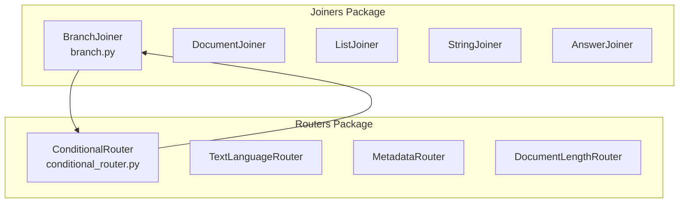
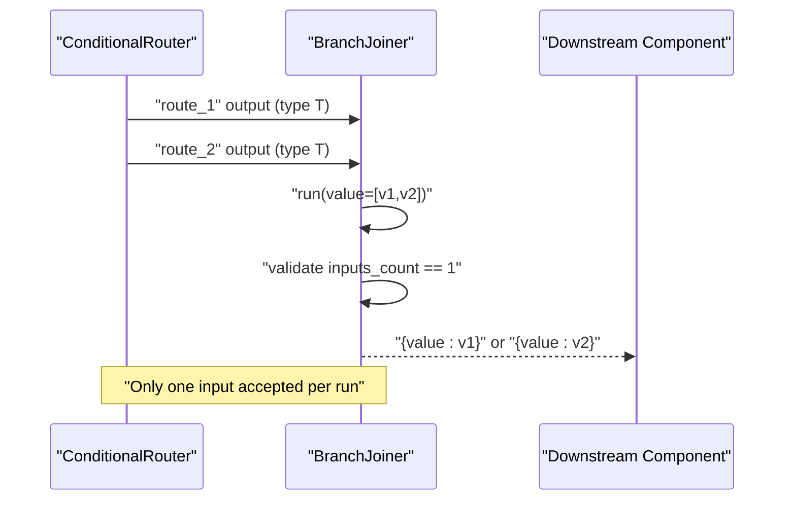
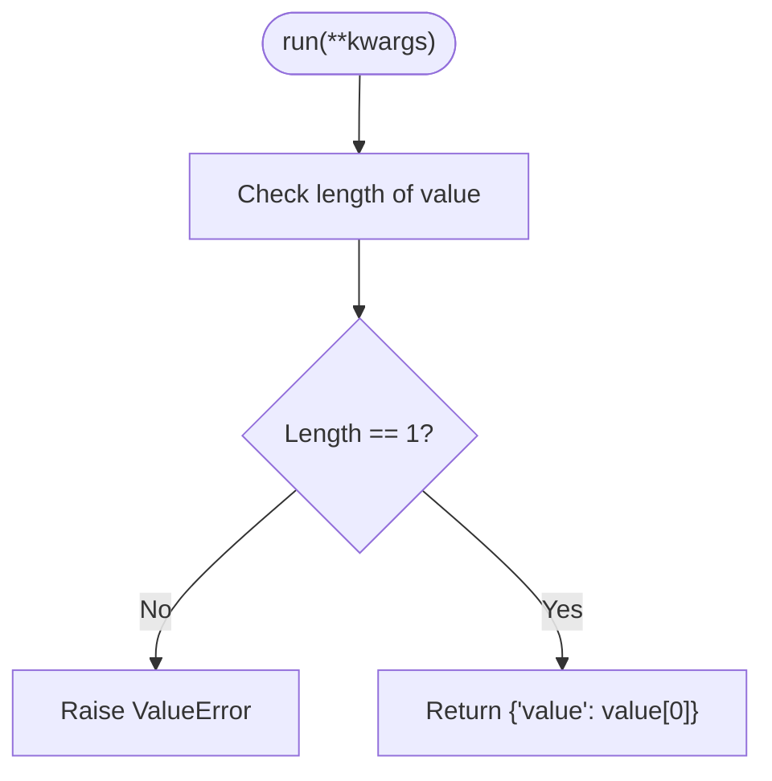
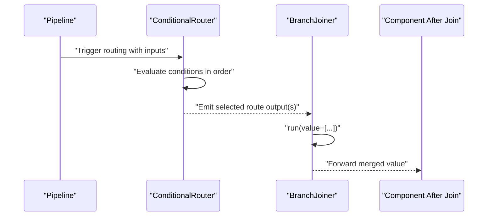
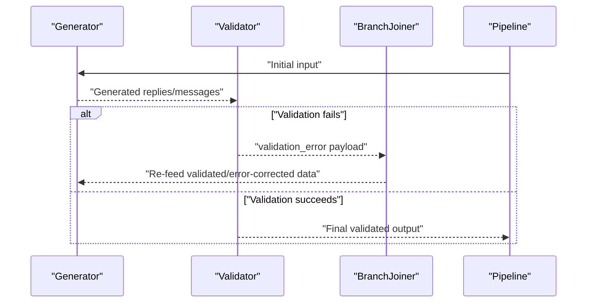
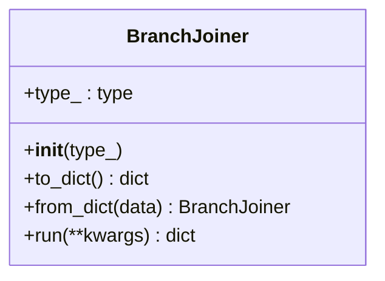
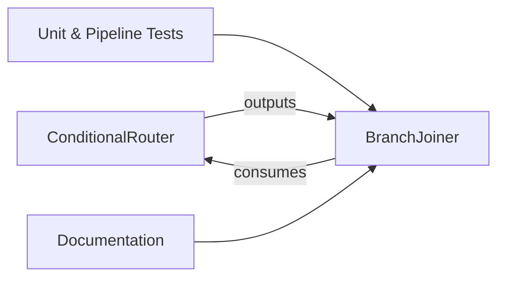

# Branch Joiner API

<cite>
**Referenced Files in This Document**
- [branch.py](file://haystack/components/joiners/branch.py)
- [__init__.py](file://haystack/components/joiners/__init__.py)
- [test_branch_joiner.py](file://test/components/joiners/test_branch_joiner.py)
- [test_pipeline_breakpoints_branch_joiner.py](file://test/core/pipeline/breakpoints/test_pipeline_breakpoints_branch_joiner.py)
- [conditional_router.py](file://haystack/components/routers/conditional_router.py)
- [test_run.py](file://test/core/pipeline/features/test_run.py)
- [branchjoiner.mdx](file://docs-website/versioned_docs/version-2.19/pipeline-components/joiners/branchjoiner.mdx)
- [joiners_api.md](file://docs-website/reference/haystack-api/joiners_api.md)
</cite>

## Table of Contents
1. [Introduction](#introduction)
2. [Project Structure](#project-structure)
3. [Core Components](#core-components)
4. [Architecture Overview](#architecture-overview)
5. [Detailed Component Analysis](#detailed-component-analysis)
6. [Dependency Analysis](#dependency-analysis)
7. [Performance Considerations](#performance-considerations)
8. [Troubleshooting Guide](#troubleshooting-guide)
9. [Conclusion](#conclusion)

## Introduction
This document provides comprehensive API documentation for the Branch Joiner component used to merge multiple pipeline branches into a single output stream. It explains the join() method signature, input parameter specifications, conditional routing integration, and pipeline branching strategies. It also covers branch selection logic, decision-making algorithms, and practical examples of implementing conditional logic and managing branch-specific data.

## Project Structure
The Branch Joiner resides in the joiners package alongside other joiner components. It integrates with router components (notably ConditionalRouter) to support conditional branching and merging in pipelines.

**Diagram sources**
- [branch.py](file://haystack/components/joiners/branch.py#L1-L130)
- [conditional_router.py](file://haystack/components/routers/conditional_router.py#L37-L119)

**Section sources**
- [__init__.py](file://haystack/components/joiners/__init__.py#L10-L26)

## Core Components
- BranchJoiner: Merges multiple input branches into a single output by forwarding the first available input value. It enforces that exactly one input is provided per run and preserves the declared type for both input and output.
- ConditionalRouter: Selects a routing path based on Jinja2 conditions and emits named outputs. These outputs can be connected to BranchJoiner to merge multiple conditional branches.

Key characteristics:
- Type safety: The component is configured with a single data type at initialization, constraining both inputs and outputs to that type.
- Variadic input: Accepts a variadic list of values from upstream components.
- Single-output policy: Always returns exactly one value in the output dictionary under the key "value".

**Section sources**
- [branch.py](file://haystack/components/joiners/branch.py#L88-L129)
- [conditional_router.py](file://haystack/components/routers/conditional_router.py#L306-L375)

## Architecture Overview
The Branch Joiner sits at the convergence point of conditional branches. Typical flows:
- Decision-based merging: Multiple conditional routes emit distinct outputs; BranchJoiner consolidates them into a unified stream.
- Loop handling: Validation or error-handling branches feed back into BranchJoiner to rerun processing until a valid state is reached.

**Diagram sources**
- [conditional_router.py](file://haystack/components/routers/conditional_router.py#L306-L375)
- [branch.py](file://haystack/components/joiners/branch.py#L119-L129)

## Detailed Component Analysis

### BranchJoiner API Reference
- Initialization
  - type_: The expected data type for inputs and outputs. Declares both input and output type constraints.
- Inputs
  - value: A variadic list of items of type T. The component expects exactly one item per run; otherwise, it raises an error.
- Outputs
  - value: A single item of type T, taken from the first element of the input list.

Behavioral rules:
- Exactly one input is required. If zero or more than one input is provided, a ValueError is raised.
- The returned value is the first element of the input list.

**Diagram sources**
- [branch.py](file://haystack/components/joiners/branch.py#L119-L129)

**Section sources**
- [branch.py](file://haystack/components/joiners/branch.py#L88-L129)
- [test_branch_joiner.py](file://test/components/joiners/test_branch_joiner.py#L11-L36)

### Conditional Routing Integration
- ConditionalRouter defines routes with conditions, outputs, output types, and output names. Each route can produce one or multiple outputs.
- Outputs are emitted under the specified output_name and can be connected to BranchJoiner inputs via the "value" key.
- BranchJoiner enforces that only one input is received per run, ensuring deterministic merging after conditional branching.

**Diagram sources**
- [conditional_router.py](file://haystack/components/routers/conditional_router.py#L306-L375)
- [branch.py](file://haystack/components/joiners/branch.py#L119-L129)

**Section sources**
- [conditional_router.py](file://haystack/components/routers/conditional_router.py#L37-L119)
- [test_run.py](file://test/core/pipeline/features/test_run.py#L4686-L4717)

### Loop Handling Pattern
BranchJoiner supports looped pipelines where validation or error-handling branches feed back into the joiner to retry processing. This pattern is commonly used with validators and generators to enforce schema compliance iteratively.

**Diagram sources**
- [test_pipeline_breakpoints_branch_joiner.py](file://test/core/pipeline/breakpoints/test_pipeline_breakpoints_branch_joiner.py#L47-L58)
- [branch.py](file://haystack/components/joiners/branch.py#L119-L129)

**Section sources**
- [test_pipeline_breakpoints_branch_joiner.py](file://test/core/pipeline/breakpoints/test_pipeline_breakpoints_branch_joiner.py#L32-L91)
- [joiners_api.md](file://docs-website/reference/haystack-api/joiners_api.md#L141-L154)

### Class Model

**Diagram sources**
- [branch.py](file://haystack/components/joiners/branch.py#L88-L129)

## Dependency Analysis
- BranchJoiner depends on the component framework for input/output type declaration and serialization.
- ConditionalRouter supplies conditional outputs that BranchJoiner consumes.
- Tests validate behavior under normal operation, error conditions, and pipeline integration.

**Diagram sources**
- [conditional_router.py](file://haystack/components/routers/conditional_router.py#L306-L375)
- [branch.py](file://haystack/components/joiners/branch.py#L119-L129)
- [test_branch_joiner.py](file://test/components/joiners/test_branch_joiner.py#L11-L36)
- [test_run.py](file://test/core/pipeline/features/test_run.py#L4686-L4717)

**Section sources**
- [__init__.py](file://haystack/components/joiners/__init__.py#L10-L26)
- [test_run.py](file://test/core/pipeline/features/test_run.py#L4686-L4717)

## Performance Considerations
- Single-input constraint: Enforcing exactly one input per run ensures predictable merging and avoids ambiguity in multi-branch scenarios.
- Type declaration: Specifying the type at initialization enables efficient type handling and reduces runtime checks elsewhere.
- Variadic input overhead: While flexible, variadic inputs require list construction; keep the number of upstream branches reasonable to minimize overhead.

## Troubleshooting Guide
Common issues and resolutions:
- Too many inputs: If more than one input is provided, BranchJoiner raises a ValueError. Ensure only one upstream branch feeds into the joiner per run.
- No inputs: If no inputs are provided, BranchJoiner raises a ValueError. Verify that at least one upstream component is connected.
- Type mismatches: BranchJoiner does not enforce runtime type checking; ensure upstream components conform to the declared type to avoid downstream errors.

Operational tips:
- Use ConditionalRouter to guarantee a single active output per iteration, aligning with BranchJoiner’s single-input requirement.
- For looped pipelines, ensure feedback paths are correctly wired so that validation failures re-enter the joiner.

**Section sources**
- [test_branch_joiner.py](file://test/components/joiners/test_branch_joiner.py#L28-L36)
- [branch.py](file://haystack/components/joiners/branch.py#L119-L129)

## Conclusion
The Branch Joiner provides a simple yet powerful mechanism to merge conditional branches and handle loops in pipelines. By enforcing a single input per run and preserving a declared type, it ensures deterministic behavior and seamless integration with conditional routers. Proper use of ConditionalRouter and careful pipeline design enables robust conditional logic, dynamic branching, and iterative processing flows.