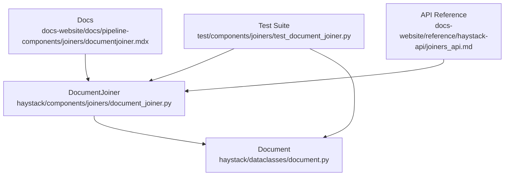
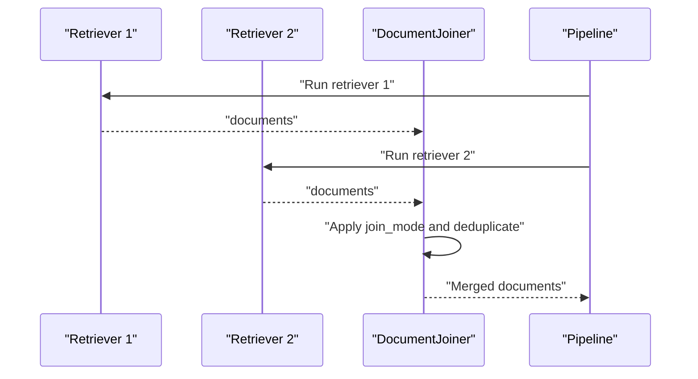
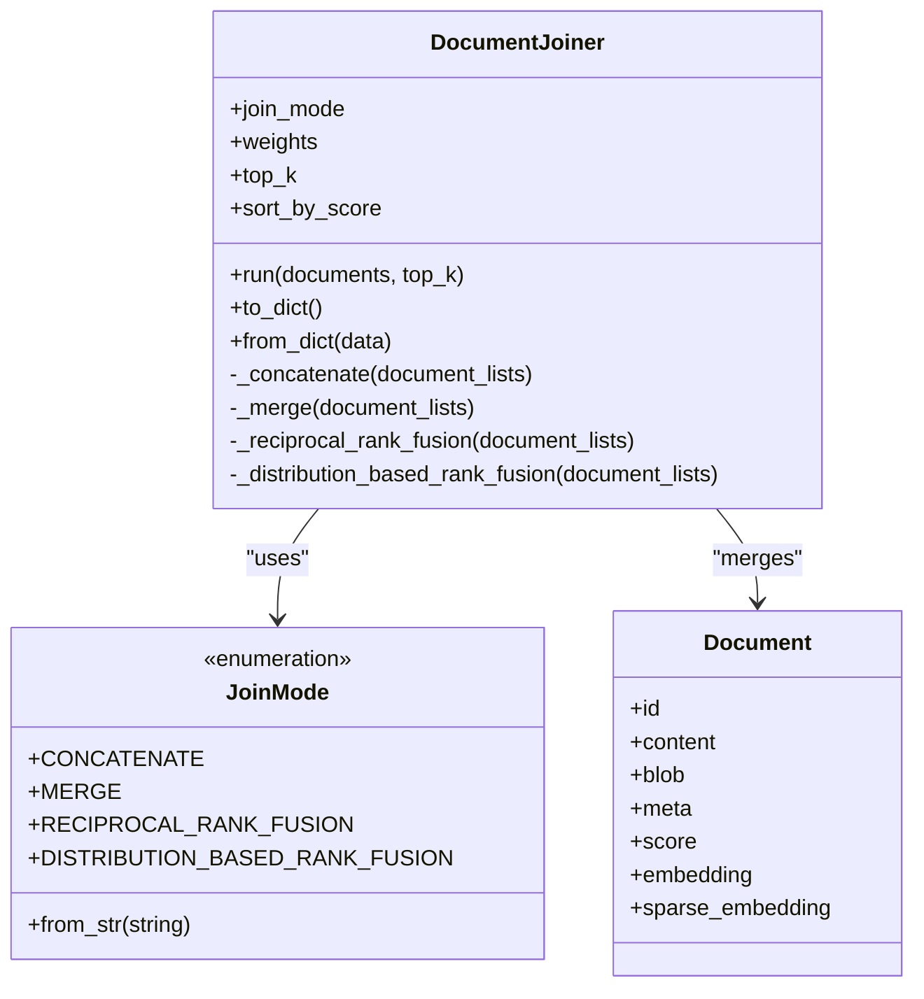
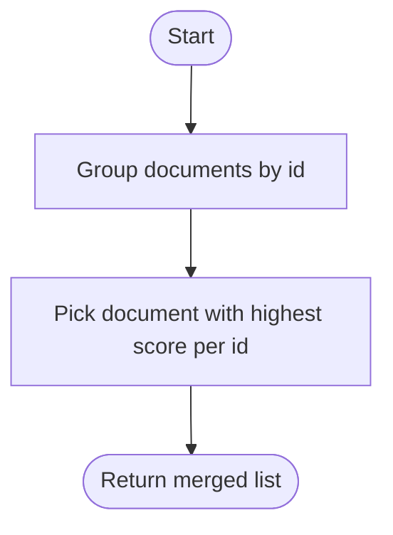
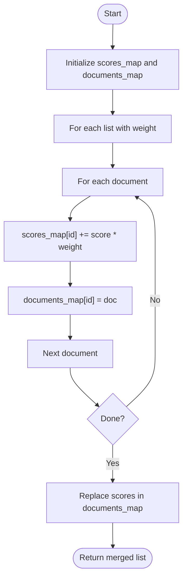
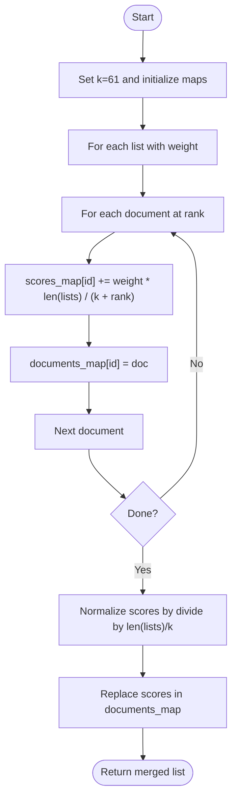
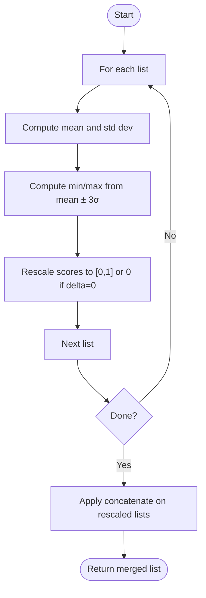
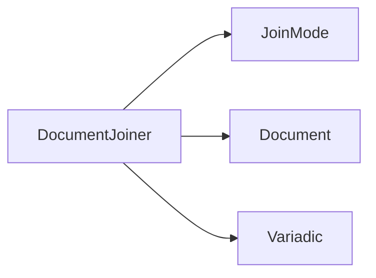

# Document Joiner API

<cite>
**Referenced Files in This Document**
- [document_joiner.py](file://haystack/components/joiners/document_joiner.py)
- [document.py](file://haystack/dataclasses/document.py)
- [test_document_joiner.py](file://test/components/joiners/test_document_joiner.py)
- [documentjoiner.mdx](file://docs-website/docs/pipeline-components/joiners/documentjoiner.mdx)
- [joiners_api.md](file://docs-website/reference/haystack-api/joiners_api.md)
</cite>

## Table of Contents
1. [Introduction](#introduction)
2. [Project Structure](#project-structure)
3. [Core Components](#core-components)
4. [Architecture Overview](#architecture-overview)
5. [Detailed Component Analysis](#detailed-component-analysis)
6. [Dependency Analysis](#dependency-analysis)
7. [Performance Considerations](#performance-considerations)
8. [Troubleshooting Guide](#troubleshooting-guide)
9. [Conclusion](#conclusion)
10. [Appendices](#appendices)

## Introduction
This document provides comprehensive API documentation for the Document Joiner component used to merge and fuse results from multiple retrievers or indexing stages. It explains the join modes, duplicate removal strategies, score combination methods, and metadata handling. It also documents the join() method signature, input parameter specifications, merging criteria options, and output document formatting. Practical examples demonstrate combining results from multiple retrievers, handling document overlaps, and managing document scores during fusion.

## Project Structure
The Document Joiner resides in the joiners module and integrates with the Document dataclass. Tests validate behavior across join modes and edge cases. Documentation includes both conceptual guides and API reference material.

**Diagram sources**
- [document_joiner.py](file://haystack/components/joiners/document_joiner.py#L44-L284)
- [document.py](file://haystack/dataclasses/document.py#L47-L190)
- [test_document_joiner.py](file://test/components/joiners/test_document_joiner.py#L1-L313)
- [documentjoiner.mdx](file://docs-website/docs/pipeline-components/joiners/documentjoiner.mdx#L1-L192)
- [joiners_api.md](file://docs-website/reference/haystack-api/joiners_api.md#L269-L401)

**Section sources**
- [document_joiner.py](file://haystack/components/joiners/document_joiner.py#L44-L284)
- [document.py](file://haystack/dataclasses/document.py#L47-L190)
- [test_document_joiner.py](file://test/components/joiners/test_document_joiner.py#L1-L313)
- [documentjoiner.mdx](file://docs-website/docs/pipeline-components/joiners/documentjoiner.mdx#L1-L192)
- [joiners_api.md](file://docs-website/reference/haystack-api/joiners_api.md#L269-L401)

## Core Components
- DocumentJoiner: A component that merges multiple lists of Documents according to a selected join mode. Supports:
  - concatenate: Keeps the highest-scored document among duplicates.
  - merge: Computes a weighted sum of scores for duplicates.
  - reciprocal_rank_fusion: Scores based on reciprocal rank fusion with normalization.
  - distribution_based_rank_fusion: Normalizes scores across retrievers and selects the best score per document.
- Document: The dataclass representing documents with fields such as id, content, meta, score, embedding, and sparse_embedding.

Key behaviors:
- Duplicate detection uses document id.
- Sorting by score is configurable and treats missing scores as negative infinity.
- top_k truncation can be applied globally or per-run.

**Section sources**
- [document_joiner.py](file://haystack/components/joiners/document_joiner.py#L44-L128)
- [document.py](file://haystack/dataclasses/document.py#L47-L71)

## Architecture Overview
The Document Joiner sits in pipelines after multiple retrievers or converters. It consumes variadic lists of documents and emits a single merged list. The chosen join mode determines how duplicates are handled and how scores are computed.

**Diagram sources**
- [document_joiner.py](file://haystack/components/joiners/document_joiner.py#L129-L161)
- [documentjoiner.mdx](file://docs-website/docs/pipeline-components/joiners/documentjoiner.mdx#L59-L97)

## Detailed Component Analysis

### DocumentJoiner Class
The DocumentJoiner class encapsulates the merging logic and exposes a run() method. It supports four join modes via an internal dispatch mechanism.

**Diagram sources**
- [document_joiner.py](file://haystack/components/joiners/document_joiner.py#L18-L128)
- [document_joiner.py](file://haystack/components/joiners/document_joiner.py#L129-L284)
- [document.py](file://haystack/dataclasses/document.py#L47-L71)

**Section sources**
- [document_joiner.py](file://haystack/components/joiners/document_joiner.py#L44-L128)
- [document_joiner.py](file://haystack/components/joiners/document_joiner.py#L129-L284)

### Join Modes and Algorithms

#### concatenate
- Purpose: Combine lists and keep the highest-scored document among duplicates.
- Behavior:
  - Groups documents by id.
  - Selects the document with the highest score per id.
  - Preserves metadata from the selected document.
- Complexity: O(N) for N total documents across all lists.

**Diagram sources**
- [document_joiner.py](file://haystack/components/joiners/document_joiner.py#L163-L175)

**Section sources**
- [document_joiner.py](file://haystack/components/joiners/document_joiner.py#L163-L175)

#### merge
- Purpose: Merge scores of duplicates using weights.
- Behavior:
  - Computes weighted sum of scores per document id.
  - Uses provided weights or normalizes uniform weights.
  - Replaces each document’s score with the merged score.
- Complexity: O(N) for N total documents.

**Diagram sources**
- [document_joiner.py](file://haystack/components/joiners/document_joiner.py#L177-L194)

**Section sources**
- [document_joiner.py](file://haystack/components/joiners/document_joiner.py#L177-L194)

#### reciprocal_rank_fusion
- Purpose: Fuse documents by reciprocal rank with normalization.
- Behavior:
  - Uses a constant k=61 and computes weighted reciprocal rank per position.
  - Normalizes scores by dividing by len(results)/k to keep scores in [0,1].
  - Handles empty inputs gracefully.
- Complexity: O(N) for N total documents.

**Diagram sources**
- [document_joiner.py](file://haystack/components/joiners/document_joiner.py#L196-L224)

**Section sources**
- [document_joiner.py](file://haystack/components/joiners/document_joiner.py#L196-L224)

#### distribution_based_rank_fusion
- Purpose: Normalize scores across retrievers and select the best score per document.
- Behavior:
  - For each list, compute mean and standard deviation of scores.
  - Rescale scores to [0,1] using min/max derived from mean ± 3σ.
  - If all scores are equal, set normalized scores to 0.
  - Apply concatenate to the rescaled lists.
- Complexity: O(N) for N total documents plus O(L) per list for statistics computation.

**Diagram sources**
- [document_joiner.py](file://haystack/components/joiners/document_joiner.py#L226-L256)

**Section sources**
- [document_joiner.py](file://haystack/components/joiners/document_joiner.py#L226-L256)

### Method Signatures and Parameters

#### Constructor
- Parameters:
  - join_mode: str or JoinMode. Defaults to concatenate.
  - weights: list[float] | None. Must match the number of input lists for modes that use weights.
  - top_k: int | None. Global truncation limit.
  - sort_by_score: bool. Sort by score descending; documents with None score are treated as -infinity.
- Behavior:
  - Validates join_mode string against supported modes.
  - Normalizes weights if provided.

**Section sources**
- [document_joiner.py](file://haystack/components/joiners/document_joiner.py#L87-L128)
- [joiners_api.md](file://docs-website/reference/haystack-api/joiners_api.md#L327-L354)

#### run()
- Parameters:
  - documents: Variadic[list[Document]]. Multiple lists of documents to merge.
  - top_k: int | None. Overrides instance top_k for this run.
- Returns:
  - dict with key "documents" containing the merged list.

Processing steps:
1. Dispatch to the selected join mode function.
2. Optionally sort by score (descending), treating None as -infinity.
3. Apply top_k truncation if specified.

**Section sources**
- [document_joiner.py](file://haystack/components/joiners/document_joiner.py#L129-L161)
- [joiners_api.md](file://docs-website/reference/haystack-api/joiners_api.md#L356-L372)

### Output Document Formatting
- Each output document preserves:
  - id, content, blob, meta, embedding, sparse_embedding.
- score is replaced according to the join mode:
  - concatenate: highest score among duplicates.
  - merge: weighted sum of scores.
  - reciprocal_rank_fusion: fused score normalized to [0,1].
  - distribution_based_rank_fusion: rescaled score from the best list after normalization.
- Metadata is preserved from the selected representative document in concatenate and from the rescaled list in distribution-based fusion.

**Section sources**
- [document_joiner.py](file://haystack/components/joiners/document_joiner.py#L163-L256)
- [document.py](file://haystack/dataclasses/document.py#L47-L71)

### Examples and Usage Patterns

#### Combining Results from Multiple Retrievers
- Typical hybrid retrieval pipeline connects multiple retrievers to a single DocumentJoiner. The joiner merges results and returns a unified list, often sorted by score.

References:
- [documentjoiner.mdx](file://docs-website/docs/pipeline-components/joiners/documentjoiner.mdx#L61-L97)

#### Handling Document Overlaps
- concatenate keeps the highest-scoring duplicate.
- merge combines scores using weights.
- reciprocal_rank_fusion rewards documents appearing early in multiple lists.
- distribution_based_rank_fusion normalizes scores across retrievers before selecting the best.

References:
- [test_document_joiner.py](file://test/components/joiners/test_document_joiner.py#L135-L220)

#### Managing Document Scores During Fusion
- weights influence merge and reciprocal_rank_fusion.
- sort_by_score controls ordering; documents without scores are placed last.
- top_k limits output size globally or per-run.

References:
- [document_joiner.py](file://haystack/components/joiners/document_joiner.py#L87-L128)
- [document_joiner.py](file://haystack/components/joiners/document_joiner.py#L129-L161)
- [test_document_joiner.py](file://test/components/joiners/test_document_joiner.py#L251-L273)

## Dependency Analysis
- Internal dependencies:
  - Uses the Document dataclass for input/output.
  - Uses Variadic for variadic inputs.
  - Uses Enum for join_mode selection.
- External dependencies:
  - No external libraries are imported; relies on built-in Python constructs and Haystack core types.

**Diagram sources**
- [document_joiner.py](file://haystack/components/joiners/document_joiner.py#L18-L13)
- [document.py](file://haystack/dataclasses/document.py#L47-L71)

**Section sources**
- [document_joiner.py](file://haystack/components/joiners/document_joiner.py#L18-L13)
- [document.py](file://haystack/dataclasses/document.py#L47-L71)

## Performance Considerations
- Time complexity:
  - concatenate: O(N) to group and select best scores.
  - merge: O(N) to accumulate weighted scores.
  - reciprocal_rank_fusion: O(N) with constant-time per rank.
  - distribution_based_rank_fusion: O(N) plus O(L) per list for statistics.
- Space complexity:
  - O(U) where U is the number of unique ids (merged documents).
- Sorting cost:
  - Optional O(M log M) where M is the number of merged documents if sort_by_score is enabled.
- Truncation cost:
  - O(T) where T is the top_k threshold.

Recommendations:
- Prefer concatenate when preserving metadata and avoiding score recomputation.
- Use merge when you need weighted score aggregation from multiple sources.
- Use reciprocal_rank_fusion for robust early-rank fusion across heterogeneous retrievers.
- Use distribution_based_rank_fusion when retrievers use different score distributions and you want normalized comparisons.

[No sources needed since this section provides general guidance]

## Troubleshooting Guide
Common issues and resolutions:
- Unsupported join_mode:
  - Symptom: ValueError indicating unknown join mode.
  - Resolution: Use one of the supported modes: concatenate, merge, reciprocal_rank_fusion, distribution_based_rank_fusion.
- Weights mismatch:
  - Symptom: Incorrect number of weights for the number of input lists.
  - Resolution: Ensure weights length equals the number of input lists for modes that use weights.
- Empty inputs:
  - Symptom: Empty output list.
  - Resolution: Expected behavior; DocumentJoiner handles empty or partially empty inputs gracefully.
- Sorting with None scores:
  - Symptom: Documents without scores appear last after sorting.
  - Resolution: This is by design; documents with None score are treated as -infinity during sorting.

**Section sources**
- [document_joiner.py](file://haystack/components/joiners/document_joiner.py#L31-L41)
- [document_joiner.py](file://haystack/components/joiners/document_joiner.py#L146-L154)
- [test_document_joiner.py](file://test/components/joiners/test_document_joiner.py#L111-L118)
- [test_document_joiner.py](file://test/components/joiners/test_document_joiner.py#L73-L90)

## Conclusion
The Document Joiner provides flexible strategies to merge and fuse documents from multiple sources. Choose concatenate for simplicity, merge for weighted score aggregation, reciprocal_rank_fusion for robust early-rank fusion, or distribution_based_rank_fusion for normalized comparisons across heterogeneous retrievers. Properly configure weights, top_k, and sorting to achieve desired ranking outcomes.

[No sources needed since this section summarizes without analyzing specific files]

## Appendices

### API Reference Summary
- Constructor parameters:
  - join_mode: str or JoinMode
  - weights: list[float] | None
  - top_k: int | None
  - sort_by_score: bool
- run() parameters:
  - documents: Variadic[list[Document]]
  - top_k: int | None
- Returns:
  - dict with key "documents" containing the merged list

**Section sources**
- [joiners_api.md](file://docs-website/reference/haystack-api/joiners_api.md#L327-L372)