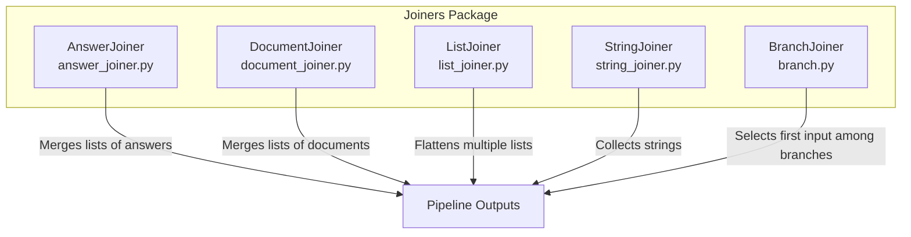
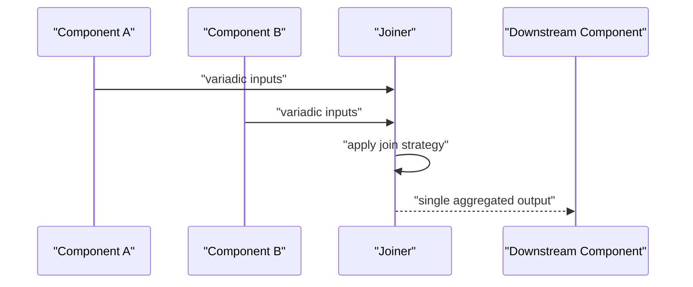
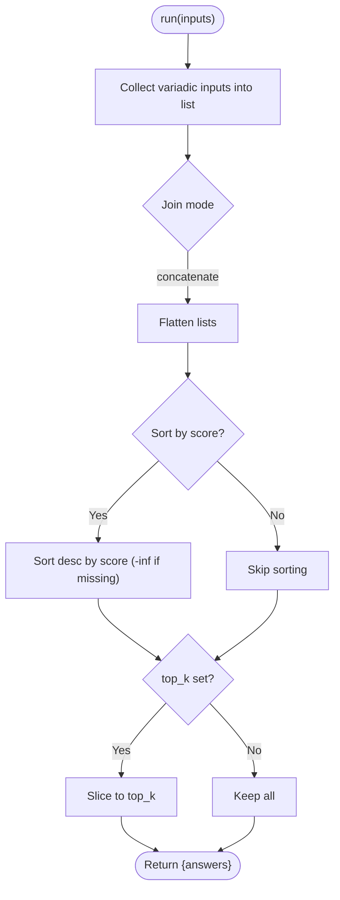
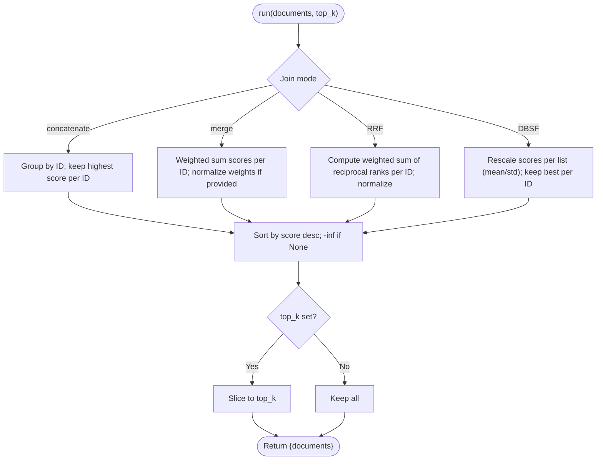
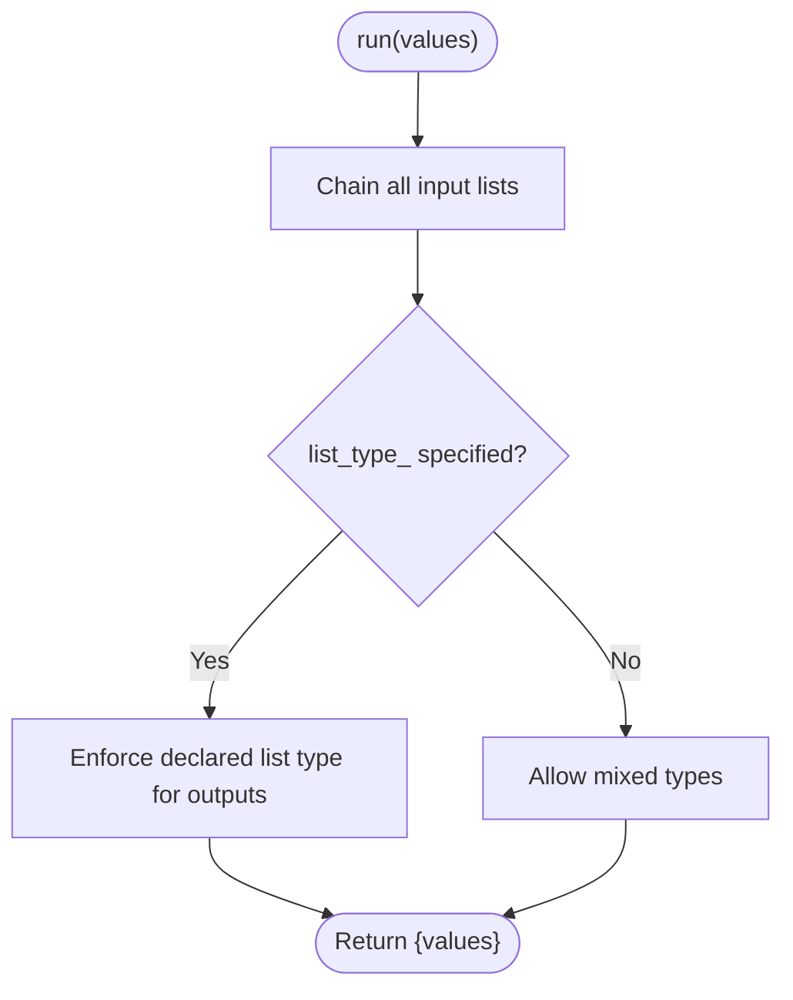
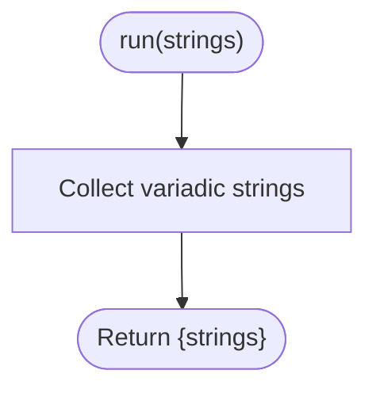
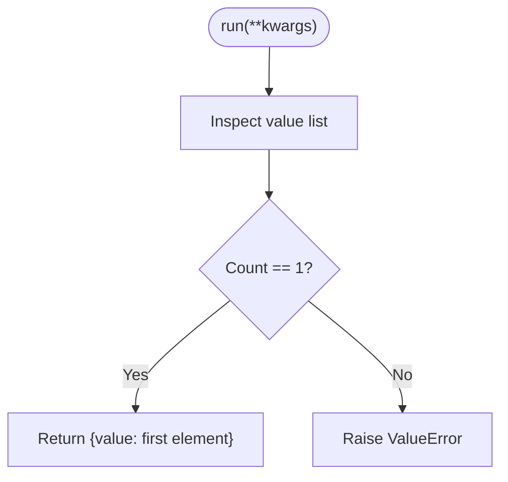
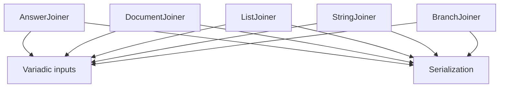

# Joiner APIs

<cite>
**Referenced Files in This Document**
- [answer_joiner.py](file://haystack/components/joiners/answer_joiner.py)
- [document_joiner.py](file://haystack/components/joiners/document_joiner.py)
- [list_joiner.py](file://haystack/components/joiners/list_joiner.py)
- [string_joiner.py](file://haystack/components/joiners/string_joiner.py)
- [branch.py](file://haystack/components/joiners/branch.py)
- [joiners_api.yml](file://pydoc/joiners_api.yml)
- [test_answer_joiner.py](file://test/components/joiners/test_answer_joiner.py)
- [test_document_joiner.py](file://test/components/joiners/test_document_joiner.py)
- [test_list_joiner.py](file://test/components/joiners/test_list_joiner.py)
- [test_string_joiner.py](file://test/components/joiners/test_string_joiner.py)
- [test_branch_joiner.py](file://test/components/joiners/test_branch_joiner.py)
</cite>

## Table of Contents
1. [Introduction](#introduction)
2. [Project Structure](#project-structure)
3. [Core Components](#core-components)
4. [Architecture Overview](#architecture-overview)
5. [Detailed Component Analysis](#detailed-component-analysis)
6. [Dependency Analysis](#dependency-analysis)
7. [Performance Considerations](#performance-considerations)
8. [Troubleshooting Guide](#troubleshooting-guide)
9. [Conclusion](#conclusion)
10. [Appendices](#appendices)

## Introduction
This document provides comprehensive API documentation for Haystack Joiner components. It covers result combination APIs for:
- Document joiners
- Answer joiners
- List joiners
- String joiners
- Branch joiner

It details merging strategies, duplicate handling, score combination methods, and output formatting. It also includes method signatures, parameter specifications, result aggregation patterns, examples for pipeline result combination and multi-source data integration, and guidance for developing custom joiners. Finally, it documents branch joiner functionality and conditional joining patterns.

## Project Structure
The joiner components live under the joiners package and expose a consistent pattern:
- Each component is decorated with the component decorator and defines a run method that accepts variadic inputs and returns a dictionary with a typed output key.
- Serialization support via to_dict/from_dict enables persistence and reconstruction of components.
- Tests validate behavior across join modes, parameter combinations, and pipeline integration.

**Diagram sources**
- [answer_joiner.py](file://haystack/components/joiners/answer_joiner.py#L41-L169)
- [document_joiner.py](file://haystack/components/joiners/document_joiner.py#L44-L284)
- [list_joiner.py](file://haystack/components/joiners/list_joiner.py#L13-L113)
- [string_joiner.py](file://haystack/components/joiners/string_joiner.py#L10-L57)
- [branch.py](file://haystack/components/joiners/branch.py#L12-L130)

**Section sources**
- [joiners_api.yml](file://pydoc/joiners_api.yml#L1-L13)

## Core Components
This section summarizes the primary joiner components, their purpose, and shared patterns.

- AnswerJoiner: Merges multiple lists of answers into a single list. Supports concatenation and optional sorting by score and top-k selection.
- DocumentJoiner: Merges multiple lists of documents with multiple strategies: concatenate, merge, reciprocal rank fusion, and distribution-based rank fusion. Handles duplicates and optional sorting by score and top-k selection.
- ListJoiner: Flattens multiple lists of the same or mixed types into a single flat list. Optionally enforces a uniform list type for stricter typing.
- StringJoiner: Collects strings from different components into a list of strings.
- BranchJoiner: Merges multiple input branches into a single output stream by forwarding the first received value. Useful for loop handling and conditional merging.

Key shared patterns:
- Inputs are variadic and collected into a list for processing.
- Outputs are returned as a dictionary with a typed key (e.g., documents, answers, strings, values, value).
- Optional top_k selection and sorting by score are supported in several components.
- Serialization via to_dict/from_dict preserves component configuration.

**Section sources**
- [answer_joiner.py](file://haystack/components/joiners/answer_joiner.py#L41-L169)
- [document_joiner.py](file://haystack/components/joiners/document_joiner.py#L44-L284)
- [list_joiner.py](file://haystack/components/joiners/list_joiner.py#L13-L113)
- [string_joiner.py](file://haystack/components/joiners/string_joiner.py#L10-L57)
- [branch.py](file://haystack/components/joiners/branch.py#L12-L130)

## Architecture Overview
The joiners participate in pipelines as nodes that consume variadic inputs and produce a single aggregated output. They integrate with other components through the pipeline’s connect mechanism.

[No sources needed since this diagram shows conceptual workflow, not actual code structure]

## Detailed Component Analysis

### AnswerJoiner
Purpose:
- Combine multiple lists of answers into a single list.
- Current mode: concatenate lists; optional sorting by score and top-k selection.

Parameters:
- join_mode: Accepts a string or enum value; currently supports concatenate.
- top_k: Maximum number of answers to return; overrides instance setting when provided to run.
- sort_by_score: Sorts answers by score descending; documents without scores are treated as -infinity.

Behavior:
- Concatenates nested lists of answers.
- Applies optional sorting and slicing by top_k.

Outputs:
- Dictionary with a key for the merged list of answers.

Usage notes:
- Supports both generated and extracted answers.
- Unknown join modes raise an error.

**Diagram sources**
- [answer_joiner.py](file://haystack/components/joiners/answer_joiner.py#L112-L139)

Method signature summary:
- run(self, answers: Variadic[list[AnswerType]], top_k: int | None = None) -> dict[str, list[AnswerType]]

Parameter specifications:
- join_mode: string or enum; supported values are defined by the component.
- top_k: integer; restricts output size.
- sort_by_score: boolean; controls ordering by score.

Output formatting:
- Single key “answers” mapping to the merged list.

Examples:
- Pipeline combining answers from multiple LLMs and builders.

**Section sources**
- [answer_joiner.py](file://haystack/components/joiners/answer_joiner.py#L41-L169)
- [test_answer_joiner.py](file://test/components/joiners/test_answer_joiner.py#L12-L103)

### DocumentJoiner
Purpose:
- Merge multiple lists of documents using configurable strategies.

Join modes:
- concatenate: Keeps the highest-scored document for duplicates; otherwise concatenates.
- merge: Computes a weighted sum of scores for duplicates; weights normalized if not provided.
- reciprocal_rank_fusion (RRF): Scores computed as a weighted sum of reciprocal ranks; normalization applied.
- distribution_based_rank_fusion (DBSF): Rescales scores per list using mean and std, then picks best per ID.

Parameters:
- join_mode: One of the supported modes.
- weights: Optional list of weights; length must match number of input lists; normalized internally if provided.
- top_k: Limits output size.
- sort_by_score: Sorts by score descending; documents without scores are treated as -infinity.

Behavior:
- Applies selected join mode to merge lists.
- Sorts by score if enabled.
- Applies top_k limit.

Outputs:
- Dictionary with a key for the merged list of documents.

Duplicate handling:
- concatenate: Picks the highest-scoring duplicate.
- merge: Sums weighted scores per duplicate.
- RRF: Aggregates reciprocal rank scores per duplicate.
- DBSF: Rescales per-list scores and picks best per ID.

Score combination methods:
- merge: Weighted sum of scores.
- RRF: Weighted sum of w * L/(k+rank) normalized by L/k.
- DBSF: Per-list z-score scaling then pick best.

**Diagram sources**
- [document_joiner.py](file://haystack/components/joiners/document_joiner.py#L129-L161)
- [document_joiner.py](file://haystack/components/joiners/document_joiner.py#L163-L256)

Method signature summary:
- run(self, documents: Variadic[list[Document]], top_k: int | None = None) -> dict[str, list[Document]]

Parameter specifications:
- join_mode: string or enum; supported values are defined by the component.
- weights: list of floats; optional.
- top_k: integer; restricts output size.
- sort_by_score: boolean; controls ordering by score.

Output formatting:
- Single key “documents” mapping to the merged list.

Examples:
- Hybrid retrieval pipeline merging BM25 and embedding retriever results.

**Section sources**
- [document_joiner.py](file://haystack/components/joiners/document_joiner.py#L44-L284)
- [test_document_joiner.py](file://test/components/joiners/test_document_joiner.py#L14-L313)

### ListJoiner
Purpose:
- Flatten multiple lists of the same or mixed types into a single flat list.

Parameters:
- list_type_: Optional; if provided, enforces that all inputs conform to the specified list type; otherwise, accepts mixed types.

Behavior:
- Concatenates all input lists in order.
- If list_type_ is specified, downstream connections must match the declared type.

Outputs:
- Dictionary with a key for the flattened list.

**Diagram sources**
- [list_joiner.py](file://haystack/components/joiners/list_joiner.py#L104-L112)

Method signature summary:
- run(self, values: Variadic[list[Any]]) -> dict[str, list[Any]]

Parameter specifications:
- list_type_: Optional type annotation for enforced typing.

Output formatting:
- Single key “values” mapping to the flattened list.

Examples:
- Combining prompts and replies into a single list for further processing.

**Section sources**
- [list_joiner.py](file://haystack/components/joiners/list_joiner.py#L13-L113)
- [test_list_joiner.py](file://test/components/joiners/test_list_joiner.py#L20-L173)

### StringJoiner
Purpose:
- Aggregate strings from different components into a list of strings.

Behavior:
- Collects all inputs into a list.

Outputs:
- Dictionary with a key for the list of strings.

**Diagram sources**
- [string_joiner.py](file://haystack/components/joiners/string_joiner.py#L42-L56)

Method signature summary:
- run(self, strings: Variadic[str]) -> dict[str, list[str]]

Output formatting:
- Single key “strings” mapping to the list of strings.

Examples:
- Combining multiple prompt templates into a single list for downstream processing.

**Section sources**
- [string_joiner.py](file://haystack/components/joiners/string_joiner.py#L10-L57)
- [test_string_joiner.py](file://test/components/joiners/test_string_joiner.py#L9-L38)

### BranchJoiner
Purpose:
- Merge multiple input branches of a pipeline into a single output stream by forwarding the first received value.
- Useful for loop handling and reconciling outputs from conditional routers.

Behavior:
- Expects exactly one input; raises an error if zero or more than one input is provided.
- Returns a dictionary with a single key “value” containing the first input.

Notes:
- BranchJoiner operates on a single data type; the type is declared at initialization and constrains both inputs and outputs.

**Diagram sources**
- [branch.py](file://haystack/components/joiners/branch.py#L119-L129)

Method signature summary:
- run(self, **kwargs) -> dict[str, Any] (expects a single key “value” with a list of one element)

Output formatting:
- Single key “value” mapping to the forwarded item.

Examples:
- Looping back validation errors to regenerate responses.

**Section sources**
- [branch.py](file://haystack/components/joiners/branch.py#L12-L130)
- [test_branch_joiner.py](file://test/components/joiners/test_branch_joiner.py#L10-L37)

## Dependency Analysis
The joiners are standalone components with minimal internal dependencies. They rely on:
- The component decorator for pipeline integration.
- Variadic input handling via the component types.
- Optional serialization utilities for persistence.

**Diagram sources**
- [answer_joiner.py](file://haystack/components/joiners/answer_joiner.py#L11-L169)
- [document_joiner.py](file://haystack/components/joiners/document_joiner.py#L12-L284)
- [list_joiner.py](file://haystack/components/joiners/list_joiner.py#L8-L113)
- [string_joiner.py](file://haystack/components/joiners/string_joiner.py#L6-L57)
- [branch.py](file://haystack/components/joiners/branch.py#L7-L130)

**Section sources**
- [answer_joiner.py](file://haystack/components/joiners/answer_joiner.py#L11-L169)
- [document_joiner.py](file://haystack/components/joiners/document_joiner.py#L12-L284)
- [list_joiner.py](file://haystack/components/joiners/list_joiner.py#L8-L113)
- [string_joiner.py](file://haystack/components/joiners/string_joiner.py#L6-L57)
- [branch.py](file://haystack/components/joiners/branch.py#L7-L130)

## Performance Considerations
- DocumentJoiner.concatenate: O(N) grouping by ID with a pick of the highest score per ID.
- DocumentJoiner.merge: O(N) accumulation of weighted scores per ID; normalization cost negligible.
- DocumentJoiner.reciprocal_rank_fusion: O(N) per-list ranking contribution; normalization constant.
- DocumentJoiner.distribution_based_rank_fusion: O(N) per-list mean/std computation and rescaling; then concatenate.
- AnswerJoiner.concatenate: O(N) flattening; sorting adds O(M log M) where M is total answers after flattening.
- ListJoiner: O(N) flattening via chaining.
- StringJoiner: O(N) collection.
- BranchJoiner: O(1) forwarding.

Recommendations:
- Prefer concatenate for large inputs when duplicates are rare.
- Use merge with explicit weights when combining heterogeneous sources with known relative importance.
- Use RRF for robust fusion across diverse ranking lists.
- Use DBSF when score distributions vary widely across sources.
- Apply top_k early to reduce downstream processing costs.

[No sources needed since this section provides general guidance]

## Troubleshooting Guide
Common issues and resolutions:
- Unsupported join mode:
  - Symptom: ValueError indicating unknown mode.
  - Resolution: Use one of the supported modes for the component.
- BranchJoiner expects exactly one input:
  - Symptom: ValueError stating the number of inputs.
  - Resolution: Ensure only one branch feeds into BranchJoiner; adjust routing logic.
- Sorting by score with missing scores:
  - Behavior: Documents without scores are sorted as if their score is -infinity.
  - Resolution: Provide scores or disable sort_by_score.
- ListJoiner type mismatch:
  - Symptom: Pipeline connection errors when connecting to downstream components expecting a specific list type.
  - Resolution: Declare list_type_ in ListJoiner to enforce typing, or adjust downstream connections accordingly.

**Section sources**
- [document_joiner.py](file://haystack/components/joiners/document_joiner.py#L31-L41)
- [branch.py](file://haystack/components/joiners/branch.py#L127-L128)
- [document_joiner.py](file://haystack/components/joiners/document_joiner.py#L150-L154)
- [list_joiner.py](file://haystack/components/joiners/list_joiner.py#L76-L79)
- [test_list_joiner.py](file://test/components/joiners/test_list_joiner.py#L121-L156)

## Conclusion
Haystack’s joiner components provide flexible mechanisms to combine results from multiple pipeline sources. DocumentJoiner offers multiple fusion strategies tailored to retrieval scenarios, while AnswerJoiner, ListJoiner, and StringJoiner address common aggregation needs. BranchJoiner enables robust pipeline control-flow patterns. Together, they support diverse integration scenarios, from hybrid retrieval to multi-source QA and dynamic branching.

[No sources needed since this section summarizes without analyzing specific files]

## Appendices

### API Reference Summary

- AnswerJoiner
  - run(self, answers: Variadic[list[AnswerType]], top_k: int | None = None) -> dict[str, list[AnswerType]]
  - Parameters: join_mode, top_k, sort_by_score
  - Output key: answers

- DocumentJoiner
  - run(self, documents: Variadic[list[Document]], top_k: int | None = None) -> dict[str, list[Document]]
  - Parameters: join_mode, weights, top_k, sort_by_score
  - Output key: documents

- ListJoiner
  - run(self, values: Variadic[list[Any]]) -> dict[str, list[Any]]
  - Parameters: list_type_
  - Output key: values

- StringJoiner
  - run(self, strings: Variadic[str]) -> dict[str, list[str]]
  - Output key: strings

- BranchJoiner
  - run(self, **kwargs) -> dict[str, Any] (expects key “value” with a single-element list)
  - Parameters: type_
  - Output key: value

**Section sources**
- [answer_joiner.py](file://haystack/components/joiners/answer_joiner.py#L112-L139)
- [document_joiner.py](file://haystack/components/joiners/document_joiner.py#L129-L161)
- [list_joiner.py](file://haystack/components/joiners/list_joiner.py#L104-L112)
- [string_joiner.py](file://haystack/components/joiners/string_joiner.py#L42-L56)
- [branch.py](file://haystack/components/joiners/branch.py#L119-L129)

### Examples Index
- AnswerJoiner pipeline example path: [answer_joiner.py](file://haystack/components/joiners/answer_joiner.py#L50-L84)
- DocumentJoiner hybrid retrieval example path: [document_joiner.py](file://haystack/components/joiners/document_joiner.py#L55-L84)
- ListJoiner multi-source example path: [list_joiner.py](file://haystack/components/joiners/list_joiner.py#L21-L64)
- StringJoiner example path: [string_joiner.py](file://haystack/components/joiners/string_joiner.py#L15-L39)
- BranchJoiner loop handling example path: [branch.py](file://haystack/components/joiners/branch.py#L31-L76)

**Section sources**
- [answer_joiner.py](file://haystack/components/joiners/answer_joiner.py#L50-L84)
- [document_joiner.py](file://haystack/components/joiners/document_joiner.py#L55-L84)
- [list_joiner.py](file://haystack/components/joiners/list_joiner.py#L21-L64)
- [string_joiner.py](file://haystack/components/joiners/string_joiner.py#L15-L39)
- [branch.py](file://haystack/components/joiners/branch.py#L31-L76)