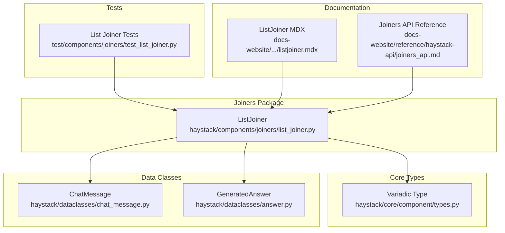
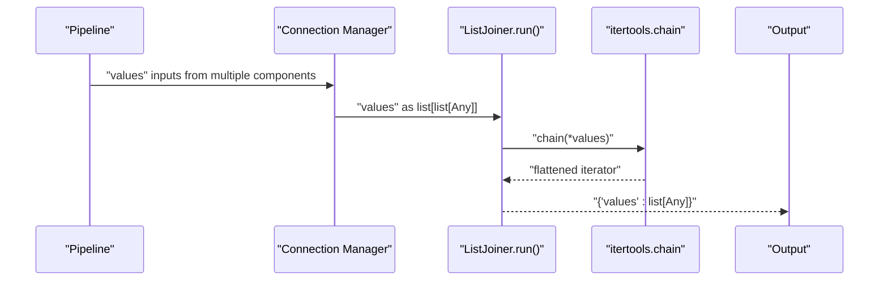
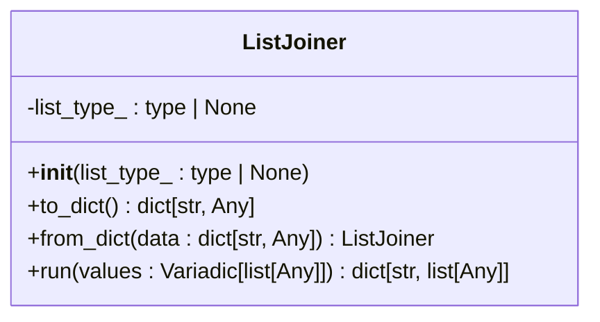
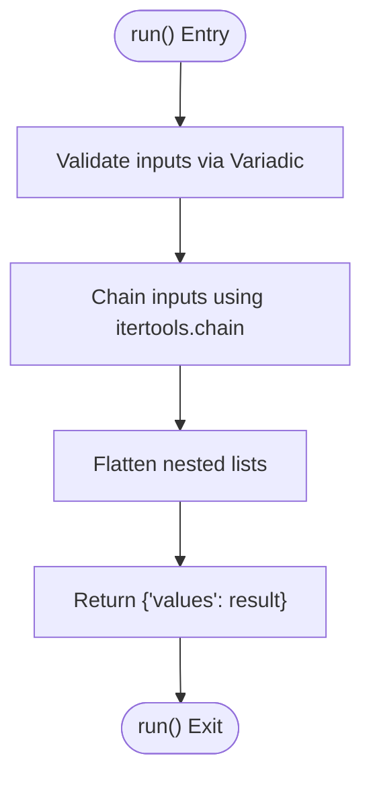
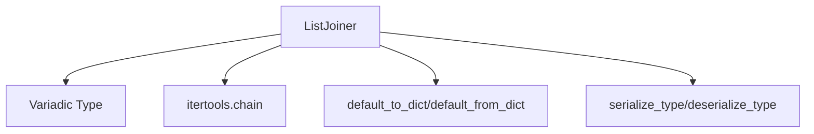

# List Joiner API

<cite>
**Referenced Files in This Document**
- [list_joiner.py](file://haystack/components/joiners/list_joiner.py)
- [types.py](file://haystack/core/component/types.py)
- [test_list_joiner.py](file://test/components/joiners/test_list_joiner.py)
- [chat_message.py](file://haystack/dataclasses/chat_message.py)
- [answer.py](file://haystack/dataclasses/answer.py)
- [listjoiner.mdx](file://docs-website/versioned_docs/version-2.25/pipeline-components/joiners/listjoiner.mdx)
- [joiners_api.md](file://docs-website/reference/haystack-api/joiners_api.md)
</cite>

## Table of Contents
1. [Introduction](#introduction)
2. [Project Structure](#project-structure)
3. [Core Components](#core-components)
4. [Architecture Overview](#architecture-overview)
5. [Detailed Component Analysis](#detailed-component-analysis)
6. [Dependency Analysis](#dependency-analysis)
7. [Performance Considerations](#performance-considerations)
8. [Troubleshooting Guide](#troubleshooting-guide)
9. [Conclusion](#conclusion)
10. [Appendices](#appendices)

## Introduction
This document provides comprehensive API documentation for the List Joiner component in the Haystack framework. The List Joiner combines multiple input lists into a single flat list while preserving the order of elements based on pipeline execution sequence. It supports both typed and untyped list merging, enabling flexible integration across diverse pipeline components.

## Project Structure
The List Joiner resides within the joiners package and integrates with the core component system. Its primary implementation and tests are organized as follows:
- Implementation: haystack/components/joiners/list_joiner.py
- Core type definitions: haystack/core/component/types.py
- Tests: test/components/joiners/test_list_joiner.py
- Data classes used in examples: haystack/dataclasses/chat_message.py, haystack/dataclasses/answer.py
- Documentation: docs-website/versioned_docs/version-2.25/pipeline-components/joiners/listjoiner.mdx and docs-website/reference/haystack-api/joiners_api.md

**Diagram sources**
- [list_joiner.py](file://haystack/components/joiners/list_joiner.py#L1-L113)
- [types.py](file://haystack/core/component/types.py#L1-L128)
- [test_list_joiner.py](file://test/components/joiners/test_list_joiner.py#L1-L173)
- [chat_message.py](file://haystack/dataclasses/chat_message.py#L1-L200)
- [answer.py](file://haystack/dataclasses/answer.py#L1-L139)
- [listjoiner.mdx](file://docs-website/versioned_docs/version-2.25/pipeline-components/joiners/listjoiner.mdx#L1-L101)
- [joiners_api.md](file://docs-website/reference/haystack-api/joiners_api.md#L402-L514)

**Section sources**
- [list_joiner.py](file://haystack/components/joiners/list_joiner.py#L1-L113)
- [types.py](file://haystack/core/component/types.py#L1-L128)
- [test_list_joiner.py](file://test/components/joiners/test_list_joiner.py#L1-L173)
- [chat_message.py](file://haystack/dataclasses/chat_message.py#L1-L200)
- [answer.py](file://haystack/dataclasses/answer.py#L1-L139)
- [listjoiner.mdx](file://docs-website/versioned_docs/version-2.25/pipeline-components/joiners/listjoiner.mdx#L1-L101)
- [joiners_api.md](file://docs-website/reference/haystack-api/joiners_api.md#L402-L514)

## Core Components
The List Joiner is implemented as a component with the following core characteristics:
- Constructor parameter: list_type_ (optional type hint specifying the expected list element type)
- Input specification: values (Variadic[list[Any]]) representing multiple input lists
- Output specification: dict[str, list[Any]] with a single key "values" containing the concatenated list
- Serialization support: to_dict() and from_dict() for component persistence

Key behaviors:
- Order preservation: Elements maintain order based on pipeline execution sequence
- Mixed-type support: When list_type_ is None, accepts heterogeneous list contents
- Type enforcement: When list_type_ is specified, enforces uniform element types across inputs
- Empty handling: Properly handles empty lists and sequences of empty lists

**Section sources**
- [list_joiner.py](file://haystack/components/joiners/list_joiner.py#L67-L113)
- [types.py](file://haystack/core/component/types.py#L17-L30)
- [joiners_api.md](file://docs-website/reference/haystack-api/joiners_api.md#L457-L514)

## Architecture Overview
The List Joiner participates in pipeline execution through the component system. Inputs are collected via Variadic sockets and passed to the run() method, which performs list concatenation using itertools.chain.

**Diagram sources**
- [list_joiner.py](file://haystack/components/joiners/list_joiner.py#L104-L113)
- [types.py](file://haystack/core/component/types.py#L89-L100)

**Section sources**
- [list_joiner.py](file://haystack/components/joiners/list_joiner.py#L104-L113)
- [types.py](file://haystack/core/component/types.py#L89-L100)

## Detailed Component Analysis

### Class Definition and Initialization
The ListJoiner class defines constructor behavior and output type configuration:
- Constructor accepts list_type_ parameter to specify expected element type
- When list_type_ is provided, output type is set to list[list_type_]
- When list_type_ is None, output type defaults to list[Any]
- Serialization includes list_type_ when present

**Diagram sources**
- [list_joiner.py](file://haystack/components/joiners/list_joiner.py#L67-L113)

**Section sources**
- [list_joiner.py](file://haystack/components/joiners/list_joiner.py#L67-L113)

### Method Specifications

#### run() Method
Signature: run(values: Variadic[list[Any]]) -> dict[str, list[Any]]

Behavior:
- Accepts multiple list inputs via Variadic
- Uses itertools.chain to flatten input lists
- Returns dictionary with "values" key containing concatenated list
- Preserves order based on pipeline execution sequence

Processing logic:

**Diagram sources**
- [list_joiner.py](file://haystack/components/joiners/list_joiner.py#L104-L113)

**Section sources**
- [list_joiner.py](file://haystack/components/joiners/list_joiner.py#L104-L113)
- [types.py](file://haystack/core/component/types.py#L89-L100)

### Input Parameter Specifications
The List Joiner uses Variadic typing to collect multiple list inputs:
- Variadic[list[Any]] indicates the component expects a list of lists
- The pipeline unpacks Variadic annotations to collect inputs from multiple connections
- Each connected component contributes one list input

Type compatibility:
- Without type specification: accepts any list contents
- With type specification: enforces uniform element types across all inputs

**Section sources**
- [types.py](file://haystack/core/component/types.py#L17-L30)
- [types.py](file://haystack/core/component/types.py#L89-L100)
- [list_joiner.py](file://haystack/components/joiners/list_joiner.py#L67-L79)

### Output List Formatting
Output format: dict[str, list[Any]] with "values" key
- Single output dictionary with "values" key
- Value is a flat list containing all elements from input lists
- Order preserved according to pipeline execution sequence

**Section sources**
- [list_joiner.py](file://haystack/components/joiners/list_joiner.py#L104-L113)
- [joiners_api.md](file://docs-website/reference/haystack-api/joiners_api.md#L501-L514)

### Duplicate Handling and Removal
The List Joiner does not implement duplicate detection or removal:
- Performs simple concatenation without element comparison
- Preserves all elements from input lists
- No deduplication logic is applied during joining

Implications:
- Duplicate elements across lists are maintained in output
- Ordering is strictly preserved from input sequences
- No performance optimization for duplicate elimination

**Section sources**
- [list_joiner.py](file://haystack/components/joiners/list_joiner.py#L111-L112)

### Type Compatibility and Merging Strategies
Type handling strategies:
- Unspecified type: list[Any] allows mixed element types
- Specified type: Enforces uniform element types across inputs
- Data class compatibility: Works with ChatMessage, GeneratedAnswer, and other data classes

Examples of supported types:
- ChatMessage lists for conversational contexts
- GeneratedAnswer lists for response aggregation
- Mixed-type lists for flexible data collection

**Section sources**
- [list_joiner.py](file://haystack/components/joiners/list_joiner.py#L67-L79)
- [chat_message.py](file://haystack/dataclasses/chat_message.py#L52-L200)
- [answer.py](file://haystack/dataclasses/answer.py#L90-L139)
- [test_list_joiner.py](file://test/components/joiners/test_list_joiner.py#L110-L113)

## Dependency Analysis
The List Joiner depends on core component infrastructure and external libraries:

**Diagram sources**
- [list_joiner.py](file://haystack/components/joiners/list_joiner.py#L5-L10)
- [list_joiner.py](file://haystack/components/joiners/list_joiner.py#L81-L102)

Key dependencies:
- itertools.chain: Core library for flattening nested iterables
- Component serialization utilities: For persistent configuration
- Variadic type system: For collecting multiple inputs

**Section sources**
- [list_joiner.py](file://haystack/components/joiners/list_joiner.py#L5-L10)
- [list_joiner.py](file://haystack/components/joiners/list_joiner.py#L81-L102)

## Performance Considerations
Performance characteristics:
- Time complexity: O(n) where n is total number of elements across all input lists
- Space complexity: O(n) for storing the concatenated result
- Memory usage scales linearly with input size
- No duplicate detection overhead

Optimization recommendations:
- Minimize unnecessary intermediate lists in pipeline design
- Consider upstream filtering to reduce total element count
- Use type specification to enable early validation and potential optimizations

## Troubleshooting Guide
Common issues and resolutions:

### Pipeline Connection Validation
- Issue: Connecting to incompatible output ports
- Resolution: Ensure connections target "values" output when connecting to components expecting ListJoiner output
- Validation: Pipeline raises PipelineConnectError for invalid connections

### Type Mismatch Errors
- Issue: Providing lists with incompatible element types
- Resolution: Specify list_type_ during initialization to enforce type consistency
- Example: Use List[ChatMessage] for conversational contexts

### Empty Input Handling
- Behavior: Empty lists are handled gracefully
- Result: Empty inputs contribute nothing to final output
- Edge case: Multiple empty lists produce empty output

**Section sources**
- [test_list_joiner.py](file://test/components/joiners/test_list_joiner.py#L121-L157)

## Conclusion
The List Joiner provides a straightforward mechanism for combining multiple list inputs into a single flat list while preserving order and supporting flexible type handling. Its simple concatenation approach ensures predictable performance and behavior, making it suitable for various pipeline scenarios including response aggregation, data consolidation, and multi-source list fusion.

## Appendices

### API Reference Summary
- Constructor: ListJoiner(list_type_: type | None = None)
- Method: run(values: Variadic[list[Any]]) -> dict[str, list[Any]]
- Output: {"values": list[Any]}
- Serialization: to_dict(), from_dict()

### Usage Examples
- Basic list concatenation with mixed types
- Pipeline integration with ChatMessage lists
- Response aggregation from multiple components
- Empty list handling and edge cases

**Section sources**
- [joiners_api.md](file://docs-website/reference/haystack-api/joiners_api.md#L457-L514)
- [listjoiner.mdx](file://docs-website/versioned_docs/version-2.25/pipeline-components/joiners/listjoiner.mdx#L32-L100)