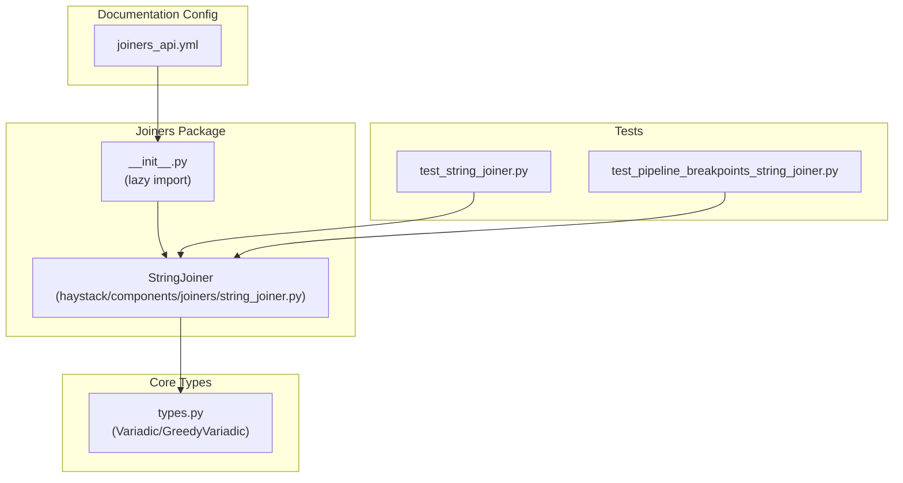
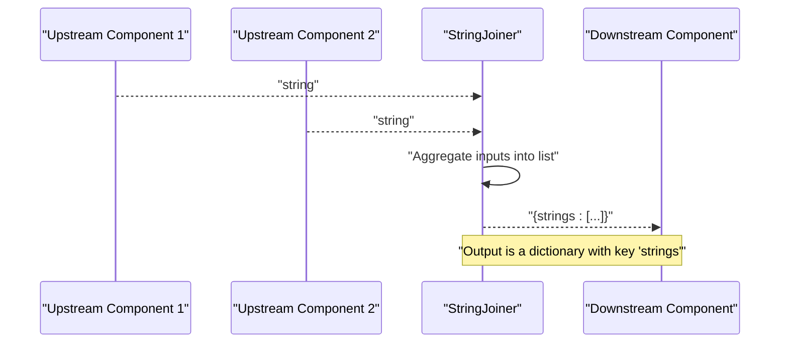
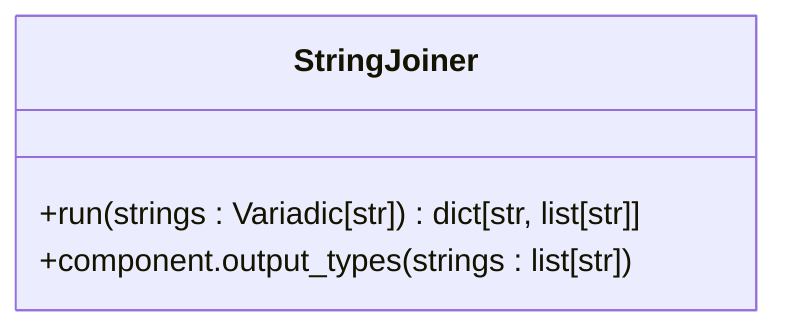
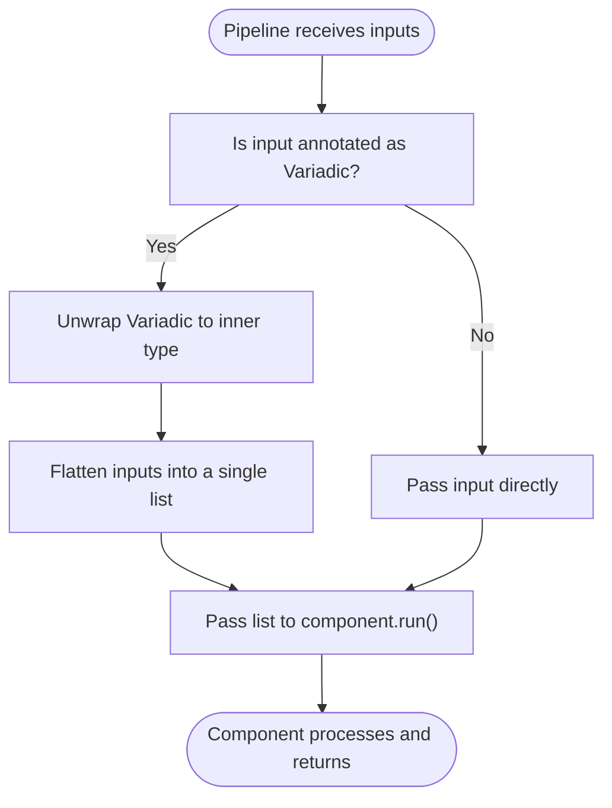
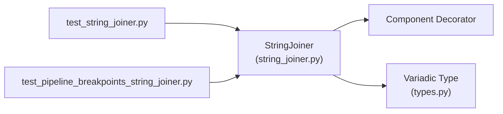

# String Joiner API

<cite>
**Referenced Files in This Document**
- [string_joiner.py](file://haystack/components/joiners/string_joiner.py)
- [__init__.py](file://haystack/components/joiners/__init__.py)
- [types.py](file://haystack/core/component/types.py)
- [test_string_joiner.py](file://test/components/joiners/test_string_joiner.py)
- [test_pipeline_breakpoints_string_joiner.py](file://test/core/pipeline/breakpoints/test_pipeline_breakpoints_string_joiner.py)
- [joiners_api.yml](file://pydoc/joiners_api.yml)
</cite>

## Table of Contents
1. [Introduction](#introduction)
2. [Project Structure](#project-structure)
3. [Core Components](#core-components)
4. [Architecture Overview](#architecture-overview)
5. [Detailed Component Analysis](#detailed-component-analysis)
6. [Dependency Analysis](#dependency-analysis)
7. [Performance Considerations](#performance-considerations)
8. [Troubleshooting Guide](#troubleshooting-guide)
9. [Conclusion](#conclusion)

## Introduction
This document provides detailed API documentation for the String Joiner component. It explains how the component collects strings from multiple upstream components and exposes them as a list of strings for downstream consumers. The documentation covers input parameter specifications, pipeline integration, output formatting, and operational behavior. It also clarifies how the component interacts with the Variadic input mechanism and how it fits into Haystack pipelines.

## Project Structure
The String Joiner resides in the joiners package alongside other joiner components. The package exports the component via a lazy importer and provides tests and pipeline integration examples.

**Diagram sources**
- [string_joiner.py](file://haystack/components/joiners/string_joiner.py#L10-L56)
- [__init__.py](file://haystack/components/joiners/__init__.py#L10-L26)
- [types.py](file://haystack/core/component/types.py#L17-L29)
- [test_string_joiner.py](file://test/components/joiners/test_string_joiner.py#L1-L38)
- [test_pipeline_breakpoints_string_joiner.py](file://test/core/pipeline/breakpoints/test_pipeline_breakpoints_string_joiner.py#L17-L64)
- [joiners_api.yml](file://pydoc/joiners_api.yml#L1-L13)

**Section sources**
- [__init__.py](file://haystack/components/joiners/__init__.py#L10-L26)
- [string_joiner.py](file://haystack/components/joiners/string_joiner.py#L10-L56)
- [types.py](file://haystack/core/component/types.py#L17-L29)
- [test_string_joiner.py](file://test/components/joiners/test_string_joiner.py#L1-L38)
- [test_pipeline_breakpoints_string_joiner.py](file://test/core/pipeline/breakpoints/test_pipeline_breakpoints_string_joiner.py#L17-L64)
- [joiners_api.yml](file://pydoc/joiners_api.yml#L1-L13)

## Core Components
- StringJoiner: A component that accepts a variadic number of string inputs and returns them as a list of strings. It does not perform concatenation or separator insertion; it simply aggregates inputs into a list for downstream consumption.

Key characteristics:
- Input: Variadic[str] — receives a flattened collection of strings from connected components.
- Output: A dictionary containing a key "strings" mapped to a list of strings.
- Behavior: Pass-through aggregation; no separator, encoding normalization, or whitespace manipulation is applied.

Usage example and pipeline integration are demonstrated in the component’s docstring and in the pipeline breakpoint tests.

**Section sources**
- [string_joiner.py](file://haystack/components/joiners/string_joiner.py#L10-L56)
- [test_pipeline_breakpoints_string_joiner.py](file://test/core/pipeline/breakpoints/test_pipeline_breakpoints_string_joiner.py#L17-L64)

## Architecture Overview
The String Joiner participates in a pipeline where multiple components produce strings that are fed into the joiner via variadic inputs. The joiner exposes a single output named "strings".

**Diagram sources**
- [string_joiner.py](file://haystack/components/joiners/string_joiner.py#L42-L56)
- [test_pipeline_breakpoints_string_joiner.py](file://test/core/pipeline/breakpoints/test_pipeline_breakpoints_string_joiner.py#L17-L64)

## Detailed Component Analysis

### StringJoiner Class
The StringJoiner class is decorated as a component and defines a single run method that consumes variadic strings and returns a dictionary with a "strings" key.

**Diagram sources**
- [string_joiner.py](file://haystack/components/joiners/string_joiner.py#L10-L56)

Implementation highlights:
- Input specification: Variadic[str] indicates the component expects a flattened collection of strings from multiple upstream connections.
- Output specification: The output is declared as a single output named "strings" of type list[str].
- Processing logic: The run method converts the variadic input into a list and returns it under the "strings" key.

Behavioral notes:
- Separator configuration: Not applicable; the component does not concatenate strings.
- Whitespace handling: Not applicable; the component does not modify whitespace.
- Encoding considerations: Not applicable; the component does not alter encoding.
- Output formatting: Returns a dictionary with a single key "strings" and a list of incoming strings.

**Section sources**
- [string_joiner.py](file://haystack/components/joiners/string_joiner.py#L42-L56)
- [types.py](file://haystack/core/component/types.py#L17-L29)

### Variadic Input Mechanism
The component leverages the Variadic type to accept multiple inputs. The core types module defines Variadic and GreedyVariadic and describes how they are unpacked and processed by the pipeline.

**Diagram sources**
- [types.py](file://haystack/core/component/types.py#L17-L29)
- [types.py](file://haystack/core/component/types.py#L66-L101)

**Section sources**
- [types.py](file://haystack/core/component/types.py#L17-L29)
- [types.py](file://haystack/core/component/types.py#L66-L101)

### API Definition
- Component name: StringJoiner
- Module: haystack.components.joiners
- Inputs:
  - Name: strings
  - Type: Variadic[str]
  - Description: Strings produced by upstream components
- Outputs:
  - Name: strings
  - Type: list[str]
  - Description: Aggregated list of strings

Behavior summary:
- Accepts a variadic number of string inputs.
- Returns a dictionary with a single key "strings" whose value is a list of the received strings in order.

**Section sources**
- [string_joiner.py](file://haystack/components/joiners/string_joiner.py#L42-L56)

### Example Workflows
- Combining outputs from multiple prompt builders:
  - Connect two PromptBuilder outputs to the "strings" input of StringJoiner.
  - Run the pipeline; the output contains a "strings" list with both generated prompts.
- Pipeline integration with adapters:
  - Use OutputAdapter components to convert structured messages to strings, then feed them into StringJoiner.

These workflows are illustrated in the pipeline breakpoint tests.

**Section sources**
- [test_pipeline_breakpoints_string_joiner.py](file://test/core/pipeline/breakpoints/test_pipeline_breakpoints_string_joiner.py#L17-L64)

## Dependency Analysis
The String Joiner depends on the component decorator and the Variadic type definition. Tests validate initialization, serialization/deserialization, and basic run behaviors.

**Diagram sources**
- [string_joiner.py](file://haystack/components/joiners/string_joiner.py#L6-L7)
- [types.py](file://haystack/core/component/types.py#L17-L29)
- [test_string_joiner.py](file://test/components/joiners/test_string_joiner.py#L5-L6)
- [test_pipeline_breakpoints_string_joiner.py](file://test/core/pipeline/breakpoints/test_pipeline_breakpoints_string_joiner.py#L17-L28)

**Section sources**
- [string_joiner.py](file://haystack/components/joiners/string_joiner.py#L6-L7)
- [types.py](file://haystack/core/component/types.py#L17-L29)
- [test_string_joiner.py](file://test/components/joiners/test_string_joiner.py#L5-L6)
- [test_pipeline_breakpoints_string_joiner.py](file://test/core/pipeline/breakpoints/test_pipeline_breakpoints_string_joiner.py#L17-L28)

## Performance Considerations
- Complexity: The run method performs list conversion of the variadic input, which is O(n) in the number of received strings.
- Memory: The component stores the entire input list in memory before returning it.
- Throughput: Since no concatenation or transformation occurs, latency is minimal and dominated by input collection and dictionary construction.

[No sources needed since this section provides general guidance]

## Troubleshooting Guide
Common scenarios and checks:
- Empty input list: The component returns an empty "strings" list.
- Single string input: The component wraps it into a single-element list.
- Two or more strings: The component preserves the order and returns them as a list.

Validation references:
- Initialization and serialization/deserialization are covered by unit tests.
- Empty list, single string, and multiple strings are validated in tests.

**Section sources**
- [test_string_joiner.py](file://test/components/joiners/test_string_joiner.py#L14-L37)

## Conclusion
The String Joiner component provides a straightforward mechanism to aggregate strings from multiple upstream components into a single list output. It does not perform concatenation, separator insertion, whitespace normalization, or encoding transformations. Its primary role is to expose a consistent list interface for downstream components in a pipeline.