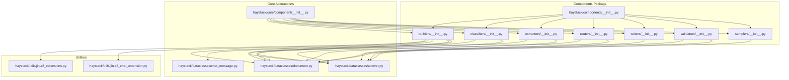
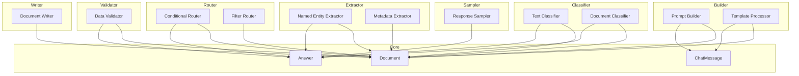
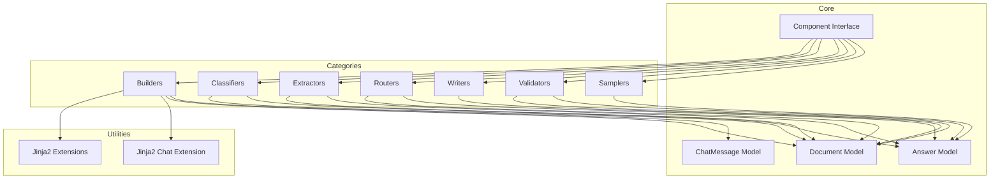

# Other Component APIs

<cite>
**Referenced Files in This Document**
- [haystack/components/__init__.py](file://haystack/components/__init__.py)
- [haystack/components/builders/__init__.py](file://haystack/components/builders/__init__.py)
- [haystack/components/classifiers/__init__.py](file://haystack/components/classifiers/__init__.py)
- [haystack/components/extractors/__init__.py](file://haystack/components/extractors/__init__.py)
- [haystack/components/routers/__init__.py](file://haystack/components/routers/__init__.py)
- [haystack/components/writers/__init__.py](file://haystack/components/writers/__init__.py)
- [haystack/components/validators/__init__.py](file://haystack/components/validators/__init__.py)
- [haystack/components/samplers/__init__.py](file://haystack/components/samplers/__init__.py)
- [haystack/core/component/__init__.py](file://haystack/core/component/__init__.py)
- [haystack/dataclasses/document.py](file://haystack/dataclasses/document.py)
- [haystack/dataclasses/chat_message.py](file://haystack/dataclasses/chat_message.py)
- [haystack/dataclasses/answer.py](file://haystack/dataclasses/answer.py)
- [haystack/utils/jinja2_extensions.py](file://haystack/utils/jinja2_extensions.py)
- [haystack/utils/jinja2_chat_extension.py](file://haystack/utils/jinja2_chat_extension.py)
- [pydoc/builders_api.yml](file://pydoc/builders_api.yml)
- [pydoc/classifiers_api.yml](file://pydoc/classifiers_api.yml)
- [pydoc/extractors_api.yml](file://pydoc/extractors_api.yml)
- [pydoc/routers_api.yml](file://pydoc/routers_api.yml)
- [pydoc/writers_api.yml](file://pydoc/writers_api.yml)
- [pydoc/validators_api.yml](file://pydoc/validators_api.yml)
- [pydoc/samplers_api.yml](file://pydoc/samplers_api.yml)
</cite>

## Table of Contents
1. [Introduction](#introduction)
2. [Project Structure](#project-structure)
3. [Core Components](#core-components)
4. [Architecture Overview](#architecture-overview)
5. [Detailed Component Analysis](#detailed-component-analysis)
6. [Dependency Analysis](#dependency-analysis)
7. [Performance Considerations](#performance-considerations)
8. [Troubleshooting Guide](#troubleshooting-guide)
9. [Conclusion](#conclusion)

## Introduction
This document provides comprehensive API documentation for the remaining Haystack component categories that were not covered in previous sections. It focuses on the following component families:
- Builder APIs for prompt construction and template processing
- Classifier APIs for document and text classification
- Extractor APIs for named entity and metadata extraction
- Router APIs for conditional routing and filtering
- Writer APIs for document persistence
- Validator APIs for data validation
- Sampler APIs for response sampling

The goal is to describe method signatures, parameter specifications, usage patterns, integration approaches, and guidelines for developing custom components within each category. Where applicable, we reference existing documentation artifacts and core Haystack abstractions to maintain consistency with the broader framework.

## Project Structure
The Haystack library organizes components by functional categories under a central components package. Each category exposes an __init__.py that typically re-exports public classes and utilities. Core abstractions for component behavior and data models live under haystack/core and haystack/dataclasses respectively.

**Diagram sources**
- [haystack/components/__init__.py](file://haystack/components/__init__.py)
- [haystack/components/builders/__init__.py](file://haystack/components/builders/__init__.py)
- [haystack/components/classifiers/__init__.py](file://haystack/components/classifiers/__init__.py)
- [haystack/components/extractors/__init__.py](file://haystack/components/extractors/__init__.py)
- [haystack/components/routers/__init__.py](file://haystack/components/routers/__init__.py)
- [haystack/components/writers/__init__.py](file://haystack/components/writers/__init__.py)
- [haystack/components/validators/__init__.py](file://haystack/components/validators/__init__.py)
- [haystack/components/samplers/__init__.py](file://haystack/components/samplers/__init__.py)
- [haystack/core/component/__init__.py](file://haystack/core/component/__init__.py)
- [haystack/dataclasses/document.py](file://haystack/dataclasses/document.py)
- [haystack/dataclasses/chat_message.py](file://haystack/dataclasses/chat_message.py)
- [haystack/dataclasses/answer.py](file://haystack/dataclasses/answer.py)
- [haystack/utils/jinja2_extensions.py](file://haystack/utils/jinja2_extensions.py)
- [haystack/utils/jinja2_chat_extension.py](file://haystack/utils/jinja2_chat_extension.py)

**Section sources**
- [haystack/components/__init__.py](file://haystack/components/__init__.py)
- [haystack/core/component/__init__.py](file://haystack/core/component/__init__.py)
- [haystack/dataclasses/document.py](file://haystack/dataclasses/document.py)

## Core Components
This section outlines the foundational building blocks that most component categories rely upon:
- Component interface and lifecycle: Components implement a standardized interface enabling consistent invocation, serialization, and pipeline integration.
- Data models: Documents, ChatMessage, and Answer serve as primary input/output types across many components.

Key references:
- Component interface and registration are defined in the core component module.
- Document and related data structures define the canonical data representation.

**Section sources**
- [haystack/core/component/__init__.py](file://haystack/core/component/__init__.py)
- [haystack/dataclasses/document.py](file://haystack/dataclasses/document.py)
- [haystack/dataclasses/chat_message.py](file://haystack/dataclasses/chat_message.py)
- [haystack/dataclasses/answer.py](file://haystack/dataclasses/answer.py)

## Architecture Overview
The component ecosystem follows a modular architecture where each category encapsulates domain-specific functionality while adhering to shared interfaces and data models. Builders leverage templating utilities; Classifiers operate on documents or text; Extractors focus on structured information from documents; Routers apply conditional logic; Writers persist data; Validators enforce constraints; Samplers control response variability.

[No sources needed since this diagram shows conceptual architecture, not a direct mapping to specific source files]

## Detailed Component Analysis

### Builder APIs
Builders construct prompts and process templates using Jinja2 extensions. They typically accept templates and context variables, returning formatted content suitable for downstream components such as generators.

Common patterns:
- Template rendering with variable substitution
- Support for chat-style templates via specialized extensions
- Integration with Document and ChatMessage data models

Integration references:
- Jinja2 extensions for general and chat-specific templating
- Document and ChatMessage data models for input/output

Usage patterns:
- Prepare a template string with placeholders
- Provide a context dictionary containing variables
- Render the template to produce a prompt or message payload

Custom development guidelines:
- Implement the standard component interface
- Accept a template parameter and a context parameter
- Return a rendered string or structured message object
- Leverage existing Jinja2 extensions for advanced formatting

**Section sources**
- [haystack/utils/jinja2_extensions.py](file://haystack/utils/jinja2_extensions.py)
- [haystack/utils/jinja2_chat_extension.py](file://haystack/utils/jinja2_chat_extension.py)
- [haystack/dataclasses/document.py](file://haystack/dataclasses/document.py)
- [haystack/dataclasses/chat_message.py](file://haystack/dataclasses/chat_message.py)

### Classifier APIs
Classifiers categorize text or documents into predefined classes. They accept textual or document inputs and return classification results, often including labels and confidences.

Common patterns:
- Text classification for short-form inputs
- Document classification for long-form content
- Output includes predicted classes and confidence scores

Integration references:
- Document and Answer data models for input/output
- Core component interface for lifecycle and serialization

Usage patterns:
- Provide a single text or a Document
- Receive a classification result with label(s) and score(s)

Custom development guidelines:
- Implement the standard component interface
- Define input and output specifications aligned with the Answer model
- Ensure deterministic or probabilistic outputs depending on the classifier type

**Section sources**
- [haystack/dataclasses/answer.py](file://haystack/dataclasses/answer.py)
- [haystack/dataclasses/document.py](file://haystack/dataclasses/document.py)

### Extractor APIs
Extractors identify and extract structured information such as named entities and metadata from documents. They transform unstructured or semi-structured content into structured data.

Common patterns:
- Named entity extraction returning entity types and spans
- Metadata extraction returning key-value pairs or structured attributes
- Output integrated with Answer for downstream processing

Integration references:
- Document and Answer data models
- Core component interface

Usage patterns:
- Pass a Document to extract entities or metadata
- Receive structured results suitable for routing or storage

Custom development guidelines:
- Implement the standard component interface
- Define extraction schema and output format
- Align with Answer for unified downstream consumption

**Section sources**
- [haystack/dataclasses/answer.py](file://haystack/dataclasses/answer.py)
- [haystack/dataclasses/document.py](file://haystack/dataclasses/document.py)

### Router APIs
Routers implement conditional logic to route data to different downstream components based on criteria such as content characteristics, metadata, or computed features.

Common patterns:
- Conditional routing based on content or metadata
- Filtering logic to select subsets of documents or answers
- Fan-out/fan-in patterns within pipelines

Integration references:
- Document and Answer data models
- Core component interface

Usage patterns:
- Provide input documents or answers
- Apply routing rules to determine next steps
- Connect to multiple downstream components

Custom development guidelines:
- Implement the standard component interface
- Define routing predicates and branch logic
- Ensure deterministic routing behavior

**Section sources**
- [haystack/dataclasses/answer.py](file://haystack/dataclasses/answer.py)
- [haystack/dataclasses/document.py](file://haystack/dataclasses/document.py)

### Writer APIs
Writers persist documents to external systems or storage backends. They handle write operations and return status or metadata about the persistence action.

Common patterns:
- Writing Documents to configured backends
- Returning write results or identifiers

Integration references:
- Document data model
- Core component interface

Usage patterns:
- Provide a Document or batch of Documents
- Receive write outcome or identifiers

Custom development guidelines:
- Implement the standard component interface
- Define backend-specific configuration and connection handling
- Ensure idempotent or conflict-aware write semantics

**Section sources**
- [haystack/dataclasses/document.py](file://haystack/dataclasses/document.py)

### Validator APIs
Validators enforce constraints on data inputs, ensuring quality and correctness before downstream processing.

Common patterns:
- Schema validation against predefined structures
- Business rule validation for content and metadata
- Returning validation results with optional remediation hints

Integration references:
- Document and Answer data models
- Core component interface

Usage patterns:
- Validate incoming Documents or Answers
- Fail fast on violations or pass with warnings

Custom development guidelines:
- Implement the standard component interface
- Define validation rules and error reporting
- Keep validations efficient and deterministic

**Section sources**
- [haystack/dataclasses/answer.py](file://haystack/dataclasses/answer.py)
- [haystack/dataclasses/document.py](file://haystack/dataclasses/document.py)

### Sampler APIs
Samplers control response variability by selecting among multiple candidates or applying stochastic selection mechanisms.

Common patterns:
- Selecting top-k or diverse candidates
- Applying temperature-like controls for diversity
- Integrating with generator outputs

Integration references:
- Answer data model
- Core component interface

Usage patterns:
- Provide candidate answers or ranked lists
- Receive sampled subset for downstream use

Custom development guidelines:
- Implement the standard component interface
- Define sampling strategy and parameters
- Preserve semantic quality while introducing controlled randomness

**Section sources**
- [haystack/dataclasses/answer.py](file://haystack/dataclasses/answer.py)

## Dependency Analysis
The component categories share common dependencies on core abstractions and data models. Builders depend on templating utilities; all categories depend on the component interface and data models.

**Diagram sources**
- [haystack/core/component/__init__.py](file://haystack/core/component/__init__.py)
- [haystack/dataclasses/document.py](file://haystack/dataclasses/document.py)
- [haystack/dataclasses/chat_message.py](file://haystack/dataclasses/chat_message.py)
- [haystack/dataclasses/answer.py](file://haystack/dataclasses/answer.py)
- [haystack/utils/jinja2_extensions.py](file://haystack/utils/jinja2_extensions.py)
- [haystack/utils/jinja2_chat_extension.py](file://haystack/utils/jinja2_chat_extension.py)

**Section sources**
- [haystack/core/component/__init__.py](file://haystack/core/component/__init__.py)
- [haystack/dataclasses/document.py](file://haystack/dataclasses/document.py)
- [haystack/dataclasses/answer.py](file://haystack/dataclasses/answer.py)
- [haystack/utils/jinja2_extensions.py](file://haystack/utils/jinja2_extensions.py)
- [haystack/utils/jinja2_chat_extension.py](file://haystack/utils/jinja2_chat_extension.py)

## Performance Considerations
- Builders: Prefer precompiled templates and minimal variable overhead for high-throughput scenarios.
- Classifiers: Use batching and caching for repeated classifications; leverage lightweight models for real-time inference.
- Extractors: Optimize NLP pipelines; cache frequent extractions; minimize post-processing overhead.
- Routers: Keep routing predicates simple and indexed; avoid heavy computations inside router logic.
- Writers: Batch writes; handle retries and idempotency; tune backend connection pools.
- Validators: Short-circuit on obvious failures; parallelize independent validations.
- Samplers: Control sampling cost; use approximate methods for large candidate sets.

[No sources needed since this section provides general guidance]

## Troubleshooting Guide
- Builder template errors: Validate template syntax and variable presence; ensure context keys match placeholders.
- Classifier misclassification: Inspect input preprocessing and class imbalance; verify label encoding.
- Extractor missing entities: Adjust extraction thresholds or training data; confirm document formatting.
- Router misrouting: Log routing decisions and predicates; verify metadata availability.
- Writer failures: Check backend connectivity and permissions; implement retry and dead-letter queues.
- Validator false positives/negatives: Review validation rules and thresholds; add unit tests for edge cases.
- Sampler low diversity: Increase sampling temperature or diversity parameters; adjust candidate ranking.

[No sources needed since this section provides general guidance]

## Conclusion
The Builder, Classifier, Extractor, Router, Writer, Validator, and Sampler categories form a cohesive set of capabilities within the Haystack ecosystem. By adhering to the shared component interface and leveraging core data models, developers can integrate, extend, and customize these components to build robust pipelines. The provided patterns, integration points, and guidelines enable both quick adoption and deep customization across diverse use cases.

[No sources needed since this section summarizes without analyzing specific files]