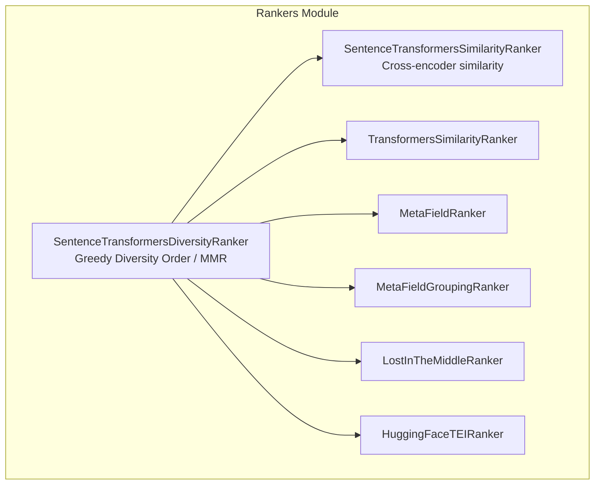
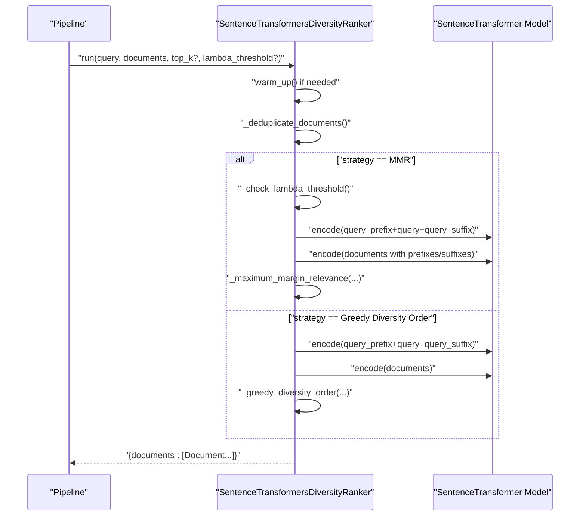
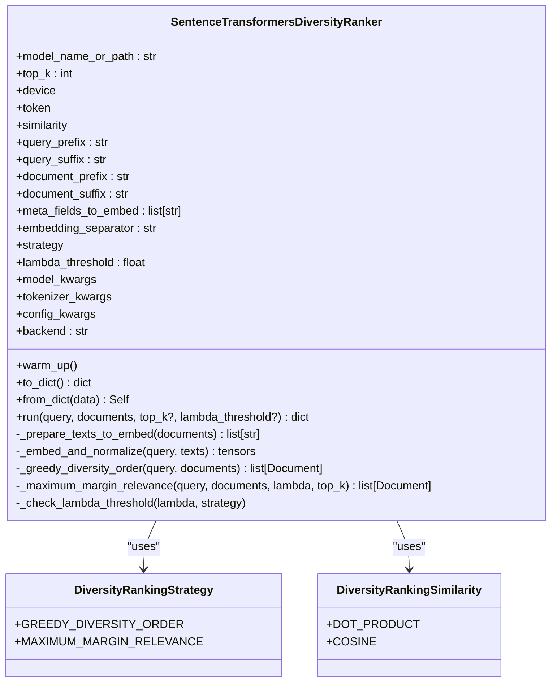
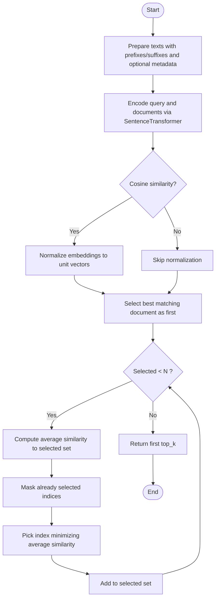
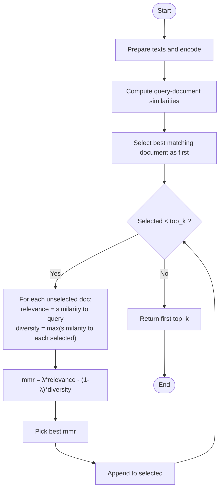
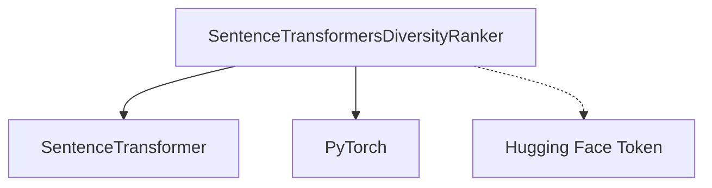

# Diversity Rankers

<cite>
**Referenced Files in This Document**
- [sentence_transformers_diversity.py](file://haystack/components/rankers/sentence_transformers_diversity.py)
- [sentencetransformersdiversityranker.mdx](file://docs-website/docs/pipeline-components/rankers/sentencetransformersdiversityranker.mdx)
- [test_sentence_transformers_diversity.py](file://test/components/rankers/test_sentence_transformers_diversity.py)
- [rankers_api.yml](file://pydoc/rankers_api.yml)
- [__init__.py](file://haystack/components/rankers/__init__.py)
- [fix-diversity-ranker-lambda-threshold-a86158f6bd739115.yaml](file://releasenotes/notes/fix-diversity-ranker-lambda-threshold-a86158f6bd739115.yaml)
- [diversity-ranker-add-topk-24f23136f316129a.yaml](file://releasenotes/notes/diversity-ranker-add-topk-24f23136f316129a.yaml)
- [add-maximum-margin-relevance-ranker-9d6d71c6a408c6d1.yaml](file://releasenotes/notes/add-maximum-margin-relevance-ranker-9d6d71c6a408c6d1.yaml)
- [diversity-ranker-hf-toke-8dcb6889ff625948.yaml](file://releasenotes/notes/diversity-ranker-hf-toke-8dcb6889ff625948.yaml)
</cite>

## Table of Contents
1. [Introduction](#introduction)
2. [Project Structure](#project-structure)
3. [Core Components](#core-components)
4. [Architecture Overview](#architecture-overview)
5. [Detailed Component Analysis](#detailed-component-analysis)
6. [Dependency Analysis](#dependency-analysis)
7. [Performance Considerations](#performance-considerations)
8. [Troubleshooting Guide](#troubleshooting-guide)
9. [Conclusion](#conclusion)
10. [Appendices](#appendices)

## Introduction
This document provides comprehensive API documentation for diversity ranking components in Haystack, focusing on the SentenceTransformersDiversityRanker. It explains how the component maximizes diversity among ranked documents, details the diversity calculation algorithms, the lambda parameter configuration for MMR, and score adjustment mechanisms. It also includes practical examples, parameter tuning guidance, and integration tips for semantic search pipelines. Finally, it discusses the trade-offs between relevance and diversity in document ranking.

## Project Structure
The diversity ranking capability is implemented as a single component class with supporting enums and tests. The component integrates with the Haystack component ecosystem and can be used standalone or within pipelines.

**Diagram sources**
- [__init__.py](file://haystack/components/rankers/__init__.py#L10-L18)
- [sentence_transformers_diversity.py](file://haystack/components/rankers/sentence_transformers_diversity.py#L74-L113)

**Section sources**
- [__init__.py](file://haystack/components/rankers/__init__.py#L10-L18)
- [rankers_api.yml](file://pydoc/rankers_api.yml#L1-L14)

## Core Components
- SentenceTransformersDiversityRanker: A diversity-aware ranker that supports two strategies:
  - Greedy Diversity Order: Maximizes overall diversity among documents relative to the query.
  - Maximum Margin Relevance (MMR): Balances relevance and diversity using a lambda threshold parameter.
- Supporting enums:
  - DiversityRankingStrategy: Strategy selection.
  - DiversityRankingSimilarity: Similarity metric for embeddings (dot product or cosine).

Key capabilities:
- Embedding generation via Sentence Transformers.
- Optional prefix/suffix and metadata embedding for richer representations.
- Deduplication of documents by ID before ranking.
- top_k control for limiting returned results.
- MMR scoring with configurable lambda threshold.

**Section sources**
- [sentence_transformers_diversity.py](file://haystack/components/rankers/sentence_transformers_diversity.py#L74-L113)
- [sentence_transformers_diversity.py](file://haystack/components/rankers/sentence_transformers_diversity.py#L19-L44)
- [sentence_transformers_diversity.py](file://haystack/components/rankers/sentence_transformers_diversity.py#L46-L71)

## Architecture Overview
The component operates in a pipeline-friendly manner. It can be placed after a retriever to refine candidate documents by diversity or relevance.

**Diagram sources**
- [sentence_transformers_diversity.py](file://haystack/components/rankers/sentence_transformers_diversity.py#L388-L428)
- [sentence_transformers_diversity.py](file://haystack/components/rankers/sentence_transformers_diversity.py#L275-L321)
- [sentence_transformers_diversity.py](file://haystack/components/rankers/sentence_transformers_diversity.py#L334-L381)

## Detailed Component Analysis

### SentenceTransformersDiversityRanker
- Purpose: Reorder documents to maximize diversity or balance relevance and diversity using MMR.
- Strategies:
  - Greedy Diversity Order: Starts from the most similar document to the query, then iteratively selects the next document that minimizes average similarity to the selected set.
  - Maximum Margin Relevance: Iteratively selects documents maximizing a trade-off between relevance to the query and diversity from already selected documents, controlled by lambda_threshold.
- Similarity metrics:
  - dot_product: Standard dot product similarity.
  - cosine: Cosine similarity computed by normalizing embeddings.
- Lambda threshold (MMR):
  - Controls the trade-off between relevance and diversity.
  - Must be within [0, 1].
  - Closer to 0 emphasizes diversity; closer to 1 emphasizes relevance.
- Text preparation:
  - Supports query/document prefixes/suffixes and embedding metadata fields concatenated with a separator.
- Deduplication:
  - Removes duplicate document IDs before ranking; retains the highest-scoring duplicate if present.
- Device and model loading:
  - Uses SentenceTransformer with support for torch, ONNX, and OpenVINO backends.
  - Accepts Hugging Face token for private models.

**Diagram sources**
- [sentence_transformers_diversity.py](file://haystack/components/rankers/sentence_transformers_diversity.py#L74-L195)
- [sentence_transformers_diversity.py](file://haystack/components/rankers/sentence_transformers_diversity.py#L19-L44)
- [sentence_transformers_diversity.py](file://haystack/components/rankers/sentence_transformers_diversity.py#L46-L71)

#### Greedy Diversity Order Algorithm
- Steps:
  - Prepare texts (prefixes/suffixes + optional metadata).
  - Encode query and documents; normalize for cosine similarity if configured.
  - Start with the document most similar to the query.
  - Iteratively select the next document that minimizes the average similarity to the already selected set.
  - Continue until all documents are selected; return the first top_k.

**Diagram sources**
- [sentence_transformers_diversity.py](file://haystack/components/rankers/sentence_transformers_diversity.py#L275-L321)

**Section sources**
- [sentence_transformers_diversity.py](file://haystack/components/rankers/sentence_transformers_diversity.py#L275-L321)

#### Maximum Margin Relevance (MMR) Scoring
- Steps:
  - Prepare texts and compute embeddings.
  - Compute query-document similarities.
  - Iteratively select the document that maximizes:
    score = λ * relevance + (1 - λ) * diversity
  - Diversity is measured as the maximum similarity to any already selected document.
  - Stop after top_k selections or when no candidates remain.

**Diagram sources**
- [sentence_transformers_diversity.py](file://haystack/components/rankers/sentence_transformers_diversity.py#L334-L381)

**Section sources**
- [sentence_transformers_diversity.py](file://haystack/components/rankers/sentence_transformers_diversity.py#L334-L381)

### API Reference and Usage Examples
- Standalone usage:
  - Instantiate with model, similarity, and strategy.
  - Call run(query, documents) to receive top_k diverse/relevant documents.
- Pipeline integration:
  - Place after a retriever to refine candidate sets.
  - Configure top_k at both retriever and ranker stages for predictable output sizes.

Examples and guidance are available in the documentation page for the component.

**Section sources**
- [sentencetransformersdiversityranker.mdx](file://docs-website/docs/pipeline-components/rankers/sentencetransformersdiversityranker.mdx#L35-L99)

## Dependency Analysis
- Internal dependencies:
  - Sentence Transformers library for embeddings.
  - PyTorch for tensor operations.
  - Haystack utilities for device management, serialization, and document deduplication.
- External dependencies:
  - Hugging Face token for private models.
  - Optional model/tokenizer/config kwargs passed to SentenceTransformer/CrossEncoder.

**Diagram sources**
- [sentence_transformers_diversity.py](file://haystack/components/rankers/sentence_transformers_diversity.py#L14-L16)
- [sentence_transformers_diversity.py](file://haystack/components/rankers/sentence_transformers_diversity.py#L200-L210)

**Section sources**
- [sentence_transformers_diversity.py](file://haystack/components/rankers/sentence_transformers_diversity.py#L14-L16)
- [sentence_transformers_diversity.py](file://haystack/components/rankers/sentence_transformers_diversity.py#L200-L210)

## Performance Considerations
- Backend selection:
  - Choose backend ("torch", "onnx", "openvino") based on deployment needs and hardware.
- Batch size and device:
  - Larger batch sizes increase throughput but require more memory.
  - Prefer GPU when available for embedding computation.
- top_k tuning:
  - Smaller top_k reduces post-processing overhead.
- Similarity metric:
  - Cosine normalization adds computational overhead but improves robustness for varying vector magnitudes.
- Warm-up:
  - Call warm_up once during initialization to avoid cold-start latency in pipelines.

[No sources needed since this section provides general guidance]

## Troubleshooting Guide
Common issues and resolutions:
- Invalid lambda_threshold:
  - MMR requires 0 ≤ lambda_threshold ≤ 1. An out-of-range value raises an error.
- top_k must be positive:
  - top_k must be greater than zero; otherwise, a ValueError is raised.
- Empty documents list:
  - Returns an empty documents list without error.
- Preserving explicit lambda_threshold=0.0:
  - Ensure lambda_threshold is not overridden by default short-circuit behavior; pass it explicitly when needed.
- Using token parameter:
  - Internally uses token instead of deprecated use_auth_token; ensure proper token configuration.

**Section sources**
- [sentence_transformers_diversity.py](file://haystack/components/rankers/sentence_transformers_diversity.py#L382-L387)
- [sentence_transformers_diversity.py](file://haystack/components/rankers/sentence_transformers_diversity.py#L412-L416)
- [sentence_transformers_diversity.py](file://haystack/components/rankers/sentence_transformers_diversity.py#L409-L411)
- [fix-diversity-ranker-lambda-threshold-a86158f6bd739115.yaml](file://releasenotes/notes/fix-diversity-ranker-lambda-threshold-a86158f6bd739115.yaml#L1-L5)
- [diversity-ranker-hf-toke-8dcb6889ff625948.yaml](file://releasenotes/notes/diversity-ranker-hf-toke-8dcb6889ff625948.yaml#L1-L5)

## Conclusion
SentenceTransformersDiversityRanker offers two complementary strategies for document ranking:
- Greedy Diversity Order for maximal diversity.
- Maximum Margin Relevance for balanced relevance and diversity via lambda_threshold.
With careful configuration of similarity metrics, text preparation, and top_k, it integrates seamlessly into semantic search pipelines to improve coverage and reduce redundancy.

[No sources needed since this section summarizes without analyzing specific files]

## Appendices

### Parameter Tuning Guide
- Strategy selection:
  - Use Greedy Diversity Order when diversity is the primary goal.
  - Use MMR when you want to balance relevance and diversity.
- lambda_threshold (MMR):
  - Start with 0.5 as a baseline.
  - Decrease toward 0 to emphasize diversity; increase toward 1 to emphasize relevance.
- top_k:
  - Adjust to control output size; consider downstream components’ capacity.
- Similarity metric:
  - Use cosine for normalized vectors; dot product otherwise.
- Prefixes/suffixes and metadata:
  - Add domain-specific instructions to improve embedding quality for your use case.

**Section sources**
- [sentence_transformers_diversity.py](file://haystack/components/rankers/sentence_transformers_diversity.py#L115-L172)
- [sentence_transformers_diversity.py](file://haystack/components/rankers/sentence_transformers_diversity.py#L334-L351)

### Trade-offs Between Relevance and Diversity
- Relevance-focused ranking:
  - Emphasizes documents most similar to the query.
  - Risks redundancy and narrow coverage.
- Diversity-focused ranking:
  - Spreads out documents to cover broader topics.
  - May reduce top relevance for the query.
- Balanced ranking (MMR):
  - Allows tuning via lambda_threshold to meet application goals.
  - Useful for summarization, exploration, and recommendation tasks.

**Section sources**
- [sentence_transformers_diversity.py](file://haystack/components/rankers/sentence_transformers_diversity.py#L88-L96)
- [sentence_transformers_diversity.py](file://haystack/components/rankers/sentence_transformers_diversity.py#L334-L351)

### Integration with Semantic Search Pipelines
- Typical pipeline:
  - Retriever → SentenceTransformersDiversityRanker → Optional further processing.
- Tips:
  - Set retriever.top_k higher than desired final output to allow effective diversity refinement.
  - Use warm_up to preload models in long-running services.
  - Serialize/deserialize ranker configurations for reproducibility.

**Section sources**
- [sentencetransformersdiversityranker.mdx](file://docs-website/docs/pipeline-components/rankers/sentencetransformersdiversityranker.mdx#L64-L99)
- [sentence_transformers_diversity.py](file://haystack/components/rankers/sentence_transformers_diversity.py#L212-L256)

### Release Notes Highlights
- Enhanced MMR support:
  - Added Maximum Margin Relevance strategy to balance relevance and diversity.
- top_k parameter addition:
  - Introduced top_k parameter to the DiversityRanker init method.
- Lambda threshold fix:
  - Fixed explicit lambda_threshold=0.0 preservation behavior.
- Token parameter update:
  - Updated internal token handling to use token instead of deprecated use_auth_token.

**Section sources**
- [add-maximum-margin-relevance-ranker-9d6d71c6a408c6d1.yaml](file://releasenotes/notes/add-maximum-margin-relevance-ranker-9d6d71c6a408c6d1.yaml#L1-L4)
- [diversity-ranker-add-topk-24f23136f316129a.yaml](file://releasenotes/notes/diversity-ranker-add-topk-24f23136f316129a.yaml#L1-L4)
- [fix-diversity-ranker-lambda-threshold-a86158f6bd739115.yaml](file://releasenotes/notes/fix-diversity-ranker-lambda-threshold-a86158f6bd739115.yaml#L1-L5)
- [diversity-ranker-hf-toke-8dcb6889ff625948.yaml](file://releasenotes/notes/diversity-ranker-hf-toke-8dcb6889ff625948.yaml#L1-L5)