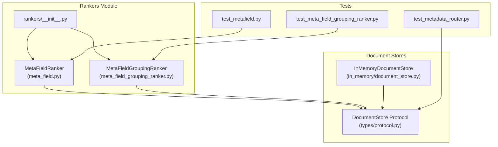
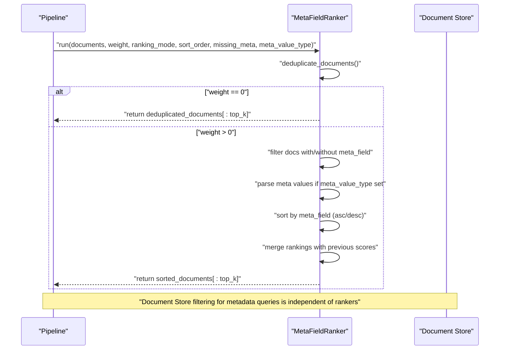
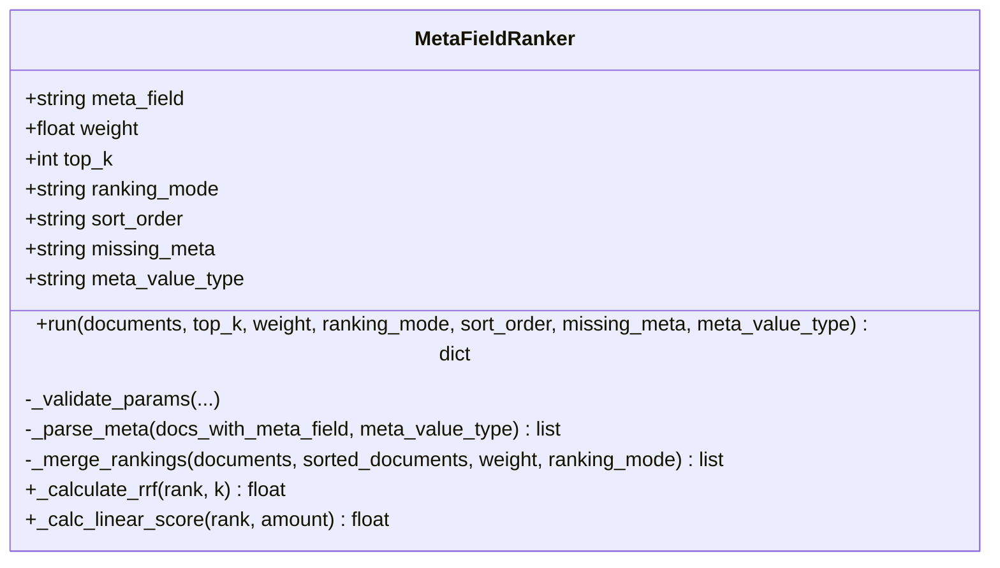
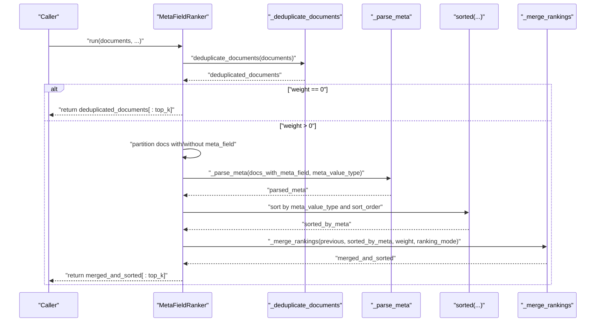
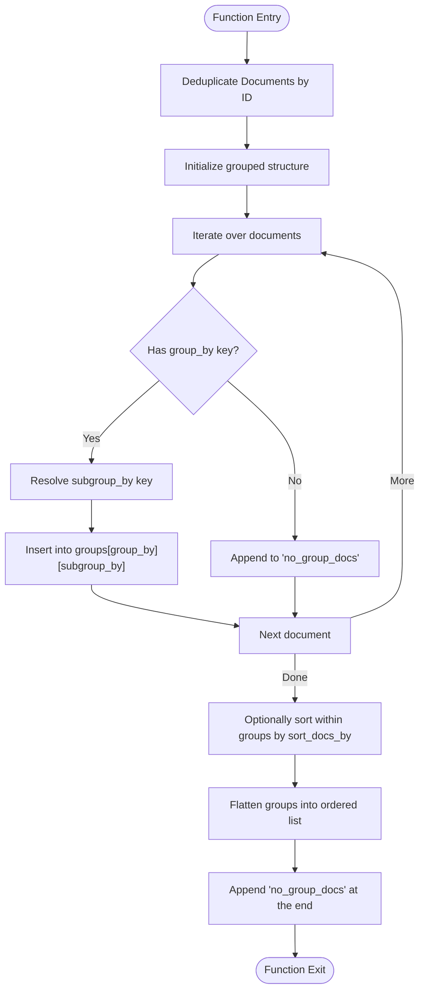
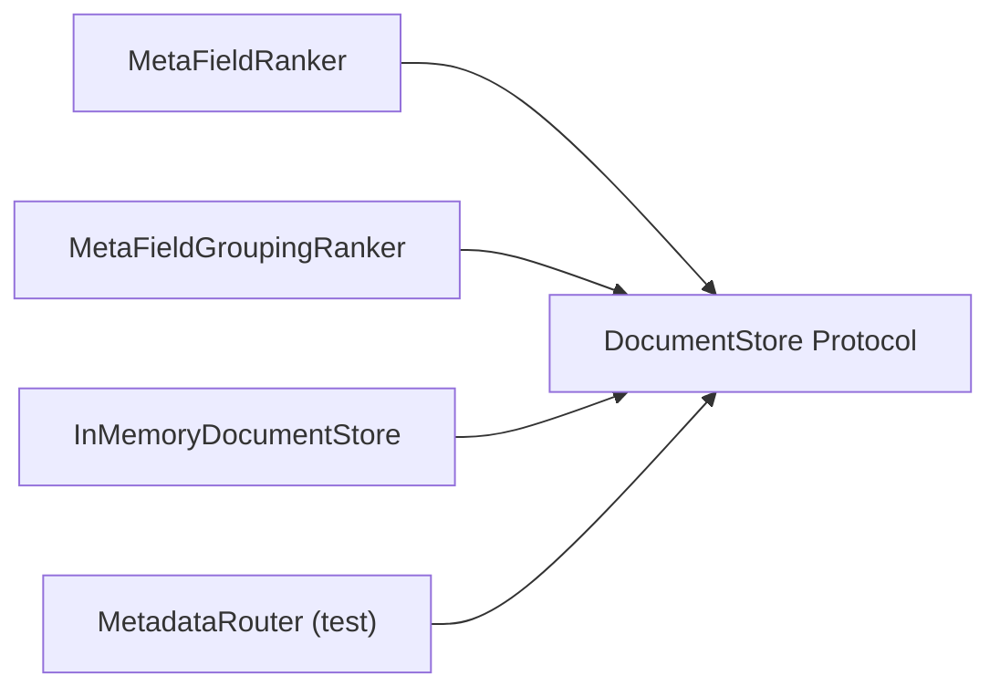

# Meta Field Rankers

<cite>
**Referenced Files in This Document**
- [meta_field.py](file://haystack/components/rankers/meta_field.py)
- [meta_field_grouping_ranker.py](file://haystack/components/rankers/meta_field_grouping_ranker.py)
- [__init__.py](file://haystack/components/rankers/__init__.py)
- [protocol.py](file://haystack/document_stores/types/protocol.py)
- [document_store.py](file://haystack/document_stores/in_memory/document_store.py)
- [test_metafield.py](file://test/components/rankers/test_metafield.py)
- [test_meta_field_grouping_ranker.py](file://test/components/rankers/test_meta_field_grouping_ranker.py)
- [test_metadata_router.py](file://test/components/routers/test_metadata_router.py)
- [releasenotes fix-metafieldranker-weight-in-run-66ce13191e596214.yaml](file://releasenotes/notes/fix-metafieldranker-weight-in-run-66ce13191e596214.yaml)
- [releasenotes metaranker-missing-meta-options-1a969008d632a523.yaml](file://releasenotes/notes/metaranker-missing-meta-options-1a969008d632a523.yaml)
- [releasenotes fix-metafieldranker-weight-in-run-method-e4e11011a8b99c34.yaml](file://releasenotes/notes/fix-metafieldranker-weight-in-run-method-e4e11011a8b99c34.yaml)
- [releasenotes add-metadata-grouper-21ec05fd4a307425.yaml](file://releasenotes/notes/add-metadata-grouper-21ec05fd4a307425.yaml)
</cite>

## Table of Contents
1. [Introduction](#introduction)
2. [Project Structure](#project-structure)
3. [Core Components](#core-components)
4. [Architecture Overview](#architecture-overview)
5. [Detailed Component Analysis](#detailed-component-analysis)
6. [Dependency Analysis](#dependency-analysis)
7. [Performance Considerations](#performance-considerations)
8. [Troubleshooting Guide](#troubleshooting-guide)
9. [Conclusion](#conclusion)
10. [Appendices](#appendices)

## Introduction
This document provides comprehensive API documentation for the meta-field ranking components in the Haystack library. It focuses on:
- MetaFieldRanker: sorts and re-ranks documents based on a single metadata field, combining previous scores with metadata-driven ordering via configurable modes and weights.
- MetaFieldGroupingRanker: reorders documents by grouping them on one or more metadata keys, optionally sorting within groups/subgroups, and placing documents without group keys at the end.

It explains field mapping configurations, weight assignment strategies, custom scoring functions, and practical examples for timestamp-based ranking, categorical field sorting, and multi-field aggregation. Guidance is included for metadata schema design, performance optimization, and integration with document stores that support metadata queries.

## Project Structure
The meta-field ranking components live under the rankers module and are exported via the rankers package initializer. They integrate with the broader Haystack ecosystem, including document stores and pipelines.

**Diagram sources**
- [meta_field.py](file://haystack/components/rankers/meta_field.py#L18-L430)
- [meta_field_grouping_ranker.py](file://haystack/components/rankers/meta_field_grouping_ranker.py#L12-L124)
- [__init__.py](file://haystack/components/rankers/__init__.py#L10-L35)
- [protocol.py](file://haystack/document_stores/types/protocol.py#L11-L136)
- [document_store.py](file://haystack/document_stores/in_memory/document_store.py#L59-L200)
- [test_metafield.py](file://test/components/rankers/test_metafield.py#L1-L307)
- [test_meta_field_grouping_ranker.py](file://test/components/rankers/test_meta_field_grouping_ranker.py#L1-L183)
- [test_metadata_router.py](file://test/components/routers/test_metadata_router.py#L58-L115)

**Section sources**
- [__init__.py](file://haystack/components/rankers/__init__.py#L10-L35)

## Core Components
- MetaFieldRanker
  - Purpose: Sorts and re-ranks documents by a single metadata field, merging previous scores with metadata-based ordering using either Reciprocal Rank Fusion or Linear Score combination.
  - Key capabilities:
    - Ascending/descending sort order
    - Type-aware parsing for numeric and date metadata
    - Handling of missing metadata with configurable placement ("drop", "top", "bottom")
    - Weighted combination of prior scores and metadata ranking
    - Deduplication by document ID during processing
- MetaFieldGroupingRanker
  - Purpose: Reorders documents by grouping on a primary key, optionally subgroups by a second key, and optionally sorts within groups/subgroups by a third key. Documents without a group are placed at the end.

**Section sources**
- [meta_field.py](file://haystack/components/rankers/meta_field.py#L18-L430)
- [meta_field_grouping_ranker.py](file://haystack/components/rankers/meta_field_grouping_ranker.py#L12-L124)

## Architecture Overview
The components operate on lists of Documents and return a dictionary containing the sorted/reordered list. They rely on:
- Document deduplication utilities
- Optional metadata parsing
- Ranking mode scoring (RRF or linear)
- Optional document store filtering for metadata queries (outside the rankers themselves)

**Diagram sources**
- [meta_field.py](file://haystack/components/rankers/meta_field.py#L162-L327)
- [protocol.py](file://haystack/document_stores/types/protocol.py#L41-L107)

## Detailed Component Analysis

### MetaFieldRanker
- Responsibilities
  - Validate and normalize parameters
  - Deduplicate input documents by ID
  - Handle missing metadata according to policy
  - Parse metadata values when requested
  - Sort documents by the chosen field and order
  - Merge rankings using either Reciprocal Rank Fusion or Linear Score
  - Apply top_k truncation

- Key parameters and behaviors
  - meta_field: the metadata key to rank by
  - weight: in [0,1]; 0 disables meta-field ranking; 1 relies solely on meta-field ordering
  - ranking_mode: "reciprocal_rank_fusion" or "linear_score"
  - sort_order: "ascending" or "descending"
  - missing_meta: "drop", "top", "bottom"
  - meta_value_type: "float", "int", "date", or None; enables parsing of string metadata values
  - top_k: optional truncation of results

- Scoring and merging
  - Reciprocal Rank Fusion: combines ranks using a fixed constant and a weighting factor
  - Linear Score: scales metadata rank to [0,1] and blends with existing scores in [0,1]

- Error handling and warnings
  - Validates parameter ranges and values
  - Warns when metadata cannot be parsed or compared
  - Warns when documents lack the target metadata key
  - Handles edge cases gracefully by falling back to original ordering

- Examples and usage patterns
  - Timestamp-based ranking: set meta_value_type to "date" and sort_order to "descending" for newest-first
  - Categorical field sorting: set meta_value_type to None and provide a custom sort order
  - Multi-field aggregation: use MetaFieldGroupingRanker to pre-group/sort chunks before reranking

**Diagram sources**
- [meta_field.py](file://haystack/components/rankers/meta_field.py#L44-L109)
- [meta_field.py](file://haystack/components/rankers/meta_field.py#L162-L327)
- [meta_field.py](file://haystack/components/rankers/meta_field.py#L372-L430)

**Section sources**
- [meta_field.py](file://haystack/components/rankers/meta_field.py#L18-L430)
- [test_metafield.py](file://test/components/rankers/test_metafield.py#L13-L307)

#### Sequence: run() execution flow

**Diagram sources**
- [meta_field.py](file://haystack/components/rankers/meta_field.py#L234-L327)

### MetaFieldGroupingRanker
- Responsibilities
  - Group documents by a primary metadata key
  - Optionally subgroup by a second key
  - Optionally sort within groups/subgroups by a third key
  - Place documents without a group at the end
  - Deduplicate input documents by ID

- Key parameters and behaviors
  - group_by: primary grouping key
  - subgroup_by: optional secondary grouping key
  - sort_docs_by: optional key to sort within groups/subgroups
  - Documents without a group are appended last

- Typical use cases
  - Pre-sorting document chunks by logical units (e.g., chapters, sections)
  - Ensuring downstream LLM processing sees coherent segments

**Diagram sources**
- [meta_field_grouping_ranker.py](file://haystack/components/rankers/meta_field_grouping_ranker.py#L77-L123)

**Section sources**
- [meta_field_grouping_ranker.py](file://haystack/components/rankers/meta_field_grouping_ranker.py#L12-L124)
- [test_meta_field_grouping_ranker.py](file://test/components/rankers/test_meta_field_grouping_ranker.py#L32-L183)

## Dependency Analysis
- Internal dependencies
  - Both rankers depend on the Document dataclass and internal deduplication utilities
  - MetaFieldRanker uses date parsing for date-type metadata
  - MetaFieldRanker merges scores using either RRF or linear scaling
- External integration points
  - DocumentStore protocol defines how filters are applied to retrieve documents with specific metadata
  - InMemoryDocumentStore demonstrates metadata query capabilities and filter usage

**Diagram sources**
- [meta_field.py](file://haystack/components/rankers/meta_field.py#L12-L15)
- [meta_field_grouping_ranker.py](file://haystack/components/rankers/meta_field_grouping_ranker.py#L8-L9)
- [protocol.py](file://haystack/document_stores/types/protocol.py#L11-L136)
- [document_store.py](file://haystack/document_stores/in_memory/document_store.py#L59-L200)
- [test_metadata_router.py](file://test/components/routers/test_metadata_router.py#L58-L115)

**Section sources**
- [protocol.py](file://haystack/document_stores/types/protocol.py#L41-L107)
- [document_store.py](file://haystack/document_stores/in_memory/document_store.py#L59-L200)

## Performance Considerations
- Deduplication cost
  - Both components deduplicate by ID before processing; this ensures correctness but adds O(n) overhead. Keep upstream retrievers/queries minimal to reduce duplication.
- Sorting complexity
  - Sorting by metadata is O(n log n); ensure meta_value_type is used when values are strings to avoid repeated parsing.
- Ranking mode selection
  - Reciprocal Rank Fusion is robust and does not require score normalization; Linear Score requires scores in [0,1].
- Memory footprint
  - Grouping and sorting retain intermediate lists; for very large sets, consider reducing top_k or pre-filtering via document store filters.
- Parsing costs
  - meta_value_type triggers parsing; ensure all values under the target key are strings to enable safe conversion.

[No sources needed since this section provides general guidance]

## Troubleshooting Guide
Common issues and resolutions:
- Weight parameter not applied in run()
  - Fixed: the run() method now properly respects the weight parameter passed at runtime
- Weight equals zero behavior
  - Fixed: when weight=0, the component returns the original deduplicated documents without re-ranking
- Missing metadata handling
  - Use missing_meta to control placement ("drop", "top", "bottom"); warnings are logged when documents lack the target key
- Unsortable or mixed-type metadata
  - The component logs a warning and falls back to original ordering; ensure consistent types or convert to strings and use meta_value_type
- Linear score warnings
  - If scores are missing or outside [0,1], the component logs warnings and defaults appropriately

**Section sources**
- [releasenotes fix-metafieldranker-weight-in-run-66ce13191e596214.yaml](file://releasenotes/notes/fix-metafieldranker-weight-in-run-66ce13191e596214.yaml#L1-L5)
- [releasenotes fix-metafieldranker-weight-in-run-method-e4e11011a8b99c34.yaml](file://releasenotes/notes/fix-metafieldranker-weight-in-run-method-e4e11011a8b99c34.yaml#L1-L5)
- [releasenotes metaranker-missing-meta-options-1a969008d632a523.yaml](file://releasenotes/notes/metaranker-missing-meta-options-1a969008d632a523.yaml#L1-L7)
- [meta_field.py](file://haystack/components/rankers/meta_field.py#L254-L313)
- [test_metafield.py](file://test/components/rankers/test_metafield.py#L121-L184)

## Conclusion
MetaFieldRanker and MetaFieldGroupingRanker provide flexible, efficient mechanisms to incorporate metadata into document ranking and pre-processing:
- MetaFieldRanker excels at precise, weighted re-ranking using a single metadata field with robust handling of missing data and type-safe parsing.
- MetaFieldGroupingRanker streamlines downstream processing by organizing documents into coherent groups and subgroups.

Together, they enable sophisticated metadata-driven workflows integrated with Haystack’s document stores and pipelines.

[No sources needed since this section summarizes without analyzing specific files]

## Appendices

### API Reference: MetaFieldRanker
- Parameters
  - meta_field: string
  - weight: float in [0,1]
  - top_k: integer or None
  - ranking_mode: "reciprocal_rank_fusion" or "linear_score"
  - sort_order: "ascending" or "descending"
  - missing_meta: "drop", "top", "bottom"
  - meta_value_type: "float", "int", "date", or None
- Methods
  - run(documents, top_k, weight, ranking_mode, sort_order, missing_meta, meta_value_type) -> dict with "documents"
- Notes
  - Supports runtime overrides for all parameters except meta_field
  - Deduplicates by ID before processing
  - Logs warnings for edge cases; returns original order when unsafe to sort

**Section sources**
- [meta_field.py](file://haystack/components/rankers/meta_field.py#L44-L109)
- [meta_field.py](file://haystack/components/rankers/meta_field.py#L162-L327)

### API Reference: MetaFieldGroupingRanker
- Parameters
  - group_by: string
  - subgroup_by: string or None
  - sort_docs_by: string or None
- Methods
  - run(documents) -> dict with "documents"
- Notes
  - Deduplicates by ID before processing
  - Places documents without a group at the end
  - Sorts within groups/subgroups when sort_docs_by is provided

**Section sources**
- [meta_field_grouping_ranker.py](file://haystack/components/rankers/meta_field_grouping_ranker.py#L60-L90)
- [meta_field_grouping_ranker.py](file://haystack/components/rankers/meta_field_grouping_ranker.py#L77-L123)

### Integration with Document Stores
- DocumentStore protocol supports nested filter dictionaries with comparison and logic operators, enabling metadata queries before passing documents to rankers.
- InMemoryDocumentStore demonstrates filter usage and metadata query capabilities.

**Section sources**
- [protocol.py](file://haystack/document_stores/types/protocol.py#L41-L107)
- [document_store.py](file://haystack/document_stores/in_memory/document_store.py#L59-L200)

### Example Scenarios
- Timestamp-based ranking
  - Set meta_value_type to "date" and sort_order to "descending" to prioritize newer items
- Categorical field sorting
  - Provide a custom sort order for categories; ensure consistent types
- Multi-field aggregation
  - Use MetaFieldGroupingRanker to organize chunks by logical units, then apply MetaFieldRanker for final ordering

**Section sources**
- [meta_field.py](file://haystack/components/rankers/meta_field.py#L82-L91)
- [meta_field_grouping_ranker.py](file://haystack/components/rankers/meta_field_grouping_ranker.py#L14-L24)