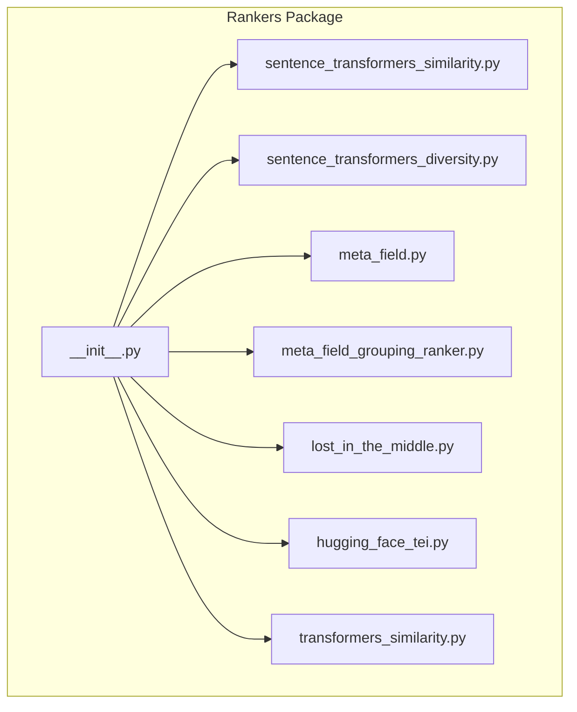
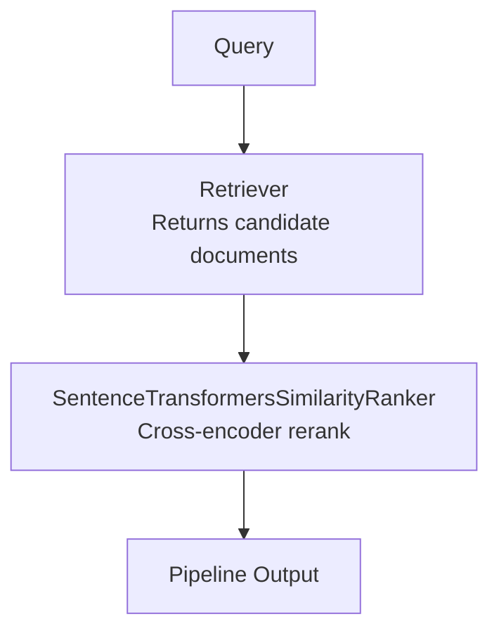
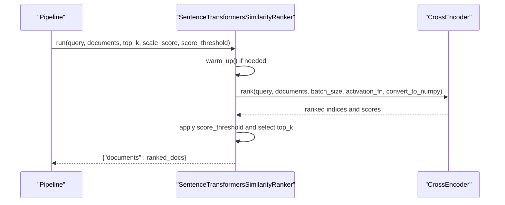
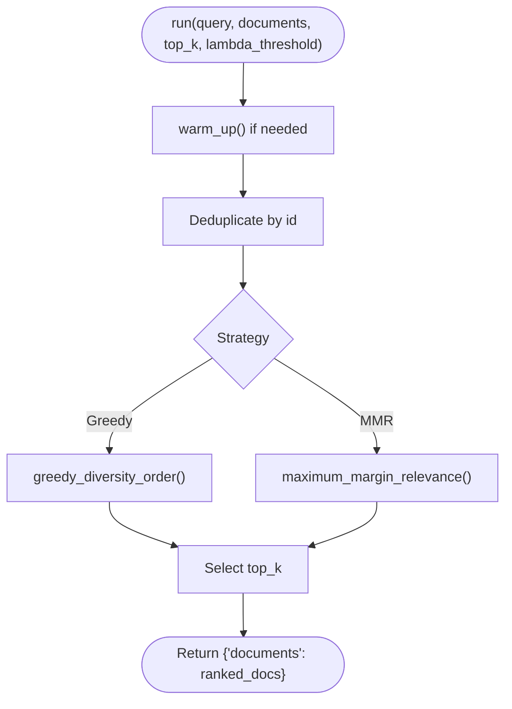
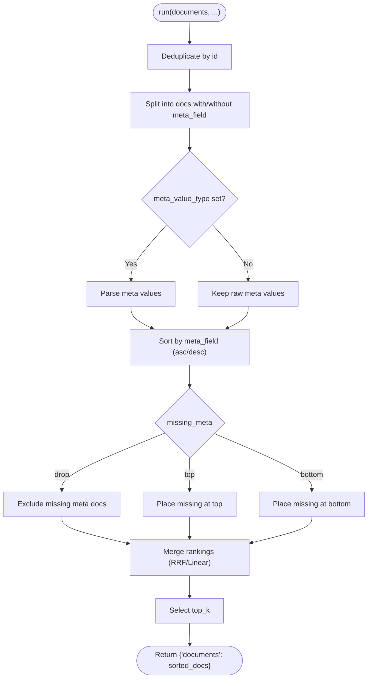
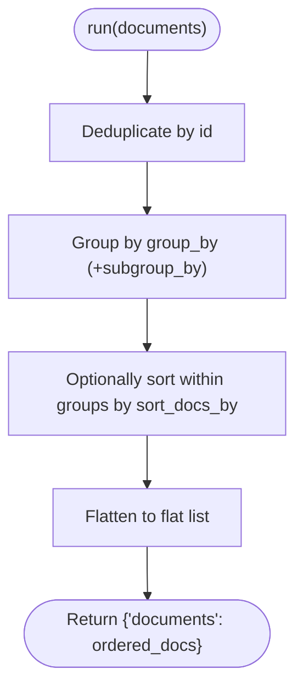
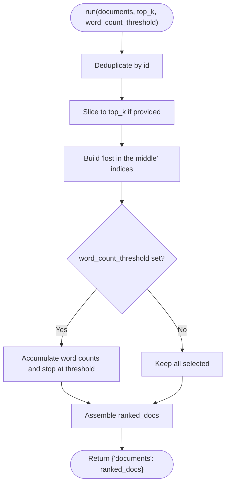
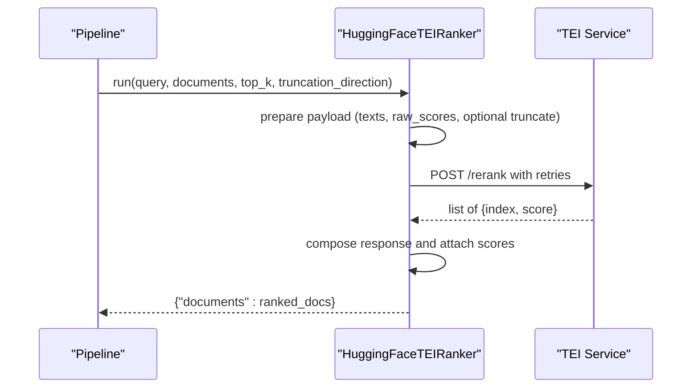
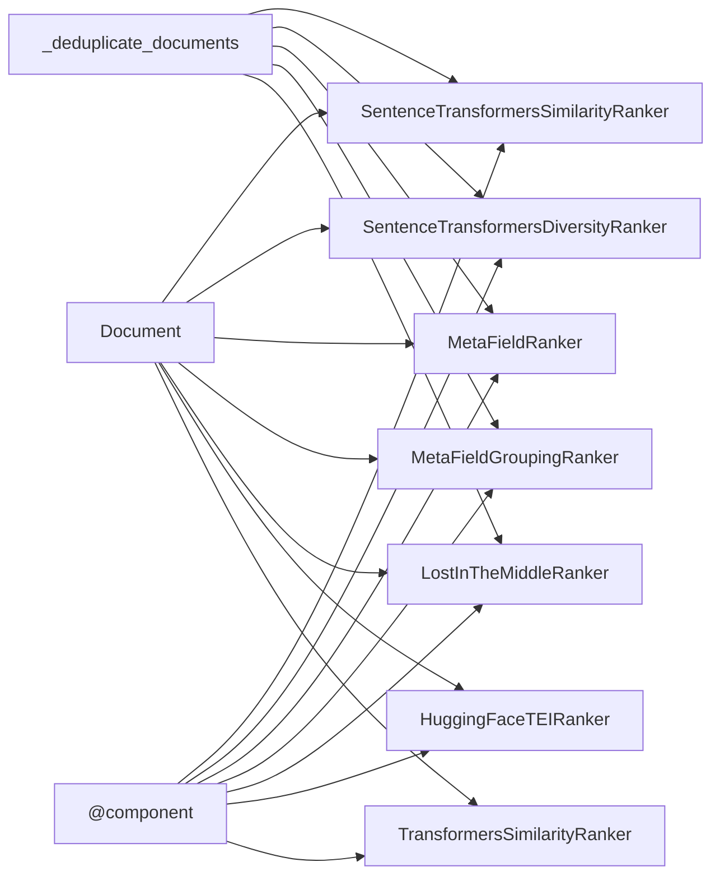

# Ranker APIs

<cite>
**Referenced Files in This Document**
- [__init__.py](file://haystack/components/rankers/__init__.py)
- [sentence_transformers_similarity.py](file://haystack/components/rankers/sentence_transformers_similarity.py)
- [sentence_transformers_diversity.py](file://haystack/components/rankers/sentence_transformers_diversity.py)
- [meta_field.py](file://haystack/components/rankers/meta_field.py)
- [meta_field_grouping_ranker.py](file://haystack/components/rankers/meta_field_grouping_ranker.py)
- [lost_in_the_middle.py](file://haystack/components/rankers/lost_in_the_middle.py)
- [hugging_face_tei.py](file://haystack/components/rankers/hugging_face_tei.py)
- [transformers_similarity.py](file://haystack/components/rankers/transformers_similarity.py)
- [rankers_api.yml](file://pydoc/rankers_api.yml)
- [sentencetransformerssimilarityranker.mdx](file://docs-website/versioned_docs/version-2.25/pipeline-components/rankers/sentencetransformerssimilarityranker.mdx)
</cite>

## Table of Contents
1. [Introduction](#introduction)
2. [Project Structure](#project-structure)
3. [Core Components](#core-components)
4. [Architecture Overview](#architecture-overview)
5. [Detailed Component Analysis](#detailed-component-analysis)
6. [Dependency Analysis](#dependency-analysis)
7. [Performance Considerations](#performance-considerations)
8. [Troubleshooting Guide](#troubleshooting-guide)
9. [Conclusion](#conclusion)
10. [Appendices](#appendices)

## Introduction
This document provides comprehensive API documentation for Haystack Ranker components. It covers document scoring and ranking APIs across:
- Similarity-based ranking (cross-encoder reranking and embedding-based similarity)
- Diversity ranking (greedy diversity ordering and maximum margin relevance)
- Meta-field grouping and meta-field-driven ranking with relevance fusion
- Specialized rankers such as LostInTheMiddle and TEI-based rankers

It details method signatures, parameter specifications, weight configurations, and custom scoring functions. It also includes examples for different ranking scenarios, performance optimization tips, and integration with retrieval pipelines.

## Project Structure
Ranker components live under haystack/components/rankers and are lazily imported via the rankers package initializer. The pydoc configuration enumerates supported modules for automated API generation.

**Diagram sources**
- [__init__.py](file://haystack/components/rankers/__init__.py#L10-L35)
- [sentence_transformers_similarity.py](file://haystack/components/rankers/sentence_transformers_similarity.py#L20-L40)
- [sentence_transformers_diversity.py](file://haystack/components/rankers/sentence_transformers_diversity.py#L73-L113)
- [meta_field.py](file://haystack/components/rankers/meta_field.py#L18-L42)
- [meta_field_grouping_ranker.py](file://haystack/components/rankers/meta_field_grouping_ranker.py#L12-L26)
- [lost_in_the_middle.py](file://haystack/components/rankers/lost_in_the_middle.py#L10-L27)
- [hugging_face_tei.py](file://haystack/components/rankers/hugging_face_tei.py#L29-L60)
- [transformers_similarity.py](file://haystack/components/rankers/transformers_similarity.py#L24-L50)

**Section sources**
- [__init__.py](file://haystack/components/rankers/__init__.py#L10-L35)
- [rankers_api.yml](file://pydoc/rankers_api.yml#L1-L14)

## Core Components
This section summarizes the public APIs and responsibilities of each ranker.

- SentenceTransformersSimilarityRanker
  - Purpose: Cross-encoder reranking with optional scaling and thresholding.
  - Key parameters: model, device, token, top_k, query/document prefixes, meta_fields_to_embed, embedding_separator, scale_score, score_threshold, trust_remote_code, model_kwargs, tokenizer_kwargs, config_kwargs, backend, batch_size.
  - Methods: warm_up(), run(query, documents, top_k, scale_score, score_threshold).
  - Output: {"documents": List[Document]} with scores populated.

- SentenceTransformersDiversityRanker
  - Purpose: Diversity-aware ranking using greedy diversity ordering or maximum margin relevance (MMR).
  - Key parameters: model, top_k, device, token, similarity ("cosine"|"dot_product"), query/document prefixes, meta_fields_to_embed, embedding_separator, strategy ("greedy_diversity_order"|"maximum_margin_relevance"), lambda_threshold, model_kwargs, tokenizer_kwargs, config_kwargs, backend.
  - Methods: warm_up(), run(query, documents, top_k, lambda_threshold).
  - Output: {"documents": List[Document]}.

- MetaFieldRanker
  - Purpose: Rank by a specified meta field with configurable merge modes and missing-meta behavior.
  - Key parameters: meta_field, weight [0..1], top_k, ranking_mode ("reciprocal_rank_fusion"|"linear_score"), sort_order ("ascending"|"descending"), missing_meta ("drop"|"top"|"bottom"), meta_value_type ("float"|"int"|"date"|None).
  - Methods: run(documents, top_k, weight, ranking_mode, sort_order, missing_meta, meta_value_type).
  - Output: {"documents": List[Document]} with merged scores.

- MetaFieldGroupingRanker
  - Purpose: Group and reorder documents by metadata keys, optionally sorting within groups/subgroups.
  - Key parameters: group_by, subgroup_by, sort_docs_by.
  - Methods: run(documents).
  - Output: {"documents": List[Document]}.

- LostInTheMiddleRanker
  - Purpose: Reorder documents to place most relevant at the edges and least relevant in the middle; supports word count threshold and top_k.
  - Key parameters: word_count_threshold, top_k.
  - Methods: run(documents, top_k, word_count_threshold).
  - Output: {"documents": List[Document]}.

- HuggingFaceTEIRanker
  - Purpose: Rerank via a remote TEI endpoint (self-hosted or HF Inference Endpoints).
  - Key parameters: url, top_k, raw_scores, timeout, max_retries, retry_status_codes, token.
  - Methods: run(query, documents, top_k, truncation_direction), run_async(query, documents, top_k, truncation_direction).
  - Output: {"documents": List[Document]}.

- TransformersSimilarityRanker
  - Purpose: Legacy cross-encoder reranking using transformers; superseded by SentenceTransformersSimilarityRanker.
  - Key parameters: model, device, token, top_k, query/document prefixes, meta_fields_to_embed, embedding_separator, scale_score, calibration_factor, score_threshold, model_kwargs, tokenizer_kwargs, batch_size.
  - Methods: warm_up(), run(query, documents, top_k, scale_score, calibration_factor, score_threshold).
  - Output: {"documents": List[Document]}.

**Section sources**
- [sentence_transformers_similarity.py](file://haystack/components/rankers/sentence_transformers_similarity.py#L20-L40)
- [sentence_transformers_similarity.py](file://haystack/components/rankers/sentence_transformers_similarity.py#L42-L117)
- [sentence_transformers_similarity.py](file://haystack/components/rankers/sentence_transformers_similarity.py#L213-L297)
- [sentence_transformers_diversity.py](file://haystack/components/rankers/sentence_transformers_diversity.py#L73-L113)
- [sentence_transformers_diversity.py](file://haystack/components/rankers/sentence_transformers_diversity.py#L115-L196)
- [sentence_transformers_diversity.py](file://haystack/components/rankers/sentence_transformers_diversity.py#L388-L429)
- [meta_field.py](file://haystack/components/rankers/meta_field.py#L18-L42)
- [meta_field.py](file://haystack/components/rankers/meta_field.py#L44-L109)
- [meta_field.py](file://haystack/components/rankers/meta_field.py#L162-L327)
- [meta_field_grouping_ranker.py](file://haystack/components/rankers/meta_field_grouping_ranker.py#L12-L26)
- [meta_field_grouping_ranker.py](file://haystack/components/rankers/meta_field_grouping_ranker.py#L60-L75)
- [meta_field_grouping_ranker.py](file://haystack/components/rankers/meta_field_grouping_ranker.py#L76-L124)
- [lost_in_the_middle.py](file://haystack/components/rankers/lost_in_the_middle.py#L10-L38)
- [lost_in_the_middle.py](file://haystack/components/rankers/lost_in_the_middle.py#L40-L61)
- [lost_in_the_middle.py](file://haystack/components/rankers/lost_in_the_middle.py#L62-L138)
- [hugging_face_tei.py](file://haystack/components/rankers/hugging_face_tei.py#L29-L60)
- [hugging_face_tei.py](file://haystack/components/rankers/hugging_face_tei.py#L62-L94)
- [hugging_face_tei.py](file://haystack/components/rankers/hugging_face_tei.py#L166-L226)
- [hugging_face_tei.py](file://haystack/components/rankers/hugging_face_tei.py#L227-L285)
- [transformers_similarity.py](file://haystack/components/rankers/transformers_similarity.py#L24-L50)
- [transformers_similarity.py](file://haystack/components/rankers/transformers_similarity.py#L52-L149)
- [transformers_similarity.py](file://haystack/components/rankers/transformers_similarity.py#L221-L328)

## Architecture Overview
High-level architecture of a typical retrieval-reranking pipeline using similarity-based rankers.

**Diagram sources**
- [sentencetransformerssimilarityranker.mdx](file://docs-website/versioned_docs/version-2.25/pipeline-components/rankers/sentencetransformerssimilarityranker.mdx#L90-L110)

## Detailed Component Analysis

### SentenceTransformersSimilarityRanker
- Responsibilities
  - Loads a cross-encoder model (optionally via ONNX/OpenVINO).
  - Prepares query and document texts (prefixes/suffixes and optional metadata concatenation).
  - Reranks candidates and optionally scales scores and applies thresholds.
- Method signature highlights
  - run(query: str, documents: List[Document], top_k: Optional[int], scale_score: Optional[bool], score_threshold: Optional[float]) -> Dict[str, List[Document]]
- Key parameters
  - model, device, token, top_k, query_prefix, query_suffix, document_prefix, document_suffix, meta_fields_to_embed, embedding_separator, scale_score, score_threshold, trust_remote_code, model_kwargs, tokenizer_kwargs, config_kwargs, backend, batch_size.
- Scoring and relevance adjustment
  - Uses a cross-encoder to compute logits and optionally applies sigmoid scaling.
  - Supports score threshold filtering and top_k selection.
- Integration tips
  - Use query/document prefixes/suffixes to align with model instructions.
  - Adjust batch_size to balance throughput and memory usage.

**Diagram sources**
- [sentence_transformers_similarity.py](file://haystack/components/rankers/sentence_transformers_similarity.py#L149-L163)
- [sentence_transformers_similarity.py](file://haystack/components/rankers/sentence_transformers_similarity.py#L277-L296)

**Section sources**
- [sentence_transformers_similarity.py](file://haystack/components/rankers/sentence_transformers_similarity.py#L20-L40)
- [sentence_transformers_similarity.py](file://haystack/components/rankers/sentence_transformers_similarity.py#L42-L117)
- [sentence_transformers_similarity.py](file://haystack/components/rankers/sentence_transformers_similarity.py#L213-L297)

### SentenceTransformersDiversityRanker
- Responsibilities
  - Implements greedy diversity ordering or maximum margin relevance (MMR).
  - Supports cosine/dot-product similarity and normalization.
- Method signature highlights
  - run(query: str, documents: List[Document], top_k: Optional[int], lambda_threshold: Optional[float]) -> Dict[str, List[Document]]
- Key parameters
  - model, top_k, device, token, similarity ("cosine"|"dot_product"), query/document prefixes, meta_fields_to_embed, embedding_separator, strategy ("greedy_diversity_order"|"maximum_margin_relevance"), lambda_threshold, model_kwargs, tokenizer_kwargs, config_kwargs, backend.
- Scoring and relevance adjustment
  - Greedy diversity: iteratively selects documents that maximize diversity against already selected set.
  - MMR: balances relevance and diversity controlled by lambda_threshold ∈ [0,1].
- Integration tips
  - Use MMR with lambda_threshold ≈ 0 for more diverse outputs; ≈ 1 for more relevant outputs.

**Diagram sources**
- [sentence_transformers_diversity.py](file://haystack/components/rankers/sentence_transformers_diversity.py#L388-L429)
- [sentence_transformers_diversity.py](file://haystack/components/rankers/sentence_transformers_diversity.py#L276-L321)
- [sentence_transformers_diversity.py](file://haystack/components/rankers/sentence_transformers_diversity.py#L335-L382)

**Section sources**
- [sentence_transformers_diversity.py](file://haystack/components/rankers/sentence_transformers_diversity.py#L73-L113)
- [sentence_transformers_diversity.py](file://haystack/components/rankers/sentence_transformers_diversity.py#L115-L196)
- [sentence_transformers_diversity.py](file://haystack/components/rankers/sentence_transformers_diversity.py#L388-L429)

### MetaFieldRanker
- Responsibilities
  - Sorts documents by a specified meta field and merges with previous scores using reciprocal rank fusion or linear scoring.
  - Handles missing meta values and type parsing (float, int, date).
- Method signature highlights
  - run(documents: List[Document], top_k: Optional[int], weight: Optional[float], ranking_mode: Optional[str], sort_order: Optional[str], missing_meta: Optional[str], meta_value_type: Optional[str]) -> Dict[str, List[Document]]
- Key parameters
  - meta_field, weight [0..1], top_k, ranking_mode ("reciprocal_rank_fusion"|"linear_score"), sort_order ("ascending"|"descending"), missing_meta ("drop"|"top"|"bottom"), meta_value_type ("float"|"int"|"date"|None).
- Scoring and relevance adjustment
  - weight=0 disables meta-field ranking; weight=1 relies solely on meta-field ordering.
  - Reciprocal Rank Fusion combines ranks; Linear score normalizes meta-field rank to [0,1].

**Diagram sources**
- [meta_field.py](file://haystack/components/rankers/meta_field.py#L162-L327)
- [meta_field.py](file://haystack/components/rankers/meta_field.py#L372-L407)

**Section sources**
- [meta_field.py](file://haystack/components/rankers/meta_field.py#L18-L42)
- [meta_field.py](file://haystack/components/rankers/meta_field.py#L44-L109)
- [meta_field.py](file://haystack/components/rankers/meta_field.py#L162-L327)

### MetaFieldGroupingRanker
- Responsibilities
  - Groups documents by a primary key and optionally a secondary key; sorts within groups; places documents without group keys at the end.
- Method signature highlights
  - run(documents: List[Document]) -> Dict[str, List[Document]]
- Key parameters
  - group_by, subgroup_by, sort_docs_by.
- Integration tips
  - Useful to organize split/chunked documents for downstream LLM processing.

**Diagram sources**
- [meta_field_grouping_ranker.py](file://haystack/components/rankers/meta_field_grouping_ranker.py#L76-L124)

**Section sources**
- [meta_field_grouping_ranker.py](file://haystack/components/rankers/meta_field_grouping_ranker.py#L12-L26)
- [meta_field_grouping_ranker.py](file://haystack/components/rankers/meta_field_grouping_ranker.py#L60-L75)
- [meta_field_grouping_ranker.py](file://haystack/components/rankers/meta_field_grouping_ranker.py#L76-L124)

### LostInTheMiddleRanker
- Responsibilities
  - Reorders documents so that the most relevant appear at the edges and least relevant in the middle; supports word count threshold and top_k.
- Method signature highlights
  - run(documents: List[Document], top_k: Optional[int], word_count_threshold: Optional[int]) -> Dict[str, List[Document]]
- Key parameters
  - word_count_threshold, top_k.
- Integration tips
  - Typically used as the final ranker before prompt assembly to leverage LLM long-context strengths.

**Diagram sources**
- [lost_in_the_middle.py](file://haystack/components/rankers/lost_in_the_middle.py#L62-L138)

**Section sources**
- [lost_in_the_middle.py](file://haystack/components/rankers/lost_in_the_middle.py#L10-L38)
- [lost_in_the_middle.py](file://haystack/components/rankers/lost_in_the_middle.py#L40-L61)
- [lost_in_the_middle.py](file://haystack/components/rankers/lost_in_the_middle.py#L62-L138)

### HuggingFaceTEIRanker
- Responsibilities
  - Calls a remote TEI reranking endpoint; supports synchronous and asynchronous requests with retries and optional truncation.
- Method signature highlights
  - run(query: str, documents: List[Document], top_k: Optional[int], truncation_direction: Optional[TruncationDirection]) -> Dict[str, List[Document]]
  - run_async(...): async variant.
- Key parameters
  - url, top_k, raw_scores, timeout, max_retries, retry_status_codes, token.
- Integration tips
  - Configure Authorization header via token; enable raw_scores for downstream score usage.

**Diagram sources**
- [hugging_face_tei.py](file://haystack/components/rankers/hugging_face_tei.py#L166-L226)
- [hugging_face_tei.py](file://haystack/components/rankers/hugging_face_tei.py#L227-L285)

**Section sources**
- [hugging_face_tei.py](file://haystack/components/rankers/hugging_face_tei.py#L29-L60)
- [hugging_face_tei.py](file://haystack/components/rankers/hugging_face_tei.py#L62-L94)
- [hugging_face_tei.py](file://haystack/components/rankers/hugging_face_tei.py#L166-L226)
- [hugging_face_tei.py](file://haystack/components/rankers/hugging_face_tei.py#L227-L285)

### TransformersSimilarityRanker (Legacy)
- Responsibilities
  - Legacy cross-encoder reranking using transformers; superseded by SentenceTransformersSimilarityRanker.
- Method signature highlights
  - run(query: str, documents: List[Document], top_k: Optional[int], scale_score: Optional[bool], calibration_factor: Optional[float], score_threshold: Optional[float]) -> Dict[str, List[Document]]
- Key parameters
  - model, device, token, top_k, query/document prefixes, meta_fields_to_embed, embedding_separator, scale_score, calibration_factor, score_threshold, model_kwargs, tokenizer_kwargs, batch_size.
- Notes
  - Emits a deprecation warning; prefer SentenceTransformersSimilarityRanker.

**Section sources**
- [transformers_similarity.py](file://haystack/components/rankers/transformers_similarity.py#L24-L50)
- [transformers_similarity.py](file://haystack/components/rankers/transformers_similarity.py#L52-L149)
- [transformers_similarity.py](file://haystack/components/rankers/transformers_similarity.py#L221-L328)

## Dependency Analysis
- Internal dependencies
  - All rankers depend on Document and the @component decorator for pipeline compatibility.
  - Some rankers depend on external libraries (sentence-transformers, transformers) guarded by LazyImport.
- External dependencies
  - TEI ranker depends on HTTP client utilities for retries and timeouts.
- Coupling and cohesion
  - Rankers are cohesive around a single responsibility (ranking) and loosely coupled via the Document interface and shared deduplication utility.

**Diagram sources**
- [sentence_transformers_similarity.py](file://haystack/components/rankers/sentence_transformers_similarity.py#L9-L13)
- [sentence_transformers_diversity.py](file://haystack/components/rankers/sentence_transformers_diversity.py#L8-L12)
- [meta_field.py](file://haystack/components/rankers/meta_field.py#L12-L13)
- [meta_field_grouping_ranker.py](file://haystack/components/rankers/meta_field_grouping_ranker.py#L8-L9)
- [lost_in_the_middle.py](file://haystack/components/rankers/lost_in_the_middle.py#L6-L7)
- [hugging_face_tei.py](file://haystack/components/rankers/hugging_face_tei.py#L10-L13)
- [transformers_similarity.py](file://haystack/components/rankers/transformers_similarity.py#L9-L13)

**Section sources**
- [__init__.py](file://haystack/components/rankers/__init__.py#L10-L35)

## Performance Considerations
- Batch sizing
  - Increase batch_size for cross-encoder rankers to improve throughput; reduce if encountering memory pressure.
- Backend selection
  - For sentence-transformers models, choose backend "torch", "onnx", or "openvino" based on deployment needs.
- Model selection
  - Prefer smaller cross-encoders for latency-sensitive scenarios; larger models for accuracy.
- Deduplication
  - Rankers internally deduplicate by id; avoid redundant duplicates upstream to save compute.
- TEI tuning
  - Set appropriate timeout and max_retries; enable raw_scores only when needed to reduce payload size.
- Diversity ranking
  - MMR lambda_threshold trades off relevance vs. diversity; tune based on downstream tasks.
- Meta-field ranking
  - Use meta_value_type to parse strings into comparable types; otherwise sorting may fail or produce unexpected results.

[No sources needed since this section provides general guidance]

## Troubleshooting Guide
- Invalid top_k or weight values
  - Ensure top_k > 0; weight ∈ [0,1]; ranking_mode and sort_order are valid enums.
- TEI API errors
  - Check Authorization token; verify endpoint URL and network connectivity; inspect error payloads.
- Missing meta field
  - MetaFieldRanker logs warnings and can drop, place at top, or bottom missing entries; adjust missing_meta accordingly.
- Non-text documents
  - LostInTheMiddleRanker requires textual content; ensure all documents are text-type.
- Legacy component deprecation
  - TransformersSimilarityRanker emits a deprecation warning; migrate to SentenceTransformersSimilarityRanker.

**Section sources**
- [sentence_transformers_similarity.py](file://haystack/components/rankers/sentence_transformers_similarity.py#L120-L122)
- [sentence_transformers_diversity.py](file://haystack/components/rankers/sentence_transformers_diversity.py#L384-L387)
- [meta_field.py](file://haystack/components/rankers/meta_field.py#L120-L161)
- [hugging_face_tei.py](file://haystack/components/rankers/hugging_face_tei.py#L144-L155)
- [lost_in_the_middle.py](file://haystack/components/rankers/lost_in_the_middle.py#L103-L104)
- [transformers_similarity.py](file://haystack/components/rankers/transformers_similarity.py#L142-L148)

## Conclusion
Haystack provides a rich set of rankers tailored to different ranking needs: precise similarity reranking, diversity-aware ordering, meta-field driven fusion, grouping for downstream processing, and TEI integration for scalable reranking. By understanding each component’s parameters, scoring behavior, and integration patterns, you can build efficient and effective retrieval pipelines optimized for your use case.

[No sources needed since this section summarizes without analyzing specific files]

## Appendices

### API Reference Index
- SentenceTransformersSimilarityRanker
  - Constructor parameters: model, device, token, top_k, query_prefix, query_suffix, document_prefix, document_suffix, meta_fields_to_embed, embedding_separator, scale_score, score_threshold, trust_remote_code, model_kwargs, tokenizer_kwargs, config_kwargs, backend, batch_size.
  - run(query, documents, top_k=None, scale_score=None, score_threshold=None) -> Dict[str, List[Document]]

- SentenceTransformersDiversityRanker
  - Constructor parameters: model, top_k, device, token, similarity, query_prefix, query_suffix, document_prefix, document_suffix, meta_fields_to_embed, embedding_separator, strategy, lambda_threshold, model_kwargs, tokenizer_kwargs, config_kwargs, backend.
  - run(query, documents, top_k=None, lambda_threshold=None) -> Dict[str, List[Document]]

- MetaFieldRanker
  - Constructor parameters: meta_field, weight, top_k, ranking_mode, sort_order, missing_meta, meta_value_type.
  - run(documents, top_k=None, weight=None, ranking_mode=None, sort_order=None, missing_meta=None, meta_value_type=None) -> Dict[str, List[Document]]

- MetaFieldGroupingRanker
  - Constructor parameters: group_by, subgroup_by, sort_docs_by.
  - run(documents) -> Dict[str, List[Document]]

- LostInTheMiddleRanker
  - Constructor parameters: word_count_threshold, top_k.
  - run(documents, top_k=None, word_count_threshold=None) -> Dict[str, List[Document]]

- HuggingFaceTEIRanker
  - Constructor parameters: url, top_k, raw_scores, timeout, max_retries, retry_status_codes, token.
  - run(query, documents, top_k=None, truncation_direction=None) -> Dict[str, List[Document]]
  - run_async(query, documents, top_k=None, truncation_direction=None) -> Dict[str, List[Document]]

- TransformersSimilarityRanker (Legacy)
  - Constructor parameters: model, device, token, top_k, query_prefix, document_prefix, meta_fields_to_embed, embedding_separator, scale_score, calibration_factor, score_threshold, model_kwargs, tokenizer_kwargs, batch_size.
  - run(query, documents, top_k=None, scale_score=None, calibration_factor=None, score_threshold=None) -> Dict[str, List[Document]]

**Section sources**
- [sentence_transformers_similarity.py](file://haystack/components/rankers/sentence_transformers_similarity.py#L42-L117)
- [sentence_transformers_similarity.py](file://haystack/components/rankers/sentence_transformers_similarity.py#L213-L297)
- [sentence_transformers_diversity.py](file://haystack/components/rankers/sentence_transformers_diversity.py#L115-L196)
- [sentence_transformers_diversity.py](file://haystack/components/rankers/sentence_transformers_diversity.py#L388-L429)
- [meta_field.py](file://haystack/components/rankers/meta_field.py#L44-L109)
- [meta_field.py](file://haystack/components/rankers/meta_field.py#L162-L327)
- [meta_field_grouping_ranker.py](file://haystack/components/rankers/meta_field_grouping_ranker.py#L60-L75)
- [meta_field_grouping_ranker.py](file://haystack/components/rankers/meta_field_grouping_ranker.py#L76-L124)
- [lost_in_the_middle.py](file://haystack/components/rankers/lost_in_the_middle.py#L40-L61)
- [lost_in_the_middle.py](file://haystack/components/rankers/lost_in_the_middle.py#L62-L138)
- [hugging_face_tei.py](file://haystack/components/rankers/hugging_face_tei.py#L62-L94)
- [hugging_face_tei.py](file://haystack/components/rankers/hugging_face_tei.py#L166-L226)
- [transformers_similarity.py](file://haystack/components/rankers/transformers_similarity.py#L52-L149)
- [transformers_similarity.py](file://haystack/components/rankers/transformers_similarity.py#L221-L328)