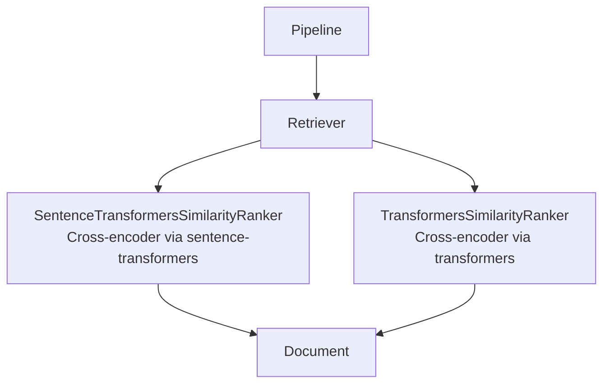
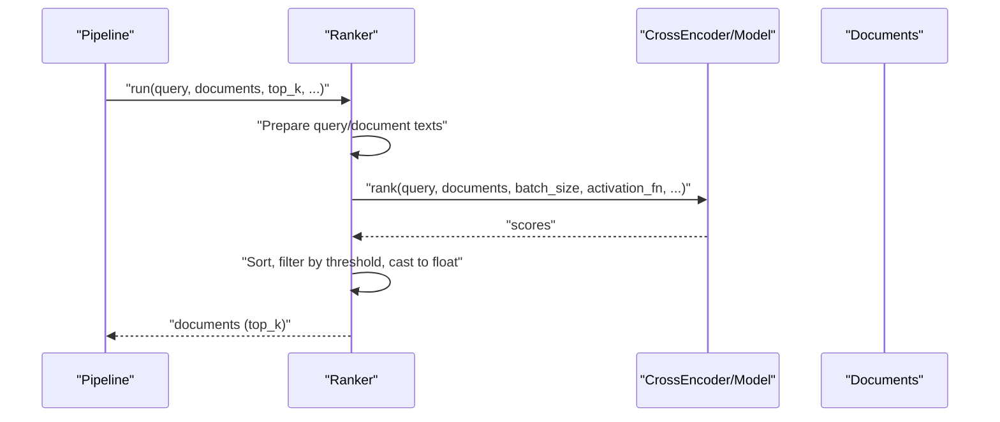
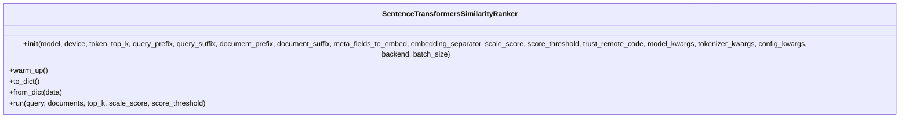
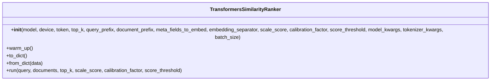
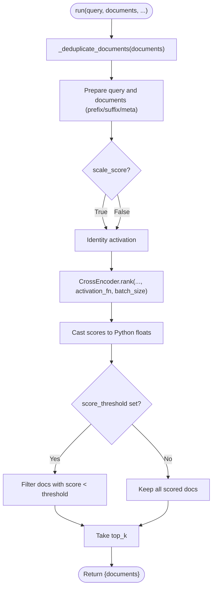
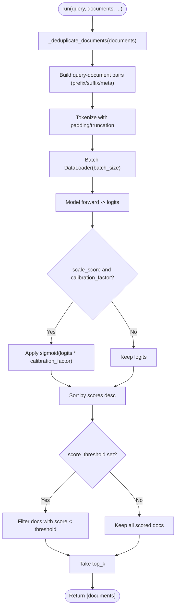
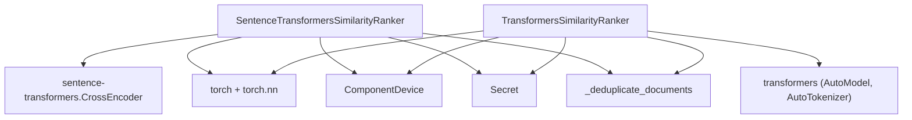

# Similarity Rankers

<cite>
**Referenced Files in This Document**
- [sentence_transformers_similarity.py](file://haystack/components/rankers/sentence_transformers_similarity.py)
- [transformers_similarity.py](file://haystack/components/rankers/transformers_similarity.py)
- [test_sentence_transformers_similarity.py](file://test/components/rankers/test_sentence_transformers_similarity.py)
- [test_transformers_similarity.py](file://test/components/rankers/test_transformers_similarity.py)
- [sentencetransformerssimilarityranker.mdx](file://docs-website/docs/pipeline-components/rankers/sentencetransformerssimilarityranker.mdx)
- [transformerssimilarityranker.mdx](file://docs-website/docs/pipeline-components/rankers/transformerssimilarityranker.mdx)
- [rankers_api.md](file://docs-website/reference/haystack-api/rankers_api.md)
</cite>

## Table of Contents
1. [Introduction](#introduction)
2. [Project Structure](#project-structure)
3. [Core Components](#core-components)
4. [Architecture Overview](#architecture-overview)
5. [Detailed Component Analysis](#detailed-component-analysis)
6. [Dependency Analysis](#dependency-analysis)
7. [Performance Considerations](#performance-considerations)
8. [Troubleshooting Guide](#troubleshooting-guide)
9. [Conclusion](#conclusion)

## Introduction
This document provides detailed API documentation for similarity-based ranker components in the Haystack ecosystem, focusing on:
- SentenceTransformersSimilarityRanker: a modern, cross-encoder–based ranker with advanced features such as backend selection, remote code support, and batched inference.
- TransformersSimilarityRanker: a legacy cross-encoder–based ranker with a simpler interface and sigmoid scaling via a calibration factor.

The documentation covers initialization parameters, input/output specifications, scoring and normalization, thresholds, batch processing, and GPU acceleration. It also includes integration patterns with embedding-based retrieval systems and performance tuning guidance.

## Project Structure
The ranker implementations reside under haystack/components/rankers, with tests and documentation supporting their usage.

**Diagram sources**
- [sentence_transformers_similarity.py](file://haystack/components/rankers/sentence_transformers_similarity.py#L20-L297)
- [transformers_similarity.py](file://haystack/components/rankers/transformers_similarity.py#L24-L328)

**Section sources**
- [sentence_transformers_similarity.py](file://haystack/components/rankers/sentence_transformers_similarity.py#L1-L297)
- [transformers_similarity.py](file://haystack/components/rankers/transformers_similarity.py#L1-L328)

## Core Components
- SentenceTransformersSimilarityRanker
  - Purpose: Ranks documents by semantic similarity using a cross-encoder model from sentence-transformers.
  - Key capabilities: Backend selection (torch/onnx/openvino), trust_remote_code, metadata embedding, score scaling, threshold filtering, batched inference.
  - Typical usage: After a retriever in a RAG or search pipeline.

- TransformersSimilarityRanker (Legacy)
  - Purpose: Same ranking goal with a lower-level implementation using the transformers library.
  - Key capabilities: Sigmoid scaling via calibration_factor, device mapping, batched inference.
  - Status: Deprecated in favor of SentenceTransformersSimilarityRanker.

**Section sources**
- [sentence_transformers_similarity.py](file://haystack/components/rankers/sentence_transformers_similarity.py#L20-L297)
- [transformers_similarity.py](file://haystack/components/rankers/transformers_similarity.py#L24-L328)
- [rankers_api.md](file://docs-website/reference/haystack-api/rankers_api.md#L699-L860)
- [rankers_api.md](file://docs-website/reference/haystack-api/rankers_api.md#L861-L1017)

## Architecture Overview
Both rankers operate similarly:
- Prepare query and documents (optionally prefix/suffix and metadata concatenation).
- Encode pairs or compute logits using a cross-encoder model.
- Apply score scaling (sigmoid) and/or threshold filtering.
- Sort by similarity and return top_k documents.

**Diagram sources**
- [sentence_transformers_similarity.py](file://haystack/components/rankers/sentence_transformers_similarity.py#L213-L297)
- [transformers_similarity.py](file://haystack/components/rankers/transformers_similarity.py#L221-L328)

## Detailed Component Analysis

### SentenceTransformersSimilarityRanker
- Initialization parameters
  - model: Model name or path for a cross-encoder.
  - device: Target device; resolved to a string internally.
  - token: Secret for accessing private models.
  - top_k: Number of top documents to return.
  - query_prefix/query_suffix/document_prefix/document_suffix: Text to prepend/append to query and documents.
  - meta_fields_to_embed/embedding_separator: Include metadata fields into the document text.
  - scale_score: Enable sigmoid scaling of raw logits.
  - score_threshold: Filter out scores below threshold.
  - trust_remote_code: Allow custom model code from Hugging Face Hub.
  - model_kwargs/tokenizer_kwargs/config_kwargs: Extra kwargs passed to model/tokenizer/config loaders.
  - backend: "torch"|"onnx"|"openvino".
  - batch_size: Batch size for inference.

- Scoring and normalization
  - Uses CrossEncoder.rank with an activation function (Identity or Sigmoid).
  - Scores are returned as numeric scalars and cast to Python floats.

- Threshold configuration
  - Documents with scores below score_threshold are filtered out.

- Batch processing and GPU acceleration
  - batch_size controls inference batching.
  - device selects CPU/GPU; backend can leverage ONNX/OpenVINO.

- Integration patterns
  - Place after a retriever; tune retriever.top_k to reduce downstream load.

- Examples
  - Standalone ranking and pipeline usage are documented in the component docs.

**Section sources**
- [sentence_transformers_similarity.py](file://haystack/components/rankers/sentence_transformers_similarity.py#L42-L141)
- [sentence_transformers_similarity.py](file://haystack/components/rankers/sentence_transformers_similarity.py#L149-L164)
- [sentence_transformers_similarity.py](file://haystack/components/rankers/sentence_transformers_similarity.py#L213-L297)
- [sentencetransformerssimilarityranker.mdx](file://docs-website/docs/pipeline-components/rankers/sentencetransformerssimilarityranker.mdx#L1-L111)
- [rankers_api.md](file://docs-website/reference/haystack-api/rankers_api.md#L721-L860)

#### Class Diagram

**Diagram sources**
- [sentence_transformers_similarity.py](file://haystack/components/rankers/sentence_transformers_similarity.py#L42-L297)

### TransformersSimilarityRanker (Legacy)
- Initialization parameters
  - model: Cross-encoder model name or path.
  - device: Device selection; supports device_map resolution.
  - token: Secret for private models.
  - top_k: Top-K documents to return.
  - query_prefix/document_prefix: Prefixes for query/document text.
  - meta_fields_to_embed/embedding_separator: Include metadata into text.
  - scale_score: Enable sigmoid scaling.
  - calibration_factor: Factor for sigmoid(logits * calibration_factor); required when scale_score=True.
  - score_threshold: Score threshold filter.
  - model_kwargs/tokenizer_kwargs: Extra kwargs for model/tokenizer.
  - batch_size: Batch size for inference.

- Scoring and normalization
  - Tokenizes pairs and computes logits; applies sigmoid with calibration_factor when enabled.

- Threshold configuration
  - Filters documents whose scores are below score_threshold.

- Batch processing and GPU acceleration
  - Uses DataLoader with configurable batch_size.
  - Supports device_map for multi-GPU setups.

- Integration patterns
  - Works similarly after a retriever; consider reducing retriever.top_k to limit downstream workload.

**Section sources**
- [transformers_similarity.py](file://haystack/components/rankers/transformers_similarity.py#L52-L149)
- [transformers_similarity.py](file://haystack/components/rankers/transformers_similarity.py#L156-L220)
- [transformers_similarity.py](file://haystack/components/rankers/transformers_similarity.py#L221-L328)
- [transformerssimilarityranker.mdx](file://docs-website/docs/pipeline-components/rankers/transformerssimilarityranker.mdx#L1-L114)
- [rankers_api.md](file://docs-website/reference/haystack-api/rankers_api.md#L889-L1017)

#### Class Diagram

**Diagram sources**
- [transformers_similarity.py](file://haystack/components/rankers/transformers_similarity.py#L52-L328)

### API Workflows

#### SentenceTransformersSimilarityRanker run flow

**Diagram sources**
- [sentence_transformers_similarity.py](file://haystack/components/rankers/sentence_transformers_similarity.py#L213-L297)

#### TransformersSimilarityRanker run flow

**Diagram sources**
- [transformers_similarity.py](file://haystack/components/rankers/transformers_similarity.py#L221-L328)

## Dependency Analysis
- External libraries
  - sentence-transformers CrossEncoder for SentenceTransformersSimilarityRanker.
  - transformers AutoModelForSequenceClassification and AutoTokenizer for TransformersSimilarityRanker.
  - torch and torch.nn for tensor operations and activations.
- Internal utilities
  - ComponentDevice and Secret for device and token handling.
  - Serialization helpers default_to_dict/default_from_dict for persistence.
  - Helper _deduplicate_documents for ID-based deduplication.

**Diagram sources**
- [sentence_transformers_similarity.py](file://haystack/components/rankers/sentence_transformers_similarity.py#L9-L17)
- [transformers_similarity.py](file://haystack/components/rankers/transformers_similarity.py#L9-L19)

**Section sources**
- [sentence_transformers_similarity.py](file://haystack/components/rankers/sentence_transformers_similarity.py#L9-L17)
- [transformers_similarity.py](file://haystack/components/rankers/transformers_similarity.py#L9-L19)

## Performance Considerations
- Batch size
  - Increase batch_size to improve throughput; decrease if encountering out-of-memory errors.
- Backend selection
  - SentenceTransformersSimilarityRanker supports "torch"|"onnx"|"openvino"; choose based on deployment needs.
- Device and acceleration
  - Set device to GPU for faster inference; ensure compatible drivers and runtime.
- Retrieval overlap
  - Tune retriever.top_k to reduce the number of documents passed to the ranker.
- Metadata embedding
  - Including metadata increases text length; monitor token limits and model_max_length via tokenizer_kwargs.

[No sources needed since this section provides general guidance]

## Troubleshooting Guide
- top_k must be > 0
  - Both components validate top_k and raise ValueError if invalid.
- Calibration factor required when scale_score=True (TransformersSimilarityRanker)
  - Ensure calibration_factor is provided when enabling scale_score.
- Empty documents list
  - Both components return an empty documents list when no input documents are provided.
- Score types
  - Scores are cast to Python floats; if backend returns numpy scalars, they are converted appropriately.
- Deduplication
  - Documents with duplicate IDs are deduplicated, keeping the one with the higher score if present.

**Section sources**
- [sentence_transformers_similarity.py](file://haystack/components/rankers/sentence_transformers_similarity.py#L120-L122)
- [sentence_transformers_similarity.py](file://haystack/components/rankers/sentence_transformers_similarity.py#L259-L261)
- [transformers_similarity.py](file://haystack/components/rankers/transformers_similarity.py#L142-L149)
- [transformers_similarity.py](file://haystack/components/rankers/transformers_similarity.py#L271-L277)
- [test_sentence_transformers_similarity.py](file://test/components/rankers/test_sentence_transformers_similarity.py#L18-L21)
- [test_sentence_transformers_similarity.py](file://test/components/rankers/test_sentence_transformers_similarity.py#L267-L272)
- [test_transformers_similarity.py](file://test/components/rankers/test_transformers_similarity.py#L117-L148)
- [test_transformers_similarity.py](file://test/components/rankers/test_transformers_similarity.py#L335-L343)

## Conclusion
SentenceTransformersSimilarityRanker offers a modern, feature-rich approach to similarity-based ranking with robust configuration for scaling, thresholding, batching, and backend acceleration. TransformersSimilarityRanker remains functional but is marked as legacy; prefer SentenceTransformersSimilarityRanker for new projects. Integrate either ranker after a retriever in RAG or search pipelines, tune retriever.top_k and batch_size for optimal performance, and leverage device and backend choices for acceleration.