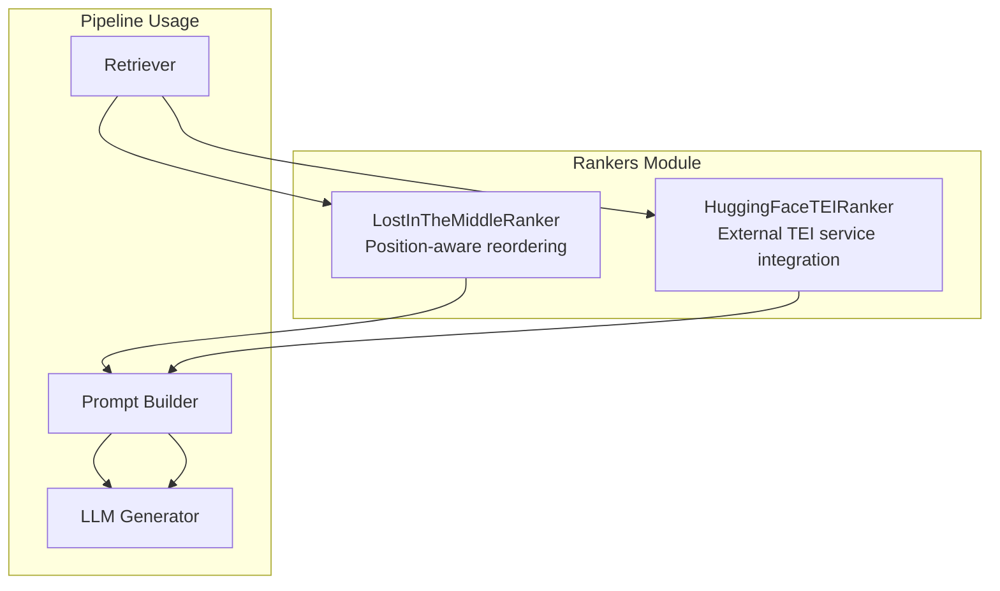
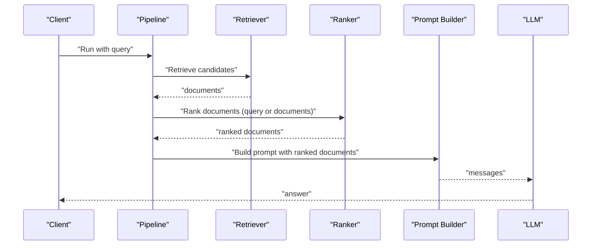
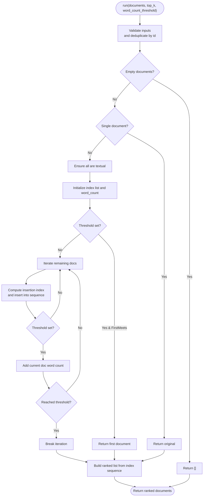
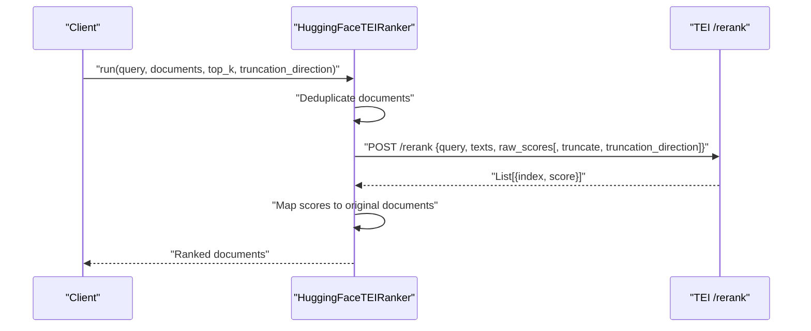
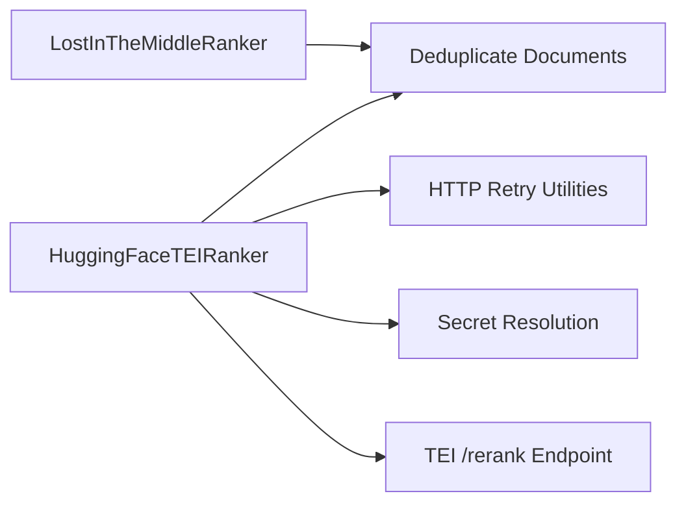

# Specialized Rankers

<cite>
**Referenced Files in This Document**
- [lost_in_the_middle.py](file://haystack/components/rankers/lost_in_the_middle.py)
- [hugging_face_tei.py](file://haystack/components/rankers/hugging_face_tei.py)
- [test_lost_in_the_middle.py](file://test/components/rankers/test_lost_in_the_middle.py)
- [test_hugging_face_tei.py](file://test/components/rankers/test_hugging_face_tei.py)
- [lostinthemiddleranker.mdx](file://docs-website/docs/pipeline-components/rankers/lostinthemiddleranker.mdx)
- [huggingfaceteiranker.mdx](file://docs-website/docs/pipeline-components/rankers/huggingfaceteiranker.mdx)
- [rankers_api.md](file://docs-website/reference/haystack-api/rankers_api.md)
- [choosing-the-right-ranker.mdx](file://docs-website/docs/pipeline-components/rankers/choosing-the-right-ranker.mdx)
</cite>

## Table of Contents
1. [Introduction](#introduction)
2. [Project Structure](#project-structure)
3. [Core Components](#core-components)
4. [Architecture Overview](#architecture-overview)
5. [Detailed Component Analysis](#detailed-component-analysis)
6. [Dependency Analysis](#dependency-analysis)
7. [Performance Considerations](#performance-considerations)
8. [Troubleshooting Guide](#troubleshooting-guide)
9. [Conclusion](#conclusion)
10. [Appendices](#appendices)

## Introduction
This document provides comprehensive API documentation for two specialized ranking components:
- LostInTheMiddleRanker: A position-aware ranker that reorders documents to place the most relevant items at the beginning or end of the list, while less relevant items are positioned in the middle. It is designed for long-context scenarios and assumes prior relevance ordering.
- HuggingFaceTEIRanker: A TEI (Text Embedding Inference) integration that leverages an external TEI service to compute semantic similarity between a query and candidate documents. It supports synchronous and asynchronous reranking, configurable timeouts, retries, and optional text truncation.

The document explains algorithms, configuration parameters, use cases, integration patterns, performance optimization strategies, and trade-offs between specialized and general-purpose ranking approaches.

## Project Structure
The specialized rankers are implemented as Haystack components under the rankers module. Each component exposes a standardized interface with run and optional async run methods, parameter validation, and serialization support.

**Diagram sources**
- [lost_in_the_middle.py](file://haystack/components/rankers/lost_in_the_middle.py#L10-L138)
- [hugging_face_tei.py](file://haystack/components/rankers/hugging_face_tei.py#L29-L285)

**Section sources**
- [lost_in_the_middle.py](file://haystack/components/rankers/lost_in_the_middle.py#L10-L138)
- [hugging_face_tei.py](file://haystack/components/rankers/hugging_face_tei.py#L29-L285)

## Core Components
- LostInTheMiddleRanker
  - Purpose: Reorder documents to mitigate position bias in long-context LLMs by placing the most relevant items at the beginning or end and less relevant items in the middle.
  - Inputs: Documents list; optional parameters include top_k and word_count_threshold.
  - Outputs: Reordered documents list.
  - Typical placement: After a retriever and before prompt construction for LLMs.

- HuggingFaceTEIRanker
  - Purpose: Compute semantic similarity between a query and documents via an external TEI reranking endpoint.
  - Inputs: query, documents, optional top_k, truncation_direction.
  - Outputs: Ranked documents with scores.
  - Typical placement: After a retriever in a query pipeline.

**Section sources**
- [lostinthemiddleranker.mdx](file://docs-website/docs/pipeline-components/rankers/lostinthemiddleranker.mdx#L1-L114)
- [huggingfaceteiranker.mdx](file://docs-website/docs/pipeline-components/rankers/huggingfaceteiranker.mdx#L1-L105)
- [rankers_api.md](file://docs-website/reference/haystack-api/rankers_api.md#L182-L260)
- [rankers_api.md](file://docs-website/reference/haystack-api/rankers_api.md#L9-L181)

## Architecture Overview
Both components integrate into a typical retrieval-augmented pipeline. LostInTheMiddleRanker operates deterministically on already-ranked documents, while HuggingFaceTEIRanker performs external API calls to compute relevance scores.

**Diagram sources**
- [lost_in_the_middle.py](file://haystack/components/rankers/lost_in_the_middle.py#L62-L138)
- [hugging_face_tei.py](file://haystack/components/rankers/hugging_face_tei.py#L166-L225)

## Detailed Component Analysis

### LostInTheMiddleRanker
- Algorithm
  - Deduplicates documents by ID, keeping the highest-scoring variant if present.
  - Applies top_k filtering if provided.
  - Validates that all documents are textual.
  - Builds a “lost in the middle” index sequence by inserting subsequent indices at midpoints of the growing sequence.
  - Optionally enforces a word_count_threshold by counting words in document contents and stopping when the threshold is met.
  - Produces a final ranked list following the constructed index order.

- Key Parameters
  - word_count_threshold: Upper bound on total words across selected documents; stops early when threshold is met.
  - top_k: Maximum number of documents to return.

- Behavior Details
  - Empty input returns empty list.
  - Single-document input returns unchanged.
  - Non-textual content raises an error.
  - Duplicate IDs are resolved by score precedence.

- Example Use Cases
  - Long-context prompting where position bias matters.
  - Preparing context windows for LLMs with limited attention to middle regions.

**Diagram sources**
- [lost_in_the_middle.py](file://haystack/components/rankers/lost_in_the_middle.py#L62-L138)

**Section sources**
- [lost_in_the_middle.py](file://haystack/components/rankers/lost_in_the_middle.py#L40-L138)
- [test_lost_in_the_middle.py](file://test/components/rankers/test_lost_in_the_middle.py#L11-L115)
- [lostinthemiddleranker.mdx](file://docs-website/docs/pipeline-components/rankers/lostinthemiddleranker.mdx#L30-L36)

### HuggingFaceTEIRanker
- Algorithm
  - Deduplicates documents by ID, preferring higher-scoring variants.
  - Constructs a payload with query and texts; optionally enables truncation with direction.
  - Sends a POST request to the TEI /rerank endpoint with optional Authorization header.
  - Parses the response into a ranked list of documents, attaching scores.
  - Supports synchronous and asynchronous execution.

- Key Parameters
  - url: Base URL of the TEI reranking service.
  - top_k: Maximum number of documents to return.
  - raw_scores: Whether to include raw scores in the payload.
  - timeout: Request timeout.
  - max_retries: Number of retry attempts for transient failures.
  - retry_status_codes: HTTP status codes eligible for retry.
  - token: Secret-backed bearer token for authorization.

- Behavior Details
  - Empty documents list returns immediately.
  - Error responses raise a runtime error with parsed details.
  - Unexpected response formats raise a type error.
  - Truncation direction toggles truncation and sets direction.

- Example Use Cases
  - Semantic reranking after keyword retrieval.
  - Integrating with self-hosted TEI or Hugging Face Inference Endpoints.

**Diagram sources**
- [hugging_face_tei.py](file://haystack/components/rankers/hugging_face_tei.py#L166-L225)

**Section sources**
- [hugging_face_tei.py](file://haystack/components/rankers/hugging_face_tei.py#L62-L285)
- [test_hugging_face_tei.py](file://test/components/rankers/test_hugging_face_tei.py#L16-L353)
- [huggingfaceteiranker.mdx](file://docs-website/docs/pipeline-components/rankers/huggingfaceteiranker.mdx#L17-L36)

## Dependency Analysis
- Internal dependencies
  - Both components rely on document deduplication utilities to ensure consistent ranking inputs.
  - HuggingFaceTEIRanker depends on HTTP retry utilities and Secret resolution for bearer tokens.

- External dependencies
  - HuggingFaceTEIRanker integrates with a remote TEI service; availability and latency impact performance.

**Diagram sources**
- [lost_in_the_middle.py](file://haystack/components/rankers/lost_in_the_middle.py#L95-L96)
- [hugging_face_tei.py](file://haystack/components/rankers/hugging_face_tei.py#L202-L225)

**Section sources**
- [lost_in_the_middle.py](file://haystack/components/rankers/lost_in_the_middle.py#L95-L96)
- [hugging_face_tei.py](file://haystack/components/rankers/hugging_face_tei.py#L202-L225)

## Performance Considerations
- LostInTheMiddleRanker
  - Deterministic and lightweight; suitable for long-context preparation without extra computation.
  - word_count_threshold helps cap context size; tune to fit model context window and desired coverage.
  - top_k reduces downstream processing for LLMs.

- HuggingFaceTEIRanker
  - Network-bound; latency dominated by service response time.
  - Configure timeout and max_retries to balance responsiveness and robustness.
  - Prefer truncation_direction when documents exceed model input length to avoid oversized payloads.
  - Use raw_scores judiciously; enabling raw scores may increase payload size slightly.
  - Consider batching upstream retriever results to align with top_k to minimize unnecessary work.

[No sources needed since this section provides general guidance]

## Troubleshooting Guide
- LostInTheMiddleRanker
  - Invalid thresholds or top_k values cause validation errors.
  - Non-textual content raises an error; ensure all documents have textual content.
  - Duplicate IDs are resolved by score; verify expected behavior in test scenarios.

- HuggingFaceTEIRanker
  - API errors raise runtime exceptions with parsed error_type and error message.
  - Unexpected response formats raise type errors; verify endpoint compatibility.
  - Missing or invalid token leads to authorization failures; configure Secret appropriately.
  - Empty documents list returns early without API calls.

**Section sources**
- [lost_in_the_middle.py](file://haystack/components/rankers/lost_in_the_middle.py#L52-L87)
- [hugging_face_tei.py](file://haystack/components/rankers/hugging_face_tei.py#L144-L154)
- [test_lost_in_the_middle.py](file://test/components/rankers/test_lost_in_the_middle.py#L46-L52)
- [test_hugging_face_tei.py](file://test/components/rankers/test_hugging_face_tei.py#L240-L261)

## Conclusion
LostInTheMiddleRanker and HuggingFaceTEIRanker serve distinct roles in retrieval-augmented pipelines:
- LostInTheMiddleRanker is a fast, deterministic, position-aware reordering component ideal for long-context LLM prompting.
- HuggingFaceTEIRanker integrates with external TEI services to provide semantic reranking with robust retry and truncation capabilities.

Choose LostInTheMiddleRanker when you need predictable, position-aware ordering without external dependencies. Choose HuggingFaceTEIRanker when you require strong semantic similarity scoring from a dedicated reranking service. For optimal pipelines, pair a retriever with one of these rankers, then feed the ranked context into an LLM.

[No sources needed since this section summarizes without analyzing specific files]

## Appendices

### API Reference Highlights
- LostInTheMiddleRanker
  - Initialization parameters: word_count_threshold, top_k.
  - Run parameters: documents, top_k, word_count_threshold.
  - Output: documents.

- HuggingFaceTEIRanker
  - Initialization parameters: url, top_k, raw_scores, timeout, max_retries, retry_status_codes, token.
  - Run parameters: query, documents, top_k, truncation_direction.
  - Async run available with identical signature.
  - Output: documents with scores.

**Section sources**
- [rankers_api.md](file://docs-website/reference/haystack-api/rankers_api.md#L182-L260)
- [rankers_api.md](file://docs-website/reference/haystack-api/rankers_api.md#L9-L181)

### Position-Aware Ranking Use Cases
- Long-context LLM prompting where middle-region attention is weak.
- Reducing position bias by ensuring high-relevance items appear at ends of context windows.

**Section sources**
- [lostinthemiddleranker.mdx](file://docs-website/docs/pipeline-components/rankers/lostinthemiddleranker.mdx#L24-L28)

### External Service Integration Notes
- HuggingFaceTEIRanker supports self-hosted TEI and Hugging Face Inference Endpoints.
- Configure token via Secret for bearer authorization when required by the service.

**Section sources**
- [huggingfaceteiranker.mdx](file://docs-website/docs/pipeline-components/rankers/huggingfaceteiranker.mdx#L27-L36)

### Trade-offs: Specialized vs General-Purpose Ranking
- Specialized (LostInTheMiddleRanker/HuggingFaceTEIRanker)
  - Pros: Fast, transparent, deterministic (LITM); strong semantic reranking (TEI).
  - Cons: LITM requires prior relevance ordering; TEI adds network latency and dependency.
- General-purpose (other rankers)
  - Pros: Broad applicability across tasks.
  - Cons: May not address position bias or leverage domain-specific reranking.

**Section sources**
- [choosing-the-right-ranker.mdx](file://docs-website/docs/pipeline-components/rankers/choosing-the-right-ranker.mdx#L51-L60)