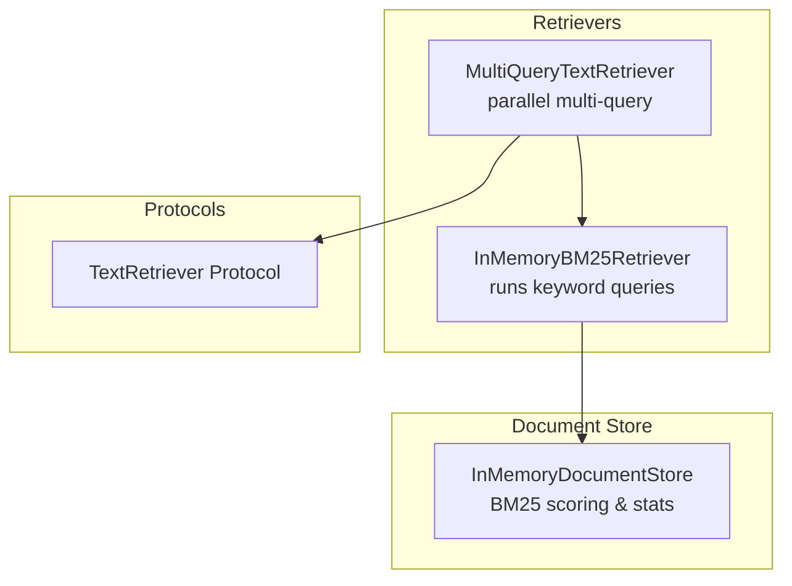
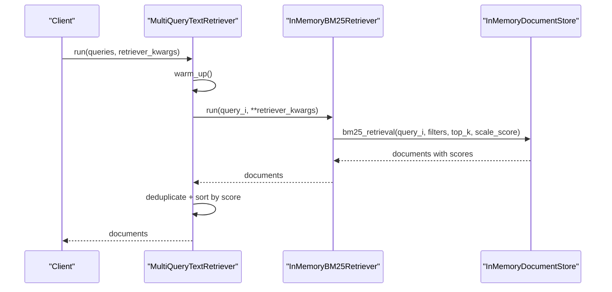
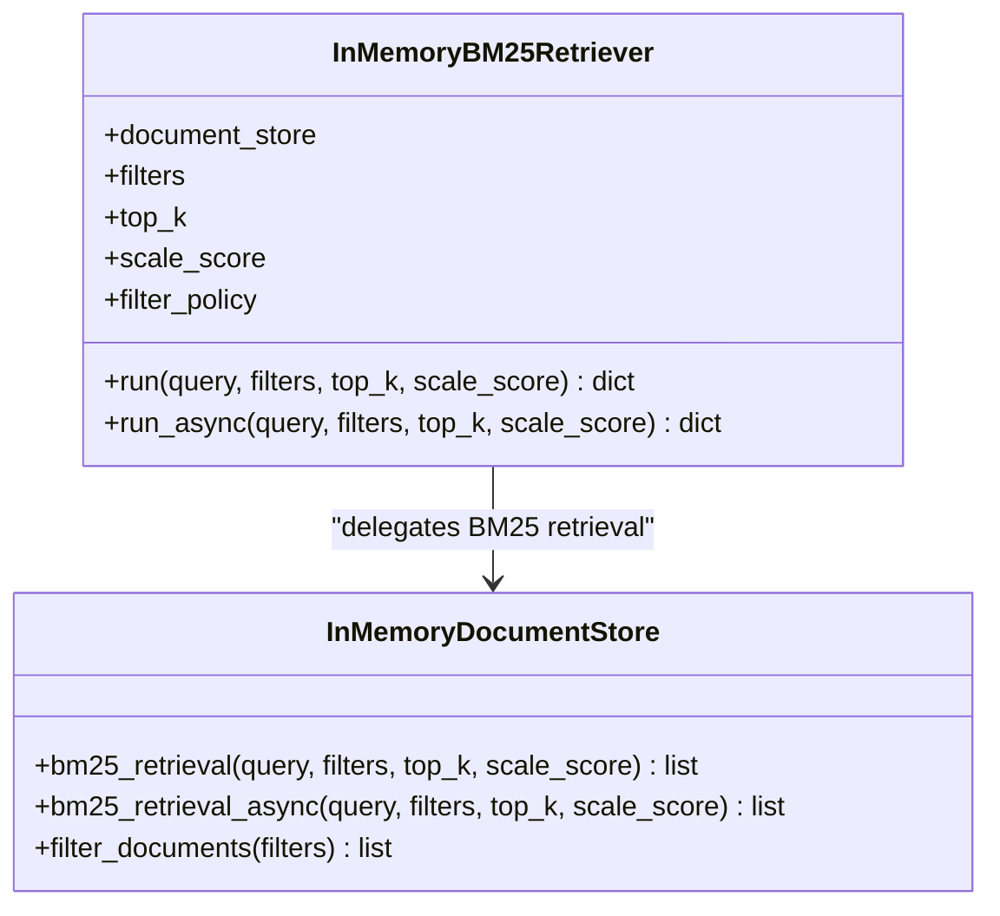
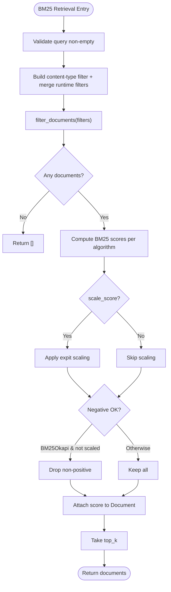
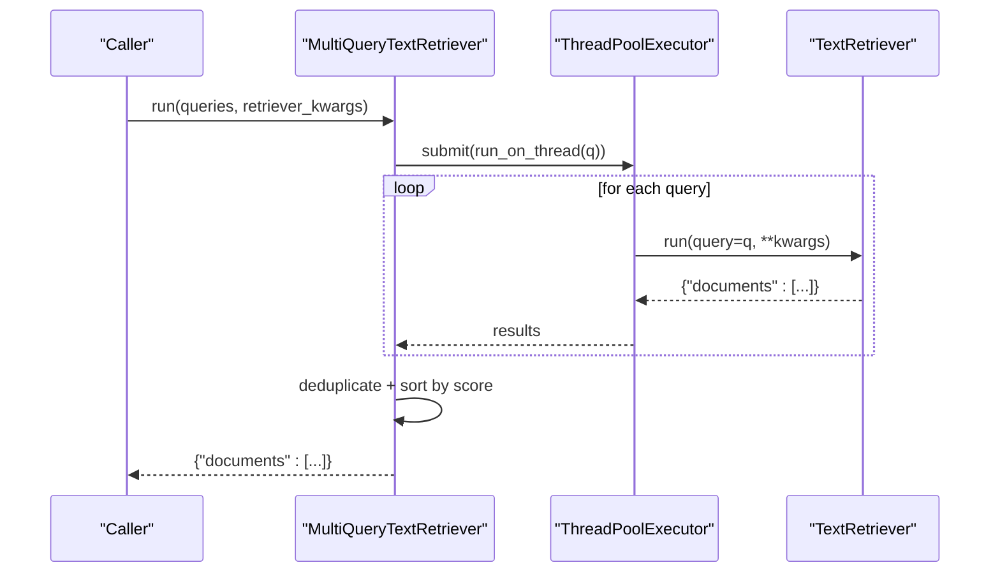
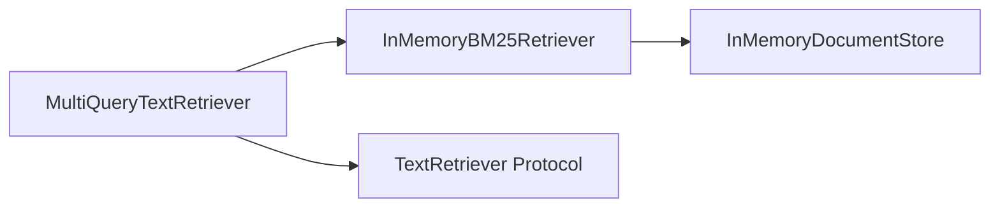

# Keyword Retrievers

<cite>
**Referenced Files in This Document**
- [bm25_retriever.py](file://haystack/components/retrievers/in_memory/bm25_retriever.py)
- [multi_query_text_retriever.py](file://haystack/components/retrievers/multi_query_text_retriever.py)
- [document_store.py](file://haystack/document_stores/in_memory/document_store.py)
- [protocol.py](file://haystack/components/retrievers/types/protocol.py)
- [test_in_memory_bm25_retriever.py](file://test/components/retrievers/test_in_memory_bm25_retriever.py)
- [test_multi_query_text_retriever.py](file://test/components/retrievers/test_multi_query_text_retriever.py)
- [test_in_memory.py](file://test/document_stores/test_in_memory.py)
</cite>

## Table of Contents
1. [Introduction](#introduction)
2. [Project Structure](#project-structure)
3. [Core Components](#core-components)
4. [Architecture Overview](#architecture-overview)
5. [Detailed Component Analysis](#detailed-component-analysis)
6. [Dependency Analysis](#dependency-analysis)
7. [Performance Considerations](#performance-considerations)
8. [Troubleshooting Guide](#troubleshooting-guide)
9. [Conclusion](#conclusion)
10. [Appendices](#appendices)

## Introduction
This document provides comprehensive API documentation for keyword-based retrieval components in the Haystack library, focusing on:
- InMemoryBM25Retriever: a keyword-based retriever backed by an in-memory document store implementing BM25 variants.
- MultiQueryTextRetriever: a parallel text query expansion and retrieval component that leverages a text-based retriever (e.g., BM25) to expand and combine results.

It covers BM25 scoring internals (term frequency weighting, inverse document frequency computations, and algorithmic variants), tokenizer configuration, stop word handling, phrase matching, and method signatures for text queries, boolean filters, and parallel multi-query retrieval. It also includes practical guidance for optimization, relevance ranking strategies, and hybrid search combinations.

## Project Structure
The keyword retrieval functionality spans three primary areas:
- Retrieval components: InMemoryBM25Retriever and MultiQueryTextRetriever.
- In-memory document store: BM25 scoring engine, tokenization, and statistics.
- Retrieval protocols: TextRetriever interface contract.

**Diagram sources**
- [bm25_retriever.py](file://haystack/components/retrievers/in_memory/bm25_retriever.py#L12-L197)
- [multi_query_text_retriever.py](file://haystack/components/retrievers/multi_query_text_retriever.py#L14-L143)
- [document_store.py](file://haystack/document_stores/in_memory/document_store.py#L59-L811)
- [protocol.py](file://haystack/components/retrievers/types/protocol.py#L8-L57)

**Section sources**
- [bm25_retriever.py](file://haystack/components/retrievers/in_memory/bm25_retriever.py#L12-L197)
- [multi_query_text_retriever.py](file://haystack/components/retrievers/multi_query_text_retriever.py#L14-L143)
- [document_store.py](file://haystack/document_stores/in_memory/document_store.py#L59-L811)
- [protocol.py](file://haystack/components/retrievers/types/protocol.py#L8-L57)

## Core Components
- InMemoryBM25Retriever
  - Purpose: Executes keyword-based retrieval using BM25 on an InMemoryDocumentStore.
  - Key parameters: filters, top_k, scale_score, filter_policy.
  - Methods: run(query, filters, top_k, scale_score), run_async(...).
- InMemoryDocumentStore
  - Purpose: Provides BM25 scoring, tokenization, IDF statistics, and retrieval APIs.
  - Algorithms: BM25Okapi, BM25L, BM25Plus.
  - Methods: bm25_retrieval(query, filters, top_k, scale_score), bm25_retrieval_async(...), filter_documents(...).
- MultiQueryTextRetriever
  - Purpose: Expands a list of text queries and retrieves documents in parallel using a TextRetriever.
  - Methods: run(queries, retriever_kwargs), warm_up().
- TextRetriever Protocol
  - Purpose: Defines the minimal interface for text-based retrievers (run(query, filters, top_k)).

**Section sources**
- [bm25_retriever.py](file://haystack/components/retrievers/in_memory/bm25_retriever.py#L41-L197)
- [document_store.py](file://haystack/document_stores/in_memory/document_store.py#L552-L811)
- [multi_query_text_retriever.py](file://haystack/components/retrievers/multi_query_text_retriever.py#L59-L143)
- [protocol.py](file://haystack/components/retrievers/types/protocol.py#L8-L57)

## Architecture Overview
End-to-end flow for BM25 keyword retrieval and multi-query expansion:

**Diagram sources**
- [multi_query_text_retriever.py](file://haystack/components/retrievers/multi_query_text_retriever.py#L80-L120)
- [bm25_retriever.py](file://haystack/components/retrievers/in_memory/bm25_retriever.py#L120-L156)
- [document_store.py](file://haystack/document_stores/in_memory/document_store.py#L552-L608)

## Detailed Component Analysis

### InMemoryBM25Retriever
- Responsibilities
  - Bridges a user query to the in-memory document store’s BM25 retrieval.
  - Applies runtime filters and top_k selection.
  - Supports optional score scaling to [0, 1].
- Parameters
  - document_store: InMemoryDocumentStore instance.
  - filters: Static filters applied by default.
  - top_k: Number of results to return.
  - scale_score: Whether to scale BM25 scores to [0, 1].
  - filter_policy: REPLACE or MERGE behavior for runtime vs. initialization filters.
- Methods
  - run(query, filters=None, top_k=None, scale_score=None) -> {"documents": list[Document]}
  - run_async(query, filters=None, top_k=None, scale_score=None) -> {"documents": list[Document]}
- Notes
  - Validates document store type and top_k positivity.
  - Delegates to document_store.bm25_retrieval(...) with merged filters and optional scaling.

**Diagram sources**
- [bm25_retriever.py](file://haystack/components/retrievers/in_memory/bm25_retriever.py#L41-L197)
- [document_store.py](file://haystack/document_stores/in_memory/document_store.py#L552-L811)

**Section sources**
- [bm25_retriever.py](file://haystack/components/retrievers/in_memory/bm25_retriever.py#L41-L197)

### InMemoryDocumentStore (BM25 Engine)
- Tokenization and Preprocessing
  - Regex-based tokenizer configurable via bm25_tokenization_regex.
  - Lowercase normalization applied before tokenization.
- BM25 Algorithms
  - BM25Okapi: Supports negative scores when not scaled; includes epsilon smoothing for negative IDF terms.
  - BM25L: Uses delta parameter and length-normalized term frequency.
  - BM25Plus: Adds smoothing to IDF computation.
- Scoring Internals
  - Term Frequency (TF): Normalized per algorithm.
  - Inverse Document Frequency (IDF): Computed globally across corpus vocabulary.
  - Document statistics: Per-document token counts and average document length maintained incrementally.
- Retrieval API
  - bm25_retrieval(query, filters=None, top_k=10, scale_score=False) -> list[Document]
  - bm25_retrieval_async(...): Async variant.
- Filtering Defaults
  - Automatically ensures content is not null when filters are provided.

**Diagram sources**
- [document_store.py](file://haystack/document_stores/in_memory/document_store.py#L552-L608)
- [document_store.py](file://haystack/document_stores/in_memory/document_store.py#L193-L346)

**Section sources**
- [document_store.py](file://haystack/document_stores/in_memory/document_store.py#L64-L124)
- [document_store.py](file://haystack/document_stores/in_memory/document_store.py#L176-L191)
- [document_store.py](file://haystack/document_stores/in_memory/document_store.py#L193-L346)
- [document_store.py](file://haystack/document_stores/in_memory/document_store.py#L552-L608)

### MultiQueryTextRetriever
- Responsibilities
  - Accepts a list of text queries and runs them in parallel against a TextRetriever.
  - Merges, deduplicates, and sorts results by relevance score.
- Parameters
  - retriever: Implements TextRetriever protocol.
  - max_workers: Thread pool size for parallelism.
- Methods
  - run(queries: list[str], retriever_kwargs: dict | None = None) -> {"documents": list[Document]}
  - warm_up(): Optionally warms up the underlying retriever.
- Notes
  - Uses a ThreadPoolExecutor to parallelize retriever.run calls.
  - Deduplicates documents and sorts by score descending.

**Diagram sources**
- [multi_query_text_retriever.py](file://haystack/components/retrievers/multi_query_text_retriever.py#L80-L120)
- [protocol.py](file://haystack/components/retrievers/types/protocol.py#L16-L30)

**Section sources**
- [multi_query_text_retriever.py](file://haystack/components/retrievers/multi_query_text_retriever.py#L59-L143)
- [protocol.py](file://haystack/components/retrievers/types/protocol.py#L8-L57)

### TextRetriever Protocol
- Contract
  - run(query: str, filters: dict | None = None, top_k: int | None = None) -> dict[str, Any]
  - Enforces a standardized interface for text-based retrievers.
- Usage
  - MultiQueryTextRetriever expects any retriever implementing this protocol.

**Section sources**
- [protocol.py](file://haystack/components/retrievers/types/protocol.py#L8-L57)

## Dependency Analysis
- Coupling
  - InMemoryBM25Retriever depends on InMemoryDocumentStore for BM25 scoring and filtering.
  - MultiQueryTextRetriever depends on TextRetriever protocol, enabling interchangeable keyword or embedding retrievers.
- Cohesion
  - BM25 scoring logic is encapsulated within InMemoryDocumentStore, keeping retrieval components thin.
- External Dependencies
  - Regular expressions for tokenization.
  - Numerical libraries for scoring and scaling.

**Diagram sources**
- [bm25_retriever.py](file://haystack/components/retrievers/in_memory/bm25_retriever.py#L12-L197)
- [multi_query_text_retriever.py](file://haystack/components/retrievers/multi_query_text_retriever.py#L14-L143)
- [protocol.py](file://haystack/components/retrievers/types/protocol.py#L8-L57)

**Section sources**
- [bm25_retriever.py](file://haystack/components/retrievers/in_memory/bm25_retriever.py#L12-L197)
- [multi_query_text_retriever.py](file://haystack/components/retrievers/multi_query_text_retriever.py#L14-L143)
- [protocol.py](file://haystack/components/retrievers/types/protocol.py#L8-L57)

## Performance Considerations
- Tokenization and Preprocessing
  - Configure bm25_tokenization_regex to balance recall vs. precision. Shorter tokens increase recall but may reduce precision.
  - Lowercasing is automatic; ensure downstream tokenizers align with this preprocessing.
- Algorithm Selection
  - BM25L: Good default; delta parameter controls TF saturation behavior.
  - BM25Plus: Smoother IDF; may improve stability on sparse corpora.
  - BM25Okapi: Can produce negative scores; use scale_score=True to normalize to [0, 1].
- Scaling Scores
  - BM25_SCALING_FACTOR controls sigmoid scaling steepness. Increase to compress high scores when unscaled scores are large.
- Parallel Retrieval
  - MultiQueryTextRetriever uses a thread pool. Tune max_workers based on CPU and I/O characteristics.
- Deduplication Cost
  - _deduplicate_documents is applied post-merge; consider reducing redundant queries upstream to minimize cost.

[No sources needed since this section provides general guidance]

## Troubleshooting Guide
- Empty Results
  - BM25 retrieval requires documents with non-null content by default. Ensure documents are written with content.
- Invalid Filters
  - Filters must follow the documented syntax; otherwise, a ValueError is raised.
- Empty Query
  - bm25_retrieval rejects empty queries; supply a non-empty string.
- Negative Scores (BM25Okapi)
  - When not scaled, BM25Okapi may return negative scores. If unexpected, enable scale_score=True.
- Serialization/Deserialization
  - Ensure the document_store type is correctly serialized; mismatches raise TypeErrors or ImportErrors.

**Section sources**
- [document_store.py](file://haystack/document_stores/in_memory/document_store.py#L564-L576)
- [document_store.py](file://haystack/document_stores/in_memory/document_store.py#L505-L510)
- [document_store.py](file://haystack/document_stores/in_memory/document_store.py#L299-L346)
- [test_in_memory.py](file://test/document_stores/test_in_memory.py#L202-L215)
- [test_in_memory.py](file://test/document_stores/test_in_memory.py#L328-L330)
- [test_in_memory_bm25_retriever.py](file://test/components/retrievers/test_in_memory_bm25_retriever.py#L106-L130)

## Conclusion
The keyword retrieval stack centers on InMemoryBM25Retriever and InMemoryDocumentStore, offering robust BM25 scoring with multiple algorithmic variants, configurable tokenization, and flexible filtering. MultiQueryTextRetriever augments retrieval by expanding queries and combining results efficiently. Together, these components support precise, scalable, and extensible keyword search pipelines, with straightforward integration points for hybrid approaches.

[No sources needed since this section summarizes without analyzing specific files]

## Appendices

### API Reference: InMemoryBM25Retriever
- Constructor
  - Parameters: document_store, filters=None, top_k=10, scale_score=False, filter_policy=FilterPolicy.REPLACE
- Methods
  - run(query: str, filters: dict | None = None, top_k: int | None = None, scale_score: bool | None = None) -> dict[str, list[Document]]
  - run_async(query: str, filters: dict | None = None, top_k: int | None = None, scale_score: bool | None = None) -> dict[str, list[Document]]

**Section sources**
- [bm25_retriever.py](file://haystack/components/retrievers/in_memory/bm25_retriever.py#L41-L197)

### API Reference: InMemoryDocumentStore (BM25)
- Constructor
  - Parameters: bm25_tokenization_regex, bm25_algorithm, bm25_parameters, embedding_similarity_function, index, async_executor, return_embedding
- Methods
  - bm25_retrieval(query: str, filters: dict | None = None, top_k: int = 10, scale_score: bool = False) -> list[Document]
  - bm25_retrieval_async(query: str, filters: dict | None = None, top_k: int = 10, scale_score: bool = False) -> list[Document]

**Section sources**
- [document_store.py](file://haystack/document_stores/in_memory/document_store.py#L64-L124)
- [document_store.py](file://haystack/document_stores/in_memory/document_store.py#L552-L811)

### API Reference: MultiQueryTextRetriever
- Constructor
  - Parameters: retriever: TextRetriever, max_workers: int = 3
- Methods
  - run(queries: list[str], retriever_kwargs: dict | None = None) -> dict[str, list[Document]]
  - warm_up() -> None

**Section sources**
- [multi_query_text_retriever.py](file://haystack/components/retrievers/multi_query_text_retriever.py#L59-L143)

### API Reference: TextRetriever Protocol
- Method
  - run(query: str, filters: dict | None = None, top_k: int | None = None) -> dict[str, Any]

**Section sources**
- [protocol.py](file://haystack/components/retrievers/types/protocol.py#L16-L30)

### Examples and Best Practices
- Keyword Search Optimization
  - Adjust bm25_tokenization_regex to match domain vocabulary.
  - Tune bm25_parameters (k1, b, delta, epsilon) for your corpus.
  - Enable scale_score=True for normalized scores across diverse queries.
- Relevance Ranking Strategies
  - Prefer BM25L for balanced TF/IDF behavior; BM25Plus for smoother IDF.
  - Use filter_policy=MERGE to combine persistent and dynamic filters.
- Hybrid Search Combinations
  - Combine MultiQueryTextRetriever with a QueryExpander to generate expanded queries, then retrieve with InMemoryBM25Retriever.
  - Merge BM25 results with embedding-based retrieval by running both retrievers and merging/sorting by score.

**Section sources**
- [test_multi_query_text_retriever.py](file://test/components/retrievers/test_multi_query_text_retriever.py#L162-L192)
- [document_store.py](file://haystack/document_stores/in_memory/document_store.py#L78-L86)