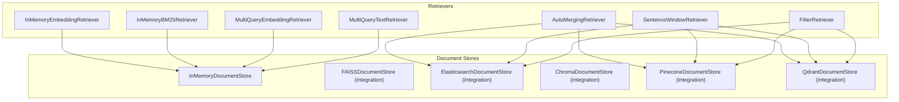
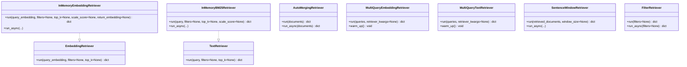
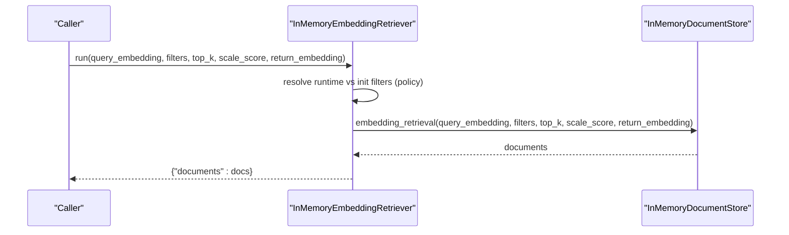
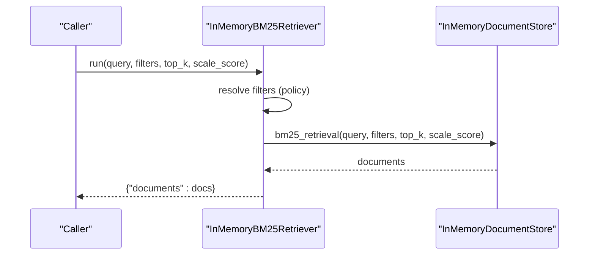
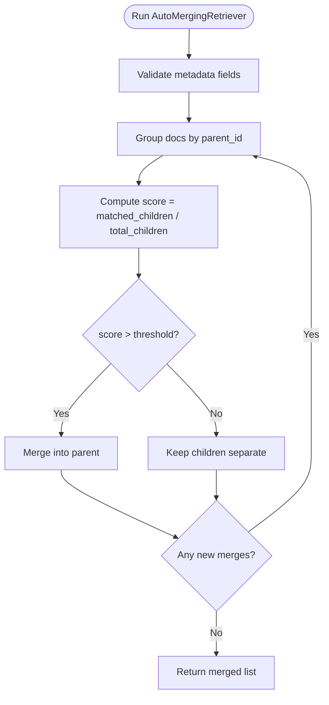
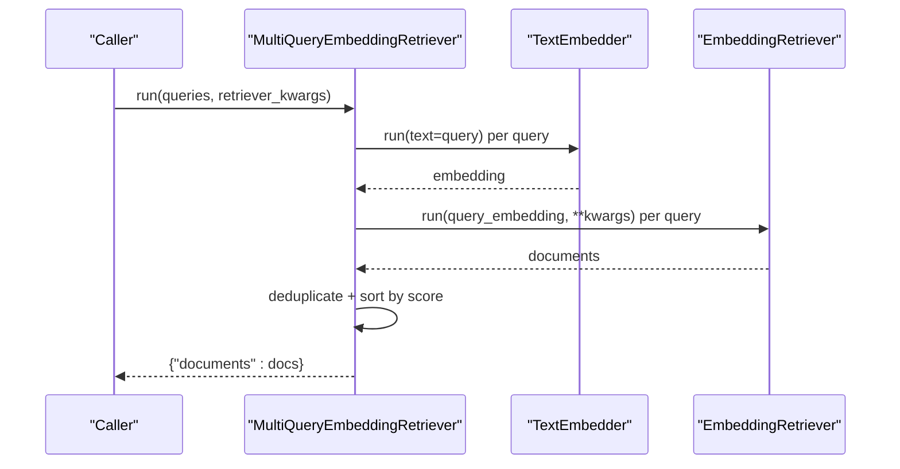
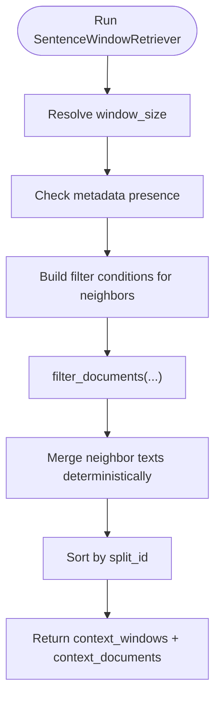
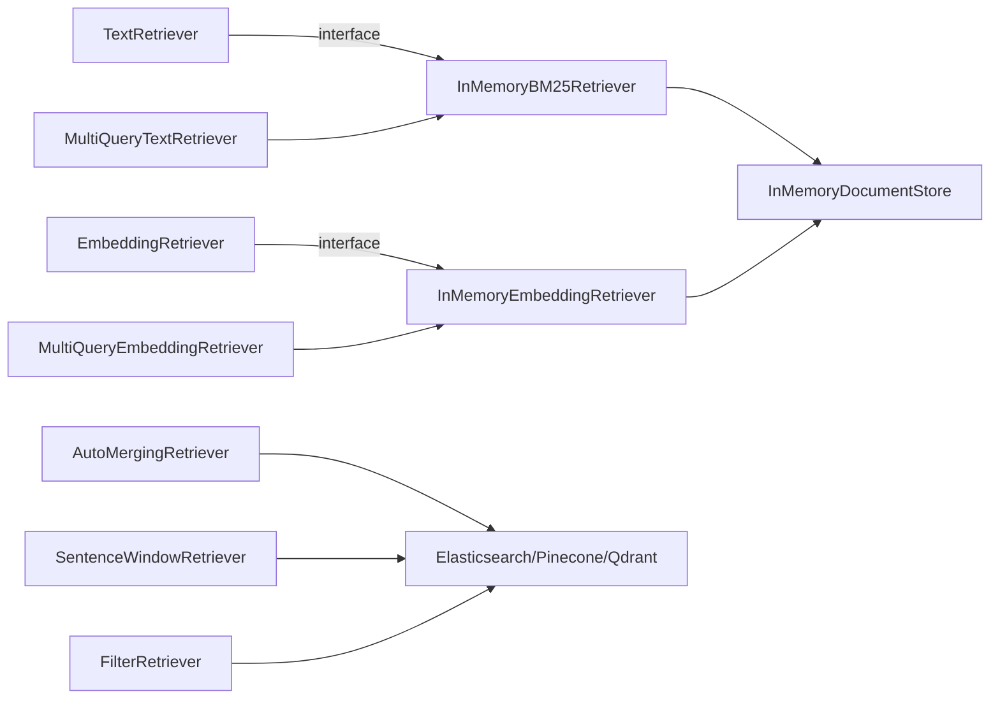
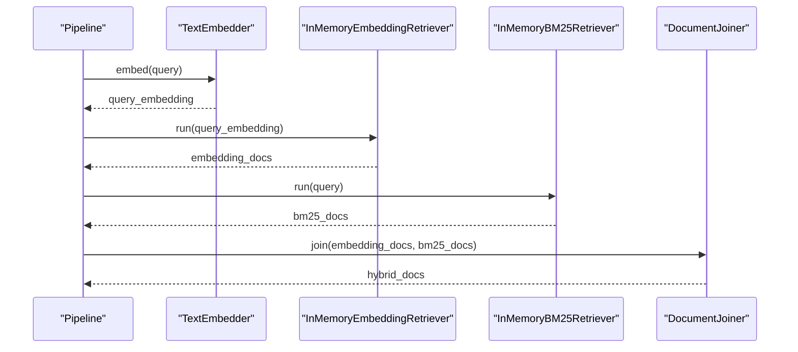

# Retriever APIs

<cite>
**Referenced Files in This Document**
- [retrievers/__init__.py](file://haystack/components/retrievers/__init__.py)
- [types/protocol.py](file://haystack/components/retrievers/types/protocol.py)
- [in_memory/embedding_retriever.py](file://haystack/components/retrievers/in_memory/embedding_retriever.py)
- [in_memory/bm25_retriever.py](file://haystack/components/retrievers/in_memory/bm25_retriever.py)
- [auto_merging_retriever.py](file://haystack/components/retrievers/auto_merging_retriever.py)
- [multi_query_embedding_retriever.py](file://haystack/components/retrievers/multi_query_embedding_retriever.py)
- [multi_query_text_retriever.py](file://haystack/components/retrievers/multi_query_text_retriever.py)
- [sentence_window_retriever.py](file://haystack/components/retrievers/sentence_window_retriever.py)
- [filter_retriever.py](file://haystack/components/retrievers/filter_retriever.py)
- [document_stores/in_memory/document_store.py](file://haystack/document_stores/in_memory/document_store.py)
- [document_stores/types/protocol.py](file://haystack/document_stores/types/protocol.py)
- [document_stores/types/filter_policy.py](file://haystack/document_stores/types/filter_policy.py)
- [document_stores/types/policy.py](file://haystack/document_stores/types/policy.py)
- [faiss_document_store.mdx](file://docs-website/docs/document-stores/faissdocumentstore.mdx)
- [faiss_integration_api.md](file://docs-website/reference/integrations-api/faiss.md)
- [pinecone_document_store.mdx](file://docs-website/docs/document-stores/pinecone-document-store.mdx)
- [chroma_document_store.mdx](file://docs-website/versioned_docs/version-2.19/document-stores/chromadocumentstore.mdx)
- [supercomponents.mdx](file://docs-website/docs/concepts/components/supercomponents.mdx)
</cite>

## Table of Contents
1. [Introduction](#introduction)
2. [Project Structure](#project-structure)
3. [Core Components](#core-components)
4. [Architecture Overview](#architecture-overview)
5. [Detailed Component Analysis](#detailed-component-analysis)
6. [Dependency Analysis](#dependency-analysis)
7. [Performance Considerations](#performance-considerations)
8. [Troubleshooting Guide](#troubleshooting-guide)
9. [Conclusion](#conclusion)
10. [Appendices](#appendices)

## Introduction
This document provides comprehensive API documentation for Haystack Retriever components across multiple backends and retrieval paradigms. It covers:
- Semantic search with embedding-based retrieval
- Keyword search with BM25
- Hybrid retrieval combining multiple strategies
- Specialized retrievers (AutoMerging, MultiQuery variants, SentenceWindow)
- Search parameters, filtering, scoring, and result ranking
- Integration patterns with document stores (In-Memory, FAISS, Elasticsearch, Chroma, Pinecone, Qdrant)
- Performance tuning and best practices

## Project Structure
Retriever components live under the retrievers module and integrate with document stores via typed protocols. The in-memory implementations demonstrate the canonical API surface, while integrations extend support to FAISS, Elasticsearch, Chroma, Pinecone, and Qdrant.

**Diagram sources**
- [retrievers/__init__.py](file://haystack/components/retrievers/__init__.py#L10-L26)
- [in_memory/embedding_retriever.py](file://haystack/components/retrievers/in_memory/embedding_retriever.py#L12-L96)
- [in_memory/bm25_retriever.py](file://haystack/components/retrievers/in_memory/bm25_retriever.py#L12-L81)
- [auto_merging_retriever.py](file://haystack/components/retrievers/auto_merging_retriever.py#L12-L78)
- [multi_query_embedding_retriever.py](file://haystack/components/retrievers/multi_query_embedding_retriever.py#L15-L86)
- [multi_query_text_retriever.py](file://haystack/components/retrievers/multi_query_text_retriever.py#L14-L68)
- [sentence_window_retriever.py](file://haystack/components/retrievers/sentence_window_retriever.py#L13-L118)
- [filter_retriever.py](file://haystack/components/retrievers/filter_retriever.py#L11-L49)

**Section sources**
- [retrievers/__init__.py](file://haystack/components/retrievers/__init__.py#L10-L26)
- [types/protocol.py](file://haystack/components/retrievers/types/protocol.py#L8-L56)

## Core Components
This section summarizes the primary retriever APIs and their capabilities.

- InMemoryEmbeddingRetriever
  - Purpose: Semantic similarity retrieval using dense embeddings
  - Inputs: query_embedding (list[float]), filters (optional), top_k (optional), scale_score (optional), return_embedding (optional)
  - Outputs: documents (list[Document])
  - Key parameters: filters, top_k, scale_score, return_embedding, filter_policy
  - Async support: run_async
  - Example usage: see [supercomponents.mdx](file://docs-website/docs/concepts/components/supercomponents.mdx#L37-L58)

- InMemoryBM25Retriever
  - Purpose: Keyword-based BM25 retrieval
  - Inputs: query (str), filters (optional), top_k (optional), scale_score (optional)
  - Outputs: documents (list[Document])
  - Key parameters: filters, top_k, scale_score, filter_policy
  - Async support: run_async

- AutoMergingRetriever
  - Purpose: Merge leaf matches into parent documents based on a threshold
  - Inputs: documents (list[Document]) — typically leaf nodes
  - Parameters: threshold (float, 0..1), document_store (DocumentStore)
  - Behavior: Groups by parent_id, computes fraction of children retrieved, merges if above threshold
  - Async support: run_async

- MultiQueryEmbeddingRetriever
  - Purpose: Parallel multi-query retrieval using embedding-based retriever
  - Inputs: queries (list[str]), retriever_kwargs (optional)
  - Parameters: retriever (EmbeddingRetriever), query_embedder (TextEmbedder), max_workers (int)
  - Behavior: Embeds queries, runs retriever per query in parallel, deduplicates and sorts by score

- MultiQueryTextRetriever
  - Purpose: Parallel multi-query retrieval using text-based retriever
  - Inputs: queries (list[str]), retriever_kwargs (optional)
  - Parameters: retriever (TextRetriever), max_workers (int)
  - Behavior: Runs retriever per query in parallel, deduplicates and sorts by score

- SentenceWindowRetriever
  - Purpose: Fetch neighboring chunks around retrieved documents to provide context
  - Inputs: retrieved_documents (list[Document]), window_size (optional)
  - Parameters: document_store (DocumentStore), window_size (int), source_id_meta_field(s), split_id_meta_field, raise_on_missing_meta_fields
  - Outputs: context_windows (list[str]), context_documents (list[Document])

- FilterRetriever
  - Purpose: Retrieve documents by applying filters
  - Inputs: filters (dict | None)
  - Outputs: documents (list[Document])
  - Async support: run_async

**Section sources**
- [in_memory/embedding_retriever.py](file://haystack/components/retrievers/in_memory/embedding_retriever.py#L12-L185)
- [in_memory/bm25_retriever.py](file://haystack/components/retrievers/in_memory/bm25_retriever.py#L12-L156)
- [auto_merging_retriever.py](file://haystack/components/retrievers/auto_merging_retriever.py#L12-L167)
- [multi_query_embedding_retriever.py](file://haystack/components/retrievers/multi_query_embedding_retriever.py#L15-L126)
- [multi_query_text_retriever.py](file://haystack/components/retrievers/multi_query_text_retriever.py#L14-L106)
- [sentence_window_retriever.py](file://haystack/components/retrievers/sentence_window_retriever.py#L13-L211)
- [filter_retriever.py](file://haystack/components/retrievers/filter_retriever.py#L11-L89)

## Architecture Overview
The retriever ecosystem follows a protocol-driven design:
- TextRetriever and EmbeddingRetriever define the minimum interfaces for keyword-based and embedding-based retrieval respectively
- Document stores implement retrieval methods (embedding_retrieval, bm25_retrieval, filter_documents) and are consumed by retrievers
- Specialized retrievers (AutoMerging, MultiQuery, SentenceWindow) add orchestration and post-processing

**Diagram sources**
- [types/protocol.py](file://haystack/components/retrievers/types/protocol.py#L8-L56)
- [in_memory/embedding_retriever.py](file://haystack/components/retrievers/in_memory/embedding_retriever.py#L12-L96)
- [in_memory/bm25_retriever.py](file://haystack/components/retrievers/in_memory/bm25_retriever.py#L12-L81)
- [auto_merging_retriever.py](file://haystack/components/retrievers/auto_merging_retriever.py#L12-L78)
- [multi_query_embedding_retriever.py](file://haystack/components/retrievers/multi_query_embedding_retriever.py#L15-L86)
- [multi_query_text_retriever.py](file://haystack/components/retrievers/multi_query_text_retriever.py#L14-L68)
- [sentence_window_retriever.py](file://haystack/components/retrievers/sentence_window_retriever.py#L13-L118)
- [filter_retriever.py](file://haystack/components/retrievers/filter_retriever.py#L11-L49)

## Detailed Component Analysis

### InMemoryEmbeddingRetriever
- Purpose: Semantic retrieval using dense embeddings
- Method signature summary:
  - run(query_embedding: list[float], filters: dict | None = None, top_k: int | None = None, scale_score: bool | None = None, return_embedding: bool | None = None) -> dict[str, list[Document]]
  - run_async(...): async variant
- Parameters:
  - filters: runtime filters merged according to filter_policy
  - top_k: number of results
  - scale_score: normalize scores to [0,1]
  - return_embedding: include embeddings in returned documents
  - filter_policy: REPLACE or MERGE
- Scoring and ranking:
  - Uses embedding similarity; optional score scaling
- Integration:
  - Works with InMemoryDocumentStore.embedding_retrieval

**Diagram sources**
- [in_memory/embedding_retriever.py](file://haystack/components/retrievers/in_memory/embedding_retriever.py#L136-L185)
- [document_stores/in_memory/document_store.py](file://haystack/document_stores/in_memory/document_store.py)

**Section sources**
- [in_memory/embedding_retriever.py](file://haystack/components/retrievers/in_memory/embedding_retriever.py#L51-L185)
- [document_stores/types/filter_policy.py](file://haystack/document_stores/types/filter_policy.py)

### InMemoryBM25Retriever
- Purpose: Keyword-based BM25 retrieval
- Method signature summary:
  - run(query: str, filters: dict | None = None, top_k: int | None = None, scale_score: bool | None = None) -> dict[str, list[Document]]
  - run_async(...): async variant
- Parameters:
  - filters, top_k, scale_score, filter_policy
- Scoring and ranking:
  - BM25-based scores; optional normalization

**Diagram sources**
- [in_memory/bm25_retriever.py](file://haystack/components/retrievers/in_memory/bm25_retriever.py#L120-L156)
- [document_stores/in_memory/document_store.py](file://haystack/document_stores/in_memory/document_store.py)

**Section sources**
- [in_memory/bm25_retriever.py](file://haystack/components/retrievers/in_memory/bm25_retriever.py#L41-L156)
- [document_stores/types/filter_policy.py](file://haystack/document_stores/types/filter_policy.py)

### AutoMergingRetriever
- Purpose: Merge leaf matches into parent documents when a sufficient fraction are retrieved
- Method signature summary:
  - run(documents: list[Document]) -> dict[str, list[Document]]
  - run_async(documents: list[Document]) -> dict[str, list[Document]]
- Parameters:
  - threshold: proportion of children retrieved to trigger merging
  - document_store: must support filter_documents (and filter_documents_async if used)
- Behavior:
  - Validates required metadata (__parent_id, __level, __block_size)
  - Groups by parent_id, computes ratio of children retrieved vs total children
  - Recursively merges up the hierarchy until no more merges occur

**Diagram sources**
- [auto_merging_retriever.py](file://haystack/components/retrievers/auto_merging_retriever.py#L114-L167)

**Section sources**
- [auto_merging_retriever.py](file://haystack/components/retrievers/auto_merging_retriever.py#L66-L167)

### MultiQueryEmbeddingRetriever
- Purpose: Parallel multi-query retrieval using embedding-based retriever
- Method signature summary:
  - run(queries: list[str], retriever_kwargs: dict | None = None) -> dict[str, list[Document]]
  - warm_up(): optional warm-up for embedder and retriever
- Parameters:
  - retriever: EmbeddingRetriever
  - query_embedder: TextEmbedder
  - max_workers: thread pool size
- Behavior:
  - Embeds each query, runs retriever in parallel, deduplicates, sorts by score

**Diagram sources**
- [multi_query_embedding_retriever.py](file://haystack/components/retrievers/multi_query_embedding_retriever.py#L100-L141)

**Section sources**
- [multi_query_embedding_retriever.py](file://haystack/components/retrievers/multi_query_embedding_retriever.py#L75-L141)

### MultiQueryTextRetriever
- Purpose: Parallel multi-query retrieval using text-based retriever
- Method signature summary:
  - run(queries: list[str], retriever_kwargs: dict | None = None) -> dict[str, list[Document]]
  - warm_up(): optional warm-up for retriever
- Parameters:
  - retriever: TextRetriever
  - max_workers: thread pool size
- Behavior:
  - Runs retriever per query in parallel, deduplicates, sorts by score

**Section sources**
- [multi_query_text_retriever.py](file://haystack/components/retrievers/multi_query_text_retriever.py#L59-L106)

### SentenceWindowRetriever
- Purpose: Retrieve neighboring chunks around retrieved documents to provide context
- Method signature summary:
  - run(retrieved_documents: list[Document], window_size: int | None = None) -> dict[str, any]
  - run_async(...): async variant
- Parameters:
  - window_size: number of adjacent chunks to include on each side
  - source_id_meta_field(s): metadata field(s) identifying source document
  - split_id_meta_field: metadata field for chunk order
  - raise_on_missing_meta_fields: whether to raise on missing metadata
- Behavior:
  - Builds filter conditions using source_id and split_id ranges
  - Merges overlapping text deterministically

**Diagram sources**
- [sentence_window_retriever.py](file://haystack/components/retrievers/sentence_window_retriever.py#L180-L244)

**Section sources**
- [sentence_window_retriever.py](file://haystack/components/retrievers/sentence_window_retriever.py#L84-L244)

### FilterRetriever
- Purpose: Retrieve documents by applying filters
- Method signature summary:
  - run(filters: dict | None = None) -> dict[str, list[Document]]
  - run_async(filters: dict | None = None) -> dict[str, list[Document]]
- Parameters:
  - filters: runtime filters (overrides initialization if provided)
- Behavior:
  - Delegates to document_store.filter_documents (or filter_documents_async)

**Section sources**
- [filter_retriever.py](file://haystack/components/retrievers/filter_retriever.py#L39-L89)

## Dependency Analysis
- Protocol contracts:
  - TextRetriever and EmbeddingRetriever define minimal interfaces for retrievers
- Document store contracts:
  - DocumentStore protocol defines retrieval operations; implementations vary by backend
- Coupling:
  - In-memory retrievers couple tightly to InMemoryDocumentStore
  - Integrations (FAISS, Elasticsearch, Chroma, Pinecone, Qdrant) expose their own document stores and retrievers
- Filter policy:
  - FilterPolicy controls runtime vs initialization filter precedence

**Diagram sources**
- [types/protocol.py](file://haystack/components/retrievers/types/protocol.py#L8-L56)
- [in_memory/embedding_retriever.py](file://haystack/components/retrievers/in_memory/embedding_retriever.py#L12-L96)
- [in_memory/bm25_retriever.py](file://haystack/components/retrievers/in_memory/bm25_retriever.py#L12-L81)
- [auto_merging_retriever.py](file://haystack/components/retrievers/auto_merging_retriever.py#L12-L78)
- [multi_query_embedding_retriever.py](file://haystack/components/retrievers/multi_query_embedding_retriever.py#L15-L86)
- [multi_query_text_retriever.py](file://haystack/components/retrievers/multi_query_text_retriever.py#L14-L68)
- [sentence_window_retriever.py](file://haystack/components/retrievers/sentence_window_retriever.py#L13-L118)
- [filter_retriever.py](file://haystack/components/retrievers/filter_retriever.py#L11-L49)

**Section sources**
- [types/protocol.py](file://haystack/components/retrievers/types/protocol.py#L8-L56)
- [document_stores/types/protocol.py](file://haystack/document_stores/types/protocol.py)

## Performance Considerations
- top_k tuning:
  - Increase top_k to improve recall; consider downstream cost of ranking and merging
- scale_score:
  - Enable to normalize scores across backends; may impact downstream fusion
- filter_policy:
  - Use MERGE to combine static and dynamic filters; avoid excessive filter complexity
- MultiQuery parallelism:
  - Adjust max_workers to balance throughput and resource usage
- SentenceWindow:
  - Larger windows increase context but also retrieval cost; tune window_size accordingly
- Backend selection:
  - FAISS: lightweight, local; suitable for small to medium datasets
  - Elasticsearch/Pinecone/Qdrant: scalable, production-grade; consider indexing and query latency
- Warm-up:
  - Call warm_up on embedders and retrievers when applicable to reduce cold-start latency

[No sources needed since this section provides general guidance]

## Troubleshooting Guide
- Invalid threshold for AutoMergingRetriever:
  - Ensure threshold is between 0 and 1
- Missing metadata for SentenceWindowRetriever:
  - Verify source_id_meta_field(s) and split_id_meta_field are present; configure raise_on_missing_meta_fields appropriately
- Unsupported filter policy:
  - Confirm FilterPolicy values and usage in retriever constructors
- Runtime vs initialization filters:
  - Understand REPLACE vs MERGE semantics to avoid unexpected filtering behavior

**Section sources**
- [auto_merging_retriever.py](file://haystack/components/retrievers/auto_merging_retriever.py#L74-L75)
- [sentence_window_retriever.py](file://haystack/components/retrievers/sentence_window_retriever.py#L251-L262)
- [document_stores/types/filter_policy.py](file://haystack/document_stores/types/filter_policy.py)

## Conclusion
Haystack provides a flexible, protocol-driven retriever ecosystem supporting semantic, keyword, hybrid, and specialized retrieval patterns. By leveraging typed protocols and backend-specific document stores, developers can compose robust retrieval pipelines tailored to their data and performance needs.

[No sources needed since this section summarizes without analyzing specific files]

## Appendices

### Backend Support and Integration Notes
- FAISSDocumentStore
  - Local, lightweight vector store; suitable for development and small datasets
  - Reference: [faiss_document_store.mdx](file://docs-website/docs/document-stores/faissdocumentstore.mdx#L1-L45), [faiss_integration_api.md](file://docs-website/reference/integrations-api/faiss.md#L151-L206)

- ElasticsearchDocumentStore
  - Scalable, production-ready; supports rich filtering and BM25
  - Compatible with AutoMergingRetriever and SentenceWindowRetriever

- ChromaDocumentStore
  - Vector store with in-memory and persistent modes; supports remote connections
  - Reference: [chroma_document_store.mdx](file://docs-website/versioned_docs/version-2.19/document-stores/chromadocumentstore.mdx#L54-L90)

- PineconeDocumentStore
  - Vector-native; embedding-based retrieval supported
  - Reference: [pinecone_document_store.mdx](file://docs-website/docs/document-stores/pinecone-document-store.mdx#L54-L67)

- QdrantDocumentStore
  - Vector store with advanced filtering and hybrid capabilities

**Section sources**
- [faiss_document_store.mdx](file://docs-website/docs/document-stores/faissdocumentstore.mdx#L1-L45)
- [faiss_integration_api.md](file://docs-website/reference/integrations-api/faiss.md#L151-L206)
- [chroma_document_store.mdx](file://docs-website/versioned_docs/version-2.19/document-stores/chromadocumentstore.mdx#L54-L90)
- [pinecone_document_store.mdx](file://docs-website/docs/document-stores/pinecone-document-store.mdx#L54-L67)

### Hybrid Retrieval Example
A hybrid pattern combines BM25 and embedding retrievers, then joins results.

**Diagram sources**
- [supercomponents.mdx](file://docs-website/docs/concepts/components/supercomponents.mdx#L37-L58)

**Section sources**
- [supercomponents.mdx](file://docs-website/docs/concepts/components/supercomponents.mdx#L37-L58)