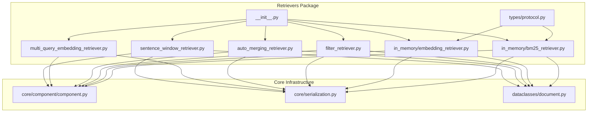
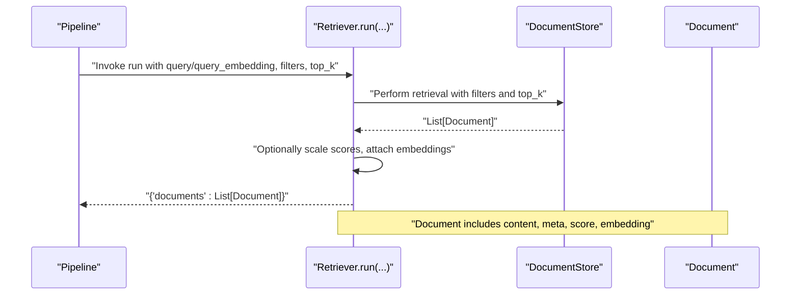
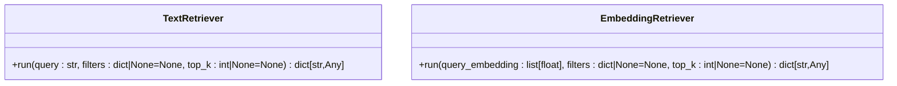
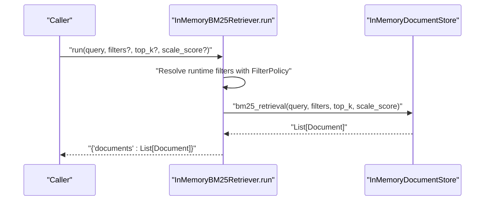
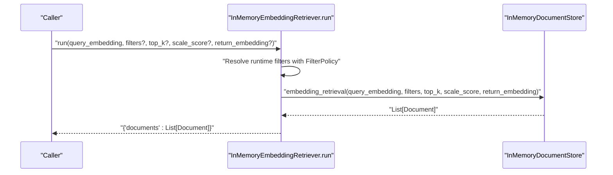
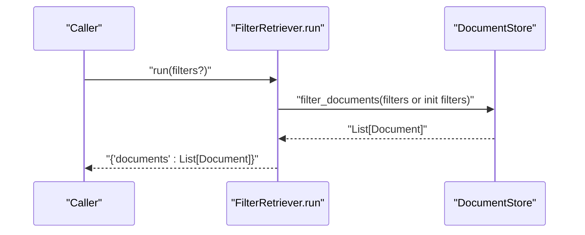
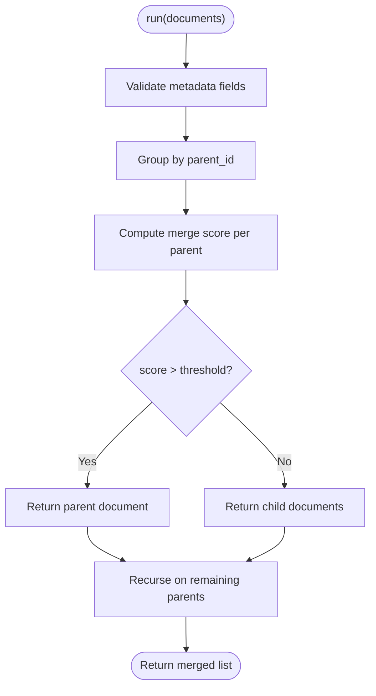
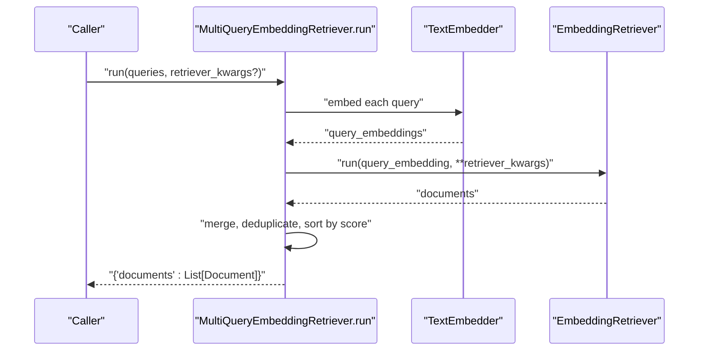
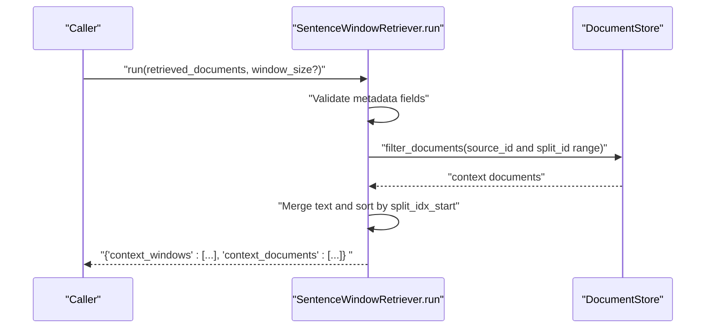
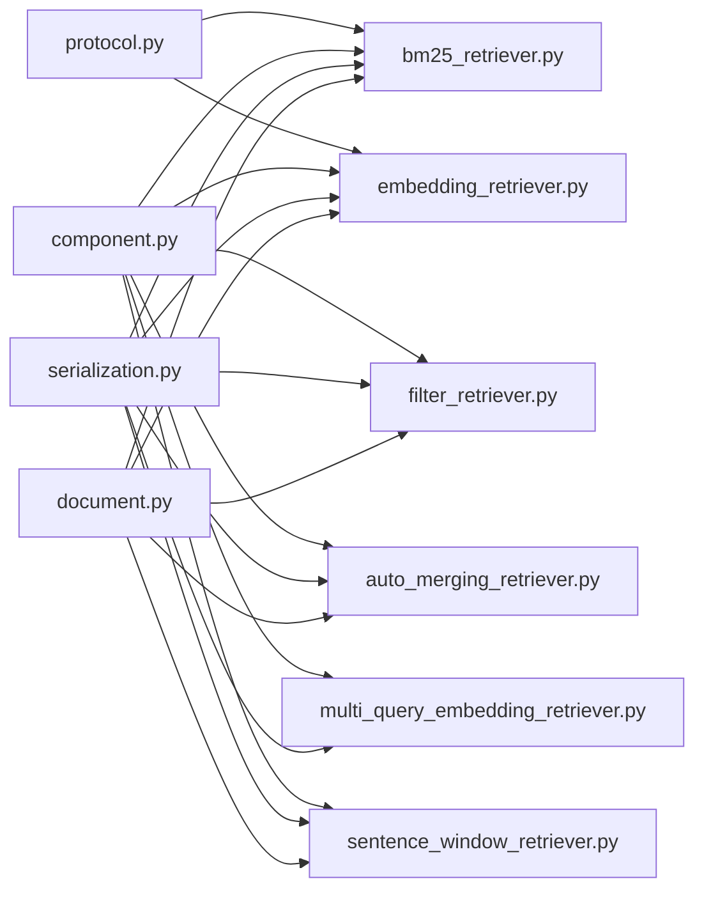

# Retriever Types and Interfaces

<cite>
**Referenced Files in This Document**
- [protocol.py](file://haystack/components/retrievers/types/protocol.py)
- [__init__.py](file://haystack/components/retrievers/__init__.py)
- [embedding_retriever.py](file://haystack/components/retrievers/in_memory/embedding_retriever.py)
- [bm25_retriever.py](file://haystack/components/retrievers/in_memory/bm25_retriever.py)
- [filter_retriever.py](file://haystack/components/retrievers/filter_retriever.py)
- [auto_merging_retriever.py](file://haystack/components/retrievers/auto_merging_retriever.py)
- [multi_query_embedding_retriever.py](file://haystack/components/retrievers/multi_query_embedding_retriever.py)
- [sentence_window_retriever.py](file://haystack/components/retrievers/sentence_window_retriever.py)
- [document.py](file://haystack/dataclasses/document.py)
- [component.py](file://haystack/core/component/component.py)
- [serialization.py](file://haystack/core/serialization.py)
- [test_in_memory_bm25_retriever.py](file://test/components/retrievers/test_in_memory_bm25_retriever.py)
</cite>

## Table of Contents
1. [Introduction](#introduction)
2. [Project Structure](#project-structure)
3. [Core Components](#core-components)
4. [Architecture Overview](#architecture-overview)
5. [Detailed Component Analysis](#detailed-component-analysis)
6. [Dependency Analysis](#dependency-analysis)
7. [Performance Considerations](#performance-considerations)
8. [Troubleshooting Guide](#troubleshooting-guide)
9. [Conclusion](#conclusion)
10. [Appendices](#appendices)

## Introduction
This document provides comprehensive documentation for retriever type definitions and interface contracts in Haystack. It focuses on:
- The retriever protocols that define the minimal interface for text and embedding-based retrievers
- Common interface methods, input/output specifications, and type annotations
- Document filtering criteria, result formatting, and score handling
- Pipeline integration patterns, component registration, and serialization interfaces
- Examples of custom retriever implementation, compliance requirements, and best practices
- Type safety considerations, generic type parameters, and backward compatibility

## Project Structure
Retriever-related code is organized under the retrievers package, with:
- A dedicated types module exposing protocol definitions for retrievers
- Multiple in-memory implementations for BM25 and embedding-based retrieval
- Additional specialized retrievers such as filter, auto-merging, multi-query, and sentence-window retrievers
- Core component and serialization infrastructure enabling pipeline integration and persistence

**Diagram sources**
- [protocol.py](file://haystack/components/retrievers/types/protocol.py#L1-L57)
- [__init__.py](file://haystack/components/retrievers/__init__.py#L1-L30)
- [bm25_retriever.py](file://haystack/components/retrievers/in_memory/bm25_retriever.py#L1-L197)
- [embedding_retriever.py](file://haystack/components/retrievers/in_memory/embedding_retriever.py#L1-L237)
- [filter_retriever.py](file://haystack/components/retrievers/filter_retriever.py#L1-L105)
- [auto_merging_retriever.py](file://haystack/components/retrievers/auto_merging_retriever.py#L1-L227)
- [multi_query_embedding_retriever.py](file://haystack/components/retrievers/multi_query_embedding_retriever.py#L1-L167)
- [sentence_window_retriever.py](file://haystack/components/retrievers/sentence_window_retriever.py#L1-L322)
- [component.py](file://haystack/core/component/component.py#L1-L645)
- [serialization.py](file://haystack/core/serialization.py#L1-L336)
- [document.py](file://haystack/dataclasses/document.py#L1-L190)

**Section sources**
- [__init__.py](file://haystack/components/retrievers/__init__.py#L1-L30)
- [protocol.py](file://haystack/components/retrievers/types/protocol.py#L1-L57)

## Core Components
This section outlines the retriever protocols and the core interface contracts that all retrievers must satisfy.

- TextRetriever protocol
  - Defines the minimal interface for keyword-based retrievers
  - run(query: str, filters: dict | None = None, top_k: int | None = None) -> dict[str, Any]
  - Returns a dictionary containing a key "documents" with a list of Document objects sorted by relevance

- EmbeddingRetriever protocol
  - Defines the minimal interface for embedding-based retrievers
  - run(query_embedding: list[float], filters: dict | None = None, top_k: int | None = None) -> dict[str, Any]
  - Returns a dictionary containing a key "documents" with a list of Document objects sorted by relevance

- Document model
  - Document supports embedding as a list of floats and includes metadata and score fields
  - Backward compatibility handling ensures numeric embeddings are normalized to lists

- Component contract and serialization
  - All retrievers are decorated with the component decorator and expose run/run_async methods
  - Serialization interfaces default_to_dict/from_dict enable pipeline persistence and loading

**Section sources**
- [protocol.py](file://haystack/components/retrievers/types/protocol.py#L8-L31)
- [protocol.py](file://haystack/components/retrievers/types/protocol.py#L33-L56)
- [document.py](file://haystack/dataclasses/document.py#L48-L71)
- [component.py](file://haystack/core/component/component.py#L136-L185)
- [serialization.py](file://haystack/core/serialization.py#L177-L227)

## Architecture Overview
The retriever ecosystem integrates with the broader Haystack pipeline architecture:
- Retriever components implement the run method and return a dictionary with a "documents" key
- Filters are expressed as structured dictionaries and passed to the underlying document store
- Results are Document objects enriched with scores and metadata
- Pipeline registration and execution rely on the component decorator and socket-based I/O

**Diagram sources**
- [bm25_retriever.py](file://haystack/components/retrievers/in_memory/bm25_retriever.py#L121-L156)
- [embedding_retriever.py](file://haystack/components/retrievers/in_memory/embedding_retriever.py#L177-L185)
- [document.py](file://haystack/dataclasses/document.py#L48-L71)

## Detailed Component Analysis

### Retriever Protocols
- Purpose: Define the minimal interface that all retrievers must implement
- TextRetriever: Accepts a text query and returns documents
- EmbeddingRetriever: Accepts a vectorized query and returns documents
- Both protocols standardize the output shape to include a "documents" key

**Diagram sources**
- [protocol.py](file://haystack/components/retrievers/types/protocol.py#L8-L31)
- [protocol.py](file://haystack/components/retrievers/types/protocol.py#L33-L56)

**Section sources**
- [protocol.py](file://haystack/components/retrievers/types/protocol.py#L8-L56)

### InMemoryBM25Retriever
- Keyword-based retrieval using BM25
- Input parameters: query (str), filters (dict), top_k (int), scale_score (bool)
- Output: {"documents": List[Document]}
- Supports async execution via run_async
- Uses FilterPolicy to merge or replace runtime filters

**Diagram sources**
- [bm25_retriever.py](file://haystack/components/retrievers/in_memory/bm25_retriever.py#L121-L156)

**Section sources**
- [bm25_retriever.py](file://haystack/components/retrievers/in_memory/bm25_retriever.py#L13-L156)

### InMemoryEmbeddingRetriever
- Semantic retrieval using embedding similarity
- Input parameters: query_embedding (list[float]), filters (dict), top_k (int), scale_score (bool), return_embedding (bool)
- Output: {"documents": List[Document]}
- Supports async execution via run_async
- Uses FilterPolicy to merge or replace runtime filters

**Diagram sources**
- [embedding_retriever.py](file://haystack/components/retrievers/in_memory/embedding_retriever.py#L177-L185)

**Section sources**
- [embedding_retriever.py](file://haystack/components/retrievers/in_memory/embedding_retriever.py#L13-L185)

### FilterRetriever
- Retrieves documents matching provided filters
- Input parameters: filters (dict)
- Output: {"documents": List[Document]}
- Supports async execution via run_async

**Diagram sources**
- [filter_retriever.py](file://haystack/components/retrievers/filter_retriever.py#L79-L89)

**Section sources**
- [filter_retriever.py](file://haystack/components/retrievers/filter_retriever.py#L12-L89)

### AutoMergingRetriever
- Merges leaf documents into parent documents based on a threshold
- Validates required metadata fields (__parent_id, __level, __block_size)
- Input: List[Document]
- Output: {"documents": List[Document]}
- Supports async execution via run_async

**Diagram sources**
- [auto_merging_retriever.py](file://haystack/components/retrievers/auto_merging_retriever.py#L114-L167)

**Section sources**
- [auto_merging_retriever.py](file://haystack/components/retrievers/auto_merging_retriever.py#L13-L167)

### MultiQueryEmbeddingRetriever
- Executes multiple queries in parallel and aggregates results
- Requires an EmbeddingRetriever and a TextEmbedder
- Input parameters: queries (list[str]), retriever_kwargs (dict)
- Output: {"documents": List[Document]}
- Includes deduplication and sorting by score

**Diagram sources**
- [multi_query_embedding_retriever.py](file://haystack/components/retrievers/multi_query_embedding_retriever.py#L100-L126)

**Section sources**
- [multi_query_embedding_retriever.py](file://haystack/components/retrievers/multi_query_embedding_retriever.py#L15-L126)

### SentenceWindowRetriever
- Enhances retrieved documents by fetching neighboring chunks based on metadata
- Inputs: retrieved_documents (List[Document]), optional window_size
- Outputs: {"context_windows": List[str], "context_documents": List[Document]}
- Supports async execution via run_async

**Diagram sources**
- [sentence_window_retriever.py](file://haystack/components/retrievers/sentence_window_retriever.py#L181-L211)

**Section sources**
- [sentence_window_retriever.py](file://haystack/components/retrievers/sentence_window_retriever.py#L14-L211)

## Dependency Analysis
- Protocol-driven design: TextRetriever and EmbeddingRetriever define the interface contracts
- Component decoration: All retrievers are decorated with @component and expose run/run_async
- Serialization: default_to_dict/from_dict enable component persistence and pipeline reconstruction
- Document model: Document supports embedding as list[float] and metadata/score fields
- FilterPolicy: Controls how runtime filters interact with initialization filters

**Diagram sources**
- [protocol.py](file://haystack/components/retrievers/types/protocol.py#L1-L57)
- [bm25_retriever.py](file://haystack/components/retrievers/in_memory/bm25_retriever.py#L1-L197)
- [embedding_retriever.py](file://haystack/components/retrievers/in_memory/embedding_retriever.py#L1-L237)
- [filter_retriever.py](file://haystack/components/retrievers/filter_retriever.py#L1-L105)
- [auto_merging_retriever.py](file://haystack/components/retrievers/auto_merging_retriever.py#L1-L227)
- [multi_query_embedding_retriever.py](file://haystack/components/retrievers/multi_query_embedding_retriever.py#L1-L167)
- [sentence_window_retriever.py](file://haystack/components/retrievers/sentence_window_retriever.py#L1-L322)
- [component.py](file://haystack/core/component/component.py#L1-L645)
- [serialization.py](file://haystack/core/serialization.py#L1-L336)
- [document.py](file://haystack/dataclasses/document.py#L1-L190)

**Section sources**
- [__init__.py](file://haystack/components/retrievers/__init__.py#L10-L29)
- [component.py](file://haystack/core/component/component.py#L572-L642)
- [serialization.py](file://haystack/core/serialization.py#L177-L227)

## Performance Considerations
- Parallel execution: MultiQueryEmbeddingRetriever uses a thread pool to process multiple queries concurrently
- Deduplication and sorting: Aggregated results are de-duplicated and sorted by score to reduce redundant documents
- FilterPolicy: MERGE mode combines initialization and runtime filters to narrow search scope efficiently
- Async support: Several retrievers provide run_async for non-blocking retrieval operations

[No sources needed since this section provides general guidance]

## Troubleshooting Guide
Common issues and resolutions:
- Invalid top_k: Ensure top_k is greater than 0; otherwise, constructors raise a ValueError
- Unsupported document store: Some retrievers validate the type of the provided document store and raise a TypeError if not supported
- Missing metadata fields: SentenceWindowRetriever requires specific metadata fields; missing fields trigger warnings or errors depending on configuration
- Threshold validation: AutoMergingRetriever expects threshold between 0 and 1; otherwise, a ValueError is raised
- Pipeline integration: Verify that retrievers are decorated with @component and return a dictionary with a "documents" key

**Section sources**
- [embedding_retriever.py](file://haystack/components/retrievers/in_memory/embedding_retriever.py#L89-L96)
- [bm25_retriever.py](file://haystack/components/retrievers/in_memory/bm25_retriever.py#L75-L81)
- [sentence_window_retriever.py](file://haystack/components/retrievers/sentence_window_retriever.py#L107-L118)
- [auto_merging_retriever.py](file://haystack/components/retrievers/auto_merging_retriever.py#L74-L76)
- [filter_retriever.py](file://haystack/components/retrievers/filter_retriever.py#L48-L49)

## Conclusion
Haystack’s retriever system is built around well-defined protocols and a robust component architecture:
- Protocols TextRetriever and EmbeddingRetriever standardize the interface for keyword and semantic retrieval
- Implementations adhere to the component contract, ensuring consistent I/O and serialization
- Advanced retrievers extend the base capabilities with specialized behaviors such as auto-merging, sentence windows, and multi-query processing
- Type safety and backward compatibility are maintained through careful type annotations and data model normalization

[No sources needed since this section summarizes without analyzing specific files]

## Appendices

### Input/Output Specifications and Type Annotations
- TextRetriever.run
  - Inputs: query: str, filters: dict[str, Any] | None = None, top_k: int | None = None
  - Output: dict[str, Any] with "documents": List[Document]
- EmbeddingRetriever.run
  - Inputs: query_embedding: list[float], filters: dict[str, Any] | None = None, top_k: int | None = None
  - Output: dict[str, Any] with "documents": List[Document]
- Document fields
  - embedding: list[float] | None
  - meta: dict[str, Any]
  - score: float | None

**Section sources**
- [protocol.py](file://haystack/components/retrievers/types/protocol.py#L16-L30)
- [protocol.py](file://haystack/components/retrievers/types/protocol.py#L41-L56)
- [document.py](file://haystack/dataclasses/document.py#L68-L70)

### Pipeline Integration Patterns
- Component registration: All retrievers are decorated with @component and registered in the component registry
- Socket-based I/O: The component system infers input/output sockets from the run method signature and decorators
- Pipeline execution: Retrievers are added to pipelines and invoked with a dictionary mapping parameter names to values

**Section sources**
- [component.py](file://haystack/core/component/component.py#L572-L642)
- [test_in_memory_bm25_retriever.py](file://test/components/retrievers/test_in_memory_bm25_retriever.py#L151-L192)

### Serialization Interfaces
- default_to_dict: Produces a dictionary with type and init_parameters for persistence
- default_from_dict: Restores a component instance from serialized data
- component_to_dict/component_from_dict: Utilities for nested component serialization

**Section sources**
- [serialization.py](file://haystack/core/serialization.py#L177-L227)
- [serialization.py](file://haystack/core/serialization.py#L250-L312)

### Best Practices for Custom Retriever Implementation
- Implement the appropriate protocol (TextRetriever or EmbeddingRetriever) to ensure interface compliance
- Decorate the class with @component and define run/run_async methods returning a dictionary with "documents"
- Support filters and top_k consistently; honor FilterPolicy semantics if applicable
- Provide to_dict/from_dict methods for serialization; ensure init parameters are JSON serializable
- Validate inputs (e.g., top_k > 0) and raise appropriate exceptions
- Consider async support for non-blocking retrieval

**Section sources**
- [protocol.py](file://haystack/components/retrievers/types/protocol.py#L8-L56)
- [component.py](file://haystack/core/component/component.py#L572-L642)
- [embedding_retriever.py](file://haystack/components/retrievers/in_memory/embedding_retriever.py#L104-L135)
- [bm25_retriever.py](file://haystack/components/retrievers/in_memory/bm25_retriever.py#L89-L118)