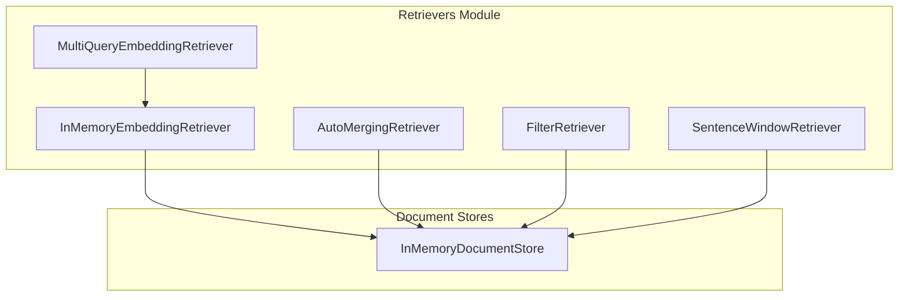
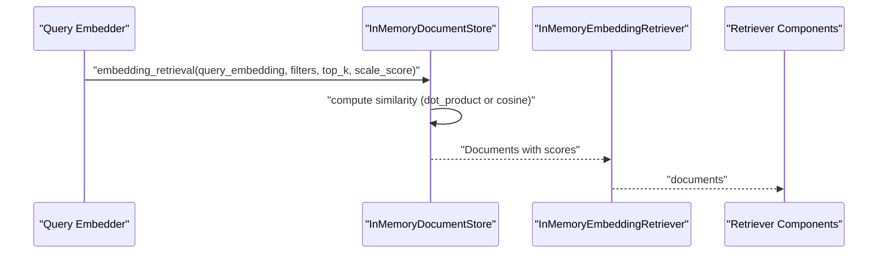
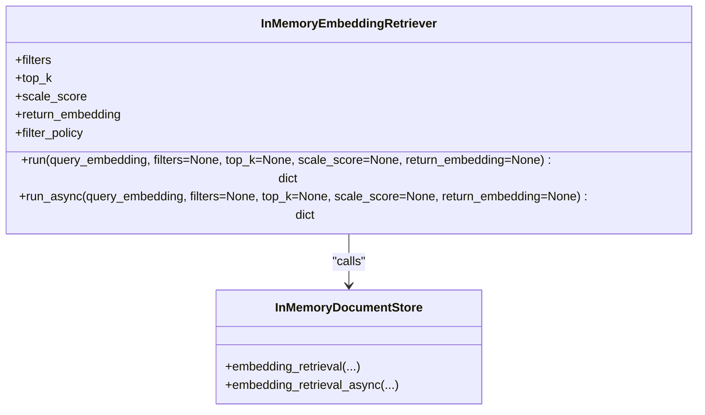
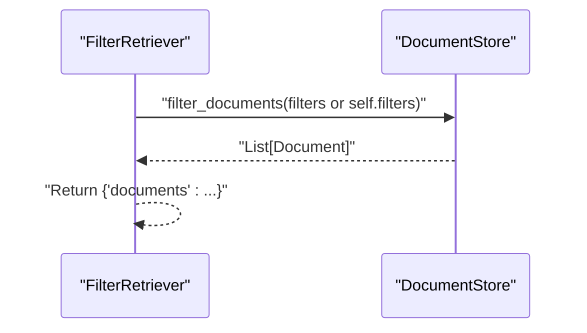
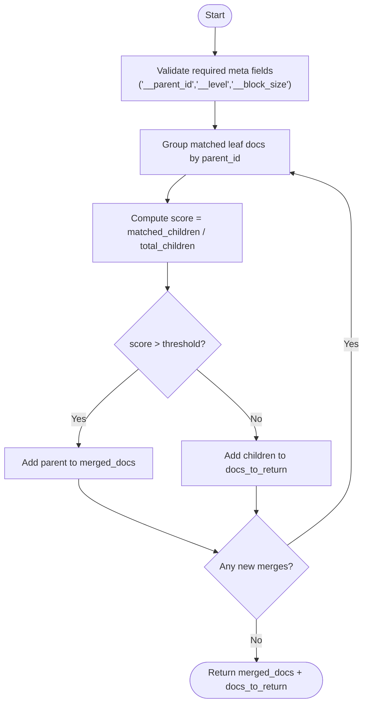
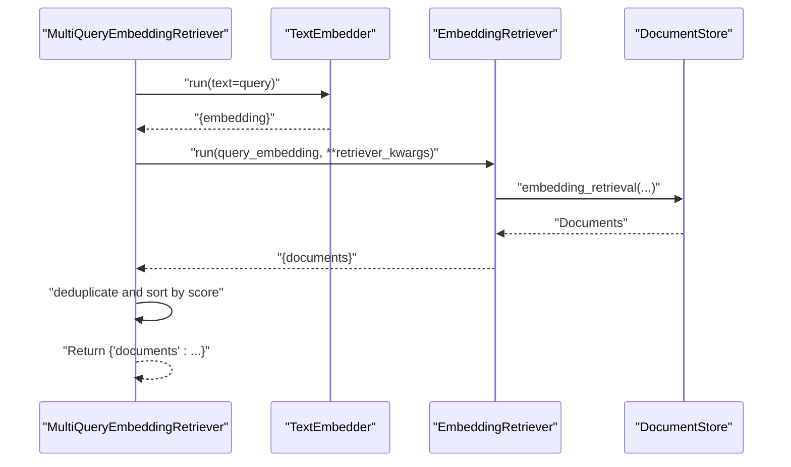
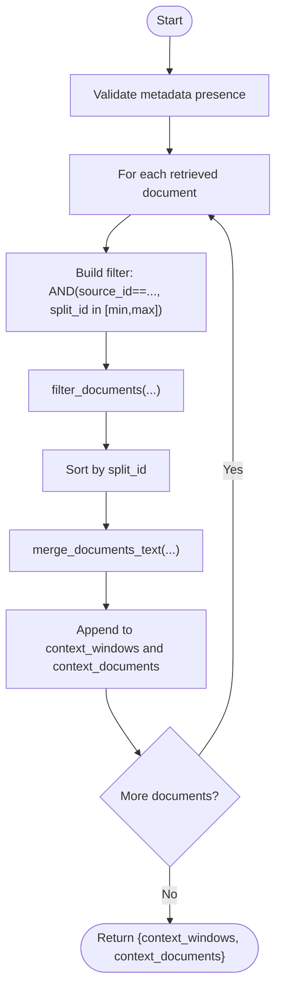
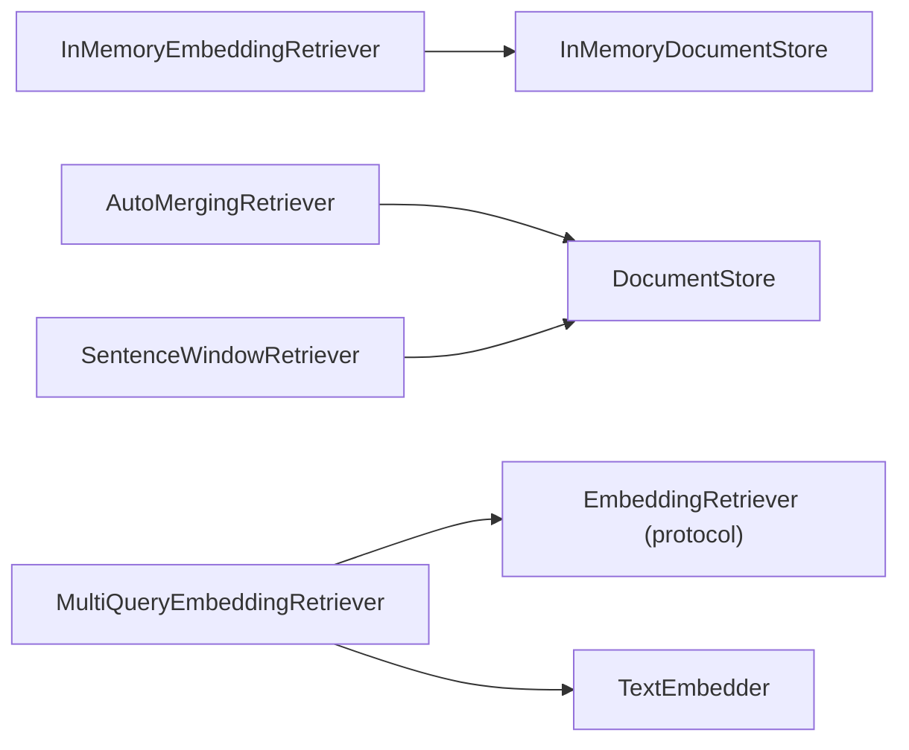

# Semantic Retrievers

<cite>
**Referenced Files in This Document**
- [__init__.py](file://haystack/components/retrievers/__init__.py)
- [embedding_retriever.py](file://haystack/components/retrievers/in_memory/embedding_retriever.py)
- [auto_merging_retriever.py](file://haystack/components/retrievers/auto_merging_retriever.py)
- [filter_retriever.py](file://haystack/components/retrievers/filter_retriever.py)
- [multi_query_embedding_retriever.py](file://haystack/components/retrievers/multi_query_embedding_retriever.py)
- [sentence_window_retriever.py](file://haystack/components/retrievers/sentence_window_retriever.py)
- [protocol.py](file://haystack/components/retrievers/types/protocol.py)
- [document_store.py](file://haystack/document_stores/in_memory/document_store.py)
- [test_in_memory.py](file://test/document_stores/test_in_memory.py)
- [test_in_memory_embedding_retriever.py](file://test/components/retrievers/test_in_memory_embedding_retriever.py)
</cite>

## Table of Contents
1. [Introduction](#introduction)
2. [Project Structure](#project-structure)
3. [Core Components](#core-components)
4. [Architecture Overview](#architecture-overview)
5. [Detailed Component Analysis](#detailed-component-analysis)
6. [Dependency Analysis](#dependency-analysis)
7. [Performance Considerations](#performance-considerations)
8. [Troubleshooting Guide](#troubleshooting-guide)
9. [Conclusion](#conclusion)

## Introduction
This document provides comprehensive API documentation for semantic search retrievers in Haystack. It focuses on embedding-based retrieval components and supporting utilities:
- InMemoryEmbeddingRetriever
- FilterRetriever
- AutoMergingRetriever
- MultiQueryEmbeddingRetriever
- SentenceWindowRetriever

It explains embedding similarity calculations, vector distance metrics, score threshold configurations, and batch processing capabilities. It also covers method signatures for query_embedding, top_k selection, filters application, and metadata-based scoring. Practical examples, performance optimization techniques for large document collections, and integration patterns with various embedding models are included. Specialized features such as auto-merging strategies, query expansion techniques, and window-based context retrieval are documented.

## Project Structure
The retrievers are organized under the retrievers module. The in-memory embedding retriever integrates with the InMemoryDocumentStore, which implements vector similarity computations and supports configurable similarity functions and score scaling.

**Diagram sources**
- [__init__.py](file://haystack/components/retrievers/__init__.py#L10-L29)
- [embedding_retriever.py](file://haystack/components/retrievers/in_memory/embedding_retriever.py#L12-L237)
- [auto_merging_retriever.py](file://haystack/components/retrievers/auto_merging_retriever.py#L12-L227)
- [filter_retriever.py](file://haystack/components/retrievers/filter_retriever.py#L11-L105)
- [multi_query_embedding_retriever.py](file://haystack/components/retrievers/multi_query_embedding_retriever.py#L15-L167)
- [sentence_window_retriever.py](file://haystack/components/retrievers/sentence_window_retriever.py#L13-L322)
- [document_store.py](file://haystack/document_stores/in_memory/document_store.py#L59-L800)

**Section sources**
- [__init__.py](file://haystack/components/retrievers/__init__.py#L10-L29)

## Core Components
This section summarizes the primary retrievers and their roles in semantic search.

- InMemoryEmbeddingRetriever
  - Purpose: Retrieves documents most similar to a query embedding using vector similarity in InMemoryDocumentStore.
  - Key parameters: filters, top_k, scale_score, return_embedding, filter_policy.
  - Methods: run, run_async.

- FilterRetriever
  - Purpose: Retrieves documents matching provided metadata filters.
  - Methods: run, run_async.

- AutoMergingRetriever
  - Purpose: Merges matched leaf documents into parent documents based on a threshold of children coverage.
  - Parameters: document_store, threshold.
  - Methods: run, run_async.

- MultiQueryEmbeddingRetriever
  - Purpose: Expands a list of text queries into embeddings and retrieves documents using an embedding-based retriever in parallel.
  - Parameters: retriever, query_embedder, max_workers.
  - Methods: run, warm_up.

- SentenceWindowRetriever
  - Purpose: Retrieves neighboring document chunks around a retrieved document to provide contextual windows.
  - Parameters: document_store, window_size, source_id_meta_field, split_id_meta_field, raise_on_missing_meta_fields.
  - Methods: run, run_async, merge_documents_text.

**Section sources**
- [embedding_retriever.py](file://haystack/components/retrievers/in_memory/embedding_retriever.py#L12-L237)
- [filter_retriever.py](file://haystack/components/retrievers/filter_retriever.py#L11-L105)
- [auto_merging_retriever.py](file://haystack/components/retrievers/auto_merging_retriever.py#L12-L227)
- [multi_query_embedding_retriever.py](file://haystack/components/retrievers/multi_query_embedding_retriever.py#L15-L167)
- [sentence_window_retriever.py](file://haystack/components/retrievers/sentence_window_retriever.py#L13-L322)

## Architecture Overview
The semantic retrieval pipeline typically involves embedding generation, document indexing with embeddings, and retrieval using vector similarity. The InMemoryDocumentStore computes similarity scores and optionally scales them. Retrievers wrap the store’s retrieval methods and expose a standardized component interface.

**Diagram sources**
- [document_store.py](file://haystack/document_stores/in_memory/document_store.py#L610-L722)
- [embedding_retriever.py](file://haystack/components/retrievers/in_memory/embedding_retriever.py#L136-L185)

## Detailed Component Analysis

### InMemoryEmbeddingRetriever
- Role: Bridges a query embedding to the InMemoryDocumentStore’s embedding_retrieval.
- Parameters and behavior:
  - filters: Runtime or initialization filters; behavior depends on filter_policy.
  - top_k: Number of top documents to return.
  - scale_score: Whether to scale scores to [0,1] or keep raw similarity.
  - return_embedding: Whether to include embeddings in returned documents.
  - filter_policy: REPLACE or MERGE to combine runtime and initialization filters.
- Methods:
  - run(query_embedding, filters=None, top_k=None, scale_score=None, return_embedding=None)
  - run_async(...): Async variant.
- Notes:
  - Validates top_k > 0 and document_store type.
  - Delegates to document_store.embedding_retrieval and returns {"documents": ...}.

**Diagram sources**
- [embedding_retriever.py](file://haystack/components/retrievers/in_memory/embedding_retriever.py#L51-L237)
- [document_store.py](file://haystack/document_stores/in_memory/document_store.py#L610-L722)

**Section sources**
- [embedding_retriever.py](file://haystack/components/retrievers/in_memory/embedding_retriever.py#L51-L237)
- [test_in_memory_embedding_retriever.py](file://test/components/retrievers/test_in_memory_embedding_retriever.py#L17-L169)

### FilterRetriever
- Role: Applies metadata filters to retrieve documents from any DocumentStore.
- Methods:
  - run(filters=None)
  - run_async(filters=None)

**Diagram sources**
- [filter_retriever.py](file://haystack/components/retrievers/filter_retriever.py#L78-L104)

**Section sources**
- [filter_retriever.py](file://haystack/components/retrievers/filter_retriever.py#L39-L105)

### AutoMergingRetriever
- Role: Merges matched leaf documents into parent documents when a fraction of children exceeds a threshold.
- Parameters:
  - document_store: Must support filter_documents (and filter_documents_async if used asynchronously).
  - threshold: Fraction of children covered to trigger merging.
- Behavior:
  - Validates threshold in (0,1).
  - Groups matched leaf documents by parent_id, computes coverage, and recursively merges up the hierarchy if thresholds are met.
- Methods:
  - run(documents)
  - run_async(documents)

**Diagram sources**
- [auto_merging_retriever.py](file://haystack/components/retrievers/auto_merging_retriever.py#L101-L167)

**Section sources**
- [auto_merging_retriever.py](file://haystack/components/retrievers/auto_merging_retriever.py#L66-L227)

### MultiQueryEmbeddingRetriever
- Role: Parallel query expansion and retrieval using embeddings.
- Workflow:
  - Warm-up query_embedder and retriever if available.
  - For each query: embed -> run retriever -> collect results.
  - Deduplicate and sort by score.
- Parameters:
  - retriever: EmbeddingRetriever implementing the protocol.
  - query_embedder: TextEmbedder producing embeddings.
  - max_workers: Thread pool size for parallelism.
- Methods:
  - run(queries, retriever_kwargs=None)
  - warm_up()

**Diagram sources**
- [multi_query_embedding_retriever.py](file://haystack/components/retrievers/multi_query_embedding_retriever.py#L100-L141)
- [protocol.py](file://haystack/components/retrievers/types/protocol.py#L33-L57)

**Section sources**
- [multi_query_embedding_retriever.py](file://haystack/components/retrievers/multi_query_embedding_retriever.py#L75-L167)
- [protocol.py](file://haystack/components/retrievers/types/protocol.py#L33-L57)

### SentenceWindowRetriever
- Role: Enhances retrieval results by fetching neighboring chunks around each retrieved document.
- Metadata requirements:
  - source_id_meta_field(s): identifies the original document.
  - split_id_meta_field: order/index of the chunk.
- Behavior:
  - Builds filter conditions to include chunks within window_size before/after split_id.
  - Merges text while removing overlaps using split_idx_start.
- Methods:
  - run(retrieved_documents, window_size=None)
  - run_async(...)
  - merge_documents_text(documents)

**Diagram sources**
- [sentence_window_retriever.py](file://haystack/components/retrievers/sentence_window_retriever.py#L180-L244)
- [sentence_window_retriever.py](file://haystack/components/retrievers/sentence_window_retriever.py#L264-L322)

**Section sources**
- [sentence_window_retriever.py](file://haystack/components/retrievers/sentence_window_retriever.py#L84-L322)

## Dependency Analysis
- InMemoryEmbeddingRetriever depends on InMemoryDocumentStore for vector similarity and filtering.
- AutoMergingRetriever depends on a DocumentStore that supports filter_documents (and async variant).
- MultiQueryEmbeddingRetriever depends on an EmbeddingRetriever implementing the protocol and a TextEmbedder.
- SentenceWindowRetriever depends on a DocumentStore that supports filter_documents and requires specific metadata fields.

**Diagram sources**
- [embedding_retriever.py](file://haystack/components/retrievers/in_memory/embedding_retriever.py#L8-L9)
- [auto_merging_retriever.py](file://haystack/components/retrievers/auto_merging_retriever.py#L8-L9)
- [multi_query_embedding_retriever.py](file://haystack/components/retrievers/multi_query_embedding_retriever.py#L8-L12)
- [sentence_window_retriever.py](file://haystack/components/retrievers/sentence_window_retriever.py#L7-L8)
- [protocol.py](file://haystack/components/retrievers/types/protocol.py#L33-L57)

**Section sources**
- [protocol.py](file://haystack/components/retrievers/types/protocol.py#L8-L57)

## Performance Considerations
- Vector similarity and scaling
  - Similarity function: dot_product or cosine. Cosine normalization is applied before dot product computation.
  - Score scaling:
    - dot_product: expit(score / DOT_PRODUCT_SCALING_FACTOR)
    - cosine: (score + 1) / 2
  - Scaling factors are defined in the document store.
- Batch and parallel processing
  - MultiQueryEmbeddingRetriever uses a thread pool to embed queries and run retrievers concurrently.
  - InMemoryDocumentStore supports async retrieval via an internal executor.
- Large document collections
  - Use filters to reduce candidate sets before similarity computation.
  - Tune top_k to limit post-selection work.
  - Prefer cosine similarity when embeddings are normalized; otherwise dot_product may be appropriate.
- Concurrency
  - The test suite demonstrates concurrent embedding retrievals against InMemoryDocumentStore.

**Section sources**
- [document_store.py](file://haystack/document_stores/in_memory/document_store.py#L673-L722)
- [multi_query_embedding_retriever.py](file://haystack/components/retrievers/multi_query_embedding_retriever.py#L116-L126)
- [test_in_memory.py](file://test/document_stores/test_in_memory.py#L619-L642)

## Troubleshooting Guide
- Invalid top_k
  - InMemoryEmbeddingRetriever raises an error if top_k <= 0.
- Wrong document store type
  - InMemoryEmbeddingRetriever raises a TypeError if the document_store is not an InMemoryDocumentStore.
- Missing embeddings
  - InMemoryDocumentStore logs a warning and returns an empty list if no documents have embeddings during embedding_retrieval.
- Embedding dimension mismatch
  - InMemoryDocumentStore raises a DocumentStoreError if query embedding dimension differs from stored embeddings.
- Invalid filter syntax
  - InMemoryDocumentStore validates filters and raises ValueError for malformed filters.
- AutoMergingRetriever missing metadata
  - Raises ValueError if matched leaf documents lack required meta fields (__parent_id, __level, __block_size).
- SentenceWindowRetriever missing metadata
  - Raises ValueError if retrieved documents lack split_id_meta_field or required source_id_meta_field(s); can be configured to warn instead.

**Section sources**
- [embedding_retriever.py](file://haystack/components/retrievers/in_memory/embedding_retriever.py#L89-L96)
- [embedding_retriever.py](file://haystack/components/retrievers/in_memory/embedding_retriever.py#L163-L165)
- [document_store.py](file://haystack/document_stores/in_memory/document_store.py#L643-L653)
- [document_store.py](file://haystack/document_stores/in_memory/document_store.py#L709-L714)
- [document_store.py](file://haystack/document_stores/in_memory/document_store.py#L505-L510)
- [auto_merging_retriever.py](file://haystack/components/retrievers/auto_merging_retriever.py#L102-L112)
- [sentence_window_retriever.py](file://haystack/components/retrievers/sentence_window_retriever.py#L251-L262)

## Conclusion
The semantic retrieval stack in Haystack provides flexible, composable components for embedding-based search. InMemoryEmbeddingRetriever offers straightforward vector similarity retrieval with configurable scoring and filtering. FilterRetriever enables robust metadata-driven selection. AutoMergingRetriever improves coherence by aggregating chunk-level matches into parent documents. MultiQueryEmbeddingRetriever expands query coverage via parallel embedding and retrieval. SentenceWindowRetriever enriches results with neighboring context. Together, these components support scalable, high-performance semantic search pipelines across diverse embedding models and document collections.