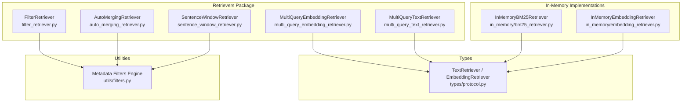
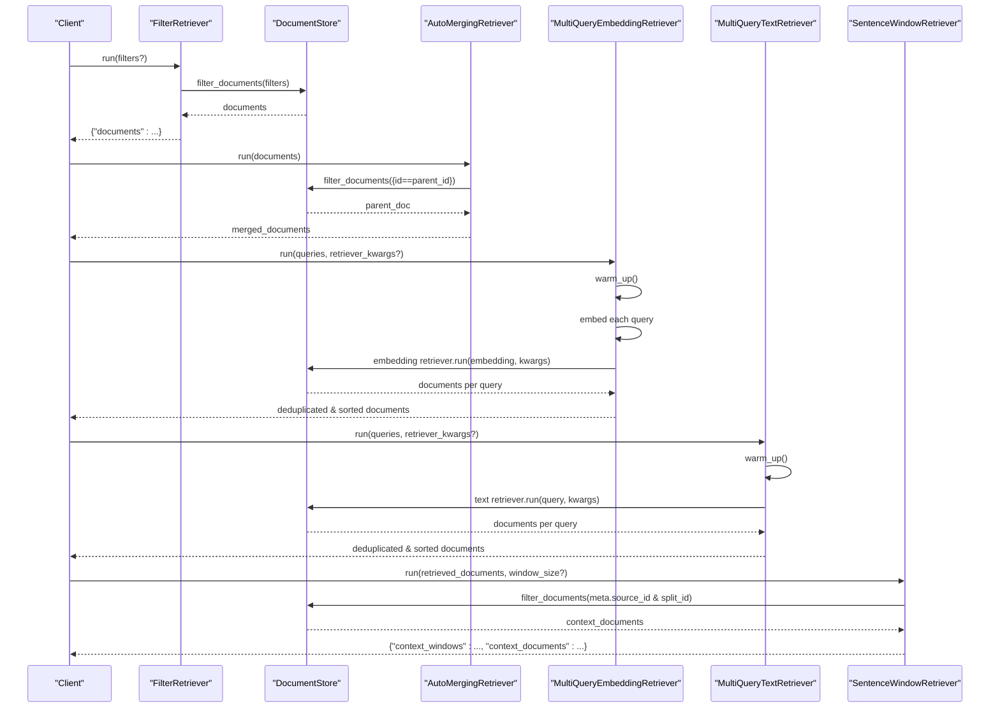
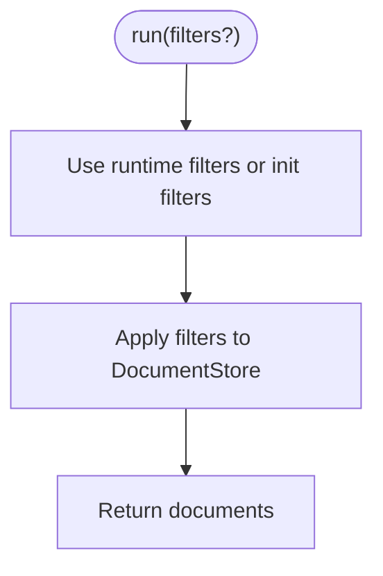
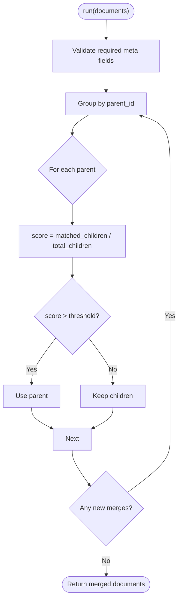
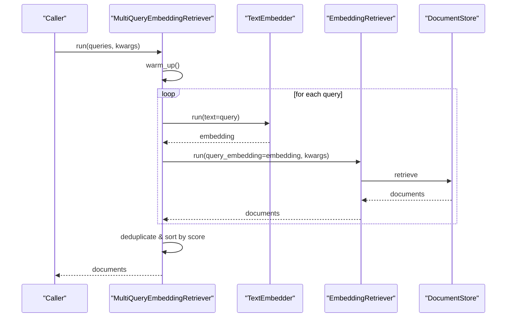
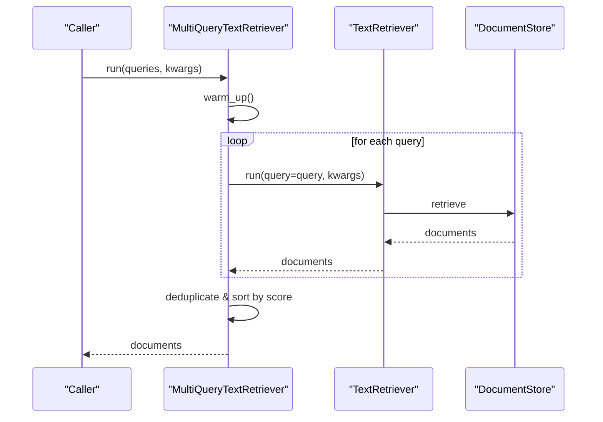
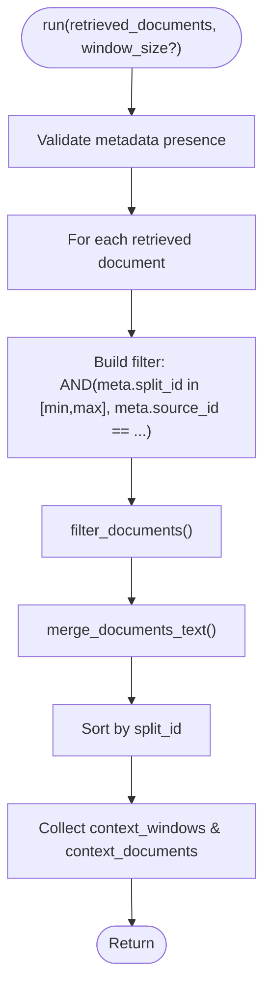
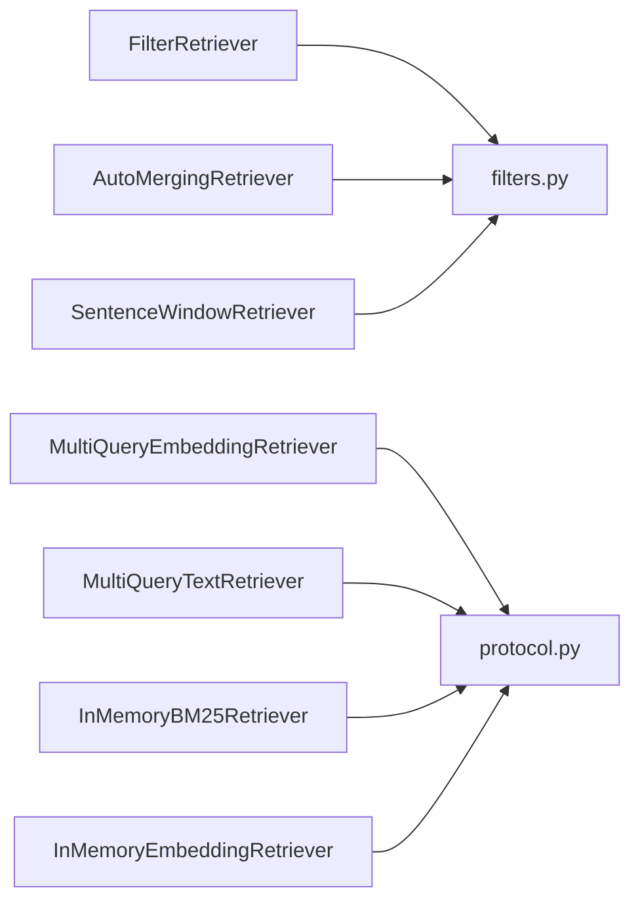

# Specialized Retrievers

<cite>
**Referenced Files in This Document**
- [filter_retriever.py](file://haystack/components/retrievers/filter_retriever.py)
- [auto_merging_retriever.py](file://haystack/components/retrievers/auto_merging_retriever.py)
- [multi_query_embedding_retriever.py](file://haystack/components/retrievers/multi_query_embedding_retriever.py)
- [multi_query_text_retriever.py](file://haystack/components/retrievers/multi_query_text_retriever.py)
- [sentence_window_retriever.py](file://haystack/components/retrievers/sentence_window_retriever.py)
- [protocol.py](file://haystack/components/retrievers/types/protocol.py)
- [filters.py](file://haystack/utils/filters.py)
- [test_filter_retriever.py](file://test/components/retrievers/test_filter_retriever.py)
- [test_auto_merging_retriever.py](file://test/components/retrievers/test_auto_merging_retriever.py)
- [embedding_retriever.py](file://haystack/components/retrievers/in_memory/embedding_retriever.py)
- [bm25_retriever.py](file://haystack/components/retrievers/in_memory/bm25_retriever.py)
</cite>

## Table of Contents
1. [Introduction](#introduction)
2. [Project Structure](#project-structure)
3. [Core Components](#core-components)
4. [Architecture Overview](#architecture-overview)
5. [Detailed Component Analysis](#detailed-component-analysis)
6. [Dependency Analysis](#dependency-analysis)
7. [Performance Considerations](#performance-considerations)
8. [Troubleshooting Guide](#troubleshooting-guide)
9. [Conclusion](#conclusion)
10. [Appendices](#appendices)

## Introduction
This document provides detailed API documentation for specialized retriever components with advanced functionality. It covers:
- FilterRetriever’s metadata filtering capabilities, boolean logic expressions, and temporal range queries
- AutoMergingRetriever’s hierarchical merging strategies, cluster-based retrieval, and adaptive merging algorithms
- MultiQueryEmbeddingRetriever and MultiQueryTextRetriever’s query expansion mechanisms, diverse question formulation, and ensemble scoring approaches
- SentenceWindowRetriever’s context window extraction, sliding window techniques, and sentence-level relevance scoring

For each retriever, we include configuration guidance, performance considerations, and use-case recommendations for complex retrieval scenarios.

## Project Structure
The specialized retrievers are implemented under the retrievers package. Supporting protocols define the minimum interfaces for text and embedding retrievers. Utility filters provide the engine for metadata filtering with boolean logic and temporal comparisons.

**Diagram sources**
- [filter_retriever.py](file://haystack/components/retrievers/filter_retriever.py#L11-L105)
- [auto_merging_retriever.py](file://haystack/components/retrievers/auto_merging_retriever.py#L12-L227)
- [multi_query_embedding_retriever.py](file://haystack/components/retrievers/multi_query_embedding_retriever.py#L15-L167)
- [multi_query_text_retriever.py](file://haystack/components/retrievers/multi_query_text_retriever.py#L14-L143)
- [sentence_window_retriever.py](file://haystack/components/retrievers/sentence_window_retriever.py#L13-L322)
- [protocol.py](file://haystack/components/retrievers/types/protocol.py#L8-L57)
- [filters.py](file://haystack/utils/filters.py#L15-L207)
- [bm25_retriever.py](file://haystack/components/retrievers/in_memory/bm25_retriever.py#L12-L197)
- [embedding_retriever.py](file://haystack/components/retrievers/in_memory/embedding_retriever.py#L12-L237)

**Section sources**
- [filter_retriever.py](file://haystack/components/retrievers/filter_retriever.py#L11-L105)
- [auto_merging_retriever.py](file://haystack/components/retrievers/auto_merging_retriever.py#L12-L227)
- [multi_query_embedding_retriever.py](file://haystack/components/retrievers/multi_query_embedding_retriever.py#L15-L167)
- [multi_query_text_retriever.py](file://haystack/components/retrievers/multi_query_text_retriever.py#L14-L143)
- [sentence_window_retriever.py](file://haystack/components/retrievers/sentence_window_retriever.py#L13-L322)
- [protocol.py](file://haystack/components/retrievers/types/protocol.py#L8-L57)
- [filters.py](file://haystack/utils/filters.py#L15-L207)
- [bm25_retriever.py](file://haystack/components/retrievers/in_memory/bm25_retriever.py#L12-L197)
- [embedding_retriever.py](file://haystack/components/retrievers/in_memory/embedding_retriever.py#L12-L237)

## Core Components
- FilterRetriever: Applies metadata filters to a DocumentStore to retrieve matching documents. Supports boolean logic and temporal comparisons via the filters engine.
- AutoMergingRetriever: Merges leaf matches into parent documents based on a configurable threshold, recursively climbing a hierarchical document structure.
- MultiQueryEmbeddingRetriever: Expands queries into embeddings and runs an embedding retriever in parallel across multiple workers, deduplicating and sorting results.
- MultiQueryTextRetriever: Runs a text-based retriever in parallel across multiple queries, deduplicating and sorting results.
- SentenceWindowRetriever: Extracts contextual windows around retrieved documents using split indices and source identifiers.

**Section sources**
- [filter_retriever.py](file://haystack/components/retrievers/filter_retriever.py#L11-L105)
- [auto_merging_retriever.py](file://haystack/components/retrievers/auto_merging_retriever.py#L12-L227)
- [multi_query_embedding_retriever.py](file://haystack/components/retrievers/multi_query_embedding_retriever.py#L15-L167)
- [multi_query_text_retriever.py](file://haystack/components/retrievers/multi_query_text_retriever.py#L14-L143)
- [sentence_window_retriever.py](file://haystack/components/retrievers/sentence_window_retriever.py#L13-L322)

## Architecture Overview
The specialized retrievers integrate with DocumentStores and optionally with text or embedding retrievers. They rely on a shared filters engine for metadata filtering and boolean logic.

**Diagram sources**
- [filter_retriever.py](file://haystack/components/retrievers/filter_retriever.py#L78-L104)
- [auto_merging_retriever.py](file://haystack/components/retrievers/auto_merging_retriever.py#L113-L167)
- [multi_query_embedding_retriever.py](file://haystack/components/retrievers/multi_query_embedding_retriever.py#L99-L141)
- [multi_query_text_retriever.py](file://haystack/components/retrievers/multi_query_text_retriever.py#L79-L120)
- [sentence_window_retriever.py](file://haystack/components/retrievers/sentence_window_retriever.py#L180-L244)

## Detailed Component Analysis

### FilterRetriever
- Purpose: Retrieve documents matching a metadata filter expression.
- Inputs:
  - filters: A dictionary specifying field, operator, and value, or a boolean logic expression combining multiple conditions.
- Boolean logic and temporal comparisons:
  - Operators include equality, inequality, ordering, membership, and negation.
  - Temporal comparisons support ISO date strings and automatic parsing; requires consistent timezone awareness.
- Async support: Uses an async filter_documents_async when available on the DocumentStore.
- Configuration tips:
  - Prefer passing filters at runtime to override initialization filters.
  - Combine with DocumentStore-specific filters to narrow results efficiently.

**Diagram sources**
- [filter_retriever.py](file://haystack/components/retrievers/filter_retriever.py#L78-L104)
- [filters.py](file://haystack/utils/filters.py#L15-L207)

**Section sources**
- [filter_retriever.py](file://haystack/components/retrievers/filter_retriever.py#L11-L105)
- [filters.py](file://haystack/utils/filters.py#L15-L207)
- [test_filter_retriever.py](file://test/components/retrievers/test_filter_retriever.py#L100-L147)

### AutoMergingRetriever
- Purpose: Merge multiple leaf matches under the same parent into a single parent document when a fraction threshold is exceeded.
- Assumptions:
  - Documents carry hierarchical metadata: parent_id, level, block_size, children_ids.
- Algorithm:
  - Group matched leaf documents by parent_id.
  - Compute fraction of children retrieved vs total children under the parent.
  - If fraction exceeds threshold, replace children with the parent; otherwise keep children.
  - Recursively repeat until no further merges occur.
- Async support: Uses async filter_documents_async when available.
- Configuration tips:
  - Tune threshold to balance granularity vs coherence (e.g., 0.5–0.7 for paragraph-level merging).
  - Ensure the underlying DocumentStore supports hierarchical metadata and parent lookups.

**Diagram sources**
- [auto_merging_retriever.py](file://haystack/components/retrievers/auto_merging_retriever.py#L113-L167)

**Section sources**
- [auto_merging_retriever.py](file://haystack/components/retrievers/auto_merging_retriever.py#L12-L227)
- [test_auto_merging_retriever.py](file://test/components/retrievers/test_auto_merging_retriever.py#L147-L263)

### MultiQueryEmbeddingRetriever
- Purpose: Expand a list of queries into embeddings and run an embedding-based retriever in parallel, then deduplicate and sort results.
- Inputs:
  - queries: List of text queries.
  - retriever: EmbeddingRetriever implementing the protocol.
  - query_embedder: TextEmbedder to produce query embeddings.
  - max_workers: Thread pool size for parallelism.
- Parallelism:
  - Uses ThreadPoolExecutor to embed and retrieve per query concurrently.
- Ensemble scoring:
  - Results are deduplicated and sorted by score.
- Configuration tips:
  - Warm up embedders and retrievers before heavy use.
  - Adjust max_workers according to CPU and memory capacity.

**Diagram sources**
- [multi_query_embedding_retriever.py](file://haystack/components/retrievers/multi_query_embedding_retriever.py#L99-L141)
- [protocol.py](file://haystack/components/retrievers/types/protocol.py#L33-L57)

**Section sources**
- [multi_query_embedding_retriever.py](file://haystack/components/retrievers/multi_query_embedding_retriever.py#L15-L167)
- [protocol.py](file://haystack/components/retrievers/types/protocol.py#L33-L57)

### MultiQueryTextRetriever
- Purpose: Run a text-based retriever in parallel across multiple queries, then deduplicate and sort results.
- Inputs:
  - queries: List of text queries.
  - retriever: TextRetriever implementing the protocol.
  - max_workers: Thread pool size for parallelism.
- Parallelism:
  - Uses ThreadPoolExecutor to run retriever per query concurrently.
- Ensemble scoring:
  - Results are deduplicated and sorted by score.
- Configuration tips:
  - Warm up the retriever if it exposes a warm_up method.
  - Combine with a QueryExpander to improve recall.

**Diagram sources**
- [multi_query_text_retriever.py](file://haystack/components/retrievers/multi_query_text_retriever.py#L79-L120)
- [protocol.py](file://haystack/components/retrievers/types/protocol.py#L8-L31)

**Section sources**
- [multi_query_text_retriever.py](file://haystack/components/retrievers/multi_query_text_retriever.py#L14-L143)
- [protocol.py](file://haystack/components/retrievers/types/protocol.py#L8-L31)

### SentenceWindowRetriever
- Purpose: Enrich retrieved documents with neighboring chunks to provide context.
- Inputs:
  - retrieved_documents: Documents from a prior retriever.
  - window_size: Number of adjacent chunks to include on each side.
  - source_id_meta_field: Field(s) identifying the original document.
  - split_id_meta_field: Field identifying chunk order.
- Sliding window technique:
  - Builds filter conditions to select chunks within a range around the split_id.
  - Merges texts while removing overlaps using split_idx_start.
- Outputs:
  - context_windows: Concatenated context text per retrieved document.
  - context_documents: Sorted list of context documents.
- Configuration tips:
  - Ensure documents include source_id and split_id metadata.
  - Use raise_on_missing_meta_fields to enforce metadata presence.

**Diagram sources**
- [sentence_window_retriever.py](file://haystack/components/retrievers/sentence_window_retriever.py#L180-L244)
- [sentence_window_retriever.py](file://haystack/components/retrievers/sentence_window_retriever.py#L246-L322)

**Section sources**
- [sentence_window_retriever.py](file://haystack/components/retrievers/sentence_window_retriever.py#L13-L322)

## Dependency Analysis
- FilterRetriever depends on a DocumentStore and the filters engine for boolean logic and temporal comparisons.
- AutoMergingRetriever depends on hierarchical metadata and a DocumentStore capable of parent lookups.
- MultiQueryEmbeddingRetriever and MultiQueryTextRetriever depend on the retriever protocols and optionally on embedders/writers for warm-up.
- SentenceWindowRetriever depends on a DocumentStore and metadata fields for source and split identification.

**Diagram sources**
- [filter_retriever.py](file://haystack/components/retrievers/filter_retriever.py#L7-L10)
- [auto_merging_retriever.py](file://haystack/components/retrievers/auto_merging_retriever.py#L8-L10)
- [sentence_window_retriever.py](file://haystack/components/retrievers/sentence_window_retriever.py#L7-L9)
- [multi_query_embedding_retriever.py](file://haystack/components/retrievers/multi_query_embedding_retriever.py#L8-L12)
- [multi_query_text_retriever.py](file://haystack/components/retrievers/multi_query_text_retriever.py#L8-L12)
- [protocol.py](file://haystack/components/retrievers/types/protocol.py#L5-L57)
- [filters.py](file://haystack/utils/filters.py#L15-L207)

**Section sources**
- [protocol.py](file://haystack/components/retrievers/types/protocol.py#L8-L57)
- [filters.py](file://haystack/utils/filters.py#L15-L207)

## Performance Considerations
- FilterRetriever
  - Prefer narrowing filters at runtime to reduce scan size.
  - Use DocumentStore-specific indexes for frequent filter fields.
- AutoMergingRetriever
  - Threshold tuning impacts recursion depth; moderate thresholds reduce parent lookups.
  - Ensure efficient parent lookup in the underlying DocumentStore.
- MultiQueryEmbeddingRetriever
  - Warm up embedders and retrievers to avoid cold-start latency spikes.
  - Tune max_workers to match CPU cores and memory headroom.
  - Deduplication and sorting add overhead; consider top_k reduction upstream.
- MultiQueryTextRetriever
  - Parallelism benefits from low-latency retrievers; warm up if applicable.
  - Combine with QueryExpander to increase recall without excessive worker load.
- SentenceWindowRetriever
  - Metadata completeness is crucial; missing fields cause fallback behavior.
  - window_size scales fetch volume linearly; choose modest sizes for throughput.

[No sources needed since this section provides general guidance]

## Troubleshooting Guide
- FilterRetriever
  - Invalid filter syntax raises errors; ensure operator and conditions are present.
  - Temporal comparisons require ISO date strings or parseable formats; mismatched timezones can cause errors.
- AutoMergingRetriever
  - Missing hierarchical metadata triggers explicit errors; verify __parent_id, __level, __block_size, and __children_ids.
  - Parent lookup returning zero or multiple documents indicates inconsistent metadata.
- MultiQueryEmbeddingRetriever
  - Missing documents from a query branch are skipped; verify embedder output and retriever kwargs.
  - Deduplication relies on document identity; ensure consistent hashing.
- MultiQueryTextRetriever
  - Missing documents from a query branch are skipped; verify retriever kwargs and filters.
- SentenceWindowRetriever
  - Missing source_id or split_id metadata logs warnings and falls back to the original document.
  - window_size must be positive; negative values raise errors.

**Section sources**
- [filters.py](file://haystack/utils/filters.py#L15-L207)
- [test_filter_retriever.py](file://test/components/retrievers/test_filter_retriever.py#L100-L147)
- [test_auto_merging_retriever.py](file://test/components/retrievers/test_auto_merging_retriever.py#L27-L62)
- [sentence_window_retriever.py](file://haystack/components/retrievers/sentence_window_retriever.py#L246-L322)

## Conclusion
These specialized retrievers enable sophisticated retrieval workflows:
- FilterRetriever provides robust metadata filtering with boolean logic and temporal comparisons.
- AutoMergingRetriever improves coherence by merging granular matches into higher-level documents.
- MultiQueryEmbeddingRetriever and MultiQueryTextRetriever leverage parallelism and ensemble scoring to expand recall and relevance.
- SentenceWindowRetriever enriches results with contextual windows for better understanding.

Adopt the configuration recommendations and performance guidelines to tailor these components to your retrieval tasks.

[No sources needed since this section summarizes without analyzing specific files]

## Appendices

### Configuration Examples
- FilterRetriever
  - Initialize with filters and override at runtime for dynamic targeting.
  - Example pattern: construct with broad filters and refine per-query.
- AutoMergingRetriever
  - Initialize with threshold (e.g., 0.5–0.7) and ensure hierarchical metadata is populated.
  - Example pattern: pair with a BM25 retriever to cluster leaf matches.
- MultiQueryEmbeddingRetriever
  - Provide an embedding retriever and a text embedder; set max_workers based on hardware.
  - Example pattern: warm_up before batch queries.
- MultiQueryTextRetriever
  - Provide a text retriever; optionally combine with a QueryExpander.
  - Example pattern: warm_up the retriever if supported.
- SentenceWindowRetriever
  - Ensure source_id_meta_field and split_id_meta_field are present.
  - Example pattern: set window_size to 2–4 depending on desired context breadth.

**Section sources**
- [filter_retriever.py](file://haystack/components/retrievers/filter_retriever.py#L39-L89)
- [auto_merging_retriever.py](file://haystack/components/retrievers/auto_merging_retriever.py#L66-L167)
- [multi_query_embedding_retriever.py](file://haystack/components/retrievers/multi_query_embedding_retriever.py#L75-L141)
- [multi_query_text_retriever.py](file://haystack/components/retrievers/multi_query_text_retriever.py#L59-L120)
- [sentence_window_retriever.py](file://haystack/components/retrievers/sentence_window_retriever.py#L84-L211)

### Use Case Recommendations
- Complex metadata filtering with boolean logic and temporal ranges
  - Use FilterRetriever with operator combinations and temporal comparisons.
  - Combine with DocumentStore-specific filters for performance.
- Hierarchical document structures (e.g., paragraphs split into sentences)
  - Use AutoMergingRetriever to surface coherent paragraphs instead of fragmented chunks.
  - Tune threshold to balance precision and recall.
- Broad query coverage and diverse question formulations
  - Use MultiQueryEmbeddingRetriever or MultiQueryTextRetriever to aggregate results from multiple query variants.
  - Warm up components and tune max_workers for throughput.
- Context-aware retrieval for downstream QA or summarization
  - Use SentenceWindowRetriever to include neighboring chunks around top-ranked segments.
  - Validate metadata completeness to avoid fallback behavior.

[No sources needed since this section provides general guidance]