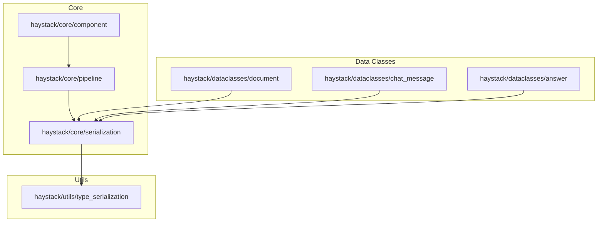
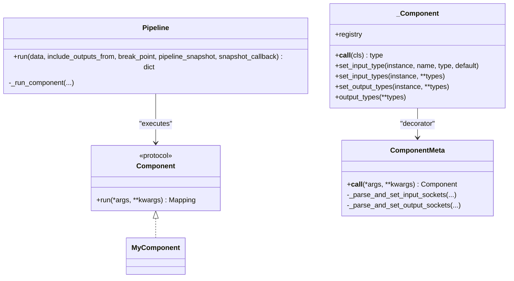
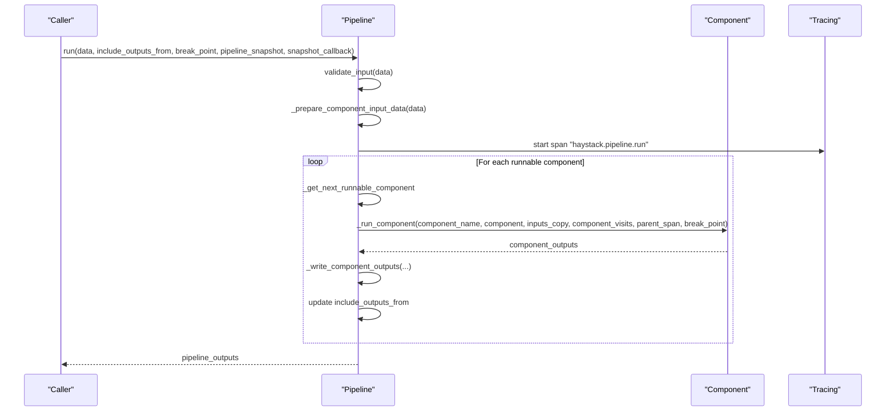
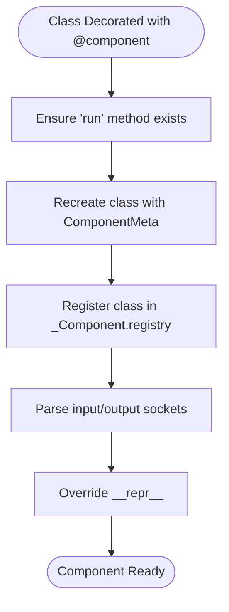
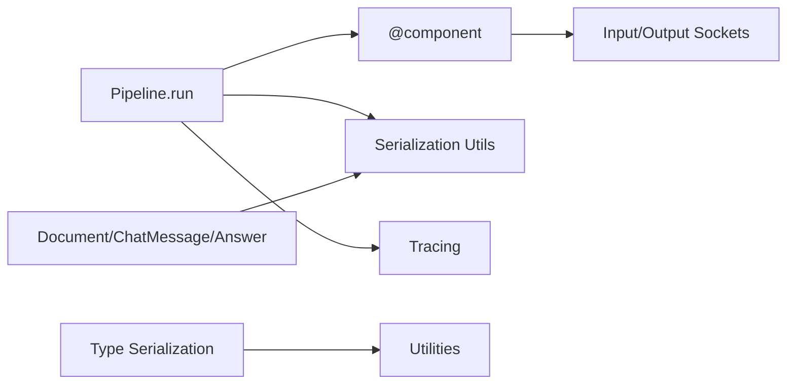

# Core API

<cite>
**Referenced Files in This Document**
- [haystack/__init__.py](file://haystack/__init__.py)
- [haystack/core/__init__.py](file://haystack/core/__init__.py)
- [haystack/core/component/__init__.py](file://haystack/core/component/__init__.py)
- [haystack/core/component/component.py](file://haystack/core/component/component.py)
- [haystack/core/pipeline/__init__.py](file://haystack/core/pipeline/__init__.py)
- [haystack/core/pipeline/pipeline.py](file://haystack/core/pipeline/pipeline.py)
- [haystack/core/serialization.py](file://haystack/core/serialization.py)
- [haystack/utils/type_serialization.py](file://haystack/utils/type_serialization.py)
- [haystack/dataclasses/__init__.py](file://haystack/dataclasses/__init__.py)
- [haystack/dataclasses/document.py](file://haystack/dataclasses/document.py)
- [haystack/dataclasses/chat_message.py](file://haystack/dataclasses/chat_message.py)
- [haystack/dataclasses/answer.py](file://haystack/dataclasses/answer.py)
</cite>

## Table of Contents
1. [Introduction](#introduction)
2. [Project Structure](#project-structure)
3. [Core Components](#core-components)
4. [Architecture Overview](#architecture-overview)
5. [Detailed Component Analysis](#detailed-component-analysis)
6. [Dependency Analysis](#dependency-analysis)
7. [Performance Considerations](#performance-considerations)
8. [Troubleshooting Guide](#troubleshooting-guide)
9. [Conclusion](#conclusion)
10. [Appendices](#appendices)

## Introduction
This document provides comprehensive API documentation for the core Haystack framework components. It covers:
- Pipeline management APIs: construction, execution, and visualization
- Core data classes: Document, ChatMessage, Answer, and related types
- Utility functions for type checking, serialization, and component registration
- Method signatures, parameter specifications, return value descriptions
- Code examples demonstrating pipeline creation, data class manipulation, and utility function usage
- Component decorator system and registration mechanisms
- Error handling patterns and common usage scenarios

## Project Structure
The core APIs are organized into focused modules:
- Core component system: decorators, sockets, and component lifecycle
- Pipeline orchestration: synchronous and asynchronous pipeline execution
- Data classes: foundational data structures for documents, chat messages, and answers
- Utilities: serialization helpers and type serialization/deserialization

**Diagram sources**
- [haystack/core/component/component.py](file://haystack/core/component/component.py#L1-L645)
- [haystack/core/pipeline/pipeline.py](file://haystack/core/pipeline/pipeline.py#L1-L453)
- [haystack/core/serialization.py](file://haystack/core/serialization.py#L1-L336)
- [haystack/utils/type_serialization.py](file://haystack/utils/type_serialization.py#L1-L229)
- [haystack/dataclasses/document.py](file://haystack/dataclasses/document.py#L1-L190)
- [haystack/dataclasses/chat_message.py](file://haystack/dataclasses/chat_message.py#L1-L854)
- [haystack/dataclasses/answer.py](file://haystack/dataclasses/answer.py#L1-L139)

**Section sources**
- [haystack/__init__.py](file://haystack/__init__.py#L1-L42)
- [haystack/core/__init__.py](file://haystack/core/__init__.py#L1-L8)
- [haystack/core/component/__init__.py](file://haystack/core/component/__init__.py#L1-L9)
- [haystack/core/pipeline/__init__.py](file://haystack/core/pipeline/__init__.py#L1-L9)
- [haystack/dataclasses/__init__.py](file://haystack/dataclasses/__init__.py#L1-L70)

## Core Components
This section summarizes the primary APIs and their responsibilities.

- Component decorator and sockets
  - Decorator: marks a class as a component and registers it
  - Input/Output sockets: define typed inputs and outputs for components
  - Lifecycle: initialization, warm-up, and execution contract

- Pipeline execution
  - Synchronous pipeline orchestration
  - Component execution with tracing and error handling
  - Breakpoints and snapshots for debugging

- Serialization utilities
  - Component serialization/deserialization helpers
  - Type serialization/deserialization for generic types
  - Qualified class name generation and dynamic imports

- Data classes
  - Document: text, blob, metadata, scores, embeddings
  - ChatMessage: structured multi-part messages with roles and content parts
  - Answer: protocols and concrete answer types (extracted/generated)

**Section sources**
- [haystack/core/component/component.py](file://haystack/core/component/component.py#L1-L645)
- [haystack/core/pipeline/pipeline.py](file://haystack/core/pipeline/pipeline.py#L1-L453)
- [haystack/core/serialization.py](file://haystack/core/serialization.py#L1-L336)
- [haystack/utils/type_serialization.py](file://haystack/utils/type_serialization.py#L1-L229)
- [haystack/dataclasses/document.py](file://haystack/dataclasses/document.py#L1-L190)
- [haystack/dataclasses/chat_message.py](file://haystack/dataclasses/chat_message.py#L1-L854)
- [haystack/dataclasses/answer.py](file://haystack/dataclasses/answer.py#L1-L139)

## Architecture Overview
The core architecture centers around the component decorator and pipeline orchestration. Components declare typed inputs/outputs and implement a run method. Pipelines connect components, manage execution order, and handle tracing, breakpoints, and snapshots.

**Diagram sources**
- [haystack/core/component/component.py](file://haystack/core/component/component.py#L137-L331)
- [haystack/core/pipeline/pipeline.py](file://haystack/core/pipeline/pipeline.py#L35-L453)

## Detailed Component Analysis

### Pipeline Management APIs
- Pipeline.run
  - Purpose: Execute a pipeline with given input data
  - Parameters:
    - data: dict[str, Any] — per-component inputs; supports convenience form when input names are unique
    - include_outputs_from: set[str] | None — include intermediate outputs from specified components
    - break_point: Breakpoint | AgentBreakpoint | None — enable debugging breakpoints
    - pipeline_snapshot: PipelineSnapshot | None — resume from a saved snapshot
    - snapshot_callback: SnapshotCallback | None — customize snapshot persistence
  - Returns: dict[str, Any] — outputs keyed by component names; leaf outputs by default
  - Exceptions:
    - ValueError — invalid inputs
    - PipelineRuntimeError — cycles, unsupported connections, component output type issues
    - PipelineMaxComponentRuns — component max runs exceeded
    - PipelineBreakpointException — breakpoint triggered
  - Notes:
    - Normalizes inputs, validates input schema, and executes deterministically
    - Supports resuming from snapshots and injecting agent snapshots
    - Emits telemetry and tracing spans

- Pipeline._run_component
  - Purpose: Execute a single component with tracing and error handling
  - Parameters:
    - component_name: str
    - component: dict[str, Any] — component metadata
    - inputs: dict[str, Any]
    - component_visits: dict[str, int]
    - parent_span: tracing.Span | None
    - break_point: Breakpoint | None
  - Returns: Mapping[str, Any] — component output
  - Exceptions:
    - PipelineRuntimeError — non-dict output or runtime error
    - BreakpointException — breakpoint triggered

Example usage references:
- Pipeline.run usage example path: [haystack/core/pipeline/pipeline.py](file://haystack/core/pipeline/pipeline.py#L111-L173)

**Section sources**
- [haystack/core/pipeline/pipeline.py](file://haystack/core/pipeline/pipeline.py#L35-L453)

### Component Decorator and Registration System
- @component decorator
  - Validates presence of run method and registers component class
  - Stores component in registry keyed by fully qualified class name
  - Overrides __repr__ to show sockets and pipeline context
  - Enforces async signature consistency if run_async is present

- Sockets and I/O
  - InputSocket: derived from run signature and set_input_types
  - OutputSocket: derived from run/run_async output types or set_output_types
  - Validation: disallows overriding run method parameters via set_input_types

- Component lifecycle
  - __init__: lightweight initialization; heavy state in warm_up
  - warm_up: called by Pipeline before execution
  - run: mandatory method returning Mapping[str, Any]

Key APIs:
- component.set_input_type(instance, name, type, default)
- component.set_input_types(instance, **types)
- component.set_output_types(instance, **types)
- component.output_types(**types)

Registration:
- Registry: _Component.registry stores class_path -> class mapping
- Qualified class name: generate_qualified_class_name

**Section sources**
- [haystack/core/component/component.py](file://haystack/core/component/component.py#L406-L645)

### Data Classes: Document
- Fields:
  - id: str
  - content: str | None
  - blob: ByteStream | None
  - meta: dict[str, Any]
  - score: float | None
  - embedding: list[float] | None
  - sparse_embedding: SparseEmbedding | None
- Methods:
  - to_dict(flatten: bool = True) -> dict[str, Any]
  - from_dict(data: dict[str, Any]) -> Document
  - content_type property (backward compatibility)
- Equality and hashing:
  - Equality compares serialized dictionaries
  - ID auto-generated from fields if not provided

Serialization notes:
- Blob and sparse_embedding are converted via to_dict/from_dict
- Legacy fields are stripped during construction

**Section sources**
- [haystack/dataclasses/document.py](file://haystack/dataclasses/document.py#L48-L190)

### Data Classes: ChatMessage
- Roles: USER, SYSTEM, ASSISTANT, TOOL
- Content parts: TextContent, ImageContent, FileContent, ReasoningContent, ToolCall, ToolCallResult
- Properties:
  - role, meta, name
  - texts, text, tool_calls, tool_call, tool_call_results, tool_call_result, images, image, files, file, reasonings, reasoning
- Creation helpers:
  - from_user(text | content_parts, meta, name)
  - from_system(text, meta, name)
  - from_assistant(text, meta, name, tool_calls, reasoning)
  - from_tool(tool_result, origin, error, meta)
- Serialization:
  - to_dict/from_dict with content part serialization
  - to_openai_dict_format for OpenAI API compatibility
- Backward compatibility:
  - Removal of legacy content attribute and init parameters

**Section sources**
- [haystack/dataclasses/chat_message.py](file://haystack/dataclasses/chat_message.py#L22-L800)

### Data Classes: Answer
- Protocol: Answer with data, query, meta and to_dict/from_dict
- ExtractedAnswer:
  - query: str
  - score: float
  - data: str | None
  - document: Document | None
  - context: str | None
  - document_offset/context_offset: Span(start, end)
  - meta: dict[str, Any]
  - to_dict/from_dict with nested Document and Span serialization
- GeneratedAnswer:
  - data: str
  - query: str
  - documents: list[Document]
  - meta: dict[str, Any]
  - to_dict/from_dict with nested Document and ChatMessage serialization

**Section sources**
- [haystack/dataclasses/answer.py](file://haystack/dataclasses/answer.py#L13-L139)

### Serialization Utilities
- Component serialization:
  - component_to_dict(obj, name) -> dict
  - component_from_dict(cls, data, name, callbacks) -> Any
  - default_to_dict(obj, **init_parameters) -> dict
  - default_from_dict(cls, data) -> T
  - generate_qualified_class_name(cls) -> str
  - import_class_by_name(fully_qualified_name) -> type[object]
- Type serialization:
  - serialize_type(target: Any) -> str
  - deserialize_type(type_str: str) -> Any
  - thread_safe_import(module_name: str) -> ModuleType

Validation:
- _validate_component_to_dict_output ensures only basic types and proper dict keys

**Section sources**
- [haystack/core/serialization.py](file://haystack/core/serialization.py#L41-L336)
- [haystack/utils/type_serialization.py](file://haystack/utils/type_serialization.py#L40-L229)

### Pipeline Execution Flow

**Diagram sources**
- [haystack/core/pipeline/pipeline.py](file://haystack/core/pipeline/pipeline.py#L111-L453)

### Component Decorator Flow

**Diagram sources**
- [haystack/core/component/component.py](file://haystack/core/component/component.py#L572-L645)

## Dependency Analysis
- Component depends on:
  - Sockets for input/output definitions
  - Tracing for execution spans
  - Serialization utilities for component serialization
- Pipeline depends on:
  - Component registry and sockets
  - Serialization utilities for snapshots and component persistence
  - Telemetry for pipeline running signals
- Data classes depend on:
  - Serialization utilities for to_dict/from_dict
  - Type serialization for complex types (e.g., ChatMessage content parts)
- Utilities:
  - Type serialization relies on thread-safe imports and typing introspection

**Diagram sources**
- [haystack/core/component/component.py](file://haystack/core/component/component.py#L1-L645)
- [haystack/core/pipeline/pipeline.py](file://haystack/core/pipeline/pipeline.py#L1-L453)
- [haystack/core/serialization.py](file://haystack/core/serialization.py#L1-L336)
- [haystack/utils/type_serialization.py](file://haystack/utils/type_serialization.py#L1-L229)
- [haystack/dataclasses/document.py](file://haystack/dataclasses/document.py#L1-L190)
- [haystack/dataclasses/chat_message.py](file://haystack/dataclasses/chat_message.py#L1-L854)
- [haystack/dataclasses/answer.py](file://haystack/dataclasses/answer.py#L1-L139)

**Section sources**
- [haystack/core/component/component.py](file://haystack/core/component/component.py#L1-L645)
- [haystack/core/pipeline/pipeline.py](file://haystack/core/pipeline/pipeline.py#L1-L453)
- [haystack/core/serialization.py](file://haystack/core/serialization.py#L1-L336)
- [haystack/utils/type_serialization.py](file://haystack/utils/type_serialization.py#L1-L229)
- [haystack/dataclasses/document.py](file://haystack/dataclasses/document.py#L1-L190)
- [haystack/dataclasses/chat_message.py](file://haystack/dataclasses/chat_message.py#L1-L854)
- [haystack/dataclasses/answer.py](file://haystack/dataclasses/answer.py#L1-L139)

## Performance Considerations
- Component initialization should be lightweight; heavy initialization belongs in warm_up
- Prefer deterministic execution order by relying on internal sorting; avoid excessive dynamic connections
- Use include_outputs_from judiciously to limit intermediate output collection
- Leverage snapshots for long-running pipelines to reduce recomputation on failure
- Avoid large payloads in tracing; ChatMessage provides a trace-friendly serialization variant

## Troubleshooting Guide
Common errors and resolutions:
- ComponentError
  - Missing run method or mismatched run/run_async signatures
  - Attempting to override run parameters via set_input_types
- PipelineRuntimeError
  - Non-dictionary output from component
  - Invalid pipeline configuration causing deadlocks or cycles
- DeserializationError
  - Missing or mismatched type field
  - Unsupported types in serialized data
- SerializationError
  - Non-basic types in component serialization
  - Missing init parameter values during serialization
- BreakpointException
  - Breakpoint triggered during execution; inspect pipeline snapshot

Debugging tips:
- Use breakpoints and snapshots to capture state before failures
- Validate input schemas and component sockets
- Inspect tracing spans for component inputs and outputs

**Section sources**
- [haystack/core/component/component.py](file://haystack/core/component/component.py#L417-L420)
- [haystack/core/pipeline/pipeline.py](file://haystack/core/pipeline/pipeline.py#L94-L104)
- [haystack/core/serialization.py](file://haystack/core/serialization.py#L90-L125)

## Conclusion
The Haystack core APIs provide a robust foundation for building and executing pipelines with strongly-typed components. The component decorator and socket system enforce contracts, while the pipeline orchestrator manages execution, tracing, and debugging. The data classes encapsulate essential data structures with comprehensive serialization support. Together, these APIs enable scalable, maintainable, and observable AI workflows.

## Appendices

### API Reference Index
- Pipeline
  - run(data, include_outputs_from=None, break_point=None, pipeline_snapshot=None, snapshot_callback=None) -> dict[str, Any]
- Component decorator
  - @component (with or without parentheses)
  - component.set_input_type(instance, name, type, default)
  - component.set_input_types(instance, **types)
  - component.set_output_types(instance, **types)
  - component.output_types(**types)
- Serialization
  - default_to_dict(obj, **init_parameters) -> dict[str, Any]
  - default_from_dict(cls, data) -> T
  - component_to_dict(obj, name) -> dict[str, Any]
  - component_from_dict(cls, data, name, callbacks=None) -> Any
  - serialize_type(target) -> str
  - deserialize_type(type_str) -> Any
  - import_class_by_name(fully_qualified_name) -> type[object]
- Data Classes
  - Document.to_dict(flatten=True) -> dict[str, Any]
  - Document.from_dict(data: dict[str, Any]) -> Document
  - ChatMessage.from_user(...) / from_system(...) / from_assistant(...) / from_tool(...)
  - ChatMessage.to_dict() / from_dict()
  - ChatMessage.to_openai_dict_format(require_tool_call_ids=True)
  - Answer protocols and ExtractedAnswer/GeneratedAnswer serialization

**Section sources**
- [haystack/core/pipeline/pipeline.py](file://haystack/core/pipeline/pipeline.py#L111-L453)
- [haystack/core/component/component.py](file://haystack/core/component/component.py#L420-L645)
- [haystack/core/serialization.py](file://haystack/core/serialization.py#L177-L336)
- [haystack/utils/type_serialization.py](file://haystack/utils/type_serialization.py#L40-L229)
- [haystack/dataclasses/document.py](file://haystack/dataclasses/document.py#L122-L190)
- [haystack/dataclasses/chat_message.py](file://haystack/dataclasses/chat_message.py#L452-L800)
- [haystack/dataclasses/answer.py](file://haystack/dataclasses/answer.py#L46-L139)