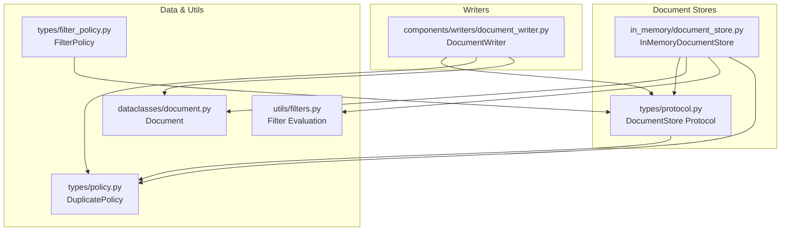
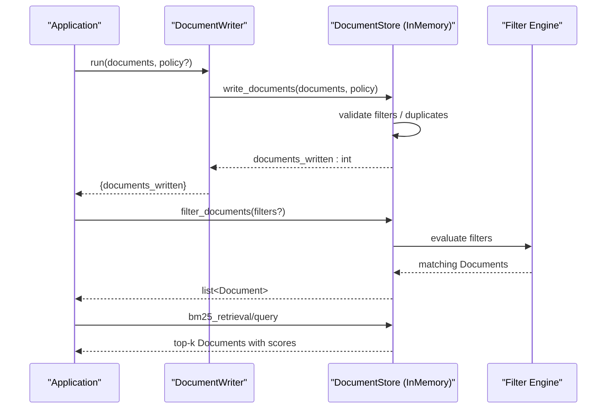
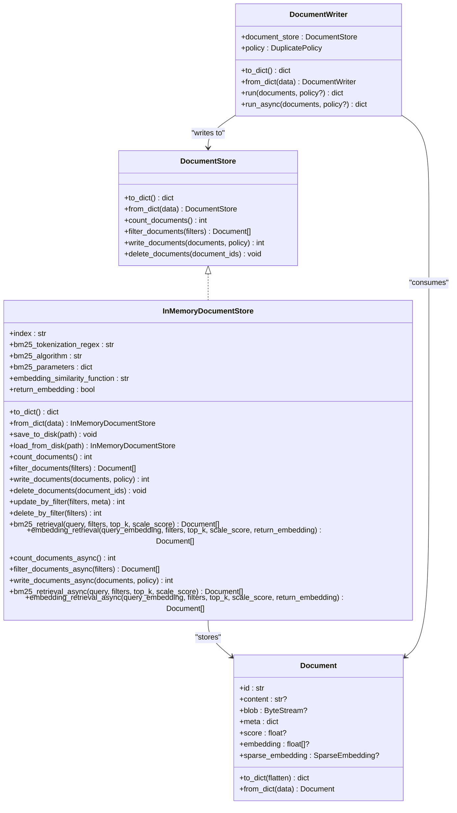

# Document Store APIs

<cite>
**Referenced Files in This Document**
- [document_stores/__init__.py](file://haystack/document_stores/__init__.py)
- [document_stores/types/protocol.py](file://haystack/document_stores/types/protocol.py)
- [document_stores/types/policy.py](file://haystack/document_stores/types/policy.py)
- [document_stores/types/filter_policy.py](file://haystack/document_stores/types/filter_policy.py)
- [document_stores/in_memory/document_store.py](file://haystack/document_stores/in_memory/document_store.py)
- [components/writers/document_writer.py](file://haystack/components/writers/document_writer.py)
- [dataclasses/document.py](file://haystack/dataclasses/document.py)
- [utils/filters.py](file://haystack/utils/filters.py)
- [pydoc/document_stores_api.yml](file://pydoc/document_stores_api.yml)
- [pydoc/document_writers_api.yml](file://pydoc/document_writers_api.yml)
</cite>

## Table of Contents
1. [Introduction](#introduction)
2. [Project Structure](#project-structure)
3. [Core Components](#core-components)
4. [Architecture Overview](#architecture-overview)
5. [Detailed Component Analysis](#detailed-component-analysis)
6. [Dependency Analysis](#dependency-analysis)
7. [Performance Considerations](#performance-considerations)
8. [Troubleshooting Guide](#troubleshooting-guide)
9. [Conclusion](#conclusion)
10. [Appendices](#appendices)

## Introduction
This document provides comprehensive API documentation for the document store and writer components in the project. It covers:
- The abstract document store interface and its implementations
- Document writer APIs for persisting documents to storage
- Filtering, querying, and metadata management APIs
- Batch operations, indexing, and search capabilities
- Serialization and deserialization APIs for document persistence
- Examples of configuration, query operations, and writer usage patterns
- Performance considerations, scaling strategies, and integration with retrieval components

## Project Structure
The relevant modules are organized under:
- Document store abstractions and implementations
- Writer components for persisting documents
- Data structures for documents and metadata
- Utilities for filter evaluation and policy handling

**Diagram sources**
- [document_stores/types/protocol.py](file://haystack/document_stores/types/protocol.py#L11-L136)
- [document_stores/in_memory/document_store.py](file://haystack/document_stores/in_memory/document_store.py#L59-L811)
- [components/writers/document_writer.py](file://haystack/components/writers/document_writer.py#L11-L128)
- [dataclasses/document.py](file://haystack/dataclasses/document.py#L47-L190)
- [utils/filters.py](file://haystack/utils/filters.py#L24-L207)
- [document_stores/types/policy.py](file://haystack/document_stores/types/policy.py#L8-L13)
- [document_stores/types/filter_policy.py](file://haystack/document_stores/types/filter_policy.py#L13-L320)

**Section sources**
- [document_stores/__init__.py](file://haystack/document_stores/__init__.py#L1-L4)
- [document_stores/types/protocol.py](file://haystack/document_stores/types/protocol.py#L11-L136)
- [document_stores/types/policy.py](file://haystack/document_stores/types/policy.py#L8-L13)
- [document_stores/types/filter_policy.py](file://haystack/document_stores/types/filter_policy.py#L13-L320)
- [document_stores/in_memory/document_store.py](file://haystack/document_stores/in_memory/document_store.py#L59-L811)
- [components/writers/document_writer.py](file://haystack/components/writers/document_writer.py#L11-L128)
- [dataclasses/document.py](file://haystack/dataclasses/document.py#L47-L190)
- [utils/filters.py](file://haystack/utils/filters.py#L24-L207)

## Core Components
- DocumentStore Protocol: Defines the contract for storing, filtering, writing, deleting, counting, and retrieving documents. Includes serialization and deserialization hooks.
- InMemoryDocumentStore: An in-memory implementation supporting BM25 keyword retrieval, vector similarity retrieval, metadata filtering, and batch operations.
- DocumentWriter: A component that writes lists of documents to a DocumentStore with configurable duplicate policies.
- Document: The core data structure representing a document with content, metadata, optional embeddings, and serialization helpers.
- Filter utilities: Provide robust filter evaluation and policy-driven merging for runtime and initialization filters.

Key responsibilities:
- Persistence and retrieval via DocumentStore implementations
- Batch write operations with duplicate handling
- Metadata filtering and logical/comparison filter evaluation
- Retrieval strategies: BM25 keyword and vector similarity
- Serialization/deserialization for persistence and transport

**Section sources**
- [document_stores/types/protocol.py](file://haystack/document_stores/types/protocol.py#L11-L136)
- [document_stores/in_memory/document_store.py](file://haystack/document_stores/in_memory/document_store.py#L59-L811)
- [components/writers/document_writer.py](file://haystack/components/writers/document_writer.py#L11-L128)
- [dataclasses/document.py](file://haystack/dataclasses/document.py#L47-L190)
- [utils/filters.py](file://haystack/utils/filters.py#L24-L207)
- [document_stores/types/policy.py](file://haystack/document_stores/types/policy.py#L8-L13)
- [document_stores/types/filter_policy.py](file://haystack/document_stores/types/filter_policy.py#L13-L320)

## Architecture Overview
The system centers around the DocumentStore Protocol, enabling interchangeable backends. Writers persist documents to stores, while retrieval components (e.g., retrievers) use the store’s capabilities to serve results.

**Diagram sources**
- [components/writers/document_writer.py](file://haystack/components/writers/document_writer.py#L80-L98)
- [document_stores/types/protocol.py](file://haystack/document_stores/types/protocol.py#L41-L125)
- [document_stores/in_memory/document_store.py](file://haystack/document_stores/in_memory/document_store.py#L418-L608)
- [utils/filters.py](file://haystack/utils/filters.py#L24-L207)

## Detailed Component Analysis

### DocumentStore Protocol
Defines the canonical interface for document stores:
- Serialization: to_dict, from_dict
- Counting: count_documents
- Filtering: filter_documents(filters)
- Writing: write_documents(documents, policy)
- Deleting: delete_documents(document_ids)
- Retrieval strategies: bm25_retrieval, embedding_retrieval (implementation-specific)
- Async variants: count_documents_async, filter_documents_async, write_documents_async, bm25_retrieval_async, embedding_retrieval_async

Filter syntax:
- Comparison: field, operator, value
- Logical: operator among NOT, OR, AND, conditions (list of filters)
- Operators: ==, !=, >, >=, <, <=, in, not in

DuplicatePolicy:
- NONE, SKIP, OVERWRITE, FAIL

FilterPolicy:
- REPLACE: runtime filters override init filters
- MERGE: runtime filters merged with init filters; runtime values overwrite init for overlapping fields

**Section sources**
- [document_stores/types/protocol.py](file://haystack/document_stores/types/protocol.py#L11-L136)
- [document_stores/types/policy.py](file://haystack/document_stores/types/policy.py#L8-L13)
- [document_stores/types/filter_policy.py](file://haystack/document_stores/types/filter_policy.py#L13-L320)

### InMemoryDocumentStore
An in-memory implementation with:
- Index scoping via index parameter
- BM25 retrieval with Okapi, L, and Plus variants
- Vector similarity retrieval with dot_product or cosine
- Incremental BM25 statistics (term frequencies, IDF vocabulary, average document length)
- Duplicate handling via DuplicatePolicy
- Metadata filtering with filter_documents and filter policy enforcement
- Batch write/delete/update by filter
- Serialization to/from JSON with save_to_disk/load_from_disk
- Async execution via ThreadPoolExecutor

Retrieval specifics:
- bm25_retrieval: applies content presence filter, computes per-algorithm scores, optionally scales scores
- embedding_retrieval: validates embeddings, computes similarity, optionally scales scores, respects return_embedding flag

Async support:
- All major operations have async counterparts delegating to sync via executor

**Section sources**
- [document_stores/in_memory/document_store.py](file://haystack/document_stores/in_memory/document_store.py#L59-L811)
- [utils/filters.py](file://haystack/utils/filters.py#L24-L207)

### DocumentWriter
A component that writes documents to a DocumentStore:
- Accepts a DocumentStore instance and DuplicatePolicy
- Provides run() and run_async() methods
- Serializes to/from dict with policy handling
- Delegates write_documents to the underlying store

Usage pattern:
- Instantiate with a DocumentStore and policy
- Call run(documents, policy?) to persist
- Optionally use run_async for async environments

**Section sources**
- [components/writers/document_writer.py](file://haystack/components/writers/document_writer.py#L11-L128)

### Document Data Model
Document fields:
- id, content, blob, meta, score, embedding, sparse_embedding
- Automatic ID generation based on content and metadata
- Serialization helpers: to_dict, from_dict
- Backward compatibility handling for legacy fields and embedding formats

**Section sources**
- [dataclasses/document.py](file://haystack/dataclasses/document.py#L47-L190)

### Filter Engine
Filter evaluation supports:
- Logical operators: AND, OR, NOT
- Comparison operators: ==, !=, >, >=, <, <=, in, not in
- Nested filter structures
- Date/time comparisons with ISO parsing and timezone handling
- Field traversal via dot notation (e.g., meta.person.name)
- Error handling for invalid syntax and unsupported comparisons

FilterPolicy utilities:
- Combine init and runtime filters according to REPLACE or MERGE semantics
- Prevent redundant or conflicting filter conditions

**Section sources**
- [utils/filters.py](file://haystack/utils/filters.py#L24-L207)
- [document_stores/types/filter_policy.py](file://haystack/document_stores/types/filter_policy.py#L283-L320)

## Dependency Analysis

**Diagram sources**
- [document_stores/types/protocol.py](file://haystack/document_stores/types/protocol.py#L11-L136)
- [document_stores/in_memory/document_store.py](file://haystack/document_stores/in_memory/document_store.py#L59-L811)
- [components/writers/document_writer.py](file://haystack/components/writers/document_writer.py#L11-L128)
- [dataclasses/document.py](file://haystack/dataclasses/document.py#L47-L190)

**Section sources**
- [document_stores/types/protocol.py](file://haystack/document_stores/types/protocol.py#L11-L136)
- [document_stores/in_memory/document_store.py](file://haystack/document_stores/in_memory/document_store.py#L59-L811)
- [components/writers/document_writer.py](file://haystack/components/writers/document_writer.py#L11-L128)
- [dataclasses/document.py](file://haystack/dataclasses/document.py#L47-L190)

## Performance Considerations
- InMemoryDocumentStore
  - BM25 statistics are maintained incrementally; updates recalculate IDF and average document length
  - Vector similarity supports dot_product and cosine; scaling factors can normalize scores
  - Async operations offload to a thread pool; consider tuning executor for throughput
  - BM25 tokenization regex and algorithm selection impact indexing and retrieval speed
- Filter engine
  - Complex nested filters increase evaluation cost; prefer narrowing filters early
  - Date comparisons rely on parsing; ensure consistent date formats to avoid overhead
- Writer
  - Batch writes reduce overhead; use DuplicatePolicy.SKIP/OVERWRITE to minimize retries
- Retrieval
  - BM25 retrieval automatically filters out content-less documents
  - Vector retrieval requires embeddings; ensure consistent embedding sizes and norms

[No sources needed since this section provides general guidance]

## Troubleshooting Guide
Common issues and resolutions:
- Invalid filter syntax
  - Symptom: FilterError raised during filtering
  - Cause: Missing operator or conditions in filter structure
  - Resolution: Ensure filters conform to comparison/logical structures
  - Reference: [utils/filters.py](file://haystack/utils/filters.py#L15-L22)
- Duplicate document handling
  - Symptom: DuplicateDocumentError or skipped writes
  - Cause: Existing IDs conflict with policy
  - Resolution: Adjust DuplicatePolicy or deduplicate inputs
  - Reference: [document_stores/in_memory/document_store.py](file://haystack/document_stores/in_memory/document_store.py#L456-L480)
- Embedding mismatch
  - Symptom: Shape alignment errors or inconsistent embedding sizes
  - Cause: Mismatch between query and stored embedding dimensions
  - Resolution: Ensure consistent embedding models and sizes
  - Reference: [document_stores/in_memory/document_store.py](file://haystack/document_stores/in_memory/document_store.py#L690-L714)
- Missing async support
  - Symptom: TypeError indicating lack of async method
  - Cause: DocumentStore does not implement async variant
  - Resolution: Use sync run() or switch to a store with async support
  - Reference: [components/writers/document_writer.py](file://haystack/components/writers/document_writer.py#L123-L127)

**Section sources**
- [utils/filters.py](file://haystack/utils/filters.py#L15-L22)
- [document_stores/in_memory/document_store.py](file://haystack/document_stores/in_memory/document_store.py#L456-L480)
- [components/writers/document_writer.py](file://haystack/components/writers/document_writer.py#L123-L127)

## Conclusion
The document store and writer subsystem provides a flexible, protocol-driven foundation for persisting and retrieving documents. The in-memory implementation demonstrates robust filtering, BM25 keyword retrieval, and vector similarity search, while the writer component simplifies batch persistence with configurable duplicate handling. Together with filter utilities and serialization helpers, they enable scalable and maintainable retrieval pipelines.

[No sources needed since this section summarizes without analyzing specific files]

## Appendices

### API Definitions and Examples

- DocumentStore Protocol
  - Methods: to_dict, from_dict, count_documents, filter_documents, write_documents, delete_documents
  - Filters: comparison and logical structures with supported operators
  - Policies: DuplicatePolicy, FilterPolicy
  - References:
    - [document_stores/types/protocol.py](file://haystack/document_stores/types/protocol.py#L11-L136)
    - [document_stores/types/policy.py](file://haystack/document_stores/types/policy.py#L8-L13)
    - [document_stores/types/filter_policy.py](file://haystack/document_stores/types/filter_policy.py#L13-L320)

- InMemoryDocumentStore
  - Configuration: index, BM25 tokenizer/algorithm/parameters, embedding similarity function, return_embedding
  - Operations: write_documents, filter_documents, delete_documents, update_by_filter, delete_by_filter
  - Retrieval: bm25_retrieval, embedding_retrieval
  - Persistence: save_to_disk, load_from_disk
  - Async: count_documents_async, filter_documents_async, write_documents_async, bm25_retrieval_async, embedding_retrieval_async
  - References:
    - [document_stores/in_memory/document_store.py](file://haystack/document_stores/in_memory/document_store.py#L59-L811)

- DocumentWriter
  - Usage: run(documents, policy?), run_async(documents, policy?)
  - Serialization: to_dict, from_dict
  - References:
    - [components/writers/document_writer.py](file://haystack/components/writers/document_writer.py#L11-L128)

- Document
  - Fields: id, content, blob, meta, score, embedding, sparse_embedding
  - Serialization: to_dict, from_dict
  - References:
    - [dataclasses/document.py](file://haystack/dataclasses/document.py#L47-L190)

- Filter Engine
  - Evaluation: logical and comparison operators, date parsing, dot-notation field access
  - Policy merging: FilterPolicy utilities for runtime/init filter combination
  - References:
    - [utils/filters.py](file://haystack/utils/filters.py#L24-L207)
    - [document_stores/types/filter_policy.py](file://haystack/document_stores/types/filter_policy.py#L283-L320)

- Example Workflows
  - Configure and persist documents:
    - Create a DocumentWriter with an InMemoryDocumentStore and policy
    - Call run(documents) to persist
    - References:
      - [components/writers/document_writer.py](file://haystack/components/writers/document_writer.py#L30-L98)
      - [document_stores/in_memory/document_store.py](file://haystack/document_stores/in_memory/document_store.py#L418-L480)
  - Query and filter:
    - Use filter_documents with nested filters
    - Retrieve top-k via bm25_retrieval or embedding_retrieval
    - References:
      - [document_stores/types/protocol.py](file://haystack/document_stores/types/protocol.py#L41-L106)
      - [document_stores/in_memory/document_store.py](file://haystack/document_stores/in_memory/document_store.py#L552-L608)
  - Serialization:
    - Serialize store to dict and persist to disk; reload with load_from_disk
    - References:
      - [document_stores/in_memory/document_store.py](file://haystack/document_stores/in_memory/document_store.py#L348-L411)

- Integration with Retrieval Components
  - Use retrievers compatible with DocumentStore implementations
  - Leverage FilterPolicy to merge or replace filters at runtime
  - References:
    - [document_stores/types/filter_policy.py](file://haystack/document_stores/types/filter_policy.py#L283-L320)

**Section sources**
- [document_stores/types/protocol.py](file://haystack/document_stores/types/protocol.py#L11-L136)
- [document_stores/in_memory/document_store.py](file://haystack/document_stores/in_memory/document_store.py#L59-L811)
- [components/writers/document_writer.py](file://haystack/components/writers/document_writer.py#L11-L128)
- [dataclasses/document.py](file://haystack/dataclasses/document.py#L47-L190)
- [utils/filters.py](file://haystack/utils/filters.py#L24-L207)
- [document_stores/types/filter_policy.py](file://haystack/document_stores/types/filter_policy.py#L283-L320)