# Evaluation APIs

<cite>
**Referenced Files in This Document**
- [__init__.py](file://haystack/evaluation/__init__.py)
- [eval_run_result.py](file://haystack/evaluation/eval_run_result.py)
- [__init__.py](file://haystack/components/evaluators/__init__.py)
- [answer_exact_match.py](file://haystack/components/evaluators/answer_exact_match.py)
- [context_relevance.py](file://haystack/components/evaluators/context_relevance.py)
- [faithfulness.py](file://haystack/components/evaluators/faithfulness.py)
- [llm_evaluator.py](file://haystack/components/evaluators/llm_evaluator.py)
- [document_map.py](file://haystack/components/evaluators/document_map.py)
- [document_mrr.py](file://haystack/components/evaluators/document_mrr.py)
- [document_ndcg.py](file://haystack/components/evaluators/document_ndcg.py)
- [document_recall.py](file://haystack/components/evaluators/document_recall.py)
- [sas_evaluator.py](file://haystack/components/evaluators/sas_evaluator.py)
</cite>

## Table of Contents
1. [Introduction](#introduction)
2. [Project Structure](#project-structure)
3. [Core Components](#core-components)
4. [Architecture Overview](#architecture-overview)
5. [Detailed Component Analysis](#detailed-component-analysis)
6. [Dependency Analysis](#dependency-analysis)
7. [Performance Considerations](#performance-considerations)
8. [Troubleshooting Guide](#troubleshooting-guide)
9. [Conclusion](#conclusion)
10. [Appendices](#appendices)

## Introduction
This document provides comprehensive API documentation for evaluation and benchmarking components in the project. It focuses on:
- Built-in evaluators for RAG performance, answer quality, and system effectiveness
- Statistical and model-based evaluation approaches
- Evaluation pipeline construction and result interpretation
- Custom evaluator development patterns
- Best practices, benchmark datasets, and performance comparison methodologies

The evaluation ecosystem centers around:
- A unified result container for evaluation runs
- A family of evaluators for answer correctness, context relevance, faithfulness, retrieval ranking, and semantic similarity
- A reusable LLM-based evaluator framework for custom metrics

## Project Structure
The evaluation-related code is organized into:
- A lightweight evaluation runtime result container
- A collection of specialized evaluators under components/evaluators
- A shared LLM-based evaluator base class enabling custom metrics

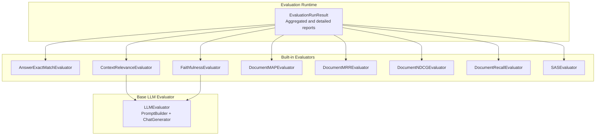

**Diagram sources**
- [eval_run_result.py](file://haystack/evaluation/eval_run_result.py#L18-L232)
- [answer_exact_match.py](file://haystack/components/evaluators/answer_exact_match.py#L10-L70)
- [context_relevance.py](file://haystack/components/evaluators/context_relevance.py#L42-L188)
- [faithfulness.py](file://haystack/components/evaluators/faithfulness.py#L51-L182)
- [llm_evaluator.py](file://haystack/components/evaluators/llm_evaluator.py#L22-L241)
- [document_map.py](file://haystack/components/evaluators/document_map.py#L10-L137)
- [document_mrr.py](file://haystack/components/evaluators/document_mrr.py#L10-L131)
- [document_ndcg.py](file://haystack/components/evaluators/document_ndcg.py#L11-L134)
- [document_recall.py](file://haystack/components/evaluators/document_recall.py#L40-L180)
- [sas_evaluator.py](file://haystack/components/evaluators/sas_evaluator.py#L19-L189)

**Section sources**
- [__init__.py](file://haystack/evaluation/__init__.py#L10-L16)
- [__init__.py](file://haystack/components/evaluators/__init__.py#L10-L20)

## Core Components
- EvaluationRunResult: Aggregates inputs and per-metric results, supports aggregated, detailed, and comparative reports, and can export to JSON, CSV, or DataFrame.
- LLMEvaluator: Base class for LLM-powered evaluators. Provides prompt templating, JSON parsing, progress reporting, and optional API failure handling.
- Specialized evaluators:
  - AnswerExactMatchEvaluator: Exact match scoring for answer correctness
  - ContextRelevanceEvaluator: Context relevance via LLM with binary per-context scores
  - FaithfulnessEvaluator: Statement-level faithfulness with per-answer averages
  - DocumentMAPEvaluator: Mean Average Precision for retrieval ranking
  - DocumentMRREvaluator: Mean Reciprocal Rank for retrieval ranking
  - DocumentNDCGEvaluator: Normalized Discounted Cumulative Gain for retrieval ranking
  - DocumentRecallEvaluator: Recall with single-hit and multi-hit modes
  - SASEvaluator: Semantic Answer Similarity using sentence-transformers or cross-encoders

Key capabilities:
- Consistent input/output contracts across evaluators
- Aggregated and per-sample metrics
- Export/reporting utilities
- Extensibility via LLMEvaluator for custom metrics

**Section sources**
- [eval_run_result.py](file://haystack/evaluation/eval_run_result.py#L18-L232)
- [llm_evaluator.py](file://haystack/components/evaluators/llm_evaluator.py#L22-L241)
- [answer_exact_match.py](file://haystack/components/evaluators/answer_exact_match.py#L10-L70)
- [context_relevance.py](file://haystack/components/evaluators/context_relevance.py#L42-L188)
- [faithfulness.py](file://haystack/components/evaluators/faithfulness.py#L51-L182)
- [document_map.py](file://haystack/components/evaluators/document_map.py#L10-L137)
- [document_mrr.py](file://haystack/components/evaluators/document_mrr.py#L10-L131)
- [document_ndcg.py](file://haystack/components/evaluators/document_ndcg.py#L11-L134)
- [document_recall.py](file://haystack/components/evaluators/document_recall.py#L40-L180)
- [sas_evaluator.py](file://haystack/components/evaluators/sas_evaluator.py#L19-L189)

## Architecture Overview
The evaluation architecture combines a result container with modular evaluators. LLM-based evaluators inherit from a common base that handles prompting, generation, and parsing. Retrieval evaluators operate on document lists and compute ranking-based metrics.

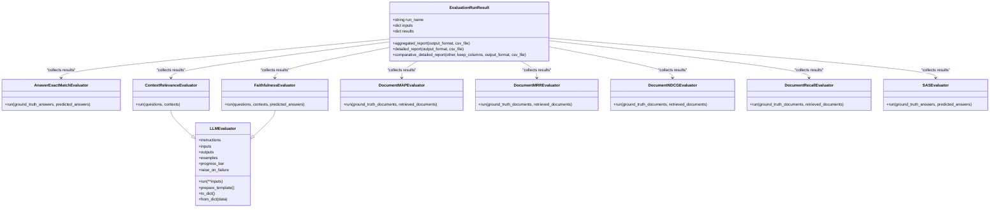

**Diagram sources**
- [eval_run_result.py](file://haystack/evaluation/eval_run_result.py#L18-L232)
- [llm_evaluator.py](file://haystack/components/evaluators/llm_evaluator.py#L22-L241)
- [answer_exact_match.py](file://haystack/components/evaluators/answer_exact_match.py#L10-L70)
- [context_relevance.py](file://haystack/components/evaluators/context_relevance.py#L42-L188)
- [faithfulness.py](file://haystack/components/evaluators/faithfulness.py#L51-L182)
- [document_map.py](file://haystack/components/evaluators/document_map.py#L10-L137)
- [document_mrr.py](file://haystack/components/evaluators/document_mrr.py#L10-L131)
- [document_ndcg.py](file://haystack/components/evaluators/document_ndcg.py#L11-L134)
- [document_recall.py](file://haystack/components/evaluators/document_recall.py#L40-L180)
- [sas_evaluator.py](file://haystack/components/evaluators/sas_evaluator.py#L19-L189)

## Detailed Component Analysis

### EvaluationRunResult
- Purpose: Encapsulates evaluation inputs and per-metric results, and provides reporting utilities.
- Inputs and results validation ensure consistent shapes and required fields.
- Reporting:
  - Aggregated report: metric names and aggregated scores
  - Detailed report: inputs plus per-metric individual scores
  - Comparative detailed report: merges two runs’ detailed reports with optional column filtering
- Output formats: JSON, CSV, DataFrame; CSV writing includes error handling.

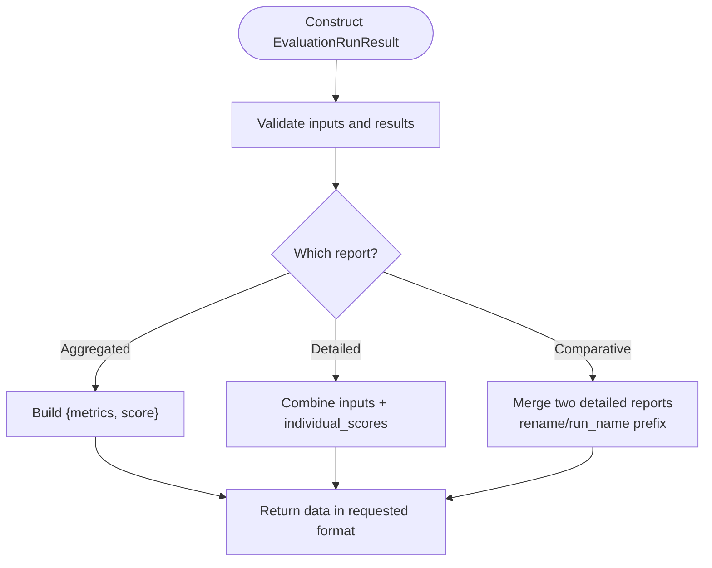

**Diagram sources**
- [eval_run_result.py](file://haystack/evaluation/eval_run_result.py#L23-L137)
- [eval_run_result.py](file://haystack/evaluation/eval_run_result.py#L139-L163)
- [eval_run_result.py](file://haystack/evaluation/eval_run_result.py#L165-L231)

**Section sources**
- [eval_run_result.py](file://haystack/evaluation/eval_run_result.py#L18-L232)

### LLMEvaluator (Base for LLM-based Evaluators)
- Responsibilities:
  - Build prompts from instructions, examples, and inputs
  - Invoke a ChatGenerator (default OpenAI JSON mode)
  - Parse JSON results and validate expected keys
  - Aggregate per-sample results into a list of dictionaries
- Controls:
  - Progress bar toggle
  - Failure behavior (raise or warn and continue)
  - Serialization/deserialization support
- Validation:
  - Initialization parameter validation
  - Input parameter validation ensuring lists of equal length

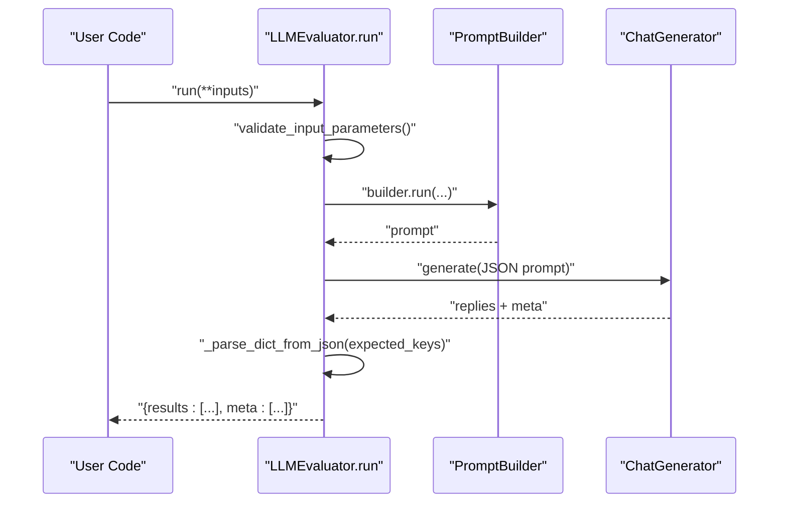

**Diagram sources**
- [llm_evaluator.py](file://haystack/components/evaluators/llm_evaluator.py#L179-L241)
- [llm_evaluator.py](file://haystack/components/evaluators/llm_evaluator.py#L243-L286)

**Section sources**
- [llm_evaluator.py](file://haystack/components/evaluators/llm_evaluator.py#L22-L363)

### AnswerExactMatchEvaluator
- Purpose: Exact match scoring between ground truth and predicted answers.
- Input contract: lists of strings of equal length.
- Output: per-sample 0/1 and an overall proportion score.

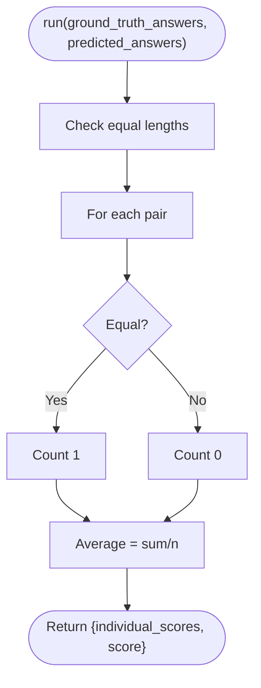

**Diagram sources**
- [answer_exact_match.py](file://haystack/components/evaluators/answer_exact_match.py#L39-L69)

**Section sources**
- [answer_exact_match.py](file://haystack/components/evaluators/answer_exact_match.py#L10-L70)

### ContextRelevanceEvaluator
- Purpose: Determine if provided contexts are relevant to questions; returns per-context binary relevance and an average score.
- Implementation: Inherits from LLMEvaluator, extracts “relevant statements” from contexts, sets per-context score to 1 if any statements, else 0, then averages across contexts.

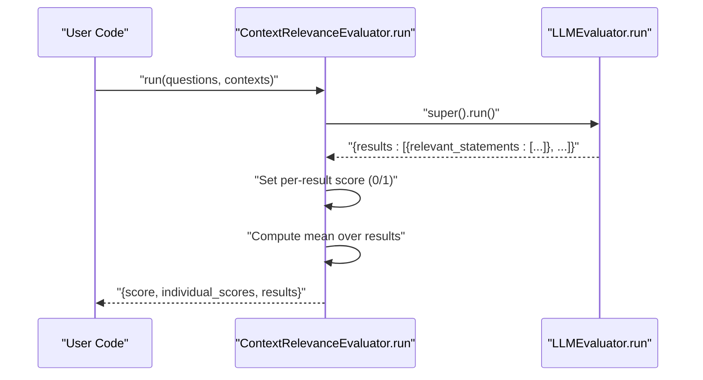

**Diagram sources**
- [context_relevance.py](file://haystack/components/evaluators/context_relevance.py#L160-L188)
- [llm_evaluator.py](file://haystack/components/evaluators/llm_evaluator.py#L179-L241)

**Section sources**
- [context_relevance.py](file://haystack/components/evaluators/context_relevance.py#L42-L188)

### FaithfulnessEvaluator
- Purpose: Judge whether predicted answers can be inferred from provided contexts; returns per-answer average of statement-level scores.
- Implementation: Inherits from LLMEvaluator, splits predicted answers into statements, computes per-statement 0/1 scores, averages per answer, and then averages across answers.

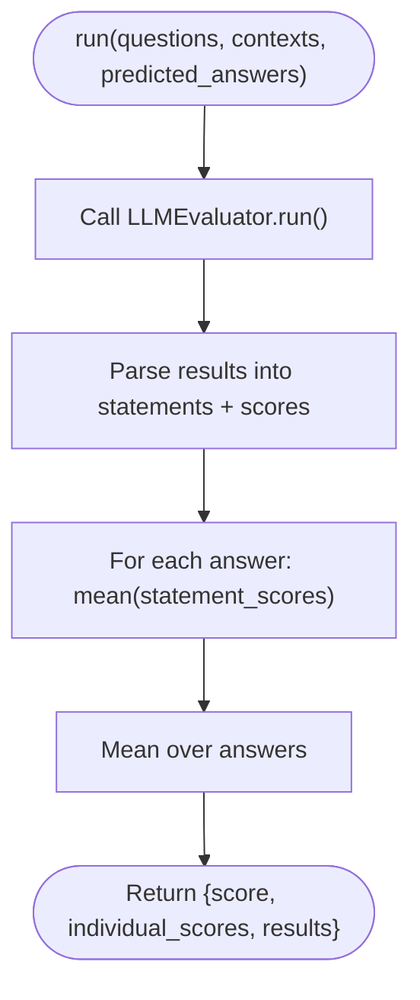

**Diagram sources**
- [faithfulness.py](file://haystack/components/evaluators/faithfulness.py#L150-L182)
- [llm_evaluator.py](file://haystack/components/evaluators/llm_evaluator.py#L179-L241)

**Section sources**
- [faithfulness.py](file://haystack/components/evaluators/faithfulness.py#L51-L182)

### DocumentMAPEvaluator
- Purpose: Mean Average Precision for retrieval ranking.
- Behavior: Computes average precision per query using a configurable document comparison field and returns both per-query and global scores.

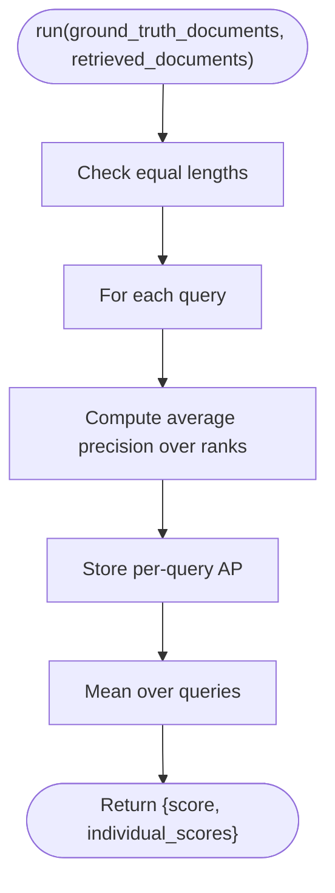

**Diagram sources**
- [document_map.py](file://haystack/components/evaluators/document_map.py#L93-L136)

**Section sources**
- [document_map.py](file://haystack/components/evaluators/document_map.py#L10-L137)

### DocumentMRREvaluator
- Purpose: Mean Reciprocal Rank for retrieval ranking.
- Behavior: Finds the first relevant document per query and computes 1/(rank+1); averages across queries.

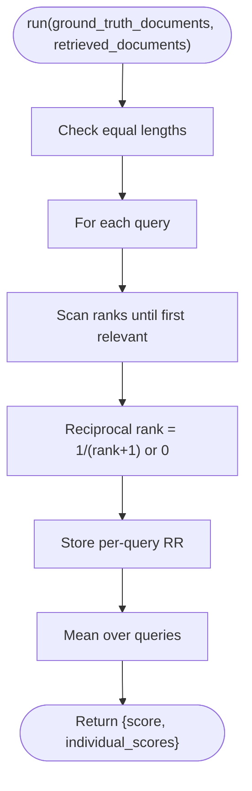

**Diagram sources**
- [document_mrr.py](file://haystack/components/evaluators/document_mrr.py#L91-L130)

**Section sources**
- [document_mrr.py](file://haystack/components/evaluators/document_mrr.py#L10-L131)

### DocumentNDCGEvaluator
- Purpose: Normalized Discounted Cumulative Gain for retrieval ranking.
- Behavior: Supports binary or graded relevance; computes DCG and IDCG per query and normalizes.

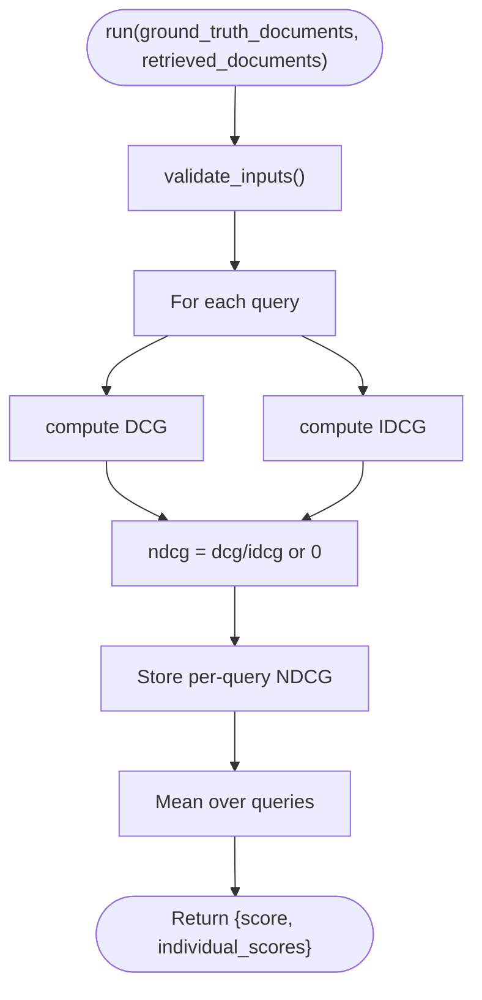

**Diagram sources**
- [document_ndcg.py](file://haystack/components/evaluators/document_ndcg.py#L38-L68)
- [document_ndcg.py](file://haystack/components/evaluators/document_ndcg.py#L70-L133)

**Section sources**
- [document_ndcg.py](file://haystack/components/evaluators/document_ndcg.py#L11-L134)

### DocumentRecallEvaluator
- Purpose: Recall for retrieval ranking with two modes:
  - Single-hit: 0/1 per query based on presence of any relevant document
  - Multi-hit: fraction of relevant documents retrieved
- Behavior: Configurable comparison field and mode selection.

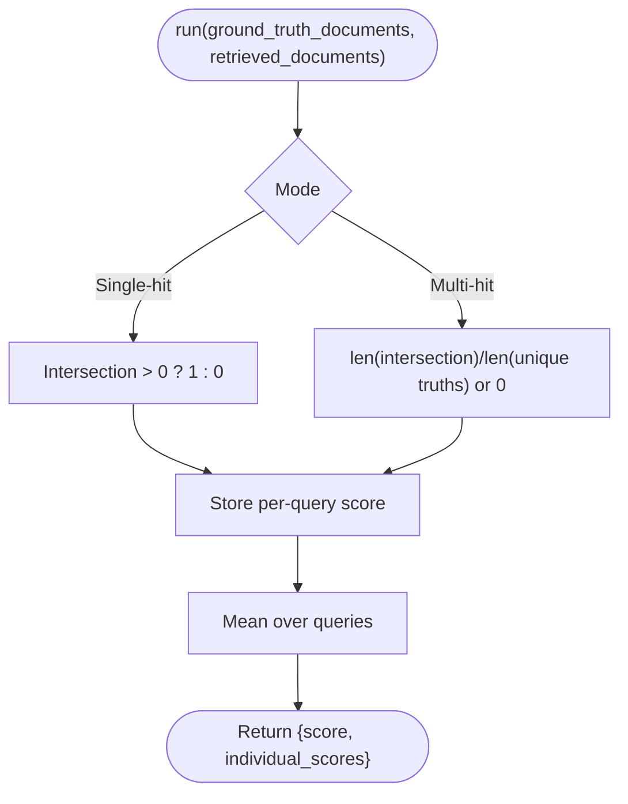

**Diagram sources**
- [document_recall.py](file://haystack/components/evaluators/document_recall.py#L142-L170)

**Section sources**
- [document_recall.py](file://haystack/components/evaluators/document_recall.py#L40-L180)

### SASEvaluator
- Purpose: Semantic Answer Similarity using sentence-transformers or cross-encoders.
- Behavior:
  - Detects model type from config and loads appropriate model
  - Cross-encoder: predicts similarity scores for answer-ground-truth pairs
  - Bi-encoder: encodes answers and ground truths, computes cosine similarity
  - Returns mean similarity and per-pair scores

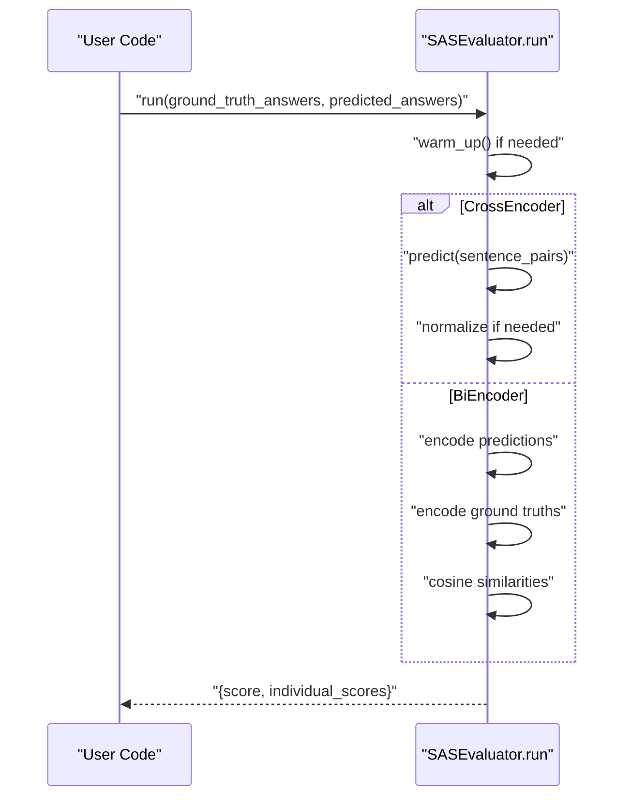

**Diagram sources**
- [sas_evaluator.py](file://haystack/components/evaluators/sas_evaluator.py#L128-L188)

**Section sources**
- [sas_evaluator.py](file://haystack/components/evaluators/sas_evaluator.py#L19-L189)

## Dependency Analysis
- EvaluationRunResult depends on:
  - Standard library (CSV, copy, typing)
  - Optional pandas for DataFrame export
- LLMEvaluator depends on:
  - PromptBuilder for templating
  - ChatGenerator for inference (OpenAI default)
  - Utilities for JSON parsing and serialization
- Specialized evaluators depend on:
  - LLMEvaluator (for context relevance and faithfulness)
  - Document and numpy (for retrieval metrics)
  - Sentence-transformers and transformers (for SAS)

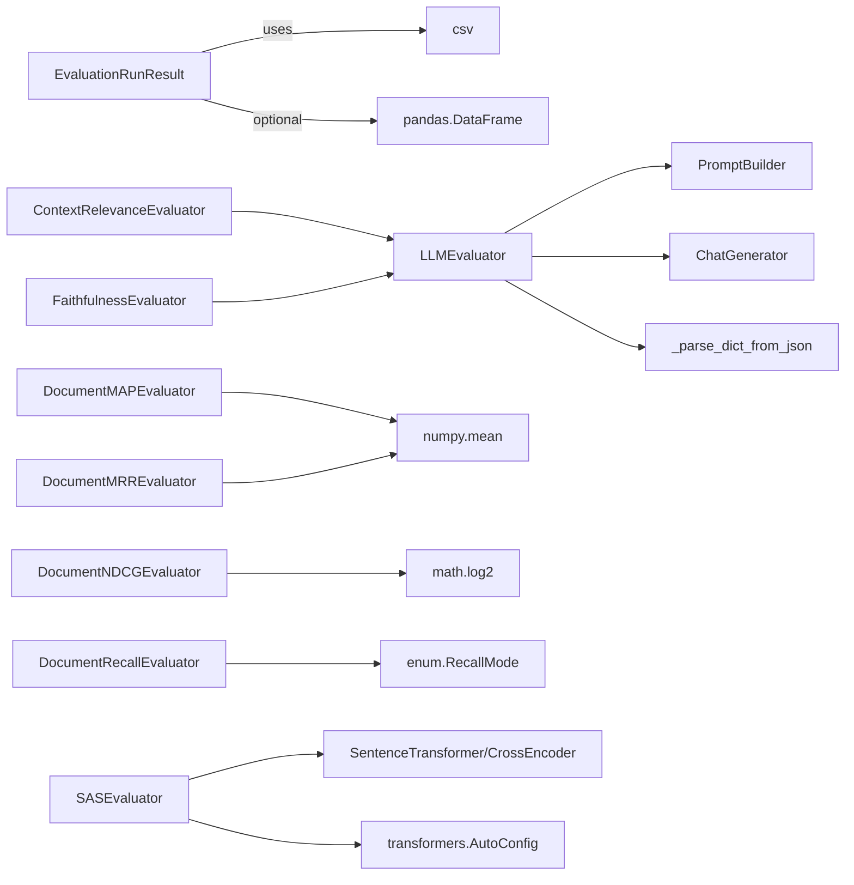

**Diagram sources**
- [eval_run_result.py](file://haystack/evaluation/eval_run_result.py#L5-L15)
- [llm_evaluator.py](file://haystack/components/evaluators/llm_evaluator.py#L10-L17)
- [context_relevance.py](file://haystack/components/evaluators/context_relevance.py#L8-L12)
- [faithfulness.py](file://haystack/components/evaluators/faithfulness.py#L7-L13)
- [document_map.py](file://haystack/components/evaluators/document_map.py#L7)
- [document_mrr.py](file://haystack/components/evaluators/document_mrr.py#L7)
- [document_ndcg.py](file://haystack/components/evaluators/document_ndcg.py#L5)
- [document_recall.py](file://haystack/components/evaluators/document_recall.py#L5-L9)
- [sas_evaluator.py](file://haystack/components/evaluators/sas_evaluator.py#L14-L16)

**Section sources**
- [eval_run_result.py](file://haystack/evaluation/eval_run_result.py#L5-L15)
- [llm_evaluator.py](file://haystack/components/evaluators/llm_evaluator.py#L10-L17)
- [context_relevance.py](file://haystack/components/evaluators/context_relevance.py#L8-L12)
- [faithfulness.py](file://haystack/components/evaluators/faithfulness.py#L9-L13)
- [document_map.py](file://haystack/components/evaluators/document_map.py#L7)
- [document_mrr.py](file://haystack/components/evaluators/document_mrr.py#L7)
- [document_ndcg.py](file://haystack/components/evaluators/document_ndcg.py#L5)
- [document_recall.py](file://haystack/components/evaluators/document_recall.py#L5-L9)
- [sas_evaluator.py](file://haystack/components/evaluators/sas_evaluator.py#L14-L16)

## Performance Considerations
- LLM-based evaluators:
  - Use progress bars to track long evaluations
  - Configure JSON response format to reduce parsing overhead
  - Consider warming up the underlying ChatGenerator to avoid cold-start latency
- Retrieval evaluators:
  - Prefer efficient document comparison fields (e.g., id) when applicable
  - Normalize inputs externally to avoid repeated normalization costs
- SAS evaluator:
  - Batch size tuning impacts throughput
  - Device selection affects speed; cross-encoders are slower but often more accurate
- EvaluationRunResult:
  - CSV export writes entire datasets; consider DataFrame export for large-scale analysis

[No sources needed since this section provides general guidance]

## Troubleshooting Guide
Common issues and resolutions:
- Input validation errors:
  - Ensure all input lists have equal length for LLM evaluators and retrieval evaluators
  - Verify required keys and types for examples and inputs
- LLM evaluator failures:
  - Enable raise_on_failure to surface API errors immediately
  - Check JSON schema compliance and expected output keys
- ContextRelevanceEvaluator/FaithfulnessEvaluator:
  - Confirm the ChatGenerator is configured for JSON output
  - Review examples format and instruction alignment
- Retrieval metrics:
  - Validate document comparison fields and ensure documents are comparable
  - For NDCG, ensure consistent relevance scoring across queries
- SAS evaluator:
  - Install sentence-transformers and transformers as required
  - Resolve model loading issues via proper token configuration

**Section sources**
- [llm_evaluator.py](file://haystack/components/evaluators/llm_evaluator.py#L124-L177)
- [llm_evaluator.py](file://haystack/components/evaluators/llm_evaluator.py#L327-L362)
- [context_relevance.py](file://haystack/components/evaluators/context_relevance.py#L100-L157)
- [faithfulness.py](file://haystack/components/evaluators/faithfulness.py#L87-L147)
- [document_ndcg.py](file://haystack/components/evaluators/document_ndcg.py#L70-L96)
- [sas_evaluator.py](file://haystack/components/evaluators/sas_evaluator.py#L107-L126)

## Conclusion
The evaluation subsystem offers a cohesive set of APIs for measuring RAG performance across answer correctness, context relevance, faithfulness, retrieval ranking, and semantic similarity. Built-in evaluators provide ready-to-use metrics, while the LLMEvaluator base enables rapid prototyping of custom metrics. EvaluationRunResult standardizes reporting and comparison across runs, supporting CSV, JSON, and DataFrame outputs. Together, these components facilitate robust benchmarking, statistical analysis, and performance comparisons.

[No sources needed since this section summarizes without analyzing specific files]

## Appendices

### Evaluation Pipeline Construction and Result Interpretation
- Build a pipeline that feeds questions, contexts, predicted answers, and ground truths to the appropriate evaluators
- Collect per-metric results and construct an EvaluationRunResult
- Use aggregated_report for summary scores, detailed_report for per-sample diagnostics, and comparative_detailed_report to compare runs
- Interpret scores based on metric definitions:
  - Exact match: proportion of exact matches
  - Context relevance: proportion of relevant contexts
  - Faithfulness: proportion of verifiable statements
  - Retrieval metrics: ranking quality indicators (MAP, MRR, NDCG, Recall)

[No sources needed since this section provides general guidance]

### Custom Evaluator Development Patterns
- Extend LLMEvaluator to define:
  - Instructions guiding the LLM to produce structured JSON
  - Inputs and outputs schema aligned with your metric
  - Few-shot examples demonstrating expected input-output pairs
- Validate inputs and outputs rigorously to ensure reliable parsing
- Integrate with EvaluationRunResult for standardized reporting

**Section sources**
- [llm_evaluator.py](file://haystack/components/evaluators/llm_evaluator.py#L54-L111)
- [llm_evaluator.py](file://haystack/components/evaluators/llm_evaluator.py#L243-L286)

### Statistical Evaluation Methods and Model-Based Approaches
- Statistical methods:
  - Confidence intervals for aggregated scores
  - Significance tests for comparing runs
- Model-based approaches:
  - Use LLM-based evaluators for nuanced judgments
  - Use SAS for semantic similarity when lexical exactness is not sufficient
  - Use retrieval metrics (MAP/MRR/NDCG/Recall) to assess ranking quality

[No sources needed since this section provides general guidance]

### Benchmark Datasets and Performance Comparison Methodologies
- Benchmark datasets:
  - Use curated question-answer-context triplets for answer quality and faithfulness
  - Use document retrieval datasets with ground-truth relevance labels for ranking metrics
- Methodologies:
  - Randomized controlled trials across runs
  - Stratified sampling by domain or difficulty
  - Repeated evaluations with seeds for reproducibility
  - Comparative reporting via EvaluationRunResult’s comparative_detailed_report

[No sources needed since this section provides general guidance]