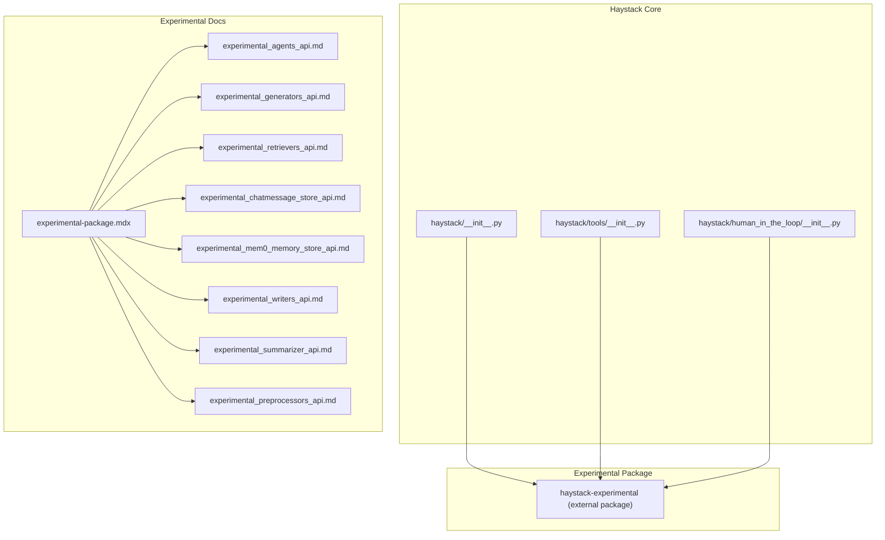
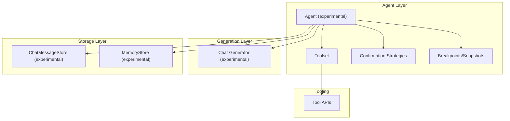
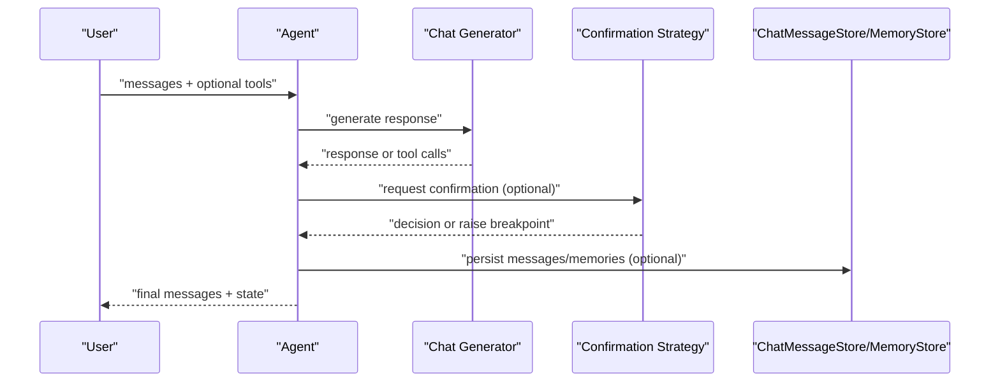
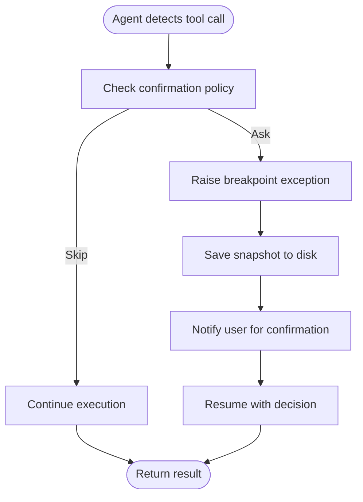
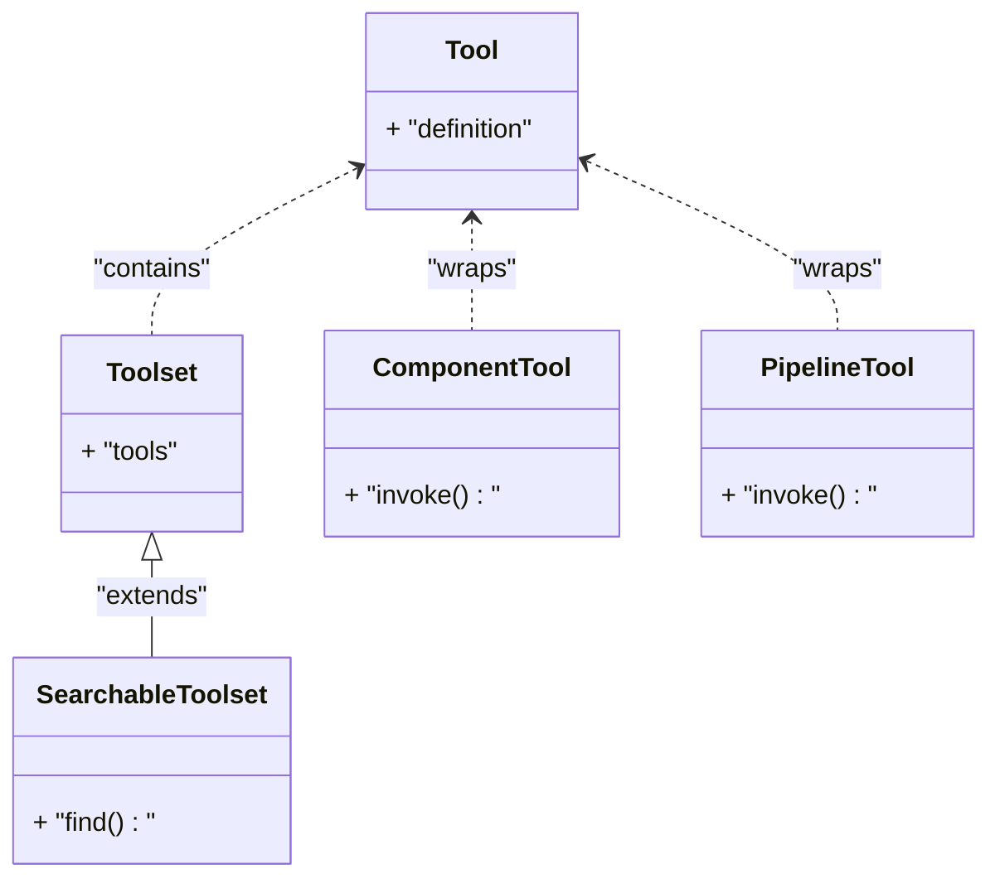
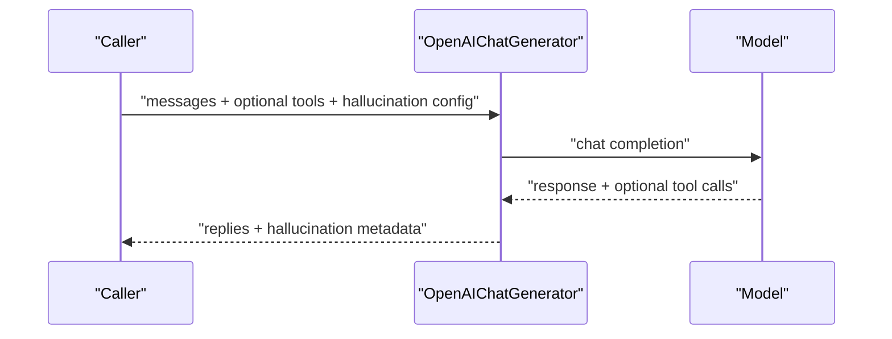
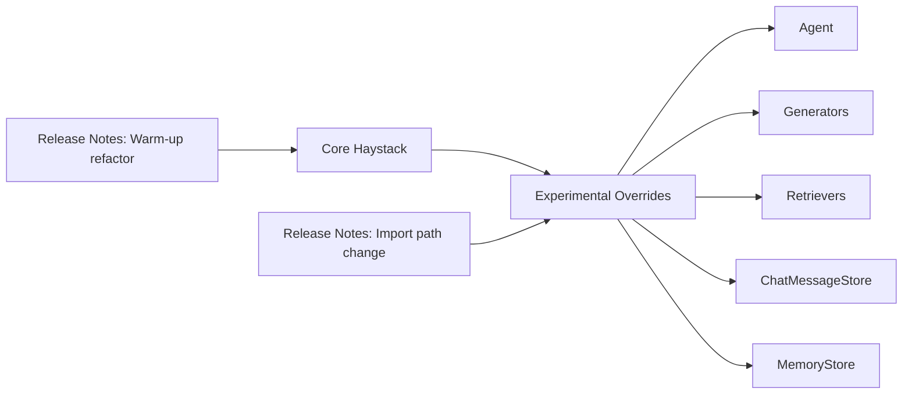

# Experimental APIs

<cite>
**Referenced Files in This Document**
- [experimental-package.mdx](file://docs-website/docs/concepts/experimental-package.mdx)
- [experimental_agents_api.md](file://docs-website/reference/experiments-api/experimental_agents_api.md)
- [experimental_generators_api.md](file://docs-website/reference/experiments-api/experimental_generators_api.md)
- [experimental_retrievers_api.md](file://docs-website/reference/experiments-api/experimental_retrievers_api.md)
- [experimental_chatmessage_store_api.md](file://docs-website/reference/experiments-api/experimental_chatmessage_store_api.md)
- [experimental_mem0_memory_store_api.md](file://docs-website/reference/experiments-api/experimental_mem0_memory_store_api.md)
- [experimental_writers_api.md](file://docs-website/reference/experiments-api/experimental_writers_api.md)
- [experimental_summarizer_api.md](file://docs-website/reference/experiments-api/experimental_summarizer_api.md)
- [experimental_preprocessors_api.md](file://docs-website/reference/experiments-api/experimental_preprocessors_api.md)
- [experimental_package_init.py](file://haystack/__init__.py)
- [tools_init.py](file://haystack/tools/__init__.py)
- [human_in_the_loop_init.py](file://haystack/human_in_the_loop/__init__.py)
- [tools_api.yml](file://pydoc/tools_api.yml)
- [pipeline_api.yml](file://pydoc/pipeline_api.yml)
- [releasenotes_refactor-warm-up-components-c2777fef28a70b61.yaml](file://releasenotes/note/refactor-warm-up-components-c2777fef28a70b61.yaml)
- [releasenotes_change-import-paths-3d4eae690412e545.yaml](file://releasenotes/note/change-import-paths-3d4eae690412e545.yaml)
</cite>

## Table of Contents
1. [Introduction](#introduction)
2. [Project Structure](#project-structure)
3. [Core Components](#core-components)
4. [Architecture Overview](#architecture-overview)
5. [Detailed Component Analysis](#detailed-component-analysis)
6. [Dependency Analysis](#dependency-analysis)
7. [Performance Considerations](#performance-considerations)
8. [Troubleshooting Guide](#troubleshooting-guide)
9. [Conclusion](#conclusion)
10. [Appendices](#appendices)

## Introduction
This document describes the experimental APIs in the Haystack framework, focusing on agent framework capabilities (development, memory management, and tool integration), human-in-the-loop debugging APIs for interactive pipeline development, and experimental components across generators, retrievers, chat message stores, memory stores, summarizers, preprocessors, and writers. It also covers lifecycle, stability guarantees, compatibility, migration guidance, deprecation timelines, usage examples, best practices, and community contribution mechanisms.

## Project Structure
The experimental surface is organized around:
- A dedicated experimental package for preview features and overrides
- Agent framework with human-in-the-loop confirmation strategies and breakpoints
- Tooling APIs for defining, serializing, and invoking tools
- Experimental components for chat message storage, memory stores (including Mem0), generators, retrievers, summarizers, preprocessors, and writers
- Versioned documentation and release notes indicating lifecycle and evolution

**Diagram sources**
- [experimental_package_init.py](file://haystack/__init__.py)
- [tools_init.py](file://haystack/tools/__init__.py)
- [human_in_the_loop_init.py](file://haystack/human_in_the_loop/__init__.py)
- [experimental-package.mdx](file://docs-website/docs/concepts/experimental-package.mdx)
- [experimental_agents_api.md](file://docs-website/reference/experiments-api/experimental_agents_api.md)
- [experimental_generators_api.md](file://docs-website/reference/experiments-api/experimental_generators_api.md)
- [experimental_retrievers_api.md](file://docs-website/reference/experiments-api/experimental_retrievers_api.md)
- [experimental_chatmessage_store_api.md](file://docs-website/reference/experiments-api/experimental_chatmessage_store_api.md)
- [experimental_mem0_memory_store_api.md](file://docs-website/reference/experiments-api/experimental_mem0_memory_store_api.md)
- [experimental_writers_api.md](file://docs-website/reference/experiments-api/experimental_writers_api.md)
- [experimental_summarizer_api.md](file://docs-website/reference/experiments-api/experimental_summarizer_api.md)
- [experimental_preprocessors_api.md](file://docs-website/reference/experiments-api/experimental_preprocessors_api.md)

**Section sources**
- [experimental-package.mdx](file://docs-website/docs/concepts/experimental-package.mdx#L1-L68)
- [experimental_agents_api.md](file://docs-website/reference/experiments-api/experimental_agents_api.md#L1-L476)
- [experimental_generators_api.md](file://docs-website/reference/experiments-api/experimental_generators_api.md#L1-L153)
- [experimental_retrievers_api.md](file://docs-website/reference/experiments-api/experimental_retrievers_api.md#L1-L125)
- [experimental_chatmessage_store_api.md](file://docs-website/reference/experiments-api/experimental_chatmessage_store_api.md#L1-L182)
- [experimental_mem0_memory_store_api.md](file://docs-website/reference/experiments-api/experimental_mem0_memory_store_api.md#L1-L219)

## Core Components
- Experimental package lifecycle and installation
  - The experimental package is a separate distribution that ships all available experiments for a given release. It is intended for early feedback and iteration, with a default 3-month lifespan per feature. After the lifecycle ends, features are either merged into core Haystack, released as integrations, or dropped.
  - Compatibility is only guaranteed against the latest Haystack version; older versions are not supported.
- Agent framework
  - Provides a tool-using agent with provider-agnostic chat model support, human-in-the-loop confirmation strategies, breakpoints, and snapshots for interactive debugging.
- Tooling APIs
  - Define, serialize/deserialize, and invoke tools; support mixing Tools and Toolsets; include utilities for flattening and warming up tools.
- Human-in-the-loop debugging
  - Confirmation strategies and breakpoint exceptions enable pausing execution to gather user feedback or inspect state.
- Experimental components
  - Generators (with hallucination risk scoring), retrievers (chat message retrieval), chat message stores (in-memory), memory stores (Mem0), summarizers, preprocessors, and writers.

**Section sources**
- [experimental-package.mdx](file://docs-website/docs/concepts/experimental-package.mdx#L12-L26)
- [experimental_agents_api.md](file://docs-website/reference/experiments-api/experimental_agents_api.md#L14-L25)
- [tools_init.py](file://haystack/tools/__init__.py#L19-L24)
- [experimental_generators_api.md](file://docs-website/reference/experiments-api/experimental_generators_api.md#L14-L16)
- [experimental_retrievers_api.md](file://docs-website/reference/experiments-api/experimental_retrievers_api.md#L14-L16)
- [experimental_chatmessage_store_api.md](file://docs-website/reference/experiments-api/experimental_chatmessage_store_api.md#L14-L16)
- [experimental_mem0_memory_store_api.md](file://docs-website/reference/experiments-api/experimental_mem0_memory_store_api.md#L14-L16)

## Architecture Overview
The experimental architecture integrates with the core Haystack ecosystem via:
- Overridable imports from the experimental package
- Tool-based agent orchestration with optional human-in-the-loop confirmation
- Message and memory stores enabling conversational persistence and retrieval
- Optional hallucination risk scoring in experimental generators

**Diagram sources**
- [experimental_agents_api.md](file://docs-website/reference/experiments-api/experimental_agents_api.md#L14-L25)
- [experimental_generators_api.md](file://docs-website/reference/experiments-api/experimental_generators_api.md#L14-L16)
- [experimental_chatmessage_store_api.md](file://docs-website/reference/experiments-api/experimental_chatmessage_store_api.md#L14-L16)
- [experimental_mem0_memory_store_api.md](file://docs-website/reference/experiments-api/experimental_mem0_memory_store_api.md#L14-L16)
- [tools_init.py](file://haystack/tools/__init__.py#L19-L24)

## Detailed Component Analysis

### Agent Framework APIs
- Purpose
  - Tool-using agent with provider-agnostic chat model support, human-in-the-loop confirmation strategies, and interactive debugging via breakpoints and snapshots.
- Key capabilities
  - Tool selection and invocation, exit conditions, streaming callbacks, state schema, and memory/message store integration.
  - Human-in-the-loop strategies and breakpoint exceptions for interactive development.
- API highlights
  - Initialization parameters include chat generator, tools, system prompt, exit conditions, state schema, max steps, streaming callback, raise-on-tool-failure flag, confirmation strategies, tool invoker kwargs, chat message store, and memory store.
  - Run and run_async methods accept per-invocation overrides for generation kwargs, breakpoints, snapshots, system prompts, tools, confirmation strategy context, and store kwargs.
  - Serialization and deserialization support via to_dict/from_dict.
- Human-in-the-loop debugging
  - Breakpoint confirmation strategy raises a breakpoint exception to pause execution and capture a snapshot for user review.
  - Utilities to extract tool calls and descriptions from snapshots for presentation to users.
- Error handling
  - Runtime errors if the agent is not warmed up before run/run_async.
  - Breakpoint exceptions when confirmation strategies pause execution.

**Diagram sources**
- [experimental_agents_api.md](file://docs-website/reference/experiments-api/experimental_agents_api.md#L114-L179)
- [experimental_agents_api.md](file://docs-website/reference/experiments-api/experimental_agents_api.md#L354-L413)

**Section sources**
- [experimental_agents_api.md](file://docs-website/reference/experiments-api/experimental_agents_api.md#L14-L25)
- [experimental_agents_api.md](file://docs-website/reference/experiments-api/experimental_agents_api.md#L66-L111)
- [experimental_agents_api.md](file://docs-website/reference/experiments-api/experimental_agents_api.md#L114-L179)
- [experimental_agents_api.md](file://docs-website/reference/experiments-api/experimental_agents_api.md#L182-L253)
- [experimental_agents_api.md](file://docs-website/reference/experiments-api/experimental_agents_api.md#L288-L350)
- [experimental_agents_api.md](file://docs-website/reference/experiments-api/experimental_agents_api.md#L354-L413)
- [experimental_agents_api.md](file://docs-website/reference/experiments-api/experimental_agents_api.md#L414-L475)

### Human-in-the-Loop Debugging APIs
- Confirmation strategies
  - Breakpoint confirmation strategy raises a breakpoint exception to pause execution and capture a snapshot.
- Breakpoint utilities
  - Extract tool calls and descriptions from snapshots to present to users for confirmation.
- Exceptions
  - Breakpoint exception types for signaling pause and resuming execution after user confirmation.

**Diagram sources**
- [experimental_agents_api.md](file://docs-website/reference/experiments-api/experimental_agents_api.md#L354-L413)
- [experimental_agents_api.md](file://docs-website/reference/experiments-api/experimental_agents_api.md#L292-L318)

**Section sources**
- [experimental_agents_api.md](file://docs-website/reference/experiments-api/experimental_agents_api.md#L292-L318)
- [experimental_agents_api.md](file://docs-website/reference/experiments-api/experimental_agents_api.md#L323-L350)
- [experimental_agents_api.md](file://docs-website/reference/experiments-api/experimental_agents_api.md#L354-L413)

### Tool Integration APIs
- Tool definitions and decorators
  - Tool class, decorator, and helpers for creating tools from functions.
- Tool collections
  - Toolset and searchable toolset for organizing and discovering tools.
- Serialization and utilities
  - Serialize/deserialize tools/toolsets in-place, flatten mixed lists of tools and toolsets, and warm up tools.
- Type aliases
  - ToolsType supports various combinations of tools and toolsets for flexible composition.

**Diagram sources**
- [tools_init.py](file://haystack/tools/__init__.py#L9-L16)

**Section sources**
- [tools_init.py](file://haystack/tools/__init__.py#L19-L24)
- [tools_init.py](file://haystack/tools/__init__.py#L26-L40)

### Experimental Generators API
- Features
  - Experimental OpenAI chat generator with hallucination risk scoring and tool support.
- Capabilities
  - Run and run_async methods with streaming callbacks, generation kwargs, tools, strict tool schema adherence, and hallucination score configuration.
  - Response metadata includes hallucination decision, risk bound, and rationale when scoring is enabled.

**Diagram sources**
- [experimental_generators_api.md](file://docs-website/reference/experiments-api/experimental_generators_api.md#L55-L101)
- [experimental_generators_api.md](file://docs-website/reference/experiments-api/experimental_generators_api.md#L102-L145)

**Section sources**
- [experimental_generators_api.md](file://docs-website/reference/experiments-api/experimental_generators_api.md#L14-L16)
- [experimental_generators_api.md](file://docs-website/reference/experiments-api/experimental_generators_api.md#L55-L101)
- [experimental_generators_api.md](file://docs-website/reference/experiments-api/experimental_generators_api.md#L102-L145)

### Experimental Retriever API
- Purpose
  - Retrieve chat messages from a ChatMessageStore for conversational context.
- Usage
  - Initialize with a message store and last_k limit; run with chat history id and optional current messages to prepend system messages and append retrieved history.

**Section sources**
- [experimental_retrievers_api.md](file://docs-website/reference/experiments-api/experimental_retrievers_api.md#L14-L16)
- [experimental_retrievers_api.md](file://docs-website/reference/experiments-api/experimental_retrievers_api.md#L86-L124)

### Experimental ChatMessage Store API
- Purpose
  - In-memory store for chat messages with isolation via chat_history_id, optional skipping of system messages, and configurable last_k retrieval.
- Operations
  - Write, retrieve, count, delete messages, and delete all messages.

**Section sources**
- [experimental_chatmessage_store_api.md](file://docs-website/reference/experiments-api/experimental_chatmessage_store_api.md#L14-L16)
- [experimental_chatmessage_store_api.md](file://docs-website/reference/experiments-api/experimental_chatmessage_store_api.md#L110-L156)

### Experimental Mem0 Memory Store API
- Purpose
  - Backend-backed memory store using Mem0 for adding, searching, and deleting memories with user_id, run_id, and agent_id scoping.
- Capabilities
  - Add memories with inference, search memories with filters or query, return single message aggregation, and delete memories or all memories for identifiers.

**Section sources**
- [experimental_mem0_memory_store_api.md](file://docs-website/reference/experiments-api/experimental_mem0_memory_store_api.md#L14-L16)
- [experimental_mem0_memory_store_api.md](file://docs-website/reference/experiments-api/experimental_mem0_memory_store_api.md#L53-L89)
- [experimental_mem0_memory_store_api.md](file://docs-website/reference/experiments-api/experimental_mem0_memory_store_api.md#L90-L131)
- [experimental_mem0_memory_store_api.md](file://docs-website/reference/experiments-api/experimental_mem0_memory_store_api.md#L133-L168)
- [experimental_mem0_memory_store_api.md](file://docs-website/reference/experiments-api/experimental_mem0_memory_store_api.md#L170-L206)
- [experimental_mem0_memory_store_api.md](file://docs-website/reference/experiments-api/experimental_mem0_memory_store_api.md#L208-L218)

### Experimental Summarizer, Preprocessors, and Writers APIs
- Summarizer
  - Experimental summarization component for generating concise summaries from documents or messages.
- Preprocessors
  - Experimental preprocessing components for transforming and normalizing input data.
- Writers
  - Experimental writing components for persisting results to external systems.

**Section sources**
- [experimental_summarizer_api.md](file://docs-website/reference/experiments-api/experimental_summarizer_api.md)
- [experimental_preprocessors_api.md](file://docs-website/reference/experiments-api/experimental_preprocessors_api.md)
- [experimental_writers_api.md](file://docs-website/reference/experiments-api/experimental_writers_api.md)

## Dependency Analysis
- Import paths and overrides
  - Experimental package allows overriding core components (e.g., Pipeline) by changing import statements to point to experimental equivalents.
- Lifecycle and evolution
  - Release notes indicate preview import path changes to reduce namespace pollution and refactor warm-up behavior for components that define warm_up, removing the need for manual calls and preventing errors in standalone usage.

**Diagram sources**
- [releasenotes_refactor-warm-up-components-c2777fef28a70b61.yaml](file://releasenotes/note/refactor-warm-up-components-c2777fef28a70b61.yaml#L1-L4)
- [releasenotes_change-import-paths-3d4eae690412e545.yaml](file://releasenotes/note/change-import-paths-3d4eae690412e545.yaml#L1-L5)

**Section sources**
- [releasenotes_refactor-warm-up-components-c2777fef28a70b61.yaml](file://releasenotes/note/refactor-warm-up-components-c2777fef28a70b61.yaml#L1-L4)
- [releasenotes_change-import-paths-3d4eae690412e545.yaml](file://releasenotes/note/change-import-paths-3d4eae690412e545.yaml#L1-L5)

## Performance Considerations
- Experimental generators with hallucination risk scoring involve multiple samples and consistency checks, increasing latency and cost. Use judiciously in scenarios requiring reliability assessment.
- Human-in-the-loop strategies introduce pauses and snapshot serialization; plan for increased end-to-end latency in interactive debugging workflows.
- Memory and chat message stores incur overhead proportional to message counts and retrieval sizes; tune last_k and filtering appropriately.

[No sources needed since this section provides general guidance]

## Troubleshooting Guide
- Agent not warmed up
  - Ensure components with warm_up are initialized and used according to refactored behavior that auto-runs warm_up on first use.
- Breakpoint exceptions
  - Catch and handle breakpoint exceptions to resume execution after user confirmation or adjust confirmation strategies.
- Tool invocation failures
  - Configure raise_on_tool_invocation_failure to control whether exceptions propagate or are converted to chat messages and fed back to the model.
- Import path issues
  - When switching to experimental overrides, update import statements to point to the experimental package equivalents.

**Section sources**
- [experimental_agents_api.md](file://docs-website/reference/experiments-api/experimental_agents_api.md#L107-L111)
- [experimental_agents_api.md](file://docs-website/reference/experiments-api/experimental_agents_api.md#L169-L173)
- [experimental_agents_api.md](file://docs-website/reference/experiments-api/experimental_agents_api.md#L100-L101)
- [releasenotes_refactor-warm-up-components-c2777fef28a70b61.yaml](file://releasenotes/note/refactor-warm-up-components-c2777fef28a70b61.yaml#L1-L4)

## Conclusion
The experimental APIs in Haystack provide a preview surface for cutting-edge agent capabilities, human-in-the-loop debugging, and specialized components. They are designed for rapid iteration and user feedback with a defined lifecycle and clear compatibility caveats. Adopt them thoughtfully, monitor performance implications, and prepare for potential migration to stable APIs or integrations.

[No sources needed since this section summarizes without analyzing specific files]

## Appendices

### Stability Guarantees and Lifecycle
- Default feature lifespan is 3 months from the first non-pre-release build that includes it.
- At the end of the lifespan, features are either merged into core Haystack, released as integrations, or dropped.

**Section sources**
- [experimental-package.mdx](file://docs-website/docs/concepts/experimental-package.mdx#L28-L34)

### Migration Guidance
- Preview import path changes
  - Review release notes for import path adjustments to minimize namespace pollution.
- Warm-up behavior
  - Rely on auto-run of warm_up for components that define it; avoid manual warm-up calls.
- Overrides
  - When migrating to stable APIs, revert import statements from experimental to core Haystack equivalents.

**Section sources**
- [releasenotes_change-import-paths-3d4eae690412e545.yaml](file://releasenotes/note/change-import-paths-3d4eae690412e545.yaml#L1-L5)
- [releasenotes_refactor-warm-up-components-c2777fef28a70b61.yaml](file://releasenotes/note/refactor-warm-up-components-c2777fef28a70b61.yaml#L1-L4)

### Usage Examples and Best Practices
- Agents
  - Use confirmation strategies per tool to balance autonomy and safety; leverage breakpoints for interactive inspection.
- Generators
  - Enable hallucination risk scoring when accuracy is critical; expect higher latency and cost.
- Tools
  - Serialize/deserialize tools and toolsets for persistence; flatten mixed lists for flexible composition; warm up tools before heavy usage.
- Stores
  - Scope memory and chat histories with user_id/run_id/agent_id; tune retrieval limits and filters for performance.

**Section sources**
- [experimental_agents_api.md](file://docs-website/reference/experiments-api/experimental_agents_api.md#L26-L62)
- [experimental_generators_api.md](file://docs-website/reference/experiments-api/experimental_generators_api.md#L21-L53)
- [tools_init.py](file://haystack/tools/__init__.py#L19-L24)
- [experimental_mem0_memory_store_api.md](file://docs-website/reference/experiments-api/experimental_mem0_memory_store_api.md#L53-L89)
- [experimental_chatmessage_store_api.md](file://docs-website/reference/experiments-api/experimental_chatmessage_store_api.md#L110-L156)

### Community Feedback and Contribution
- Cookbook recipes and examples for experimental features are curated in the documentation website.
- The experimental package is maintained in a dedicated repository for rapid iteration and user feedback collection.

**Section sources**
- [experimental-package.mdx](file://docs-website/docs/concepts/experimental-package.mdx#L59-L68)