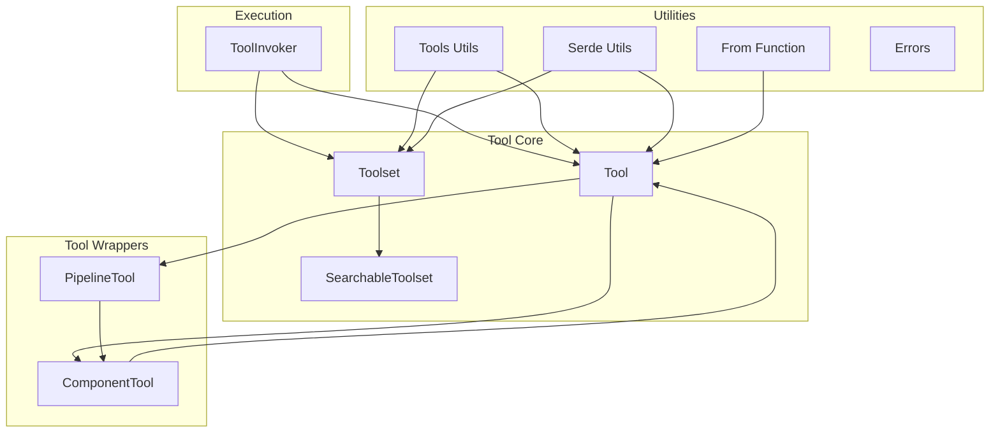
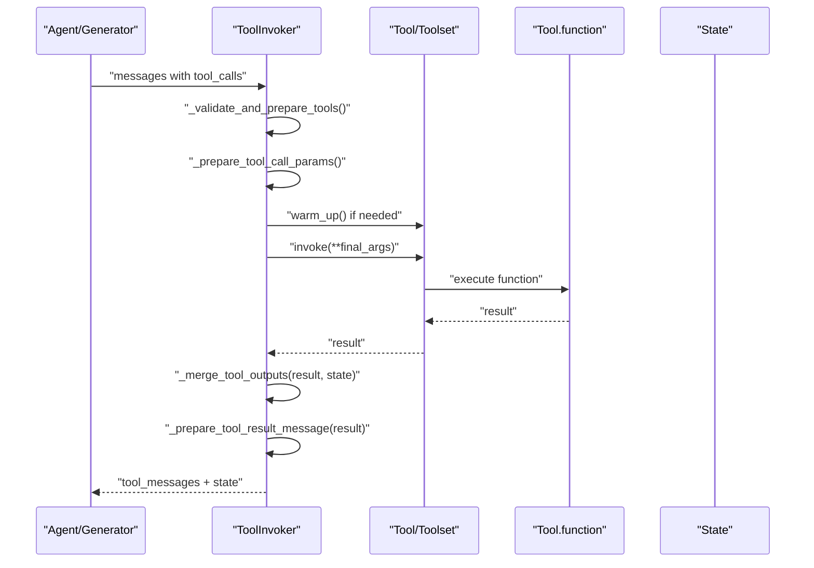
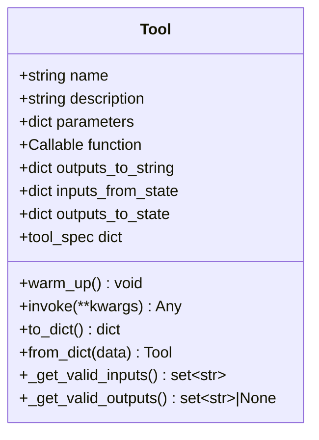
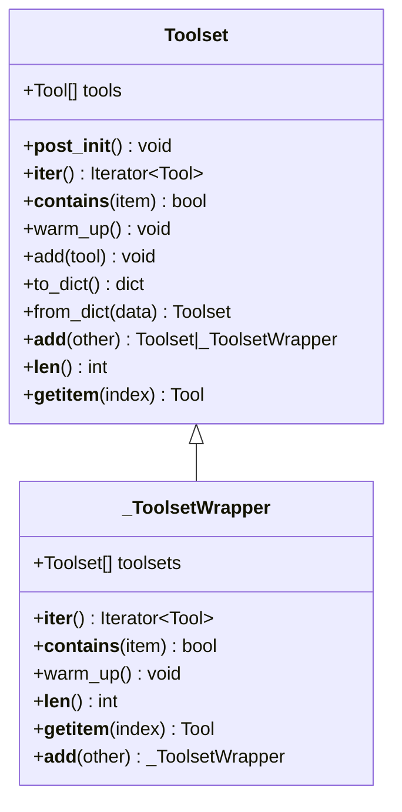
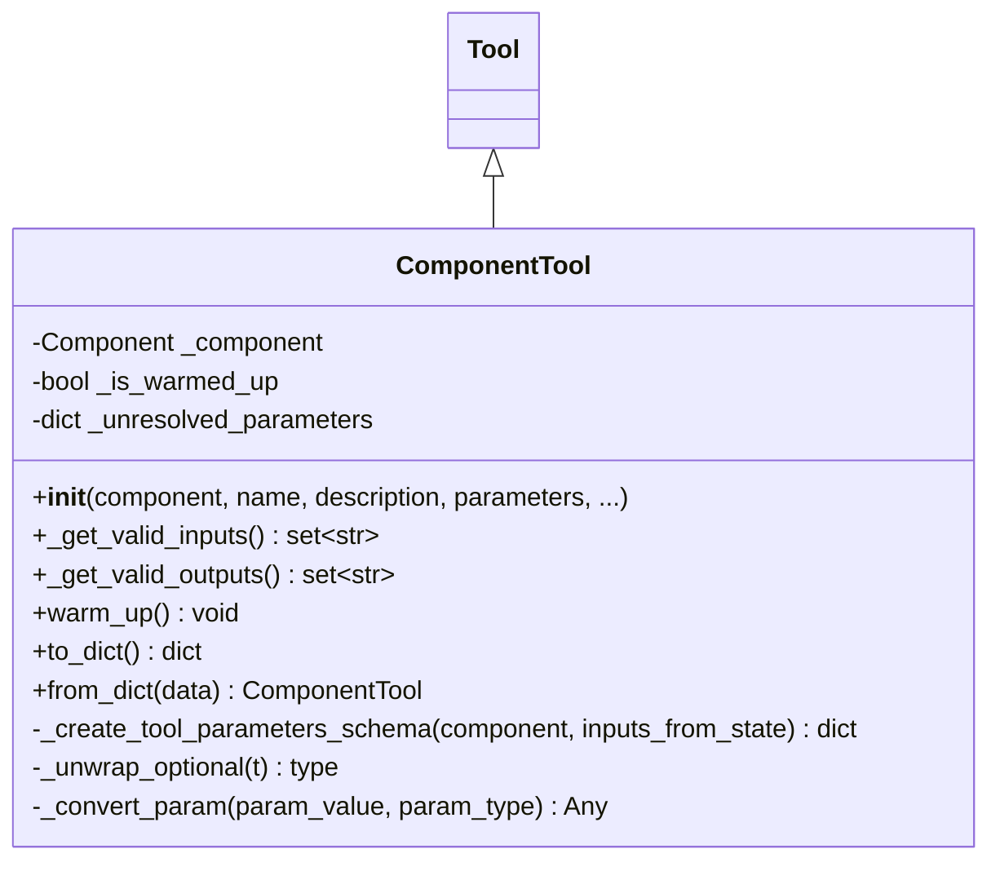
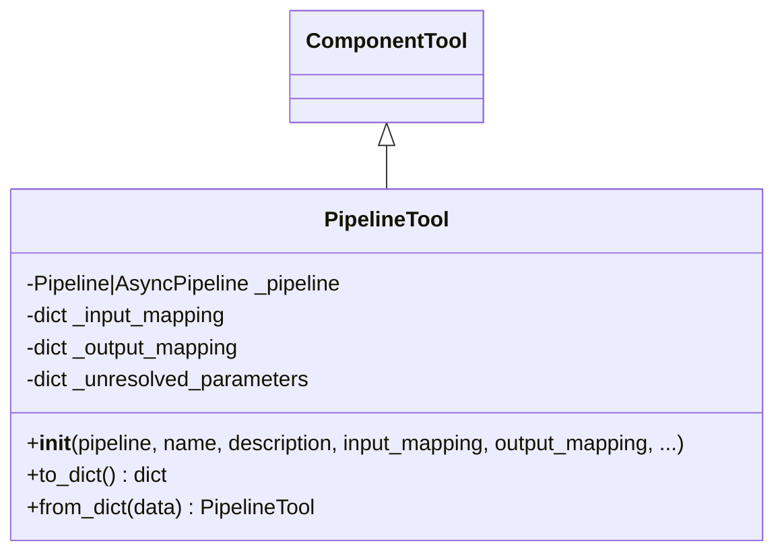
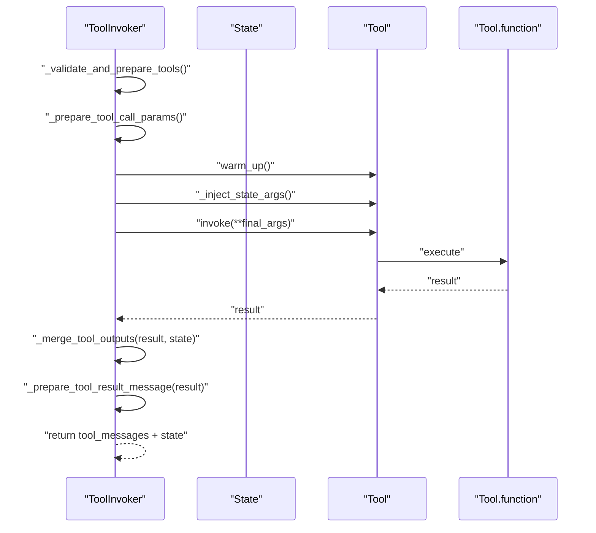
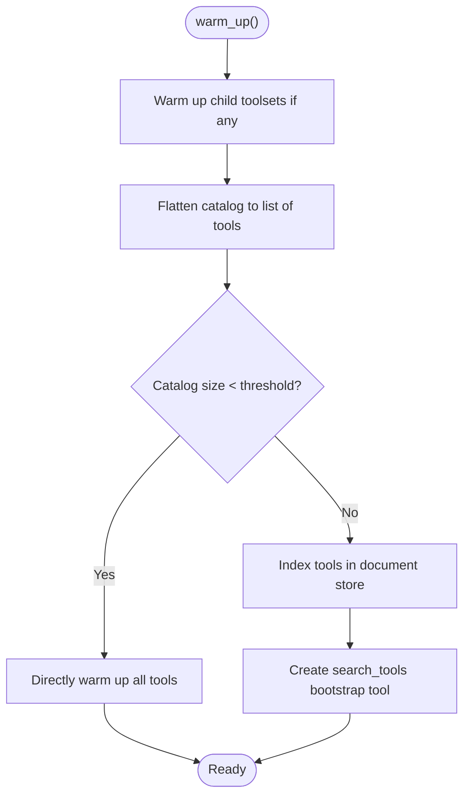
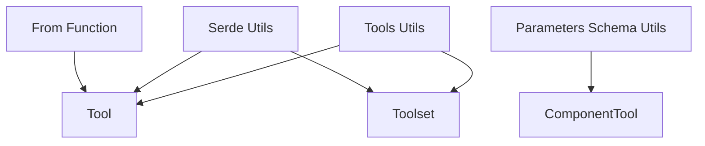
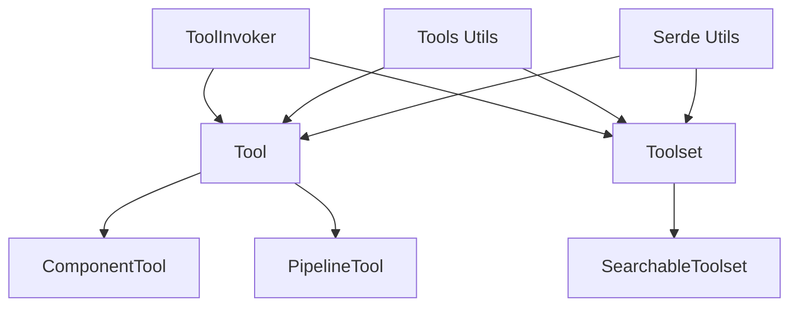

# Tool APIs

<cite>
**Referenced Files in This Document**
- [haystack/tools/__init__.py](file://haystack/tools/__init__.py)
- [haystack/tools/tool.py](file://haystack/tools/tool.py)
- [haystack/tools/toolset.py](file://haystack/tools/toolset.py)
- [haystack/tools/component_tool.py](file://haystack/tools/component_tool.py)
- [haystack/tools/pipeline_tool.py](file://haystack/tools/pipeline_tool.py)
- [haystack/tools/from_function.py](file://haystack/tools/from_function.py)
- [haystack/tools/utils.py](file://haystack/tools/utils.py)
- [haystack/tools/serde_utils.py](file://haystack/tools/serde_utils.py)
- [haystack/tools/searchable_toolset.py](file://haystack/tools/searchable_toolset.py)
- [haystack/tools/errors.py](file://haystack/tools/errors.py)
- [haystack/components/tools/tool_invoker.py](file://haystack/components/tools/tool_invoker.py)
</cite>

## Table of Contents
1. [Introduction](#introduction)
2. [Project Structure](#project-structure)
3. [Core Components](#core-components)
4. [Architecture Overview](#architecture-overview)
5. [Detailed Component Analysis](#detailed-component-analysis)
6. [Dependency Analysis](#dependency-analysis)
7. [Performance Considerations](#performance-considerations)
8. [Troubleshooting Guide](#troubleshooting-guide)
9. [Conclusion](#conclusion)
10. [Appendices](#appendices)

## Introduction
This document provides comprehensive API documentation for the tool integration framework in the project. It covers the Tool abstraction, ToolSet and specialized variants, tool component APIs for integrating external services and pipelines, tool invocation patterns, parameter validation, result handling, tool discovery and registration, lifecycle management, security considerations, error handling, performance optimization, and patterns for integrating tools with agents and generators.

## Project Structure
The tool integration framework is organized around several core modules:
- Tool and ToolSet abstractions for defining reusable tools and managing groups of tools
- ComponentTool and PipelineTool for wrapping Haystack components and pipelines as tools
- Tool invoker component for executing tools within pipelines and agents
- Utilities for serialization, deserialization, flattening, and warming up tools
- SearchableToolset for dynamic tool discovery and on-demand loading
- Error types for robust error handling

**Diagram sources**
- [haystack/tools/tool.py](file://haystack/tools/tool.py#L18-L405)
- [haystack/tools/toolset.py](file://haystack/tools/toolset.py#L13-L365)
- [haystack/tools/searchable_toolset.py](file://haystack/tools/searchable_toolset.py#L21-L330)
- [haystack/tools/component_tool.py](file://haystack/tools/component_tool.py#L37-L395)
- [haystack/tools/pipeline_tool.py](file://haystack/tools/pipeline_tool.py#L21-L258)
- [haystack/components/tools/tool_invoker.py](file://haystack/components/tools/tool_invoker.py#L80-L857)
- [haystack/tools/utils.py](file://haystack/tools/utils.py#L14-L65)
- [haystack/tools/serde_utils.py](file://haystack/tools/serde_utils.py#L16-L83)
- [haystack/tools/from_function.py](file://haystack/tools/from_function.py#L16-L324)
- [haystack/tools/errors.py](file://haystack/tools/errors.py#L6-L22)

**Section sources**
- [haystack/tools/__init__.py](file://haystack/tools/__init__.py#L9-L40)

## Core Components
This section introduces the primary building blocks of the tool integration framework.

- Tool: A dataclass representing a callable tool with a name, description, JSON schema parameters, a function to invoke, and optional configuration for mapping inputs from state and outputs to string or state.
- Toolset: A collection of related tools that can be managed as a unit, supporting iteration, containment checks, warm-up delegation, and serialization.
- ComponentTool: A Tool wrapper around Haystack components, automatically generating LLM-compatible tool schemas from component input sockets and validating/transforming inputs.
- PipelineTool: A Tool wrapper around Haystack pipelines, enabling tool-like invocation with input/output mapping and schema generation.
- ToolInvoker: A component that executes tools based on prepared tool calls, manages state, handles result conversion, and supports parallel execution and streaming callbacks.

Key capabilities:
- Parameter validation via JSON schema and type introspection
- Outputs configuration for string conversion and state merging
- Lifecycle management via warm_up
- Serialization/deserialization of tools and toolsets
- Dynamic tool discovery with SearchableToolset

**Section sources**
- [haystack/tools/tool.py](file://haystack/tools/tool.py#L18-L405)
- [haystack/tools/toolset.py](file://haystack/tools/toolset.py#L13-L365)
- [haystack/tools/component_tool.py](file://haystack/tools/component_tool.py#L37-L395)
- [haystack/tools/pipeline_tool.py](file://haystack/tools/pipeline_tool.py#L21-L258)
- [haystack/components/tools/tool_invoker.py](file://haystack/components/tools/tool_invoker.py#L80-L857)

## Architecture Overview
The tool integration framework orchestrates tools and toolsets through a layered architecture:
- Tool definitions encapsulate callable logic and schemas
- Tool wrappers adapt components and pipelines into tools
- ToolInvoker coordinates tool execution, state updates, and result formatting
- Utilities handle serialization, flattening, and warming
- SearchableToolset enables dynamic discovery and on-demand loading

**Diagram sources**
- [haystack/components/tools/tool_invoker.py](file://haystack/components/tools/tool_invoker.py#L547-L800)
- [haystack/tools/tool.py](file://haystack/tools/tool.py#L261-L271)
- [haystack/tools/toolset.py](file://haystack/tools/toolset.py#L189-L217)

## Detailed Component Analysis

### Tool Abstraction
The Tool class defines the core interface for tools:
- Attributes: name, description, parameters (JSON schema), function, outputs_to_string, inputs_from_state, outputs_to_state
- Validation: Ensures parameters form a valid JSON schema, rejects async functions, validates outputs_to_state and outputs_to_string configurations, and checks inputs_from_state parameter names against valid inputs
- Tool specification: Provides a standardized tool_spec for LLM consumption
- Invocation: Executes the function with provided kwargs and wraps exceptions in ToolInvocationError
- Serialization: Supports serialization/deserialization of function and handler callables

**Diagram sources**
- [haystack/tools/tool.py](file://haystack/tools/tool.py#L18-L405)

**Section sources**
- [haystack/tools/tool.py](file://haystack/tools/tool.py#L18-L405)
- [haystack/tools/errors.py](file://haystack/tools/errors.py#L14-L22)

### ToolSet Abstraction
Toolset organizes related tools:
- Collection interface: __iter__, __contains__, __len__, __getitem__
- Validation: Prevents duplicate tool names and rejects single Tool passed directly
- Warm-up: Iterates through tools to warm them up
- Serialization: Serializes tool instances; subclasses may serialize descriptors instead
- Composition: Supports adding tools or merging other toolsets; internal wrapper for combining multiple toolsets

**Diagram sources**
- [haystack/tools/toolset.py](file://haystack/tools/toolset.py#L13-L365)

**Section sources**
- [haystack/tools/toolset.py](file://haystack/tools/toolset.py#L13-L365)

### ComponentTool
ComponentTool wraps Haystack components as tools:
- Automatic schema generation from component input sockets
- Type conversion and validation for component inputs
- Name and description defaults from component class/docstring
- Validation of inputs_from_state against component input sockets
- Output validation via _get_valid_outputs for component outputs
- Serialization/deserialization preserving component configuration

**Diagram sources**
- [haystack/tools/component_tool.py](file://haystack/tools/component_tool.py#L37-L395)
- [haystack/tools/tool.py](file://haystack/tools/tool.py#L18-L405)

**Section sources**
- [haystack/tools/component_tool.py](file://haystack/tools/component_tool.py#L37-L395)

### PipelineTool
PipelineTool wraps pipelines as tools:
- Inherits from ComponentTool and uses SuperComponent to expose pipeline inputs/outputs
- Supports input_mapping and output_mapping for flexible parameter/result binding
- Serialization preserves pipeline configuration and mapping details
- Handles both sync and async pipelines

**Diagram sources**
- [haystack/tools/pipeline_tool.py](file://haystack/tools/pipeline_tool.py#L21-L258)
- [haystack/tools/component_tool.py](file://haystack/tools/component_tool.py#L37-L395)

**Section sources**
- [haystack/tools/pipeline_tool.py](file://haystack/tools/pipeline_tool.py#L21-L258)

### ToolInvoker
ToolInvoker executes tools based on prepared tool calls:
- Validates and prepares tools (flattening Toolsets, checking duplicates)
- Injects arguments from state and LLM-provided arguments
- Supports streaming callback passthrough to tools
- Parallel execution via ThreadPoolExecutor
- Result conversion to string or structured results
- Merging outputs into State according to outputs_to_state configuration
- Comprehensive error handling with specific exception types

**Diagram sources**
- [haystack/components/tools/tool_invoker.py](file://haystack/components/tools/tool_invoker.py#L547-L800)

**Section sources**
- [haystack/components/tools/tool_invoker.py](file://haystack/components/tools/tool_invoker.py#L80-L857)

### SearchableToolset
SearchableToolset enables dynamic tool discovery:
- Defer flattening and warming until warm_up to support lazy toolsets
- Indexes tools in an in-memory document store for BM25 search
- Exposes a bootstrap search_tools tool for keyword-based discovery
- Passthrough mode for small catalogs
- Clearing discovered tools between runs

**Diagram sources**
- [haystack/tools/searchable_toolset.py](file://haystack/tools/searchable_toolset.py#L133-L163)

**Section sources**
- [haystack/tools/searchable_toolset.py](file://haystack/tools/searchable_toolset.py#L21-L330)

### Utilities and Serialization
Utilities support common operations:
- ToolsType union for flexible tool inputs
- Flattening and warming tools across formats
- Serialization/deserialization preserving class identity
- Parameter schema utilities for component-based tools

**Diagram sources**
- [haystack/tools/utils.py](file://haystack/tools/utils.py#L14-L65)
- [haystack/tools/serde_utils.py](file://haystack/tools/serde_utils.py#L16-L83)
- [haystack/tools/from_function.py](file://haystack/tools/from_function.py#L16-L324)
- [haystack/tools/parameters_schema_utils.py](file://haystack/tools/parameters_schema_utils.py#L23-L229)

**Section sources**
- [haystack/tools/utils.py](file://haystack/tools/utils.py#L14-L65)
- [haystack/tools/serde_utils.py](file://haystack/tools/serde_utils.py#L16-L83)
- [haystack/tools/from_function.py](file://haystack/tools/from_function.py#L16-L324)
- [haystack/tools/parameters_schema_utils.py](file://haystack/tools/parameters_schema_utils.py#L23-L229)

## Dependency Analysis
The framework exhibits clear separation of concerns:
- Tool and Toolset define the core abstractions
- ComponentTool and PipelineTool depend on Tool and leverage Haystack component infrastructure
- ToolInvoker depends on Tool/Toolset and State for execution orchestration
- Utilities and serialization utilities are shared across components
- SearchableToolset depends on Toolset and document stores for discovery

**Diagram sources**
- [haystack/tools/tool.py](file://haystack/tools/tool.py#L18-L405)
- [haystack/tools/toolset.py](file://haystack/tools/toolset.py#L13-L365)
- [haystack/tools/component_tool.py](file://haystack/tools/component_tool.py#L37-L395)
- [haystack/tools/pipeline_tool.py](file://haystack/tools/pipeline_tool.py#L21-L258)
- [haystack/components/tools/tool_invoker.py](file://haystack/components/tools/tool_invoker.py#L80-L857)
- [haystack/tools/utils.py](file://haystack/tools/utils.py#L14-L65)
- [haystack/tools/serde_utils.py](file://haystack/tools/serde_utils.py#L16-L83)
- [haystack/tools/searchable_toolset.py](file://haystack/tools/searchable_toolset.py#L21-L330)

**Section sources**
- [haystack/tools/__init__.py](file://haystack/tools/__init__.py#L9-L40)

## Performance Considerations
- Parallel execution: ToolInvoker uses ThreadPoolExecutor to execute multiple tool calls concurrently, configurable via max_workers
- Warm-up: Use warm_up to pre-initialize tools and shared resources; ToolInvoker caches prepared tools after warm-up
- Streaming: Enable streaming_callback passthrough to tools that support it for responsive feedback
- Serialization overhead: Prefer serializing descriptors for dynamic toolsets (e.g., SearchableToolset) to avoid large serialized tool instances
- Memory management: SearchableToolset supports clearing discovered tools to control memory usage in long-running applications

[No sources needed since this section provides general guidance]

## Troubleshooting Guide
Common issues and resolutions:
- Duplicate tool names: Ensure unique tool names across Tool and Toolset collections; validation occurs during preparation and warm-up
- Invalid JSON schema: Verify parameters define a valid JSON schema; errors are raised during Tool initialization
- Async functions: Tools require synchronous functions; use ComponentTool or PipelineTool for async components
- Parameter mismatch: inputs_from_state must reference valid tool parameters; validation compares against function signature or component inputs
- Output mapping: outputs_to_state must reference valid outputs; validation is enforced for subclasses that provide valid outputs
- Tool not found: ToolInvoker raises ToolNotFoundException when a tool name is not present; ensure tools are properly registered
- Invocation errors: ToolInvocationError wraps exceptions during tool execution; inspect tool_name and error details
- String conversion errors: ToolInvoker raises StringConversionError or ResultConversionError when result conversion fails; adjust outputs_to_string configuration

**Section sources**
- [haystack/components/tools/tool_invoker.py](file://haystack/components/tools/tool_invoker.py#L44-L78)
- [haystack/tools/errors.py](file://haystack/tools/errors.py#L6-L22)
- [haystack/tools/tool.py](file://haystack/tools/tool.py#L103-L194)
- [haystack/tools/component_tool.py](file://haystack/tools/component_tool.py#L170-L183)

## Conclusion
The tool integration framework provides a robust, extensible foundation for building reusable tools, composing them into toolsets, and executing them within pipelines and agents. Its design emphasizes validation, serialization, dynamic discovery, and performance, while offering clear patterns for integrating external services and pipelines as tools.

[No sources needed since this section summarizes without analyzing specific files]

## Appendices

### API Reference: Tool
- Attributes: name, description, parameters (JSON schema), function, outputs_to_string, inputs_from_state, outputs_to_state
- Methods: tool_spec, warm_up, invoke, to_dict, from_dict
- Validation: JSON schema validation, async function rejection, configuration validation

**Section sources**
- [haystack/tools/tool.py](file://haystack/tools/tool.py#L18-L405)

### API Reference: Toolset
- Methods: __iter__, __contains__, warm_up, add, to_dict, from_dict, __add__, __len__, __getitem__
- Validation: Duplicate tool name prevention

**Section sources**
- [haystack/tools/toolset.py](file://haystack/tools/toolset.py#L13-L365)

### API Reference: ComponentTool
- Constructor parameters: component, name, description, parameters, outputs_to_string, inputs_from_state, outputs_to_state
- Methods: _get_valid_inputs, _get_valid_outputs, warm_up, to_dict, from_dict
- Schema generation: Automatic from component input sockets

**Section sources**
- [haystack/tools/component_tool.py](file://haystack/tools/component_tool.py#L37-L395)

### API Reference: PipelineTool
- Constructor parameters: pipeline, name, description, input_mapping, output_mapping, parameters, outputs_to_string, inputs_from_state, outputs_to_state
- Methods: to_dict, from_dict

**Section sources**
- [haystack/tools/pipeline_tool.py](file://haystack/tools/pipeline_tool.py#L21-L258)

### API Reference: ToolInvoker
- Constructor parameters: tools, raise_on_failure, convert_result_to_json_string, streaming_callback, enable_streaming_callback_passthrough, max_workers
- Methods: run, run_async, warm_up
- Exceptions: ToolInvokerError, ToolNotFoundException, StringConversionError, ResultConversionError, ToolOutputMergeError

**Section sources**
- [haystack/components/tools/tool_invoker.py](file://haystack/components/tools/tool_invoker.py#L80-L857)

### API Reference: SearchableToolset
- Constructor parameters: catalog, top_k, search_threshold, search_tool_name, search_tool_description, search_tool_parameters_description
- Methods: warm_up, clear, __iter__, __len__, __contains__, __getitem__, to_dict, from_dict

**Section sources**
- [haystack/tools/searchable_toolset.py](file://haystack/tools/searchable_toolset.py#L21-L330)

### API Reference: Utilities
- Functions: warm_up_tools, flatten_tools_or_toolsets, serialize_tools_or_toolset, deserialize_tools_or_toolset_inplace
- Types: ToolsType

**Section sources**
- [haystack/tools/utils.py](file://haystack/tools/utils.py#L14-L65)
- [haystack/tools/serde_utils.py](file://haystack/tools/serde_utils.py#L16-L83)
- [haystack/tools/__init__.py](file://haystack/tools/__init__.py#L18-L24)