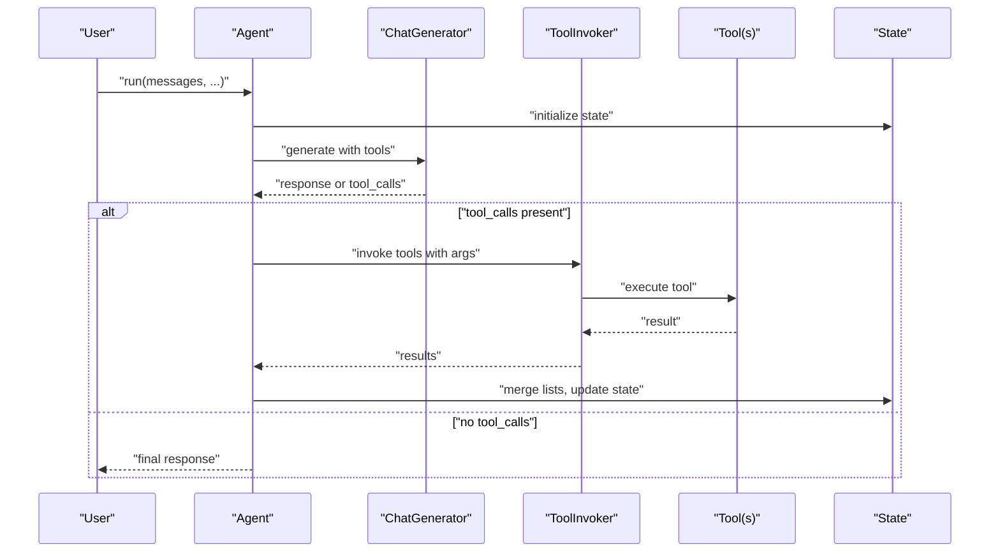
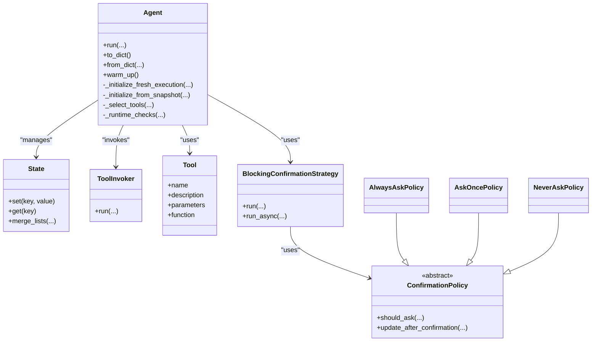
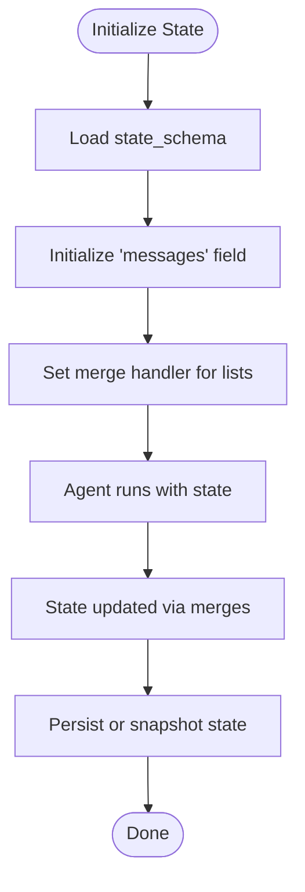
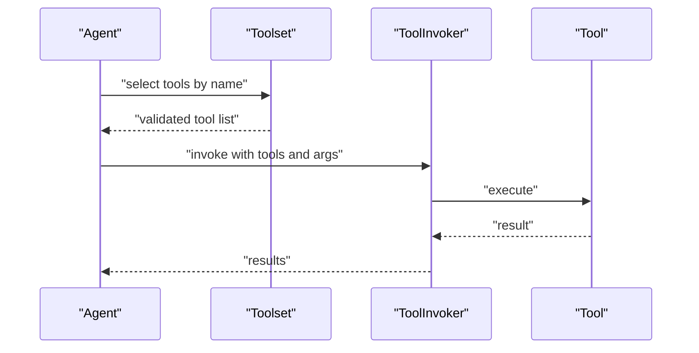
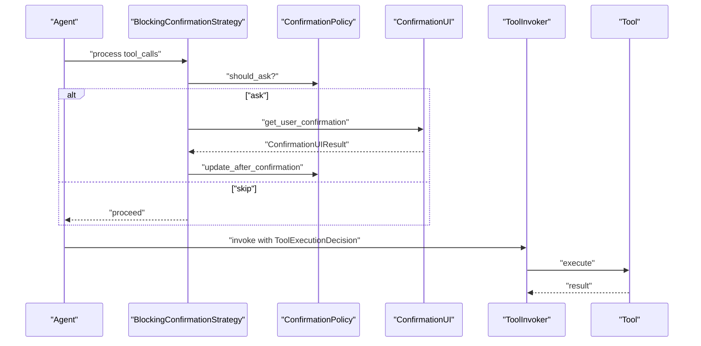
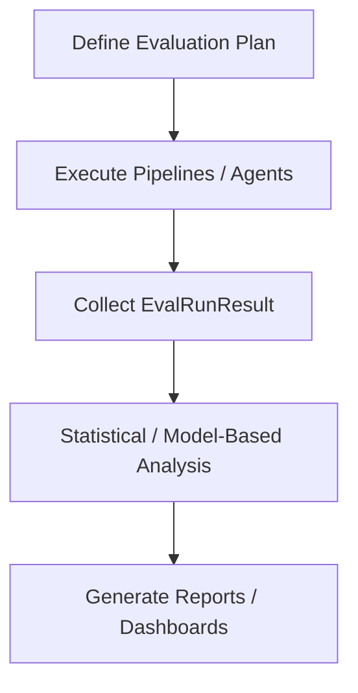
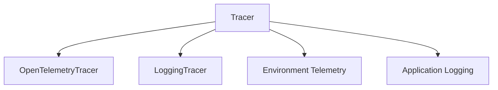
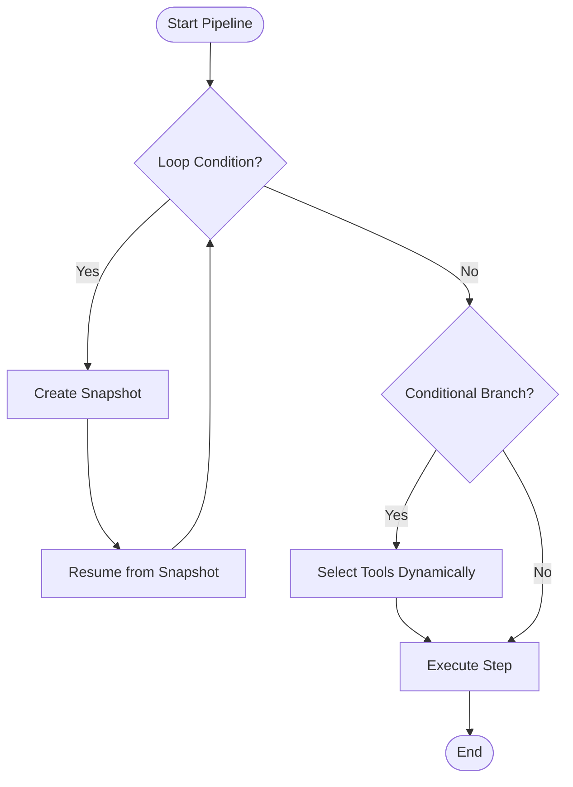
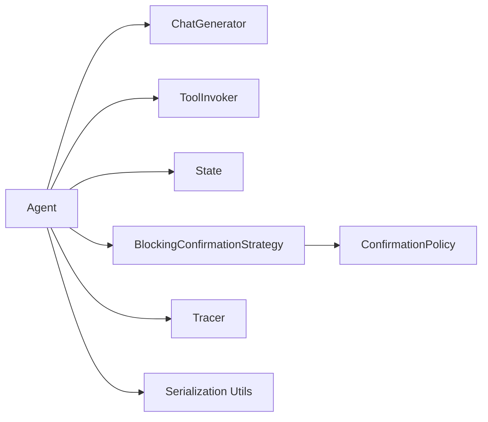

# Advanced Features

<cite>
**Referenced Files in This Document**
- [agent.py](file://haystack/components/agents/agent.py)
- [state/__init__.py](file://haystack/components/agents/state/__init__.py)
- [state/state.py](file://haystack/components/agents/state/state.py)
- [state/state_utils.py](file://haystack/components/agents/state/state_utils.py)
- [tools/__init__.py](file://haystack/tools/__init__.py)
- [tools/tool.py](file://haystack/tools/tool.py)
- [tools/toolset.py](file://haystack/tools/toolset.py)
- [tools/searchable_toolset.py](file://haystack/tools/searchable_toolset.py)
- [tools/from_function.py](file://haystack/tools/from_function.py)
- [tools/component_tool.py](file://haystack/tools/component_tool.py)
- [tools/pipeline_tool.py](file://haystack/tools/pipeline_tool.py)
- [tools/utils.py](file://haystack/tools/utils.py)
- [tools/serde_utils.py](file://haystack/tools/serde_utils.py)
- [human_in_the_loop/__init__.py](file://haystack/human_in_the_loop/__init__.py)
- [human_in_the_loop/dataclasses.py](file://haystack/human_in_the_loop/dataclasses.py)
- [human_in_the_loop/policies.py](file://haystack/human_in_the_loop/policies.py)
- [human_in_the_loop/strategies.py](file://haystack/human_in_the_loop/strategies.py)
- [human_in_the_loop/user_interfaces.py](file://haystack/human_in_the_loop/user_interfaces.py)
- [evaluation/__init__.py](file://haystack/evaluation/__init__.py)
- [evaluation/eval_run_result.py](file://haystack/evaluation/eval_run_result.py)
- [tracing/__init__.py](file://haystack/tracing/__init__.py)
- [tracing/tracer.py](file://haystack/tracing/tracer.py)
- [tracing/opentelemetry.py](file://haystack/tracing/opentelemetry.py)
- [tracing/logging_tracer.py](file://haystack/tracing/logging_tracer.py)
- [tracing/datadog.py](file://haystack/tracing/datadog.py)
- [tracing/utils.py](file://haystack/tracing/utils.py)
- [telemetry/__init__.py](file://haystack/telemetry/__init__.py)
- [telemetry/_telemetry.py](file://haystack/telemetry/_telemetry.py)
- [telemetry/_environment.py](file://haystack/telemetry/_environment.py)
- [core/pipeline/breakpoint.py](file://haystack/core/pipeline/breakpoint.py)
- [core/pipeline/async_pipeline.py](file://haystack/core/pipeline/async_pipeline.py)
- [dataclasses/chat_message.py](file://haystack/dataclasses/chat_message.py)
- [dataclasses/answer.py](file://haystack/dataclasses/answer.py)
- [components/builders/chat_prompt_builder.py](file://haystack/components/builders/chat_prompt_builder.py)
- [components/generators/chat/types.py](file://haystack/components/generators/chat/types.py)
- [components/tools/tool_invoker.py](file://haystack/components/tools/tool_invoker.py)
- [core/errors.py](file://haystack/core/errors.py)
- [logging.py](file://haystack/logging.py)
</cite>

## Table of Contents
1. [Introduction](#introduction)
2. [Project Structure](#project-structure)
3. [Core Components](#core-components)
4. [Architecture Overview](#architecture-overview)
5. [Detailed Component Analysis](#detailed-component-analysis)
6. [Dependency Analysis](#dependency-analysis)
7. [Performance Considerations](#performance-considerations)
8. [Troubleshooting Guide](#troubleshooting-guide)
9. [Conclusion](#conclusion)
10. [Appendices](#appendices)

## Introduction
This document explains Haystack’s advanced features with a focus on the agent framework, evaluation tools, and human-in-the-loop capabilities. It covers agent architecture, memory/state management, tool usage, and state handling; evaluation methodologies; human-in-the-loop debugging workflows; advanced pipeline features such as loops, conditional branching, and dynamic component selection; monitoring and observability; performance optimization; production deployment considerations; and security/access control/compliance topics.

## Project Structure
Haystack organizes advanced features across dedicated modules:
- Agents: orchestration, state, and tool invocation
- Tools: tool definition, toolsets, and wrappers
- Human-in-the-loop: policies, strategies, and user interfaces
- Evaluation: evaluation run results
- Tracing/Telemetry: distributed tracing and telemetry
- Core pipeline: breakpoints and async pipeline support

```mermaid
graph TB
subgraph "Agents"
AG["Agent<br/>agent.py"]
ST["State<br/>state/state.py"]
SU["State Utils<br/>state/state_utils.py"]
end
subgraph "Tools"
TAPI["Tools API<br/>tools/__init__.py"]
TDEF["Tool<br/>tools/tool.py"]
TSET["Toolset<br/>tools/toolset.py"]
TSEARCH["SearchableToolset<br/>tools/searchable_toolset.py"]
TFUNC["From Function<br/>tools/from_function.py"]
TCMP["ComponentTool<br/>tools/component_tool.py"]
TPPL["PipelineTool<br/>tools/pipeline_tool.py"]
TUTIL["Utils<br/>tools/utils.py"]
TSER["Serde Utils<br/>tools/serde_utils.py"]
end
subgraph "Human-in-the-Loop"
HAPI["HITL API<br/>human_in_the_loop/__init__.py"]
HPOL["Policies<br/>human_in_the_loop/policies.py"]
HSTR["Strategies<br/>human_in_the_loop/strategies.py"]
HUI["User Interfaces<br/>human_in_the_loop/user_interfaces.py"]
HCLS["Dataclasses<br/>human_in_the_loop/dataclasses.py"]
end
subgraph "Evaluation"
EVALAPI["Evaluation API<br/>evaluation/__init__.py"]
EVALRES["EvalRunResult<br/>evaluation/eval_run_result.py"]
end
subgraph "Tracing & Telemetry"
TRAPI["Tracing API<br/>tracing/__init__.py"]
TRC["Tracer<br/>tracing/tracer.py"]
TROTEL["OpenTelemetry<br/>tracing/opentelemetry.py"]
TRLOG["Logging Tracer<br/>tracing/logging_tracer.py"]
TRENV["Environment<br/>telemetry/_environment.py"]
TRTELE["Telemetry<br/>telemetry/_telemetry.py"]
end
AG --> ST
AG --> TAPI
AG --> HAPI
AG --> TRAPI
AG --> EVALAPI
TAPI --> TDEF
TAPI --> TSET
TAPI --> TSEARCH
TAPI --> TFUNC
TAPI --> TCMP
TAPI --> TPPL
TAPI --> TUTIL
TAPI --> TSER
HAPI --> HPOL
HAPI --> HSTR
HAPI --> HUI
HAPI --> HCLS
TRAPI --> TRC
TRAPI --> TROTEL
TRAPI --> TRLOG
TRAPI --> TRENV
TRAPI --> TRTELE
```

**Diagram sources**
- [agent.py](file://haystack/components/agents/agent.py#L104-L1235)
- [state/state.py](file://haystack/components/agents/state/state.py)
- [state/state_utils.py](file://haystack/components/agents/state/state_utils.py)
- [tools/__init__.py](file://haystack/tools/__init__.py#L9-L41)
- [tools/tool.py](file://haystack/tools/tool.py)
- [tools/toolset.py](file://haystack/tools/toolset.py)
- [tools/searchable_toolset.py](file://haystack/tools/searchable_toolset.py)
- [tools/from_function.py](file://haystack/tools/from_function.py)
- [tools/component_tool.py](file://haystack/tools/component_tool.py)
- [tools/pipeline_tool.py](file://haystack/tools/pipeline_tool.py)
- [tools/utils.py](file://haystack/tools/utils.py)
- [tools/serde_utils.py](file://haystack/tools/serde_utils.py)
- [human_in_the_loop/__init__.py](file://haystack/human_in_the_loop/__init__.py#L10-L29)
- [human_in_the_loop/policies.py](file://haystack/human_in_the_loop/policies.py#L11-L79)
- [human_in_the_loop/strategies.py](file://haystack/human_in_the_loop/strategies.py#L28-L608)
- [human_in_the_loop/user_interfaces.py](file://haystack/human_in_the_loop/user_interfaces.py)
- [human_in_the_loop/dataclasses.py](file://haystack/human_in_the_loop/dataclasses.py#L9-L73)
- [evaluation/__init__.py](file://haystack/evaluation/__init__.py#L10-L17)
- [evaluation/eval_run_result.py](file://haystack/evaluation/eval_run_result.py)
- [tracing/__init__.py](file://haystack/tracing/__init__.py#L7-L17)
- [tracing/tracer.py](file://haystack/tracing/tracer.py)
- [tracing/opentelemetry.py](file://haystack/tracing/opentelemetry.py)
- [tracing/logging_tracer.py](file://haystack/tracing/logging_tracer.py)
- [telemetry/_environment.py](file://haystack/telemetry/_environment.py)
- [telemetry/_telemetry.py](file://haystack/telemetry/_telemetry.py)

**Section sources**
- [agent.py](file://haystack/components/agents/agent.py#L104-L1235)
- [tools/__init__.py](file://haystack/tools/__init__.py#L9-L41)
- [human_in_the_loop/__init__.py](file://haystack/human_in_the_loop/__init__.py#L10-L29)
- [evaluation/__init__.py](file://haystack/evaluation/__init__.py#L10-L17)
- [tracing/__init__.py](file://haystack/tracing/__init__.py#L7-L17)

## Core Components
- Agent orchestrates LLM generations and tool invocations, manages state, and supports human-in-the-loop confirmations and snapshots.
- Tools and Toolsets define executable capabilities with typed parameters and discovery helpers.
- Human-in-the-loop provides policies, strategies, and UIs to gate tool execution with user consent.
- Evaluation offers structured results for benchmarking and quality assessment.
- Tracing and Telemetry provide observability and environment-aware telemetry.

**Section sources**
- [agent.py](file://haystack/components/agents/agent.py#L104-L1235)
- [tools/tool.py](file://haystack/tools/tool.py)
- [tools/toolset.py](file://haystack/tools/toolset.py)
- [human_in_the_loop/policies.py](file://haystack/human_in_the_loop/policies.py#L11-L79)
- [human_in_the_loop/strategies.py](file://haystack/human_in_the_loop/strategies.py#L28-L608)
- [evaluation/eval_run_result.py](file://haystack/evaluation/eval_run_result.py)
- [tracing/tracer.py](file://haystack/tracing/tracer.py)
- [telemetry/_telemetry.py](file://haystack/telemetry/_telemetry.py)

## Architecture Overview
The agent framework integrates LLM generation, tool invocation, state management, and human-in-the-loop controls. It leverages pipeline breakpoints for snapshots and supports streaming callbacks for incremental feedback.

**Diagram sources**
- [agent.py](file://haystack/components/agents/agent.py#L741-L800)
- [components/tools/tool_invoker.py](file://haystack/components/tools/tool_invoker.py)
- [state/state.py](file://haystack/components/agents/state/state.py)
- [components/generators/chat/types.py](file://haystack/components/generators/chat/types.py)

## Detailed Component Analysis

### Agent Framework
The Agent component orchestrates conversations with an LLM, manages state, selects tools, and handles human-in-the-loop confirmations. It supports:
- Dynamic prompts with Jinja2 templates and required variables
- Exit conditions (text generation or tool completion)
- Streaming callbacks
- Snapshots and breakpoints for interactive debugging
- Tool selection by name or subset at runtime

Key implementation aspects:
- Execution context encapsulates state, component visits, and inputs for chat generator and tool invoker.
- State schema defines typed fields and handlers for merging/appending values.
- Tool selection validates requested tool names against configured tools.
- Human-in-the-loop strategies can block execution to gather user decisions.

**Diagram sources**
- [agent.py](file://haystack/components/agents/agent.py#L104-L1235)
- [state/state.py](file://haystack/components/agents/state/state.py)
- [state/state_utils.py](file://haystack/components/agents/state/state_utils.py)
- [tools/tool.py](file://haystack/tools/tool.py)
- [components/tools/tool_invoker.py](file://haystack/components/tools/tool_invoker.py)
- [human_in_the_loop/strategies.py](file://haystack/human_in_the_loop/strategies.py#L28-L608)
- [human_in_the_loop/policies.py](file://haystack/human_in_the_loop/policies.py#L11-L79)

**Section sources**
- [agent.py](file://haystack/components/agents/agent.py#L228-L357)
- [agent.py](file://haystack/components/agents/agent.py#L504-L621)
- [agent.py](file://haystack/components/agents/agent.py#L660-L724)
- [agent.py](file://haystack/components/agents/agent.py#L741-L800)
- [state/state.py](file://haystack/components/agents/state/state.py)
- [state/state_utils.py](file://haystack/components/agents/state/state_utils.py)
- [human_in_the_loop/strategies.py](file://haystack/human_in_the_loop/strategies.py#L265-L347)

### Memory Management and State Handling
- State schema defines typed fields and merge handlers (e.g., merging lists).
- State supports set/get operations and integrates with tool invocations.
- Agent initializes state from scratch or from snapshots, preserving component visits and inputs.

**Diagram sources**
- [agent.py](file://haystack/components/agents/agent.py#L300-L327)
- [agent.py](file://haystack/components/agents/agent.py#L504-L621)
- [state/state.py](file://haystack/components/agents/state/state.py)
- [state/state_utils.py](file://haystack/components/agents/state/state_utils.py)

**Section sources**
- [agent.py](file://haystack/components/agents/agent.py#L295-L327)
- [state/state.py](file://haystack/components/agents/state/state.py)
- [state/state_utils.py](file://haystack/components/agents/state/state_utils.py)

### Tool Usage and Dynamic Selection
- Tools can be defined as functions or as Tool objects with JSON Schema parameters.
- Toolsets aggregate tools; searchable toolsets enable discovery.
- Agent supports selecting tools by name at runtime and validates against configured tools.

**Diagram sources**
- [agent.py](file://haystack/components/agents/agent.py#L622-L658)
- [tools/tool.py](file://haystack/tools/tool.py)
- [tools/toolset.py](file://haystack/tools/toolset.py)
- [tools/searchable_toolset.py](file://haystack/tools/searchable_toolset.py)
- [tools/from_function.py](file://haystack/tools/from_function.py)
- [tools/component_tool.py](file://haystack/tools/component_tool.py)
- [tools/pipeline_tool.py](file://haystack/tools/pipeline_tool.py)
- [tools/utils.py](file://haystack/tools/utils.py)
- [tools/serde_utils.py](file://haystack/tools/serde_utils.py)

**Section sources**
- [agent.py](file://haystack/components/agents/agent.py#L622-L658)
- [tools/__init__.py](file://haystack/tools/__init__.py#L9-L41)

### Human-in-the-Loop Capabilities
- Policies decide whether to ask for confirmation (AlwaysAsk, AskOnce, NeverAsk).
- Strategies coordinate UI and policy to produce ToolExecutionDecision.
- Dataclasses represent user confirmation results and tool execution decisions.
- Strategies can inject streaming callbacks into tool arguments and update chat history accordingly.

**Diagram sources**
- [human_in_the_loop/strategies.py](file://haystack/human_in_the_loop/strategies.py#L28-L171)
- [human_in_the_loop/policies.py](file://haystack/human_in_the_loop/policies.py#L11-L79)
- [human_in_the_loop/dataclasses.py](file://haystack/human_in_the_loop/dataclasses.py#L9-L73)
- [human_in_the_loop/user_interfaces.py](file://haystack/human_in_the_loop/user_interfaces.py)
- [components/tools/tool_invoker.py](file://haystack/components/tools/tool_invoker.py)

**Section sources**
- [human_in_the_loop/strategies.py](file://haystack/human_in_the_loop/strategies.py#L265-L347)
- [human_in_the_loop/policies.py](file://haystack/human_in_the_loop/policies.py#L11-L79)
- [human_in_the_loop/dataclasses.py](file://haystack/human_in_the_loop/dataclasses.py#L9-L73)

### Evaluation Methodologies
- Evaluation results are represented by a structured run result type.
- Statistical and model-based evaluation approaches can be built around this result abstraction.

**Diagram sources**
- [evaluation/eval_run_result.py](file://haystack/evaluation/eval_run_result.py)
- [evaluation/__init__.py](file://haystack/evaluation/__init__.py#L10-L17)

**Section sources**
- [evaluation/eval_run_result.py](file://haystack/evaluation/eval_run_result.py)
- [evaluation/__init__.py](file://haystack/evaluation/__init__.py#L10-L17)

### Monitoring and Observability
- Tracing exposes a tracer with spans for agent runs and component nesting.
- OpenTelemetry and logging tracers are available.
- Telemetry captures environment metadata and can be toggled.

**Diagram sources**
- [tracing/tracer.py](file://haystack/tracing/tracer.py)
- [tracing/opentelemetry.py](file://haystack/tracing/opentelemetry.py)
- [tracing/logging_tracer.py](file://haystack/tracing/logging_tracer.py)
- [telemetry/_environment.py](file://haystack/telemetry/_environment.py)
- [telemetry/_telemetry.py](file://haystack/telemetry/_telemetry.py)
- [logging.py](file://haystack/logging.py)

**Section sources**
- [tracing/tracer.py](file://haystack/tracing/tracer.py)
- [tracing/opentelemetry.py](file://haystack/tracing/opentelemetry.py)
- [tracing/logging_tracer.py](file://haystack/tracing/logging_tracer.py)
- [telemetry/_telemetry.py](file://haystack/telemetry/_telemetry.py)
- [telemetry/_environment.py](file://haystack/telemetry/_environment.py)
- [logging.py](file://haystack/logging.py)

### Advanced Pipeline Features
- Loops and conditional branching can be implemented using Agent breakpoints and snapshots.
- Dynamic component selection is supported via runtime tool selection and prompt variables.
- Streaming callbacks enable incremental feedback during generation and tool execution.

**Diagram sources**
- [core/pipeline/breakpoint.py](file://haystack/core/pipeline/breakpoint.py)
- [agent.py](file://haystack/components/agents/agent.py#L741-L800)
- [components/builders/chat_prompt_builder.py](file://haystack/components/builders/chat_prompt_builder.py)
- [components/generators/chat/types.py](file://haystack/components/generators/chat/types.py)

**Section sources**
- [core/pipeline/breakpoint.py](file://haystack/core/pipeline/breakpoint.py)
- [agent.py](file://haystack/components/agents/agent.py#L504-L621)
- [components/builders/chat_prompt_builder.py](file://haystack/components/builders/chat_prompt_builder.py)

## Dependency Analysis
The agent depends on:
- LLM chat generator supporting tools
- Tool invoker for executing tools
- State for memory
- Human-in-the-loop strategies and policies
- Tracing for observability
- Serialization utilities for persistence

**Diagram sources**
- [agent.py](file://haystack/components/agents/agent.py#L10-L60)
- [components/tools/tool_invoker.py](file://haystack/components/tools/tool_invoker.py)
- [state/state.py](file://haystack/components/agents/state/state.py)
- [human_in_the_loop/strategies.py](file://haystack/human_in_the_loop/strategies.py#L28-L608)
- [human_in_the_loop/policies.py](file://haystack/human_in_the_loop/policies.py#L11-L79)
- [tracing/tracer.py](file://haystack/tracing/tracer.py)
- [tools/serde_utils.py](file://haystack/tools/serde_utils.py)

**Section sources**
- [agent.py](file://haystack/components/agents/agent.py#L10-L60)
- [tools/serde_utils.py](file://haystack/tools/serde_utils.py)

## Performance Considerations
- Warm-up: call warm_up on generator and tool invoker to reduce first-use latency.
- Streaming callbacks: enable incremental feedback and early termination signals.
- Tool selection: limit tool sets at runtime to reduce planning overhead.
- State merges: choose efficient merge handlers (e.g., list merging) to minimize allocations.
- Tracing overhead: enable only in development or selectively in production.

[No sources needed since this section provides general guidance]

## Troubleshooting Guide
Common issues and remedies:
- Invalid exit conditions or tool names: ensure exit conditions match tool names or “text”.
- Missing tools at runtime: configure tools at initialization or pass valid tool names.
- Prompt variable conflicts: avoid overlapping variable names with state schema or run parameters.
- Tool invocation failures: configure raise_on_tool_invocation_failure or handle exceptions gracefully.
- Human-in-the-loop mismatches: ensure tool_call_id is present when multiple identical tool calls exist.

**Section sources**
- [agent.py](file://haystack/components/agents/agent.py#L286-L294)
- [agent.py](file://haystack/components/agents/agent.py#L538-L556)
- [agent.py](file://haystack/components/agents/agent.py#L558-L582)
- [human_in_the_loop/strategies.py](file://haystack/human_in_the_loop/strategies.py#L518-L524)

## Conclusion
Haystack’s advanced features provide a robust foundation for building intelligent agents with strong memory/state management, flexible tool usage, and human-in-the-loop controls. Combined with evaluation, tracing, and telemetry, teams can build, monitor, and iterate on complex conversational systems with confidence.

[No sources needed since this section summarizes without analyzing specific files]

## Appendices

### Practical Examples and Integration Patterns
- Agent with templated prompts and tool selection: see Agent usage examples in the Agent component documentation.
- Human-in-the-loop with AskOnce policy and console UI: combine policies and strategies with user interfaces.
- Evaluation-driven iteration: collect EvaluationRunResult and derive metrics/statistics for model-based evaluation.

**Section sources**
- [agent.py](file://haystack/components/agents/agent.py#L114-L224)
- [human_in_the_loop/policies.py](file://haystack/human_in_the_loop/policies.py#L41-L79)
- [human_in_the_loop/strategies.py](file://haystack/human_in_the_loop/strategies.py#L28-L171)
- [evaluation/eval_run_result.py](file://haystack/evaluation/eval_run_result.py)

### Security, Access Control, and Compliance
- Restrict tool execution via human-in-the-loop policies and strategies.
- Enforce parameter validation using tool JSON Schema definitions.
- Audit tool usage and agent decisions via tracing and logging.
- Configure telemetry and environment metadata carefully in production.

**Section sources**
- [tools/tool.py](file://haystack/tools/tool.py)
- [human_in_the_loop/strategies.py](file://haystack/human_in_the_loop/strategies.py#L28-L171)
- [tracing/tracer.py](file://haystack/tracing/tracer.py)
- [telemetry/_environment.py](file://haystack/telemetry/_environment.py)