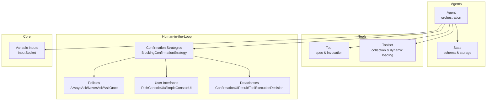
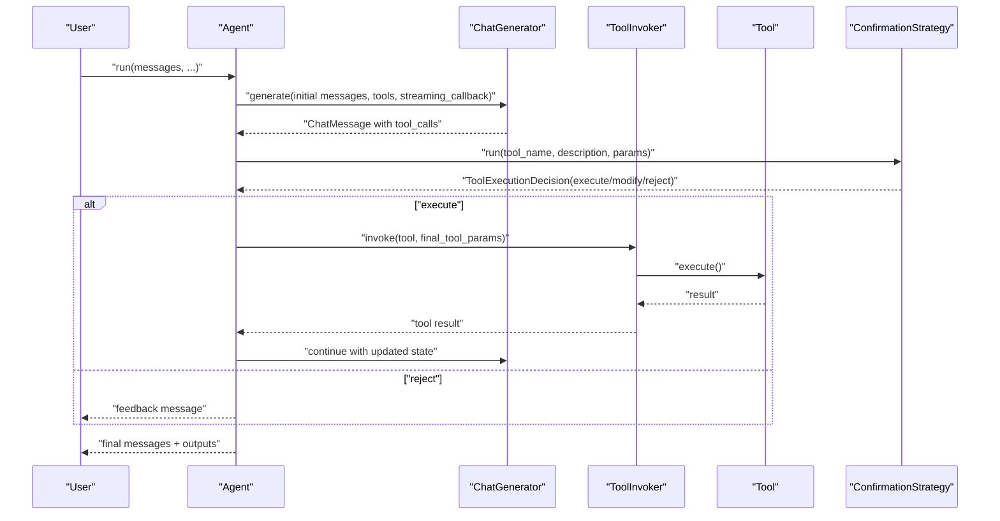
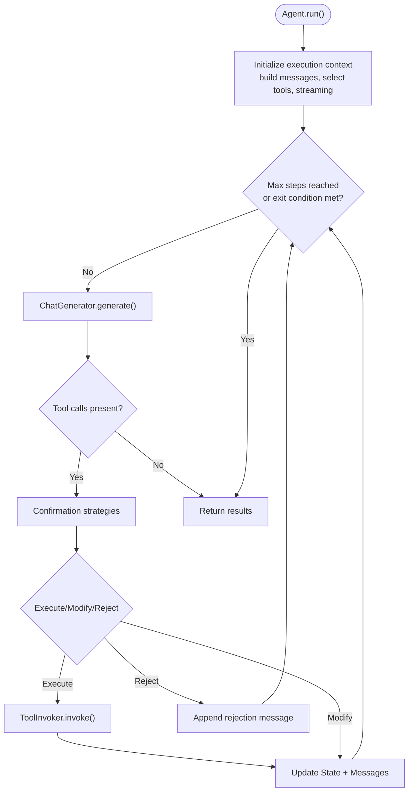
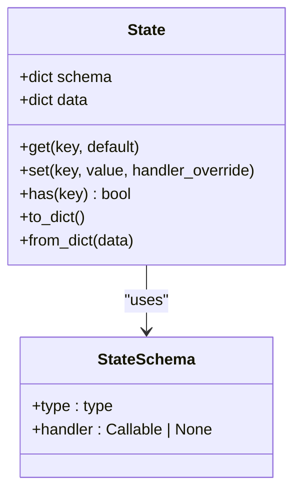
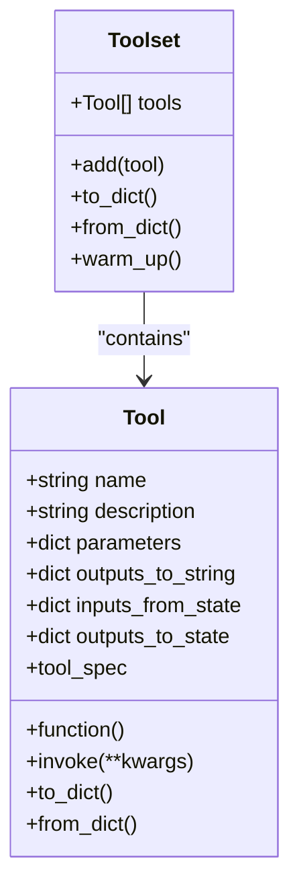
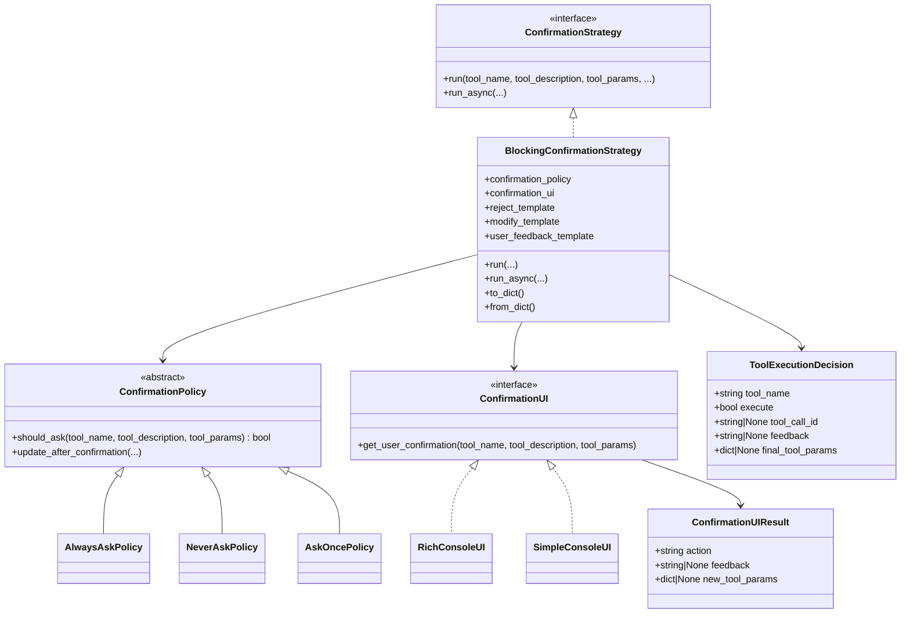
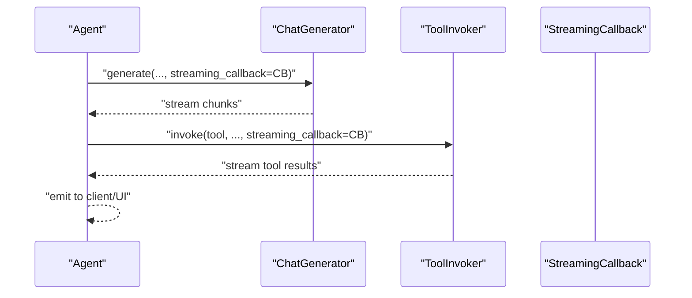
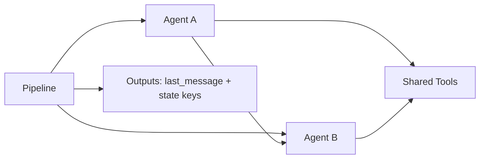
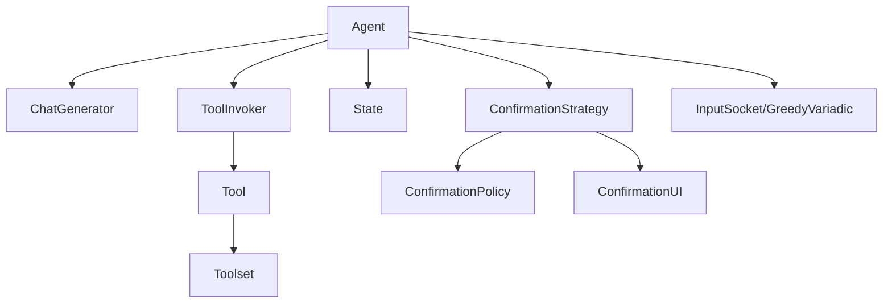

# Advanced Agent Features

<cite>
**Referenced Files in This Document**
- [agent.py](file://haystack/components/agents/agent.py)
- [state.py](file://haystack/components/agents/state/state.py)
- [tool.py](file://haystack/tools/tool.py)
- [toolset.py](file://haystack/tools/toolset.py)
- [strategies.py](file://haystack/human_in_the_loop/strategies.py)
- [policies.py](file://haystack/human_in_the_loop/policies.py)
- [user_interfaces.py](file://haystack/human_in_the_loop/user_interfaces.py)
- [dataclasses.py](file://haystack/human_in_the_loop/dataclasses.py)
- [types.py](file://haystack/core/component/types.py)
- [add-generation-kwargs-to-agent-9600a6c1e6bc069b.yaml](file://releasenotes/notesc/notes/add-generation-kwargs-to-agent-9600a6c1e6bc069b.yaml)
</cite>

## Table of Contents
1. [Introduction](#introduction)
2. [Project Structure](#project-structure)
3. [Core Components](#core-components)
4. [Architecture Overview](#architecture-overview)
5. [Detailed Component Analysis](#detailed-component-analysis)
6. [Dependency Analysis](#dependency-analysis)
7. [Performance Considerations](#performance-considerations)
8. [Troubleshooting Guide](#troubleshooting-guide)
9. [Conclusion](#conclusion)
10. [Appendices](#appendices)

## Introduction
This document explains advanced agent capabilities and integration patterns in the repository, focusing on:
- Human-in-the-loop confirmation strategies (blocking and non-blocking patterns)
- Agent composition, chaining, and multi-agent systems
- Advanced agent configurations: custom exit conditions, dynamic tool selection, conditional routing
- Streaming, real-time response handling, and interactive workflows
- Integrations with external systems, webhooks, and real-time channels
- Practical architectures, complex workflows, and enterprise-grade implementations
- Performance optimization, scaling, and production deployment patterns
- Migration strategies from other agent frameworks and integration with existing systems

## Project Structure
The advanced agent features are implemented across several modules:
- Agent orchestration and lifecycle: haystack/components/agents/agent.py
- Agent state management: haystack/components/agents/state/state.py
- Tooling primitives: haystack/tools/tool.py, haystack/tools/toolset.py
- Human-in-the-loop confirmation: haystack/human_in_the_loop/strategies.py, policies.py, user_interfaces.py, dataclasses.py
- Component I/O and variadic inputs: haystack/core/component/types.py
- Release note for advanced generation kwargs: releasenotes/notes/add-generation-kwargs-to-agent-9600a6c1e6bc069b.yaml

**Diagram sources**
- [agent.py](file://haystack/components/agents/agent.py#L104-L1235)
- [state.py](file://haystack/components/agents/state/state.py#L82-L208)
- [tool.py](file://haystack/tools/tool.py#L18-L405)
- [toolset.py](file://haystack/tools/toolset.py#L13-L365)
- [strategies.py](file://haystack/human_in_the_loop/strategies.py#L28-L608)
- [policies.py](file://haystack/human_in_the_loop/policies.py#L11-L79)
- [user_interfaces.py](file://haystack/human_in_the_loop/user_interfaces.py#L22-L213)
- [dataclasses.py](file://haystack/human_in_the_loop/dataclasses.py#L9-L73)
- [types.py](file://haystack/core/component/types.py#L36-L128)

**Section sources**
- [agent.py](file://haystack/components/agents/agent.py#L104-L1235)
- [state.py](file://haystack/components/agents/state/state.py#L82-L208)
- [tool.py](file://haystack/tools/tool.py#L18-L405)
- [toolset.py](file://haystack/tools/toolset.py#L13-L365)
- [strategies.py](file://haystack/human_in_the_loop/strategies.py#L28-L608)
- [policies.py](file://haystack/human_in_the_loop/policies.py#L11-L79)
- [user_interfaces.py](file://haystack/human_in_the_loop/user_interfaces.py#L22-L213)
- [dataclasses.py](file://haystack/human_in_the_loop/dataclasses.py#L9-L73)
- [types.py](file://haystack/core/component/types.py#L36-L128)

## Core Components
- Agent: orchestrates LLM generation, tool invocation, state updates, and exit conditions. Supports streaming callbacks, dynamic tool selection, and runtime snapshots/breakpoints.
- State: typed schema-backed storage for messages and arbitrary context, with configurable merge handlers.
- Tool and Toolset: structured tool definitions with JSON schema parameters, optional state mapping, and serialization support.
- Human-in-the-loop: confirmation strategies with policies and UIs, producing ToolExecutionDecision objects that drive conditional routing.

Key advanced capabilities:
- Custom exit conditions: “text” or specific tool names
- Dynamic tool selection: choose subsets at runtime
- Streaming passthrough: propagate streaming callbacks to tools
- Snapshots and breakpoints: pause/resume agent execution
- Generation kwargs: fine-grained control over generation parameters

**Section sources**
- [agent.py](file://haystack/components/agents/agent.py#L228-L357)
- [state.py](file://haystack/components/agents/state/state.py#L82-L208)
- [tool.py](file://haystack/tools/tool.py#L18-L405)
- [toolset.py](file://haystack/tools/toolset.py#L13-L365)
- [strategies.py](file://haystack/human_in_the_loop/strategies.py#L28-L608)
- [dataclasses.py](file://haystack/human_in_the_loop/dataclasses.py#L9-L73)
- [add-generation-kwargs-to-agent-9600a6c1e6bc069b.yaml](file://releasenotes/notesc/notes/add-generation-kwargs-to-agent-9600a6c1e6bc069b.yaml#L1-L4)

## Architecture Overview
The Agent composes a ChatGenerator, optional ToolInvoker, and a State container. Tools can be provided as a list or Toolset. Human-in-the-loop confirmation strategies can be attached per tool or group of tools. Streaming callbacks can be injected into both the generator and tool invoker.

**Diagram sources**
- [agent.py](file://haystack/components/agents/agent.py#L741-L1235)
- [strategies.py](file://haystack/human_in_the_loop/strategies.py#L28-L608)
- [tool.py](file://haystack/tools/tool.py#L261-L271)

## Detailed Component Analysis

### Agent Orchestration and Lifecycle
- Initialization validates tool support, exit conditions, and state schema. It sets up prompt builders and registers required variables.
- Execution context encapsulates state, component visits, and inputs for generator and invoker.
- Dynamic tool selection allows choosing tools by name at runtime.
- Streaming callback injection supports real-time response emission.
- Snapshots and breakpoints enable pause/resume and debugging.
- Generation kwargs allow overriding generation parameters at runtime.

**Diagram sources**
- [agent.py](file://haystack/components/agents/agent.py#L741-L1235)
- [strategies.py](file://haystack/human_in_the_loop/strategies.py#L265-L608)

**Section sources**
- [agent.py](file://haystack/components/agents/agent.py#L228-L357)
- [agent.py](file://haystack/components/agents/agent.py#L504-L820)
- [agent.py](file://haystack/components/agents/agent.py#L741-L1235)

### State Management
- State schema defines typed keys and merge handlers. Defaults include a “messages” list with a merge handler.
- Serialization/deserialization preserves schema and data.
- Handlers control how values are merged (lists vs. replacement).

**Diagram sources**
- [state.py](file://haystack/components/agents/state/state.py#L82-L208)

**Section sources**
- [state.py](file://haystack/components/agents/state/state.py#L56-L80)
- [state.py](file://haystack/components/agents/state/state.py#L115-L142)
- [state.py](file://haystack/components/agents/state/state.py#L191-L208)

### Tooling Primitives
- Tool: name, description, JSON schema parameters, function, optional state mapping, and output formatting.
- Toolset: collection of tools; supports dynamic loading and serialization of descriptors.
- Validation ensures correctness of schemas, inputs/outputs, and state mappings.

**Diagram sources**
- [tool.py](file://haystack/tools/tool.py#L18-L405)
- [toolset.py](file://haystack/tools/toolset.py#L13-L365)

**Section sources**
- [tool.py](file://haystack/tools/tool.py#L18-L405)
- [toolset.py](file://haystack/tools/toolset.py#L13-L365)

### Human-in-the-Loop: Confirmation Strategies
- BlockingConfirmationStrategy: blocks execution to gather user confirmation, supports templates for feedback, and produces ToolExecutionDecision.
- Policies: AlwaysAskPolicy, NeverAskPolicy, AskOncePolicy with optional stateful memory.
- User Interfaces: RichConsoleUI and SimpleConsoleUI for CLI-based confirmation; thread-safe locking for concurrency.
- Dataclasses: ConfirmationUIResult and ToolExecutionDecision represent UI outcomes and execution decisions.

**Diagram sources**
- [strategies.py](file://haystack/human_in_the_loop/strategies.py#L28-L608)
- [policies.py](file://haystack/human_in_the_loop/policies.py#L11-L79)
- [user_interfaces.py](file://haystack/human_in_the_loop/user_interfaces.py#L22-L213)
- [dataclasses.py](file://haystack/human_in_the_loop/dataclasses.py#L9-L73)

**Section sources**
- [strategies.py](file://haystack/human_in_the_loop/strategies.py#L28-L202)
- [policies.py](file://haystack/human_in_the_loop/policies.py#L11-L79)
- [user_interfaces.py](file://haystack/human_in_the_loop/user_interfaces.py#L22-L213)
- [dataclasses.py](file://haystack/human_in_the_loop/dataclasses.py#L9-L73)

### Streaming, Real-Time Responses, and Interactive Workflows
- Streaming callback injection into both ChatGenerator and ToolInvoker enables real-time emissions.
- enable_streaming_callback_passthrough ensures callbacks are forwarded to tools when applicable.
- Interactive workflows can be built around ToolExecutionDecision feedback and modified parameters.

**Diagram sources**
- [agent.py](file://haystack/components/agents/agent.py#L593-L620)
- [strategies.py](file://haystack/human_in_the_loop/strategies.py#L227-L262)

**Section sources**
- [agent.py](file://haystack/components/agents/agent.py#L593-L620)
- [strategies.py](file://haystack/human_in_the_loop/strategies.py#L227-L262)

### Agent Composition, Chaining, and Multi-Agent Systems
- Agent can be embedded in pipelines; its outputs include “last_message” and any state-defined keys.
- Variadic inputs support flexible composition with greedy or lazy variadic sockets.
- Tool selection can be dynamic per run, enabling conditional routing based on inputs.

**Diagram sources**
- [agent.py](file://haystack/components/agents/agent.py#L317-L326)
- [types.py](file://haystack/core/component/types.py#L36-L128)

**Section sources**
- [agent.py](file://haystack/components/agents/agent.py#L317-L326)
- [types.py](file://haystack/core/component/types.py#L36-L128)

### Advanced Configurations
- Exit conditions: “text” or specific tool names; validated against available tools.
- Dynamic tool selection: choose by name at runtime; validation ensures tool availability.
- Generation kwargs: override generation parameters per run.
- State schema: define and evolve context fields with custom handlers.

**Section sources**
- [agent.py](file://haystack/components/agents/agent.py#L285-L293)
- [agent.py](file://haystack/components/agents/agent.py#L622-L658)
- [add-generation-kwargs-to-agent-9600a6c1e6bc069b.yaml](file://releasenotes/notesc/notes/add-generation-kwargs-to-agent-9600a6c1e6bc069b.yaml#L1-L4)

## Dependency Analysis
- Agent depends on ChatGenerator, ToolInvoker, State, and optional prompt builders.
- ToolInvoker depends on Tool/Toolset and streaming callback forwarding.
- Human-in-the-loop strategies depend on policies and UIs, producing decisions consumed by Agent orchestration.
- Variadic input types enable flexible pipeline composition.

**Diagram sources**
- [agent.py](file://haystack/components/agents/agent.py#L10-L60)
- [tool.py](file://haystack/tools/tool.py#L18-L405)
- [toolset.py](file://haystack/tools/toolset.py#L13-L365)
- [strategies.py](file://haystack/human_in_the_loop/strategies.py#L28-L608)
- [types.py](file://haystack/core/component/types.py#L36-L128)

**Section sources**
- [agent.py](file://haystack/components/agents/agent.py#L10-L60)
- [tool.py](file://haystack/tools/tool.py#L18-L405)
- [toolset.py](file://haystack/tools/toolset.py#L13-L365)
- [strategies.py](file://haystack/human_in_the_loop/strategies.py#L28-L608)
- [types.py](file://haystack/core/component/types.py#L36-L128)

## Performance Considerations
- Warm-up: pre-initialize generators and tool invokers to reduce latency.
- Streaming passthrough: minimize buffering by forwarding callbacks to tools.
- Tool selection: limit tool sets at runtime to reduce planning overhead.
- State handlers: prefer efficient merge handlers for large lists.
- Breakpoints/snapshots: use sparingly in production; enable only for debugging or controlled recovery.

[No sources needed since this section provides general guidance]

## Troubleshooting Guide
- Invalid exit conditions: ensure conditions match either “text” or tool names.
- Duplicate tool names: avoid duplicates across Tool and Toolset.
- Missing tool_call_id: when multiple identical tool calls occur, include IDs to disambiguate decisions.
- Tool invocation failures: configure raise_on_tool_invocation_failure or handle exceptions gracefully.
- Prompt variable conflicts: ensure prompt variables do not overlap with state schema or run parameters.

**Section sources**
- [agent.py](file://haystack/components/agents/agent.py#L285-L293)
- [tool.py](file://haystack/tools/tool.py#L312-L325)
- [strategies.py](file://haystack/human_in_the_loop/strategies.py#L518-L523)
- [agent.py](file://haystack/components/agents/agent.py#L395-L404)

## Conclusion
The repository provides a robust foundation for advanced agent features:
- Flexible orchestration with custom exit conditions, dynamic tool selection, and streaming
- Strong human-in-the-loop controls with blocking confirmation strategies and customizable policies/UIs
- Extensible tooling via Tool and Toolset with serialization and dynamic loading
- Production-ready patterns via warm-up, snapshots/breakpoints, and variadic inputs

These capabilities enable building complex, interactive, and enterprise-grade agent systems integrated with external systems and real-time channels.

[No sources needed since this section summarizes without analyzing specific files]

## Appendices

### Practical Architectures and Workflows
- Multi-agent orchestration: chain Agents with shared Toolsets and State schemas; route based on ToolExecutionDecision feedback.
- Conditional routing: use AskOncePolicy to cache confirmations; leverage ToolExecutionDecision to rerun with modified parameters.
- Enterprise-grade deployments: enable streaming callbacks, use snapshots for resilience, and restrict tool sets per tenant/environment.

[No sources needed since this section provides general guidance]

### Migration and Integration Notes
- From other frameworks: map tool schemas to Tool.parameters and Tool.function; wire ChatGenerator support for tools; adopt Toolset for dynamic tool discovery.
- Existing systems: integrate via Tool outputs_to_string and outputs_to_state to align with legacy formats and state models.

[No sources needed since this section provides general guidance]