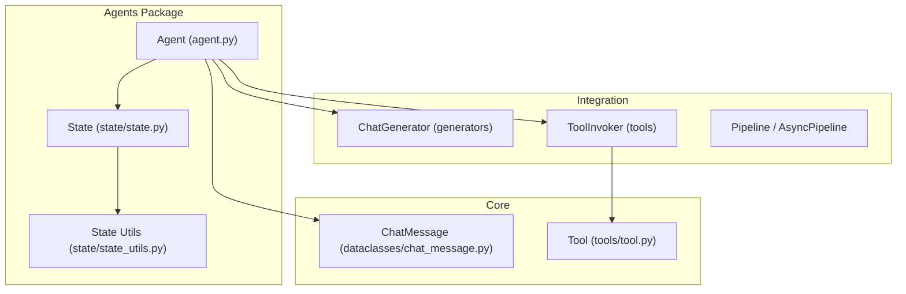
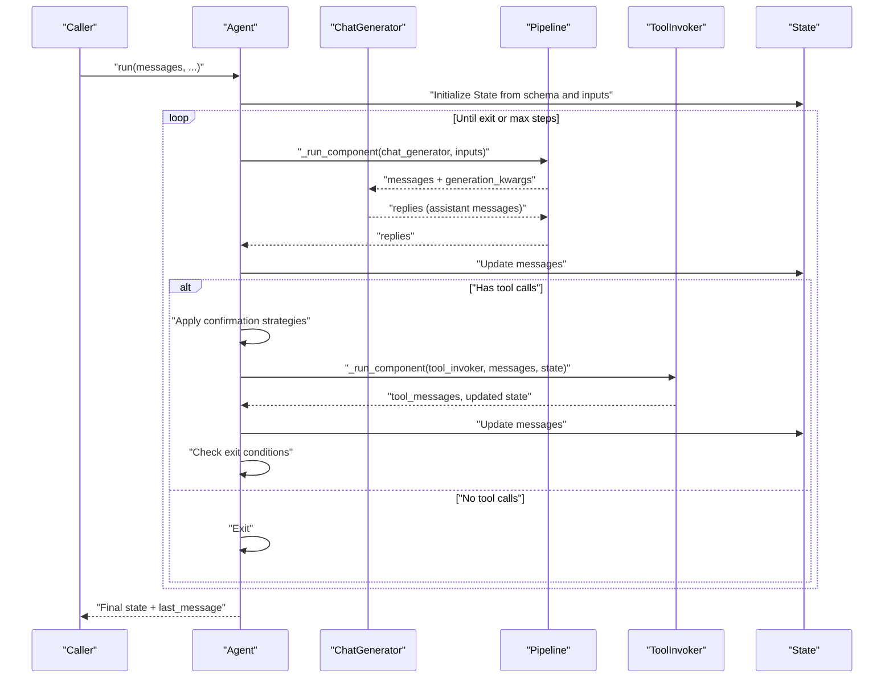
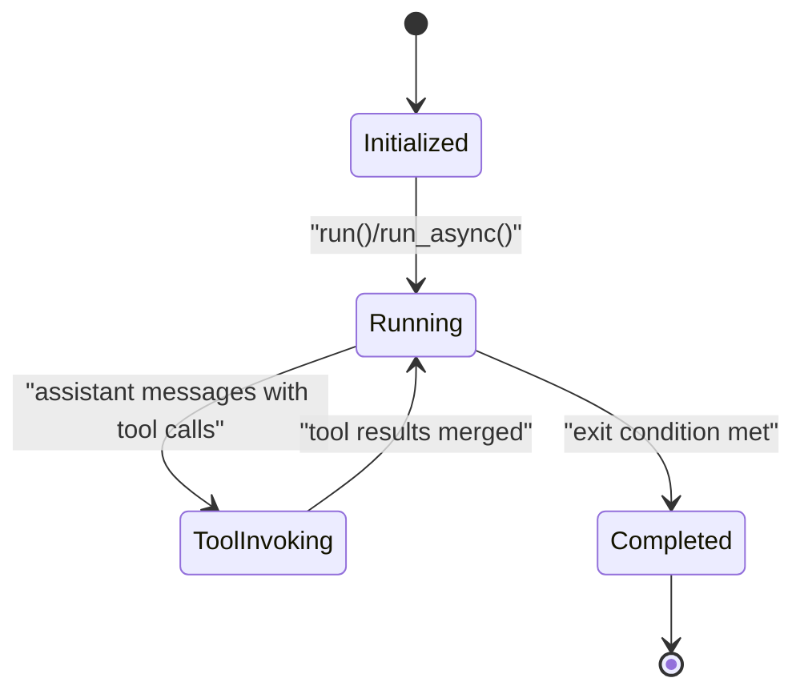
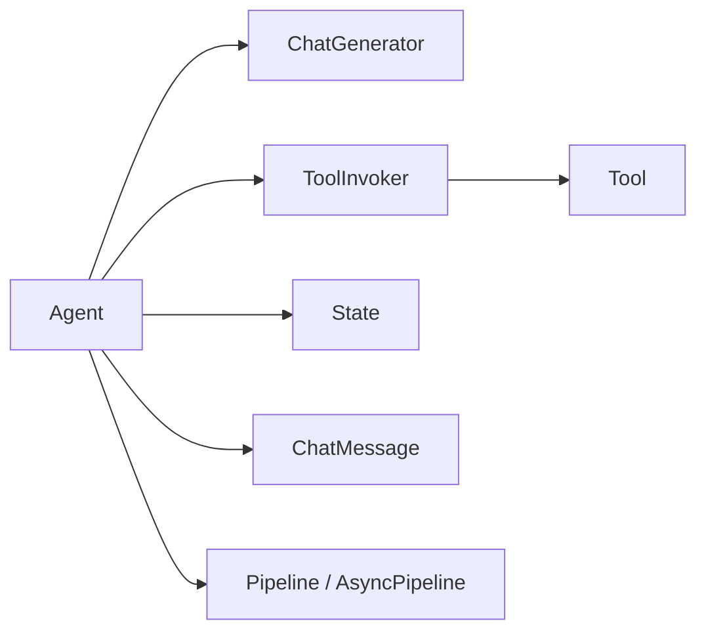

# Agent Core

<cite>
**Referenced Files in This Document**
- [agent.py](file://haystack/components/agents/agent.py)
- [state.py](file://haystack/components/agents/state/state.py)
- [state_utils.py](file://haystack/components/agents/state/state_utils.py)
- [__init__.py](file://haystack/components/agents/__init__.py)
- [chat_message.py](file://haystack/dataclasses/chat_message.py)
- [tool.py](file://haystack/tools/tool.py)
- [test_agent.py](file://test/components/agents/test_agent.py)
- [test_agent_breakpoints.py](file://test/components/agents/test_agent_breakpoints.py)
</cite>

## Table of Contents
1. [Introduction](#introduction)
2. [Project Structure](#project-structure)
3. [Core Components](#core-components)
4. [Architecture Overview](#architecture-overview)
5. [Detailed Component Analysis](#detailed-component-analysis)
6. [Dependency Analysis](#dependency-analysis)
7. [Performance Considerations](#performance-considerations)
8. [Troubleshooting Guide](#troubleshooting-guide)
9. [Conclusion](#conclusion)
10. [Appendices](#appendices)

## Introduction
This document provides a comprehensive guide to the Agent Core component in the Haystack Agents subsystem. It focuses on the fundamental Agent class implementation, including constructor parameters, initialization workflow, parameter validation, configuration options, and the run method execution flow. It also covers agent lifecycle, streaming callbacks, breakpoint management, practical configuration examples, debugging capabilities, error handling, performance considerations, and the Agent’s relationship to the broader Haystack ecosystem.

## Project Structure
The Agent Core resides in the agents package and integrates with several core subsystems:
- Agent class and execution engine
- State management for shared runtime data
- Data classes for chat messages and tool calls
- Tool definitions and invocation
- Tests validating behavior, snapshots, and breakpoints

**Diagram sources**
- [agent.py](file://haystack/components/agents/agent.py#L104-L1235)
- [state.py](file://haystack/components/agents/state/state.py#L82-L208)
- [state_utils.py](file://haystack/components/agents/state/state_utils.py)
- [chat_message.py](file://haystack/dataclasses/chat_message.py#L22-L200)
- [tool.py](file://haystack/tools/tool.py#L18-L200)

**Section sources**
- [__init__.py](file://haystack/components/agents/__init__.py#L10-L17)

## Core Components
This section outlines the primary building blocks of the Agent Core and their responsibilities.

- Agent: Orchestrates message processing, tool invocation, exit conditions, and lifecycle management. It integrates a ChatGenerator and optionally a ToolInvoker, manages State, and supports streaming and breakpoints.
- State: A typed, schema-driven container for shared data across the Agent and its tools. It ensures type safety and controlled merging of values.
- ChatMessage and ToolCall: Data structures representing conversational turns and tool call results, enabling structured communication between components.
- Tool: A typed wrapper around callable functions with JSON Schema parameters, supporting mapping inputs from state and outputs to state.

Key responsibilities:
- Agent: Initialization, parameter validation, run/run_async loops, exit condition checks, snapshot creation, and error propagation.
- State: Schema validation, default handlers, get/set semantics, serialization/deserialization.
- Tool: Parameter validation, input/output mapping, and invocation constraints.

**Section sources**
- [agent.py](file://haystack/components/agents/agent.py#L104-L1235)
- [state.py](file://haystack/components/agents/state/state.py#L82-L208)
- [chat_message.py](file://haystack/dataclasses/chat_message.py#L22-L200)
- [tool.py](file://haystack/tools/tool.py#L18-L200)

## Architecture Overview
The Agent Core architecture centers on a loop that alternates between a ChatGenerator and a ToolInvoker, guided by exit conditions and optional breakpoints. It leverages State to persist and share data, and supports streaming callbacks for real-time feedback.

**Diagram sources**
- [agent.py](file://haystack/components/agents/agent.py#L741-L970)
- [agent.py](file://haystack/components/agents/agent.py#L972-L1204)

## Detailed Component Analysis

### Agent Constructor and Initialization
The Agent constructor configures the component with the following parameters:
- chat_generator: A ChatGenerator instance that must support tools when tools are provided.
- tools: A list of Tool and/or Toolset objects, or a single Toolset.
- system_prompt: Optional Jinja2 template string for system messages.
- user_prompt: Optional Jinja2 template string appended to runtime messages.
- required_variables: Variables required by prompts; can be a list or wildcard.
- exit_conditions: Conditions that stop the agent; includes "text" and tool names.
- state_schema: Schema defining typed keys stored in State.
- max_agent_steps: Upper bound on iterations.
- streaming_callback: Callback for streaming responses; can also emit tool results.
- raise_on_tool_invocation_failure: Controls exception behavior during tool invocation.
- tool_invoker_kwargs: Additional kwargs passed to ToolInvoker.
- confirmation_strategies: Optional strategies for human-in-the-loop confirmations.

Initialization workflow:
- Validates that chat_generator supports tools when tools are provided.
- Validates exit_conditions against available tool names plus "text".
- Validates state_schema and enriches it with a default "messages" list of ChatMessage.
- Registers prompt variables and sets component input/output types accordingly.
- Initializes ToolInvoker if tools are present.
- Configures tracing and serialization hooks.

Parameter validation highlights:
- Exit conditions must be a subset of ["text"] ∪ tool names.
- State schema must define valid types and optional callable handlers.
- Prompt variable conflicts with state schema or run method parameters are rejected.

**Section sources**
- [agent.py](file://haystack/components/agents/agent.py#L228-L357)
- [agent.py](file://haystack/components/agents/agent.py#L358-L409)
- [state.py](file://haystack/components/agents/state/state.py#L56-L80)

### Agent.run and Agent.run_async Execution Flow
The run method orchestrates the agent loop:
- Initializes execution context from scratch or from a snapshot.
- Creates a tracing span and logs inputs.
- Iterates up to max_agent_steps:
  - Calls the ChatGenerator with current messages and optional streaming callback.
  - Updates State with generated replies.
  - If tool calls are present and ToolInvoker is configured:
    - Applies confirmation strategies to modify tool call messages and chat history.
    - Invokes ToolInvoker with filtered messages and current State.
    - Merges tool results back into State and messages.
    - Checks exit conditions against tool call names and tool results.
  - Increments step counter.
- On completion, attaches last_message to the result and returns the State data.

Asynchronous counterpart:
- Mirrors the synchronous flow using AsyncPipeline and async ToolInvoker where applicable.

Exit condition handling:
- Compares tool call names in assistant messages to configured exit conditions.
- Ignores exit conditions if any tool result reports an error for the matching tool.

Breakpoint and snapshot management:
- Triggers BreakpointException with a PipelineSnapshot when a breakpoint is hit.
- Supports custom snapshot_callback for saving snapshots outside a pipeline context.

Streaming callbacks:
- Enables real-time response handling for both ChatGenerator and ToolInvoker.
- Passthrough behavior is propagated to ToolInvoker when configured.

Human-in-the-loop:
- Optional confirmation strategies can modify tool call messages and chat history prior to tool invocation.

**Section sources**
- [agent.py](file://haystack/components/agents/agent.py#L741-L970)
- [agent.py](file://haystack/components/agents/agent.py#L972-L1204)
- [agent.py](file://haystack/components/agents/agent.py#L1206-L1235)

### State Management
State is a typed, schema-driven container:
- Schema validation ensures each key defines a type and optional handler.
- Default handler for list types merges via merge_lists; others replace via replace_values.
- Provides get, set, has, and serialization methods.
- Automatically adds a "messages" key of type list[ChatMessage] if not present.

State schema structure:
- Each key maps to a dict with "type" and optional "handler".
- Handler must be callable; defaults are applied if absent.

Serialization:
- Converts schema and data to/from dictionaries for persistence and transport.

**Section sources**
- [state.py](file://haystack/components/agents/state/state.py#L82-L208)
- [state.py](file://haystack/components/agents/state/state.py#L17-L54)

### Data Classes: ChatMessage and ToolCall
ChatMessage roles and structure:
- Roles include USER, SYSTEM, ASSISTANT, and TOOL.
- ASSISTANT messages can include ToolCall entries.
- Provides helpers for role checks and conversions.

ToolCall and ToolCallResult:
- ToolCall carries tool_name, arguments, and optional metadata.
- ToolCallResult captures result content, origin, and error flags.

These data classes underpin structured communication between the Agent, ChatGenerator, ToolInvoker, and Tools.

**Section sources**
- [chat_message.py](file://haystack/dataclasses/chat_message.py#L22-L200)

### Tool Integration
Tool definition and validation:
- Requires name, description, and a valid JSON Schema for parameters.
- Function must be synchronous; async functions are not supported.
- Supports inputs_from_state and outputs_to_state for seamless integration with State.
- Validates outputs_to_string configuration for single or multiple outputs.

Tool invocation:
- ToolInvoker executes Tool functions with validated parameters.
- Results are formatted and returned as ToolCallResult entries.

**Section sources**
- [tool.py](file://haystack/tools/tool.py#L18-L200)

### Lifecycle: From Initialization to Completion
Agent lifecycle stages:
- Construction: Parameter validation, schema setup, prompt registration, ToolInvoker creation.
- Warm-up: Optional pre-warming of ChatGenerator and ToolInvoker.
- Execution: run/run_async loop with message updates, tool invocation, exit condition checks.
- Completion: Final result assembly, last_message extraction, and span tagging.

**Diagram sources**
- [agent.py](file://haystack/components/agents/agent.py#L741-L970)
- [agent.py](file://haystack/components/agents/agent.py#L972-L1204)

## Dependency Analysis
Agent Core depends on:
- ChatGenerator for conversational turns and optional tool calls.
- ToolInvoker for executing Tool functions and updating State.
- State for typed, shared runtime data.
- Data classes for structured messaging and tool results.
- Pipeline/AsyncPipeline for component orchestration and breakpoint/snapshot creation.

**Diagram sources**
- [agent.py](file://haystack/components/agents/agent.py#L104-L1235)
- [state.py](file://haystack/components/agents/state/state.py#L82-L208)
- [chat_message.py](file://haystack/dataclasses/chat_message.py#L22-L200)
- [tool.py](file://haystack/tools/tool.py#L18-L200)

**Section sources**
- [agent.py](file://haystack/components/agents/agent.py#L104-L1235)

## Performance Considerations
- max_agent_steps: Prevents infinite loops and bounds computational cost.
- Streaming callbacks: Enable early feedback and reduce perceived latency.
- Tool invocation failures: Configure raise_on_tool_invocation_failure to balance robustness and error visibility.
- Confirmation strategies: Introduce additional processing; keep strategies lightweight.
- State merging: Prefer efficient handlers (e.g., merge_lists for lists) to minimize overhead.

[No sources needed since this section provides general guidance]

## Troubleshooting Guide
Common issues and resolutions:
- Invalid exit conditions: Ensure exit_conditions only include "text" and valid tool names.
- Missing tools parameter in ChatGenerator: Provide a ChatGenerator that supports tools when tools are configured.
- Prompt variable conflicts: Resolve conflicts between prompt variables and state/schema/run parameters.
- Tool invocation failures: Decide whether to raise exceptions or continue with error messages.
- Breakpoints and snapshots: Use snapshot_callback to capture diagnostics when running outside a pipeline.

Debugging aids:
- Tracing spans capture agent inputs, outputs, steps taken, and tool usage.
- Tests demonstrate streaming callbacks, breakpoints, and snapshot behavior.

**Section sources**
- [agent.py](file://haystack/components/agents/agent.py#L276-L293)
- [agent.py](file://haystack/components/agents/agent.py#L504-L620)
- [test_agent.py](file://test/components/agents/test_agent.py#L186-L200)
- [test_agent_breakpoints.py](file://test/components/agents/test_agent_breakpoints.py#L831-L863)

## Conclusion
The Agent Core provides a robust, extensible framework for tool-using agents. It integrates tightly with Haystack’s data classes, tools, and pipelines to deliver a structured, observable, and controllable execution model. By leveraging State, streaming callbacks, and breakpoints, it supports both simple chat-like interactions and complex multi-step reasoning with external tools.

[No sources needed since this section summarizes without analyzing specific files]

## Appendices

### Practical Examples and Usage Patterns
- Basic agent with tools: See usage examples in the Agent docstring, including tool definitions and a runnable example.
- Prompt templates with variables: Demonstrated with Jinja2 templates for user_prompt and system_prompt, including required_variables handling.
- Streaming responses: Configure streaming_callback for real-time feedback from both ChatGenerator and ToolInvoker.
- Human-in-the-loop: Use confirmation_strategies to mediate tool execution decisions.

Integration scenarios:
- Embedding Agent in a Pipeline: Leverage breakpoints and snapshots for observability and recovery.
- Async execution: Use run_async for non-blocking workflows.

**Section sources**
- [agent.py](file://haystack/components/agents/agent.py#L114-L226)
- [agent.py](file://haystack/components/agents/agent.py#L410-L420)
- [agent.py](file://haystack/components/agents/agent.py#L741-L970)
- [agent.py](file://haystack/components/agents/agent.py#L972-L1204)

### API Reference Highlights
- Agent constructor parameters: chat_generator, tools, system_prompt, user_prompt, required_variables, exit_conditions, state_schema, max_agent_steps, streaming_callback, raise_on_tool_invocation_failure, tool_invoker_kwargs, confirmation_strategies.
- Agent.run signature: messages, streaming_callback, generation_kwargs, break_point, snapshot, system_prompt, user_prompt, tools, snapshot_callback, confirmation_strategy_context, and additional State keys.
- Agent.run_async mirrors run with async execution paths.
- State schema: typed keys with optional handlers; automatic "messages" list management.
- Tool configuration: JSON Schema parameters, inputs_from_state, outputs_to_state, and outputs_to_string.

**Section sources**
- [agent.py](file://haystack/components/agents/agent.py#L228-L357)
- [agent.py](file://haystack/components/agents/agent.py#L741-L788)
- [agent.py](file://haystack/components/agents/agent.py#L972-L1022)
- [state.py](file://haystack/components/agents/state/state.py#L82-L142)
- [tool.py](file://haystack/tools/tool.py#L18-L200)