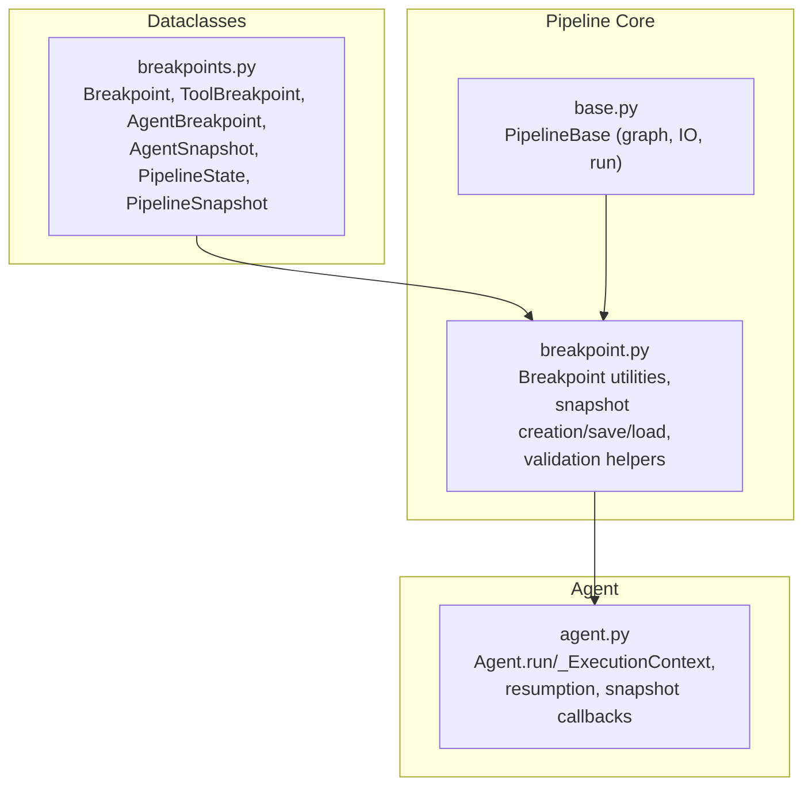
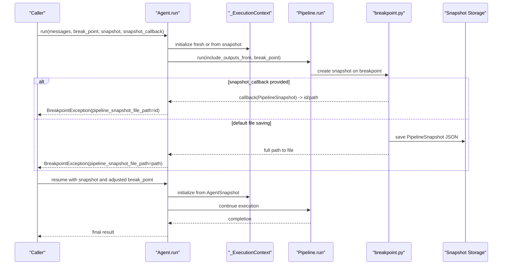
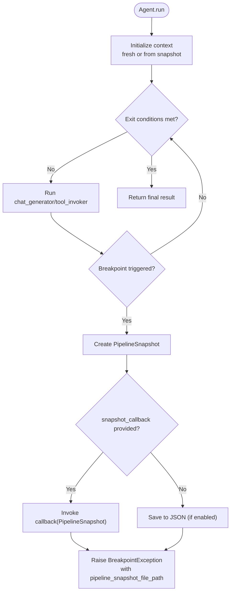
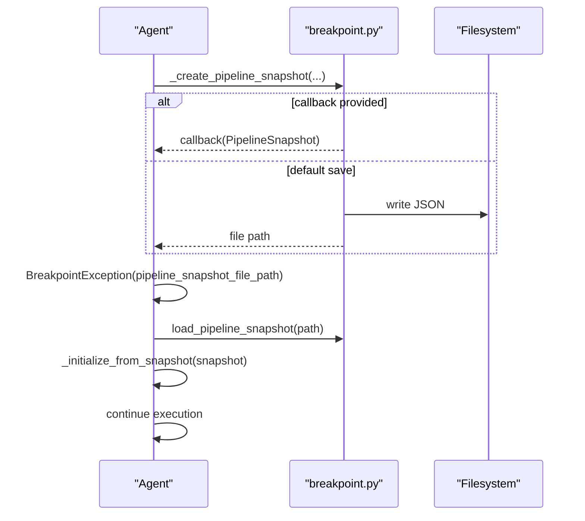
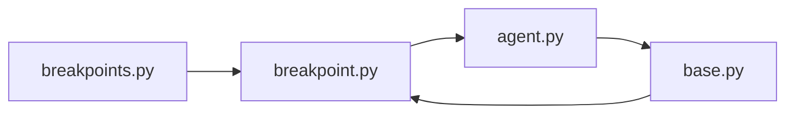

# Agent Debugging and Snapshots

<cite>
**Referenced Files in This Document**
- [breakpoints.py](file://haystack/dataclasses/breakpoints.py)
- [breakpoint.py](file://haystack/core/pipeline/breakpoint.py)
- [agent.py](file://haystack/components/agents/agent.py)
- [test_agent_breakpoints.py](file://test/components/agents/test_agent_breakpoints.py)
- [test_breakpoint.py](file://test/core/pipeline/test_breakpoint.py)
- [base.py](file://haystack/core/pipeline/base.py)
</cite>

## Table of Contents
1. [Introduction](#introduction)
2. [Project Structure](#project-structure)
3. [Core Components](#core-components)
4. [Architecture Overview](#architecture-overview)
5. [Detailed Component Analysis](#detailed-component-analysis)
6. [Dependency Analysis](#dependency-analysis)
7. [Performance Considerations](#performance-considerations)
8. [Troubleshooting Guide](#troubleshooting-guide)
9. [Conclusion](#conclusion)
10. [Appendices](#appendices)

## Introduction
This document explains Agent Debugging and Snapshot functionality in the codebase, focusing on breakpoint management and execution control. It covers:
- AgentBreakpoint and ToolBreakpoint types and their constraints
- Breakpoint configuration and trigger conditions
- Snapshot creation, saving, and restoration for agent execution
- The end-to-end breakpoint workflow: detection, state capture, and execution resumption
- Debugging strategies (step-through and state inspection)
- Snapshot callback mechanisms and custom snapshot handling
- Practical examples and best practices for pipeline and agent debugging

## Project Structure
The debugging and snapshot features span three primary areas:
- Dataclasses that define breakpoint and snapshot models
- Pipeline-level breakpoint utilities and snapshot persistence
- Agent-level execution context, breakpoint validation, and resumption

**Diagram sources**
- [breakpoints.py](file://haystack/dataclasses/breakpoints.py#L12-L282)
- [breakpoint.py](file://haystack/core/pipeline/breakpoint.py#L1-L518)
- [agent.py](file://haystack/components/agents/agent.py#L104-L1235)
- [base.py](file://haystack/core/pipeline/base.py#L81-L800)

**Section sources**
- [breakpoints.py](file://haystack/dataclasses/breakpoints.py#L12-L282)
- [breakpoint.py](file://haystack/core/pipeline/breakpoint.py#L1-L518)
- [agent.py](file://haystack/components/agents/agent.py#L104-L1235)
- [base.py](file://haystack/core/pipeline/base.py#L81-L800)

## Core Components
- Breakpoint: A dataclass that defines a breakpoint at a pipeline component with a visit count and optional snapshot file path.
- ToolBreakpoint: Extends Breakpoint to target a specific tool inside an Agent’s tool_invoker; supports “all tools” when tool_name is None.
- AgentBreakpoint: Binds a breakpoint to an Agent component, enforcing that:
  - Breakpoint must target chat_generator
  - ToolBreakpoint must target tool_invoker
- AgentSnapshot: Captures agent-level state (component inputs, visit counts, breakpoint, timestamp) for resumption.
- PipelineState: Captures pipeline-level state (inputs, visit counts, outputs) at a breakpoint.
- PipelineSnapshot: Full snapshot of the pipeline at a breakpoint, including optional AgentSnapshot.

These types are defined in the breakpoints dataclasses module and are used throughout the pipeline and agent debugging flows.

**Section sources**
- [breakpoints.py](file://haystack/dataclasses/breakpoints.py#L12-L282)

## Architecture Overview
The debugging and snapshot architecture integrates pipeline-level breakpoint utilities with agent-level execution control:

**Diagram sources**
- [agent.py](file://haystack/components/agents/agent.py#L741-L1235)
- [breakpoint.py](file://haystack/core/pipeline/breakpoint.py#L166-L259)
- [test_agent_breakpoints.py](file://test/components/agents/test_agent_breakpoints.py#L482-L527)

## Detailed Component Analysis

### Breakpoint Types and Validation
- Breakpoint
  - Fields: component_name, visit_count, snapshot_file_path
  - Purpose: define a breakpoint at a pipeline component; when visit_count equals the component’s visit count, trigger a breakpoint
- ToolBreakpoint
  - Extends Breakpoint with tool_name
  - Behavior: if tool_name is None, triggers on any tool call; if set, triggers only for that tool
- AgentBreakpoint
  - Enforces constraints:
    - Breakpoint must target chat_generator
    - ToolBreakpoint must target tool_invoker
  - Used to configure breakpoints inside an Agent component

Validation and constraints are enforced in the AgentBreakpoint post-init and in dedicated validation helpers.

**Section sources**
- [breakpoints.py](file://haystack/dataclasses/breakpoints.py#L12-L116)
- [breakpoint.py](file://haystack/core/pipeline/breakpoint.py#L57-L84)

### Snapshot Models and Serialization
- AgentSnapshot
  - Captures component_inputs (chat_generator and tool_invoker), component_visits, break_point, timestamp
  - Provides to_dict/from_dict for serialization
- PipelineState
  - Captures inputs, component_visits, pipeline_outputs
- PipelineSnapshot
  - Captures original_input_data, ordered_component_names, PipelineState, break_point, optional AgentSnapshot, timestamp, include_outputs_from
  - Validates consistency between component_visits and ordered_component_names
  - Provides to_dict/from_dict and a constructor from AgentSnapshot

These models are used to persist and restore execution state.

**Section sources**
- [breakpoints.py](file://haystack/dataclasses/breakpoints.py#L118-L282)

### Pipeline Breakpoint Utilities
Key utilities:
- _is_snapshot_save_enabled(): checks environment variable controlling default file saving
- _save_pipeline_snapshot(): saves to JSON or invokes snapshot_callback; returns file path or callback result
- _create_pipeline_snapshot(): constructs a PipelineSnapshot from current inputs, outputs, and state
- _create_agent_snapshot(): constructs an AgentSnapshot from execution context
- _create_pipeline_snapshot_from_chat_generator(), _create_pipeline_snapshot_from_tool_invoker(): convenience constructors for agent breakpoints
- _should_trigger_tool_invoker_breakpoint(): determines if a ToolBreakpoint should trigger based on LLM messages
- _validate_break_point_against_pipeline(), _validate_pipeline_snapshot_against_pipeline(): validate breakpoint/snapshot compatibility with the current pipeline
- load_pipeline_snapshot(): loads a PipelineSnapshot from disk

These utilities power breakpoint detection, snapshot creation, and persistence.

**Section sources**
- [breakpoint.py](file://haystack/core/pipeline/breakpoint.py#L35-L518)

### Agent Execution and Resumption
Agent-level features:
- _ExecutionContext: tracks state, component visits, inputs to chat_generator and tool_invoker, step counter, flags for skipping components, and optional confirmation strategy context
- _runtime_checks(): validates AgentBreakpoint and tool availability
- run(): orchestrates:
  - Fresh initialization or resumption from AgentSnapshot
  - Snapshot callback handling
  - Tool selection and streaming callback wiring
  - Breakpoint triggering and exception propagation with pipeline_snapshot and pipeline_snapshot_file_path
- _initialize_from_snapshot(): restores execution context from an AgentSnapshot

**Diagram sources**
- [agent.py](file://haystack/components/agents/agent.py#L741-L1235)
- [breakpoint.py](file://haystack/core/pipeline/breakpoint.py#L166-L259)

**Section sources**
- [agent.py](file://haystack/components/agents/agent.py#L725-L1235)
- [breakpoint.py](file://haystack/core/pipeline/breakpoint.py#L166-L259)

### Breakpoint Trigger Conditions
- Pipeline-level Breakpoint: triggered when component_name visit_count equals the component’s current visit count
- ToolBreakpoint:
  - If tool_name is None: triggers on any tool call in the last LLM message(s)
  - If tool_name is set: triggers only for that specific tool
- Agent-level constraints:
  - Breakpoint must target chat_generator
  - ToolBreakpoint must target tool_invoker
  - Tool names are validated against the agent’s tools

Tests demonstrate:
- Chat generator breakpoint with optional snapshot_callback
- Tool invoker breakpoint with tool-specific and “all tools” modes
- Resuming from snapshots with adjusted visit counts

**Section sources**
- [breakpoint.py](file://haystack/core/pipeline/breakpoint.py#L502-L518)
- [test_agent_breakpoints.py](file://test/components/agents/test_agent_breakpoints.py#L105-L200)
- [test_agent_breakpoints.py](file://test/components/agents/test_agent_breakpoints.py#L482-L527)

### Snapshot Creation, Saving, and Restoration
- Creation:
  - PipelineSnapshot created from current inputs, outputs, and state
  - AgentSnapshot created from execution context and component inputs
- Saving:
  - Default behavior writes JSON files when enabled by environment variable
  - Custom snapshot_callback can intercept and handle snapshots (e.g., store in DB, send to remote)
- Restoration:
  - load_pipeline_snapshot() reads JSON and reconstructs PipelineSnapshot
  - Agent.run() can resume from an AgentSnapshot, initializing execution context accordingly

**Diagram sources**
- [breakpoint.py](file://haystack/core/pipeline/breakpoint.py#L166-L259)
- [test_breakpoint.py](file://test/core/pipeline/test_breakpoint.py#L415-L440)

**Section sources**
- [breakpoint.py](file://haystack/core/pipeline/breakpoint.py#L136-L259)
- [test_breakpoint.py](file://test/core/pipeline/test_breakpoint.py#L82-L130)
- [test_breakpoint.py](file://test/core/pipeline/test_breakpoint.py#L415-L440)

### Practical Examples
- Configure a ToolBreakpoint to trigger at tool_invoker for a specific tool and save snapshots to a directory
- Resume execution from a snapshot by passing the loaded AgentSnapshot and adjusting the breakpoint visit_count
- Use a snapshot_callback to capture snapshots programmatically (e.g., to a database) instead of saving to disk
- Validate that invalid tool names or component names raise appropriate errors

Examples are demonstrated in tests for both sync and async agent runs.

**Section sources**
- [test_agent_breakpoints.py](file://test/components/agents/test_agent_breakpoints.py#L482-L527)
- [test_agent_breakpoints.py](file://test/components/agents/test_agent_breakpoints.py#L766-L806)
- [test_breakpoint.py](file://test/core/pipeline/test_breakpoint.py#L395-L440)

## Dependency Analysis
- Dataclasses depend on each other to represent snapshots and breakpoints
- Pipeline breakpoint utilities depend on:
  - Dataclasses for snapshot models
  - Serialization utilities for inputs/outputs
  - Environment variables for enabling default file saving
- Agent depends on:
  - Pipeline breakpoint utilities for snapshot creation and validation
  - Dataclasses for breakpoint and snapshot models
  - Tools subsystem for tool selection and validation

**Diagram sources**
- [breakpoints.py](file://haystack/dataclasses/breakpoints.py#L12-L282)
- [breakpoint.py](file://haystack/core/pipeline/breakpoint.py#L1-L518)
- [agent.py](file://haystack/components/agents/agent.py#L104-L1235)
- [base.py](file://haystack/core/pipeline/base.py#L81-L800)

**Section sources**
- [breakpoints.py](file://haystack/dataclasses/breakpoints.py#L12-L282)
- [breakpoint.py](file://haystack/core/pipeline/breakpoint.py#L1-L518)
- [agent.py](file://haystack/components/agents/agent.py#L104-L1235)
- [base.py](file://haystack/core/pipeline/base.py#L81-L800)

## Performance Considerations
- Serialization overhead: Snapshots serialize inputs, outputs, and state; non-serializable objects are handled gracefully with warnings and fallbacks
- File I/O: Default snapshot saving writes JSON files; disabling via environment variable avoids I/O overhead
- Callback flexibility: Using snapshot_callback avoids file I/O and enables efficient storage in memory or external systems
- Visit counting: Breakpoints rely on component visit counts; ensure reasonable visit_count thresholds to avoid frequent interruptions

[No sources needed since this section provides general guidance]

## Troubleshooting Guide
Common issues and resolutions:
- Invalid component name in Breakpoint or AgentBreakpoint: Ensure component_name matches allowed targets (chat_generator for Breakpoint, tool_invoker for ToolBreakpoint)
- Invalid tool name in ToolBreakpoint: Confirm tool_name exists in the agent’s tools
- Snapshot validation errors: Ensure PipelineSnapshot components match current pipeline graph and ordered_component_names are consistent
- No file saved despite breakpoint: Verify HAYSTACK_PIPELINE_SNAPSHOT_SAVE_ENABLED is set to true or provide a snapshot_callback
- Resuming from snapshot: Adjust break_point visit_count to continue after the saved breakpoint

**Section sources**
- [breakpoint.py](file://haystack/core/pipeline/breakpoint.py#L57-L84)
- [breakpoint.py](file://haystack/core/pipeline/breakpoint.py#L86-L134)
- [test_agent_breakpoints.py](file://test/components/agents/test_agent_breakpoints.py#L528-L539)
- [test_breakpoint.py](file://test/core/pipeline/test_breakpoint.py#L69-L80)

## Conclusion
The Agent Debugging and Snapshot system provides robust breakpoint management and execution control:
- Clear breakpoint types and constraints ensure precise targeting of agent and pipeline components
- Comprehensive snapshot models capture both pipeline and agent state
- Flexible snapshot handling supports both default file saving and custom callbacks
- Practical examples and validations guide correct usage and troubleshooting

[No sources needed since this section summarizes without analyzing specific files]

## Appendices

### API and Workflow References
- Breakpoint configuration and trigger conditions
- Snapshot creation and restoration
- Agent resumption from snapshots
- Pipeline-level breakpoint utilities and validation

**Section sources**
- [breakpoints.py](file://haystack/dataclasses/breakpoints.py#L12-L282)
- [breakpoint.py](file://haystack/core/pipeline/breakpoint.py#L166-L259)
- [agent.py](file://haystack/components/agents/agent.py#L741-L1235)
- [test_agent_breakpoints.py](file://test/components/agents/test_agent_breakpoints.py#L482-L527)
- [test_breakpoint.py](file://test/core/pipeline/test_breakpoint.py#L82-L130)