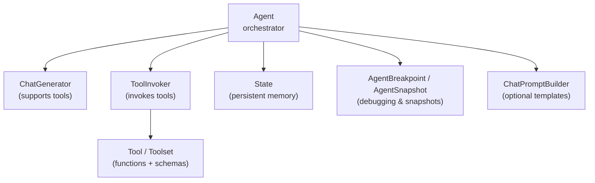
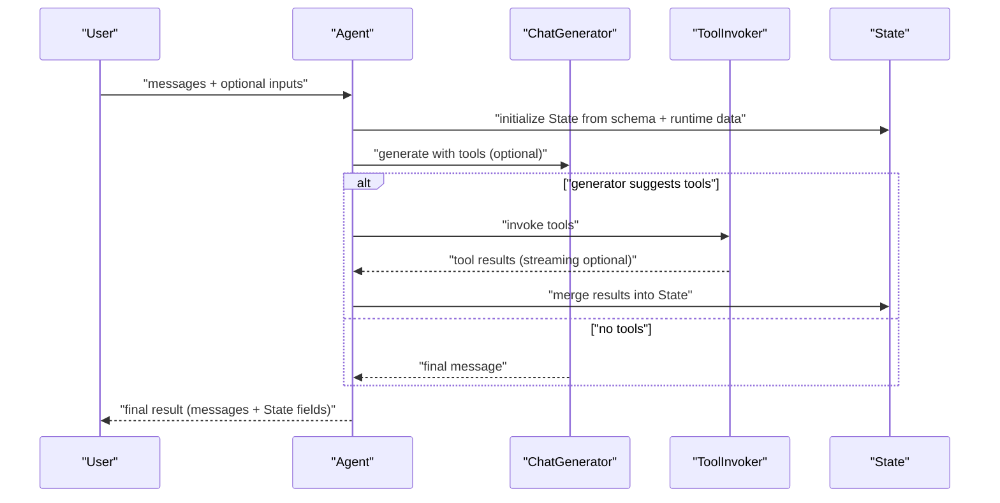
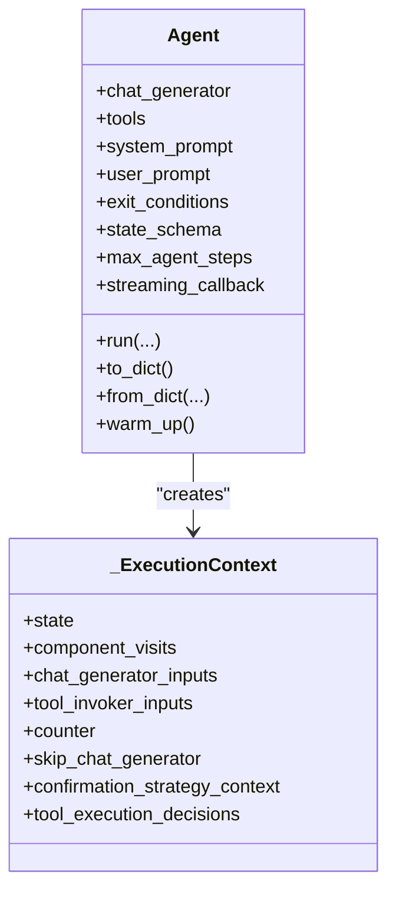
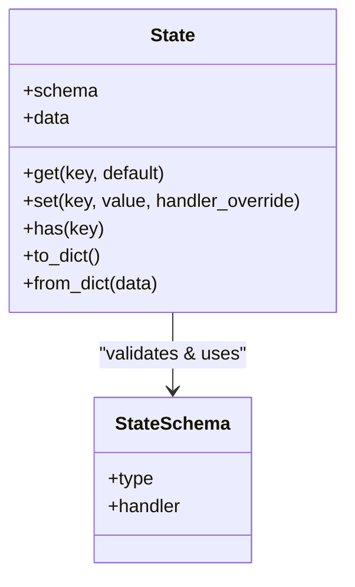
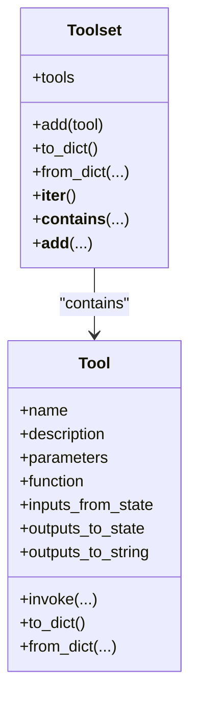
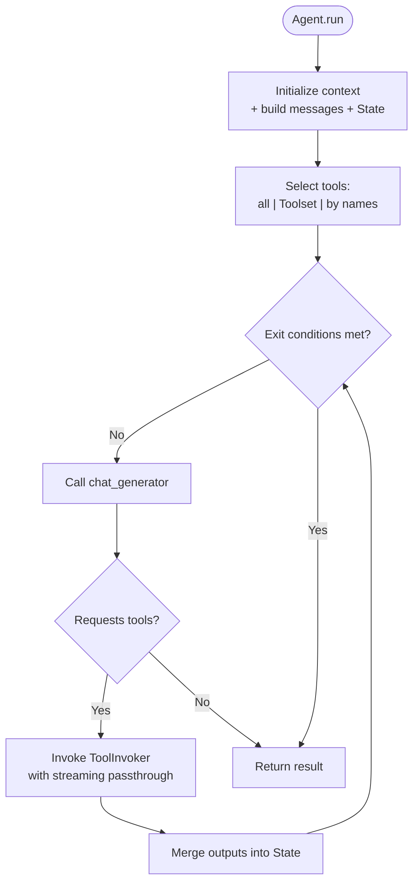
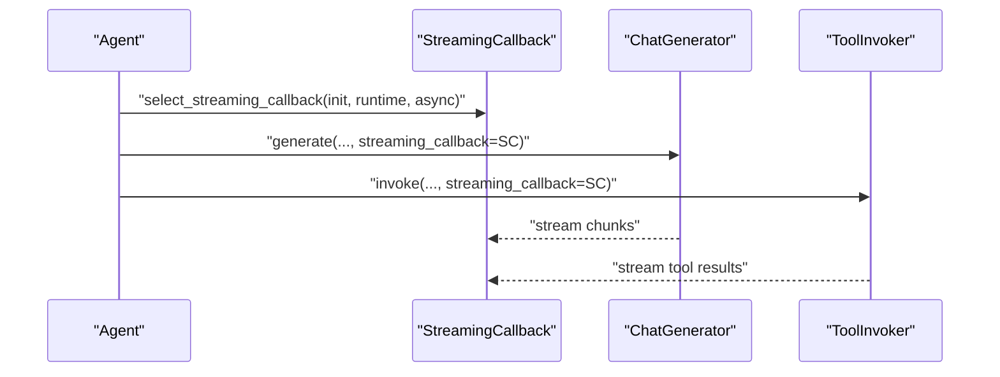
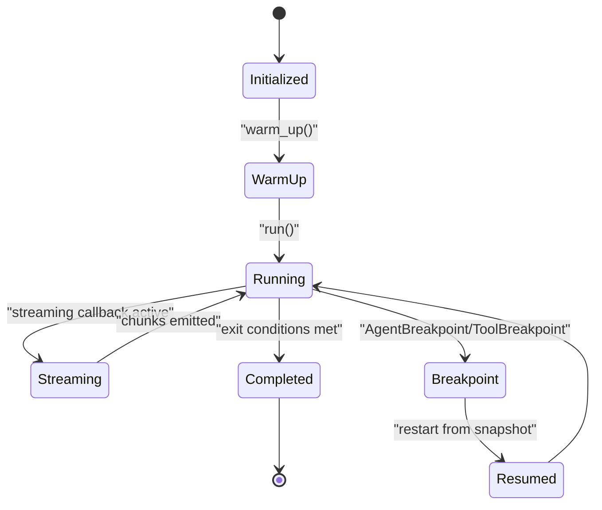
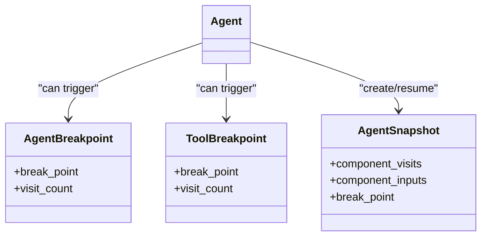
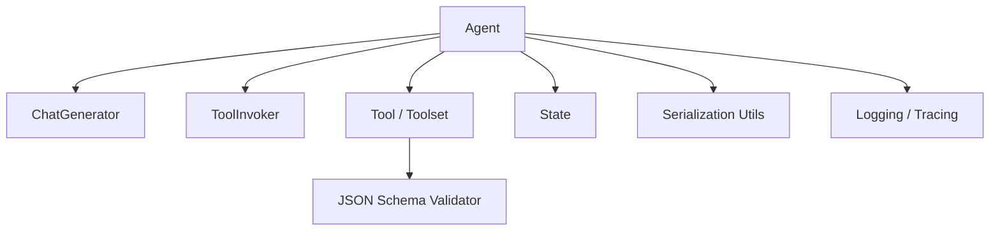

# Agent Framework

<cite>
**Referenced Files in This Document**
- [agent.py](file://haystack/components/agents/agent.py)
- [state.py](file://haystack/components/agents/state/state.py)
- [tool.py](file://haystack/tools/tool.py)
- [toolset.py](file://haystack/tools/toolset.py)
- [breakpoints.py](file://haystack/dataclasses/breakpoints.py)
- [pyproject.toml](file://pyproject.toml)
</cite>

## Table of Contents
1. [Introduction](#introduction)
2. [Project Structure](#project-structure)
3. [Core Components](#core-components)
4. [Architecture Overview](#architecture-overview)
5. [Detailed Component Analysis](#detailed-component-analysis)
6. [Dependency Analysis](#dependency-analysis)
7. [Performance Considerations](#performance-considerations)
8. [Troubleshooting Guide](#troubleshooting-guide)
9. [Conclusion](#conclusion)
10. [Appendices](#appendices)

## Introduction
This document explains Haystack’s Agent Framework: how agents act as tool-using conversational interfaces powered by large language models, how they manage state, integrate tools, and orchestrate execution with streaming callbacks. It covers initialization parameters, state schema and persistence, tool integration patterns, lifecycle from initialization to completion, streaming response handling, debugging and snapshots, and advanced features such as conditional routing and dynamic tool selection.

## Project Structure
The Agent Framework spans several modules:
- Agent component orchestrating chat generation and tool invocation
- State management for persistent memory
- Tool and Toolset abstractions for tool integration
- Breakpoint and snapshot facilities for debugging and controlled execution
- Build and dependency metadata

**Diagram sources**
- [agent.py](file://haystack/components/agents/agent.py#L103-L1235)
- [state.py](file://haystack/components/agents/state/state.py#L82-L208)
- [tool.py](file://haystack/tools/tool.py#L18-L405)
- [toolset.py](file://haystack/tools/toolset.py#L13-L365)
- [breakpoints.py](file://haystack/dataclasses/breakpoints.py#L65-L119)

**Section sources**
- [agent.py](file://haystack/components/agents/agent.py#L103-L1235)
- [state.py](file://haystack/components/agents/state/state.py#L82-L208)
- [tool.py](file://haystack/tools/tool.py#L18-L405)
- [toolset.py](file://haystack/tools/toolset.py#L13-L365)
- [breakpoints.py](file://haystack/dataclasses/breakpoints.py#L65-L119)

## Core Components
- Agent: Orchestrates turns between a chat generator and a tool invoker, manages state, enforces exit conditions, and supports streaming and breakpoints.
- State: Typed, schema-driven memory for persistent agent context and tool interop.
- Tool: Encapsulates a function with JSON Schema parameters, optional state mapping, and output formatting.
- Toolset: A collection of related tools, supporting grouping and dynamic loading.
- Breakpoints/Snapshots: Facilities to pause execution and resume from a saved state.

Key capabilities:
- Tool selection by name or by passing a subset of tools at runtime
- Streaming callback propagation to both chat generator and tool invoker
- Human-in-the-loop confirmation strategies
- Serialization and deserialization of agent, tools, and state

**Section sources**
- [agent.py](file://haystack/components/agents/agent.py#L228-L357)
- [state.py](file://haystack/components/agents/state/state.py#L82-L208)
- [tool.py](file://haystack/tools/tool.py#L18-L405)
- [toolset.py](file://haystack/tools/toolset.py#L13-L365)
- [breakpoints.py](file://haystack/dataclasses/breakpoints.py#L65-L119)

## Architecture Overview
High-level flow:
- Agent initializes with a chat generator, optional tools, prompts, exit conditions, and state schema.
- On run, it builds messages from user/system prompts and runtime inputs, initializes State, and selects tools.
- Iteratively:
  - Calls the chat generator to produce a candidate message (possibly requesting tool use).
  - If tools are requested, invokes ToolInvoker to execute tools, optionally streaming partial results.
  - Updates State and checks exit conditions.
- Streams responses and supports breakpoints/snapshots for debugging and controlled execution.

**Diagram sources**
- [agent.py](file://haystack/components/agents/agent.py#L741-L800)
- [agent.py](file://haystack/components/agents/agent.py#L504-L621)
- [agent.py](file://haystack/components/agents/agent.py#L660-L724)
- [state.py](file://haystack/components/agents/state/state.py#L115-L142)

## Detailed Component Analysis

### Agent Component
Responsibilities:
- Validate chat generator capability for tools
- Resolve exit conditions against configured tools
- Manage prompt builders and required variables
- Initialize State with schema and runtime data
- Select tools at runtime (by name, Toolset, or list)
- Coordinate chat generator and tool invoker with streaming callbacks
- Enforce max steps and exit conditions
- Support breakpoints and snapshots for debugging

Initialization parameters:
- chat_generator: A chat generator that supports tools
- tools: List of Tool/Toolset or a single Toolset
- system_prompt: Jinja2 template or plain string for system context
- user_prompt: Jinja2 template appended to runtime messages
- required_variables: Variables required by prompts; "*" means all detected variables
- exit_conditions: List including "text" or tool names; agent exits when reached
- state_schema: Schema for State; "messages" list[ChatMessage] is auto-added
- max_agent_steps: Upper bound on iterations
- streaming_callback: Callback for streaming responses; propagated to generator and invoker
- raise_on_tool_invocation_failure: Fail fast on tool errors or convert to messages
- tool_invoker_kwargs: Extra kwargs for ToolInvoker
- confirmation_strategies: Per-tool strategies for human-in-the-loop

Agent lifecycle:
- Initialization → Warm-up → Run (fresh or from snapshot) → Streamed execution → Completion or breakpoint

**Diagram sources**
- [agent.py](file://haystack/components/agents/agent.py#L103-L1235)
- [agent.py](file://haystack/components/agents/agent.py#L72-L101)

**Section sources**
- [agent.py](file://haystack/components/agents/agent.py#L228-L357)
- [agent.py](file://haystack/components/agents/agent.py#L504-L621)
- [agent.py](file://haystack/components/agents/agent.py#L660-L724)
- [agent.py](file://haystack/components/agents/agent.py#L741-L800)

### State Management
State is a typed, schema-driven container for persistent agent memory:
- Schema entries define type and optional handler for merging values
- Default handlers:
  - Lists: merge_lists
  - Others: replace_values
- Auto-adds "messages" as list[ChatMessage] if not present
- Provides get/set with handler application and deep copies for safety
- Serializable via schema and data serialization utilities

**Diagram sources**
- [state.py](file://haystack/components/agents/state/state.py#L82-L208)

**Section sources**
- [state.py](file://haystack/components/agents/state/state.py#L56-L80)
- [state.py](file://haystack/components/agents/state/state.py#L115-L142)
- [state.py](file://haystack/components/agents/state/state.py#L191-L208)

### Tool Integration Patterns
Tool:
- Encapsulates a function with JSON Schema parameters
- Supports inputs_from_state and outputs_to_state for seamless state interop
- Supports outputs_to_string for formatted tool results
- Validates function type, schema validity, and configuration consistency

Toolset:
- A collection of Tool instances with convenience operations
- Enables grouping and dynamic loading
- Implements serialization and iteration for compatibility

**Diagram sources**
- [tool.py](file://haystack/tools/tool.py#L18-L405)
- [toolset.py](file://haystack/tools/toolset.py#L13-L365)

**Section sources**
- [tool.py](file://haystack/tools/tool.py#L18-L405)
- [toolset.py](file://haystack/tools/toolset.py#L13-L365)

### Tool Selection and Execution Workflow
Agent supports flexible tool selection:
- Use all configured tools
- Pass a Toolset
- Pass a list of tool names; Agent validates against configured tools
- At runtime, Agent constructs ToolInvoker inputs and propagates streaming callback

**Diagram sources**
- [agent.py](file://haystack/components/agents/agent.py#L622-L658)
- [agent.py](file://haystack/components/agents/agent.py#L504-L621)

**Section sources**
- [agent.py](file://haystack/components/agents/agent.py#L622-L658)
- [agent.py](file://haystack/components/agents/agent.py#L504-L621)

### Streaming Callback Mechanisms
Agent composes a unified streaming callback from initialization and runtime, then:
- Propagates it to ToolInvoker and ChatGenerator
- Enables streaming callback passthrough for ToolInvoker when configured
- Allows real-time handling of partial responses and tool results

**Diagram sources**
- [agent.py](file://haystack/components/agents/agent.py#L593-L613)

**Section sources**
- [agent.py](file://haystack/components/agents/agent.py#L593-L613)

### Agent Lifecycle: From Initialization to Completion
- Initialization: Validate chat generator, exit conditions, state schema; build prompt builders; configure ToolInvoker if tools exist
- Warm-up: Optionally warm up chat generator and tool invoker
- Run:
  - Fresh run: build messages from prompts and runtime inputs; initialize State; select tools; iterate until exit conditions
  - From snapshot: restore State and component inputs; resume with optional tool execution decisions
- Completion: Return messages and any additional State fields defined by state_schema

**Diagram sources**
- [agent.py](file://haystack/components/agents/agent.py#L410-L420)
- [agent.py](file://haystack/components/agents/agent.py#L741-L800)
- [agent.py](file://haystack/components/agents/agent.py#L660-L724)

**Section sources**
- [agent.py](file://haystack/components/agents/agent.py#L410-L420)
- [agent.py](file://haystack/components/agents/agent.py#L741-L800)
- [agent.py](file://haystack/components/agents/agent.py#L660-L724)

### Debugging, Breakpoints, and Snapshots
- AgentBreakpoint and ToolBreakpoint define where to pause execution
- AgentSnapshot captures component visits, inputs, and state for resumable runs
- Validation ensures tool breakpoints are valid for the current tool set
- Agent supports confirmation strategies for human-in-the-loop decisions

**Diagram sources**
- [breakpoints.py](file://haystack/dataclasses/breakpoints.py#L65-L119)
- [agent.py](file://haystack/components/agents/agent.py#L725-L740)
- [agent.py](file://haystack/components/agents/agent.py#L660-L724)

**Section sources**
- [breakpoints.py](file://haystack/dataclasses/breakpoints.py#L65-L119)
- [agent.py](file://haystack/components/agents/agent.py#L725-L740)
- [agent.py](file://haystack/components/agents/agent.py#L660-L724)

### Advanced Features
- Conditional routing: exit_conditions can include specific tool names to stop after tool execution
- Dynamic tool selection: pass a list of tool names at runtime to restrict the tool set
- Agent composition: ToolInvokers and chat generators can be composed independently; Agent coordinates them
- Human-in-the-loop: confirmation strategies allow non-blocking user interactions via a request-scoped context

**Section sources**
- [agent.py](file://haystack/components/agents/agent.py#L285-L294)
- [agent.py](file://haystack/components/agents/agent.py#L622-L658)
- [agent.py](file://haystack/components/agents/agent.py#L741-L800)

## Dependency Analysis
External dependencies relevant to the Agent Framework:
- Chat generators must support tools parameter
- Tool invocation relies on ToolInvoker and JSON Schema validation
- Serialization uses component and callable serializers
- Optional tracing and logging are integrated

**Diagram sources**
- [agent.py](file://haystack/components/agents/agent.py#L10-L60)
- [tool.py](file://haystack/tools/tool.py#L10-L16)
- [pyproject.toml](file://pyproject.toml#L43-L61)

**Section sources**
- [agent.py](file://haystack/components/agents/agent.py#L10-L60)
- [tool.py](file://haystack/tools/tool.py#L10-L16)
- [pyproject.toml](file://pyproject.toml#L43-L61)

## Performance Considerations
- Limit max_agent_steps to prevent long-running loops
- Prefer streaming callbacks to reduce perceived latency
- Use ToolInvoker’s streaming callback passthrough to interleave tool results
- Warm up chat generators and tools to avoid cold-start delays
- Keep state_schema minimal and focused to reduce serialization overhead

## Troubleshooting Guide
Common issues and resolutions:
- Chat generator not supporting tools: Ensure the generator exposes a run method with a tools parameter
- Invalid exit conditions: Provide only "text" or valid tool names
- Prompt variable conflicts: Avoid naming variables that overlap with state schema or run method parameters
- Tool invocation failures: Configure raise_on_tool_invocation_failure or rely on error-to-message fallback
- No tools provided: Agent behaves like a chat generator; pass tools to enable tool use
- Snapshot errors: Validate tool breakpoints and ensure tool sets match between snapshot and current configuration

**Section sources**
- [agent.py](file://haystack/components/agents/agent.py#L276-L294)
- [agent.py](file://haystack/components/agents/agent.py#L358-L409)
- [agent.py](file://haystack/components/agents/agent.py#L348-L353)
- [agent.py](file://haystack/components/agents/agent.py#L725-L740)

## Conclusion
Haystack’s Agent Framework provides a robust, extensible foundation for building tool-using agents. It cleanly separates concerns between conversation orchestration, persistent state, and tool integration, while offering powerful controls for streaming, breakpoints, and human-in-the-loop workflows. With clear initialization parameters, schema-driven state, and flexible tool selection, it supports both simple chatbots and complex, multi-step reasoning agents.

## Appendices

### Practical Examples and Patterns
- Agent configuration with tools and prompts: see Agent usage examples in the component docstring
- Tool development with JSON Schema and state mapping: see Tool constructor and validation logic
- State manipulation: initialize State with schema and runtime data; use set/get to update context
- Snapshot-based execution: capture AgentSnapshot and resume with run(snapshot=...)

**Section sources**
- [agent.py](file://haystack/components/agents/agent.py#L114-L226)
- [tool.py](file://haystack/tools/tool.py#L18-L93)
- [state.py](file://haystack/components/agents/state/state.py#L115-L142)
- [agent.py](file://haystack/components/agents/agent.py#L660-L724)