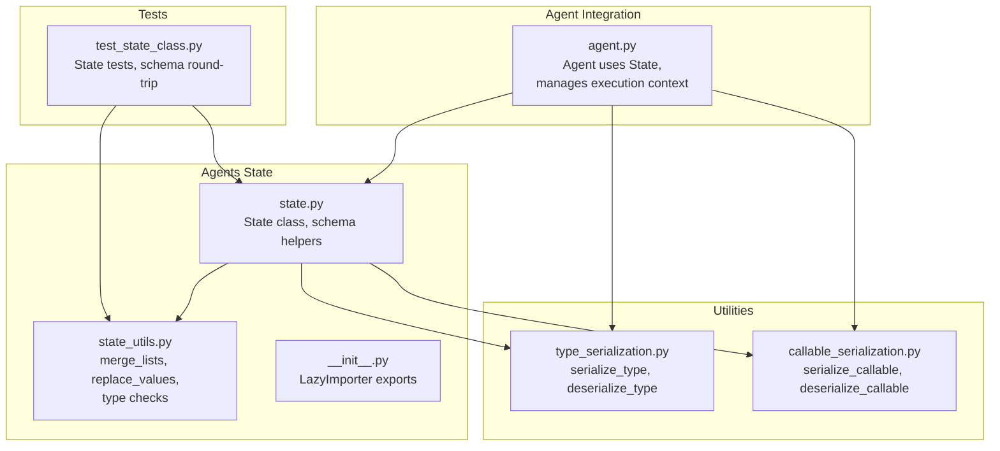
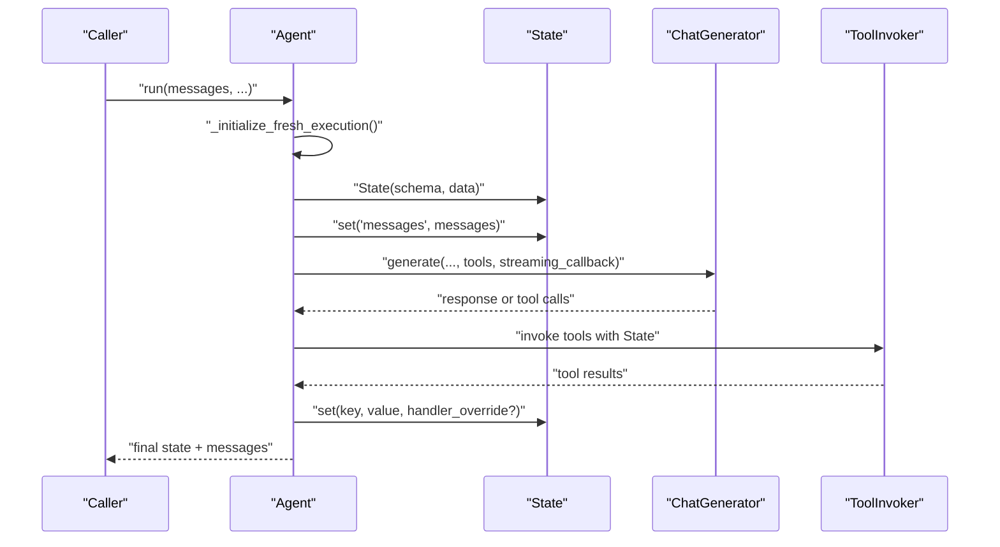
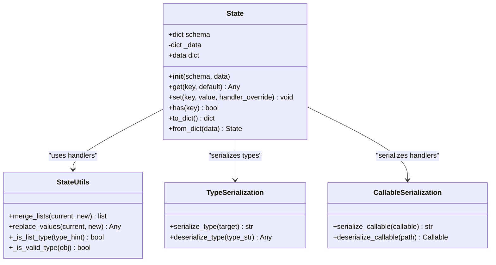
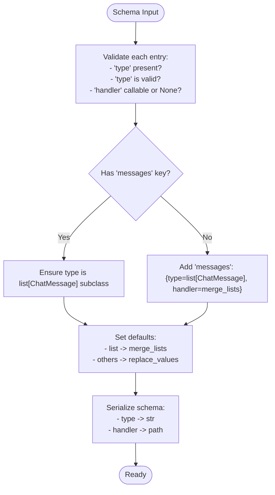
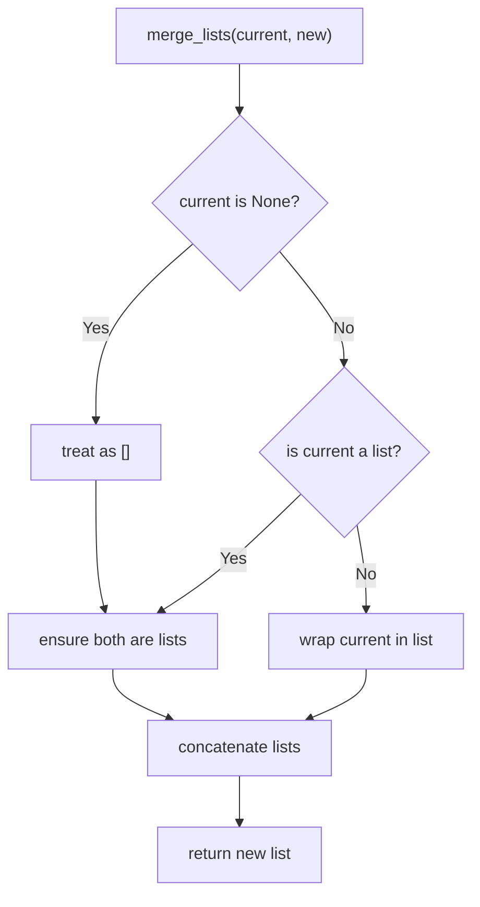
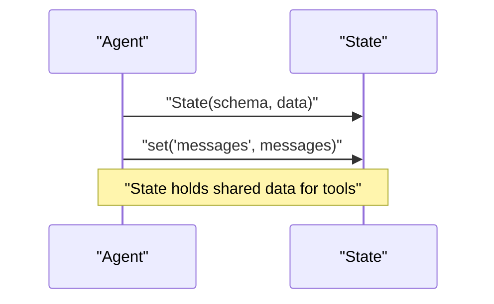
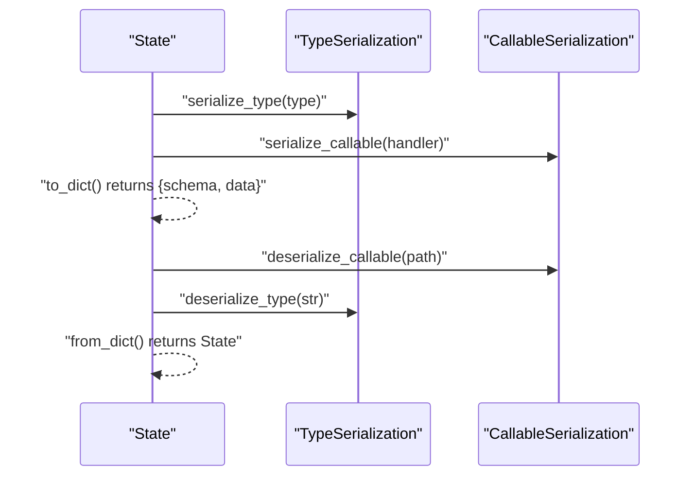
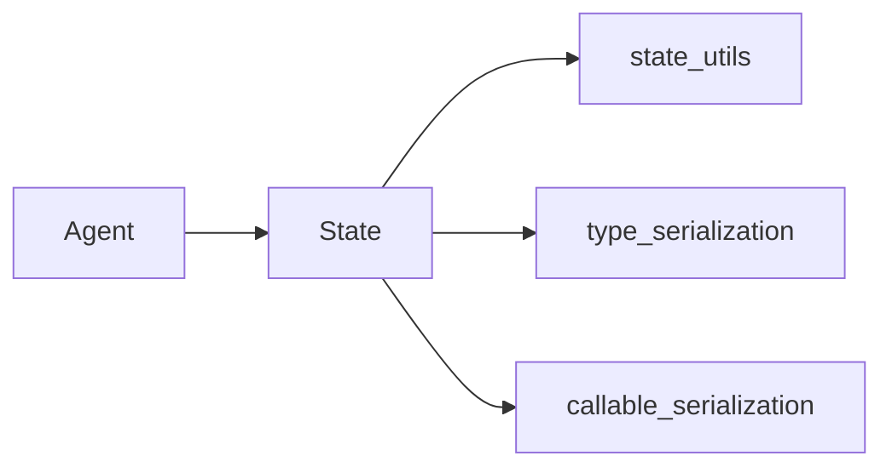

# State Management

<cite>
**Referenced Files in This Document**
- [state.py](file://haystack/components/agents/state/state.py)
- [state_utils.py](file://haystack/components/agents/state/state_utils.py)
- [__init__.py](file://haystack/components/agents/state/__init__.py)
- [agent.py](file://haystack/components/agents/agent.py)
- [test_state_class.py](file://test/components/agents/test_state_class.py)
- [type_serialization.py](file://haystack/utils/type_serialization.py)
- [callable_serialization.py](file://haystack/utils/callable_serialization.py)
- [state.mdx](file://docs-website/versioned_docs/version-2.18/concepts/agents/state.mdx)
</cite>

## Table of Contents
1. [Introduction](#introduction)
2. [Project Structure](#project-structure)
3. [Core Components](#core-components)
4. [Architecture Overview](#architecture-overview)
5. [Detailed Component Analysis](#detailed-component-analysis)
6. [Dependency Analysis](#dependency-analysis)
7. [Performance Considerations](#performance-considerations)
8. [Troubleshooting Guide](#troubleshooting-guide)
9. [Conclusion](#conclusion)
10. [Appendices](#appendices)

## Introduction
This document explains Agent State Management in the Haystack Agents subsystem. It focuses on the State class and the state schema implementation, covering schema definition, validation, initialization, persistence, transitions, and serialization/deserialization. It also details state utilities for merging lists, replacing values, and handling complex data structures. Practical examples demonstrate schema design, custom state management, and state manipulation patterns. Finally, it explains the relationship between state and agent tools, including state sharing and data flow across components.

## Project Structure
The state management feature resides in the agents subsystem and integrates with the Agent component and utility modules for serialization.

**Diagram sources**
- [state.py](file://haystack/components/agents/state/state.py#L1-L208)
- [state_utils.py](file://haystack/components/agents/state/state_utils.py#L1-L82)
- [__init__.py](file://haystack/components/agents/state/__init__.py#L1-L19)
- [agent.py](file://haystack/components/agents/agent.py#L1-L1235)
- [type_serialization.py](file://haystack/utils/type_serialization.py#L1-L229)
- [callable_serialization.py](file://haystack/utils/callable_serialization.py#L1-L89)
- [test_state_class.py](file://test/components/agents/test_state_class.py#L1-L562)

**Section sources**
- [state.py](file://haystack/components/agents/state/state.py#L1-L208)
- [state_utils.py](file://haystack/components/agents/state/state_utils.py#L1-L82)
- [__init__.py](file://haystack/components/agents/state/__init__.py#L1-L19)
- [agent.py](file://haystack/components/agents/agent.py#L1-L1235)
- [type_serialization.py](file://haystack/utils/type_serialization.py#L1-L229)
- [callable_serialization.py](file://haystack/utils/callable_serialization.py#L1-L89)
- [test_state_class.py](file://test/components/agents/test_state_class.py#L1-L562)

## Core Components
- State: Central container for agent runtime data with a typed schema and merge handlers. Provides get, set, has, and serialization APIs.
- State utilities: Helper functions for type validation, list merging, and value replacement.
- Agent integration: The Agent composes State, initializes it from inputs or snapshots, and coordinates tool execution around shared state.
- Serialization utilities: Type and callable serialization/deserialization enable schema and handler persistence.

Key responsibilities:
- Define and validate state schema entries with type and optional handler.
- Merge or replace values according to handlers.
- Persist and restore state for snapshots and restarts.
- Support complex types including unions, generics, and dataclasses.

**Section sources**
- [state.py](file://haystack/components/agents/state/state.py#L82-L208)
- [state_utils.py](file://haystack/components/agents/state/state_utils.py#L13-L82)
- [agent.py](file://haystack/components/agents/agent.py#L504-L723)
- [type_serialization.py](file://haystack/utils/type_serialization.py#L40-L229)
- [callable_serialization.py](file://haystack/utils/callable_serialization.py#L13-L89)

## Architecture Overview
The Agent orchestrates stateful tool execution. It constructs a State from a user-defined schema, optionally enriched with automatic message handling, and passes it to the chat generator and tool invoker. State is persisted as part of snapshots and restored when resuming execution.

**Diagram sources**
- [agent.py](file://haystack/components/agents/agent.py#L504-L723)
- [state.py](file://haystack/components/agents/state/state.py#L115-L190)

**Section sources**
- [agent.py](file://haystack/components/agents/agent.py#L504-L723)
- [state.py](file://haystack/components/agents/state/state.py#L115-L190)

## Detailed Component Analysis

### State Class
The State class encapsulates a typed, schema-driven data container with controlled mutation semantics.

- Initialization
  - Validates schema entries and sets default handlers for list vs non-list types.
  - Automatically adds a messages field with list[ChatMessage] type and merge handler.
  - Accepts optional initial data; stores a shallow copy of the schema and a mutable data dict.

- Accessors and Mutators
  - get(key, default): Returns a deep copy of the value to prevent external mutation of internal state.
  - set(key, value, handler_override?): Applies handler logic to merge or replace values; raises if key not in schema.
  - has(key): Lightweight existence check.
  - data: Exposes the internal data dict for serialization.

- Serialization
  - to_dict(): Serializes schema types and handlers, and data using schema-aware serialization utilities.
  - from_dict(): Restores schema and data, deserializing types and handlers.

- Validation
  - _validate_schema(): Ensures each entry has a valid type, optional handler is callable, and messages type is enforced when present.

**Diagram sources**
- [state.py](file://haystack/components/agents/state/state.py#L82-L208)
- [state_utils.py](file://haystack/components/agents/state/state_utils.py#L55-L82)
- [type_serialization.py](file://haystack/utils/type_serialization.py#L40-L229)
- [callable_serialization.py](file://haystack/utils/callable_serialization.py#L13-L89)

**Section sources**
- [state.py](file://haystack/components/agents/state/state.py#L115-L208)
- [state_utils.py](file://haystack/components/agents/state/state_utils.py#L55-L82)
- [type_serialization.py](file://haystack/utils/type_serialization.py#L40-L229)
- [callable_serialization.py](file://haystack/utils/callable_serialization.py#L13-L89)

### State Schema Definition and Validation
- Schema entries require:
  - type: a valid Python type (including generics and unions).
  - handler: optional callable; if omitted, defaults are applied based on type.
- Special handling for messages:
  - Enforced to be list[ChatMessage] when not explicitly provided.
  - Validation ensures the list element type is a subtype of ChatMessage.

- Type and handler serialization:
  - Types are serialized to strings and deserialized back to types.
  - Handlers are serialized to fully qualified paths and restored as callables.

**Diagram sources**
- [state.py](file://haystack/components/agents/state/state.py#L56-L80)
- [state.py](file://haystack/components/agents/state/state.py#L126-L142)
- [type_serialization.py](file://haystack/utils/type_serialization.py#L40-L86)
- [callable_serialization.py](file://haystack/utils/callable_serialization.py#L13-L44)

**Section sources**
- [state.py](file://haystack/components/agents/state/state.py#L56-L80)
- [state.py](file://haystack/components/agents/state/state.py#L126-L142)
- [type_serialization.py](file://haystack/utils/type_serialization.py#L40-L86)
- [callable_serialization.py](file://haystack/utils/callable_serialization.py#L13-L44)

### State Utilities
- merge_lists(current, new): Converts scalars to single-element lists and concatenates; preserves immutability by returning a new list.
- replace_values(current, new): Overwrites the current value with the new value.
- _is_list_type(type_hint): Detects list or list generics.
- _is_valid_type(obj): Validates Python type annotations including unions and generics.

**Diagram sources**
- [state_utils.py](file://haystack/components/agents/state/state_utils.py#L55-L70)

**Section sources**
- [state_utils.py](file://haystack/components/agents/state/state_utils.py#L55-L82)

### State Initialization and Execution Context
- Fresh execution:
  - Agent builds a State from state_schema and any additional inputs that match the schema.
  - Initializes messages with provided ChatMessage list.
- From snapshot:
  - Agent reconstructs State from serialized inputs embedded in the snapshot’s tool invoker state.

**Diagram sources**
- [agent.py](file://haystack/components/agents/agent.py#L589-L591)
- [agent.py](file://haystack/components/agents/agent.py#L689-L690)

**Section sources**
- [agent.py](file://haystack/components/agents/agent.py#L589-L591)
- [agent.py](file://haystack/components/agents/agent.py#L689-L690)

### State Serialization and Persistence
- to_dict():
  - Serializes schema types and handlers.
  - Serializes data using a schema-aware serializer.
- from_dict():
  - Deserializes schema types and handlers.
  - Restores data with type-aware deserialization.

**Diagram sources**
- [state.py](file://haystack/components/agents/state/state.py#L191-L208)
- [type_serialization.py](file://haystack/utils/type_serialization.py#L142-L229)
- [callable_serialization.py](file://haystack/utils/callable_serialization.py#L46-L89)

**Section sources**
- [state.py](file://haystack/components/agents/state/state.py#L191-L208)
- [type_serialization.py](file://haystack/utils/type_serialization.py#L142-L229)
- [callable_serialization.py](file://haystack/utils/callable_serialization.py#L46-L89)

### Practical Examples and Patterns
- Basic schema with defaults:
  - Define keys with type and rely on default handlers (merge_lists for lists, replace_values for scalars).
- Custom handler:
  - Provide a handler function to implement domain-specific merge logic (e.g., deduplicated sorted lists).
- Handler override:
  - Override handler for a single set() call to temporarily change merge behavior.
- Nested structures:
  - Use custom handlers to merge dictionaries of lists or other composite structures.
- Mutability and safety:
  - get() returns a deep copy; mutating returned references does not affect internal state.

See tests for concrete patterns and assertions:
- Schema validation and defaults
- Custom handlers and overrides
- Nested structures and merge logic
- Serialization round-trips and type preservation

**Section sources**
- [test_state_class.py](file://test/components/agents/test_state_class.py#L219-L562)

## Dependency Analysis
State depends on:
- state_utils for merge/replacement logic and type checks.
- type_serialization for type string representation and restoration.
- callable_serialization for handler path serialization and restoration.

Agent composes State and uses it to coordinate tool execution and snapshots.

**Diagram sources**
- [state.py](file://haystack/components/agents/state/state.py#L1-L208)
- [state_utils.py](file://haystack/components/agents/state/state_utils.py#L1-L82)
- [type_serialization.py](file://haystack/utils/type_serialization.py#L1-L229)
- [callable_serialization.py](file://haystack/utils/callable_serialization.py#L1-L89)
- [agent.py](file://haystack/components/agents/agent.py#L1-L1235)

**Section sources**
- [state.py](file://haystack/components/agents/state/state.py#L1-L208)
- [state_utils.py](file://haystack/components/agents/state/state_utils.py#L1-L82)
- [type_serialization.py](file://haystack/utils/type_serialization.py#L1-L229)
- [callable_serialization.py](file://haystack/utils/callable_serialization.py#L1-L89)
- [agent.py](file://haystack/components/agents/agent.py#L1-L1235)

## Performance Considerations
- Deep copying on get() prevents accidental mutation but may increase memory usage for large structures. Consider keeping large immutable data outside State or using references where safe.
- Default handlers are O(n) for list concatenation; for very large lists, consider batching or specialized handlers.
- Serialization overhead is proportional to schema size and data complexity; cache or reuse serialized forms when applicable.

## Troubleshooting Guide
Common issues and resolutions:
- Key not found in schema:
  - Symptom: Setting a key not defined in schema raises an error.
  - Resolution: Add the key to state_schema with a proper type and optional handler.
- Invalid type or handler:
  - Symptom: Validation errors indicating missing type, invalid type, or non-callable handler.
  - Resolution: Ensure each schema entry has a valid type and handler is callable or None.
- Messages type mismatch:
  - Symptom: Validation error requiring list[ChatMessage] for messages.
  - Resolution: Define messages as list[ChatMessage] or subclass; Agent auto-adds it if absent.
- Serialization failures:
  - Symptom: Deserialization errors for types or handlers.
  - Resolution: Verify fully qualified paths for handlers and ensure types are importable.

**Section sources**
- [state.py](file://haystack/components/agents/state/state.py#L56-L80)
- [state.py](file://haystack/components/agents/state/state.py#L165-L173)
- [test_state_class.py](file://test/components/agents/test_state_class.py#L220-L237)

## Conclusion
State provides a robust, schema-driven mechanism for sharing and mutating data across agent execution steps. Its validation, default handlers, and serialization capabilities enable reliable stateful workflows. By combining typed schemas, custom handlers, and snapshot-based persistence, developers can build flexible, maintainable agent pipelines that evolve state safely and predictably.

## Appendices

### Relationship Between State and Agent Tools
- State acts as a shared context for tools; they read and write values using State.get/set.
- Agent manages the lifecycle: initialize State from inputs, pass it to tools, update it after tool execution, and persist snapshots.
- Automatic messages handling ensures conversation history is maintained consistently.

**Section sources**
- [agent.py](file://haystack/components/agents/agent.py#L589-L591)
- [agent.py](file://haystack/components/agents/agent.py#L689-L690)
- [state.mdx](file://docs-website/versioned_docs/version-2.18/concepts/agents/state.mdx#L1-L32)