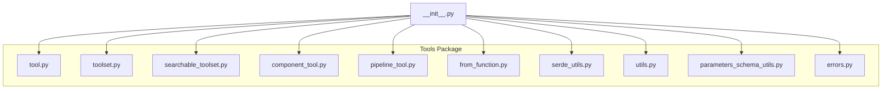
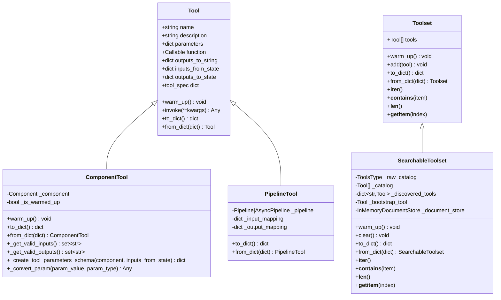
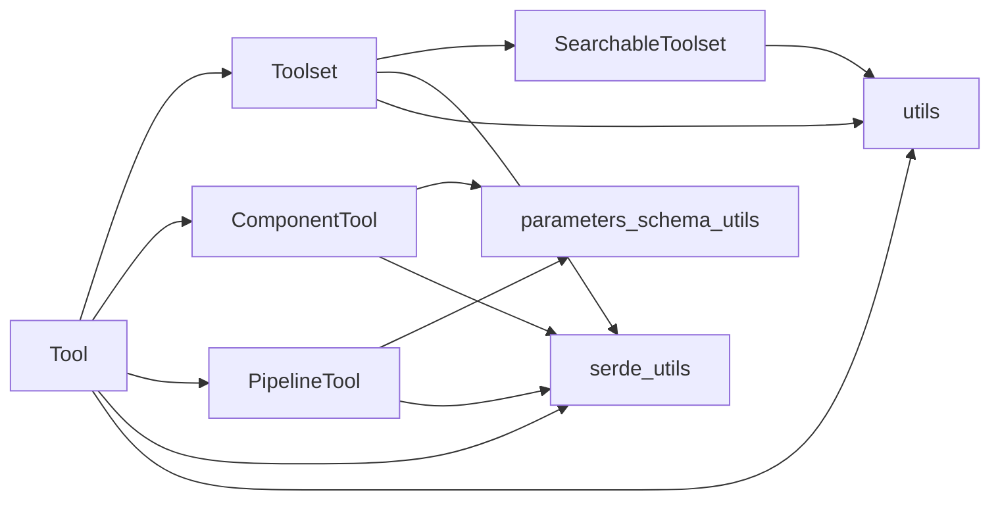
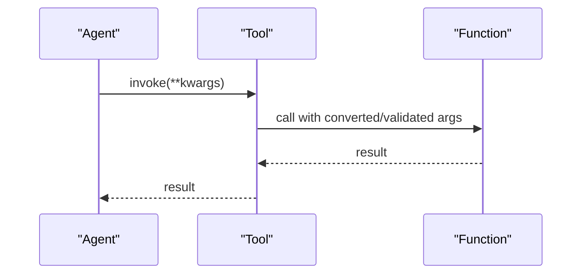
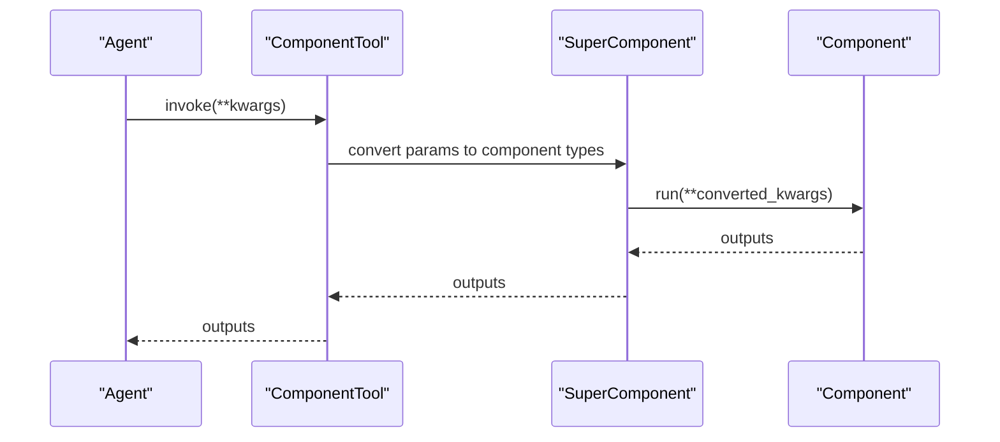
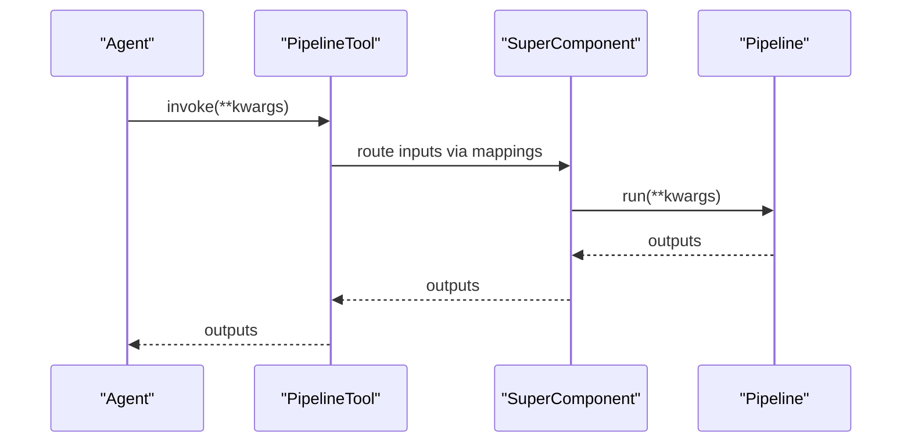

# Tool Integration

<cite>
**Referenced Files in This Document**
- [__init__.py](file://haystack/tools/__init__.py)
- [tool.py](file://haystack/tools/tool.py)
- [toolset.py](file://haystack/tools/toolset.py)
- [searchable_toolset.py](file://haystack/tools/searchable_toolset.py)
- [component_tool.py](file://haystack/tools/component_tool.py)
- [pipeline_tool.py](file://haystack/tools/pipeline_tool.py)
- [from_function.py](file://haystack/tools/from_function.py)
- [serde_utils.py](file://haystack/tools/serde_utils.py)
- [utils.py](file://haystack/tools/utils.py)
- [errors.py](file://haystack/tools/errors.py)
- [parameters_schema_utils.py](file://haystack/tools/parameters_schema_utils.py)
- [test_tool.py](file://test/tools/test_tool.py)
- [test_component_tool.py](file://test/tools/test_component_tool.py)
- [test_pipeline_tool.py](file://test/tools/test_pipeline_tool.py)
- [test_searchable_toolset.py](file://test/tools/test_searchable_toolset.py)
- [test_from_function.py](file://test/tools/test_from_function.py)
</cite>

## Table of Contents
1. [Introduction](#introduction)
2. [Project Structure](#project-structure)
3. [Core Components](#core-components)
4. [Architecture Overview](#architecture-overview)
5. [Detailed Component Analysis](#detailed-component-analysis)
6. [Dependency Analysis](#dependency-analysis)
7. [Performance Considerations](#performance-considerations)
8. [Troubleshooting Guide](#troubleshooting-guide)
9. [Conclusion](#conclusion)
10. [Appendices](#appendices)

## Introduction
This document explains Agent Tool Integration in the Haystack codebase. It covers how to create, manage, and execute tools, how to define tool functions and JSON schemas, and how to organize tools using Toolset and SearchableToolset. It details invocation workflows, parameter validation, result handling, and serialization. Specialized tool types are explained, including ComponentTool, PipelineTool, and tools created from functions. Practical examples, debugging tips, error handling, performance optimization, and security considerations are included to guide developers building robust tool ecosystems.

## Project Structure
The tool system is organized under the haystack/tools package. Key modules include:
- Tool base class and validation
- Toolset and SearchableToolset for organization and discovery
- ComponentTool and PipelineTool for wrapping Haystack components and pipelines
- Function-based tool creation utilities
- Serialization helpers and utility functions
- Parameter schema generation and validation utilities
- Tests validating behavior and edge cases

**Diagram sources**
- [__init__.py](file://haystack/tools/__init__.py#L9-L40)
- [tool.py](file://haystack/tools/tool.py#L18-L405)
- [toolset.py](file://haystack/tools/toolset.py#L13-L365)
- [searchable_toolset.py](file://haystack/tools/searchable_toolset.py#L21-L330)
- [component_tool.py](file://haystack/tools/component_tool.py#L37-L395)
- [pipeline_tool.py](file://haystack/tools/pipeline_tool.py#L21-L258)
- [from_function.py](file://haystack/tools/from_function.py#L16-L324)
- [serde_utils.py](file://haystack/tools/serde_utils.py#L16-L83)
- [utils.py](file://haystack/tools/utils.py#L14-L65)
- [parameters_schema_utils.py](file://haystack/tools/parameters_schema_utils.py#L23-L229)

**Section sources**
- [__init__.py](file://haystack/tools/__init__.py#L9-L40)

## Core Components
- Tool: The fundamental unit representing a callable function with a JSON schema, optional state mapping, and result formatting hooks. Provides validation, invocation, and serialization.
- Toolset: A container for grouping related tools, supporting iteration, membership checks, warm-up orchestration, and serialization.
- SearchableToolset: A dynamic toolset that exposes a bootstrap tool to search and load tools on demand using BM25 retrieval.
- ComponentTool: Wraps a Haystack Component as a Tool, generating a schema from component input sockets and type hints.
- PipelineTool: Wraps a Haystack Pipeline as a Tool, generating a schema from pipeline inputs and outputs via a SuperComponent.
- Function-based tools: Created via create_tool_from_function or the @tool decorator, generating JSON schemas from function signatures and annotations.
- Serialization utilities: Helpers to serialize/deserialize tools, toolsets, and mixed collections.
- Utilities: Functions to warm up tools, flatten tool catalogs, and manage tool lifecycle.

**Section sources**
- [tool.py](file://haystack/tools/tool.py#L18-L405)
- [toolset.py](file://haystack/tools/toolset.py#L13-L365)
- [searchable_toolset.py](file://haystack/tools/searchable_toolset.py#L21-L330)
- [component_tool.py](file://haystack/tools/component_tool.py#L37-L395)
- [pipeline_tool.py](file://haystack/tools/pipeline_tool.py#L21-L258)
- [from_function.py](file://haystack/tools/from_function.py#L16-L324)
- [serde_utils.py](file://haystack/tools/serde_utils.py#L16-L83)
- [utils.py](file://haystack/tools/utils.py#L14-L65)

## Architecture Overview
The tool ecosystem centers around the Tool abstraction. Specialized tool types extend Tool to integrate with Haystack components and pipelines. Toolset and SearchableToolset provide organizational and discovery mechanisms. Serialization utilities enable persistence and transport of tools and toolsets.

**Diagram sources**
- [tool.py](file://haystack/tools/tool.py#L18-L405)
- [toolset.py](file://haystack/tools/toolset.py#L13-L365)
- [searchable_toolset.py](file://haystack/tools/searchable_toolset.py#L21-L330)
- [component_tool.py](file://haystack/tools/component_tool.py#L37-L395)
- [pipeline_tool.py](file://haystack/tools/pipeline_tool.py#L21-L258)

## Detailed Component Analysis

### Tool Class
The Tool class defines the core contract for a callable tool:
- Attributes: name, description, parameters (JSON schema), function (callable), and optional mappings for inputs/outputs and result formatting.
- Validation: Ensures the function is synchronous, parameters form a valid JSON schema, and configuration structures for inputs/outputs are correct.
- Invocation: Executes the function with provided keyword arguments and wraps exceptions in a ToolInvocationError.
- Serialization: Serializes the function and handler callables to string identifiers and deserializes them back.

Key behaviors:
- Parameter validation via jsonschema Draft202012Validator.
- Validation of outputs_to_state and outputs_to_string structures.
- Validation of inputs_from_state against valid inputs (via subclasses overriding _get_valid_inputs).
- Tool specification exposed via tool_spec for LLM consumption.

Practical usage patterns:
- Define a function with typed parameters and optional annotations for descriptions.
- Create a Tool with a JSON schema derived from the function signature.
- Optionally configure inputs_from_state and outputs_to_state for state-driven tooling.
- Use outputs_to_string to format results for LLM consumption.

**Section sources**
- [tool.py](file://haystack/tools/tool.py#L18-L405)
- [errors.py](file://haystack/tools/errors.py#L14-L22)
- [test_tool.py](file://test/tools/test_tool.py#L34-L332)

### Toolset Organization
Toolset groups related tools and provides:
- Iterable interface (__iter__, __contains__, __len__, __getitem__).
- Addition of tools or merging of other toolsets with duplicate detection.
- Warm-up delegation to contained tools.
- Serialization of contained tools.

Usage patterns:
- Aggregate tools into a cohesive unit for pipelines or agents.
- Merge multiple toolsets to compose tool catalogs.
- Serialize/deserialize toolsets for persistence.

**Section sources**
- [toolset.py](file://haystack/tools/toolset.py#L13-L365)
- [test_tool.py](file://test/tools/test_tool.py#L319-L332)

### SearchableToolset for Dynamic Discovery
SearchableToolset enables:
- Passthrough mode for small catalogs (expose all tools).
- BM25-based discovery mode for larger catalogs via a bootstrap tool.
- Deferred flattening of catalogs to support lazy toolsets.
- Clearing discovered tools between runs.

Workflow:
- warm_up initializes document store and builds catalog.
- Bootstrap tool searches and loads tools on demand.
- Iteration yields bootstrap tool plus discovered tools.

**Section sources**
- [searchable_toolset.py](file://haystack/tools/searchable_toolset.py#L21-L330)
- [test_searchable_toolset.py](file://test/tools/test_searchable_toolset.py#L100-L784)

### ComponentTool: Wrapping Haystack Components
ComponentTool transforms a Haystack Component into a Tool:
- Generates a JSON schema from component input sockets and type hints.
- Validates inputs/outputs against component I/O.
- Converts parameters to component types and invokes run().
- Supports warm_up delegation to the underlying component.

Highlights:
- Automatic schema generation from component run method signature.
- Support for dataclasses, lists, and nested structures.
- Idempotent warm_up behavior.

**Section sources**
- [component_tool.py](file://haystack/tools/component_tool.py#L37-L395)
- [parameters_schema_utils.py](file://haystack/tools/parameters_schema_utils.py#L23-L229)
- [test_component_tool.py](file://test/tools/test_component_tool.py#L172-L800)

### PipelineTool: Wrapping Pipelines as Tools
PipelineTool wraps a Haystack Pipeline (sync or async) as a Tool:
- Uses a SuperComponent to expose pipeline inputs/outputs as a unified schema.
- Supports input_mapping and output_mapping to connect tool parameters to pipeline sockets.
- Persists pipeline state and mappings during serialization.

Key points:
- Validates pipeline type and supports both sync and async pipelines.
- Auto-generates parameter descriptions from underlying components.
- Preserves async/sync nature during serialization.

**Section sources**
- [pipeline_tool.py](file://haystack/tools/pipeline_tool.py#L21-L258)
- [test_pipeline_tool.py](file://test/tools/test_pipeline_tool.py#L96-L412)

### Function-Based Tools: create_tool_from_function and @tool
Two ways to create tools from functions:
- create_tool_from_function: Programmatically converts a function to a Tool, deriving a JSON schema from type hints and annotations.
- @tool decorator: Syntactic sugar around create_tool_from_function.

Features:
- Skips Callable parameters during schema generation.
- Removes redundant title keywords from schemas.
- Supports Annotated types and Literal enums.
- Raises SchemaGenerationError on failures.

**Section sources**
- [from_function.py](file://haystack/tools/from_function.py#L16-L324)
- [parameters_schema_utils.py](file://haystack/tools/parameters_schema_utils.py#L23-L229)
- [test_from_function.py](file://test/tools/test_from_function.py#L15-L321)

### Serialization, Deserialization, and Persistence
Serialization utilities:
- serialize_tools_or_toolset: Serializes a Toolset, list of Tools/Toolsets, or None.
- deserialize_tools_or_toolset_inplace: Deserializes in-place, supporting mixed types.

Tool and Toolset serialization:
- Tool.to_dict/from_dict: Serializes function and handler callables.
- Toolset.to_dict/from_dict: Serializes contained tools.
- ComponentTool/PipelineTool extend serialization to include component/pipeline state.

Best practices:
- Use qualified class names for type identification.
- Ensure handlers are serializable or convertible to/from string identifiers.
- Preserve async/sync pipeline distinction during serialization.

**Section sources**
- [serde_utils.py](file://haystack/tools/serde_utils.py#L16-L83)
- [tool.py](file://haystack/tools/tool.py#L273-L309)
- [toolset.py](file://haystack/tools/toolset.py#L241-L281)
- [component_tool.py](file://haystack/tools/component_tool.py#L266-L307)
- [pipeline_tool.py](file://haystack/tools/pipeline_tool.py#L210-L257)

### Tool Invocation Workflows, Parameter Validation, and Result Handling
Invocation flow:
- Tool.invoke executes the function with provided kwargs.
- ComponentTool converts parameters to component types before invoking run().
- PipelineTool uses SuperComponent to route inputs/outputs.

Validation:
- JSON schema validation for parameters.
- Validation of inputs_from_state against valid inputs.
- Validation of outputs_to_state against valid outputs (subclass-dependent).
- Outputs formatting via outputs_to_string handlers.

Result handling:
- Single or multiple output formats supported.
- raw_result mode for non-string results (e.g., images).
- Handlers transform outputs before string conversion.

**Section sources**
- [tool.py](file://haystack/tools/tool.py#L261-L271)
- [component_tool.py](file://haystack/tools/component_tool.py#L188-L205)
- [pipeline_tool.py](file://haystack/tools/pipeline_tool.py#L196-L204)
- [test_tool.py](file://test/tools/test_tool.py#L123-L142)

### Practical Examples
- Creating a function-based tool with annotations and invoking it.
- Building a Toolset and iterating over tools.
- Using SearchableToolset to discover tools via a bootstrap search.
- Converting a Haystack Component to a Tool and integrating with a pipeline.
- Wrapping a Pipeline as a Tool for agent usage.

These examples are validated by tests demonstrating schema generation, invocation, serialization, and integration.

**Section sources**
- [test_from_function.py](file://test/tools/test_from_function.py#L117-L210)
- [test_tool.py](file://test/tools/test_tool.py#L34-L122)
- [test_searchable_toolset.py](file://test/tools/test_searchable_toolset.py#L205-L277)
- [test_component_tool.py](file://test/tools/test_component_tool.py#L172-L214)
- [test_pipeline_tool.py](file://test/tools/test_pipeline_tool.py#L262-L352)

## Dependency Analysis
The tool system exhibits clear separation of concerns:
- Tool encapsulates function and schema.
- Toolset composes tools; SearchableToolset adds discovery.
- ComponentTool and PipelineTool depend on schema utilities and serialization.
- Serialization utilities depend on import/class resolution helpers.
- Tests validate cross-cutting behaviors like warm-up, flattening, and idempotence.

**Diagram sources**
- [tool.py](file://haystack/tools/tool.py#L18-L405)
- [toolset.py](file://haystack/tools/toolset.py#L13-L365)
- [searchable_toolset.py](file://haystack/tools/searchable_toolset.py#L21-L330)
- [component_tool.py](file://haystack/tools/component_tool.py#L37-L395)
- [pipeline_tool.py](file://haystack/tools/pipeline_tool.py#L21-L258)
- [parameters_schema_utils.py](file://haystack/tools/parameters_schema_utils.py#L23-L229)
- [serde_utils.py](file://haystack/tools/serde_utils.py#L16-L83)
- [utils.py](file://haystack/tools/utils.py#L14-L65)

**Section sources**
- [__init__.py](file://haystack/tools/__init__.py#L9-L40)

## Performance Considerations
- Warm-up strategy: Use Toolset.warm_up to pre-initialize tools and components. ComponentTool caches warm_up to avoid repeated initialization.
- Lazy toolsets: SearchableToolset defers catalog flattening until warm_up, enabling lazy toolsets to connect only when needed.
- Serialization overhead: Prefer serializing descriptors for dynamic toolsets rather than large tool instances to minimize payload size.
- Parameter conversion: ComponentTool’s type conversion and validation occur per invocation; cache or reuse tools where appropriate.
- BM25 indexing: SearchableToolset builds an in-memory document store; consider clearing discovered tools between runs to control memory usage.

[No sources needed since this section provides general guidance]

## Troubleshooting Guide
Common issues and resolutions:
- Async function not supported: Tools require synchronous functions; use sync wrappers or coroutines outside the tool boundary.
- Invalid JSON schema: Ensure parameters conform to JSON schema standards; validate with Draft202012Validator.
- Invalid configuration structures: Check outputs_to_state and outputs_to_string for correct keys and types.
- Unknown parameter or output names: Validate inputs_from_state and outputs_to_state against valid inputs/outputs.
- Schema generation errors: Ensure all function parameters have type hints and avoid unsupported types like Callable.
- Tool invocation errors: Inspect ToolInvocationError for detailed failure context.

**Section sources**
- [tool.py](file://haystack/tools/tool.py#L103-L194)
- [errors.py](file://haystack/tools/errors.py#L14-L22)
- [test_tool.py](file://test/tools/test_tool.py#L47-L114)
- [test_from_function.py](file://test/tools/test_from_function.py#L88-L101)

## Conclusion
The Haystack tool system provides a robust, extensible framework for building agent-capable tools. Tools unify function-based capabilities with structured schemas, while Toolset and SearchableToolset offer scalable organization and discovery. ComponentTool and PipelineTool bridge Haystack components and pipelines into the tool ecosystem. With comprehensive validation, serialization, and utility functions, developers can build, manage, and deploy tools efficiently, debug issues effectively, and optimize performance for production-grade agents.

[No sources needed since this section summarizes without analyzing specific files]

## Appendices

### API and Workflow Sequences

#### Tool Invocation Sequence

**Diagram sources**
- [tool.py](file://haystack/tools/tool.py#L261-L271)

#### ComponentTool Invocation Sequence

**Diagram sources**
- [component_tool.py](file://haystack/tools/component_tool.py#L188-L205)

#### PipelineTool Invocation Sequence

**Diagram sources**
- [pipeline_tool.py](file://haystack/tools/pipeline_tool.py#L196-L204)

### JSON Schema Specification Notes
- Parameters must be a valid JSON schema; Draft202012Validator.check_schema is used for validation.
- Function-based tools derive schemas from type hints and annotations; Callable types are skipped.
- ComponentTool and PipelineTool generate schemas from component input sockets and pipeline mappings.
- Redundant title keywords are stripped from schemas to keep them concise.

**Section sources**
- [tool.py](file://haystack/tools/tool.py#L112-L116)
- [from_function.py](file://haystack/tools/from_function.py#L158-L173)
- [parameters_schema_utils.py](file://haystack/tools/parameters_schema_utils.py#L23-L43)

### Security Considerations
- Avoid exposing Callable parameters in schemas; they are intentionally skipped.
- Validate and sanitize inputs from LLM-generated calls; rely on JSON schema validation and type conversion.
- Limit tool capabilities to least privilege; avoid granting broad filesystem or network access.
- Review handler callables during serialization/deserialization to ensure safe execution contexts.

[No sources needed since this section provides general guidance]