# Evaluation Systems

<cite>
**Referenced Files in This Document**
- [eval_run_result.py](file://haystack/evaluation/eval_run_result.py)
- [__init__.py](file://haystack/evaluation/__init__.py)
- [__init__.py](file://haystack/components/evaluators/__init__.py)
- [document_map.py](file://haystack/components/evaluators/document_map.py)
- [document_mrr.py](file://haystack/components/evaluators/document_mrr.py)
- [document_ndcg.py](file://haystack/components/evaluators/document_ndcg.py)
- [document_recall.py](file://haystack/components/evaluators/document_recall.py)
- [llm_evaluator.py](file://haystack/components/evaluators/llm_evaluator.py)
- [context_relevance.py](file://haystack/components/evaluators/context_relevance.py)
- [faithfulness.py](file://haystack/components/evaluators/faithfulness.py)
- [test_eval_run_result.py](file://test/evaluation/test_eval_run_result.py)
- [test_evaluation_pipeline.py](file://e2e/pipelines/test_evaluation_pipeline.py)
- [faithfulnessevaluator.mdx](file://docs-website/docs/pipeline-components/evaluators/faithfulnessevaluator.mdx)
- [documentndcgevaluator.mdx](file://docs-website/versioned_docs/version-2.18/pipeline-components/evaluators/documentndcgevaluator.mdx)
</cite>

## Table of Contents
1. [Introduction](#introduction)
2. [Project Structure](#project-structure)
3. [Core Components](#core-components)
4. [Architecture Overview](#architecture-overview)
5. [Detailed Component Analysis](#detailed-component-analysis)
6. [Dependency Analysis](#dependency-analysis)
7. [Performance Considerations](#performance-considerations)
8. [Troubleshooting Guide](#troubleshooting-guide)
9. [Conclusion](#conclusion)
10. [Appendices](#appendices)

## Introduction
This document explains Haystack’s evaluation systems with a focus on:
- Statistical evaluation for retrieval and generation quality
- Model-based evaluation using LLMs
- The EvaluationRunResult class and evaluation workflow management
- Practical patterns for building, running, and interpreting evaluation pipelines
- Best practices, benchmarking, performance optimization, and result visualization/reporting

It synthesizes the official evaluation components, evaluation result container, and end-to-end pipeline examples to help both newcomers and experienced users build robust evaluation workflows.

## Project Structure
Haystack organizes evaluation under:
- Evaluation runtime result container: haystack/evaluation/eval_run_result.py
- Evaluators library: haystack/components/evaluators/*
- Tests and end-to-end examples: test/evaluation/* and e2e/pipelines/test_evaluation_pipeline.py

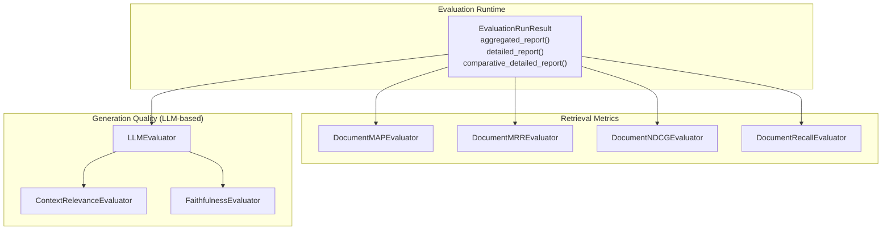

**Diagram sources**
- [eval_run_result.py](file://haystack/evaluation/eval_run_result.py#L18-L232)
- [document_map.py](file://haystack/components/evaluators/document_map.py#L10-L137)
- [document_mrr.py](file://haystack/components/evaluators/document_mrr.py#L10-L131)
- [document_ndcg.py](file://haystack/components/evaluators/document_ndcg.py#L11-L134)
- [document_recall.py](file://haystack/components/evaluators/document_recall.py#L40-L180)
- [llm_evaluator.py](file://haystack/components/evaluators/llm_evaluator.py#L22-L363)
- [context_relevance.py](file://haystack/components/evaluators/context_relevance.py#L41-L218)
- [faithfulness.py](file://haystack/components/evaluators/faithfulness.py#L50-L212)

**Section sources**
- [__init__.py](file://haystack/evaluation/__init__.py#L10-L16)
- [__init__.py](file://haystack/components/evaluators/__init__.py#L10-L20)

## Core Components
- EvaluationRunResult: encapsulates evaluation inputs and results, supports aggregated and detailed reports, and enables comparative analysis across runs.
- Retrieval evaluators: DocumentMAPEvaluator, DocumentMRREvaluator, DocumentNDCGEvaluator, DocumentRecallEvaluator.
- Generation quality evaluators: LLMEvaluator, ContextRelevanceEvaluator, FaithfulnessEvaluator.

Key responsibilities:
- Validation of inputs and alignment of sample counts
- Aggregation of per-sample scores into a single score and per-sample breakdown
- Flexible output formats (JSON, CSV, DataFrame) via EvaluationRunResult
- LLM-based evaluation with structured prompts, examples, and optional custom generators

**Section sources**
- [eval_run_result.py](file://haystack/evaluation/eval_run_result.py#L18-L232)
- [document_map.py](file://haystack/components/evaluators/document_map.py#L10-L137)
- [document_mrr.py](file://haystack/components/evaluators/document_mrr.py#L10-L131)
- [document_ndcg.py](file://haystack/components/evaluators/document_ndcg.py#L11-L134)
- [document_recall.py](file://haystack/components/evaluators/document_recall.py#L40-L180)
- [llm_evaluator.py](file://haystack/components/evaluators/llm_evaluator.py#L22-L363)
- [context_relevance.py](file://haystack/components/evaluators/context_relevance.py#L41-L218)
- [faithfulness.py](file://haystack/components/evaluators/faithfulness.py#L50-L212)

## Architecture Overview
The evaluation architecture centers on:
- Pipeline-driven execution of evaluators
- Standardized output schema with score and individual_scores
- EvaluationRunResult for post-run aggregation and reporting
- Optional LLM-based evaluators leveraging prompts and examples

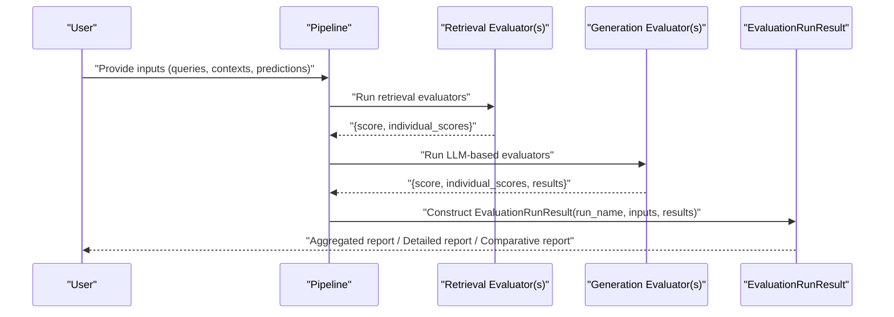

**Diagram sources**
- [eval_run_result.py](file://haystack/evaluation/eval_run_result.py#L23-L62)
- [document_map.py](file://haystack/components/evaluators/document_map.py#L93-L136)
- [document_mrr.py](file://haystack/components/evaluators/document_mrr.py#L91-L130)
- [document_ndcg.py](file://haystack/components/evaluators/document_ndcg.py#L37-L68)
- [document_recall.py](file://haystack/components/evaluators/document_recall.py#L141-L170)
- [llm_evaluator.py](file://haystack/components/evaluators/llm_evaluator.py#L178-L241)
- [context_relevance.py](file://haystack/components/evaluators/context_relevance.py#L159-L188)
- [faithfulness.py](file://haystack/components/evaluators/faithfulness.py#L149-L182)

## Detailed Component Analysis

### EvaluationRunResult
Purpose:
- Encapsulate evaluation run inputs and results
- Provide aggregated and detailed reports
- Enable comparative analysis across runs
- Support JSON, CSV, and DataFrame outputs

Highlights:
- Validates that inputs and per-metric individual_scores align in length
- Enforces presence of score and individual_scores per metric
- Offers three report modes:
  - aggregated_report(): returns a compact summary
  - detailed_report(): returns per-sample breakdown
  - comparative_detailed_report(): compares two runs’ detailed reports

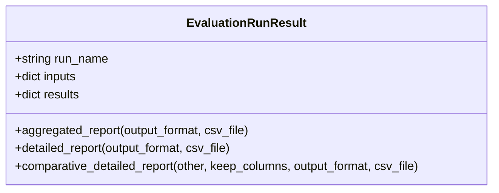

**Diagram sources**
- [eval_run_result.py](file://haystack/evaluation/eval_run_result.py#L18-L232)

**Section sources**
- [eval_run_result.py](file://haystack/evaluation/eval_run_result.py#L23-L62)
- [eval_run_result.py](file://haystack/evaluation/eval_run_result.py#L122-L163)
- [eval_run_result.py](file://haystack/evaluation/eval_run_result.py#L165-L231)
- [test_eval_run_result.py](file://test/evaluation/test_eval_run_result.py#L30-L61)

### Statistical Retrieval Metrics

#### DocumentMAPEvaluator
- Computes Mean Average Precision across queries
- Supports comparison on content, id, or meta fields
- Returns per-query AP and overall MAP

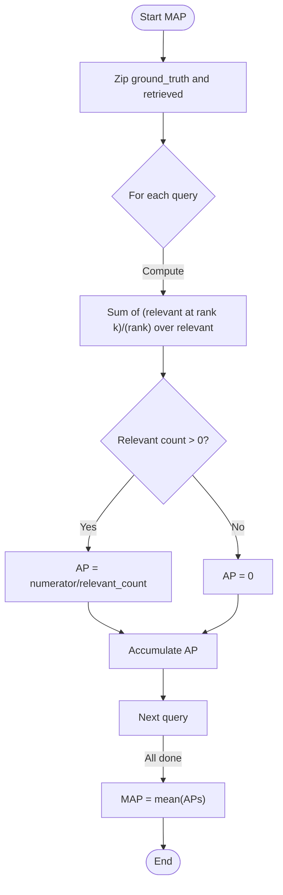

**Diagram sources**
- [document_map.py](file://haystack/components/evaluators/document_map.py#L93-L136)

**Section sources**
- [document_map.py](file://haystack/components/evaluators/document_map.py#L10-L137)

#### DocumentMRREvaluator
- Computes Mean Reciprocal Rank
- First relevant item determines RR; position influences inverse rank

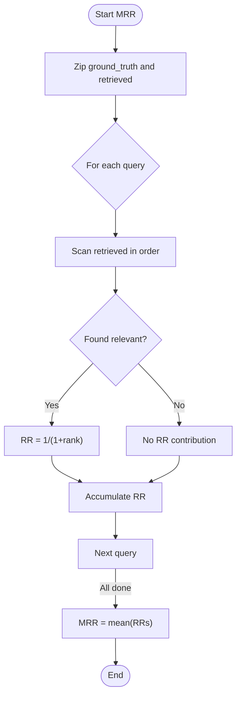

**Diagram sources**
- [document_mrr.py](file://haystack/components/evaluators/document_mrr.py#L91-L130)

**Section sources**
- [document_mrr.py](file://haystack/components/evaluators/document_mrr.py#L10-L131)

#### DocumentNDCGEvaluator
- Computes Normalized Discounted Cumulative Gain
- Accepts binary relevance or graded relevance via document scores
- Validates mixed-scores per query ground truth

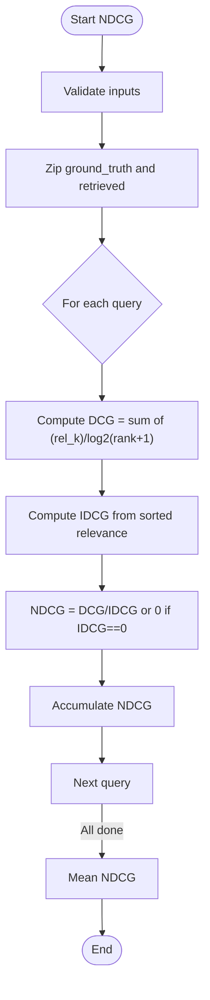

**Diagram sources**
- [document_ndcg.py](file://haystack/components/evaluators/document_ndcg.py#L37-L133)

**Section sources**
- [document_ndcg.py](file://haystack/components/evaluators/document_ndcg.py#L11-L134)

#### DocumentRecallEvaluator
- Supports SINGLE_HIT and MULTI_HIT modes
- SINGLE_HIT: 0/1 per query based on any relevant retrieval
- MULTI_HIT: fraction of relevant retrieved vs total relevant

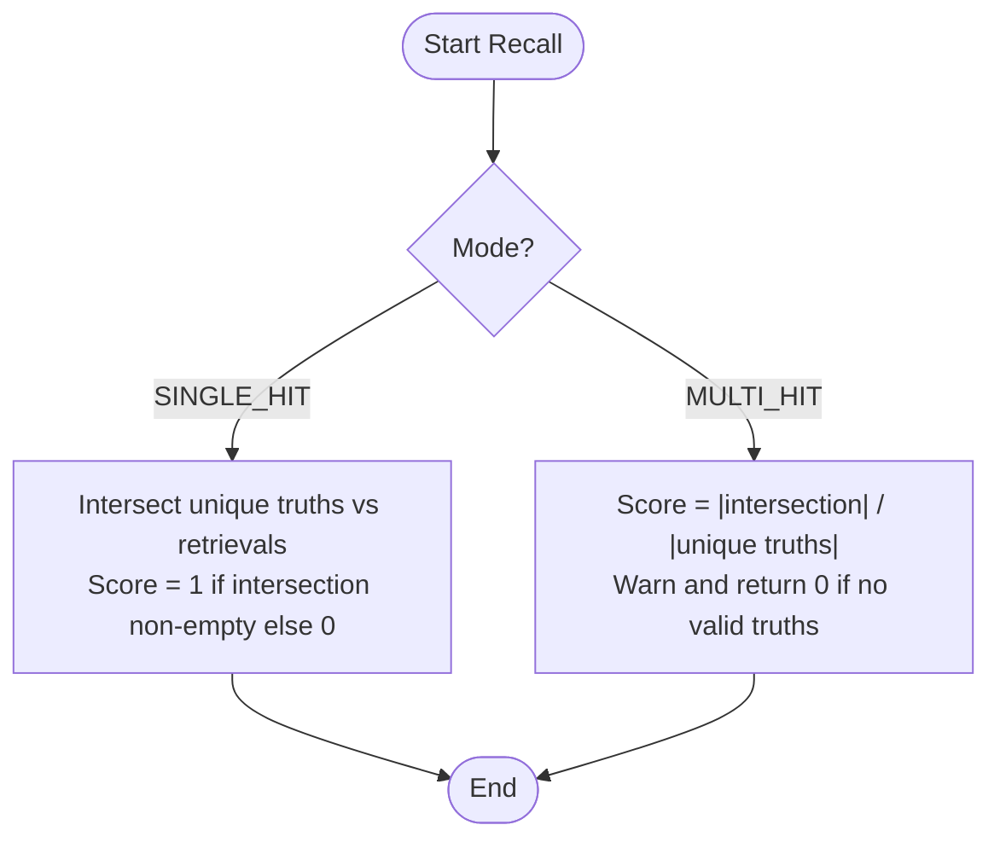

**Diagram sources**
- [document_recall.py](file://haystack/components/evaluators/document_recall.py#L113-L170)

**Section sources**
- [document_recall.py](file://haystack/components/evaluators/document_recall.py#L40-L180)

### Model-Based Evaluation Using LLMs

#### LLMEvaluator
- Generic LLM-based evaluator that:
  - Accepts instructions, inputs, outputs, and examples
  - Builds a structured prompt and invokes a ChatGenerator
  - Returns per-sample results and aggregates scores
- Supports progress bar, error handling, and optional custom generator

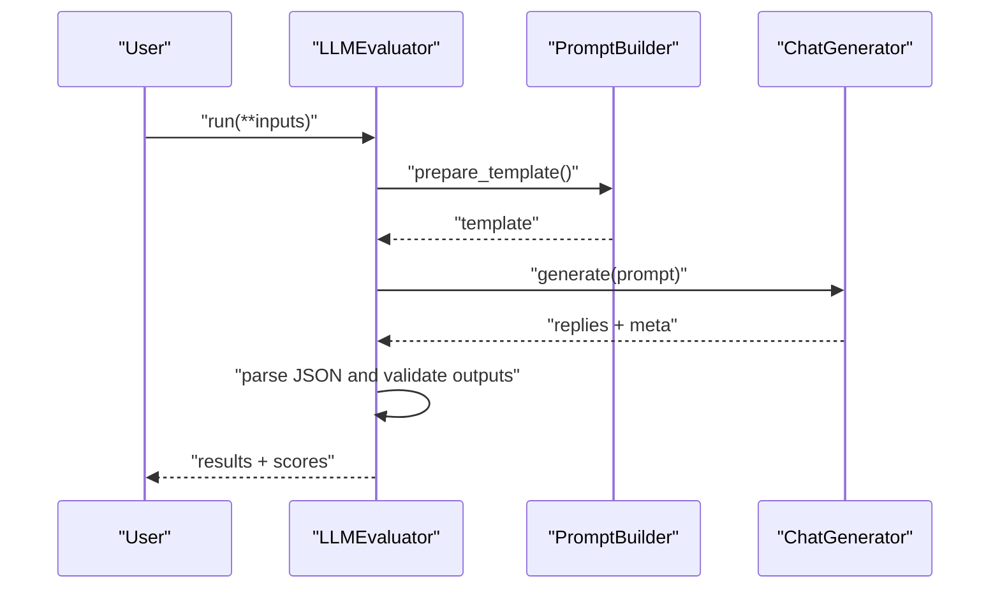

**Diagram sources**
- [llm_evaluator.py](file://haystack/components/evaluators/llm_evaluator.py#L178-L241)
- [llm_evaluator.py](file://haystack/components/evaluators/llm_evaluator.py#L243-L286)

**Section sources**
- [llm_evaluator.py](file://haystack/components/evaluators/llm_evaluator.py#L22-L363)

#### ContextRelevanceEvaluator
- Inherits from LLMEvaluator
- Extracts relevant statements from contexts for each question
- Produces binary relevance scores and per-statement breakdown

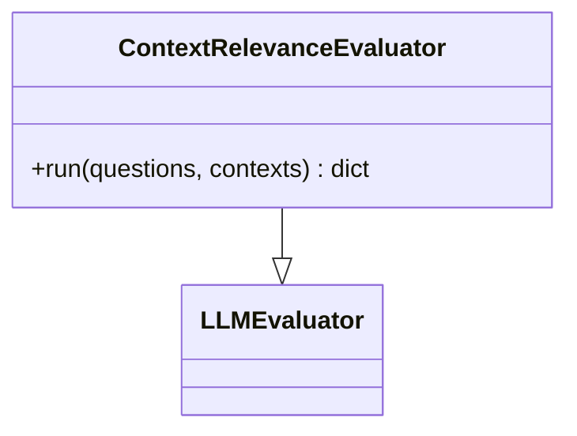

**Diagram sources**
- [context_relevance.py](file://haystack/components/evaluators/context_relevance.py#L41-L218)
- [llm_evaluator.py](file://haystack/components/evaluators/llm_evaluator.py#L22-L363)

**Section sources**
- [context_relevance.py](file://haystack/components/evaluators/context_relevance.py#L41-L218)

#### FaithfulnessEvaluator
- Inherits from LLMEvaluator
- Decomposes predicted answers into statements and checks inferencibility from contexts
- Returns per-answer faithfulness score and per-statement scores

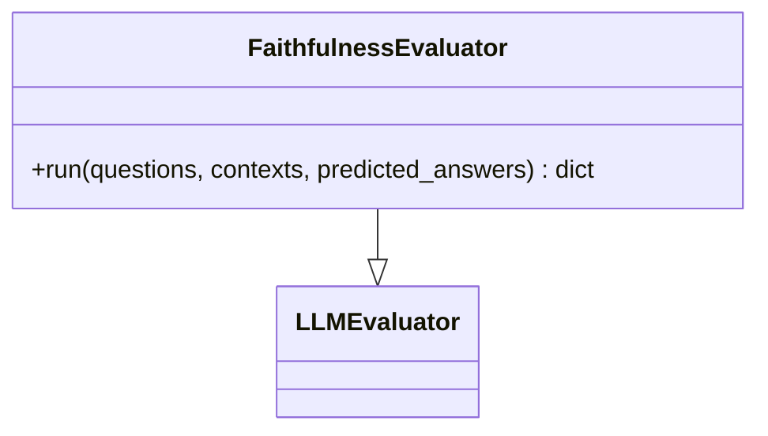

**Diagram sources**
- [faithfulness.py](file://haystack/components/evaluators/faithfulness.py#L50-L212)
- [llm_evaluator.py](file://haystack/components/evaluators/llm_evaluator.py#L22-L363)

**Section sources**
- [faithfulness.py](file://haystack/components/evaluators/faithfulness.py#L50-L212)

### Evaluation Workflow Management
- Build a Pipeline with evaluators
- Provide aligned lists of inputs (queries, contexts, predicted answers, retrieved documents)
- Collect outputs with score and individual_scores
- Wrap results in EvaluationRunResult for reporting and comparison

Example patterns:
- Retrieval evaluation with MAP/MRR/NDCG/Recall
- Generation quality evaluation with ContextRelevance and Faithfulness
- Comparative analysis across runs using EvaluationRunResult.comparative_detailed_report

**Section sources**
- [faithfulnessevaluator.mdx](file://docs-website/docs/pipeline-components/evaluators/faithfulnessevaluator.mdx#L100-L143)
- [documentndcgevaluator.mdx](file://docs-website/versioned_docs/version-2.18/pipeline-components/evaluators/documentndcgevaluator.mdx#L71-L97)
- [test_evaluation_pipeline.py](file://e2e/pipelines/test_evaluation_pipeline.py)

## Dependency Analysis
- EvaluationRunResult depends on:
  - pandas availability for DataFrame output
  - CSV writer for CSV export
- Retrieval evaluators depend on Document comparison fields and rely on consistent input shapes
- LLM-based evaluators depend on a ChatGenerator and PromptBuilder; they validate inputs and handle parsing errors

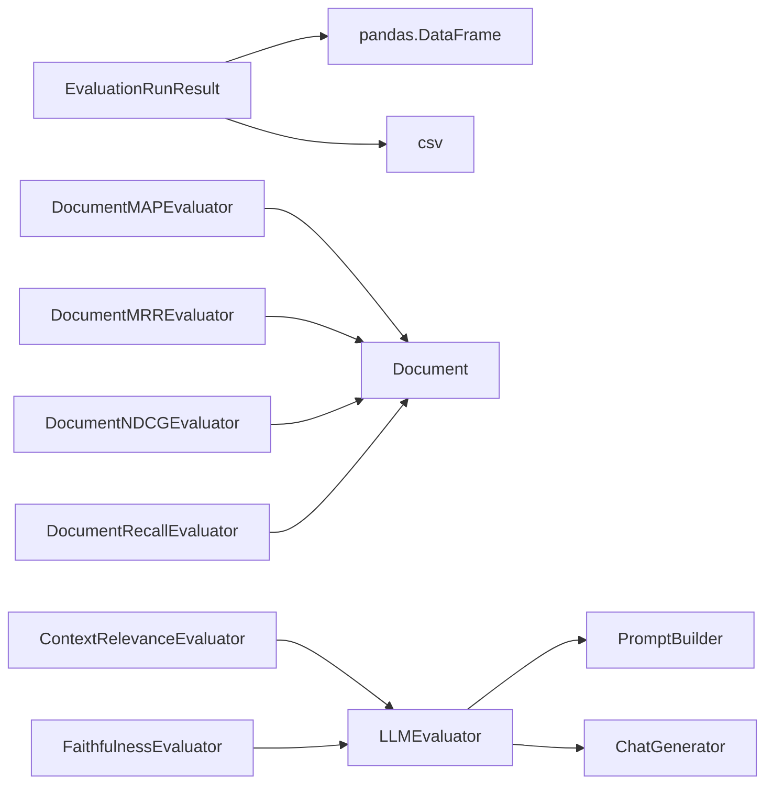

**Diagram sources**
- [eval_run_result.py](file://haystack/evaluation/eval_run_result.py#L100-L120)
- [document_map.py](file://haystack/components/evaluators/document_map.py#L7-L8)
- [document_mrr.py](file://haystack/components/evaluators/document_mrr.py#L7-L8)
- [document_ndcg.py](file://haystack/components/evaluators/document_ndcg.py#L8-L9)
- [document_recall.py](file://haystack/components/evaluators/document_recall.py#L8-L9)
- [llm_evaluator.py](file://haystack/components/evaluators/llm_evaluator.py#L10-L16)
- [context_relevance.py](file://haystack/components/evaluators/context_relevance.py#L8-L12)
- [faithfulness.py](file://haystack/components/evaluators/faithfulness.py#L9-L13)

**Section sources**
- [__init__.py](file://haystack/components/evaluators/__init__.py#L10-L20)

## Performance Considerations
- Prefer batched inputs and consistent list lengths to avoid repeated validation overhead
- Use EvaluationRunResult’s aggregated_report for quick summaries; switch to detailed_report only when needed
- For LLM-based evaluators:
  - Warm up the generator when possible
  - Limit concurrent requests and enable progress bars thoughtfully
  - Use examples to reduce ambiguity and improve reliability
- For retrieval metrics:
  - Normalize documents consistently before evaluation to maximize meaningful comparisons
  - Consider ranking-aware metrics (MRR, NDCG) when order matters; otherwise, simpler metrics (Recall) may suffice

[No sources needed since this section provides general guidance]

## Troubleshooting Guide
Common issues and resolutions:
- EvaluationRunResult validation errors:
  - Missing inputs or mismatched lengths
  - Missing score or individual_scores in results
  - Individual scores length mismatch with inputs
- LLM-based evaluator errors:
  - Unbalanced or invalid examples
  - Mismatched input list lengths
  - Parsing failures due to unexpected JSON structure
- Retrieval evaluator errors:
  - Mismatched lengths between ground_truth_documents and retrieved_documents
  - Unsupported document_comparison_field values

**Section sources**
- [test_eval_run_result.py](file://test/evaluation/test_eval_run_result.py#L30-L61)
- [llm_evaluator.py](file://haystack/components/evaluators/llm_evaluator.py#L124-L177)
- [llm_evaluator.py](file://haystack/components/evaluators/llm_evaluator.py#L327-L362)
- [document_map.py](file://haystack/components/evaluators/document_map.py#L111-L113)
- [document_mrr.py](file://haystack/components/evaluators/document_mrr.py#L109-L111)
- [document_ndcg.py](file://haystack/components/evaluators/document_ndcg.py#L85-L96)
- [document_recall.py](file://haystack/components/evaluators/document_recall.py#L159-L161)

## Conclusion
Haystack’s evaluation systems combine robust statistical retrieval metrics with flexible, LLM-powered quality assessment. EvaluationRunResult centralizes result handling and reporting, enabling straightforward comparative analysis. By structuring pipelines with aligned inputs and leveraging standardized outputs, teams can efficiently benchmark retrieval and generation quality, iterate on improvements, and produce actionable insights.

[No sources needed since this section summarizes without analyzing specific files]

## Appendices

### Practical Examples Index
- Retrieval evaluation with MAP/MRR/NDCG/Recall:
  - See end-to-end pipeline example
- Generation quality evaluation with ContextRelevance and Faithfulness:
  - See FaithfulnessEvaluator documentation example
- Comparative evaluation across runs:
  - Use EvaluationRunResult.comparative_detailed_report

**Section sources**
- [test_evaluation_pipeline.py](file://e2e/pipelines/test_evaluation_pipeline.py)
- [faithfulnessevaluator.mdx](file://docs-website/docs/pipeline-components/evaluators/faithfulnessevaluator.mdx#L100-L143)
- [documentndcgevaluator.mdx](file://docs-website/versioned_docs/version-2.18/pipeline-components/evaluators/documentndcgevaluator.mdx#L71-L97)