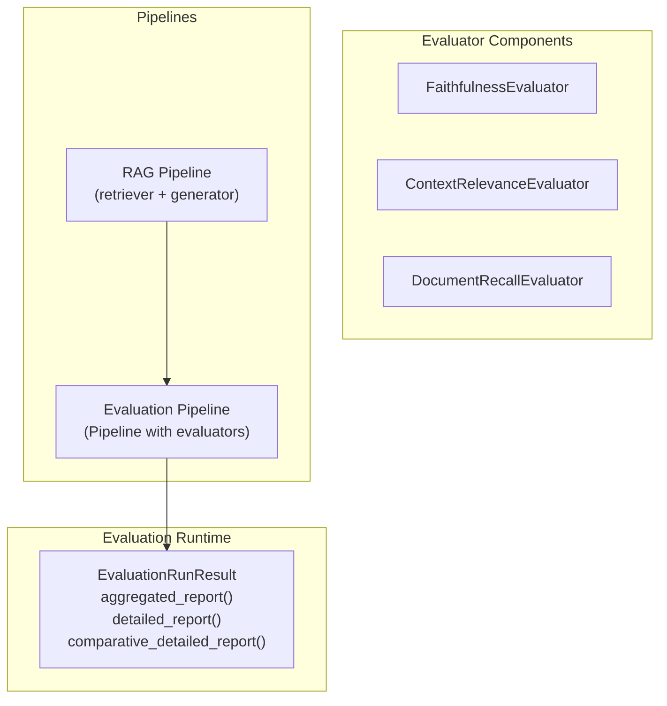
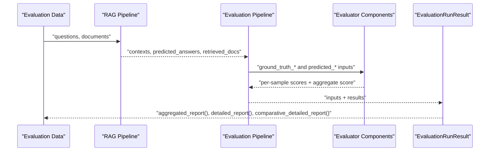
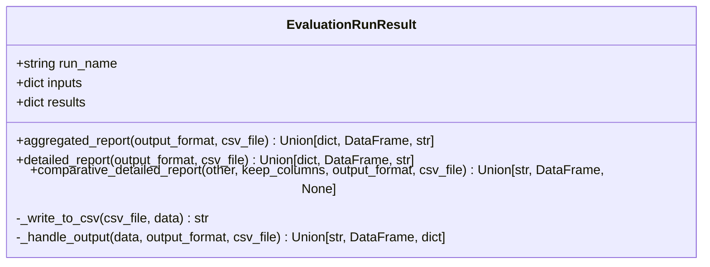
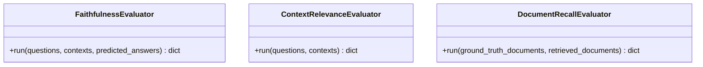
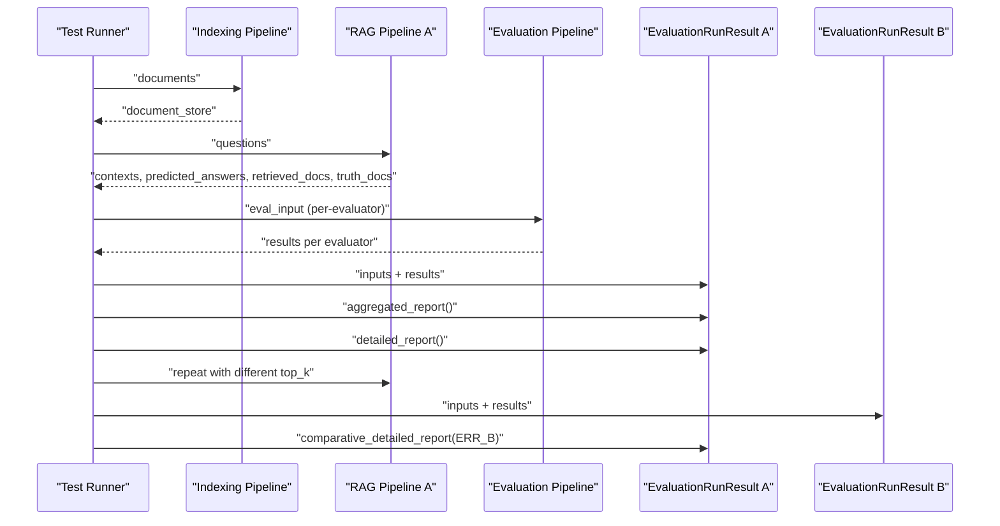
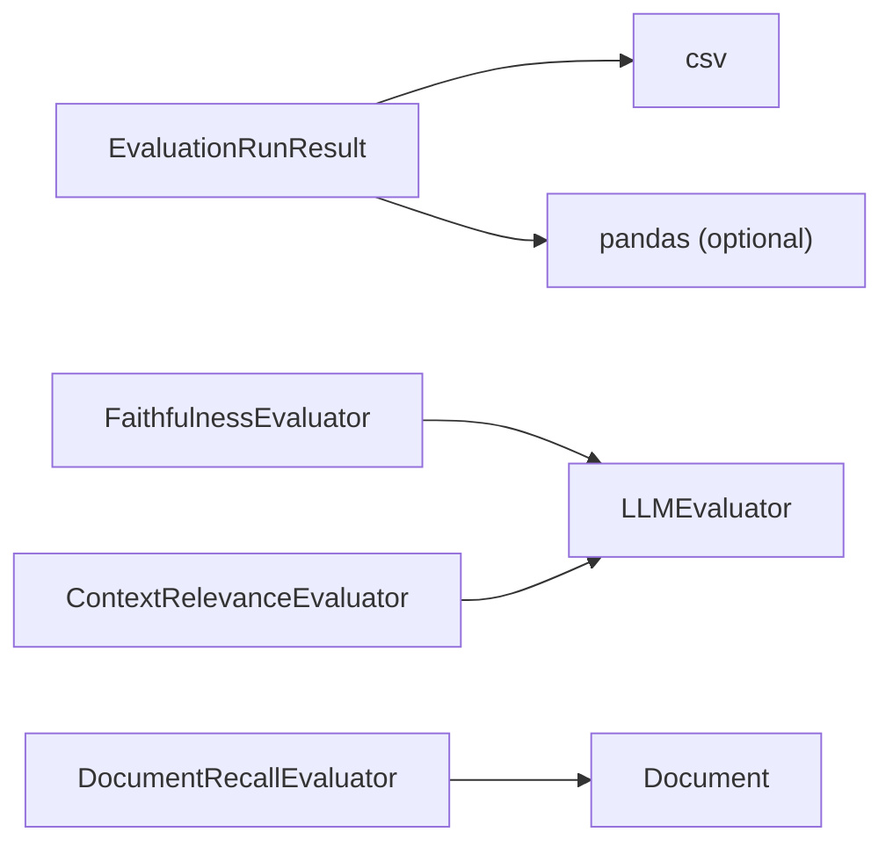

# Evaluation Workflow and Management

<cite>
**Referenced Files in This Document**
- [eval_run_result.py](file://haystack/evaluation/eval_run_result.py)
- [__init__.py](file://haystack/evaluation/__init__.py)
- [test_eval_run_result.py](file://test/evaluation/test_eval_run_result.py)
- [test_evaluation_pipeline.py](file://e2e/pipelines/test_evaluation_pipeline.py)
- [evaluators __init__.py](file://haystack/components/evaluators/__init__.py)
- [faithfulness.py](file://haystack/components/evaluators/faithfulness.py)
- [context_relevance.py](file://haystack/components/evaluators/context_relevance.py)
- [document_recall.py](file://haystack/components/evaluators/document_recall.py)
</cite>

## Table of Contents
1. [Introduction](#introduction)
2. [Project Structure](#project-structure)
3. [Core Components](#core-components)
4. [Architecture Overview](#architecture-overview)
5. [Detailed Component Analysis](#detailed-component-analysis)
6. [Dependency Analysis](#dependency-analysis)
7. [Performance Considerations](#performance-considerations)
8. [Troubleshooting Guide](#troubleshooting-guide)
9. [Conclusion](#conclusion)
10. [Appendices](#appendices)

## Introduction
This document explains how to build, execute, and interpret evaluation workflows in Haystack. It focuses on the complete pipeline from preparing evaluation data and establishing ground truth, to configuring and running evaluators, collecting results, and generating reports. It also documents the EvaluationRunResult class that encapsulates evaluation runs, manages inputs and results, and supports multiple output formats (JSON, CSV, DataFrame). Practical examples demonstrate building evaluation pipelines for RAG systems, comparing runs, and exporting results.

## Project Structure
Haystack’s evaluation ecosystem is organized around:
- Evaluation runtime result container: EvaluationRunResult
- Evaluator components (document and answer quality metrics)
- End-to-end evaluation pipeline tests that wire pipelines, evaluators, and result containers

**Diagram sources**
- [eval_run_result.py](file://haystack/evaluation/eval_run_result.py#L18-L232)
- [faithfulness.py](file://haystack/components/evaluators/faithfulness.py#L50-L182)
- [context_relevance.py](file://haystack/components/evaluators/context_relevance.py#L41-L188)
- [document_recall.py](file://haystack/components/evaluators/document_recall.py#L40-L170)
- [test_evaluation_pipeline.py](file://e2e/pipelines/test_evaluation_pipeline.py#L75-L95)

**Section sources**
- [eval_run_result.py](file://haystack/evaluation/eval_run_result.py#L1-L232)
- [evaluators __init__.py](file://haystack/components/evaluators/__init__.py#L10-L34)
- [test_evaluation_pipeline.py](file://e2e/pipelines/test_evaluation_pipeline.py#L75-L95)

## Core Components
- EvaluationRunResult: Encapsulates inputs and results of an evaluation run, validates consistency, and exposes report generation methods for aggregated, detailed, and comparative views. Supports JSON, CSV, and DataFrame outputs.
- Evaluator components: Document-level (e.g., DocumentRecallEvaluator) and answer-quality (e.g., FaithfulnessEvaluator, ContextRelevanceEvaluator) metrics that compute per-sample scores and aggregate scores.

Key responsibilities:
- Data preparation: Build inputs mapping column names to aligned lists and results mapping metric names to dicts with score and individual_scores.
- Ground truth establishment: Provide lists of ground truth documents or answers aligned with predictions.
- Pipeline configuration: Compose evaluators into a Pipeline and connect them to outputs from a RAG or retrieval pipeline.
- Execution: Run the evaluation pipeline and collect results.
- Reporting: Generate aggregated, detailed, and comparative reports via EvaluationRunResult.

**Section sources**
- [eval_run_result.py](file://haystack/evaluation/eval_run_result.py#L18-L232)
- [faithfulness.py](file://haystack/components/evaluators/faithfulness.py#L50-L182)
- [context_relevance.py](file://haystack/components/evaluators/context_relevance.py#L41-L188)
- [document_recall.py](file://haystack/components/evaluators/document_recall.py#L40-L170)

## Architecture Overview
The evaluation workflow connects a RAG or retrieval pipeline to a set of evaluators, then wraps the results in an EvaluationRunResult for reporting and comparison.

**Diagram sources**
- [test_evaluation_pipeline.py](file://e2e/pipelines/test_evaluation_pipeline.py#L111-L134)
- [test_evaluation_pipeline.py](file://e2e/pipelines/test_evaluation_pipeline.py#L211-L223)
- [eval_run_result.py](file://haystack/evaluation/eval_run_result.py#L122-L163)

## Detailed Component Analysis

### EvaluationRunResult: Managing Evaluation Runs
EvaluationRunResult stores run metadata, validates inputs and results, and provides report generation methods.

- Initialization validates:
  - Non-empty inputs
  - Equal-length input lists
  - Presence of score and individual_scores for each metric
  - Length consistency between individual_scores and inputs
- Report methods:
  - aggregated_report(): returns a compact summary with metric names and aggregate scores
  - detailed_report(): returns a long-format table with inputs plus per-metric individual scores
  - comparative_detailed_report(): merges two runs’ detailed reports, optionally keeping selected input columns, and prefixes metric columns with run names
- Output formatting:
  - json: returns a dictionary
  - df: returns a pandas DataFrame (requires pandas)
  - csv: writes to a file and returns a status message

**Diagram sources**
- [eval_run_result.py](file://haystack/evaluation/eval_run_result.py#L18-L232)

**Section sources**
- [eval_run_result.py](file://haystack/evaluation/eval_run_result.py#L23-L62)
- [eval_run_result.py](file://haystack/evaluation/eval_run_result.py#L122-L163)
- [eval_run_result.py](file://haystack/evaluation/eval_run_result.py#L165-L231)

### Evaluator Components: Inputs, Outputs, and Behavior
- FaithfulnessEvaluator: Computes statement-level and answer-level faithfulness scores from questions, contexts, and predicted answers. Produces per-sample scores and an aggregate score.
- ContextRelevanceEvaluator: Determines whether provided contexts are relevant to questions, returning per-sample binary scores and an aggregate score.
- DocumentRecallEvaluator: Calculates recall in single-hit or multi-hit modes using configurable document comparison fields.

**Diagram sources**
- [faithfulness.py](file://haystack/components/evaluators/faithfulness.py#L50-L182)
- [context_relevance.py](file://haystack/components/evaluators/context_relevance.py#L41-L188)
- [document_recall.py](file://haystack/components/evaluators/document_recall.py#L40-L170)

**Section sources**
- [faithfulness.py](file://haystack/components/evaluators/faithfulness.py#L149-L182)
- [context_relevance.py](file://haystack/components/evaluators/context_relevance.py#L159-L188)
- [document_recall.py](file://haystack/components/evaluators/document_recall.py#L141-L170)

### End-to-End Evaluation Pipeline Example
This example demonstrates:
- Building a RAG pipeline and indexing documents
- Running the RAG pipeline to collect contexts, predicted answers, retrieved documents, and ground truth documents
- Configuring an evaluation pipeline with multiple evaluators
- Constructing EvaluationRunResult inputs and results
- Generating aggregated, detailed, and comparative reports

**Diagram sources**
- [test_evaluation_pipeline.py](file://e2e/pipelines/test_evaluation_pipeline.py#L198-L223)
- [test_evaluation_pipeline.py](file://e2e/pipelines/test_evaluation_pipeline.py#L255-L268)
- [test_evaluation_pipeline.py](file://e2e/pipelines/test_evaluation_pipeline.py#L269-L291)

**Section sources**
- [test_evaluation_pipeline.py](file://e2e/pipelines/test_evaluation_pipeline.py#L175-L291)

## Dependency Analysis
- Lazy imports: EvaluationRunResult uses lazy imports for pandas to avoid hard dependencies.
- Evaluator components depend on LLMEvaluator (via FaithfulnessEvaluator and ContextRelevanceEvaluator) and on document utilities (DocumentRecallEvaluator).
- EvaluationRunResult depends on CSV and pandas for output formatting.

**Diagram sources**
- [eval_run_result.py](file://haystack/evaluation/eval_run_result.py#L12-L15)
- [faithfulness.py](file://haystack/components/evaluators/faithfulness.py#L9-L13)
- [context_relevance.py](file://haystack/components/evaluators/context_relevance.py#L8-L12)
- [document_recall.py](file://haystack/components/evaluators/document_recall.py#L8-L9)

**Section sources**
- [eval_run_result.py](file://haystack/evaluation/eval_run_result.py#L12-L15)
- [faithfulness.py](file://haystack/components/evaluators/faithfulness.py#L9-L13)
- [context_relevance.py](file://haystack/components/evaluators/context_relevance.py#L8-L12)
- [document_recall.py](file://haystack/components/evaluators/document_recall.py#L8-L9)

## Performance Considerations
- Batch processing: Evaluator components accept lists of inputs; pass entire batches to minimize overhead.
- Output selection: Prefer JSON or DataFrame for in-memory analysis; use CSV only when persisting to disk.
- Progress bars and failures: Some evaluators support progress bars and failure handling; configure appropriately to reduce noise and improve throughput.
- Memory footprint: Large detailed reports increase memory usage; generate comparative reports selectively.

[No sources needed since this section provides general guidance]

## Troubleshooting Guide
Common issues and resolutions:
- Validation errors on initialization:
  - No inputs provided
  - Unequal lengths across input columns
  - Missing aggregate score or individual_scores for a metric
  - Mismatch between individual_scores length and inputs length
- CSV export:
  - Ensure all list lengths are equal before writing
  - Provide a csv_file path when output_format is "csv"
- Comparative reports:
  - Ensure both runs are EvaluationRunResult instances
  - Verify required attributes exist on the other run
  - Input column mismatches are handled with warnings; keep_columns can control which inputs to retain

**Section sources**
- [eval_run_result.py](file://haystack/evaluation/eval_run_result.py#L44-L61)
- [eval_run_result.py](file://haystack/evaluation/eval_run_result.py#L115-L120)
- [eval_run_result.py](file://haystack/evaluation/eval_run_result.py#L188-L192)
- [test_eval_run_result.py](file://test/evaluation/test_eval_run_result.py#L31-L69)

## Conclusion
Haystack’s evaluation framework combines flexible evaluator components with a robust result container to streamline building, executing, and interpreting evaluation pipelines. EvaluationRunResult ensures data integrity, offers multiple report formats, and enables easy comparison across runs. By structuring inputs and results consistently and leveraging the provided evaluators, teams can quickly assemble end-to-end evaluation workflows tailored to their use cases.

[No sources needed since this section summarizes without analyzing specific files]

## Appendices

### Input Data Formatting and Ground Truth Establishment
- Inputs: Provide aligned lists for each column (e.g., question, contexts, answer, predicted_answer). These lists define the sample dimension.
- Results: Provide a dictionary keyed by metric name, each with:
  - score: aggregate score
  - individual_scores: per-sample scores aligned with inputs
- Ground truth: Supply lists of ground truth documents or answers aligned with predictions.

**Section sources**
- [eval_run_result.py](file://haystack/evaluation/eval_run_result.py#L23-L62)
- [test_evaluation_pipeline.py](file://e2e/pipelines/test_evaluation_pipeline.py#L98-L108)
- [test_evaluation_pipeline.py](file://e2e/pipelines/test_evaluation_pipeline.py#L137-L168)

### Evaluation Pipeline Configuration
- Compose evaluators into a Pipeline and connect them to outputs from a RAG or retrieval pipeline.
- Typical evaluators include FaithfulnessEvaluator, ContextRelevanceEvaluator, DocumentRecallEvaluator variants, and others.

**Section sources**
- [test_evaluation_pipeline.py](file://e2e/pipelines/test_evaluation_pipeline.py#L75-L95)
- [evaluators __init__.py](file://haystack/components/evaluators/__init__.py#L10-L20)

### Evaluation Execution Workflow
- Run the RAG pipeline to produce contexts, predicted answers, and retrieved documents.
- Run the evaluation pipeline with appropriate inputs per evaluator.
- Wrap results in EvaluationRunResult and generate reports.

**Section sources**
- [test_evaluation_pipeline.py](file://e2e/pipelines/test_evaluation_pipeline.py#L111-L134)
- [test_evaluation_pipeline.py](file://e2e/pipelines/test_evaluation_pipeline.py#L211-L223)

### Report Generation and Output Formats
- Aggregated report: metric names and aggregate scores
- Detailed report: inputs plus per-metric individual scores
- Comparative report: merge two runs’ detailed reports, optionally keeping selected inputs, and prefix metric columns with run names
- Output formats: JSON, DataFrame, CSV

**Section sources**
- [eval_run_result.py](file://haystack/evaluation/eval_run_result.py#L122-L163)
- [eval_run_result.py](file://haystack/evaluation/eval_run_result.py#L165-L231)

### Practical Examples
- End-to-end evaluation pipeline with multiple metrics and comparative analysis across runs
- Tests demonstrate constructing inputs, running evaluators, and validating report outputs

**Section sources**
- [test_evaluation_pipeline.py](file://e2e/pipelines/test_evaluation_pipeline.py#L175-L291)
- [test_eval_run_result.py](file://test/evaluation/test_eval_run_result.py#L10-L217)