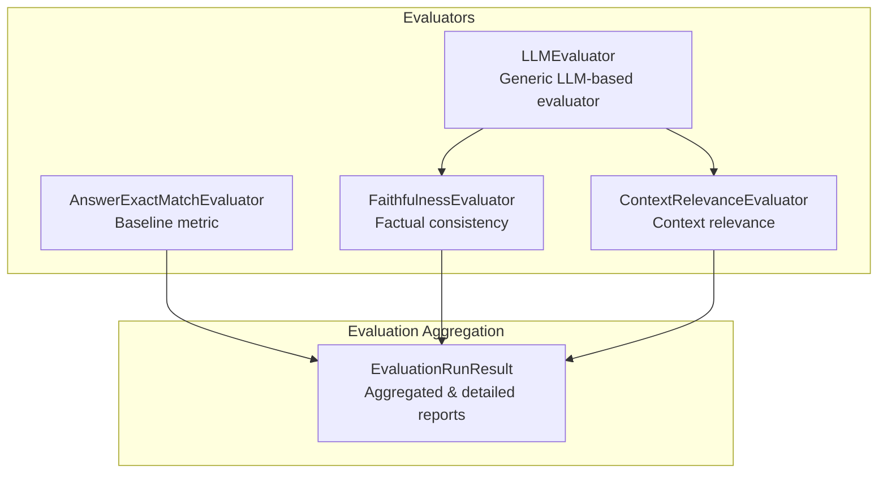
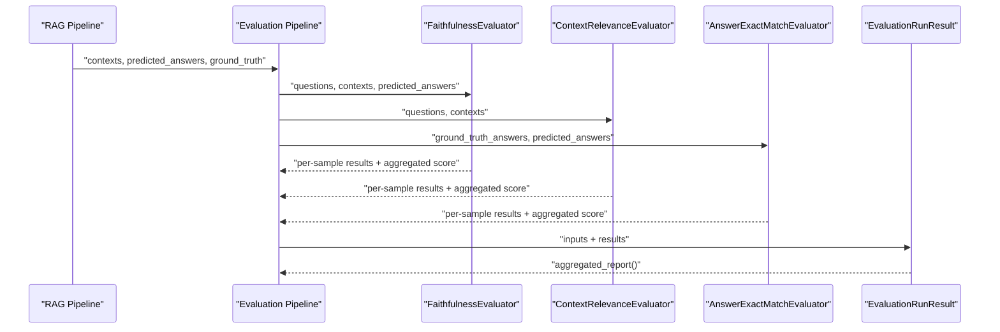
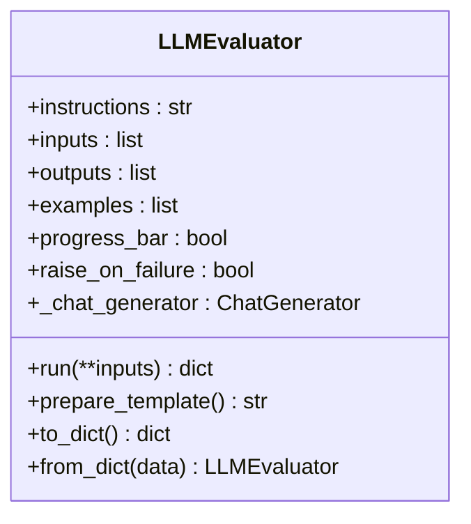
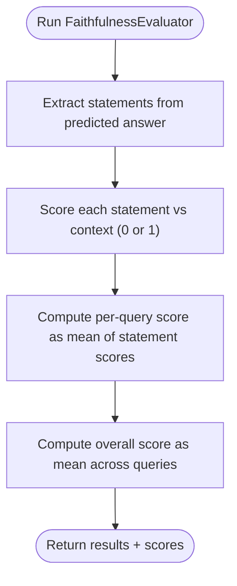
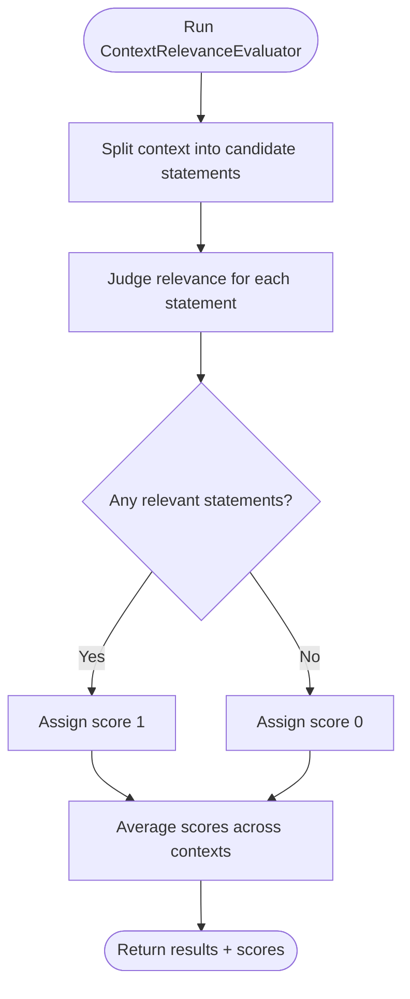
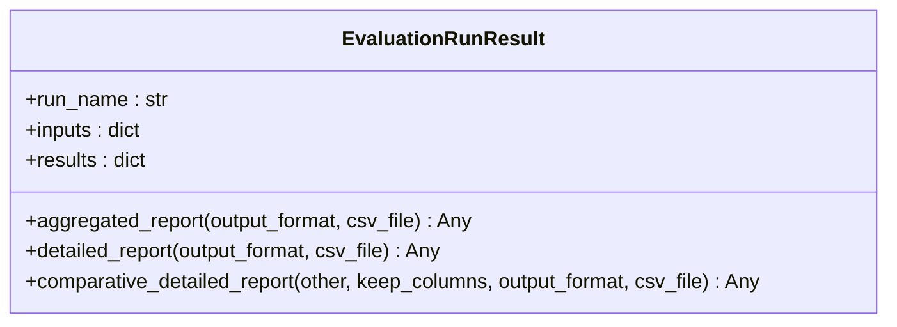
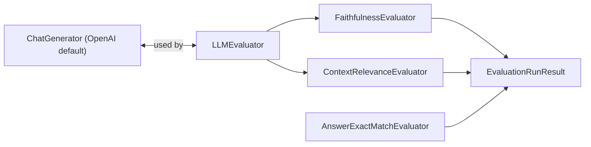

# Model-Based Evaluation

<cite>
**Referenced Files in This Document**
- [__init__.py](file://haystack/components/evaluators/__init__.py)
- [llm_evaluator.py](file://haystack/components/evaluators/llm_evaluator.py)
- [faithfulness.py](file://haystack/components/evaluators/faithfulness.py)
- [context_relevance.py](file://haystack/components/evaluators/context_relevance.py)
- [answer_exact_match.py](file://haystack/components/evaluators/answer_exact_match.py)
- [eval_run_result.py](file://haystack/evaluation/eval_run_result.py)
- [test_llm_evaluator.py](file://test/components/evaluators/test_llm_evaluator.py)
- [test_faithfulness_evaluator.py](file://test/components/evaluators/test_faithfulness_evaluator.py)
- [test_context_relevance_evaluator.py](file://test/components/evaluators/test_context_relevance_evaluator.py)
- [test_evaluation_pipeline.py](file://e2e/pipelines/test_evaluation_pipeline.py)
</cite>

## Table of Contents
1. [Introduction](#introduction)
2. [Project Structure](#project-structure)
3. [Core Components](#core-components)
4. [Architecture Overview](#architecture-overview)
5. [Detailed Component Analysis](#detailed-component-analysis)
6. [Dependency Analysis](#dependency-analysis)
7. [Performance Considerations](#performance-considerations)
8. [Troubleshooting Guide](#troubleshooting-guide)
9. [Conclusion](#conclusion)
10. [Appendices](#appendices)

## Introduction
This document explains how to perform model-based evaluation using Large Language Models (LLMs) in Haystack. It focuses on three key LLM-based evaluators:
- Faithfulness evaluation: measures factual consistency between predicted answers and provided contexts.
- Context relevance assessment: determines whether provided context sentences are necessary for answering a question.
- Answer quality scoring: demonstrates how to define custom LLM-based metrics via the generic LLMEvaluator.

It also covers prompt engineering techniques, evaluation workflow from query processing to score generation, configuration options for different LLM providers, practical examples for RAG pipelines, prompt template customization, scoring interpretation, performance optimization, cost-aware strategies, batch processing, result reliability, and integration with existing evaluation pipelines.

## Project Structure
The evaluation-related components live under haystack/components/evaluators and the evaluation result aggregation utility under haystack/evaluation.

**Diagram sources**
- [__init__.py](file://haystack/components/evaluators/__init__.py#L10-L20)
- [llm_evaluator.py](file://haystack/components/evaluators/llm_evaluator.py#L22-L52)
- [faithfulness.py](file://haystack/components/evaluators/faithfulness.py#L50-L85)
- [context_relevance.py](file://haystack/components/evaluators/context_relevance.py#L41-L98)
- [answer_exact_match.py](file://haystack/components/evaluators/answer_exact_match.py#L10-L36)
- [eval_run_result.py](file://haystack/evaluation/eval_run_result.py#L18-L43)

**Section sources**
- [__init__.py](file://haystack/components/evaluators/__init__.py#L10-L20)

## Core Components
- LLMEvaluator: Generic evaluator that composes a structured prompt from instructions, examples, and inputs, sends it to a ChatGenerator, parses the resulting JSON into outputs, and returns per-sample results plus aggregated metrics.
- FaithfulnessEvaluator: Specialized evaluator that splits predicted answers into statements and checks each against provided contexts; aggregates per-query and overall scores.
- ContextRelevanceEvaluator: Specialized evaluator that extracts relevant sentences from context for a given question; assigns binary scores per context and averages them.
- AnswerExactMatchEvaluator: Baseline string-matching metric for comparison with model-based metrics.
- EvaluationRunResult: Utility to aggregate and export evaluation results in JSON, CSV, or DataFrame formats, including comparative reporting across runs.

Key capabilities:
- Prompt engineering via structured templates with instructions, JSON output schema, examples, and dynamic inputs.
- Configurable ChatGenerator backend (default OpenAI in JSON mode; can be swapped).
- Batch processing over aligned input lists with progress bar support.
- Robust error handling with optional strictness and metadata propagation.

**Section sources**
- [llm_evaluator.py](file://haystack/components/evaluators/llm_evaluator.py#L22-L52)
- [faithfulness.py](file://haystack/components/evaluators/faithfulness.py#L50-L85)
- [context_relevance.py](file://haystack/components/evaluators/context_relevance.py#L41-L98)
- [answer_exact_match.py](file://haystack/components/evaluators/answer_exact_match.py#L10-L36)
- [eval_run_result.py](file://haystack/evaluation/eval_run_result.py#L18-L43)

## Architecture Overview
The evaluation pipeline integrates LLM-based evaluators into a Haystack Pipeline, feeding them question-answer-context triplets produced by a RAG pipeline. Results are aggregated and exported for analysis.

**Diagram sources**
- [test_evaluation_pipeline.py](file://e2e/pipelines/test_evaluation_pipeline.py#L207-L238)
- [faithfulness.py](file://haystack/components/evaluators/faithfulness.py#L149-L182)
- [context_relevance.py](file://haystack/components/evaluators/context_relevance.py#L159-L188)
- [answer_exact_match.py](file://haystack/components/evaluators/answer_exact_match.py#L38-L69)
- [eval_run_result.py](file://haystack/evaluation/eval_run_result.py#L122-L163)

## Detailed Component Analysis

### LLMEvaluator
- Purpose: Generic LLM-based evaluator that builds a prompt from instructions, examples, and inputs, invokes a ChatGenerator, and parses the response into a specified JSON schema.
- Inputs: Dynamic list-typed inputs defined at initialization; validated to be aligned in length.
- Outputs: A list of per-sample dictionaries matching the declared output keys; optional metadata propagated from the generator.
- Prompt engineering: The template combines instructions, JSON schema declaration, examples, and a placeholder for inputs.
- Provider configuration: Defaults to OpenAI ChatGenerator in JSON mode; can be overridden with any ChatGenerator instance configured for JSON output.
- Error handling: Supports strict or lenient behavior; logs failures and can return None entries for failed samples.

**Diagram sources**
- [llm_evaluator.py](file://haystack/components/evaluators/llm_evaluator.py#L22-L113)
- [llm_evaluator.py](file://haystack/components/evaluators/llm_evaluator.py#L178-L241)
- [llm_evaluator.py](file://haystack/components/evaluators/llm_evaluator.py#L243-L286)

**Section sources**
- [llm_evaluator.py](file://haystack/components/evaluators/llm_evaluator.py#L54-L113)
- [llm_evaluator.py](file://haystack/components/evaluators/llm_evaluator.py#L178-L241)
- [llm_evaluator.py](file://haystack/components/evaluators/llm_evaluator.py#L243-L286)
- [test_llm_evaluator.py](file://test/components/evaluators/test_llm_evaluator.py#L14-L76)

### FaithfulnessEvaluator
- Purpose: Measures whether a predicted answer can be inferred from provided contexts by splitting the answer into statements and scoring each.
- Inputs: questions, contexts (nested list), predicted_answers.
- Outputs: statements, statement_scores, per-query score, and overall score.
- Scoring: Per-query score is the mean of statement scores; overall score is the mean across queries.
- Prompt engineering: Includes explicit instructions to extract statements and score them; uses default few-shot examples.

**Diagram sources**
- [faithfulness.py](file://haystack/components/evaluators/faithfulness.py#L128-L147)
- [faithfulness.py](file://haystack/components/evaluators/faithfulness.py#L149-L182)

**Section sources**
- [faithfulness.py](file://haystack/components/evaluators/faithfulness.py#L87-L147)
- [faithfulness.py](file://haystack/components/evaluators/faithfulness.py#L149-L182)
- [test_faithfulness_evaluator.py](file://test/components/evaluators/test_faithfulness_evaluator.py#L170-L210)

### ContextRelevanceEvaluator
- Purpose: Determines whether context sentences are relevant to answer a question; returns relevant statements and a binary score per context.
- Inputs: questions, contexts (list of lists).
- Outputs: relevant_statements and a binary score per context; overall score is the mean across contexts.
- Prompt engineering: Instructs extraction of only sentences required to answer the question; empty list indicates irrelevance.

**Diagram sources**
- [context_relevance.py](file://haystack/components/evaluators/context_relevance.py#L140-L157)
- [context_relevance.py](file://haystack/components/evaluators/context_relevance.py#L159-L188)

**Section sources**
- [context_relevance.py](file://haystack/components/evaluators/context_relevance.py#L100-L157)
- [context_relevance.py](file://haystack/components/evaluators/context_relevance.py#L159-L188)
- [test_context_relevance_evaluator.py](file://test/components/evaluators/test_context_relevance_evaluator.py#L141-L172)

### AnswerExactMatchEvaluator
- Purpose: Baseline metric comparing predicted answers to ground truth using exact string equality.
- Inputs: ground_truth_answers, predicted_answers (same length).
- Outputs: per-sample 0/1 and overall proportion.

**Section sources**
- [answer_exact_match.py](file://haystack/components/evaluators/answer_exact_match.py#L38-L69)

### EvaluationRunResult
- Purpose: Aggregates evaluation results across multiple metrics and samples, and produces reports in JSON, CSV, or DataFrame.
- Features: Aggregated report (metric names and scores), detailed report (inputs + per-metric individual scores), comparative detailed report across runs, and CSV export with validation.

**Diagram sources**
- [eval_run_result.py](file://haystack/evaluation/eval_run_result.py#L18-L43)
- [eval_run_result.py](file://haystack/evaluation/eval_run_result.py#L122-L163)

**Section sources**
- [eval_run_result.py](file://haystack/evaluation/eval_run_result.py#L18-L43)
- [eval_run_result.py](file://haystack/evaluation/eval_run_result.py#L122-L163)
- [eval_run_result.py](file://haystack/evaluation/eval_run_result.py#L165-L231)

## Dependency Analysis
- LLMEvaluator depends on a ChatGenerator backend (default OpenAI in JSON mode) and uses a PromptBuilder to construct prompts.
- FaithfulnessEvaluator and ContextRelevanceEvaluator inherit from LLMEvaluator and override instructions, inputs, outputs, and post-processing logic.
- EvaluationRunResult consumes results from multiple evaluators and provides unified reporting.

**Diagram sources**
- [llm_evaluator.py](file://haystack/components/evaluators/llm_evaluator.py#L106-L110)
- [faithfulness.py](file://haystack/components/evaluators/faithfulness.py#L139-L147)
- [context_relevance.py](file://haystack/components/evaluators/context_relevance.py#L149-L157)
- [eval_run_result.py](file://haystack/evaluation/eval_run_result.py#L18-L43)

**Section sources**
- [llm_evaluator.py](file://haystack/components/evaluators/llm_evaluator.py#L106-L110)
- [faithfulness.py](file://haystack/components/evaluators/faithfulness.py#L139-L147)
- [context_relevance.py](file://haystack/components/evaluators/context_relevance.py#L149-L157)

## Performance Considerations
- Cost optimization
  - Use smaller, fast models for initial screening or batch evaluation where acceptable.
  - Enable deterministic seeding in generation kwargs to reduce variance across runs.
  - Limit examples and prompt length; reuse common instruction templates.
- Throughput
  - Leverage batch processing via aligned input lists; the evaluators iterate over zipped inputs.
  - Use progress bars judiciously; disable in production to reduce overhead.
- Reliability
  - Set raise_on_failure appropriately; in production, prefer lenient mode and log failures for later inspection.
  - Validate input alignment and lengths to avoid partial failures.
- Provider configuration
  - Replace the default ChatGenerator with a provider-specific implementation configured for JSON output.
  - Ensure the generator returns valid JSON matching the declared outputs.

[No sources needed since this section provides general guidance]

## Troubleshooting Guide
Common issues and resolutions:
- Missing or invalid environment variables for default provider
  - Symptom: Initialization error when no API key is set.
  - Resolution: Provide a ChatGenerator instance or set the appropriate environment variable.
- Mismatched input lengths
  - Symptom: Validation error indicating inconsistent list lengths.
  - Resolution: Ensure all input lists passed to run() have equal length.
- Missing expected output keys
  - Symptom: JSON parsing error when returned keys do not match declared outputs.
  - Resolution: Align the ChatGenerator’s JSON schema with the evaluator’s outputs.
- API failures
  - Behavior: With raise_on_failure=True, exceptions are raised; with False, None entries are recorded and warnings logged.
- Metadata availability
  - Some providers populate metadata (e.g., token usage); check the meta field in results.

**Section sources**
- [test_llm_evaluator.py](file://test/components/evaluators/test_llm_evaluator.py#L36-L46)
- [test_llm_evaluator.py](file://test/components/evaluators/test_llm_evaluator.py#L293-L316)
- [test_llm_evaluator.py](file://test/components/evaluators/test_llm_evaluator.py#L417-L457)
- [test_faithfulness_evaluator.py](file://test/components/evaluators/test_faithfulness_evaluator.py#L256-L296)
- [test_context_relevance_evaluator.py](file://test/components/evaluators/test_context_relevance_evaluator.py#L209-L239)

## Conclusion
Haystack’s model-based evaluation stack provides robust, extensible components for assessing RAG pipelines. The generic LLMEvaluator enables flexible prompt engineering, while specialized evaluators like FaithfulnessEvaluator and ContextRelevanceEvaluator deliver domain-relevant metrics. Combined with EvaluationRunResult, teams can aggregate, compare, and export evaluation outcomes efficiently. Proper configuration of ChatGenerators, careful prompt design, and thoughtful error handling are essential for reliable, cost-effective evaluations.

[No sources needed since this section summarizes without analyzing specific files]

## Appendices

### Practical Examples and Workflows

- Evaluating RAG pipeline responses
  - Steps:
    1. Run your RAG pipeline to produce questions, contexts, and predicted answers.
    2. Build evaluation inputs and run FaithfulnessEvaluator and ContextRelevanceEvaluator.
    3. Optionally include AnswerExactMatchEvaluator for baseline comparison.
    4. Aggregate results with EvaluationRunResult and export reports.
  - Evidence of end-to-end usage in tests:
    - Aggregated metrics include Faithfulness and Contextual Relevance among others.

**Section sources**
- [test_evaluation_pipeline.py](file://e2e/pipelines/test_evaluation_pipeline.py#L207-L238)

### Prompt Engineering Techniques
- Structure
  - Instructions: Clear, concise directive for the LLM’s role.
  - JSON schema declaration: Explicitly instruct the model to return a JSON with specific keys.
  - Few-shot examples: Demonstrate input-output pairs to anchor reasoning.
  - Inputs section: Inject dynamic values via a templated prompt.
- Best practices
  - Keep instructions unambiguous and scoped to the task.
  - Provide diverse examples covering edge cases.
  - Validate JSON schema alignment with outputs declared in the evaluator.

**Section sources**
- [llm_evaluator.py](file://haystack/components/evaluators/llm_evaluator.py#L243-L286)

### Configuration Options for LLM Providers
- Default provider
  - OpenAI ChatGenerator in JSON mode with deterministic seed.
- Custom provider
  - Pass a ChatGenerator instance configured for JSON output to the evaluator constructors.
- Environment variables
  - Required by default provider; supply via environment or secret injection.

**Section sources**
- [llm_evaluator.py](file://haystack/components/evaluators/llm_evaluator.py#L106-L110)
- [test_llm_evaluator.py](file://test/components/evaluators/test_llm_evaluator.py#L48-L62)

### Evaluation Scoring Interpretation
- FaithfulnessEvaluator
  - Per-query score: mean of statement-level scores; overall score: mean across queries.
  - Missing statements yield zero per-query score.
- ContextRelevanceEvaluator
  - Per-context score: 1 if any relevant statements are extracted, else 0; overall score: mean across contexts.
- AnswerExactMatchEvaluator
  - Proportion of exact matches across predictions.

**Section sources**
- [faithfulness.py](file://haystack/components/evaluators/faithfulness.py#L168-L182)
- [context_relevance.py](file://haystack/components/evaluators/context_relevance.py#L175-L188)
- [answer_exact_match.py](file://haystack/components/evaluators/answer_exact_match.py#L38-L69)

### Batch Processing and Result Reliability
- Batch processing
  - All inputs are zipped together; ensure consistent ordering and lengths.
- Reliability
  - Use raise_on_failure=False for production runs to collect partial results.
  - Monitor metadata for token usage and latency.

**Section sources**
- [llm_evaluator.py](file://haystack/components/evaluators/llm_evaluator.py#L199-L241)
- [test_faithfulness_evaluator.py](file://test/components/evaluators/test_faithfulness_evaluator.py#L256-L296)
- [test_context_relevance_evaluator.py](file://test/components/evaluators/test_context_relevance_evaluator.py#L209-L239)

### Integration with Existing Evaluation Pipelines
- Use EvaluationRunResult to unify outputs from multiple evaluators.
- Comparative reporting across runs to track improvements or regressions.

**Section sources**
- [eval_run_result.py](file://haystack/evaluation/eval_run_result.py#L165-L231)